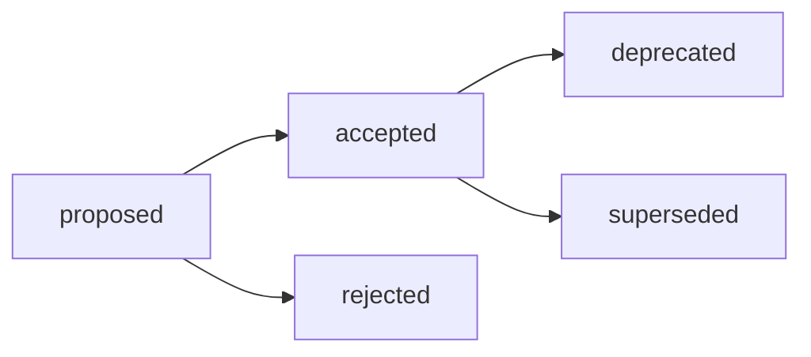

# ADR-003: Структура research, контейнер `exp/` и маршрутизация Research / Analysis / Audit

## Decision Metadata

| Field | Value |
| --- | --- |
| ADR id | ADR-003 |
| Decision type | methodology |
| Decision status | proposed (narrative summary; машиночитаемый canon — frontmatter `status`) |
| Decision date | 2026-07-01 |
| Owner | G-Ivan-A |
| Source | [RFC B-016](../../governance/rfc/2026-06-30-rfc-research-structure.md); issues [#294](https://github.com/G-Ivan-A/hybrid-Intelligence-lab/issues/294), [#290](https://github.com/G-Ivan-A/hybrid-Intelligence-lab/issues/290), [#288](https://github.com/G-Ivan-A/hybrid-Intelligence-lab/issues/288) |
| Impacted artifacts | `standards/research-profile.md`, `standards/research-standard.md` (B-018, будущий), `docs/adr/2026-06-adr-002-artifact-document-methodology.md` (addendum B-019), `standards/glossary.md`, `tools/validate-repository-structure.sh`, `tools/validate-file-naming.sh`, `research/hub/exp-*` |
| Supersedes | `standards/research-profile.md` (effective после удаления профиля в B-021; до этого профиль остаётся legacy-compatible) |
| Superseded by | none |

## Context

RFC B-016 (v0.2,
[`governance/rfc/2026-06-30-rfc-research-structure.md`](../../governance/rfc/2026-06-30-rfc-research-structure.md))
завершён и прошёл локальную валидацию. Он предлагает единый базовый контракт
структуры research-артефактов Хаба и является входом для этого ADR (B-017) и
будущего нормативного стандарта `standards/research-standard.md` (B-018).

Два входящих документа зафиксировали проблемы, которые нельзя устранить точечной
правкой профиля:

- Аудит формата research-артефактов
  ([`docs/audit/2026-06-29-research-artifact-format-contract-audit.md`](../audit/2026-06-29-research-artifact-format-contract-audit.md),
  issue [#290](https://github.com/G-Ivan-A/hybrid-Intelligence-lab/issues/290))
  назвал **коллизию контейнеров**: `standards/research-profile.md` разрешает
  `research/<domain>/exp-<slug>/` с вложенным `outputs/`, тогда как ADR-002 уже
  закрепил run/output-семантику за `runs/`. Явного reconciliation между
  standard-level `exp-<slug>/outputs/` и ADR-level `runs/` не было.
- Инвентаризация Research / Analysis / Audit
  ([`research/hub/2026-06-28-research-analysis-audit-inventory.md`](../../research/hub/2026-06-28-research-analysis-audit-inventory.md),
  issue [#288](https://github.com/G-Ivan-A/hybrid-Intelligence-lab/issues/288))
  показала **размытие типов**: Audit, Research и RFC/proposal часто прячутся под
  `analysis/` и нормируются одним профилем.

Перед созданием нормативного стандарта (B-018) требуется явный **human decision
gate**. Без ADR стандарт `standards/research-standard.md` выглядел бы как прямое
продолжение исполнительской инициативы без принятого решения. Этот ADR фиксирует,
что именно принято из RFC, почему (rationale) и какие архитектурные последствия
это влечёт.

## Decision

Принять модель структуры research-артефактов Хаба из RFC B-016 **без
корректировок**. Приняты четыре связанных решения (детальная модель — в RFC
B-016, разделы Proposal P1–P6):

1. **Целевая структура `research/<domain>/`** с единым контейнером evidence
   `exp/<issue-slug>/` (issue-номер в slug обязателен). Модель — RFC B-016, P1.
2. **Запрет обязательной `outputs/`**: плоская структура внутри `exp/<issue-slug>/`.
   Обоснование и краевые случаи — RFC B-016, P2.
3. **Граница `exp/` (research evidence corpus) vs `runs/` (operational run
   record, ADR-002)**, разводимая одним вопросом-критерием. Формулировка — RFC
   B-016, P3.
4. **Маршрутизация Research / Analysis / Audit по типу задачи, а не по имени
   каталога.** Дерево решений и тай-брейкеры — RFC B-016, P4–P5.

Детальная модель, дерево классификации (P5) и переходный режим legacy `exp-*`
(P6) живут в RFC B-016 и здесь не воспроизводятся. Этот ADR — decision record,
а не proposal: он фиксирует, что модель RFC принята, но не пересказывает её.

## Decision Drivers

- Снятие коллизии `outputs/` ↔ `runs/`: удаление токена `outputs/` убирает саму
  поверхность конфликта с run-семантикой ADR-002.
- Разделение зон: единый контейнер `exp/` изолирует машинный evidence от отчётов,
  а три цепочки Research / Analysis / Audit снимают перегрузку `analysis`.
- Human decision gate: изменение публичного контракта структуры Хаба не должно
  становиться нормой без явного решения (граница RFC → ADR → standard).

## Alternatives Considered

Полный разбор альтернатив (A1–A6), стресс-тест гипотез и trade-offs — в RFC B-016
(разделы [Alternatives](../../governance/rfc/2026-06-30-rfc-research-structure.md#alternatives)
и Critical Analysis). Этот ADR не дублирует их таблицей, а делегирует в source
RFC.

Ключевая развилка, которую закрывает это решение: сохранить legacy sibling
`exp-<slug>/` с обязательной `outputs/` (не снимает коллизию с `runs/`) против
единого `exp/` без `outputs/` (принято). Остальные отклонённые варианты и причины
их отклонения — в RFC B-016.

## Consequences

Это архитектурные последствия принятого решения. Конкретный список задач живёт в
[`governance/backlog.md`](../../governance/backlog.md) (цепочка B-018..B-023) и
здесь не дублируется как план работ.

**Положительные:**

- `research/<domain>/` получает единый предсказуемый контракт: один носитель
  знания (dated report) плюс опциональный контейнер evidence (`exp/`).
- Токен `outputs/` перестаёт конкурировать с `runs/`; граница «знание vs
  операция» становится однозначной.
- Три типа (Research / Analysis / Audit) получают независимые дома и перестают
  маскироваться под `analysis/`.
- Появляется принятое rationale, на которое сможет опереться нормативный стандарт
  B-018 без вида исполнительской инициативы.

**Компромиссы:**

- Переходный период: legacy `exp-<slug>/outputs/` и целевой `exp/<issue-slug>/`
  сосуществуют до миграции. Это осознанный долг; чтение legacy однозначно, потому
  что формат заморожен.
- Routing по типу задачи требует осознанного выбора на старте задачи;
  остаточная субъективность вынесена в open questions RFC как non-blocking.

**Архитектурное следствие для downstream:** принятая модель делегирует
нормативный enforcement и физическую миграцию вниз по цепочке (стандарт B-018,
ADR-002 addendum B-019, glossary B-020, удаление профиля B-021, миграция `exp-*`
B-022, валидаторы B-023). Состав и последовательность этих задач — в RFC B-016
(раздел Impacted Artifacts, таблица downstream chain) и
[`governance/backlog.md`](../../governance/backlog.md); здесь они не дублируются
как план работ.

## Compliance and Validation

- Этот ADR подчиняется [`standards/adr-structure-standard.md`](../../standards/adr-structure-standard.md):
  необходимый frontmatter, обязательные body-секции и правила identification.
- ADR не меняет валидаторы research-формата (это B-023). Регистрация нового ADR
  как active artifact (allowlist структуры, artifact-map, CHANGELOG) — обычная
  постановка на учёт, а не изменение research-format-логики.
- Локальная проверка в этом PR:

  ```bash
  ./tools/validate-frontmatter.sh .
  ./tools/validate-file-naming.sh
  ./tools/validate-repository-structure.sh
  python3 tools/generate-manifest.py --check
  ```

- Нормативный enforcement принятой модели (`exp/`, запрет `outputs/`, routing)
  делегирован стандарту B-018 и валидаторам B-023.

## Lifecycle

Текущий статус: `proposed`. Переход в `accepted` — только по явному human
review/merge решению owner'а (см. lifecycle
[`standards/adr-structure-standard.md`](../../standards/adr-structure-standard.md)).
Merge этого PR фиксирует human decision gate B-017.



- `accepted` requires explicit human review or merge decision.
- Review trigger: изменение принятой модели структуры research потребует нового
  RFC/ADR, а не правки этого record.
- Supersession: `superseded` требует backlink на заменяющий ADR/RFC.

После acceptance RFC B-016 переводится в `accepted` (он остаётся носителем
context, alternatives и trade-offs), а обязательная норма делегируется стандарту
B-018 и ADR-002 addendum B-019.

## Related Artifacts

- [RFC B-016: Структура research, контейнер `exp/` и маршрутизация](../../governance/rfc/2026-06-30-rfc-research-structure.md) —
  источник этого решения; сохраняет alternatives, trade-offs и rationale.
- [Audit: Research artifact format contract](../audit/2026-06-29-research-artifact-format-contract-audit.md)
  (issue [#290](https://github.com/G-Ivan-A/hybrid-Intelligence-lab/issues/290)) —
  коллизия `exp-<slug>/outputs/` vs `runs/`.
- [Research / Analysis / Audit inventory](../../research/hub/2026-06-28-research-analysis-audit-inventory.md)
  (issue [#288](https://github.com/G-Ivan-A/hybrid-Intelligence-lab/issues/288)) —
  размытие типов и план трёх цепочек.
- [`standards/research-profile.md`](../../standards/research-profile.md) — legacy
  source коллизии; superseded этим решением после B-021.
- [ADR-002: Методология создания и управления артефактами](2026-06-adr-002-artifact-document-methodology.md) —
  routing `runs/` и lifecycle артефактов; получает addendum B-019.
- [`standards/adr-structure-standard.md`](../../standards/adr-structure-standard.md) —
  контракт ADR.
- [`governance/backlog.md`](../../governance/backlog.md) — цепочка B-016..B-023.
- Issue [#294](https://github.com/G-Ivan-A/hybrid-Intelligence-lab/issues/294) —
  зонтичная задача стандартизации research.
