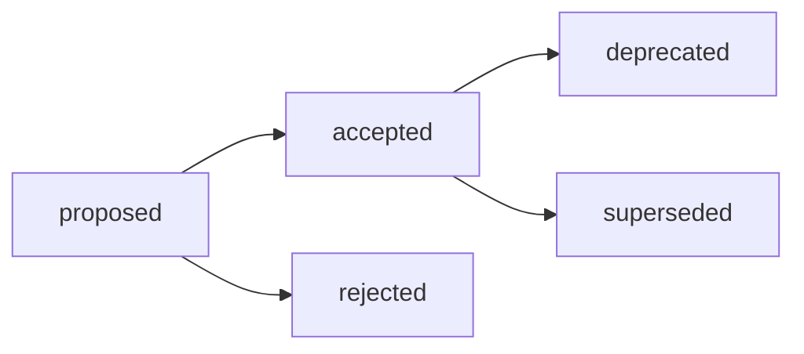

# ADR-003: Структура research, контейнер `exp/` и маршрутизация Research / Analysis / Audit

## Decision Metadata

| Field | Value |
| --- | --- |
| ADR id | ADR-003 |
| Decision type | methodology |
| Decision status | proposed (narrative summary; машиночитаемый canon — frontmatter `status`) |
| Decision date | 2026-07-01 |
| Owner | G-Ivan-A |
| Source | [RFC B-016](../../governance/rfc/2026-06-30-rfc-research-structure.md); issues [#294](https://github.com/G-Ivan-A/hybrid-Intelligence-lab/issues/294), [#290](https://github.com/G-Ivan-A/hybrid-Intelligence-lab/issues/290), [#288](https://github.com/G-Ivan-A/hybrid-Intelligence-lab/issues/288) |
| Impacted artifacts | `standards/research-profile.md`, `standards/research-standard.md` (B-018, будущий), `docs/adr/2026-06-adr-002-artifact-document-methodology.md` (addendum B-019), `standards/glossary.md`, `tools/validate-repository-structure.sh`, `tools/validate-file-naming.sh`, `research/hub/exp-*` |
| Supersedes | `standards/research-profile.md` (effective после удаления профиля в B-021; до этого профиль остаётся legacy-compatible) |
| Superseded by | none |

## Context

RFC B-016 (v0.2,
[`governance/rfc/2026-06-30-rfc-research-structure.md`](../../governance/rfc/2026-06-30-rfc-research-structure.md))
завершён и прошёл локальную валидацию. Он предлагает единый базовый контракт
структуры research-артефактов Хаба и является входом для этого ADR (B-017) и
будущего нормативного стандарта `standards/research-standard.md` (B-018).

Два входящих документа зафиксировали проблемы, которые нельзя устранить точечной
правкой профиля:

- Аудит формата research-артефактов
  ([`docs/audit/2026-06-29-research-artifact-format-contract-audit.md`](../audit/2026-06-29-research-artifact-format-contract-audit.md),
  issue [#290](https://github.com/G-Ivan-A/hybrid-Intelligence-lab/issues/290))
  назвал **коллизию контейнеров**: `standards/research-profile.md` разрешает
  `research/<domain>/exp-<slug>/` с вложенным `outputs/`, тогда как ADR-002 уже
  закрепил run/output-семантику за `runs/`. Явного reconciliation между
  standard-level `exp-<slug>/outputs/` и ADR-level `runs/` не было.
- Инвентаризация Research / Analysis / Audit
  ([`research/hub/2026-06-28-research-analysis-audit-inventory.md`](../../research/hub/2026-06-28-research-analysis-audit-inventory.md),
  issue [#288](https://github.com/G-Ivan-A/hybrid-Intelligence-lab/issues/288))
  показала **размытие типов**: Audit, Research и RFC/proposal часто прячутся под
  `analysis/` и нормируются одним профилем.

Перед созданием нормативного стандарта (B-018) требуется явный **human decision
gate**. Без ADR стандарт `standards/research-standard.md` выглядел бы как прямое
продолжение исполнительской инициативы без принятого решения. Этот ADR фиксирует,
что именно принято из RFC, почему (rationale) и какие архитектурные последствия
это влечёт.

## Decision

Принять модель структуры research-артефактов Хаба из RFC B-016 **без
корректировок**. Приняты четыре связанных решения:

1. **Целевая структура `research/<domain>/`.** Основной носитель research-вывода
   остаётся дата-первым Markdown-отчётом `research/<domain>/YYYY-MM-DD-name.md`.
   Воспроизводимая доказательная база собирается в **единый контейнер
   `research/<domain>/exp/<issue-slug>/`**, а не россыпью sibling-папок
   `exp-<slug>/` на уровне отчётов. `<issue-slug>` ОБЯЗАН включать номер issue
   для traceability (например, `exp/research-structure-302/`).

2. **Запрет `outputs/`.** Внутри `exp/<issue-slug>/` применяется **плоская
   структура**: `README.md`, скрипт и зафиксированные результаты лежат рядом, без
   обязательных подпапок `inputs/` и `outputs/`. Опциональная группировка по роли
   данных (например, `data/`) допускается только при реальной операционной боли,
   но обязательная папка `outputs/` запрещена.

3. **Граница `exp/` vs `runs/`.** `exp/<issue-slug>/` — это research evidence
   corpus, который ВСЕГДА ссылается на родительский dated report и существует ради
   knowledge claim. `runs/` (ADR-002) — operational run record, который фиксирует
   факт выполнения задачи/pipeline и не обязан быть привязан к research-отчёту.
   Критерий разведения — один вопрос исполнителю: артефакт существует, чтобы
   **доказать утверждение в research-отчёте** (→ `exp/`), или чтобы
   **зафиксировать факт выполнения** (→ `runs/`)?

4. **Маршрутизация Research / Analysis / Audit по типу задачи, а не по имени
   каталога.** Research → `research/<domain>/`, Analysis → `docs/analysis/`,
   Audit → `docs/audit/`, operational run → `runs/`. Тип определяется
   содержательной ролью документа: аудит, спрятанный в `docs/analysis/`, остаётся
   Audit.

Детальная модель, дерево решений классификации (P5), тай-брейкеры и переходный
режим legacy `exp-*` (P6) остаются в RFC B-016 и не дублируются здесь. Этот ADR —
decision record, а не proposal.

## Decision Drivers

- Снятие коллизии `outputs/` ↔ `runs/`: удаление токена `outputs/` убирает саму
  поверхность конфликта с run-семантикой ADR-002.
- Единый контейнер `exp/` изолирует машинный evidence от human-readable отчётов и
  даёт одно предсказуемое место для будущего validator-scope и exclude из mkdocs.
- Три независимые цепочки Research / Analysis / Audit вместо одного размытого
  профиля устраняют перегрузку `analysis`.
- Human decision gate обязателен: изменение публичного контракта структуры Хаба
  не должно превращаться в норму без явного решения (граница RFC → ADR →
  standard).

## Alternatives Considered

Полный разбор альтернатив, стресс-тест гипотез и trade-offs сохранены в RFC B-016
(разделы Alternatives и Critical Analysis). Ключевые отклонённые варианты:

| Alternative | Why rejected |
| --- | --- |
| Сохранить sibling `exp-<slug>/` с `outputs/` (рекомендация аудита №3). | Не снимает коллизию `outputs/` ↔ `runs/` и оставляет ambiguous future contract. |
| Вернуться к md-only (папки запрещены). | Ухудшает воспроизводимость; аудит явно рекомендовал НЕ делать md-only общим правилом. |
| Перенести research-эксперименты целиком в `runs/`. | Стирает границу «знание vs операция»; research evidence теряет привязку к parent report. |
| Нормировать Research / Analysis / Audit одним профилем (как сейчас). | Закрепляет перегрузку `analysis` и смешение типов. |
| Сразу писать стандарт без RFC/ADR. | Теряет rationale, альтернативы и human decision gate. |

## Consequences

Это архитектурные последствия принятого решения. Конкретный список задач живёт в
[`governance/backlog.md`](../../governance/backlog.md) (цепочка B-018..B-023) и
здесь не дублируется как план работ.

**Положительные:**

- `research/<domain>/` получает единый предсказуемый контракт: один носитель
  знания (dated report) плюс опциональный контейнер evidence (`exp/`).
- Токен `outputs/` перестаёт конкурировать с `runs/`; граница «знание vs
  операция» становится однозначной.
- Три типа (Research / Analysis / Audit) получают независимые дома и перестают
  маскироваться под `analysis/`.
- Появляется принятое rationale, на которое сможет опереться нормативный стандарт
  B-018 без вида исполнительской инициативы.

**Компромиссы:**

- Переходный период: legacy `exp-<slug>/outputs/` и целевой `exp/<issue-slug>/`
  сосуществуют до миграции. Это осознанный долг; чтение legacy однозначно, потому
  что формат заморожен.
- Routing по типу задачи требует осознанного выбора на старте задачи;
  остаточная субъективность вынесена в open questions RFC как non-blocking.

**Архитектурные следствия для downstream (не задачи к исполнению в этом ADR):**

- `standards/research-standard.md` (B-018) нормативно кодифицирует `exp/`, запрет
  `outputs/` и routing, заменяя `standards/research-profile.md`.
- ADR-002 получает addendum (B-019), фиксирующий границу `exp/` vs `runs/` без
  конфликта с его routing-таблицей.
- `standards/glossary.md` закрепляет термины Research / Analysis / Audit / RFC /
  ADR / Standard (B-020).
- `standards/research-profile.md` удаляется после замены стандартом (B-021); до
  этого момента остаётся legacy-compatible источником для чтения `exp-*`.
- Физическая миграция `exp-*` → `exp/` без `outputs/` (B-022) и обновление
  валидаторов под `exp/` и routing (B-023) выполняются как implementation
  follow-up **после** стандарта, а не в этом ADR.

## Compliance and Validation

- Этот ADR подчиняется [`standards/adr-structure-standard.md`](../../standards/adr-structure-standard.md):
  необходимый frontmatter, обязательные body-секции и правила identification.
- ADR не меняет валидаторы research-формата (это B-023). Регистрация нового ADR
  как active artifact (allowlist структуры, artifact-map, CHANGELOG) — обычная
  постановка на учёт, а не изменение research-format-логики.
- Локальная проверка в этом PR:

  ```bash
  ./tools/validate-frontmatter.sh .
  ./tools/validate-file-naming.sh
  ./tools/validate-repository-structure.sh
  python3 tools/generate-manifest.py --check
  ```

- Нормативный enforcement принятой модели (`exp/`, запрет `outputs/`, routing)
  делегирован стандарту B-018 и валидаторам B-023.

## Lifecycle

Текущий статус: `proposed`. Переход в `accepted` — только по явному human
review/merge решению owner'а (см. lifecycle
[`standards/adr-structure-standard.md`](../../standards/adr-structure-standard.md)).
Merge этого PR фиксирует human decision gate B-017.



- `accepted` requires explicit human review or merge decision.
- Review trigger: изменение принятой модели структуры research потребует нового
  RFC/ADR, а не правки этого record.
- Supersession: `superseded` требует backlink на заменяющий ADR/RFC.

После acceptance RFC B-016 переводится в `accepted` (он остаётся носителем
context, alternatives и trade-offs), а обязательная норма делегируется стандарту
B-018 и ADR-002 addendum B-019.

## Related Artifacts

- [RFC B-016: Структура research, контейнер `exp/` и маршрутизация](../../governance/rfc/2026-06-30-rfc-research-structure.md) —
  источник этого решения; сохраняет alternatives, trade-offs и rationale.
- [Audit: Research artifact format contract](../audit/2026-06-29-research-artifact-format-contract-audit.md)
  (issue [#290](https://github.com/G-Ivan-A/hybrid-Intelligence-lab/issues/290)) —
  коллизия `exp-<slug>/outputs/` vs `runs/`.
- [Research / Analysis / Audit inventory](../../research/hub/2026-06-28-research-analysis-audit-inventory.md)
  (issue [#288](https://github.com/G-Ivan-A/hybrid-Intelligence-lab/issues/288)) —
  размытие типов и план трёх цепочек.
- [`standards/research-profile.md`](../../standards/research-profile.md) — legacy
  source коллизии; superseded этим решением после B-021.
- [ADR-002: Методология создания и управления артефактами](2026-06-adr-002-artifact-document-methodology.md) —
  routing `runs/` и lifecycle артефактов; получает addendum B-019.
- [`standards/adr-structure-standard.md`](../../standards/adr-structure-standard.md) —
  контракт ADR.
- [`governance/backlog.md`](../../governance/backlog.md) — цепочка B-016..B-023.
- Issue [#294](https://github.com/G-Ivan-A/hybrid-Intelligence-lab/issues/294) —
  зонтичная задача стандартизации research.
