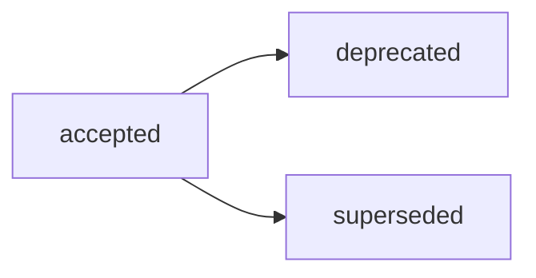

# ADR-004: Структура Reports и routing `docs/report/`

## Decision Metadata

| Field | Value |
| --- | --- |
| ADR id | ADR-004 |
| Decision type | methodology |
| Decision status | accepted (narrative summary; машиночитаемый canon — frontmatter `status`) |
| Decision date | 2026-07-02 |
| Owner | G-Ivan-A |
| Source | [RFC B-041](../../governance/rfc/2026-07-02-rfc-reports-structure.md); issue [#338](https://github.com/G-Ivan-A/hybrid-Intelligence-lab/issues/338); upstream issue [#328](https://github.com/G-Ivan-A/hybrid-Intelligence-lab/issues/328) |
| Impacted artifacts | `standards/report-standard.md` (B-043), `docs/adr/2026-06-adr-002-artifact-document-methodology.md`, `docs/report/*`, `docs/audit/*`, `research/<domain>/exp/*`, `standards/frontmatter-docs-standard.md`, `standards/glossary.md`, `governance/backlog.md`, `governance/artifact-map.md` |
| Supersedes | ADR-002 routing table row `Report -> docs/reports/` for Reports routing only; replacement route is `docs/report/` |
| Superseded by | none |

## Context

RFC B-041
([`governance/rfc/2026-07-02-rfc-reports-structure.md`](../../governance/rfc/2026-07-02-rfc-reports-structure.md))
completed the proposal-stage work for Reports artifacts after the Reports
inventory and industry-norms research. It recommends a base Report standard with
light subtype profiles and asks for a human decision gate before the normative
standard B-043 is created.

The decision is needed now because ADR-002 still contains the routing table row
`Report -> docs/reports/`, while founder vision, the Reports inventory, and live
repository practice use `docs/report/`. Without this ADR, B-043 would inherit a
competing routing source and the Reports standardization chain would remain
blocked.

This ADR records the accepted decision. It does not create the Report standard,
does not migrate files, and does not restate the RFC proposal, alternatives, or
impacted-artifact matrix.

## Decision

Accept **Вариант C (Variant C)** from RFC B-041: one base Report standard with lightweight
profiles for `audit`, `report`, and `statistics`. The detailed model, subtype
shape, relation frontmatter, and boundary rationale remain in RFC B-041.

Set the canonical Reports route to **`docs/report/`** (singular). Reconcile the
ADR-002 routing table drift by treating `docs/reports/` as superseded by
`docs/report/` for Reports routing. ADR-002 remains the general artifact-routing
decision record; this ADR is the later decision source for the Reports row.

Delegate the binding rule text to `standards/report-standard.md` (B-043) and
physical modernization or migration to B-044. This ADR does not rename or move
existing files.

Open questions from RFC B-041 are resolved or delegated as follows:

| Open question | ADR status |
| --- | --- |
| Физический дом audit reports (`docs/report/` vs `docs/audit/`) | Delegated to B-043 and future Audit standard B-030. Accepted invariant: `report-subtype: audit` identifies audit reports semantically; path enforcement and migration are not done in this ADR. |
| Statistics vs research evidence | Delegated to B-043 and research-evidence policy. Accepted invariant: reproducible evidence remains in `research/<domain>/exp/*`; a publishable Report mirror is created only when it needs its own lifecycle. |
| Триггер B for extracting a subtype profile into a separate standard | Accepted as an anti-inflation criterion: extract only when repeated subtype-specific mandatory rules or review pain make the base Report standard unclear. Operational thresholds are specified in B-043. |

## Decision Drivers

- Single routing source: `docs/report/` removes the ADR-002 `docs/reports/`
  drift before the Report standard becomes normative.
- Anti-Inflation: one base standard with profiles avoids three premature
  standards while preserving a future split path.
- Boundary discipline: Report remains a durable output class, while Analysis,
  Audit, and Research evidence keep their own process or evidence semantics.
- Decision gate: B-043 should be based on an accepted decision, not only on an
  RFC proposal.

## Alternatives Considered

Full alternatives A/B/C/D, trade-offs, and stress tests are in RFC B-041,
especially the Alternatives and Critical Analysis sections. This ADR delegates
that proposal-stage material to the source RFC.

The decisive fork closed here is whether to accept Variant C and `docs/report/`
or leave Reports split between the RFC recommendation and the older ADR-002
`docs/reports/` row. Variant C and `docs/report/` are accepted.

## Consequences

Architectural consequences:

- `standards/report-standard.md` (B-043) is unblocked and becomes the normative
  owner of Report structure, relation frontmatter, subtype profiles, lifecycle,
  and routing.
- ADR-002 no longer acts as the current source for the Reports routing row; its
  `docs/reports/` value is reconciled by this later ADR decision.
- Existing `docs/report/*`, `docs/audit/*`, and research evidence artifacts are
  not migrated by this ADR. Cleanup and modernization stay downstream.
- The Audit standardization chain keeps ownership of Audit process semantics;
  Report standardization owns only the durable report output shape.

Trade-offs:

- Audit-report path enforcement is intentionally delayed to avoid preempting
  B-043 and B-030.
- Statistics/report mirrors may still require human judgment until the Report
  standard codifies the evidence-vs-report decision tree.

## Compliance and Validation

- This ADR follows
  [`standards/adr-structure-standard.md`](../../standards/adr-structure-standard.md):
  required frontmatter, body sections, section-level delegation, and ADR
  acceptance review rules.
- The ADR explicitly avoids copying RFC B-041 proposal detail, alternatives
  table, and downstream task matrix.
- Repository registration is validated through `governance/artifact-map.md`,
  `governance/backlog.md`, `CHANGELOG.md`, and
  `tools/validate-repository-structure.sh`.
- Local validation for this PR:

  ```bash
  bash experiments/test-frontmatter-validator.sh
  ./tools/validate-file-naming.sh
  ./tools/validate-frontmatter.sh .
  ./tools/validate-repository-structure.sh
  python3 tools/generate-manifest.py --check
  ```

## Lifecycle

Current status: `accepted`. This ADR records the human decision requested in
issue [#338](https://github.com/G-Ivan-A/hybrid-Intelligence-lab/issues/338);
repository acceptance is completed through PR
[#339](https://github.com/G-Ivan-A/hybrid-Intelligence-lab/pull/339).



- Review trigger: changes to the accepted Reports model, canonical routing, or
  ADR-002 reconciliation require a new RFC/ADR or an explicit supersession.
- Supersession: `superseded` requires a backlink to the replacing ADR/RFC.
- Normative enforcement is delegated to B-043; file migration is delegated to
  B-044.

## Related Artifacts

- [RFC B-041: Структура Reports-артефактов](../../governance/rfc/2026-07-02-rfc-reports-structure.md)
  — source RFC with proposal, alternatives, trade-offs, and boundaries.
- [ADR-002: Методология создания и управления артефактами](2026-06-adr-002-artifact-document-methodology.md)
  — earlier artifact-routing decision record with the superseded Reports row.
- [Reports inventory](../analysis/2026-07-01-reports-artifacts-inventory.md)
  — inventory and boundary input for Reports artifacts.
- [Reports industry norms](../../research/hub/2026-06-30-reports-industry-norms-and-standardization-scope.md)
  — source-backed research recommending Variant C.
- [Repository structure concept](../../research/hub/2026-06-23-repository-structure-concept.md)
  — founder vision for Reports as a separate type with `docs/report/` routing.
- [`standards/adr-structure-standard.md`](../../standards/adr-structure-standard.md)
  — ADR structure and section-level delegation rules.
- [`governance/backlog.md`](../../governance/backlog.md) — Reports chain B-038,
  B-041, B-042, B-043, and B-044.
