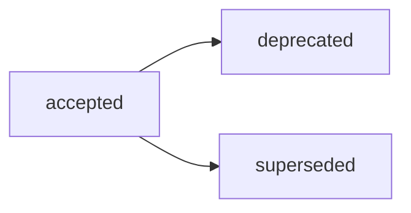

# ADR-004: Структура Reports и routing `docs/report/`

## Decision Metadata

| Field | Value |
| --- | --- |
| ADR id | ADR-004 |
| Decision type | methodology |
| Decision status | accepted (narrative summary; машиночитаемый canon — frontmatter `status`) |
| Decision date | 2026-07-02 |
| Owner | G-Ivan-A |
| Source | [RFC B-041](../../governance/rfc/2026-07-02-rfc-reports-structure.md); issue [#338](https://github.com/G-Ivan-A/hybrid-Intelligence-lab/issues/338); upstream issue [#328](https://github.com/G-Ivan-A/hybrid-Intelligence-lab/issues/328) |
| Impacted artifacts | `standards/report-standard.md` (B-043), `docs/adr/2026-06-adr-002-artifact-document-methodology.md`, `docs/report/*`, `docs/audit/*`, `research/<domain>/exp/*`, `standards/frontmatter-docs-standard.md`, `standards/glossary.md`, `governance/backlog.md`, `governance/artifact-map.md` |
| Supersedes | ADR-002 routing table row `Report -> docs/reports/` for Reports routing only; replacement route is `docs/report/` |
| Superseded by | none |

## Context

RFC B-041
([`governance/rfc/2026-07-02-rfc-reports-structure.md`](../../governance/rfc/2026-07-02-rfc-reports-structure.md))
завершил этап предложения по Reports-артефактам после инвентаризации Reports и
исследования отраслевых норм. Он рекомендует базовый стандарт Report с лёгкими
профилями подтипов и требует человеческой точки принятия решения перед созданием
нормативного стандарта B-043.

Решение нужно сейчас, потому что ADR-002 всё ещё содержит строку таблицы routing
`Report -> docs/reports/`, тогда как видение фаундера, инвентаризация Reports и
живая практика репозитория используют `docs/report/`. Без этого ADR B-043
унаследовал бы конкурирующий источник routing, а цепочка стандартизации Reports
осталась бы заблокированной.

Этот ADR фиксирует принятое решение. Он не создаёт стандарт Report, не мигрирует
файлы и не пересказывает предложение, альтернативы или матрицу затронутых
артефактов из RFC.

## Decision

Принять **Вариант C** из RFC B-041: один базовый стандарт Report с лёгкими
профилями для `audit`, `report` и `statistics`. Детальная модель, форма
подтипов, relation-frontmatter и обоснование границ остаются в RFC B-041.

Установить канонический маршрут Reports как **`docs/report/`** (единственное
число). Реконсилировать дрейф таблицы routing ADR-002: для Reports routing
`docs/reports/` считается замещённым на `docs/report/`. ADR-002 остаётся общим
decision record для маршрутизации артефактов; этот ADR является более поздним
источником решения для строки Reports.

Делегировать обязательный текст правил в `standards/report-standard.md` (B-043),
а физическую модернизацию или миграцию — в B-044. Этот ADR не переименовывает и
не перемещает существующие файлы.

Открытые вопросы из RFC B-041 решены или делегированы следующим образом:

| Открытый вопрос | Статус в ADR |
| --- | --- |
| Физический дом audit reports (`docs/report/` vs `docs/audit/`) | Делегировано в B-043 и будущий стандарт Audit B-030. Зафиксированное соглашение: `report-subtype: audit` семантически идентифицирует audit-отчёты; контроль пути и миграция в этом ADR не выполняются. |
| Statistics vs research evidence | Делегировано в B-043 и политику research evidence. Зафиксированное решение: воспроизводимая доказательная база остаётся в `research/<domain>/exp/*`; публикуемое Report-зеркало создаётся только тогда, когда ему нужен собственный жизненный цикл. |
| Триггер B для выделения subtype-профиля в отдельный стандарт | Принят как критерий против инфляции артефактов: выделять профиль только тогда, когда повторяющиеся обязательные правила для подтипа или боль ревью делают базовый стандарт Report неясным. Операционные пороги будут определены в B-043. |

## Decision Drivers

- Единый routing-источник: `docs/report/` снимает дрейф ADR-002
  `docs/reports/` до того, как стандарт Report станет нормативным.
- Anti-Inflation: один базовый стандарт с профилями избегает трёх преждевременных
  стандартов и сохраняет путь к будущему разделению.
- Дисциплина границ: Report остаётся устойчивым классом выходного артефакта, а
  Analysis, Audit и research evidence сохраняют собственную процессную или
  доказательную семантику.
- Decision gate: B-043 должен опираться на принятое решение, а не только на
  предложение RFC.

## Alternatives Considered

Полные альтернативы A/B/C/D, trade-offs и stress tests находятся в RFC B-041,
особенно в разделах Alternatives и Critical Analysis. Этот ADR делегирует
материал этапа предложения исходному RFC.

Ключевая развилка, которую закрывает это решение: принять Вариант C и
`docs/report/` или оставить Reports разделёнными между рекомендацией RFC и более
старой строкой ADR-002 `docs/reports/`. Вариант C и `docs/report/` приняты.

## Consequences

Это архитектурные последствия принятого решения.

**Архитектурные последствия:**

- `standards/report-standard.md` (B-043) разблокирован и становится нормативным
  владельцем структуры Report, relation-frontmatter, профилей подтипов,
  жизненного цикла и routing.
- ADR-002 больше не является актуальным источником для строки Reports routing;
  его значение `docs/reports/` реконсилировано этим более поздним решением ADR.
- Существующие артефакты `docs/report/*`, `docs/audit/*` и research evidence не
  мигрируются этим ADR. Очистка и модернизация остаются downstream-задачами.
- Цепочка стандартизации Audit сохраняет владение процессной семантикой Audit;
  стандартизация Report владеет только устойчивой формой report-выхода.

**Компромиссы:**

- Контроль пути для audit-отчётов намеренно отложен, чтобы не предвосхищать B-043
  и B-030.
- Statistics/report-зеркала могут всё ещё требовать человеческого выбора, пока
  стандарт Report не кодифицирует дерево решений evidence-vs-report.

## Compliance and Validation

- Этот ADR следует
  [`standards/adr-structure-standard.md`](../../standards/adr-structure-standard.md):
  обязательный frontmatter, body-секции, section-level delegation и правила
  acceptance review для ADR.
- ADR явно избегает копирования proposal-деталей RFC B-041, таблицы альтернатив и
  матрицы downstream-задач.
- Регистрация в репозитории валидируется через `governance/artifact-map.md`,
  `governance/backlog.md`, `CHANGELOG.md` и
  `tools/validate-repository-structure.sh`.
- Локальная проверка в этом PR:

  ```bash
  bash experiments/test-frontmatter-validator.sh
  ./tools/validate-file-naming.sh
  ./tools/validate-frontmatter.sh .
  ./tools/validate-repository-structure.sh
  python3 tools/generate-manifest.py --check
  ```

## Lifecycle

Текущий статус: `accepted`. Этот ADR фиксирует человеческое решение, запрошенное в
issue [#338](https://github.com/G-Ivan-A/hybrid-Intelligence-lab/issues/338);
принятие в репозитории выполнено через PR
[#339](https://github.com/G-Ivan-A/hybrid-Intelligence-lab/pull/339).



- Триггер пересмотра: изменения принятой модели Reports, канонического routing
  или реконсиляции ADR-002 требуют нового RFC/ADR или явного замещения.
- Замещение: `superseded` требует обратную ссылку на заменяющий ADR/RFC.
- Нормативный контроль делегирован в B-043; миграция файлов делегирована в
  B-044.

## Related Artifacts

- [RFC B-041: Структура Reports-артефактов](../../governance/rfc/2026-07-02-rfc-reports-structure.md)
  — исходный RFC с предложением, альтернативами, trade-offs и границами.
- [ADR-002: Методология создания и управления артефактами](2026-06-adr-002-artifact-document-methodology.md)
  — более ранняя запись решения по маршрутизации артефактов с замещённой строкой
  Reports.
- [Reports inventory](../analysis/2026-07-01-reports-artifacts-inventory.md)
  — инвентаризация и входные данные по границам для Reports-артефактов.
- [Reports industry norms](../../research/hub/2026-06-30-reports-industry-norms-and-standardization-scope.md)
  — исследование с источниками, рекомендующее Вариант C.
- [Repository structure concept](../../research/hub/2026-06-23-repository-structure-concept.md)
  — видение фаундера о Reports как отдельном типе с routing `docs/report/`.
- [`standards/adr-structure-standard.md`](../../standards/adr-structure-standard.md)
  — структура ADR и правила section-level delegation.
- [`governance/backlog.md`](../../governance/backlog.md) — цепочка Reports B-038,
  B-041, B-042, B-043 и B-044.
