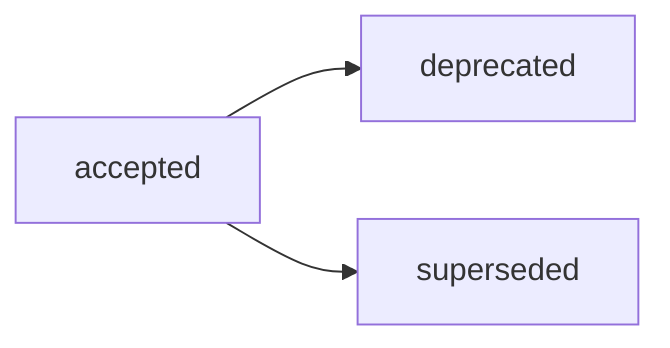

# ADR-005: Структура Audit-артефактов и 4-компонентная модель

## Decision Metadata

| Field | Value |
| --- | --- |
| ADR id | ADR-005 |
| Decision type | methodology |
| Decision status | accepted (narrative summary; машиночитаемый canon — frontmatter `status`) |
| Decision date | 2026-07-02 |
| Owner | G-Ivan-A |
| Source | [RFC B-030](../../governance/rfc/2026-07-02-rfc-audit-structure.md); issue [#358](https://github.com/G-Ivan-A/hybrid-Intelligence-lab/issues/358); upstream issue [#352](https://github.com/G-Ivan-A/hybrid-Intelligence-lab/issues/352); контекст [#296](https://github.com/G-Ivan-A/hybrid-Intelligence-lab/issues/296) |
| Impacted artifacts | `standards/audit-standard.md` (B-032), `standards/report-standard.md` (B-043, профиль audit-report), `docs/audit/*`, `standards/frontmatter-docs-standard.md`, `standards/glossary.md`, `docs/adr/2026-07-adr-004-reports-structure.md`, `governance/backlog.md`, `governance/artifact-map.md` |
| Supersedes | none |
| Superseded by | none |

## Context

RFC B-030
([`governance/rfc/2026-07-02-rfc-audit-structure.md`](../../governance/rfc/2026-07-02-rfc-audit-structure.md))
завершил proposal-этап цепочки стандартизации Audit после углублённого анализа
корпуса B-029
([`docs/analysis/2026-07-02-audit-artifacts-deep-analysis.md`](../analysis/2026-07-02-audit-artifacts-deep-analysis.md)).
Он рекомендует Вариант C (базовый стандарт Audit + 4-компонентная модель +
разграничение процесс/output) и требует человеческой точки принятия решения
перед созданием нормативного стандарта B-032.

Решение нужно сейчас, потому что без принятого decision record нельзя
разблокировать нормативный стандарт Audit (B-032) и последующую модернизацию
Audit-артефактов (B-033): RFC B-030 остаётся proposal, а не решением. Цепочка
Audit зеркалит уже пройденные цепочки Research (B-016 → ADR-003) и Reports
(B-041 → ADR-004), где ADR выступает human decision gate между RFC и стандартом.

Этот ADR фиксирует принятое решение. Он не создаёт стандарт Audit (это B-032),
не мигрирует файлы (это B-033) и не пересказывает предложение, альтернативы,
trade-offs или матрицу затронутых артефактов из RFC B-030.

## Decision

Принять **Вариант C** из RFC B-030: один базовый стандарт Audit с явной
**4-компонентной моделью** процесса (compliance target / evidence model /
verdict-finding / deviation handling) плюс
**разграничение Audit-процесс vs audit-report output**.
Детальная модель, frontmatter Audit, границы стоек и
обоснование выбора остаются в RFC B-030 (разделы Proposal, Alternatives,
Trade-offs, Critical Analysis).

Зафиксировать следующие принятые пункты (детали делегированы в RFC B-030 и
нормируются в B-032):

- **4-компонентная модель — ядро Audit.** Audit определяется связкой
  compliance target / evidence model / verdict-finding / deviation handling, а
  не путём `docs/audit/` и не именем файла (content-over-path, issue #288). Это
  самое стабильное ядро из [B-029 §8](../analysis/2026-07-02-audit-artifacts-deep-analysis.md).
- **Routing `docs/audit/YYYY-MM-DD-name.md`.** Канонический путь Audit-артефактов
  подтверждается как есть. Он уже консистентен и делегирован в
  [`standards/research-standard.md`](../../standards/research-standard.md)
  (routing R/A/A) и [ADR-002](2026-06-adr-002-artifact-document-methodology.md);
  ADR-002-реконсиляция routing **не требуется** (в отличие от цепочки Reports).
- **Frontmatter с audit-specific метаданными.** `audit_target`, `evidence_model`,
  `verdict` — обязательны (прямая проекция компонентов 1–3); `severity_scale`,
  `follow_up`, `related_norm` — опциональны. Точный контракт полей нормирует
  B-032.
- **Knowledge-lifecycle.** Audit — knowledge-артефакт (IL-3), а не decision
  record, поэтому использует knowledge-словарь статусов (ADR-002):
  `draft → reviewed → canonical → superseded`, а не governance-словарь RFC/ADR.
- **Разграничение Audit-процесс vs audit-report output.** Audit standard (B-032)
  описывает **процессную семантику** (норма, evidence, вердикт, remediation);
  Reports standard (B-043) описывает **форму выхода** через профиль audit-report.
  Reports **не становится** родительским концептом Audit и не задаёт норму
  проверки.

Делегировать обязательный текст правил в `standards/audit-standard.md` (B-032),
а физическую модернизацию метаданных и routing legacy — в B-033. Этот ADR не
переименовывает и не перемещает существующие файлы.

Открытые вопросы из RFC B-030 решены или делегированы следующим образом:

| Открытый вопрос (RFC B-030) | Статус в ADR |
| --- | --- |
| Физический дом audit reports (`docs/audit/` vs `docs/report/` с `report-subtype: audit`) | Resolved: уже закрыт в [ADR-004 v0.3](2026-07-adr-004-reports-structure.md) — audit-reports физически размещаются в `docs/audit/`, general/statistics reports — в `docs/report/`. Физическое разделение, не концептуальное; audit-report остаётся profile в Report standard. |
| Судьба evidence/statistics output (B-029 §2.3, §5.4) | Делегировано в B-032/B-033. Зафиксировано: сгенерированные матрицы/scan output сохраняются как evidence links, а не форсируются в audit-report форму. |
| Модернизация legacy (`_v1`, `#`-имена, masked audits под `docs/analysis/`/`research/`) | Делегировано в B-033 после того, как стандарт B-032 определит required compatibility behavior. Этот ADR не мигрирует файлы. |
| Governance-audits Mango (`governance/audit-*.md`) | Делегировано в B-033: relation-метаданные vs merge; не удаляется до стандарта (B-029 §6). |

## Decision Drivers

- Audit — самостоятельный класс по стойке: normative («соответствует ли норме» +
  вердикт), а не подтип descriptive Report («что») или causal Analysis
  («почему»). Стойка растворилась бы при коллапсе в Analysis или Report.
- 4-компонентная модель — самое стабильное ядро из B-029 (§8): Audit
  определяется связкой target/evidence/verdict/deviation, а не путём `docs/audit/`
  (masked audits под `docs/analysis/` доказывают ненадёжность пути).
- Разграничение процесс/output необходимо для координации с Reports: без него
  Audit standard продублировал бы профиль audit-report из Reports (B-043) и создал
  competing source для формы отчёта.
- Routing `docs/audit/` уже канонический в research-standard и ADR-002 — дрейфа
  нет, реконсиляция ADR-002 не нужна (ключевое отличие цепочки Audit от Reports).
- Decision gate: B-032 должен опираться на принятое человеком решение, а не
  только на предложение RFC B-030.

## Alternatives Considered

Полные альтернативы A/B/C/D, trade-offs и stress tests находятся в RFC B-030,
особенно в разделах Alternatives и Critical Analysis. Этот ADR делегирует
материал этапа предложения исходному RFC.

Ключевая развилка, которую закрывает это решение: принять Вариант C (базовый
стандарт Audit + 4-компонентная модель + разграничение процесс/output) или
свести Audit к плоскому стандарту (A), подтипу Analysis (B) либо подтипу Report
(D). Вариант C принят.

## Consequences

Это архитектурные последствия принятого решения.

**Архитектурные последствия:**

- `standards/audit-standard.md` (B-032) разблокирован и становится нормативным
  владельцем 4-компонентной модели, frontmatter Audit, границ стоек и минимального
  ядра секций audit-report.
- Cleanup и модернизация Audit-артефактов (B-033) разблокированы: физическая
  модернизация метаданных, routing legacy, разрешение masked audits и
  governance-audits Mango выполняются после стандарта B-032.
- Координация с `standards/report-standard.md` (B-043) зафиксирована: Audit
  standard описывает процесс (норма + вердикт + remediation), Reports standard —
  output shape (audit-report profile); норма Audit приходит только из Audit
  standard/contract, не из Reports.
- ADR-004 (Reports) не меняется по существу: этот ADR только цитирует уже
  принятый в ADR-004 v0.3 физический routing split (`docs/audit/` для
  audit-reports) как решённый open question, а не переоткрывает его.
- Существующие артефакты `docs/audit/*` и masked audits не мигрируются этим ADR;
  очистка остаётся downstream-задачей B-033.

**Компромиссы:**

- Граница процесс/output требует явной дисциплины в B-032 и B-043: один документ
  часто и «проводит» аудит, и является его отчётом. Mitigation — 4-компонентная
  модель и машиночитаемый frontmatter фиксируют процессную семантику независимо
  от того, где живёт durable output (детали — в RFC B-030, Trade-offs).
- Классификация по стойке (content-over-path) требует осознанного выбора для
  замаскированных Audit; операционный decision-gate нормирует B-032.

## Compliance and Validation

- Этот ADR следует
  [`standards/adr-structure-standard.md`](../../standards/adr-structure-standard.md):
  обязательный frontmatter, body-секции, section-level delegation и правила
  acceptance review для ADR.
- ADR явно избегает копирования proposal-деталей RFC B-030, таблицы альтернатив
  A/B/C/D и матрицы downstream-задач.
- Регистрация в репозитории валидируется через `governance/artifact-map.md`,
  `governance/backlog.md`, `CHANGELOG.md` и
  `tools/validate-repository-structure.sh`.
- Локальная проверка в этом PR:

  ```bash
  ./tools/validate-frontmatter.sh .
  ./tools/validate-file-naming.sh
  ./tools/validate-repository-structure.sh
  python3 tools/generate-manifest.py --check
  ```

## Lifecycle

Текущий статус: `accepted`. Этот ADR фиксирует человеческое решение, запрошенное в
issue [#358](https://github.com/G-Ivan-A/hybrid-Intelligence-lab/issues/358);
принятие в репозитории выполняется через merge соответствующего PR.



- Триггер пересмотра: изменение принятой 4-компонентной модели, routing
  `docs/audit/` или границы процесс/output требует нового RFC/ADR или явного
  замещения.
- Замещение: `superseded` требует обратную ссылку на заменяющий ADR/RFC.
- Нормативный контроль делегирован в B-032; модернизация метаданных и routing
  legacy — в B-033.

## Related Artifacts

- [RFC B-030: Структура Audit-артефактов](../../governance/rfc/2026-07-02-rfc-audit-structure.md)
  — исходный RFC с предложением Варианта C, альтернативами A/B/C/D, trade-offs,
  Critical Analysis и границами.
- [B-029 Audit deep analysis](../analysis/2026-07-02-audit-artifacts-deep-analysis.md)
  — 29 Audit-кандидатов, 4-компонентная модель §2/§8, masked audits §4, границы
  стоек §5, B-033 modernization candidates §6.
- [`standards/glossary.md`](../../standards/glossary.md) — каноническое
  определение Audit (B-020): проверка на соответствие норме с findings/verdict.
- [`standards/research-standard.md`](../../standards/research-standard.md) —
  routing Research / Analysis / Audit и канонический путь `docs/audit/` (B-018).
- [ADR-002: Методология создания и управления артефактами](2026-06-adr-002-artifact-document-methodology.md)
  — routing и knowledge-lifecycle артефактов, канонический `docs/audit/`.
- [ADR-004: Структура Reports](2026-07-adr-004-reports-structure.md) — принятый
  physical routing split (`docs/audit/` для audit-reports) и граница Reports ↔
  Audit; open question о физическом доме audit reports закрыт там (v0.3).
- [`standards/report-standard.md`](../../standards/report-standard.md) (B-043) —
  профиль audit-report (форма выхода), координируемый с процессной семантикой
  Audit standard (B-032).
- [`standards/adr-structure-standard.md`](../../standards/adr-structure-standard.md)
  — структура ADR и правила section-level delegation.
- [`governance/backlog.md`](../../governance/backlog.md) — цепочка Audit B-029,
  B-030, B-031, B-032, B-033.
