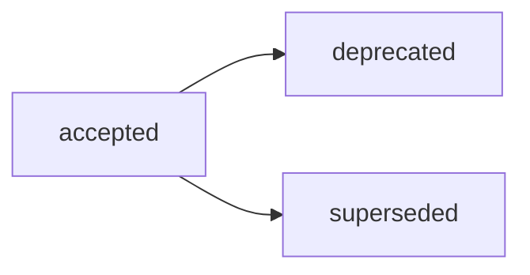

# ADR-006: Структура Analysis-артефактов и принятие Варианта C из RFC B-025

## Decision Metadata

| Field | Value |
| --- | --- |
| ADR id | ADR-006 |
| Decision type | methodology |
| Decision status | accepted (narrative summary; машиночитаемый canon — frontmatter `status`) |
| Decision date | 2026-07-02 |
| Owner | G-Ivan-A |
| Source | [RFC B-025](../../governance/rfc/2026-07-02-rfc-analysis-structure.md); issue [#357](https://github.com/G-Ivan-A/hybrid-Intelligence-lab/issues/357); контекст issue [#296](https://github.com/G-Ivan-A/hybrid-Intelligence-lab/issues/296), [#350](https://github.com/G-Ivan-A/hybrid-Intelligence-lab/issues/350) |
| Impacted artifacts | `standards/analysis-standard.md` (B-027, future), `docs/analysis/*`, `research/**` (legacy Analysis), `standards/frontmatter-docs-standard.md`, `standards/glossary.md`, `standards/research-standard.md` (routing R/A/A уже задан), `governance/backlog.md`, `governance/artifact-map.md` |
| Supersedes | none |
| Superseded by | none |

## Context

RFC B-025
([`governance/rfc/2026-07-02-rfc-analysis-structure.md`](../../governance/rfc/2026-07-02-rfc-analysis-structure.md))
завершил этап предложения по Analysis-артефактам после инвентаризации B-024 (186
кандидатов, 19 фактических Analysis, замаскированные артефакты и границы). Он
рекомендует базовый стандарт Analysis с опциональными лёгкими профилями подтипов
и требует человеческой точки принятия решения перед созданием нормативного
стандарта B-027.

Решение нужно сейчас, потому что RFC B-025 — это proposal, а не decision record:
он сам фиксирует, что переход к `accepted` выполняется только через ADR (human
decision gate). Без этого ADR нормативный стандарт B-027 унаследовал бы
непринятую модель, а цепочка стандартизации Analysis (B-024 → B-025 → B-026 →
B-027 → B-028) осталась бы заблокированной на decision gate.

Этот ADR фиксирует принятое решение. Он не создаёт стандарт Analysis (это B-027),
не мигрирует файлы (это B-028) и не пересказывает предложение, альтернативы или
матрицу затронутых артефактов из RFC B-025.

## Decision

Принять **Вариант C** из RFC B-025: один базовый стандарт Analysis (общий каркас —
frontmatter, naming, knowledge-lifecycle, минимальное ядро секций) плюс
опциональные лёгкие профили подтипов (`inventory` / `matrix` / `options` /
`recommendation`) как секции этого стандарта, выделяемые в отдельные файлы только
при накоплении operational pain (триггер B, «A сейчас — B потом»). Детальная
модель, форма профилей и обоснование остаются в RFC B-025.

Подтвердить канонический routing **`docs/analysis/YYYY-MM-DD-name.md`**. Этот
маршрут уже задан в [`research-standard.md`](../../standards/research-standard.md)
(B-018) и в маршрутизации Research / Analysis / Audit из ADR-003; ADR-006 не
изобретает routing заново и не изменяет принятые решения ADR-002/ADR-003 — он
подтверждает существующий источник как канон для Analysis.

Подтвердить frontmatter Analysis с relation-метаданными (`source`, `scope`,
`based_on`, `related_artifacts` и опционально `analysis-subtype`). Обязательность
конкретных полей и форма профилей кодифицируются в стандарте B-027.

Подтвердить knowledge-lifecycle Analysis:
`draft → reviewed → canonical → superseded`
(тот же жизненный цикл знаниевых артефактов, что и в цепочках Research/Reports).

Зафиксировать, что Analysis — самостоятельный класс знаниевого артефакта (не
подтип Research). Границы Analysis ↔ Research ↔ Audit ↔ Report ↔ RFC ↔ ADR
приняты по существующим источникам методом link/cite, а не restate:
[glossary](../../standards/glossary.md) (B-020, определения Research/Analysis/
Audit), [research-standard](../../standards/research-standard.md) (routing R/A/A),
[Analysis inventory](../analysis/2026-07-02-analysis-artifacts-inventory.md)
(B-024, границы §4), [Audit deep analysis](../analysis/2026-07-02-audit-artifacts-deep-analysis.md)
(B-029, граница Analysis ↔ Audit) и [ADR-004](2026-07-adr-004-reports-structure.md)
(B-041/B-042, граница Report ↔ Analysis). Инвариант границы: если доминирует
внешнее новое знание — это Research; если есть явная норма и pass/fail/finding —
это Audit; если это устойчивый output-артефакт — это Report.

Делегировать обязательный текст правил в `standards/analysis-standard.md` (B-027),
а физическую модернизацию метаданных и миграцию legacy Analysis — в B-028. Этот
ADR не переименовывает и не перемещает существующие файлы.

Открытые вопросы из RFC B-025 закрыты делегированием (ни один не блокирует это
решение):

| Открытый вопрос из RFC B-025 | Статус в ADR |
| --- | --- |
| Набор профилей подтипов (`inventory`/`matrix`/`options`/`recommendation` достаточен?) | Делегировано в B-027. Инвариант: базовый стандарт не зависит от финального набора профилей; список профилей — вопрос нормы, а не decision gate. |
| Физический дом legacy Analysis (6 артефактов под `research/`, B-024 §2.2): метаданные in place или перенос в `docs/analysis/`? | Делегировано в B-028 и план миграции репо B-034. Инвариант: routing `docs/analysis/` каноничен; физическая миграция выполняется после стандарта, а не в этом ADR. |
| Триггер B: пороги выделения профиля в отдельный стандарт? | Делегировано в B-027 как anti-inflation criterion. Принятый принцип: выделять профиль только при повторяющихся обязательных правилах подтипа или боли ревью; операционные пороги определяет стандарт. |
| `analysis-subtype` обязателен ли для process outputs? | Делегировано в B-027. Инвариант: `analysis-subtype` опционален в базе; обязательность — вопрос нормы стандарта, а не этого ADR. |

## Decision Drivers

- Analysis — самостоятельный класс: инвентаризация B-024 показала, что Analysis
  составляет ~10% корпуса, но является доминирующей рабочей формой
  (inventory/matrix/options/recommendation), поэтому требует собственного
  стандарта, а не подтипа Research.
- Anti-Inflation: один базовый стандарт с опциональными профилями даёт
  минимальную поверхность сейчас и шов разделения на будущее (триггер B), избегая
  преждевременных отдельных стандартов на каждый подтип.
- Единый routing-источник: `docs/analysis/` уже задан в research-standard и
  ADR-003, поэтому ADR только подтверждает канон, а не создаёт конкурирующий
  источник (в отличие от Reports, где ADR-004 реконсилировал дрейф ADR-002).
- Decision gate: B-027 должен опираться на принятое человеком решение, а не
  только на предложение RFC; RFC B-025 сам делегирует переход в `accepted` этому
  ADR.

## Alternatives Considered

Полные альтернативы A/B/C/D, trade-offs, Critical Analysis и rejected options
находятся в RFC B-025 (разделы Alternatives и Critical Analysis). Этот ADR
делегирует материал этапа предложения исходному RFC и не воспроизводит его
таблицу альтернатив.

Ключевая развилка, которую закрывает это решение: принять Вариант C (базовый
стандарт + опциональные профили) либо оставить Analysis без собственного
стандарта / как подтип Research / с отдельным стандартом на каждый подтип. Принят
Вариант C.

## Consequences

Это архитектурные последствия принятого решения.

**Архитектурные последствия:**

- `standards/analysis-standard.md` (B-027) разблокирован и становится
  нормативным владельцем структуры Analysis, relation-frontmatter, профилей
  подтипов, knowledge-lifecycle и подтверждённого routing `docs/analysis/`.
- B-028 (cleanup и модернизация Analysis-артефактов) разблокирована после B-027:
  физическая модернизация метаданных, устранение дублей/замаскированных
  артефактов и миграция legacy Analysis из-под `research/` выполняются как
  implementation follow-up, а не в этом ADR.
- Координация с B-034 (RFC-план миграции репо): физическая реструктуризация
  Analysis выполняется после появления всех трёх стандартов (Research/Analysis/
  Audit), а не как часть цепочки стандартизации Analysis.
- ADR-002/ADR-003 остаются в силе без изменений: routing R/A/A и определения
  Analysis не переписываются; ADR-006 подтверждает существующий routing-источник.
- Существующие артефакты `docs/analysis/*` и legacy Analysis под `research/` не
  мигрируются этим ADR; их модернизация — downstream-работа B-028.

**Компромиссы:**

- Опциональные профили подтипов дают гибкость сейчас, но требуют явной дисциплины
  триггера B в B-027, чтобы профиль не выделялся в отдельный стандарт
  преждевременно.
- Отложенная миграция legacy Analysis сохраняет routing-канон, но временно
  оставляет часть Analysis под `research/` до плана миграции B-028/B-034.

## Compliance and Validation

- Этот ADR следует
  [`standards/adr-structure-standard.md`](../../standards/adr-structure-standard.md):
  обязательный frontmatter, порядок body-секций, section-level delegation и
  правила acceptance review для ADR.
- ADR явно избегает копирования proposal-деталей RFC B-025, таблицы альтернатив и
  матрицы downstream-задач; proposal, alternatives и trade-offs остаются в RFC.
- Регистрация в репозитории валидируется через `governance/artifact-map.md`,
  `governance/backlog.md`, `CHANGELOG.md` и
  `tools/validate-repository-structure.sh`.
- Локальная проверка в этом PR:

  ```bash
  ./tools/validate-frontmatter.sh .
  ./tools/validate-file-naming.sh
  ./tools/validate-repository-structure.sh
  ```

## Lifecycle

Текущий статус: `accepted`. Этот ADR фиксирует человеческое решение, запрошенное в
issue [#357](https://github.com/G-Ivan-A/hybrid-Intelligence-lab/issues/357);
принятие в репозитории выполнено через PR
[#360](https://github.com/G-Ivan-A/hybrid-Intelligence-lab/pull/360). RFC B-025
переведён в `accepted` этим decision gate.



- Триггер пересмотра: изменение принятой модели Analysis (набор профилей,
  frontmatter-контракт, routing) требует нового RFC/ADR или явного замещения.
- Замещение: `superseded` требует обратную ссылку на заменяющий ADR/RFC.
- Нормативный контроль делегирован в B-027; cleanup и миграция файлов — в B-028
  с координацией через B-034.

## Related Artifacts

- [RFC B-025: Структура Analysis-артефактов](../../governance/rfc/2026-07-02-rfc-analysis-structure.md)
  — исходный RFC с предложением, альтернативами, trade-offs и границами.
- [Analysis inventory and boundaries (B-024)](../analysis/2026-07-02-analysis-artifacts-inventory.md)
  — инвентаризация и входные данные по границам для Analysis-артефактов.
- [Audit artifacts deep analysis (B-029)](../analysis/2026-07-02-audit-artifacts-deep-analysis.md)
  — граница Analysis ↔ Audit.
- [ADR-002: Методология создания и управления артефактами](2026-06-adr-002-artifact-document-methodology.md)
  — routing и knowledge-lifecycle артефактов (без изменений).
- [ADR-003: Структура research и маршрутизация Research / Analysis / Audit](2026-07-adr-003-research-structure.md)
  — источник routing R/A/A и `docs/analysis/` (без изменений).
- [ADR-004: Структура Reports](2026-07-adr-004-reports-structure.md)
  — sibling decision той же цепочки стандартизации; граница Report ↔ Analysis и
  прецедент Варианта C.
- [`standards/research-standard.md`](../../standards/research-standard.md)
  — маршрутизация Research / Analysis / Audit и routing `docs/analysis/`.
- [`standards/glossary.md`](../../standards/glossary.md)
  — каноническое определение Analysis / Research / Audit (B-020).
- [`standards/adr-structure-standard.md`](../../standards/adr-structure-standard.md)
  — структура ADR и правила section-level delegation.
- [`governance/backlog.md`](../../governance/backlog.md) — цепочка Analysis
  B-024, B-025, B-026, B-027, B-028 и координация с B-034.
