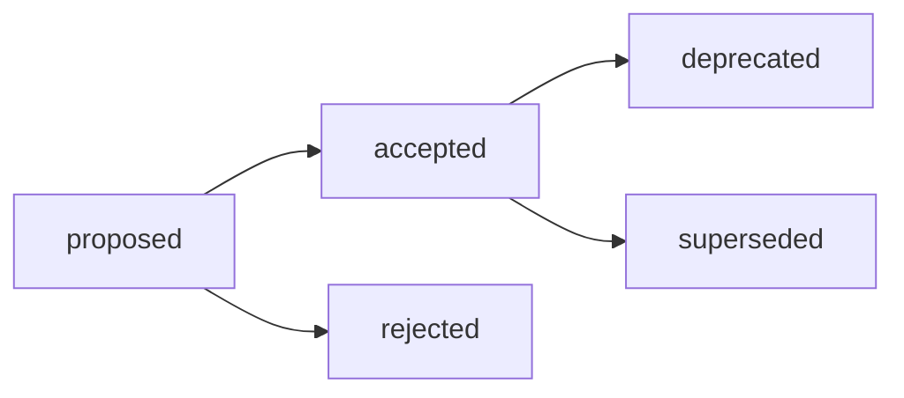

# ADR-011: Модели research-артефакта — фиксация двух существующих и предложение Discussion Paper / Survey

## Decision Metadata

| Field | Value |
| --- | --- |
| ADR id | ADR-011 |
| Decision type | methodology |
| Decision status | accepted (narrative summary; машиночитаемый canon — frontmatter `status`) |
| Decision date | 2026-08-17 (решение фаундера в issue [#523](https://github.com/G-Ivan-A/hybrid-Intelligence-lab/issues/523): внедрение моделей в стандарт и повышение статуса RRP) |
| Owner | G-Ivan-A |
| Source | Issue [#515](https://github.com/G-Ivan-A/hybrid-Intelligence-lab/issues/515); Issue [#523](https://github.com/G-Ivan-A/hybrid-Intelligence-lab/issues/523) (амендмент D6); [ADR-003](2026-07-adr-003-research-structure.md); [RFC Reference Research Pattern](../rfc/2026-07-17-rfc-reference-research-pattern.md) |
| Impacted artifacts | `standards/research-standard.md` (внедрение моделей — B-104, issue #523), `standards/glossary.md`, `docs/rfc/2026-07-17-rfc-reference-research-pattern.md` (`Validation status` — статус паттерна, D6), `tools/test-reference-research-terminology.sh`, `ops/backlog.md` |
| Supersedes | none |
| Superseded by | none |

## Context

[ADR-003](2026-07-adr-003-research-structure.md) принял модель **структуры**
research: где лежит отчёт, что такое контейнер `exp/` и как маршрутизируются
Research / Analysis / Audit. Он сознательно не нормировал **форму и глубину**
самого исследования: `standards/research-standard.md` фиксирует единственную
форму выхода — датированный отчёт `research/<domain>/YYYY-MM-DD-name.md` плюс
опциональный контейнер доказательной базы `exp/<issue-slug>/`, а раздел
`Type Model` этого стандарта прямо объявлен `N/A`.

Позже появилась вторая фактическая форма — **Reference Research Pattern**
([RFC от 2026-07-17](../rfc/2026-07-17-rfc-reference-research-pattern.md), статус
паттерна `Experimental`): модуль из шести файлов с обязательными Theory,
Taxonomy, Decision Framework, Practice и Open Questions. RFC осознанно не
принимает решение и не предписывает форму другим доменам, поэтому в нормативном
контуре Хаба две формы сосуществуют без общего описания их соотношения.

Между ними обнаружился **пробел**. Существует легитимный класс исследований
ранней стадии: работа опирается на внешние индустриальные практики и порождает
новые гипотезы, но пространство решений в теме ещё не выделено, поэтому ни
таксономии, ни Decision Framework у неё нет и быть не должно. Такая работа:

- не описывается базовой моделью, потому что её доказательная база — внешние
  источники, а не собственный воспроизводимый эксперимент в `exp/`, и потому что
  базовая модель ничего не говорит о предварительном статусе результата;
- не описывается RRP, потому что обязательный Decision Framework в такой теме
  пришлось бы выдумать, а не вывести.

Пока класс не назван, исполнитель выбирает форму по точке входа, а не по природе
задачи: одну и ту же работу можно раздуть до неполного шестифайлового модуля или
спрятать в `docs/analysis/`. Это и есть «серая зона» из постановки #515.

Два ограничения контекста фиксируются здесь явно, потому что оба нарушались
ранее в работе по этой задаче:

1. **Analysis не является моделью research.** Это отдельный тип артефакта со
   своим decision record ([ADR-006](2026-07-adr-006-analysis-structure.md)),
   своим стандартом (`standards/analysis-standard.md`), своим домом
   (`docs/analysis/`), своим именованием и своим frontmatter. Он появляется в
   этом ADR только как **граница** маршрутизации, а не как элемент ряда моделей.
   Зонтичный термин, который ставит Analysis в один ряд с RRP, — онтологическая
   ошибка и в этом решении не используется.
2. **Стандарт нельзя править без принятого решения.** Цепочка
   Исследование → RFC → ADR → Стандарт означает, что новые модели research
   попадают в `standards/research-standard.md` только после мержа этого ADR,
   отдельной задачей. Настоящий документ ничего не нормирует до перевода в
   `accepted`.

## Decision

Предлагается принять **модель форм research-артефакта Хаба**: две существующие
формы фиксируются как есть, третья добавляется для закрытия пробела ранней
стадии.

**D1. Зафиксировать две существующие модели без изменений.**

| Модель | Что это | Обязательные элементы | Форма выхода | SSOT формы |
| --- | --- | --- | --- | --- |
| **M1. Базовый research-отчёт** | Действующая модель по умолчанию: изучение внешнего вопроса с собственной доказательной базой (сравнение, benchmark, prompt-эксперимент, разбор корпуса) | Датированный отчёт с источниками и границами применимости внешних claim; воспроизводимость выводов | `research/<domain>/YYYY-MM-DD-name.md` + опц. `exp/<issue-slug>/` | [`standards/research-standard.md`](../../standards/research-standard.md), принят [ADR-003](2026-07-adr-003-research-structure.md) / [RFC B-016](../rfc/2026-06-30-rfc-research-structure.md) |
| **M2. Reference Research Pattern (RRP)** | Зрелое исследование домена, результат которого обязан быть воспроизводимой методологией | Theory, Taxonomy, **Decision Framework**, Practice, Open Questions — модуль из шести файлов | `research/<domain>/00-introduction.md` … `50-open-research.md` | [RFC Reference Research Pattern](../rfc/2026-07-17-rfc-reference-research-pattern.md), статус паттерна `Validated` (см. [D6](#d6)) |

Ни структура шести файлов, ни базовая форма M1 этим ADR не изменяются. SSOT
каждой формы остаётся там, где он есть. Статус паттерна M2 повышается решением
D6 — по критерию, который сформулирован в самом RFC, и без изменения формы.

**D2. Принять третью модель — Discussion Paper / Survey (M3).**

Поисковое исследование ранней стадии: тема ещё не имеет выделенного пространства
решений, работа обозревает индустриальные практики и формулирует гипотезы.

| Аспект | Норма M3 |
| --- | --- |
| Главный вопрос | «Что делает индустрия и какие гипотезы из этого следуют?» |
| Зрелость темы | пространство решений ещё не выделено |
| Обязательный элемент 1 | **Явная маркировка предварительного статуса**: `status: draft` во frontmatter и отдельная строка в теле о том, что выводы предварительны и не являются нормой |
| Обязательный элемент 2 | **Обзор индустриальных практик**: у каждого индустриального claim — конкретный внешний источник (ссылка), а не общая отсылка «в индустрии принято» |
| Обязательный элемент 3 | **Явно сформулированные гипотезы**, текстуально отделённые от установленных фактов |
| НЕ требуется | полная таксономия; Decision Framework; шестифайловая структура; собственный эксперимент в `exp/` |
| Форма выхода | один или несколько датированных отчётов по действующим правилам размещения research (`research/<domain>/YYYY-MM-DD-name.md`) — новых каталогов и правил именования модель не вводит |
| Отношение к M2 | модель **зрелости**, а не качества: Discussion Paper — легитимный конечный результат, а не недоделанный RRP |

Решающий признак выбора между M3 и M2 — **наличие выведенного (а не выдуманного)
Decision Framework**, а не объём текста.

**D3. Промоушен M3 → M2.** Когда в теме появились таксономия и рамка решений,
исследование развёртывается в RRP: исходный отчёт получает `status: superseded`
и backlink на модуль. Обратного перехода нет.

**D4. Anti-Inflation.** Четвёртая модель не вводится. Триггер для будущего
пересмотра: две и более задачи подряд, которые не удаётся отнести ни к M1, ни к
M2, ни к M3 без искажения смысла, — и только через новый ADR или amendment.

**D5. Внедрение — отдельная задача.** Внесение M1–M3 в
`standards/research-standard.md` (включая перевод раздела `Type Model` из `N/A`
в форму модели) выполняется **отдельной задачей после мержа этого ADR** (B-104 в
[`ops/backlog.md`](../../ops/backlog.md)). До этого момента нормой остаётся
действующая редакция стандарта. B-104 выполнена по issue
[#523](https://github.com/G-Ivan-A/hybrid-Intelligence-lab/issues/523) вместе с
переводом этого ADR в `accepted`.

<a id="d6"></a>
**D6. Повысить статус RRP (M2) с `Experimental` до `Validated`.** (Амендмент от
2026-08-17, issue [#523](https://github.com/G-Ivan-A/hybrid-Intelligence-lab/issues/523).)

Критерий повышения, заданный самим
[RFC Reference Research Pattern](../rfc/2026-07-17-rfc-reference-research-pattern.md)
(«Validation status»), — воспроизведение формы на ≥ 3 **независимых** доменах,
где независимость означает другого исполнителя или другой метод, а не тот же
корпус под другим названием. Доказательная база на 2026-08-17:

| Что подтверждено | Доказательство |
| --- | --- |
| 8 завершённых модулей вместо требуемых 3 | `research/ai-education/`: `retrieval`, `memory`, `evaluation`, `observability`, `multi-agent-orchestration`, `task-processing`, `tool-use`, `information-extraction-graph-modeling` |
| Форма воспроизводима: 8 из 8 модулей имеют ровно шесть канонических файлов `00…50` | [Валидация методологий исследований](../analysis/2026-08-11-research-methodology-validation.md) (инвентаризация всего корпуса `research/`) |
| Независимость исполнителей: 3 модуля выполнены Codex, 5 — Claude; отклонения не объясняются моделью-исполнителем | [Перекрёстная проверка модулей RRP (Codex)](../../research/hub/2026-08-13-rrp-cross-validation-codex.md) |
| Известный дефект паттерна (правило P2 «практика ссылается на своё основание») стал машинно-проверяемым, а не остался наблюдением | [`tools/validate-rrp-links.sh`](../../tools/validate-rrp-links.sh) с ratchet-списком исторических нарушений |

`Validated` означает: форма паттерна воспроизводима и на неё **разрешено**
ссылаться как на нормативную модель зрелого исследования (M2). Он **не**
означает, что RRP обязателен для любого research: выбор модели остаётся за
Decision Tree стандарта, а M1 остаётся моделью по умолчанию.

Границы решения фиксируются явно, потому что доказательная база неоднородна:

- все 8 модулей лежат в одном контейнере `research/ai-education/`; независимость
  подтверждается разными исполнителями и разными предметными доменами, а не
  разными каталогами верхнего уровня;
- наполнение модулей падает от 362 строк на файл у `retrieval` до 83–128 у трёх
  последних (замер в анализе выше): воспроизводится форма, за качеством
  наполнения `Validated` не ручается. Это предмет отдельных проверок, а не
  статуса паттерна.

Обратного перехода нет: понижение статуса требует нового ADR или amendment.

## Decision Drivers

- **Соблюдение цепочки решений.** Новые модели research — изменение публичного
  правила Хаба; оно требует human decision gate, а не прямой правки нормативного
  документа. Этот ADR — тот самый gate.
- **Основание в индустрии, а не в исторических артефактах.** Критерии M3 выведены
  из практик ранних стадий исследования, а не реверс-инжинирингом существующих
  неклассифицированных документов (см. таблицу в
  [Compliance and Validation](#compliance-and-validation)).
- **Онтологическая чистота.** Analysis остаётся отдельным типом артефакта со
  своим ADR-006 и стандартом; ряд моделей research его не включает.
- **Зрелость ≠ качество.** Легитимация ранней стадии убирает стимул раздувать
  поисковую работу до неполного RRP ради «правильной» формы.
- **Anti-Inflation.** Пробел закрывается одной моделью и без новых
  governance-файлов, каталогов и правил именования.

## Alternatives Considered

| Альтернатива | Почему отклонена |
| --- | --- |
| A1. Внести модели прямо в `standards/research-standard.md` без ADR | Нарушение цепочки Исследование → RFC → ADR → Стандарт: нормативный документ уже легитимирован ADR-003, менять его без принятого решения недопустимо. Это и есть дефект, который исправляет данный ADR. |
| A2. Расширить RRP необязательными файлами вместо новой модели | Размывает эталон: «шесть файлов, из которых половина опциональна» перестаёт быть воспроизводимой методологией, а статус `Experimental` требует стабильности формы до валидации на ≥3 доменах. |
| A3. Маршрутизировать поисковые исследования в Analysis | Онтологическая ошибка: Analysis структурирует существующие внутренние факты и не порождает гипотез; поисковая работа опирается на внешние источники и порождает гипотезы — это тип Research. |
| A4. Ввести две отдельные модели — Position Paper и Survey | Обе имеют одинаковые обязательные элементы и отличаются только пропорцией обзора и авторской позиции; разделение нарушает Anti-Inflation без выигрыша в маршрутизации. Учтены как один класс. |
| A5. Оставить как есть (две формы + практика) | Сохраняет серую зону и misrouting: выбор формы определяется точкой входа исполнителя, а не природой задачи. |
| A6. Определить M3 по форме 23 неклассифицированных документов Clarify | Прямо запрещено постановкой и методологически неверно: получилась бы легализация исторической формы, а не выведенный критерий. Эти документы не читались при подготовке ADR и будут классифицированы постфактум по принятым правилам. |

## Consequences

**Положительные:**

- Research получает явную и полную модель форм: базовый отчёт, поисковый
  Discussion Paper / Survey и зрелый RRP; выбор становится следствием зрелости
  темы, а не точки входа исполнителя.
- Ранняя стадия перестаёт быть «недоделанным RRP» и получает собственные
  критерии приёмки — маркировку предварительного статуса, источники и гипотезы.
- Граница с Analysis формулируется как граница типов, а не как разная глубина
  одного ряда.
- Исторические неклассифицированные артефакты (в том числе корпус Clarify)
  получают правила, по которым их можно классифицировать постфактум, — но сама
  классификация в этот ADR не входит.

**Компромиссы:**

- До мержа этого ADR и выполнения B-104 стандарт не содержит новых моделей:
  разрыв между принятым решением и нормой существует и закрывается отдельной
  задачей.
- Признак «Decision Framework выведен, а не выдуман» требует экспертного
  суждения; остаточная субъективность принимается осознанно и вынесена как
  триггер пересмотра в D4.
- RRP переходит в `Validated` (D6): на него разрешено ссылаться как на
  нормативную форму M2. Компромисс — статус подтверждает воспроизводимость
  **формы**, а не качество наполнения модулей; последнее остаётся предметом
  отдельных проверок (`tools/validate-rrp-links.sh`, cross-validation-отчёты).

**Архитектурное следствие для downstream:** нормативный enforcement делегируется
вниз по цепочке — правка `standards/research-standard.md` и `standards/glossary.md`
в B-104, ratchet-проверки валидаторов там же. Этот ADR — decision record, а не
план работ; состав задач живёт в [`ops/backlog.md`](../../ops/backlog.md).

## Compliance and Validation

**Индустриальное основание M3.** Каждый обязательный элемент модели выведен из
практики, а не из существующих артефактов Хаба:

| Практика | Что заимствовано |
| --- | --- |
| [IETF Internet-Draft](https://datatracker.ietf.org/doc/html/rfc2026#section-2.2) | Обязательная явная маркировка предварительного статуса и запрет ссылаться на документ как на норму (обязательный элемент 1). |
| [W3C Working Draft](https://www.w3.org/policies/process/) | Ранняя публикация как легитимный конечный результат стадии, а не как неполная версия финального документа (модель зрелости, D2/D3). |
| Survey article — [ACM Computing Surveys](https://dl.acm.org/journal/csur) | Обзор внешних практик с атрибуцией каждого утверждения источнику (обязательный элемент 2). |
| Academic position paper — [OECD Working Papers](https://www.oecd.org/en/publications/oecd-economics-department-working-papers_18151973.html) | Право заявить авторскую позицию и гипотезы при обязательном отделении их от установленных фактов (обязательный элемент 3). |
| Практика построения AI-агентов: [Anthropic, «Building effective agents»](https://www.anthropic.com/engineering/building-effective-agents); [OpenAI, «A practical guide to building agents»](https://cdn.openai.com/business-guides-and-resources/a-practical-guide-to-building-agents.pdf); [«The Rise and Potential of LLM Based Agents: A Survey», arXiv:2309.07864](https://arxiv.org/abs/2309.07864) | Живые примеры класса: обзор индустриальных подходов с явными гипотезами и без нормативной рамки решений — форма, которой в Хабе не было места. Источники индустриальные и не привязаны к какому-либо проекту-споку. |

**Проверка этого решения:**

- ADR подчиняется [`standards/adr-structure-standard.md`](../../standards/adr-structure-standard.md):
  необходимый frontmatter, девять обязательных секций, идентификация `ADR-011`.
- Регистрация ADR как active artifact (allowlist структуры, `docs/adr/README.md`,
  `ops/artifact-map.md`, `CHANGELOG.md`) — постановка на учёт, а не изменение
  research-логики. Валидаторы research-формата этот ADR не меняет.
- Локальная проверка в этом PR:

  ```bash
  ./tools/validate-frontmatter.sh .
  ./tools/validate-file-naming.sh
  ./tools/validate-repository-structure.sh
  python3 tools/generate-manifest.py --check
  ```

- Машинная проверка обязательных элементов M3 появляется только вместе с правкой
  стандарта (B-104) — до принятия решения проверять нечего.

## Lifecycle

Текущий статус: `proposed`. Перевод в `accepted` требует явного human review или
merge-решения фаундера (см. lifecycle
[`standards/adr-structure-standard.md`](../../standards/adr-structure-standard.md)).



- `accepted` requires explicit human review or merge decision.
- Review trigger: срабатывание Anti-Inflation-триггера D4 (две и более задачи
  подряд вне M1/M2/M3). Триггер «повышение статуса RRP после валидации на ≥3
  доменах» отработан амендментом D6 от 2026-08-17.
- Supersession: `superseded` требует backlink на замещающий ADR/RFC.

Этот ADR не переводит RFC Reference Research Pattern в другой статус: RFC
остаётся `draft` как rationale-документ. Статус самого **паттерна** повышен до
`Validated` решением D6; раздел `Validation status` RFC синхронизирован с этим
решением и ссылается на него как на decision record.

## Related Artifacts

- [ADR-003: Структура research, контейнер `exp/` и маршрутизация](2026-07-adr-003-research-structure.md) —
  база этого решения; фиксирует структуру research, которую ADR-011 дополняет
  моделями форм, не изменяя её.
- [RFC Reference Research Pattern](../rfc/2026-07-17-rfc-reference-research-pattern.md) —
  SSOT структуры и статуса модели M2.
- [RFC B-016: Структура research, контейнер `exp/` и маршрутизация](../rfc/2026-06-30-rfc-research-structure.md) —
  rationale и alternatives базовой структуры.
- [`standards/research-standard.md`](../../standards/research-standard.md) —
  нормативный документ, который получит модели M1–M3 отдельной задачей B-104
  после мержа этого ADR.
- [ADR-006: Структура Analysis-артефактов](2026-07-adr-006-analysis-structure.md)
  и [`standards/analysis-standard.md`](../../standards/analysis-standard.md) —
  дом типа Analysis; граница, а не модель research.
- [`standards/glossary.md`](../../standards/glossary.md) — термины
  `Research Method`, `Domain Methodology`, `Conceptual Framing`,
  `Reference Research Pattern (RRP)`.
- [`standards/adr-structure-standard.md`](../../standards/adr-structure-standard.md) —
  стандарт структуры ADR.
- [`ops/backlog.md`](../../ops/backlog.md) — задачи B-103 (этот ADR) и
  B-104 (внесение моделей в стандарт).
- [Валидация методологий исследований на корпусе завершённых кейсов](../analysis/2026-08-11-research-methodology-validation.md)
  и [перекрёстная проверка модулей RRP](../../research/hub/2026-08-13-rrp-cross-validation-codex.md) —
  доказательная база амендмента D6.
- Issue [#515](https://github.com/G-Ivan-A/hybrid-Intelligence-lab/issues/515) —
  постановка и корректирующие контракты.
- Issue [#523](https://github.com/G-Ivan-A/hybrid-Intelligence-lab/issues/523) —
  амендмент D6 (статус RRP `Validated`) и внедрение моделей в стандарт (B-104).
