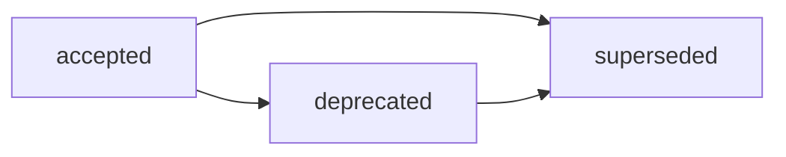

# ADR-012: Корневой `AGENTS.md` как обязательный артефакт бутстрапа

## Decision Metadata

| Field | Value |
| --- | --- |
| ADR id | ADR-012 |
| Decision type | governance |
| Decision status | accepted (narrative summary; машиночитаемый canon — frontmatter `status`) |
| Decision date | 2026-09-07 |
| Owner | G-Ivan-A |
| Source | [RFC: Корневой контракт `AGENTS.md`](https://github.com/G-Ivan-A/hybrid-Intelligence-lab/blob/main/docs/rfc/2026-09-03-rfc-agents-md-root-contract.md) (`v1.0`, `accepted`); issue [#551](https://github.com/G-Ivan-A/hybrid-Intelligence-lab/issues/551) (постановка RFC), issue [#559](https://github.com/G-Ivan-A/hybrid-Intelligence-lab/issues/559) (принятие) |
| Impacted artifacts | `AGENTS.md` (новый корневой), `standards/agents-md-bootstrap-standard.md` (создаётся B-117), [`ai-rules/agent-work-routing.md`](https://github.com/G-Ivan-A/hybrid-Intelligence-lab/tree/main/ai-rules) (создаётся B-110), [`templates/agents-md-root-draft.md`](https://github.com/G-Ivan-A/hybrid-Intelligence-lab/blob/main/templates/agents-md-root-draft.md), [`tools/validate-repository-structure.sh`](https://github.com/G-Ivan-A/hybrid-Intelligence-lab/blob/main/tools/validate-repository-structure.sh), [`CONTRIBUTING.md`](https://github.com/G-Ivan-A/hybrid-Intelligence-lab/blob/main/CONTRIBUTING.md), [`.github/ISSUE_TEMPLATE/task.md`](https://github.com/G-Ivan-A/hybrid-Intelligence-lab/blob/main/.github/ISSUE_TEMPLATE/task.md), [`pr-ops/backlog.md`](https://github.com/G-Ivan-A/hybrid-Intelligence-lab/blob/main/pr-ops/backlog.md) |
| Supersedes | none |
| Superseded by | none |

## Context

Корневой инструкционный файл фиксированного имени — единственный механизм,
которым ИИ-инструмент находит правила репозитория самостоятельно. У Хаба его нет:
правила живут в [`ai-rules/`](https://github.com/G-Ivan-A/hybrid-Intelligence-lab/tree/main/ai-rules)
и [`standards/`](https://github.com/G-Ivan-A/hybrid-Intelligence-lab/tree/main/standards),
куда ни один агент не приходит без указания. Диагноз и доказательная база —
[анализ коренных причин несоблюдения правил](https://github.com/G-Ivan-A/hybrid-Intelligence-lab/blob/main/docs/analysis/2026-09-03-ai-rules-compliance-failure-root-cause.md)
и [исследование индустриальных практик онбординга](https://github.com/G-Ivan-A/hybrid-Intelligence-lab/blob/main/research/hub/2026-09-03-ai-agent-onboarding-entrypoint-practices.md).

Decision record нужен именно сейчас по трём причинам. Во-первых, обязательность
корневого файла — cross-archetype правило (A/B/C/D) и cross-repository гейт: оно
меняет структуру корня для целого класса репозиториев, а не одного. Во-вторых,
[ADR-007](https://github.com/G-Ivan-A/hybrid-Intelligence-lab/blob/main/docs/adr/2026-07-adr-007-hub-root-structure.md)
нормирует корень **только архетипа A** и обязательность для B/C/D в него не
помещается — требуется отдельная запись решения. В-третьих, черновик
[`templates/agents-md-root-draft.md`](https://github.com/G-Ivan-A/hybrid-Intelligence-lab/blob/main/templates/agents-md-root-draft.md)
существует с PR #548, но лежит в `templates/`, то есть инструментами не читается:
без принятого решения работа B-110…B-120 остаётся планом.

Proposal-стадия пройдена RFC корневого контракта. Полный разбор проблемы,
инвентаризация источников, альтернативы и trade-offs находятся там и здесь не
воспроизводятся — этот ADR фиксирует, **что принято и почему**.

## Decision

**Принять RFC корневого контракта `AGENTS.md` (`v1.0`) целиком** и легализовать
корневой `AGENTS.md` как **обязательный артефакт бутстрапа** для всех
репозиториев экосистемы — Хаба и спиц архетипов A/B/C/D, во всех средах.
`AGENTS.md` является **SSOT №0** агента: краткий диспетчер, который выполняет
онбординг и маршрутизирует к каноничным документам, а не дублирует правила.
Детальная модель — разделы `P.1`–`P.9`
[RFC](https://github.com/G-Ivan-A/hybrid-Intelligence-lab/blob/main/docs/rfc/2026-09-03-rfc-agents-md-root-contract.md);
ADR не пересказывает их.

Решения фаундера, закрывающие блокирующие развилки RFC (полные формулировки —
[Open Questions](https://github.com/G-Ivan-A/hybrid-Intelligence-lab/blob/main/docs/rfc/2026-09-03-rfc-agents-md-root-contract.md#open-questions)):

| Развилка | Принятое решение |
| --- | --- |
| `Q-1` Путь легализации | **Вариант B** — новый `standards/agents-md-bootstrap-standard.md`. ADR-007 дополняется точечно отдельным ADR; принятые ADR не переписываются. |
| `Q-2` Ссылки | Инвариант **абсолютных URL** на артефакты Хаба из любого `AGENTS.md`, включая корневой `AGENTS.md` самого Хаба. |
| `Q-3` Маршрутизация | **Выносится** в `ai-rules/agent-work-routing.md`; в `AGENTS.md` — минимальная таблица и ссылка. |
| `Q-4` Наличие-гейт | Вводится через **grandfathering** на один цикл синхронизации (`structure_grandfather_until`), а не немедленным `FAIL`. |
| `Q-5` Шаблон задачи | `AGENTS.md` включается в шаблон задачи как обязательный **SSOT №0**. |
| `Q-6` Корневые файлы | `CONTRIBUTING.md` и `GOVERNANCE.md` **сохраняются** с разделением ответственности; агент-нормативные разделы `CONTRIBUTING.md` переносятся в `ai-rules/`. Вариант D (удаление) отклонён. |

Вместе с принятием фиксируются четыре доопределяющих решения (`A-6`…`A-9` в
тексте RFC):

- **`A-6`. Размер нормируется в токенах, а не в строках.** Мягкий порог **4K**
  токенов — рекомендация выделить объёмный блок в суб-контракт со ссылкой;
  жёсткий порог **8K** — `FAIL`. Основание — деградация чтения длинного контекста
  ([Liu et al., «Lost in the Middle», TACL 2023](https://arxiv.org/abs/2307.03172)):
  обязательные запреты, попавшие в середину разросшегося файла, читаются хуже
  всего. Механизм выделения — `P.2` RFC; `<hard_rules>` и `<forbidden>` выделению
  не подлежат.
- **`A-7`. Навык (Skill) запускается и человеком, и агентом.** Явный вызов
  человеком через `/<slug>` не переводит навык в класс «команда»: класс задаётся
  формой артефакта, если иное не регламентирует стандарт среды.
- **`A-8`. Гейт ≠ валидатор.** Жёсткий слой состоит из **машинных гейтов**
  (валидаторы, pre-commit, CI) и **контрактных гейтов** (обязательства уровня
  промпта, проверяемые самопроверкой агента и human review). Норма, машинно
  выразимая, обязана стать машинным гейтом; контрактный гейт применяется там, где
  машинная проверка невозможна.
- **`A-9`. Правило `R8`: декларация вместо запрета.** Репозиторий может содержать
  каталоги вне канонического набора, если они объявлены в `.hub-profile.json`
  (`project_specific_directories`: `path` + обязательный `reason`). Отсутствие
  каталога в каноническом наборе **не** означает его запрета. Поимённые
  denylist-ы каталогов запрещены; в частности, внесение `plans/` и `tasks/` в
  какой-либо denylist **категорически запрещено** — они легализуются тем же общим
  механизмом декларации с валидным обоснованием.

## Decision Drivers

- **Доставка контекста не работает без корневого файла фиксированного имени** —
  подтверждено анализом причин: решающий фактор сбоя — отсутствующая маршрутизация
  из корня, а не объём правил.
- **Обязательность — reusable rule для четырёх архетипов**, поэтому её дом —
  стандарт, а не ADR структуры корня Хаба (граница `Q-1`).
- **Один SSOT правил.** Диспетчер маршрутизирует и не копирует: копия правил в
  модель- или среда-специфичном файле остаётся запрещённой (`A-1`), адаптер
  разрешён как сгенерированный указатель (`R4`).
- **Машинная проверяемость.** Инвариант абсолютных URL и пороги размера в токенах
  выбраны как формулировки, которые валидатор может проверить, в отличие от
  «однозначно читаемых коротких путей» и «ориентира ~200 строк».
- **Закрытая по умолчанию структура без поимённых запретов.** `R8` даёт один
  механизм легализации специфики вместо растущего списка запрещённых имён,
  который расходится с общим правилом при первом же его изменении.
- **Anti-Inflation.** Создаётся один новый стандарт; новый глоссарий, новые
  каталоги и дублирующие правила не вводятся.

## Alternatives Considered

Полный разбор альтернатив — раздел
[`Alternatives`](https://github.com/G-Ivan-A/hybrid-Intelligence-lab/blob/main/docs/rfc/2026-09-03-rfc-agents-md-root-contract.md#alternatives)
источного RFC; здесь называется только решающая развилка, которую закрывает ADR.

**Решающая развилка — дом обязательности (`Q-1`).** Вариант A (расширить ADR-007)
отклонён: ADR-007 нормирует корень архетипа A, и обязательность для B/C/D
поместилась бы туда только ценой расширения границ уже принятого решения.
Вариант C (дописать раздел в существующий стандарт) отклонён: ни один действующий
стандарт не про бутстрап и онбординг, размещение размыло бы границы документов.
Принят вариант B — отдельный стандарт бутстрапа.

**Вторая развилка — судьба корневых `CONTRIBUTING.md` и `GOVERNANCE.md` (`Q-6`).**
Вариант D (удалить оба как избыточные) отклонён: дублирования функций нет, есть
неверное размещение части содержания `CONTRIBUTING.md`; удаление ослабило бы
жёсткий слой (оба файла в `required_files`, на `CONTRIBUTING.md` навешено ~30
проверок `require_text`) и затронуло бы ADR-007, две шаблонные поверхности спиц и
пять стандартов.

## Consequences

**Архитектурные следствия принятого решения:**

- У экосистемы появляется **единая точка входа агента** с машинно проверяемым
  наличием. `CONTRIBUTING.md` перестаёт быть конкурирующей точкой входа
  (конфликт `K-1` закрывается), `GOVERNANCE.md` остаётся governance-якорем.
- **Жёсткий слой становится двухсоставным** (`A-8`): к валидаторам добавляются
  контрактные гейты как признанная часть нормы, а не как пожелание. Это меняет
  критерий приёмки правил: норма без машинной проверки обязана иметь явную точку
  самопроверки или human review.
- **`AGENTS.md` получает предел роста** (`A-6`). Следствие — в нём принципиально
  не может накапливаться нормативный текст: превышение порога разрешается
  выделением суб-контракта в каноничный дом, а не сокращением нормы.
- **Механизм легализации структуры унифицирован** (`R8`, `A-9`). Следствие для
  уже принятых артефактов: формулировка `P.9.2` и правило приёмки `V-10`
  [RFC оси «Среда»](https://github.com/G-Ivan-A/hybrid-Intelligence-lab/blob/main/docs/rfc/2026-09-04-rfc-bootstrap-environment-and-structure.md)
  (denylist деклараций для `plans/`/`tasks/`) **отменяются**; RFC оси «Среда»
  находится в статусе `proposed`, то есть до decision gate, и правка допустима
  без нового ADR.
- **Наличие-гейт вводится с льготным периодом** (`Q-4`): до даты
  `structure_grandfather_until` спица без `AGENTS.md` даёт поименный `WARN`,
  после — `FAIL`. Breaking change для спиц ограничен одним циклом синхронизации.
- **Обязанность для спиц.** Каждый репозиторий экосистемы обязан содержать
  корневой `AGENTS.md`, доставленный из Хаба; ручное расхождение с эталоном
  падает в check-режиме скрипта инъекции.

**Компромиссы:**

- Число нормативных документов растёт на один стандарт — компенсируется тем, что
  правило cross-archetype и в ADR-007 не помещается.
- Абсолютные URL удлиняют ссылки и повышают стоимость переезда репозитория —
  компенсируется машинной проверкой разрешимости.
- Перенос агент-нормативных разделов `CONTRIBUTING.md` в `ai-rules/` временно
  повышает риск разрыва ссылок и требует синхронного переноса
  `require_text`-проверок тем же PR.

Состав внедренческих работ не дублируется здесь: он живёт в
[`pr-ops/backlog.md`](https://github.com/G-Ivan-A/hybrid-Intelligence-lab/blob/main/pr-ops/backlog.md)
(B-110, B-111, B-116, B-117, B-120) и в разделе
[`Impacted Artifacts`](https://github.com/G-Ivan-A/hybrid-Intelligence-lab/blob/main/docs/rfc/2026-09-03-rfc-agents-md-root-contract.md#impacted-artifacts)
источного RFC.

## Compliance and Validation

Реализация решения проверяется на двух ярусах в соответствии с `A-8`.

**Машинные гейты** (реализация — B-110, B-116, B-120):

| Проверка | Критерий приёмки |
| --- | --- |
| Наличие `AGENTS.md` в корне | Удаление файла делает `tools/validate-repository-structure.sh` красным (после истечения `structure_grandfather_until`; до неё — поименный `WARN`). |
| Чтение среды до проверки набора | Гейт читает `environment` из `.hub-profile.json` (отсутствие поля = `local`), значение вне закрытого словаря = `FAIL` (`A-5`а). |
| Пороги размера (`A-6`) | > 8K токенов = `FAIL`; > 4K токенов = `WARN` с указанием блока-кандидата на выделение. |
| Единственная точка входа | В `CONTRIBUTING.md` нет формулировки, объявляющей точкой входа агента что-либо кроме `AGENTS.md`, и есть ссылка на `/AGENTS.md`. |
| Разрешимость ссылок | Все ссылки на артефакты Хаба — абсолютные URL; относительная ссылка на Хаб из спицы = `FAIL`. |
| Декларация каталогов (`R8`) | Недекларированный неканонический каталог = `FAIL`; задекларированный с непустым `reason` = `PASS`. Поимённый denylist имён каталогов в валидаторах отсутствует. |

**Контрактные гейты** — самопроверка агента и human review по `<hard_rules>`,
`<validation>` и `<escalation>` корневого `AGENTS.md`; предмет — нормы, не
имеющие детерминированной проверки (эскалация при конфликте постановки с геномом,
фиксация пробела неполной постановки, запрет на непроверяемые утверждения).

**Проверка самого ADR** (выполнена в PR принятия):

```bash
./tools/validate-frontmatter.sh .
./tools/validate-file-naming.sh
./tools/validate-repository-structure.sh
./tools/validate-historical-immutable.sh
python3 tools/generate-manifest.py --check
```

ADR подчиняется
[`standards/adr-structure-standard.md`](https://github.com/G-Ivan-A/hybrid-Intelligence-lab/blob/main/standards/adr-structure-standard.md):
необходимый frontmatter, девять обязательных секций, идентификация `ADR-012`.

## Lifecycle

Текущий статус: `accepted` — решение принято фаундером в issue
[#559](https://github.com/G-Ivan-A/hybrid-Intelligence-lab/issues/559) и
зафиксировано мержем PR принятия.



- **Review trigger 1.** Индустриальный отказ от имени `AGENTS.md` как читаемого
  файла (смена де-факто стандарта доставки контекста) — пересмотр `P.1`.
- **Review trigger 2.** Два и более репозитория подряд, где выделение
  суб-контрактов не удерживает `AGENTS.md` под жёстким порогом 8K токенов без
  потери нормы, — пересмотр `A-6`.
- **Review trigger 3.** Появление среды, чей механизм обнаружения правил
  несовместим с моделью «канон + сгенерированный указатель» (`R4`), — пересмотр
  `A-1`.
- `superseded` требует backlink на замещающий ADR/RFC; `deprecated` требует
  миграционной заметки.
- Точечное внесение `AGENTS.md` в корневую структуру Хаба оформляется **отдельным
  ADR** к [ADR-007](https://github.com/G-Ivan-A/hybrid-Intelligence-lab/blob/main/docs/adr/2026-07-adr-007-hub-root-structure.md);
  ADR-007 не переписывается (историческая иммутабельность принятых решений).

## Related Artifacts

- [RFC: Корневой контракт `AGENTS.md`](https://github.com/G-Ivan-A/hybrid-Intelligence-lab/blob/main/docs/rfc/2026-09-03-rfc-agents-md-root-contract.md) — источный RFC (`v1.0`, `accepted`), SSOT модели и альтернатив.
- [RFC оси «Среда» и рефакторинга базовых структур](https://github.com/G-Ivan-A/hybrid-Intelligence-lab/blob/main/docs/rfc/2026-09-04-rfc-bootstrap-environment-and-structure.md) — источник правок `A-1`…`A-5`; его `P.9.2`/`V-10` отменены правилом `R8`.
- [RFC генома HTOM](https://github.com/G-Ivan-A/hybrid-Intelligence-lab/blob/main/docs/rfc/2026-08-21-rfc-htom-genome-structure-and-ci.md) — источник механизмов `project_specific_directories` (`R8`) и `structure_grandfather_until` (`Q-4`).
- [ADR-007: Целевая структура корня Хаба](https://github.com/G-Ivan-A/hybrid-Intelligence-lab/blob/main/docs/adr/2026-07-adr-007-hub-root-structure.md) — граница: корень архетипа A.
- [ADR-001: Методология инфраструктуры проектов экосистемы](https://github.com/G-Ivan-A/hybrid-Intelligence-lab/blob/main/docs/adr/2026-06-adr-001-ecosystem-infrastructure-methodology.md) — универсальное ядро каталогов и правило плоского `ai-rules/`.
- [ADR-010: Принципы автономии агента](https://github.com/G-Ivan-A/hybrid-Intelligence-lab/blob/main/docs/adr/2026-08-adr-010-agent-autonomy-principles.md) — рамка, в которой действуют контрактные гейты (`A-8`).
- [Анализ коренных причин несоблюдения правил](https://github.com/G-Ivan-A/hybrid-Intelligence-lab/blob/main/docs/analysis/2026-09-03-ai-rules-compliance-failure-root-cause.md) — диагноз.
- [Индустриальные практики онбординга ИИ-агентов](https://github.com/G-Ivan-A/hybrid-Intelligence-lab/blob/main/research/hub/2026-09-03-ai-agent-onboarding-entrypoint-practices.md) — доказательная база, включая ограничение внимания в длинном контексте (`A-6`).
- [`templates/agents-md-root-draft.md`](https://github.com/G-Ivan-A/hybrid-Intelligence-lab/blob/main/templates/agents-md-root-draft.md) — исполнимый черновик принятой структуры.
- [`standards/adr-structure-standard.md`](https://github.com/G-Ivan-A/hybrid-Intelligence-lab/blob/main/standards/adr-structure-standard.md) — стандарт структуры ADR.
- [`pr-ops/backlog.md`](https://github.com/G-Ivan-A/hybrid-Intelligence-lab/blob/main/pr-ops/backlog.md) — задачи B-110, B-111, B-116, B-117, B-120.
- Issue [#551](https://github.com/G-Ivan-A/hybrid-Intelligence-lab/issues/551) — постановка RFC; issue [#559](https://github.com/G-Ivan-A/hybrid-Intelligence-lab/issues/559) — принятие и создание этого ADR.
