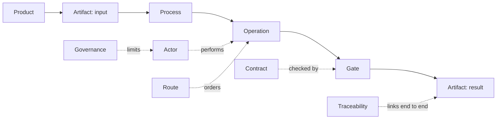
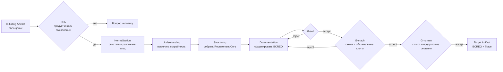
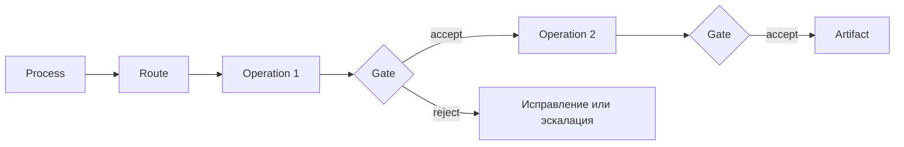
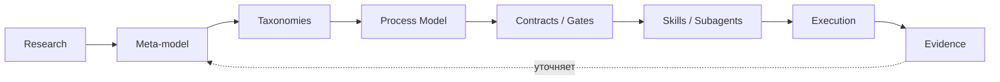

# Мета-модель БА: от промптов к управляемому производству артефактов

> Материал для обсуждения с бизнес-аналитиками, разработчиками и владельцами
> продукта. Это понятная проекция исследовательской модели, а не новый
> нормативный источник. Канонические определения находятся в
> [модуле BA Meta-Model](https://github.com/G-Ivan-A/hybrid-Intelligence-lab/blob/main/research/ba-requirements/ba-meta-model/00-introduction.md).

## 1. Executive Summary

Мы построили не «идеальный промпт», а модель управляемого производства
артефактов бизнес-анализа. Она отвечает на пять практических вопросов:

1. что поступило на вход и какой результат нужен;
2. какие операции и в каком порядке создают результат;
3. кто выполняет и кто проверяет каждый шаг;
4. по каким контрактам результат принимается или отклоняется;
5. как восстановить путь от обращения до итогового документа.

Промпт описывает отдельное действие. Мета-модель добавляет процесс, маршрут,
контракты, гейты и след происхождения. Благодаря этому автоматизацию можно
обсуждать не в терминах «ответ выглядит неплохо», а в терминах наблюдаемых
входов, проверок, отказов и измеримого результата. Это и есть переход от
**prompt engineering** к **process engineering**.

## 2. Почему набора промптов недостаточно

Схема `prompt → LLM → result` подходит для единичной обратимой задачи, но
ломается на цепочке взаимозависимых BA-процессов.

| Ограничение | Что происходит без модели | Что добавляет мета-модель |
| --- | --- | --- |
| Непредсказуемость | одинаковые задачи дают документы разной структуры | контракт выхода и Golden Set задают проверяемую форму |
| Потеря контекста | следующий шаг не знает происхождение входа | Traceability связывает вход, шаги, проверки и выход |
| Скрытая оркестрация | порядок работы спрятан внутри текста промпта | Process и Route делают порядок явным |
| Нет критерия отказа | любой связный текст выглядит «результатом» | Gate принимает или останавливает маршрут по Contract |
| Смешение ответственности | LLM и создаёт, и безусловно принимает результат | Actor разделяет агентскую, машинную и человеческую проверку |
| Нельзя измерить улучшение | новая формулировка сравнивается по впечатлению | фиксированные метрики сравнивают маршруты на одинаковых задачах |

Исследовательский корпус показывает размер проблемы: среди 17 результирующих
документов обнаружено 17 разных структур; 50 из 67 прогонов не содержат ссылки
на использованный промпт. Это наблюдения о текущем корпусе, не обещание будущего
качества. Источники: [замер структуры](https://github.com/G-Ivan-A/hybrid-Intelligence-lab/blob/main/research/ba-requirements/2026-09-08-artifact-structure-variance-facts.md)
и [замер входов мета-модели](https://github.com/G-Ivan-A/hybrid-Intelligence-lab/blob/main/research/ba-requirements/2026-09-08-meta-model-inputs-facts.md).

## 3. Концептуальная модель

Основная цепочка показывает, **что производится**. Окружающие сущности
показывают, **кем, по каким правилам и с каким доказательством**.



| Понятие | Простое объяснение |
| --- | --- |
| `Product` | продуктовый контекст, в котором требование имеет смысл |
| `Artifact` | формализованный вход или выход работы |
| `Operation` | атомарный тип работы: понять, классифицировать, структурировать |
| `Process` | устойчивый порядок операций, ведущий к результату |
| `Route` | фактически пройденный путь конкретной задачи |
| `Actor` | человек, агент или валидатор, выполнивший действие |
| `Gate` | событие проверки в конкретной точке маршрута |
| `Contract` | явные требования к входу или результату |
| `Traceability` (`Trace`) | связь входа, операций, акторов, проверок и выхода |
| `Governance` | границы полномочий и решения, оставленные человеку |

В канонической модели `Skill` — исполнимая реализация `Operation`, а не ещё
один независимый тип. `Result` — роль выходного `Artifact` в цепочке. Такое
разделение не даёт интерфейсу исполнения раздувать предметную модель.

## 4. Четыре таксономии

Таксономии — четыре контролируемых словаря, которые позволяют человеку и AI
одинаково назвать предмет работы.

| Словарь | На какой вопрос отвечает | Зачем классификация нужна AI |
| --- | --- | --- |
| Артефакты | Что пришло и что нужно создать? | выбирает контракт и шаблон выхода |
| Операции | Какой тип работы выполняется? | выбирает подходящий Skill, не угадывая по свободному тексту |
| Процессы | В каком порядке операции дают бизнес-результат? | выбирает Route и обязательные Gates |
| Продукты | К какому Domain / Capability / Feature относится задача? | добавляет нужный контекст без загрузки всей базы знаний |

Пятый, служебный словарь описывает гейты и контракты. Он контролирует работу,
но не классифицирует её предмет. Подробные значения и границы словарей:
[канонические таксономии](https://github.com/G-Ivan-A/hybrid-Intelligence-lab/blob/main/research/ba-requirements/ba-meta-model/20-taxonomy.md).

## 5. Artifact Production Model

Один сквозной пример: из обращения заказчика нужно получить бизнес-требование
`BCREQ`. Маршрут не «просит модель написать документ», а последовательно
превращает сырой вход в проверяемый артефакт.



| Этап | Вход | Действие | Гейт | Выход |
| --- | --- | --- | --- | --- |
| Предусловие | обращение | объявить продукт, цель и источник | `C-IN` | допустимый Initiating Artifact |
| Нормализация | сырой текст | отделить факты, вопросы и ограничения | `G-self` | нормализованный вход |
| Понимание | нормализованный вход | сформулировать потребность и границы | `G-human` при неоднозначности | Requirement Core |
| Структурирование | ядро | заполнить обязательные смысловые слоты | `G-mach` | структурированный черновик |
| Документирование | черновик | собрать целевой BCREQ | `G-self → G-mach → G-human` | Target Artifact + Trace |

Отказ — полезный результат контроля: он возвращает задачу в известную точку или
эскалирует вопрос человеку, а не маскируется предупреждением.

## 6. Orchestration Model

Названия `stepwise`, `oneshot` и `legacy` больше не должны определять
идентичность навыка или структуру маршрута. Они сохраняются как историческое
свидетельство, но не служат базисом новой логики. Решения зафиксированы в
[ADR-013](https://github.com/G-Ivan-A/hybrid-Intelligence-lab/blob/main/docs/adr/2026-09-adr-013-run-modes-deprecation.md)
и [ADR-014](https://github.com/G-Ivan-A/hybrid-Intelligence-lab/blob/main/docs/adr/2026-09-adr-014-legacy-evidence-not-baseline.md).

Новая оркестрация выглядит так:



`Process` задаёт повторяемую логику, `Route` фиксирует конкретное исполнение,
`Operation` описывает атомарную работу, а `Gate` не позволяет молча продолжить
маршрут после нарушения контракта. Диалоговый или однопроходный интерфейс может
быть параметром взаимодействия, но не отдельной моделью процесса.

## 7. AI Execution Model

Связь предметной модели со средой исполнения не должна смешивать уровни:

```text
Operation → Skill → Agent/Subagent → Tool
тип работы   инструкция   исполнитель      техническое действие
```

- `Operation` остаётся стабильной, даже если меняется реализация.
- `Skill` компилирует правила одной операции для одного продуктового класса.
- `Agent/Subagent` получает роль и выполняет Skill в рамках Route.
- `Tool` читает файл, запускает валидатор или обращается к разрешённому API.

Оркестратор читает маршрут, агент — навык, валидатор — контракт. Человек
принимает смысловые и продуктовые решения. Если для операции нет проверенного
навыка, Route явно назначает `actor: human`, а не имитирует AI-покрытие.

## 8. GigaCode Mapping

Ниже — маппинг на названные в постановке подтверждённые возможности GigaCode.
Он фиксирует предполагаемое применение публичных концептов, но не утверждает
ничего о внутренних механизмах среды.

| Элемент нашей модели | Возможность GigaCode | Как предполагается использовать | Граница утверждения |
| --- | --- | --- | --- |
| `Operation` + контракт исполнения | `Skills` | хранить самодостаточную инструкцию атомарной работы | формат и способ загрузки Skill ещё нужно проверить |
| `Actor` и делегирование шага | `Subagents` | назначать специализированного исполнителя операции | внутренняя маршрутизация и изоляция контекста не предполагаются |
| `Contract`, `Gate`, `Governance` | `Rules` | выражать постоянные ограничения и критерии проверки | возможность исполнять машинный гейт внутри прогона не доказана |
| `Process` + `Route` | `AI Workflows` | задавать последовательность операций и контрольных точек | точная форма сериализации маршрута неизвестна |
| подготовка маршрута | `Agent/Plan Modes` | разделять планирование и выполнение там, где это поддержано | режим интерфейса не становится идентичностью Skill |

До проверки официальной спецификации нельзя обещать, что `G-mach` запускается
внутри GigaCode, что Subagents имеют отдельный контекст или что предложенный
`SKILL.md` обнаруживается автоматически. Спецификация Execution Package честно
обозначает форму навыка как аналог:
[рамка решений](https://github.com/G-Ivan-A/hybrid-Intelligence-lab/blob/main/research/ba-requirements/ba-meta-model/30-decision-framework.md).

## 9. Evidence Map

| Статус | Утверждение | Основание или способ проверки |
| --- | --- | --- |
| `FACT` | исследовательский корпус содержит 67 прогонов и 17 результирующих документов | воспроизводимые отчёты на зафиксированном коммите корпуса |
| `OBSERVATION` | 17 документов имеют 17 разных скелетов; 50 прогонов не ссылаются на промпт | [замеры корпуса](https://github.com/G-Ivan-A/hybrid-Intelligence-lab/tree/main/research/ba-requirements/exp/ba-meta-model-563) |
| `DESIGN DECISION` | работа описывается через Product, Artifact, Operation, Process, Route, Actor, Gate, Contract и Trace | [теория модели](https://github.com/G-Ivan-A/hybrid-Intelligence-lab/blob/main/research/ba-requirements/ba-meta-model/10-theory.md); требует human review |
| `DESIGN DECISION` | гейты идут в порядке `G-self → G-mach → G-human` и работают fail-closed | [таксономии](https://github.com/G-Ivan-A/hybrid-Intelligence-lab/blob/main/research/ba-requirements/ba-meta-model/20-taxonomy.md) |
| `DESIGN DECISION` | наследие даёт evidence, но не диктует форму нового | [ADR-014](https://github.com/G-Ivan-A/hybrid-Intelligence-lab/blob/main/docs/adr/2026-09-adr-014-legacy-evidence-not-baseline.md) |
| `HYPOTHESIS` | Execution Package повысит структурную воспроизводимость и снизит человеческие правки | сравнение baseline и MVP на одних и тех же 10 задачах |
| `HYPOTHESIS` | сущности модели напрямую реализуемы средствами GigaCode | первый сквозной прогон и сверка с официальной спецификацией |

Статус модели — `draft research`: это согласованная архитектурная гипотеза с
измеренным основанием, но ещё не доказанная опытной эксплуатацией.

## 10. Итог исследования

Исследование дало путь от разрозненных наблюдений к проверяемому исполнению:



Главный результат — общий язык между БА, разработчиком и AI. Исследование
объясняет основания; модель определяет сущности; таксономии снимают
неоднозначность; процесс задаёт путь; контракты и гейты делают качество
проверяемым; навыки и исполнители реализуют операции; новый evidence возвращает
модель на пересмотр.

## 11. Что ещё не доказано

- Совместим ли предлагаемый формат Skill с точной спецификацией GigaCode.
- Может ли среда запускать `G-mach` внутри прогона или проверка должна жить в CI.
- Кто является владельцем продуктовых классов и принимает `G-human`.
- Полон ли закрытый словарь процессов за пределами исследованной спицы.
- Переносится ли модель с телекома на другие домены.
- Повышает ли структурная воспроизводимость качество, а не только единообразие.
- Где находится практический предел размера самодостаточного Skill.
- Каковы baseline и итоговые значения метрик первого среза.

Полный реестр ограничений находится в
[открытых вопросах исследования](https://github.com/G-Ivan-A/hybrid-Intelligence-lab/blob/main/research/ba-requirements/ba-meta-model/50-open-research.md).

## 12. Первый MVP

Первый вертикальный срез намеренно мал: доказать один путь целиком, прежде чем
расширять покрытие.

| Параметр | MVP |
| --- | --- |
| Product | `contact-center` |
| Process | `fr-generation` |
| Target Artifact | `A-BCREQ` |
| Operations | `ingestion`, `understanding`, `structuring`, `documentation` |
| Skills | четыре, по одному на операцию и продуктовый класс |
| Gates | `G-self` на шагах; `G-mach` и `G-human` на выходе |
| Golden Set | два структурных эталона |
| Объём | 10 одинаково отобранных задач до и после внедрения |

Порядок проверки:

1. снять baseline на 10 задачах;
2. скомпилировать Skills, Route, Contracts, Taxonomy, Templates, Golden Set и Evaluation;
3. выполнить те же задачи через маршрут;
4. сравнить структурную воспроизводимость, машинные отказы, человеческие правки,
   полноту следа и объяснённость пустых слотов;
5. принять человеком решение: расширять модель, корректировать её или остановить.

Успех — не «AI написал десять документов». Успех — каждый прогон имеет полный
след, структура воспроизводится лучше baseline, а машинный гейт действительно
обнаруживает дефекты. Нулевое число машинных отказов считается поводом проверить
сам гейт, а не автоматическим доказательством качества.

## Ответ скептику одной фразой

Мы не начали с набора промптов, потому что промпт умеет попросить результат, но
не умеет сам по себе определить процесс, распределить ответственность,
остановить дефектный маршрут и доказать происхождение результата; именно это
добавляет мета-модель.
