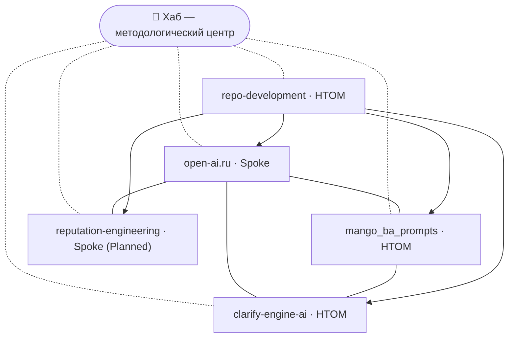

# Экосистемная карта Хаба

> 📚 **Контекст:** этот документ дополняет [Product Vision](vision.md) и
> [Product Concept](product-concept.md). Vision отвечает на вопрос «зачем»,
> Concept — «что и для кого», а карта экосистемы — «как Хаб связан с другими
> проектами и как эта связь поддерживается в актуальном виде».

> 📌 **Статус:** Draft — черновик для согласования фаундером единым пакетом
> вместе с [Product Vision](vision.md) и [Product Concept](product-concept.md).

## Содержание

- [Введение](#введение)
- [Матрица проектов](#матрица-проектов)
- [Граф связей](#граф-связей)
- [Принцип «Need-to-Know»](#принцип-need-to-know)
- [Добавление нового проекта](#добавление-нового-проекта)
- [Roadmap экосистемы](#roadmap-экосистемы)
- [Связанные документы](#связанные-документы)

---

## Введение

Хаб `hybrid-Intelligence-lab` — методологический центр растущей экосистемы
проектов. Экосистема устроена по модели **hub-and-spoke**: Хаб хранит общие
правила, стандарты и шаблоны, а проекты вокруг него создают продукты и опираются
на эти правила. Карта фиксирует, какие проекты входят в экосистему, как они
связаны между собой и как их связь поддерживается в актуальном виде.

Карта строится на принципе **«Need-to-Know»**: Хаб видит все проекты экосистемы
и хранит полный граф, а каждый проект видит только те проекты, с которыми связан
по функционалу. Это держит контекст проекта компактным и снижает шум: проект
получает ровно те связи, которые ему нужны для работы, и не тащит за собой всю
карту экосистемы. Подробности — в разделе [«Need-to-Know»](#принцип-need-to-know).

Карта — живой документ. Она обновляется, когда в экосистеме появляется новый
проект, меняются связи или статус существующего проекта. Человекочитаемый
процесс синхронизации описан в гайде
[Синхронизация с проектами](../guides/sync-with-projects.md).

---

## Матрица проектов

| Проект | Статус | Тип | Связь с Хабом | Краткое описание |
| --- | --- | --- | --- | --- |
| [open-ai.ru](https://github.com/G-Ivan-A/open-ai.ru) | Active | Spoke-репозиторий | Портал методологии | AI-native интерфейс для гибридных команд. |
| [mango_ba_prompts](https://github.com/G-Ivan-A/mango_ba_prompts) | Active | HTOM-команда | Библиотека промптов | Промпты для бизнес-анализа в ИТ и телекоме. |
| clarify-engine-ai | Active | HTOM-команда | Движок уточнений | Движок для уточнения требований. |
| reputation-engineering | Planned | Spoke-репозиторий | Репутационный инжиниринг | Методология и кейсы репутационного инжиниринга. |
| [repo-development](../projects/repo-development/README.md) | Active | HTOM-команда | Развитие репо | Инструменты и процессы развития самого репозитория. |

**Обозначения.**

- **Статус** — `Active` (проект работает), `Planned` (запланирован, ещё не
  запущен).
- **Тип** — `HTOM-команда` (гибридная человек + AI рабочая единица, наследует
  governance-геном `templates/htom/`) или `Spoke-репозиторий` (production-продукт
  с собственным жизненным циклом, шаблон `templates/spoke/`). Различие закреплено
  в RFC [htom-vs-spoke-clarification-2026-06.md](../governance/rfc/htom-vs-spoke-clarification-2026-06.md).
- **Связь с Хабом** — короткая роль проекта по отношению к методологическому
  центру.

Статусы и типы отражают текущий план фаундера по развитию экосистемы и
уточняются при согласовании пакета и при каждой синхронизации карты.

---

## Граф связей

Граф различает два уровня связей:

- **Методологическая связь (hub-and-spoke)** — каждый проект связан с Хабом как с
  источником общих правил и шаблонов. На диаграмме показана пунктиром.
- **Функциональная связь** — прямая связь между проектами по функционалу
  (например, портал использует библиотеку промптов). На диаграмме показана
  сплошной линией. Именно функциональные связи определяют, что проект «видит» по
  принципу Need-to-Know.



Если диаграмма не отображается, тот же граф в текстовом виде — функциональные
связи каждого проекта (то, что проект видит по принципу Need-to-Know):

- **open-ai.ru** → `mango_ba_prompts`, `clarify-engine-ai`,
  `reputation-engineering`.
- **mango_ba_prompts** → `open-ai.ru`, `clarify-engine-ai`.
- **clarify-engine-ai** → `open-ai.ru`, `mango_ba_prompts`.
- **reputation-engineering** → `open-ai.ru`.
- **repo-development** → все проекты экосистемы.

Методологическая связь с Хабом есть у каждого проекта: Хаб хранит полный граф,
а проект — только перечисленные выше функциональные связи.

---

## Принцип «Need-to-Know»

Принцип «Need-to-Know» разделяет, кто какой объём карты хранит и видит.

| Где хранится | Что хранит | Кто видит | Формат |
| --- | --- | --- | --- |
| **Хаб** | Полный граф экосистемы (эта карта). | Все проекты и связи. | `docs/ecosystem-map.md` (человекочитаемо). |
| **Проект** | Частичный граф — только связанные по функционалу проекты. | Свои функциональные связи. | `.hub-ecosystem.json` (машиночитаемо) и `docs/ecosystem-context.md` (человекочитаемо). |

**Зачем так.** Полная карта в каждом проекте быстро устаревает и создаёт шум:
проекту незачем знать о связях, которые его не касаются. Частичный граф держит
контекст компактным и релевантным, а единый источник истины (карта Хаба) не
размывается копиями.

**Как синхронизируется.** Обновление частичного графа — полуавтоматическое:

```text
Хаб обновляет полный граф (ecosystem-map.md)
        │
        ▼
Скрипт Smart Sync читает полный граф и профиль проекта
        │
        ▼
Скрипт ПРЕДЛАГАЕТ изменения частичного графа проекта
        │
        ▼
Человек просматривает и ПОДТВЕРЖДАЕТ изменения
        │
        ▼
Обновляются .hub-ecosystem.json и docs/ecosystem-context.md проекта
```

Ключевое правило — **human-in-control**: скрипт только предлагает изменения,
а решение принимает человек. Частичный граф проекта никогда не обновляется
молча. Машиночитаемый файл `.hub-ecosystem.json` нужен инструментам, а
человекочитаемый `docs/ecosystem-context.md` объясняет связи людям проекта.

Пошаговый человекочитаемый процесс для команды проекта описан в гайде
[Синхронизация с проектами](../guides/sync-with-projects.md).

---

## Добавление нового проекта

Когда в экосистеме появляется новый проект, его добавляют в карту по единому
сценарию. Ниже — краткий маршрут; подробная инструкция для людей — в гайде
[Синхронизация с проектами](../guides/sync-with-projects.md).

1. **Создать репозиторий проекта** (или рабочую область) по подходящему шаблону:
   `templates/htom/` для HTOM-команды, `templates/spoke/` для production-спока.
2. **Инициализировать профиль проекта** `.hub-profile.json` (тип, стек, фаза) —
   он нужен Smart Sync для фильтрации релевантных шаблонов и связей.
3. **Добавить проект в эту карту** — новую строку в [матрицу](#матрица-проектов)
   и узел в [граф связей](#граф-связей) через PR в Хаб.
4. **Настроить связи** — запустить Smart Sync, чтобы он предложил частичный граф
   нового проекта, и подтвердить `.hub-ecosystem.json` и
   `docs/ecosystem-context.md` на стороне проекта.

Новый проект добавляется по принципу Anti-Inflation: запись в карте появляется
тогда, когда проект реально существует или запланирован, а не «про запас».

---

## Roadmap экосистемы

Дорожная карта описывает развитие экосистемы по ценности. Последовательность и
сроки уточняются фаундером.

### Этап 1. Ядро экосистемы

**Фокус:** зафиксировать методологический центр и первые связи.

- Хаб как источник общих правил и шаблонов.
- Активные проекты: `open-ai.ru`, `mango_ba_prompts`, `clarify-engine-ai`,
  `repo-development`.
- Полный граф экосистемы в этой карте.

### Этап 2. Need-to-Know на практике

**Фокус:** раскатать частичный граф по проектам.

- В каждом активном проекте появляются `.hub-ecosystem.json` и
  `docs/ecosystem-context.md`.
- Smart Sync расширяется: предлагает обновления не только шаблонов, но и связей.
- Человек подтверждает изменения частичного графа осознанно.

### Этап 3. Рост экосистемы

**Фокус:** подключать новые проекты по единому сценарию.

- Запуск запланированных проектов (`reputation-engineering`).
- Добавление новых проектов по процессу из раздела
  [«Добавление нового проекта»](#добавление-нового-проекта).
- Карта остаётся единым источником истины, а проекты — компактными по принципу
  Need-to-Know.

---

## Связанные документы

| Документ | Роль |
| --- | --- |
| [Product Vision](vision.md) | Уровень L1: зачем существует Хаб. |
| [Product Concept](product-concept.md) | Уровень L2: что делает Хаб, для кого и как. |
| [Синхронизация с проектами](../guides/sync-with-projects.md) | Человекочитаемый процесс синхронизации карты. |
| [htom-vs-spoke-clarification-2026-06.md](../governance/rfc/htom-vs-spoke-clarification-2026-06.md) | Различие HTOM-команда vs Spoke-репозиторий. |
| [projects/README.md](../projects/README.md) | Навигация по проектным рабочим областям. |

---

> 🗺️ Это документ-карта уровня экосистемы (Draft). Он показывает, как Хаб связан
> с другими проектами; ответ на вопрос «зачем» даёт [Vision](vision.md), а «что и
> как» — [Concept](product-concept.md).
