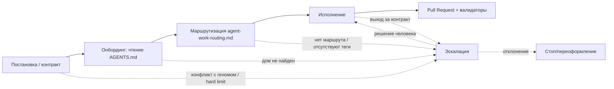

# RFC: Корневой контракт `AGENTS.md` — онбординг и маршрутизация ИИ-агентов

## RFC Metadata

| Field | Value |
| --- | --- |
| Owner | G-Ivan-A |
| RFC status | draft (совпадает с frontmatter; narrative summary) |
| Source issue | [#551](https://github.com/G-Ivan-A/hybrid-Intelligence-lab/issues/551) |
| Impacted artifacts | `AGENTS.md` (новый корневой), `ai-rules/agent-work-routing.md` (новый), `ai-rules/agent-work-rules.md`, `docs/adr/2026-07-adr-007-hub-root-structure.md`, `standards/agents-md-bootstrap-standard.md` (предлагается), `tools/validate-repository-structure.sh`, `templates/agents-md-root-draft.md` |
| Decision record | not yet |
| Implementation link | not yet |
| Archetype scope | multi (A / B / C / D) |

## Summary

RFC предлагает легализовать корневой `AGENTS.md` как **обязательный артефакт
бутстрапа** для всех репозиториев экосистемы (Хаб и спицы всех архетипов).
`AGENTS.md` — это *краткий диспетчер* (мягкий слой доставки контекста), а не
дубликат правил: он выполняет онбординг агента, маршрутизирует к каноничным
документам в
[`ai-rules/`](https://github.com/G-Ivan-A/hybrid-Intelligence-lab/tree/main/ai-rules)
и
[`standards/`](https://github.com/G-Ivan-A/hybrid-Intelligence-lab/tree/main/standards)
и фиксирует правила эскалации. Принуждение обеспечивается **машинным гейтом**
(жёсткий слой) — валидатор падает при отсутствии `AGENTS.md` в корне. RFC не
принимает решение самостоятельно, а выносит его фаундеру: выбор пути легализации,
структуру `AGENTS.md` и связанных файлов
([`ai-rules/agent-work-routing.md`](https://github.com/G-Ivan-A/hybrid-Intelligence-lab/blob/main/ai-rules/agent-work-routing.md),
[`ai-rules/agent-work-rules.md`](https://github.com/G-Ivan-A/hybrid-Intelligence-lab/blob/main/ai-rules/agent-work-rules.md)),
граф приоритетов (контракт → исполнение / эскалация), правило об отсутствующих
тегах и адаптацию под архетипы. Постановка **дополняет, а не отменяет** выводы
бэклога B-110…B-116.

## Motivation

Полная доказательная база вынесена в источники и здесь не воспроизводится:

- [Анализ коренных причин несоблюдения правил](https://github.com/G-Ivan-A/hybrid-Intelligence-lab/blob/main/docs/analysis/2026-09-03-ai-rules-compliance-failure-root-cause.md)
  (issue #547) — шесть проверенных причин; ключевой вывод: **решающий фактор —
  отсутствующая маршрутизация из корня**, вторым идёт отсутствие явных запретов,
  раздутие — усилитель. `entrypoint: true` во frontmatter — метка для человека,
  ни один инструмент не читает frontmatter, чтобы найти точку входа.
- [Индустриальные практики онбординга](https://github.com/G-Ivan-A/hybrid-Intelligence-lab/blob/main/research/hub/2026-09-03-ai-agent-onboarding-entrypoint-practices.md)
  (issue #547) — `AGENTS.md`, `CLAUDE.md`, `.github/copilot-instructions.md`,
  `.cursor/rules/`; корневой инструкционный файл — де-факто стандарт доставки
  контекста, но сам по себе он не принуждает к исполнению (это закрывается
  hooks/CI).

Почему одного текста issue/PR недостаточно: черновик
[`templates/agents-md-root-draft.md`](https://github.com/G-Ivan-A/hybrid-Intelligence-lab/blob/main/templates/agents-md-root-draft.md)
(PR #548) существует, но лежит в `templates/` и в корень не размещён — то есть
инструменты его не подхватывают. Бэклог B-110…B-116 описывает план работ, но
**принятого решения нет**. Требуется proposal-stage решение фаундера до внедрения:
затрагиваются структура корня (ADR-007), класс `ai-rules/` и машинный гейт во
всех репозиториях экосистемы — это высокий governance-impact с cross-repository
последствиями, что по
[стандарту структуры RFC](https://github.com/G-Ivan-A/hybrid-Intelligence-lab/blob/main/standards/rfc-structure-standard.md)
требует RFC до ADR/стандарта.

**Уточнение по полным путям (НФТ issue #551).** Утверждение «в корневом `AGENTS.md`
Хаба допустимы короткие пути, но в спицах/HTOM — только полные» **подтверждается**:
Codex конкатенирует цепочку `AGENTS.md` и агент может исполняться из рабочего
каталога спицы, где относительная ссылка на правило Хаба неразрешима. Поэтому RFC
предлагает инвариант: **все ссылки на артефакты Хаба из любого `AGENTS.md`
(включая корневой Хаба) — абсолютные URL**; короткие относительные пути
допустимы только для ссылок внутри того же репозитория и только если валидатор
подтверждает их разрешимость. Это снимает двусмысленность «однозначно читаемых»
коротких путей в пользу машинно-проверяемого правила.

## Goals and Non-goals

**Решает этот RFC:**

1. Выбор пути легализации `AGENTS.md` (варианты в `Proposal`).
2. Структуру `AGENTS.md`, `ai-rules/agent-work-routing.md`,
   `ai-rules/agent-work-rules.md` и ссылку на глоссарий.
3. Граф приоритетов (контракт → исполнение / эскалация как параллельная ветка).
4. Правило об отсутствующих тегах (эскалация без остановки).
5. Модель адаптации под архетипы (база в Хабе, дельта в спицах).
6. Предложение по машинному гейту (валидатор падает без `AGENTS.md`).
7. Рекомендацию по компенсации риска «файл не прочитан».

**НЕ решает этот RFC (Non-goals):**

- Физическое размещение `AGENTS.md` в корне и создание тонких указателей —
  реализация B-110 после принятия.
- Скрипт инъекции в спицы — B-111.
- Устранение `docs/contracts/` в Mango и дом контрактных документов — B-112.
- Приведение Aether-Orbis к геному — B-113.
- Стандарт правил Story/ФТ/НФТ и легитимизация шаблонов — B-114, B-115.
- Полный набор машинных запретов и валидации пяти уровней постановки — B-116
  (RFC предлагает лишь наличие-гейт `AGENTS.md`, остальное делегируется B-116).
- Изменение содержания самих правил в `agent-work-rules.md` по существу.

## Proposal

### P.1. Путь легализации

RFC выносит фаундеру три варианта; **рекомендуется вариант B**.

| Вариант | Суть | Плюсы | Минусы |
| --- | --- | --- | --- |
| **A. Обновление ADR-007** | Внести `AGENTS.md` в To-Be структуру корня Хаба ([ADR-007](https://github.com/G-Ivan-A/hybrid-Intelligence-lab/blob/main/docs/adr/2026-07-adr-007-hub-root-structure.md)) как обязательный корневой файл. | Корень — предмет ADR-007; естественное место. | ADR-007 описывает **только архетип A (Хаб)**; обязательность для всех архетипов туда не помещается без расширения границ ADR. |
| **B. Новый стандарт бутстрапа (рекомендуется)** | Принять `standards/agents-md-bootstrap-standard.md`: `AGENTS.md` обязателен во всех архетипах, задаёт минимальную структуру, инвариант абсолютных ссылок и требование машинного гейта. ADR-007 дополняется одной строкой (внесение `AGENTS.md` в корень Хаба). | Обязательность — reusable rule для A/B/C/D; стандарт — правильный класс для «обязательного формата/критериев». Согласуется с моделью «стандарт задаёт форму, ADR — структурное решение». | Требует нового документа — проверить Anti-Inflation (обосновано: правило cross-archetype, в ADR-007 не помещается). |
| **C. Обновление существующего стандарта** | Добавить раздел в [`standards/rfc-structure-standard.md`](https://github.com/G-Ivan-A/hybrid-Intelligence-lab/blob/main/standards/rfc-structure-standard.md) или в правила `ai-rules/`. | Без нового файла. | Ни один существующий стандарт не про бутстрап/онбординг; размывание границ документов. |

Бэклог B-110 допускает «ускоренную легализацию через стандарт без предварительного
RFC». RFC не отменяет этого, но фиксирует: поскольку меняется структура корня для
класса репозиториев (все архетипы) и вводится cross-repository гейт, proposal-stage
решение фаундера уместно; данный RFC и является этим этапом.

### P.2. Структура `AGENTS.md`

База — черновик
[`templates/agents-md-root-draft.md`](https://github.com/G-Ivan-A/hybrid-Intelligence-lab/blob/main/templates/agents-md-root-draft.md).
RFC фиксирует обязательные XML-секции (парсинг LLM) и требования к каждой:

| Секция | Назначение | Слой |
| --- | --- | --- |
| `<scope>` | Единая точка входа; файл единый для всех моделей; модель-специфичные файлы правил запрещены. | мягкий |
| `<hard_rules>` | Критические запреты и обязанности до первого действия (PR-only, валидаторы, запрет вымыслов, «неполная постановка → исполняй без блокирования + зафиксируй пробел»). | жёсткий (декларация) |
| `<forbidden>` | Явный закрытый перечень запретов (`docs/contracts/`, модель-специфичные файлы, `ai-generated`, новые top-level каталоги без ADR, относительные ссылки на Хаб из спиц). | жёсткий (декларация) |
| `<routing>` | Таблица маршрутизации: тема → **абсолютный URL** каноничного документа. Диспетчер, не дубликат. | мягкий |
| `<artifact_homes>` | Дома артефактов и правила именования. | мягкий |
| `<issue_levels>` | Пять уровней постановки. | мягкий |
| `<missing_tags>` | **Новое (контракт issue #551).** Отсутствие тегов/обязательных полей (тип задачи, режим) не останавливает процесс, но инициирует эскалацию. | мягкий |
| `<context_scope>` | **Новое.** Правило набора релевантного контекста: не изучать всё, набирать по маршрутизации под класс задачи. | мягкий |
| `<validation>` | Команды валидаторов перед коммитом; красный валидатор = стоп. | жёсткий (указатель) |
| `<models>` | Как каждый инструмент подхватывает файл; дублирование правил запрещено. | мягкий |
| `<escalation>` | Правила эскалации и особый случай «постановка предписывает путь вне генома». | жёсткий (декларация) |

Инвариант размера: `AGENTS.md` остаётся коротким диспетчером (ориентир практики
~200 строк); правила по существу живут в `ai-rules/`, `AGENTS.md` только ссылается.

### P.3. Связанные файлы

**`ai-rules/agent-work-routing.md` (новый).** Выносит таблицу `<routing>` из
`AGENTS.md` в отдельный канонический документ: маршрутизация по типам задач и
режимам исполнения, с тегами, **абсолютными путями** и краткой суммаризацией, куда
ведёт каждая ссылка (чтобы агент выбирал, не открывая всё). `AGENTS.md` даёт
минимальную таблицу и ссылку на `agent-work-routing.md` как на полный маршрутизатор.

**`ai-rules/agent-work-rules.md` (существует).** Дополняется/подтверждается как SSOT
правил эскалации и двухфакторного подтверждения в контексте задач:
выход за границы контракта → коммит в PR → мерж/откат = подтверждение/отклонение;
явные ключевые слова подтверждения; в структурном режиме — двухфакторное
подтверждение каждого требования. Изменения по существу — вне scope (Non-goals);
RFC фиксирует только требуемую структуру.

**Глоссарий.** Ссылка на существующий
[`standards/glossary.md`](https://github.com/G-Ivan-A/hybrid-Intelligence-lab/blob/main/standards/glossary.md)
(новый глоссарий не создаётся — Anti-Inflation).

### P.4. Граф приоритетов (не линейная цепочка)

Приоритет правил — **граф**, а не цепочка. Эскалация — параллельная ветка,
доступная на любом этапе; контракт может уйти в эскалацию, минуя исполнение.



### P.5. Правило об отсутствующих тегах

В `<missing_tags>` `AGENTS.md`: если пользователь не обозначил теги или обязательные
поля (тип задачи, режим исполнения), это **не останавливает** процесс, но
**инициирует эскалацию** — агент фиксирует пробел (комментарий в issue/PR),
предлагает недостающие значения и продолжает работу под явно заявленным
предположением. Согласуется с `<hard_rules>` пункт «неполная постановка →
исполняй без блокирования + зафиксируй пробел».

### P.6. Архетипы репозиториев

`AGENTS.md` **обязателен для всех архетипов** (A/B/C/D). База (`<hard_rules>`,
`<forbidden>`, инвариант абсолютных ссылок, `<validation>`) задаётся в Хабе и
доставляется в спицы (B-111). Архетип-специфичная дельта добавляется в спице
(например, для C — команды сборки/тесты продукта; для D — учебная маршрутизация),
но не переопределяет `<hard_rules>` и `<forbidden>` Хаба. Скрипт синхронизации /
валидатор генома проверяет **наличие** `AGENTS.md` в корне каждого репозитория.

### P.7. Машинный гейт (жёсткий слой)

Расширить
[`tools/validate-repository-structure.sh`](https://github.com/G-Ivan-A/hybrid-Intelligence-lab/blob/main/tools/validate-repository-structure.sh):
добавить `AGENTS.md` в `required_files` и в allowlist активных корневых файлов,
чтобы **валидатор падал при отсутствии** `AGENTS.md`. Полный набор запретов
(`docs/contracts/`, модель-специфичные файлы, `ai-generated`) и валидация пяти
уровней постановки — за B-116; RFC предлагает только наличие-гейт как минимальный
жёсткий слой, без которого `AGENTS.md` остаётся рекомендацией.

### P.8. Компенсация риска «не прочитан» (рекомендация)

Рекомендуется включить `AGENTS.md` как обязательный SSOT №0 в шаблон задачи
([`.github/ISSUE_TEMPLATE/task.md`](https://github.com/G-Ivan-A/hybrid-Intelligence-lab/blob/main/.github/ISSUE_TEMPLATE/task.md)):
даже если инструмент не подхватил файл автоматически, постановка сама указывает на
него как на первый источник. Это рекомендация, не жёсткое требование; окончательный
вариант — за исполнителем B-110/B-116.

## Alternatives

- **Только `AGENTS.md` без машинного гейта.** Отклонено: анализ причин показывает,
  что доставка без принуждения повторит судьбу `ai-rules/` — файл не гарантирован в
  контексте, а «мягкое» правило не проверяется.
- **Модель-специфичные файлы правил (CODEX.md/OPUS.md с полными правилами).**
  Отклонено: дублирование правил, дрейф между копиями; практика и черновик прямо
  запрещают это (только тонкие указатели-ссылки).
- **Оставить маршрутизацию только внутри `AGENTS.md`, без `agent-work-routing.md`.**
  Отклонено: раздувает диспетчер и смешивает уровни; маршрутизатор — переиспользуемый
  артефакт для всех архетипов и должен жить в `ai-rules/`.
- **Легализация через ADR-007 (вариант A).** Отклонено как основной путь: ADR-007
  ограничен архетипом A и не выражает обязательность для B/C/D; используется лишь
  как точечное дополнение к варианту B.

## Trade-offs

- **Новый стандарт** повышает число нормативных документов — компенсируется
  Anti-Inflation-обоснованием (cross-archetype правило, в ADR-007 не помещается).
- **Наличие-гейт в валидаторе** — breaking change для репозиториев без `AGENTS.md`
  до его доставки; требуется правило «валидатор и файл — одним циклом синхронизации»
  (по образцу RFC #532, миграция M0–M4) и/или grandfathering на один цикл.
- **Инвариант абсолютных ссылок** увеличивает длину ссылок и стоимость правок при
  переезде репозитория; компенсируется машинной проверкой разрешимости и тем, что
  агент часто исполняется из спицы, где относительные ссылки на Хаб неразрешимы.
- **Дельта под архетипы** повышает вариативность содержимого — ограничивается
  запретом переопределять `<hard_rules>`/`<forbidden>` Хаба.

## Impacted Artifacts

- `AGENTS.md` — новый корневой файл (реализация B-110).
- `ai-rules/agent-work-routing.md` — новый маршрутизатор.
- [`ai-rules/agent-work-rules.md`](https://github.com/G-Ivan-A/hybrid-Intelligence-lab/blob/main/ai-rules/agent-work-rules.md) — подтверждение структуры правил эскалации/2FA.
- `standards/agents-md-bootstrap-standard.md` — предлагаемый стандарт (вариант B).
- [`docs/adr/2026-07-adr-007-hub-root-structure.md`](https://github.com/G-Ivan-A/hybrid-Intelligence-lab/blob/main/docs/adr/2026-07-adr-007-hub-root-structure.md) — точечное дополнение (корень Хаба).
- [`tools/validate-repository-structure.sh`](https://github.com/G-Ivan-A/hybrid-Intelligence-lab/blob/main/tools/validate-repository-structure.sh) — наличие-гейт `AGENTS.md`.
- [`templates/agents-md-root-draft.md`](https://github.com/G-Ivan-A/hybrid-Intelligence-lab/blob/main/templates/agents-md-root-draft.md) — база структуры.
- Тонкие указатели: `CLAUDE.md`, `.github/copilot-instructions.md`, `.cursor/rules/` (реализация B-110).

Этот RFC ничего из перечисленного не внедряет — только предлагает решение.

## Implementation and Validation

Внедрение — отдельными задачами после решения фаундера: B-110 (легализация и
размещение), B-111 (инъекция в спицы), B-116 (машинные гейты). Локальная проверка
самого RFC и будущих артефактов:

```bash
./tools/validate-frontmatter.sh .
./tools/validate-file-naming.sh
./tools/validate-repository-structure.sh
```

Критерий приёмки наличие-гейта: удаление `AGENTS.md` из корня приводит к красному
`validate-repository-structure.sh` (регресс-проверка добавляется в B-116).

## Lifecycle and Decision Path

Текущий статус — `draft`. Требуемый человеческий гейт — решение фаундера по
`Open Questions` (в первую очередь Q-1 путь легализации). После решения:
`draft → proposed → accepted`; при `accepted` заполняются `Decision record`
(ADR/принятый RFC) и `Implementation link` (PR B-110). Пост-акцепт делегирование:
стандарт бутстрапа + правки ADR-007 + валидатор — отдельными PR по задачам бэклога.

## Open Questions

Только блокирующие вопросы фаундеру:

- **Q-1.** Какой путь легализации принять — A (ADR-007), **B (новый стандарт
  бутстрапа, рекомендуется)** или C (обновление существующего стандарта)?
- **Q-2.** Принимается ли инвариант «все ссылки на артефакты Хаба из любого
  `AGENTS.md` — абсолютные URL» (включая корневой `AGENTS.md` Хаба)?
- **Q-3.** Выносить таблицу маршрутизации в отдельный
  `ai-rules/agent-work-routing.md` или оставить внутри `AGENTS.md`?
- **Q-4.** Наличие-гейт `AGENTS.md` вводить сразу как `FAIL` или через
  grandfathering на один цикл синхронизации (совместно с B-111)?
- **Q-5.** Принимается ли рекомендация P.8 (включить `AGENTS.md` в шаблон задачи
  как обязательный SSOT №0)?

## Related Artifacts

- Черновик: [`templates/agents-md-root-draft.md`](https://github.com/G-Ivan-A/hybrid-Intelligence-lab/blob/main/templates/agents-md-root-draft.md)
- Анализ причин: [`docs/analysis/2026-09-03-ai-rules-compliance-failure-root-cause.md`](https://github.com/G-Ivan-A/hybrid-Intelligence-lab/blob/main/docs/analysis/2026-09-03-ai-rules-compliance-failure-root-cause.md)
- Исследование практик: [`research/hub/2026-09-03-ai-agent-onboarding-entrypoint-practices.md`](https://github.com/G-Ivan-A/hybrid-Intelligence-lab/blob/main/research/hub/2026-09-03-ai-agent-onboarding-entrypoint-practices.md)
- ADR-007: [`docs/adr/2026-07-adr-007-hub-root-structure.md`](https://github.com/G-Ivan-A/hybrid-Intelligence-lab/blob/main/docs/adr/2026-07-adr-007-hub-root-structure.md)
- Бэклог B-110…B-116: [`pr-ops/backlog.md`](https://github.com/G-Ivan-A/hybrid-Intelligence-lab/blob/main/pr-ops/backlog.md)
- Стандарт структуры RFC: [`standards/rfc-structure-standard.md`](https://github.com/G-Ivan-A/hybrid-Intelligence-lab/blob/main/standards/rfc-structure-standard.md)
- Правила агента: [`ai-rules/agent-work-rules.md`](https://github.com/G-Ivan-A/hybrid-Intelligence-lab/blob/main/ai-rules/agent-work-rules.md), [`ai-rules/agent-onboarding-protocol.md`](https://github.com/G-Ivan-A/hybrid-Intelligence-lab/blob/main/ai-rules/agent-onboarding-protocol.md)
- Источник issue: [#551](https://github.com/G-Ivan-A/hybrid-Intelligence-lab/issues/551), контекст [#547](https://github.com/G-Ivan-A/hybrid-Intelligence-lab/issues/547)
