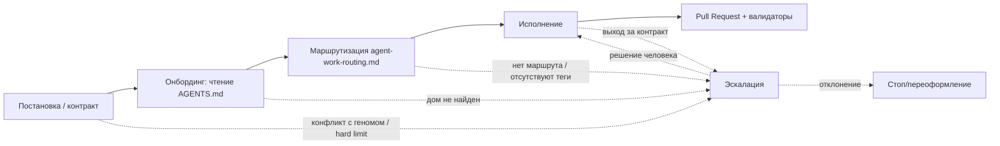

# RFC: Корневой контракт `AGENTS.md` — онбординг и маршрутизация ИИ-агентов

## RFC Metadata

| Field | Value |
| --- | --- |
| Owner | G-Ivan-A |
| RFC status | draft (совпадает с frontmatter; narrative summary) |
| Source issue | [#551](https://github.com/G-Ivan-A/hybrid-Intelligence-lab/issues/551) |
| Impacted artifacts | `AGENTS.md` (новый корневой), `ai-rules/agent-work-routing.md` (новый), `ai-rules/agent-work-rules.md`, `docs/adr/2026-07-adr-007-hub-root-structure.md`, `standards/agents-md-bootstrap-standard.md` (предлагается), `tools/validate-repository-structure.sh`, `templates/agents-md-root-draft.md`, `CONTRIBUTING.md`, `GOVERNANCE.md` |
| Decision record | not yet |
| Implementation link | not yet |
| Archetype scope | multi (A / B / C / D) |

## Summary

RFC предлагает легализовать корневой `AGENTS.md` как **обязательный артефакт
бутстрапа** для всех репозиториев экосистемы (Хаб и спицы всех архетипов).
`AGENTS.md` — это *краткий диспетчер* (мягкий слой доставки контекста), а не
дубликат правил: он выполняет онбординг агента, маршрутизирует к каноничным
документам в
[`ai-rules/`](https://github.com/G-Ivan-A/hybrid-Intelligence-lab/tree/main/ai-rules)
и
[`standards/`](https://github.com/G-Ivan-A/hybrid-Intelligence-lab/tree/main/standards)
и фиксирует правила эскалации. Принуждение обеспечивается **машинным гейтом**
(жёсткий слой) — валидатор падает при отсутствии `AGENTS.md` в корне. RFC не
принимает решение самостоятельно, а выносит его фаундеру: выбор пути легализации,
структуру `AGENTS.md` и связанных файлов
([`ai-rules/agent-work-routing.md`](https://github.com/G-Ivan-A/hybrid-Intelligence-lab/blob/main/ai-rules/agent-work-routing.md),
[`ai-rules/agent-work-rules.md`](https://github.com/G-Ivan-A/hybrid-Intelligence-lab/blob/main/ai-rules/agent-work-rules.md)),
граф приоритетов (контракт → исполнение / эскалация), правило об отсутствующих
тегах и адаптацию под архетипы. Отдельно разобрано сосуществование с уже
существующими корневыми
[`CONTRIBUTING.md`](https://github.com/G-Ivan-A/hybrid-Intelligence-lab/blob/main/CONTRIBUTING.md)
и
[`GOVERNANCE.md`](https://github.com/G-Ivan-A/hybrid-Intelligence-lab/blob/main/GOVERNANCE.md)
(P.9): найден один конфликт маршрутизации, удаление файлов отклонено с
обоснованием, предложено разделение ответственности. Постановка **дополняет, а
не отменяет** выводы бэклога B-110…B-116.

## Motivation

Полная доказательная база вынесена в источники и здесь не воспроизводится:

- [Анализ коренных причин несоблюдения правил](https://github.com/G-Ivan-A/hybrid-Intelligence-lab/blob/main/docs/analysis/2026-09-03-ai-rules-compliance-failure-root-cause.md)
  (issue #547) — шесть проверенных причин; ключевой вывод: **решающий фактор —
  отсутствующая маршрутизация из корня**, вторым идёт отсутствие явных запретов,
  раздутие — усилитель. `entrypoint: true` во frontmatter — метка для человека,
  ни один инструмент не читает frontmatter, чтобы найти точку входа.
- [Индустриальные практики онбординга](https://github.com/G-Ivan-A/hybrid-Intelligence-lab/blob/main/research/hub/2026-09-03-ai-agent-onboarding-entrypoint-practices.md)
  (issue #547) — `AGENTS.md`, `CLAUDE.md`, `.github/copilot-instructions.md`,
  `.cursor/rules/`; корневой инструкционный файл — де-факто стандарт доставки
  контекста, но сам по себе он не принуждает к исполнению (это закрывается
  hooks/CI).

Почему одного текста issue/PR недостаточно: черновик
[`templates/agents-md-root-draft.md`](https://github.com/G-Ivan-A/hybrid-Intelligence-lab/blob/main/templates/agents-md-root-draft.md)
(PR #548) существует, но лежит в `templates/` и в корень не размещён — то есть
инструменты его не подхватывают. Бэклог B-110…B-116 описывает план работ, но
**принятого решения нет**. Требуется proposal-stage решение фаундера до внедрения:
затрагиваются структура корня (ADR-007), класс `ai-rules/` и машинный гейт во
всех репозиториях экосистемы — это высокий governance-impact с cross-repository
последствиями, что по
[стандарту структуры RFC](https://github.com/G-Ivan-A/hybrid-Intelligence-lab/blob/main/standards/rfc-structure-standard.md)
требует RFC до ADR/стандарта.

**Уточнение по полным путям (НФТ issue #551).** Утверждение «в корневом `AGENTS.md`
Хаба допустимы короткие пути, но в спицах/HTOM — только полные» **подтверждается**:
Codex конкатенирует цепочку `AGENTS.md` и агент может исполняться из рабочего
каталога спицы, где относительная ссылка на правило Хаба неразрешима. Поэтому RFC
предлагает инвариант: **все ссылки на артефакты Хаба из любого `AGENTS.md`
(включая корневой Хаба) — абсолютные URL**; короткие относительные пути
допустимы только для ссылок внутри того же репозитория и только если валидатор
подтверждает их разрешимость. Это снимает двусмысленность «однозначно читаемых»
коротких путей в пользу машинно-проверяемого правила.

## Goals and Non-goals

**Решает этот RFC:**

1. Выбор пути легализации `AGENTS.md` (варианты в `Proposal`).
2. Структуру `AGENTS.md`, `ai-rules/agent-work-routing.md`,
   `ai-rules/agent-work-rules.md` и ссылку на глоссарий.
3. Граф приоритетов (контракт → исполнение / эскалация как параллельная ветка).
4. Правило об отсутствующих тегах (эскалация без остановки).
5. Модель адаптации под архетипы (база в Хабе, дельта в спицах).
6. Предложение по машинному гейту (валидатор падает без `AGENTS.md`).
7. Рекомендацию по компенсации риска «файл не прочитан».
8. Разграничение ответственности между `AGENTS.md` и существующими корневыми
   `CONTRIBUTING.md` / `GOVERNANCE.md`, включая обоснованный ответ на вопрос об
   их удалении (P.9).

**НЕ решает этот RFC (Non-goals):**

- Физическое размещение `AGENTS.md` в корне и создание тонких указателей —
  реализация B-110 после принятия.
- Скрипт инъекции в спицы — B-111.
- Устранение `docs/contracts/` в Mango и дом контрактных документов — B-112.
- Приведение Aether-Orbis к геному — B-113.
- Стандарт правил Story/ФТ/НФТ и легитимизация шаблонов — B-114, B-115.
- Полный набор машинных запретов и валидации пяти уровней постановки — B-116
  (RFC предлагает лишь наличие-гейт `AGENTS.md`, остальное делегируется B-116).
- Изменение содержания самих правил в `agent-work-rules.md` по существу.
- Фактическая правка `CONTRIBUTING.md` и перенос его агент-нормативных разделов в
  `ai-rules/` — RFC только предписывает эту работу (P.9.3), исполняется в
  B-110/B-111 после решения фаундера по Q-6.

## Proposal

### P.1. Путь легализации

RFC выносит фаундеру три варианта; **рекомендуется вариант B**.

| Вариант | Суть | Плюсы | Минусы |
| --- | --- | --- | --- |
| **A. Обновление ADR-007** | Внести `AGENTS.md` в To-Be структуру корня Хаба ([ADR-007](https://github.com/G-Ivan-A/hybrid-Intelligence-lab/blob/main/docs/adr/2026-07-adr-007-hub-root-structure.md)) как обязательный корневой файл. | Корень — предмет ADR-007; естественное место. | ADR-007 описывает **только архетип A (Хаб)**; обязательность для всех архетипов туда не помещается без расширения границ ADR. |
| **B. Новый стандарт бутстрапа (рекомендуется)** | Принять `standards/agents-md-bootstrap-standard.md`: `AGENTS.md` обязателен во всех архетипах, задаёт минимальную структуру, инвариант абсолютных ссылок и требование машинного гейта. ADR-007 дополняется одной строкой (внесение `AGENTS.md` в корень Хаба). | Обязательность — reusable rule для A/B/C/D; стандарт — правильный класс для «обязательного формата/критериев». Согласуется с моделью «стандарт задаёт форму, ADR — структурное решение». | Требует нового документа — проверить Anti-Inflation (обосновано: правило cross-archetype, в ADR-007 не помещается). |
| **C. Обновление существующего стандарта** | Добавить раздел в [`standards/rfc-structure-standard.md`](https://github.com/G-Ivan-A/hybrid-Intelligence-lab/blob/main/standards/rfc-structure-standard.md) или в правила `ai-rules/`. | Без нового файла. | Ни один существующий стандарт не про бутстрап/онбординг; размывание границ документов. |

Бэклог B-110 допускает «ускоренную легализацию через стандарт без предварительного
RFC». RFC не отменяет этого, но фиксирует: поскольку меняется структура корня для
класса репозиториев (все архетипы) и вводится cross-repository гейт, proposal-stage
решение фаундера уместно; данный RFC и является этим этапом.

### P.2. Структура `AGENTS.md`

База — черновик
[`templates/agents-md-root-draft.md`](https://github.com/G-Ivan-A/hybrid-Intelligence-lab/blob/main/templates/agents-md-root-draft.md).
RFC фиксирует обязательные XML-секции (парсинг LLM) и требования к каждой:

| Секция | Назначение | Слой |
| --- | --- | --- |
| `<scope>` | Единая точка входа; файл единый для всех моделей; модель-специфичные файлы правил запрещены. | мягкий |
| `<hard_rules>` | Критические запреты и обязанности до первого действия (PR-only, валидаторы, запрет вымыслов, «неполная постановка → исполняй без блокирования + зафиксируй пробел»). | жёсткий (декларация) |
| `<forbidden>` | Явный закрытый перечень запретов (`docs/contracts/`, модель-специфичные файлы, `ai-generated`, новые top-level каталоги без ADR, относительные ссылки на Хаб из спиц). | жёсткий (декларация) |
| `<routing>` | Таблица маршрутизации: тема → **абсолютный URL** каноничного документа. Диспетчер, не дубликат. | мягкий |
| `<artifact_homes>` | Дома артефактов и правила именования. | мягкий |
| `<issue_levels>` | Пять уровней постановки. | мягкий |
| `<missing_tags>` | **Новое (контракт issue #551).** Отсутствие тегов/обязательных полей (тип задачи, режим) не останавливает процесс, но инициирует эскалацию. | мягкий |
| `<context_scope>` | **Новое.** Правило набора релевантного контекста: не изучать всё, набирать по маршрутизации под класс задачи. | мягкий |
| `<validation>` | Команды валидаторов перед коммитом; красный валидатор = стоп. | жёсткий (указатель) |
| `<models>` | Как каждый инструмент подхватывает файл; дублирование правил запрещено. | мягкий |
| `<escalation>` | Правила эскалации и особый случай «постановка предписывает путь вне генома». | жёсткий (декларация) |

Инвариант размера: `AGENTS.md` остаётся коротким диспетчером (ориентир практики
~200 строк); правила по существу живут в `ai-rules/`, `AGENTS.md` только ссылается.

### P.3. Связанные файлы

**`ai-rules/agent-work-routing.md` (новый).** Выносит таблицу `<routing>` из
`AGENTS.md` в отдельный канонический документ: маршрутизация по типам задач и
режимам исполнения, с тегами, **абсолютными путями** и краткой суммаризацией, куда
ведёт каждая ссылка (чтобы агент выбирал, не открывая всё). `AGENTS.md` даёт
минимальную таблицу и ссылку на `agent-work-routing.md` как на полный маршрутизатор.

**`ai-rules/agent-work-rules.md` (существует).** Дополняется/подтверждается как SSOT
правил эскалации и двухфакторного подтверждения в контексте задач:
выход за границы контракта → коммит в PR → мерж/откат = подтверждение/отклонение;
явные ключевые слова подтверждения; в структурном режиме — двухфакторное
подтверждение каждого требования. Изменения по существу — вне scope (Non-goals);
RFC фиксирует только требуемую структуру.

**Глоссарий.** Ссылка на существующий
[`standards/glossary.md`](https://github.com/G-Ivan-A/hybrid-Intelligence-lab/blob/main/standards/glossary.md)
(новый глоссарий не создаётся — Anti-Inflation).

### P.4. Граф приоритетов (не линейная цепочка)

Приоритет правил — **граф**, а не цепочка. Эскалация — параллельная ветка,
доступная на любом этапе; контракт может уйти в эскалацию, минуя исполнение.



### P.5. Правило об отсутствующих тегах

В `<missing_tags>` `AGENTS.md`: если пользователь не обозначил теги или обязательные
поля (тип задачи, режим исполнения), это **не останавливает** процесс, но
**инициирует эскалацию** — агент фиксирует пробел (комментарий в issue/PR),
предлагает недостающие значения и продолжает работу под явно заявленным
предположением. Согласуется с `<hard_rules>` пункт «неполная постановка →
исполняй без блокирования + зафиксируй пробел».

### P.6. Архетипы репозиториев

`AGENTS.md` **обязателен для всех архетипов** (A/B/C/D). База (`<hard_rules>`,
`<forbidden>`, инвариант абсолютных ссылок, `<validation>`) задаётся в Хабе и
доставляется в спицы (B-111). Архетип-специфичная дельта добавляется в спице
(например, для C — команды сборки/тесты продукта; для D — учебная маршрутизация),
но не переопределяет `<hard_rules>` и `<forbidden>` Хаба. Скрипт синхронизации /
валидатор генома проверяет **наличие** `AGENTS.md` в корне каждого репозитория.

### P.7. Машинный гейт (жёсткий слой)

Расширить
[`tools/validate-repository-structure.sh`](https://github.com/G-Ivan-A/hybrid-Intelligence-lab/blob/main/tools/validate-repository-structure.sh):
добавить `AGENTS.md` в `required_files` и в allowlist активных корневых файлов,
чтобы **валидатор падал при отсутствии** `AGENTS.md`. Полный набор запретов
(`docs/contracts/`, модель-специфичные файлы, `ai-generated`) и валидация пяти
уровней постановки — за B-116; RFC предлагает только наличие-гейт как минимальный
жёсткий слой, без которого `AGENTS.md` остаётся рекомендацией.

Дополнительно к наличие-гейту предлагаются две проверки инварианта единственной
точки входа, обоснованные в P.9.3: `CONTRIBUTING.md` обязан ссылаться на
`/AGENTS.md` и не должен объявлять конкурирующую точку входа агента.

### P.8. Компенсация риска «не прочитан» (рекомендация)

Рекомендуется включить `AGENTS.md` как обязательный SSOT №0 в шаблон задачи
([`.github/ISSUE_TEMPLATE/task.md`](https://github.com/G-Ivan-A/hybrid-Intelligence-lab/blob/main/.github/ISSUE_TEMPLATE/task.md)):
даже если инструмент не подхватил файл автоматически, постановка сама указывает на
него как на первый источник. Это рекомендация, не жёсткое требование; окончательный
вариант — за исполнителем B-110/B-116.

### P.9. Сосуществование с корневыми `CONTRIBUTING.md` и `GOVERNANCE.md`

Раздел добавлен по уточнению постановки
([комментарий фаундера к PR #552](https://github.com/G-Ivan-A/hybrid-Intelligence-lab/pull/552#issuecomment-5527761347)):
проверить конфликт маршрутизации, обязательность этих файлов по текущим
стандартам и предложить стратегию сосуществования или удаления.

#### P.9.1. Обязательны ли `CONTRIBUTING.md` и `GOVERNANCE.md` сегодня

Проверка по факту, а не по общему впечатлению. Оба файла — **обязательные
корневые артефакты Хаба**, и обязательность зафиксирована в двух местах:

| Источник | Что фиксирует | Ссылка |
| --- | --- | --- |
| ADR-007, To-Be дерево корня | Оба файла присутствуют в целевой структуре: `GOVERNANCE.md` — «Target org-governance anchor aligned with `AI_GOVERNANCE.md`», `CONTRIBUTING.md` — «Contribution workflow and local validation commands». Сохранение `GOVERNANCE.md` названо осознанным расхождением с ADR-001. | [ADR-007](https://github.com/G-Ivan-A/hybrid-Intelligence-lab/blob/main/docs/adr/2026-07-adr-007-hub-root-structure.md) |
| `tools/validate-repository-structure.sh` | Оба файла — в массиве `required_files`; отсутствие любого из них уже сегодня даёт красный валидатор. Дополнительно на `CONTRIBUTING.md` навешено **около тридцати** проверок `require_text` (включая version-pin `version: 1.14`), на `GOVERNANCE.md` — две. | [validate-repository-structure.sh](https://github.com/G-Ivan-A/hybrid-Intelligence-lab/blob/main/tools/validate-repository-structure.sh) |

Уточнение по второму вопросу постановки: `pr-ops/repo-model.md` **не** нормирует
набор корневых файлов — его таблица «Структура» описывает только каталоги, а
именование корня делегировано
[`standards/file-naming.md`](https://github.com/G-Ivan-A/hybrid-Intelligence-lab/blob/main/standards/file-naming.md)
(где `CONTRIBUTING.md` и `GOVERNANCE.md` перечислены как исключения из
date-first-именования). Источник обязательности корневого набора — ADR-007 плюс
валидатор, и это же означает, что `repo-model.md` не придётся править ни при
одном из вариантов ниже.

Оба файла обязательны и за пределами корня Хаба, что расширяет цену удаления:

- [`standards/product-profile.md`](https://github.com/G-Ivan-A/hybrid-Intelligence-lab/blob/main/standards/product-profile.md):
  `CONTRIBUTING.md` — обязателен на стадиях Pilot и Production;
  `GOVERNANCE.md` — «обязателен, если есть ИИ-агенты», далее обязателен всегда.
- [`standards/team-contract.md`](https://github.com/G-Ivan-A/hybrid-Intelligence-lab/blob/main/standards/team-contract.md)
  — это стандарт **создания** project-level `CONTRIBUTING.md` и
  `AI_GOVERNANCE.md` для спиц, с готовым шаблоном текста.
- Шаблонные поверхности спиц содержат собственные копии:
  [`templates/htom/CONTRIBUTING.md`](https://github.com/G-Ivan-A/hybrid-Intelligence-lab/blob/main/templates/htom/CONTRIBUTING.md),
  [`templates/spoke/CONTRIBUTING.md`](https://github.com/G-Ivan-A/hybrid-Intelligence-lab/blob/main/templates/spoke/CONTRIBUTING.md)
  — обе с собственными `require_text`-проверками.
- [`standards/session-handover-standard.md`](https://github.com/G-Ivan-A/hybrid-Intelligence-lab/blob/main/standards/session-handover-standard.md),
  [`standards/issue-workflow.md`](https://github.com/G-Ivan-A/hybrid-Intelligence-lab/blob/main/standards/issue-workflow.md),
  [`standards/glossary.md`](https://github.com/G-Ivan-A/hybrid-Intelligence-lab/blob/main/standards/glossary.md),
  [`standards/artifact-deprecation-standard.md`](https://github.com/G-Ivan-A/hybrid-Intelligence-lab/blob/main/standards/artifact-deprecation-standard.md),
  [`README.md`](https://github.com/G-Ivan-A/hybrid-Intelligence-lab/blob/main/README.md)
  ссылаются на них как на действующие контракты.

**Вывод по вопросу 2:** да, оба файла предусмотрены текущими стандартами как
обязательные, причём обязательность уже машинно принуждается. Их удаление — не
правка документации, а изменение ADR-007, валидатора, двух шаблонных поверхностей
и пяти стандартов.

#### P.9.2. Проверка на конфликты маршрутизации

Сверка предлагаемого `AGENTS.md` (база —
[`templates/agents-md-root-draft.md`](https://github.com/G-Ivan-A/hybrid-Intelligence-lab/blob/main/templates/agents-md-root-draft.md))
с текстом обоих корневых файлов дала один реальный конфликт и один класс риска;
прямых противоречий в правилах не обнаружено.

| № | Наблюдение | Тип | Оценка |
| --- | --- | --- | --- |
| K-1 | `CONTRIBUTING.md`, раздел «AI-Assisted Work»: «AI agents начинают с `GOVERNANCE.md`, затем применяют `AI Governance` и `Agent Work Rules`». | **Конфликт маршрутизации** | Прямое противоречие модели «`AGENTS.md` — SSOT №0». Два корневых файла объявляют разные точки входа агента; агент, прочитавший `CONTRIBUTING.md` первым, уходит по устаревшему маршруту. Требует правки при принятии RFC. |
| K-2 | `CONTRIBUTING.md` содержит агент-нормативные разделы, а не только человеческий workflow: «Правило авто-заполнения Мета», «Специфика работы с AI-агентами», «Работа с внешними источниками», «Консолидация открытых вопросов», запрет агенту ставить метку `no-diff-expected`. | **Риск раздвоения SSOT** | Правила поведения агента живут вне `ai-rules/`. Противоречий с `ai-rules/agent-work-rules.md` сейчас нет, но два дома одного класса правил гарантируют дрейф. Это и есть настоящая проблема, а не само существование файла. |
| K-3 | `templates/htom/AI_QUICK_RULES.md` и `templates/htom/AI_SESSION_HANDOVER_PROMPT.md` предписывают агенту читать локальный `CONTRIBUTING.md` как governance-чек-лист. | **Риск раздвоения SSOT** | Тот же дефект, воспроизведённый в шаблонах спиц. Правится в B-111 вместе с инъекцией `AGENTS.md`. |
| K-4 | `GOVERNANCE.md` — 23 строки, ноль нормативного текста: перенаправляет в `ai-governance/`, `ai-rules/`, `pr-ops/`, `standards/` и прямо декларирует «остаётся тонкой стабильной точкой входа и не дублирует нормативные тексты». | **Конфликта нет** | Целевые адреса совпадают с маршрутизацией `AGENTS.md`. Файл уже является ровно тем «тонким корневым якорем», который описан в варианте фаундера. |
| K-5 | Тематические пересечения `AGENTS.md` ↔ `CONTRIBUTING.md`: Operating Mode, именование файлов, frontmatter, локальная проверка. | **Конфликта нет** | Оба файла ссылаются на одни и те же стандарты (`standards/frontmatter-standard.md`, `standards/file-naming.md`), а не задают собственные правила. Дублируется повествование, а не норма. |

Проверка НФТ об абсолютных путях на этом же материале: `CONTRIBUTING.md` и
`GOVERNANCE.md` используют относительные ссылки. Это корректно для файлов,
читаемых внутри одного репозитория, и подтверждает границу инварианта Q-2:
абсолютные URL обязательны для `AGENTS.md` и связанных файлов маршрутизации,
которые могут читаться из спицы, а не для всех корневых документов Хаба.

#### P.9.3. Стратегия: сосуществование с разделением ответственности

Фаундер явно допустил удаление обоих файлов при условии обоснования. Анализ
показал, что дублирования **функций** нет, а есть неверное **размещение части
содержания**, поэтому RFC рекомендует не удаление, а разделение ответственности
плюс перенос агент-нормативных разделов. Аргументы против удаления:

1. **Удаление ломает собственный жёсткий слой RFC.** `CONTRIBUTING.md` и
   `GOVERNANCE.md` — в `required_files` валидатора. Удалять их пришлось бы вместе
   с ~30 проверками `require_text`, то есть тем же PR ослабляя валидатор, который
   этот RFC предлагает усилить.
2. **Разная аудитория и разная инструментальная поверхность.**
   `CONTRIBUTING.md` — конвенция GitHub: платформа сама показывает его человеку
   при создании issue и PR. `AGENTS.md` — конвенция агентных инструментов. Удаление
   `CONTRIBUTING.md` убирает человеческую точку входа, ничего не давая агенту.
3. **`GOVERNANCE.md` уже минимален.** 23 строки без нормативного текста — это не
   избыточный артефакт по
   [Anti-Inflation Principle](https://github.com/G-Ivan-A/hybrid-Intelligence-lab/blob/main/pr-ops/repo-model.md);
   он снимает наблюдаемую боль (стабильный корневой адрес governance-слоя,
   зафиксированный ADR-007).
4. **Стоимость несоразмерна scope.** Удаление затрагивает ADR-007, валидатор,
   `templates/htom/`, `templates/spoke/` и пять стандартов, включая
   `team-contract.md`, целиком построенный вокруг `CONTRIBUTING.md`. Это отдельная
   задача бэклога, а не побочный эффект легализации `AGENTS.md`.

Целевое разделение ответственности:

| Файл | Аудитория | Ответственность | Чего не содержит |
| --- | --- | --- | --- |
| `AGENTS.md` | ИИ-агент | Единственная точка входа и маршрутизатор: критические запреты, онбординг, ссылки на `ai-rules/`, правила эскалации, правило набора контекста. SSOT №0. | Полных текстов правил, человеческого PR-workflow. |
| `CONTRIBUTING.md` | Человек | Workflow вклада: issue → PR → review, PR checklist, локальные команды проверки, ожидания к диффу. | Нормативных правил поведения агента: они переезжают в `ai-rules/`, остаётся ссылка. Раздел «AI-Assisted Work» заменяется одной строкой-указателем на `/AGENTS.md`. |
| `GOVERNANCE.md` | Человек, внешний читатель | Тонкий корневой якорь governance-слоя: редирект в `ai-governance/`, `ai-rules/`, `pr-ops/`, `standards/`. Уже соответствует. | Нормативных текстов (и сейчас не содержит). Изменений не требует. |

**Инвариант, вытекающий из разделения:** ни один корневой файл, кроме
`AGENTS.md`, не содержит нормативных правил для ИИ-агента; такие правила живут в
`ai-rules/` и `ai-governance/`, а корневые файлы содержат только ссылки на них.
Инвариант машинно проверяем и предлагается к добавлению в наличие-гейт P.7:

- `CONTRIBUTING.md` обязан содержать ссылку на `/AGENTS.md`
  (`require_text "CONTRIBUTING.md" "AGENTS.md"`);
- `CONTRIBUTING.md` не должен содержать конкурирующую формулировку точки входа
  агента (reject-проверка на текст «AI agents начинают с `GOVERNANCE.md`»).

Работы, которые из этого следуют (исполняются в B-110/B-111, не этим RFC):

1. Переписать раздел «AI-Assisted Work» в `CONTRIBUTING.md` на указатель
   «ИИ-агент начинает с `/AGENTS.md`» — снимает конфликт K-1.
2. Перенести агент-нормативные разделы `CONTRIBUTING.md` (K-2) в `ai-rules/`,
   оставив в `CONTRIBUTING.md` ссылки; синхронно снять соответствующие
   `require_text`-проверки и перевесить их на файлы-приёмники, иначе валидатор
   станет красным.
3. Обновить `templates/htom/AI_QUICK_RULES.md` и
   `templates/htom/AI_SESSION_HANDOVER_PROMPT.md` (K-3) в рамках B-111.
4. `GOVERNANCE.md` не трогать.

**Отклонённый вариант D (удаление обоих файлов)** зафиксирован в разделе
`Alternatives` с причиной отклонения. Если фаундер выберет его вопреки
рекомендации (Q-6), обязательными предусловиями являются: правка ADR-007 с новым
ADR (исторические документы иммутабельны), снятие обоих файлов из `required_files`
и всех `require_text`, перенос человеческого workflow в `pr-ops/`, переработка
`standards/team-contract.md` и `standards/product-profile.md`, чистка шаблонных
поверхностей. Это отдельная задача бэклога с собственным decision gate.

## Alternatives

- **Только `AGENTS.md` без машинного гейта.** Отклонено: анализ причин показывает,
  что доставка без принуждения повторит судьбу `ai-rules/` — файл не гарантирован в
  контексте, а «мягкое» правило не проверяется.
- **Модель-специфичные файлы правил (CODEX.md/OPUS.md с полными правилами).**
  Отклонено: дублирование правил, дрейф между копиями; практика и черновик прямо
  запрещают это (только тонкие указатели-ссылки).
- **Оставить маршрутизацию только внутри `AGENTS.md`, без `agent-work-routing.md`.**
  Отклонено: раздувает диспетчер и смешивает уровни; маршрутизатор — переиспользуемый
  артефакт для всех архетипов и должен жить в `ai-rules/`.
- **Легализация через ADR-007 (вариант A).** Отклонено как основной путь: ADR-007
  ограничен архетипом A и не выражает обязательность для B/C/D; используется лишь
  как точечное дополнение к варианту B.
- **Вариант D: удаление `CONTRIBUTING.md` и `GOVERNANCE.md` как избыточных.**
  Отклонено (разбор — P.9.3): дублирования функций нет, есть неверное размещение
  части содержания `CONTRIBUTING.md`. Оба файла — в `required_files` валидатора,
  на `CONTRIBUTING.md` навешено ~30 проверок `require_text`; удаление ослабило бы
  тот самый жёсткий слой, который RFC предлагает усилить, и затронуло бы ADR-007,
  две шаблонные поверхности спиц и пять стандартов. `GOVERNANCE.md` уже является
  тонким якорем без нормативного текста (23 строки). Вместо удаления предлагается
  перенос агент-нормативных разделов `CONTRIBUTING.md` в `ai-rules/`.
- **Оставить `CONTRIBUTING.md` без изменений при принятии `AGENTS.md`.** Отклонено:
  сохраняется конфликт K-1 — «AI agents начинают с `GOVERNANCE.md`» противоречит
  модели «`AGENTS.md` — SSOT №0», и агент получает две конкурирующие точки входа.

## Trade-offs

- **Новый стандарт** повышает число нормативных документов — компенсируется
  Anti-Inflation-обоснованием (cross-archetype правило, в ADR-007 не помещается).
- **Наличие-гейт в валидаторе** — breaking change для репозиториев без `AGENTS.md`
  до его доставки; требуется правило «валидатор и файл — одним циклом синхронизации»
  (по образцу RFC #532, миграция M0–M4) и/или grandfathering на один цикл.
- **Инвариант абсолютных ссылок** увеличивает длину ссылок и стоимость правок при
  переезде репозитория; компенсируется машинной проверкой разрешимости и тем, что
  агент часто исполняется из спицы, где относительные ссылки на Хаб неразрешимы.
- **Дельта под архетипы** повышает вариативность содержимого — ограничивается
  запретом переопределять `<hard_rules>`/`<forbidden>` Хаба.
- **Перенос агент-нормативных разделов из `CONTRIBUTING.md` в `ai-rules/`** (P.9.3)
  временно повышает риск разрыва ссылок и требует синхронного переноса
  `require_text`-проверок валидатора в том же PR; компенсируется тем, что перенос
  устраняет второй дом для правил агента, а не создаёт третий.

## Impacted Artifacts

- `AGENTS.md` — новый корневой файл (реализация B-110).
- `ai-rules/agent-work-routing.md` — новый маршрутизатор.
- [`ai-rules/agent-work-rules.md`](https://github.com/G-Ivan-A/hybrid-Intelligence-lab/blob/main/ai-rules/agent-work-rules.md) — подтверждение структуры правил эскалации/2FA.
- `standards/agents-md-bootstrap-standard.md` — предлагаемый стандарт (вариант B).
- [`docs/adr/2026-07-adr-007-hub-root-structure.md`](https://github.com/G-Ivan-A/hybrid-Intelligence-lab/blob/main/docs/adr/2026-07-adr-007-hub-root-structure.md) — точечное дополнение (корень Хаба).
- [`tools/validate-repository-structure.sh`](https://github.com/G-Ivan-A/hybrid-Intelligence-lab/blob/main/tools/validate-repository-structure.sh) — наличие-гейт `AGENTS.md`.
- [`templates/agents-md-root-draft.md`](https://github.com/G-Ivan-A/hybrid-Intelligence-lab/blob/main/templates/agents-md-root-draft.md) — база структуры.
- [`CONTRIBUTING.md`](https://github.com/G-Ivan-A/hybrid-Intelligence-lab/blob/main/CONTRIBUTING.md) — раздел «AI-Assisted Work» переписывается в указатель на `/AGENTS.md`; агент-нормативные разделы переносятся в `ai-rules/` (P.9.3, исполняется в B-110/B-111).
- [`GOVERNANCE.md`](https://github.com/G-Ivan-A/hybrid-Intelligence-lab/blob/main/GOVERNANCE.md) — изменений не требует (уже тонкий якорь без нормативного текста).
- [`templates/htom/AI_QUICK_RULES.md`](https://github.com/G-Ivan-A/hybrid-Intelligence-lab/blob/main/templates/htom/AI_QUICK_RULES.md), [`templates/htom/AI_SESSION_HANDOVER_PROMPT.md`](https://github.com/G-Ivan-A/hybrid-Intelligence-lab/blob/main/templates/htom/AI_SESSION_HANDOVER_PROMPT.md) — снятие указания читать `CONTRIBUTING.md` как governance-чек-лист (B-111).
- Тонкие указатели: `CLAUDE.md`, `.github/copilot-instructions.md`, `.cursor/rules/` (реализация B-110).

Этот RFC ничего из перечисленного не внедряет — только предлагает решение.

## Implementation and Validation

Внедрение — отдельными задачами после решения фаундера: B-110 (легализация и
размещение), B-111 (инъекция в спицы), B-116 (машинные гейты). Локальная проверка
самого RFC и будущих артефактов:

```bash
./tools/validate-frontmatter.sh .
./tools/validate-file-naming.sh
./tools/validate-repository-structure.sh
```

Критерий приёмки наличие-гейта: удаление `AGENTS.md` из корня приводит к красному
`validate-repository-structure.sh` (регресс-проверка добавляется в B-116).

Критерий приёмки инварианта единственной точки входа (P.9.3): после правки
`CONTRIBUTING.md` в нём нет формулировки, объявляющей точкой входа агента что-либо
кроме `AGENTS.md`, и есть ссылка на `/AGENTS.md`; перенесённые в `ai-rules/`
разделы покрыты `require_text`-проверками на файлах-приёмниках, а снятые с
`CONTRIBUTING.md` проверки удалены тем же PR (иначе валидатор красный).

## Lifecycle and Decision Path

Текущий статус — `draft`. Требуемый человеческий гейт — решение фаундера по
`Open Questions` (в первую очередь Q-1 путь легализации). После решения:
`draft → proposed → accepted`; при `accepted` заполняются `Decision record`
(ADR/принятый RFC) и `Implementation link` (PR B-110). Пост-акцепт делегирование:
стандарт бутстрапа + правки ADR-007 + валидатор — отдельными PR по задачам бэклога.

## Open Questions

Только блокирующие вопросы фаундеру:

- **Q-1.** Какой путь легализации принять — A (ADR-007), **B (новый стандарт
  бутстрапа, рекомендуется)** или C (обновление существующего стандарта)?
- **Q-2.** Принимается ли инвариант «все ссылки на артефакты Хаба из любого
  `AGENTS.md` — абсолютные URL» (включая корневой `AGENTS.md` Хаба)?
- **Q-3.** Выносить таблицу маршрутизации в отдельный
  `ai-rules/agent-work-routing.md` или оставить внутри `AGENTS.md`?
- **Q-4.** Наличие-гейт `AGENTS.md` вводить сразу как `FAIL` или через
  grandfathering на один цикл синхронизации (совместно с B-111)?
- **Q-5.** Принимается ли рекомендация P.8 (включить `AGENTS.md` в шаблон задачи
  как обязательный SSOT №0)?
- **Q-6.** Принимается ли рекомендация P.9.3 — **сохранить** `CONTRIBUTING.md` и
  `GOVERNANCE.md` с разделением ответственности (человеческий workflow /
  governance-якорь / `AGENTS.md` как SSOT агента) и перенести агент-нормативные
  разделы `CONTRIBUTING.md` в `ai-rules/` — или выбирается отклонённый вариант D
  (удаление обоих файлов с обратной легитимизацией)? При выборе D требуется
  отдельная задача бэклога с новым ADR, заменяющим решение ADR-007 по корню.

## Related Artifacts

- Черновик: [`templates/agents-md-root-draft.md`](https://github.com/G-Ivan-A/hybrid-Intelligence-lab/blob/main/templates/agents-md-root-draft.md)
- Анализ причин: [`docs/analysis/2026-09-03-ai-rules-compliance-failure-root-cause.md`](https://github.com/G-Ivan-A/hybrid-Intelligence-lab/blob/main/docs/analysis/2026-09-03-ai-rules-compliance-failure-root-cause.md)
- Исследование практик: [`research/hub/2026-09-03-ai-agent-onboarding-entrypoint-practices.md`](https://github.com/G-Ivan-A/hybrid-Intelligence-lab/blob/main/research/hub/2026-09-03-ai-agent-onboarding-entrypoint-practices.md)
- ADR-007: [`docs/adr/2026-07-adr-007-hub-root-structure.md`](https://github.com/G-Ivan-A/hybrid-Intelligence-lab/blob/main/docs/adr/2026-07-adr-007-hub-root-structure.md)
- Бэклог B-110…B-116: [`pr-ops/backlog.md`](https://github.com/G-Ivan-A/hybrid-Intelligence-lab/blob/main/pr-ops/backlog.md)
- Стандарт структуры RFC: [`standards/rfc-structure-standard.md`](https://github.com/G-Ivan-A/hybrid-Intelligence-lab/blob/main/standards/rfc-structure-standard.md)
- Правила агента: [`ai-rules/agent-work-rules.md`](https://github.com/G-Ivan-A/hybrid-Intelligence-lab/blob/main/ai-rules/agent-work-rules.md), [`ai-rules/agent-onboarding-protocol.md`](https://github.com/G-Ivan-A/hybrid-Intelligence-lab/blob/main/ai-rules/agent-onboarding-protocol.md)
- Корневые файлы, разобранные в P.9: [`CONTRIBUTING.md`](https://github.com/G-Ivan-A/hybrid-Intelligence-lab/blob/main/CONTRIBUTING.md), [`GOVERNANCE.md`](https://github.com/G-Ivan-A/hybrid-Intelligence-lab/blob/main/GOVERNANCE.md), [`standards/team-contract.md`](https://github.com/G-Ivan-A/hybrid-Intelligence-lab/blob/main/standards/team-contract.md), [`standards/product-profile.md`](https://github.com/G-Ivan-A/hybrid-Intelligence-lab/blob/main/standards/product-profile.md)
- Источник issue: [#551](https://github.com/G-Ivan-A/hybrid-Intelligence-lab/issues/551), контекст [#547](https://github.com/G-Ivan-A/hybrid-Intelligence-lab/issues/547)
