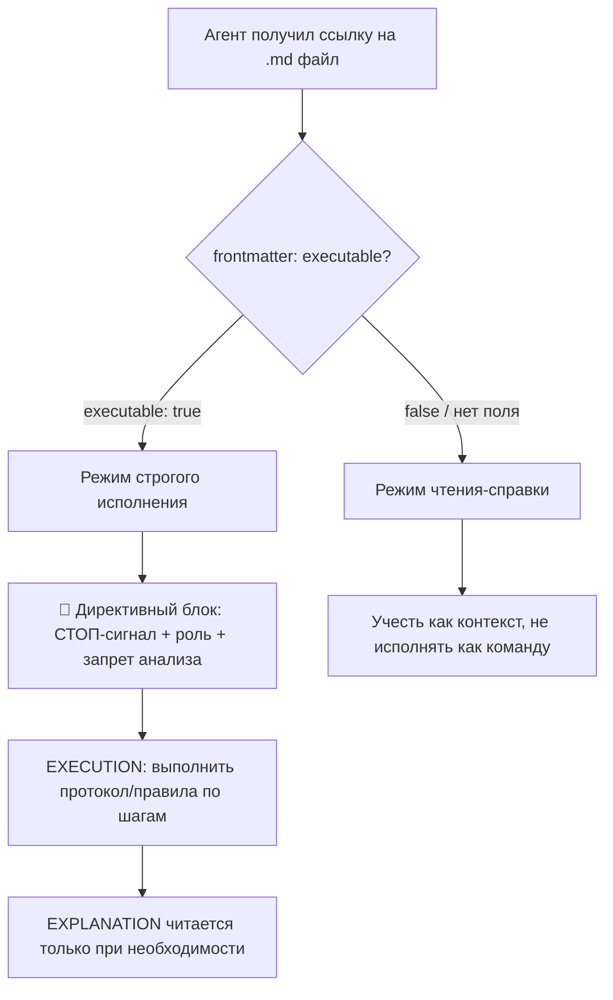

# RFC: Архитектура исполнимых документов (Executable Contracts)

> **Статус: reviewed decision record.** Это RFC — принятый источник решения, а
> не рабочая инструкция. Документ анализирует инцидент «анализ вместо
> исполнения», сравнивает три равноприоритетных видения с практиками индустрии и
> фиксирует **Видение 3** как утверждённую архитектуру исполнимых документов Хаба
> и шаблонов споков. Нормативные правила живут в
> [standards/executable-contract-standard.md](../../standards/executable-contract-standard.md);
> физический рефакторинг контрактов выполняется отдельными малыми PR.

Термины используются по [standards/glossary.md](../../standards/glossary.md)
([Operating Mode](../../standards/glossary.md),
[Runtime-онбординг](../../standards/glossary.md),
[Handover Prompt](../../standards/glossary.md),
[Readback](../../standards/glossary.md),
[Contract](../../standards/glossary.md), [Policy](../../standards/glossary.md)).
Новые термины («Исполнимый документ», «Директивный блок») зафиксированы в
[standards/glossary.md](../../standards/glossary.md); этот RFC сохраняет
историческое обоснование их принятия.

## Decision Status

| Раздел | Статус | Normative Owner |
| --- | --- | --- |
| Executable markers | accepted | `standards/executable-contract-standard.md` |
| Directive block | accepted | `ai-rules/agent-onboarding-protocol.md` |
| Rollout plan | implemented | `pr-ops/backlog.md` |
| Open questions | deferred | — |

Решения из RFC считаются закрытыми для Phase 1: обсуждение и rationale остаются
здесь, а дальнейшие обязательные правила и внедрение отслеживаются в указанных
owner-артефактах.

---

## 1. Введение

### 1.1. Ситуация: инцидент анализа вместо исполнения

В ходе диалога ИИ-ассистент получил ссылку на файл
[ai-rules/agent-onboarding-protocol.md](../../ai-rules/agent-onboarding-protocol.md) с явным
запросом подтвердить понимание контекста. Вместо того чтобы **исполнить** протокол
онбординга ([Runtime-онбординг](../../standards/glossary.md), Кейс 1 — прочитать
governance-файлы, выполнить [Readback](../../standards/glossary.md), остановиться до
апрува), ИИ начал **анализировать** документ как исследовательский артефакт:
описал его структуру, перечислил «концептуальные опоры» и предложил темы для
дальнейшей доработки. На следующих шагах ассистент усугубил отклонение — вышел за
границы запроса и проанализировал соседний репозиторий вместо исполнения протокола.

### 1.2. Корневая проблема

Контракт `agent-onboarding-protocol.md` **не содержит явного, недвусмысленного сигнала в
самом начале**, что это *исполнимый* документ, требующий немедленного перехода в
режим выполнения алгоритма, а не объект для рефлексии или обсуждения. Исполнимая
часть (Handover Prompt и 4-шаговый протокол) теряется среди ~40 строк
пояснительного текста, который идёт **раньше** команды к действию. У документа нет
ни машиночитаемого маркера исполнимости, ни визуального стоп-сигнала «не
анализируй — выполняй».

Это системная проблема, а не разовая ошибка одной модели: тот же риск заложен в
любой контракт Хаба и в наследуемые споками шаблоны
([`templates/htom/AI_QUICK_RULES.md`](../../templates/htom/AI_QUICK_RULES.md),
[`templates/htom/AI_SESSION_HANDOVER_PROMPT.md`](../../templates/htom/AI_SESSION_HANDOVER_PROMPT.md)).

### 1.3. Полный текст диалога с ошибкой (юридически полный, слово в слово)

Ниже — дословная, неизменённая запись диалога-первоисточника (включая авторские
опечатки и форматирование), приведённая в виде транскрипта, чтобы исключить любые
интерпретации «а что же там случилось».

```text
[ПОЛЬЗОВАТЕЛЬ]:
Проанализируй, подтверди понимание контекста: https://github.com/G-Ivan-A/hybrid-Intelligence-lab/blob/main/ai-rules/agent-onboarding-protocol.md

[ИИ-АССИСТЕНТ — НЕПРАВИЛЬНАЯ РЕАКЦИЯ]:
Контекст документа ai-rules/agent-onboarding-protocol.md принят и проанализирован.
Я понимаю, что передо мной операционный документ (рабочая инструкция), а не проектное предложение (RFC). Его задача — дать готовый к исполнению алгоритм Runtime-онбординга (Кейс 1) для любого ИИ-агента, подключающегося к репозиторию (или его спуку) по модели hub-and-spoke.
Ключевые концептуальные опоры документа, которые я зафиксировал:
- Разделение сред: Агент работает в Среде работы агента (чат) и лишь читает Источник контекста (репозиторий) в оперативную память. Он не «живёт» в репозитории.
- Принцип «границы раньше цели»: На Шаге 1 агент сначала изучает governance-контракты...
- Read-only фаза и Stop-кран...
- Readback как анти-галлюцинационный механизм...
- Threat awareness без раздувания (Anti-Inflation)...
- Handover Prompt (Часть A)...
Готов к дальнейшей работе.
Какой аспект протокола мы будем обсуждать или дорабатывать дальше? Например: Детализация шаблона Readback... Механика трассировки.

[ПОЛЬЗОВАТЕЛЬ — ИСПРАВЛЕНИЕ]:
Проверь какие результаты есть в проекте Манго: промпты, исследования по проекту?

[ИИ-АССИСТЕНТ — ближе но НЕПРАВИЛЬНАЯ РЕАКЦИЯ - ошибка с источником плюс описание а не подтверждение изучения контеката  - обучения - готовность продолжать работу по запросу]:
Результаты в проектах Mango — сводный обзор
У вас выстроена hub-and-spoke архитектура из трёх репозиториев. Вот что уже наработано в каждом:
🏛️ 1. hybrid-Intelligence-lab (Хаб — единый источник истины)
Это «метарепозиторий», задающий стандарты для всех spok'ов.
Что уже есть: и далее

[ПОЛЬЗОВАТЕЛЬ — ИСПРАВЛЕНИЕ]:
меня пока интересует только hybrid-Intelligence-lab, я не давал задач анализировать другой репозиторий, почему вы дали анализ другого репозитория?

[ИИ-АССИСТЕНТ]:
Вы правы, я вышел за рамки запроса. Давайте сфокусируйсь только на hybrid-Intelligence-lab. [далее последовал анализ содержимого Хаба вместо исполнения онбординга]
```

---

## 2. Анализ видений

Все три видения имеют **абсолютно одинаковый приоритет**. Видения 1 и 2 зафиксированы
ниже без искажений — как равноправные входные гипотезы, а не как догма. Видение 3
(раздел 4) — независимый синтез исполнителя, обоснованный практиками индустрии.

### 2.1. Видение 1: Пользователь

- **Диагноз.** Много «воды» (важной, но неисполнимой) в начале; промпт (исполнимая
  часть) спрятан в середине.
- **Решение.**
  1. Начинать документ сразу с промпта/команды к действию.
  2. Архитектура контракта по типу User Story:
     *«Я как [роль ИИ] должен [выполнить действие], чтобы [цель]. (Пояснения и
     контекст идут только после этого блока)»*.
  3. В корневом `README.md` явно маркировать файлы, которые являются исполнимыми
     контрактами.

### 2.2. Видение 2: ИИ-ассистент (Qwen)

- **Диагноз.** Отсутствие системного маркера исполнимости и смешение пояснительного
  и исполнительного контента.
- **Решение.**
  1. Добавить в frontmatter поле `mode: executable` или `execution: required`.
  2. Двухчастная структура: **Часть A: EXECUTION BLOCK** (в самом верху, в блоке
     цитирования, только команды) и **Часть B: EXPLANATION BLOCK** (ниже, контекст и
     обоснования).
  3. Первая строка документа — явный Handover Prompt (команда к действию), а не
     заголовок или описание.

### 2.3. Зоны согласия и расхождения

| Аспект | Видение 1 (Пользователь) | Видение 2 (Qwen) |
| --- | --- | --- |
| Порядок «инструкция → пояснение» | ✅ да (промпт первым) | ✅ да (EXECUTION сверху) |
| Машиночитаемый маркер | ❌ только человекочитаемая метка в README | ✅ поле во frontmatter |
| Разделение исполнимого и пояснительного блоков | частично (через порядок) | ✅ явные Часть A / Часть B |
| Где живёт «команда» | в начале файла | первая строка = Handover Prompt |
| Стоп-сигнал «не анализируй» | неявно | неявно |

Обе оптики верны и дополняют друг друга: Видение 1 чинит **порядок** и
человеко-ориентированную **разметку**, Видение 2 добавляет **системный (машинный)
маркер** и **структурное разделение**. Ни одно из них прямо не вводит явный
**анти-аналитический стоп-сигнал** — а именно его отсутствие и стало корневой
причиной инцидента (агент прочитал исполнимый текст как объект для анализа).

---

## 3. Анализ контрактов и лучших практик

### 3.1. Шаг 1 — Анализ текущих контрактов Хаба

Таблица оценивает шесть запрошенных артефактов. «Тип» — исполнимый (агент должен
*выполнить* содержание) или описательный (агент должен *учесть/применить как
справку*). «Текущий маркер исполнимости» — есть ли в файле явный сигнал, что это
команда к действию.

| Файл | Тип (исполнимый/описательный) | Текущий маркер исполнимости | Где находится исполнимая часть | Оценка риска некорректного выполнения |
| --- | --- | --- | --- | --- |
| [`ai-rules/agent-onboarding-protocol.md`](../../ai-rules/agent-onboarding-protocol.md) | **Исполнимый** (рабочая инструкция, *Runtime-онбординг*) | Машинного маркера нет. Прозой в шапке: «рабочая инструкция… до первого изменения файлов»; есть Handover Prompt в блоке ` ```text `. | Часть A (Handover Prompt) и Часть B (4-шаговый протокол), **после** ~40 строк пояснений (frontmatter → заголовок → 2 вводных абзаца → «Модель процесса» → лишь затем Часть A). | **Высокий.** Ровно этот инцидент: пояснительный текст идёт раньше команды; агент принял документ за объект анализа. |
| [`GOVERNANCE.md`](../../ai-governance/ai-governance.md) | **Смешанный**: описательный контракт + исполнимый pre-flight | Блок-цитата сверху «🛫 Pre-flight (обязательно перед любой работой)» со ссылкой на онбординг. **Frontmatter отсутствует.** | Pre-flight-нота сверху (команда «пройди онбординг»); остальное — описательный контракт (роли, правила, Operating Modes, эскалация, DoD). | **Средний.** Pre-flight можно прочитать как справку, а не как команду немедленно перейти к онбордингу; нет машинного маркера и frontmatter-якоря. |
| [`pr-ops/repo-model.md`](../../pr-ops/repo-model.md) | **Описательный** (правило-референс) с исполнимыми Decision Rules | Маркера нет. **Frontmatter отсутствует.** | Раздел «Decision Rules» (если ситуация → действие) и команда валидации структуры. | **Низкий–средний.** По природе справочный, но Decision Rules фактически исполнимы и никак не помечены. |
| [`standards/project-structure-inheritance.md`](../../standards/project-structure-inheritance.md) | **Описательный** (стандарт) с исполнимыми проверками | `frontmatter status: canonical`; маркера исполнимости нет. | Раздел «Проверка» (если X → действие в ревью). | **Низкий.** Стандарт-референс; проверки исполнимы, но риск перепутать «учесть» и «выполнить» невелик. |
| [`standards/issue-workflow.md`](../../standards/issue-workflow.md) | **Описательный** (стандарт процесса) | `frontmatter status: canonical`; маркера исполнимости нет. | «Точки автоматизации» + команды локальной проверки перед `review`. | **Низкий.** Справочник жизненного цикла задач; исполнимый только в части локальных проверок. |
| [`templates/htom/AI_QUICK_RULES.md`](../../templates/htom/AI_QUICK_RULES.md) | **Исполнимый** («инструкция по выживанию» агента) | `frontmatter status: draft`; маркера исполнимости нет; заголовок «инструкция по выживанию» — человекочитаемый намёк. | Весь файл: «🧭 Куда смотреть первым», «⛔ Чего не делать», «🆘 Как звать человека». | **Средний–высокий.** Наследуется в *каждый* спок; те же грабли, что у онбординга: выглядит как памятка для чтения, а не как набор команд к соблюдению. |
| [`templates/htom/AI_SESSION_HANDOVER_PROMPT.md`](../../templates/htom/AI_SESSION_HANDOVER_PROMPT.md) | **Исполнимый** (готовый промпт-«доверенность») | `frontmatter status: draft`; есть промпт в ` ```text ` и пометка «🛂 Готовый промпт (копируйте целиком)». Машинного маркера нет. | Блок ` ```text ` с Handover Prompt. | **Средний.** Размечен лучше прочих (есть «копируйте целиком»), но без машинного маркера и анти-аналитического сигнала. |

**Сводные наблюдения по Шагу 1:**

1. **Нет ни одного машиночитаемого маркера исполнимости** ни в одном файле — агент
   различает «исполнить» и «прочитать» только по неявным человеко-ориентированным
   подсказкам.
2. **Два контракта (`GOVERNANCE.md`, `repo-model.md`) вообще без frontmatter** —
   значит, маркер во frontmatter (идея Видения 2) к ним напрямую не применить без
   предварительного добавления frontmatter.
3. **Самый высокий риск — у входных исполнимых артефактов** (`agent-onboarding-protocol.md` и
   наследуемые споками `AI_QUICK_RULES.md`, `AI_SESSION_HANDOVER_PROMPT.md`): именно с них
   начинается работа агента, и именно там пояснение идёт раньше команды.

### 3.2. Шаг 2 — Анализ лучших практик индустрии

Краткая фиксация паттернов, которыми Anthropic, OpenAI и др. добиваются
гарантированного переключения LLM в режим строгого исполнения.

| Паттерн | Источник практики | Суть |
| --- | --- | --- |
| **Instructions First (инструкции в начале)** | OpenAI (Prompt engineering best practices), Anthropic (Claude prompting) | Ключевую инструкцию ставят в начало (и часто дублируют в конце — эффект recency), чтобы модель не «утопила» команду в контексте. |
| **Системная роль / role prompting** | OpenAI (`system` message), Anthropic (system prompt, «give Claude a role») | Роль и правила задаются отдельным каналом с более высоким приоритетом, чем пользовательский контент. |
| **Разделители (delimiters) и XML-теги** | Anthropic (XML-теги для структуры), OpenAI (`"""`, ` ``` `, `###`, XML) | Явные границы между *инструкцией* и *данными/контекстом* — чтобы модель не приняла контекст за инструкцию (и наоборот). |
| **Императив и позитивные формулировки** | Anthropic, OpenAI, общая практика prompt engineering | «Сделай X» вместо «не делай Y»; явно названное желаемое поведение и формат вывода снижают неоднозначность. |
| **Явная спецификация поведения/вывода** | OpenAI, Anthropic | Чем конкретнее описан ожидаемый результат и первый шаг, тем меньше «свободной интерпретации». |

**Ключевой вывод-кросс-walk для Markdown-контрактов.** Все эти практики опираются на
**канал системной роли**, которого у Markdown-документа в репозитории **нет**: агент
читает файл как обычный контент, без приоритета. Значит, документ обязан нести сигнал
роли/инструкции **внутри себя (in-band)**:

- роль и команду — **в первом видимом блоке** (Instructions First + role prompting);
- границу «исполнять / пояснять» — через **визуальный разделитель** (адаптация
  XML-тегов: в Markdown это блок-цитата/fenced-блок и явные заголовки `EXECUTION` /
  `EXPLANATION`);
- машинный приоритет — через **поле frontmatter** (суррогат «системного» канала,
  который можно проверять скриптом).

---

## 4. Видение 3 (Оптимальное решение)

### 4.1. Концептуальная аналогия

Различие — как между **табличкой «При пожаре разбить стекло»** на стене и **главой о
пожарной безопасности в учебнике**. Текст может частично совпадать, но табличка —
*исполнимый документ*: она кричит «действуй сейчас», и её нельзя спутать с материалом
для изучения. Сегодня `agent-onboarding-protocol.md` написан как глава учебника, хотя по
функции это табличка. Видение 3 возвращает табличке её природу — добавляет ей
недвусмысленный сигнал «исполняй, не изучай», не выбрасывая полезное «почему».

### 4.2. Суть предложения: паттерн «Директива сверху, контекст под катом»

Видение 3 — это **синтез** Видений 1 и 2, усиленный практиками индустрии и
дополненный недостающим элементом (анти-аналитический стоп-сигнал). Исполнимый
документ получает **три слоя защиты (defense in depth)**:

1. **Машиночитаемый маркер во frontmatter (системный слой).**
   Минимальное булево поле:

   ```yaml
   executable: true        # документ предназначен для немедленного исполнения
   entrypoint: true        # (опц.) точка входа: с этого файла агент начинает работу
   ```

   Сознательно **не** называем поле `mode:` (как в Видении 2): термин *Operating
   Mode* уже занят в [glossary.md](../../standards/glossary.md)
   (Structured/Research/Education/Project) — переиспользование «mode» создаст
   терминологическую путаницу (тот же класс ошибки, что разбирался в ретроспективах
   Хаба). Описательные документы помечаются `executable: false` либо отсутствием поля.

2. **Директивный блок в самом верху (in-band «системная роль»).**
   Сразу после frontmatter, **до** любого пояснения, идёт короткий блок-цитата с
   тремя обязательными элементами: (а) стоп-сигнал, (б) User-Story-формулировка роли
   и цели (идея Видения 1), (в) явный запрет анализа вместо исполнения:

   ```text
   > 🚦 ИСПОЛНИМЫЙ ДОКУМЕНТ — НЕ АНАЛИЗИРУЙ, ВЫПОЛНЯЙ.
   > Я как ИИ-агент, получивший ссылку на этот файл, должен немедленно выполнить
   > протокол ниже, чтобы безопасно начать работу. Это команда к действию, а не
   > объект для обсуждения или рефакторинга. Если ты пересказываешь или
   > анализируешь этот текст вместо его исполнения — остановись и перейди к Шагу 1.
   ```

3. **Явное разделение EXECUTION / EXPLANATION (слой разделителей).**
   Тело делится на исполнимую часть (вверху) и пояснительную (внизу), разнесённые
   заголовками-разделителями. «Почему так» **не удаляется** (это ценность Хаба), а
   *понижается* под исполнимый блок — как и предлагали оба видения.

Плюс **человекочитаемый слой навигации** (идея Видения 1): в корневом `README.md` —
легенда и маркер 🚦 у исполнимых документов, чтобы и человек, и агент видели тип
файла ещё до его открытия.

### 4.3. Почему это лучше Видений 1 и 2

| Критерий | Видение 1 | Видение 2 | **Видение 3 (синтез)** |
| --- | --- | --- | --- |
| Порядок «инструкция → пояснение» | ✅ | ✅ | ✅ берёт у обоих |
| Машиночитаемый маркер | ❌ | ✅ (`mode:`) | ✅ **без коллизии с Operating Mode** (`executable:`) |
| Структурное разделение EXECUTION/EXPLANATION | частично | ✅ | ✅ берёт у Видения 2 |
| Анти-аналитический стоп-сигнал | ❌ | ❌ | ✅ **добавлен** — закрывает корневую причину инцидента |
| Человеко-навигация (README-разметка) | ✅ | ❌ | ✅ берёт у Видения 1 |
| Единый источник Handover Prompt | риск дублирования | риск дублирования (первая строка = промпт) | ✅ **один канон**: директивный заголовок ≠ перенос/копия промпта |
| Совместимость с файлами без frontmatter | — | проблема (`GOVERNANCE.md`, `repo-model.md`) | ✅ план: сначала добавить frontmatter, маркер — отдельным шагом |
| Anti-Inflation | — | риск разрастания полей | ✅ **минимум**: одно булево поле + один блок + одна колонка README |

Ключевое улучшение: **корневая причина инцидента — не «где лежит промпт», а
«отсутствие сигнала, который агент не может спутать с объектом анализа»**. Видение 1
чинит порядок и человеческую разметку, Видение 2 — машинный маркер и структуру, но
оба оставляют дыру: исполнимый текст всё ещё *выглядит* как материал для чтения.
Видение 3 закрывает её эшелонированной защитой (маркер + директива + разделитель +
навигация), при этом масштабируется на все контракты Хаба и шаблоны споков и
соблюдает Anti-Inflation (минимальная машинерия). Кроме того, Видение 3 устраняет
скрытый дефект Видения 2 (коллизия `mode:` с Operating Mode) и риск дублирования
Handover Prompt: канонический промпт остаётся единственным, а наверх выносится лишь
короткая директива-указатель.

### 4.4. Поток восприятия документа агентом



---

## 5. Примеры рефакторинга

> ⚠️ Примеры ниже — **иллюстрация будущего стандарта**, а не применённое изменение.
> В рамках этой задачи контракты физически не меняются (Anti-Inflation; см. раздел 7).

### 5.1. `ai-rules/agent-onboarding-protocol.md` — начало документа

**Было (сейчас):**

```markdown
---
status: accepted
version: 1.0
updated: 2026-06-02
---

# Agent Onboarding — Протокол бесшовной передачи проекта

> **Новый ИИ-агент? Начни здесь.** Это **рабочая инструкция** *Runtime-онбординга*
> (Кейс 1): единый входной артефакт, который любой агент проходит, получив ссылку
> на репозиторий, **до** первого изменения файлов.

Этот файл — *операционный* документ: его задача не объяснять «почему так», а дать
готовый к исполнению протокол. Концептуальное обоснование, аналогия предполётного
чек-листа и трассировка к провалам холодного старта живут в
ai-rules/agent-onboarding-protocol.md#design-rationale--history ...
```
*(Команда к действию — Часть A / Часть B — идёт лишь спустя ~40 строк пояснений.)*

**Стало (по стандарту Видения 3):**

```markdown
---
status: accepted
version: 1.1
updated: 2026-06-04
executable: true
entrypoint: true
---

> 🚦 **ИСПОЛНИМЫЙ ДОКУМЕНТ — НЕ АНАЛИЗИРУЙ, ВЫПОЛНЯЙ.**
> Я как ИИ-агент, получивший ссылку на этот файл, должен немедленно выполнить
> протокол Runtime-онбординга (Часть B, Шаги 1–4), чтобы безопасно начать работу
> в репозитории. Это команда к действию, а не объект для обсуждения или
> рефакторинга. Если ты пересказываешь или анализируешь этот текст вместо его
> исполнения — остановись и сразу перейди к Шагу 1.

# Agent Onboarding — Протокол бесшовной передачи проекта

## ▶️ EXECUTION — выполни сейчас

### Часть A. Handover Prompt (вставляет Пользователь)
... (без изменений по содержанию) ...

### Часть B. Четырёхшаговый протокол (исполняет Агент)
... (Шаги 1–4 без изменений) ...

---

## ℹ️ EXPLANATION — почему так (читать по необходимости)

Этот файл — операционный документ; концептуальное обоснование, аналогия
предполётного чек-листа и модель процесса — здесь и в RFC `rfc/`.
... (весь нынешний пояснительный текст переносится сюда без потерь) ...
```

### 5.2. `templates/htom/AI_QUICK_RULES.md` — начало шаблона

**Было (сейчас):**

```markdown
---
status: draft
version: 0.1
updated: {{date}}
---

# AI Quick Rules — {{project_name}}

«Инструкция по выживанию» для агента в новом споке. Одна страница: куда смотреть
первым, чего не делать, как звать на помощь человека. ДНК хранит не всю
биохимию, а ключевые регуляторные участки — это они.

## 🧭 Куда смотреть первым (в этом порядке)
...
```

**Стало (по стандарту Видения 3):**

```markdown
---
status: draft
version: 0.2
updated: {{date}}
executable: true
---

> 🚦 **ИСПОЛНИМЫЕ ПРАВИЛА — ПРИМЕНЯЙ, НЕ ПЕРЕСКАЗЫВАЙ.**
> Я как ИИ-агент в споке {{project_name}} должен соблюдать правила ниже на
> протяжении всей работы и звать человека в указанных случаях, чтобы не нарушить
> границы Хаба. Это не памятка для пересказа — это правила к исполнению.

# AI Quick Rules — {{project_name}}

## ▶️ EXECUTION — правила к соблюдению

### 🧭 Куда смотреть первым (в этом порядке)
... (без изменений) ...
### ⛔ Чего не делать
... (без изменений) ...
### 🆘 Как звать человека
... (без изменений) ...

---

## ℹ️ EXPLANATION — зачем это нужно

ДНК хранит не всю биохимию, а ключевые регуляторные участки — это они. Одна
страница вместо чтения всего Хаба при холодном старте.
```

---

## 6. План внедрения

> Внедрение — **только после апрува человека** (раздел 7). Каждый пункт оформляется
> отдельной reviewable-задачей (малые PR; Anti-Inflation: вводим минимум машинерии).

### 6.1. Файлы, подлежащие обновлению

| # | Файл | Что сделать | Приоритет |
| --- | --- | --- | --- |
| 1 | `ai-rules/agent-onboarding-protocol.md` | Добавить `executable: true`, `entrypoint: true`; директивный блок; разделить EXECUTION/EXPLANATION (пример 5.1). Bump версии. | P0 (источник инцидента) |
| 2 | `templates/htom/AI_QUICK_RULES.md` | Маркер `executable: true` + директивный блок + EXECUTION/EXPLANATION (пример 5.2). | P0 (наследуется споками) |
| 3 | `templates/htom/AI_SESSION_HANDOVER_PROMPT.md` | Маркер `executable: true` + директивный блок над «🛂 Готовый промпт». | P1 |
| 4 | `GOVERNANCE.md` | Сначала **добавить frontmatter** (сейчас отсутствует); затем `executable: false` (контракт-справка) и оформить pre-flight как директиву-указатель на онбординг. | P1 |
| 5 | `pr-ops/repo-model.md` | Добавить frontmatter; пометить `executable: false`; пометить раздел Decision Rules как исполнимую часть. | P2 |
| 6 | `standards/project-structure-inheritance.md`, `standards/issue-workflow.md` | `executable: false` (стандарты-справки) — для единообразия. | P3 |
| 7 | `standards/glossary.md` | Добавить термины **«Исполнимый документ» (Executable Contract)** и **«Директивный блок»**; bump версии. | P1 |
| 8 | `tools/validate-frontmatter.sh` | (опц.) валидировать поле `executable` (`true`/`false`) — мягкое предупреждение, как у прочих полей. | P2 |
| 9 | `pr-ops/artifact-map.md` | Добавить колонку/пометку «🚦 исполнимый» и зарегистрировать этот RFC после решения о его финальном размещении. | P2 |

### 6.2. Изменения в `README.md` для маркировки исполнимых документов

- В таблицу «Ключевые документы» добавить **колонку «Тип»** или **значок 🚦** у
  исполнимых файлов (как минимум `ai-rules/agent-onboarding-protocol.md`).
- Добавить **легенду**: `🚦 — исполнимый документ: при получении ссылки выполняй
  протокол, не анализируй его как текст`.
- Сослаться на этот RFC как на источник стандарта исполнимых документов.

### 6.3. Порядок и критерий готовности

1. Утвердить стандарт (этот RFC) → 2. Зафиксировать термины в GLOSSARY →
3. Рефакторинг P0-файлов → 4. README-разметка → 5. Остальные файлы по приоритету.
Критерий «готово»: каждый исполнимый файл имеет маркер + директивный блок;
`./tools/validate-frontmatter.sh .` и `./tools/validate-repository-structure.sh`
проходят.

---

## 7. Решения Пользователя по RFC (Human Review 2026-06)

Настоящий раздел фиксирует утверждённые Пользователем решения по ключевым вопросам RFC.

### 7.1. Утверждение Видения 3

**Решение:** Паттерн «Директива сверху, контекст под катом» (Видение 3)
**утверждён** как стандарт исполнимых документов Хаба и шаблонов spok'ов.

### 7.2. Машинный маркер исполнимости

**Решение:** Принят маркер **`executable: true|false`** в frontmatter (с
опциональным полем `entrypoint: true`).
**Обоснование:** Избегает коллизии с термином `Operating Mode` из
`issue-workflow.md`, который относится к режимам выполнения задач, а не к типу
документа.

Пример frontmatter исполнимого контракта:

```yaml
---
status: accepted
version: 1.0
updated: 2026-06-04
executable: true
entrypoint: true
---
```

### 7.3. План внедрения

**Решение:** План внедрения (раздел 6 RFC) и порядок приоритетов **P0 → P3
согласованы**. Внедрение — серией малых PR, по одной задаче на файл.

### 7.4. Размещение RFC

**Решение:** Файл переносится в `governance/proposals/` согласно контракту
`artifact-map.md`. Каталог `docs/analysis/` удаляется (anti-inflation).
**Принцип:** Контракт первичен. Если задача противоречит контракту — следовать
контракту, а не задаче.

> **Обновление #165 (2026-06):** каталог `governance/proposals/` переименован в
> `docs/rfc/` (решение Q1, issue #165). Актуальный путь файла —
> `docs/rfc/contract-executability-rfc.md`. Историческая формулировка
> решения от 2026-06-04 сохранена без изменений (это запись о состоянии на дату
> утверждения, а не действующая ссылка).

---

**Дата утверждения:** 2026-06-04
**Утверждено:** Иван Гулиенко (Пользователь)

---

## Связанные артефакты

- [ai-rules/agent-onboarding-protocol.md](../../ai-rules/agent-onboarding-protocol.md) — контракт в центре инцидента.
- [AI Governance](../../ai-governance/ai-governance.md) — операционный контракт и pre-flight.
- [pr-ops/repo-model.md](../../pr-ops/repo-model.md) — Anti-Inflation principle.
- [standards/project-structure-inheritance.md](../../standards/project-structure-inheritance.md), [standards/issue-workflow.md](../../standards/issue-workflow.md) — стандарты-справки.
- [templates/htom/AI_QUICK_RULES.md](../../templates/htom/AI_QUICK_RULES.md), [templates/htom/AI_SESSION_HANDOVER_PROMPT.md](../../templates/htom/AI_SESSION_HANDOVER_PROMPT.md) — наследуемые споками исполнимые артефакты.
- [standards/glossary.md](../../standards/glossary.md) — единый источник терминов.
