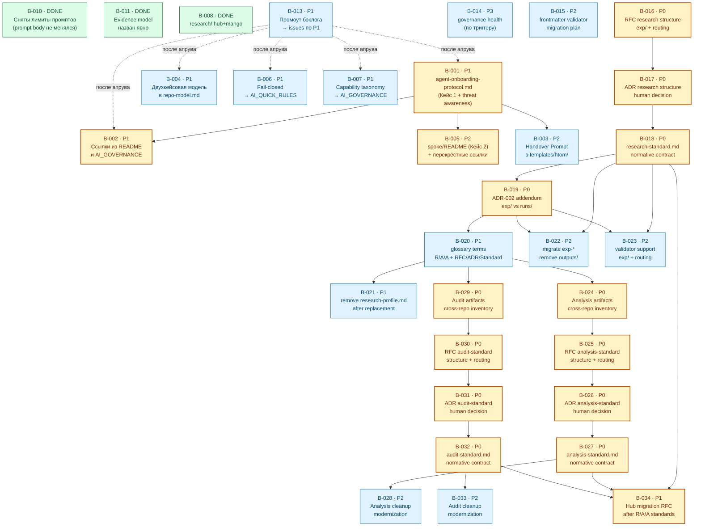

# BACKLOG — единый бэклог работ Хаба

Приоритизация, North Star и триггеры утверждены человеком в рамках задачи
**B-013** ([issue #107](https://github.com/G-Ivan-A/hybrid-Intelligence-lab/issues/107)).
По утверждённым задачам заведены отдельные issues (см. колонку «Issue» в
[разделе 2](#2-сводная-таблица-задач) и [раздел 8](#8-решение-за-человеком)).

> В этом документе используются термины из
> [standards/glossary.md](../standards/glossary.md): *Operating Mode*, *Policy*,
> *Standard*, *Practice*, *Artifact*, *Canonical*, *Draft*, *Runtime-онбординг
> (Кейс 1)*, *Bootstrap-клонирование (Кейс 2)*, *Handover Prompt*, *Readback*,
> *Среда работы агента*, *Источник контекста*, *North Star*, *Триггер
> внедрения*. Глоссарий — единственный источник истины для терминов; здесь они
> только **используются**.

---

## 1. Введение

### 1.1. Назначение документа

`backlog.md` — это **единая точка входа в запланированные работы Хаба**. Карта
артефактов ([governance/artifact-map.md](artifact-map.md)) отвечает на вопрос
«*что уже есть и как связано*»; бэклог отвечает на ортогональный вопрос «*что
осталось сделать, в каком порядке и почему именно в этом*».

До этого документа задачи были рассыпаны по трём источникам, и ни один из них не
давал целостной картины:

- блоки **Follow-up** в утверждённых onboarding/bootstrap-артефактах
  ([templates/htom/README.md](../templates/htom/README.md),
  [governance/agent-onboarding-protocol.md](agent-onboarding-protocol.md),
  [rfc-two-cases-of-project-initialization.md](rfc/rfc-two-cases-of-project-initialization.md));
- матрица применимости рекомендаций внешних экспертов
  ([research/hub/2026-06-02-external-governance-patterns-review.md](../research/hub/2026-06-02-external-governance-patterns-review.md));
- разрозненные задачи из обсуждений (рефакторинг `research/`, лимиты
  Mango-промптов).

Бэклог **не копирует** эти источники построчно. Он их *синтезирует*: переводит
рекомендации в задачи с единой системой приоритетов, прослеживает зависимости,
выделяет критический путь и явно фиксирует, что уже сделано, а что — нет.

Документ служит двум читателям:

1. **Пользователю** — как инструмент Human Review: утвердить
   приоритеты, скорректировать порядок, дать команду заводить issues.
2. **Агенту-исполнителю** — как источник для последующего создания отдельных
   issues по маршруту «идея → задача» (но **не в этой задаче**: см.
   [раздел 6](#6-ограничения)).

### 1.2. Принцип приоритизации: «практика первична, документация растёт по факту боли»

Главный фильтр бэклога — тот же, что у матрицы применимости и Anti-Inflation
principle ([governance/repo-model.md](repo-model.md)): **артефакт создаётся
только под доказанную операционную боль, а не под красоту целевой архитектуры.**

Из этого принципа выводится шкала приоритетов. Приоритет — это *не* важность
идеи «в вакууме», а ответ на вопрос «*насколько остро эта работа болит
сейчас*»:

| Приоритет | Что означает (операционально) | Правило назначения |
| --- | --- | --- |
| **P0** | Ломает действующий инвариант репозитория **прямо сейчас**. | Назначается, только если что-то уже сломано или блокирует всё остальное. |
| **P1** | Высокая ценность при низкой стоимости: либо «бесплатное» улучшение (одна фраза/поле), либо ключевое звено критического пути онбординга/bootstrap. | Делать в первую очередь после снятия P0. |
| **P2** | Ценно, но стоимость оправдана только по мере удобства или при подходе к соответствующему этапу. | Делать после P1, не блокирует критический путь. |
| **P3** | Отложено до конкретного *Триггера внедрения*. | Не делать, пока триггер не сработал. |

> ⚖️ **Ключевое следствие принципа для этого спринта.** «Практика первична»
> означает, что **уже существующая практика (валидатор структуры) должна
> работать раньше, чем мы добавляем новые governance-правила.** Поэтому
> единственная задача уровня **P0** в бэклоге — это **B-010** (снятие
> искусственных лимитов длины Mango-промптов), а не какая-либо
> «архитектурная» рекомендация команд С или Q. Это прямой, проверяемый вывод
> принципа, который ни одна из внешних команд не назвала, потому что он виден
> только изнутри репозитория (см.
> [раздел 4.3](#43-позиция-агента-исполнителя-в-чём-она-расходится-с-командами-с-и-q)).

### 1.3. Правила обновления бэклога

- **Источник обязателен.** Каждая задача ссылается на свой источник (RFC,
  команда С, команда Q, обсуждение, валидатор). Задача без трассируемого
  источника не добавляется.
- **Статус отражает факт, а не план.** `DONE` ставится только для работ, уже
  выполненных в репозитории (проверяемо через `git`/валидатор), а не «почти
  готово». Это та же дисциплина, что у [artifact-map.md](artifact-map.md):
  карта отражает фактическое состояние.
- **Новая задача — под боль.** Прежде чем добавить строку, ответь: какую
  повторяющуюся путаницу, review pain, ownership gap или невоспроизводимость она
  снижает (Anti-Inflation principle).
- **Без инфляции файлов.** Бэклог — это **один файл**. Идеи новых артефактов
  живут *строками таблицы*, а не новыми пустыми файлами.
- **Пересмотр — по триггеру, а не по календарю.** Условия возврата к бэклогу —
  в [разделе 7](#7-триггеры-для-пересмотра-бэклога).
- **После изменения** — обнови поле `updated` во frontmatter и прогони локальные
  проверки (`./tools/validate-frontmatter.sh .` и
  `./tools/validate-repository-structure.sh`).

---

## Открытые вопросы

Единый трекер открытых вопросов из
[`governance/session-digests.md`](session-digests.md). При создании нового
дайджеста вопросы из блока «Открытые вопросы» добавляются сюда. Если вопрос уже
есть, строка не дублируется: новая ссылка добавляется в колонку «Связанные
дайджесты».

| Дата | Источник | Суть | Статус | Связанные дайджесты | Связанный артефакт |
| --- | --- | --- | --- | --- | --- |
| 2026-06-13 | session-digest: [2026-06-13](session-digests.md#2026-06-13--архитектура-документации-и-баланс-anti-inflation-vs-атомарность) | Когда переходить к графовой структуре знаний вместо плоского индекса. | open | [session-digests.md#2026-06-13](session-digests.md#2026-06-13--архитектура-документации-и-баланс-anti-inflation-vs-атомарность) | — |
| 2026-06-13 | session-digest: [2026-06-13](session-digests.md#2026-06-13--архитектура-документации-и-баланс-anti-inflation-vs-атомарность) | Как фиксировать связи между атомами без дублирования метаданных и нарушения Anti-Inflation. | open | [session-digests.md#2026-06-13](session-digests.md#2026-06-13--архитектура-документации-и-баланс-anti-inflation-vs-атомарность) | [draft-triage-and-exit-plan.md](rfc/draft-triage-and-exit-plan.md) |

---

## 2. Сводная таблица задач

Минимум 10 задач. Колонка «Источник» обеспечивает трассируемость (🔗). Статусы:
`TODO` — не начато; `DONE` — выполнено в репозитории; `ЧАСТИЧНО` — выполнено
частично.

| ID | Название | Приоритет | Зависимости | Статус | Issue | Источник | Обоснование приоритета |
| --- | --- | --- | --- | --- | --- | --- | --- |
| **B-010** | Снять лимиты длины Mango-промптов; промпты не менять | **P0** | — | DONE | [#105](https://github.com/G-Ivan-A/hybrid-Intelligence-lab/issues/105) | Issue #105; [validator](../tools/validate-repository-structure.sh) | Искусственный лимит ограничивал prompt body; инвариант восстановлен снятием лимита, без правки промптов. |
| **B-001** | Создать `governance/agent-onboarding-protocol.md` (Кейс 1, вкл. threat awareness) | **P1** | — | TODO | [#109](https://github.com/G-Ivan-A/hybrid-Intelligence-lab/issues/109) | RFC-онбординг; RFC-два-кейса (follow-up #3); Q «взять сейчас» | Краеугольный артефакт *Runtime-онбординга* и старт критического пути; без него правило «новый агент → начни здесь» не имеет адресата. |
| **B-002** | Связать онбординг ссылками из `README.md` Хаба и `AI_GOVERNANCE.md` | **P1** | B-001 | TODO | [#110](https://github.com/G-Ivan-A/hybrid-Intelligence-lab/issues/110) | RFC-два-кейса (follow-up #5); RFC-онбординг | Дёшево и замыкает точку входа: артефакт без ссылок невидим. |
| **B-004** | Зафиксировать двухкейсовую модель инициализации в `governance/repo-model.md` | **P1** | — | DONE | [#111](https://github.com/G-Ivan-A/hybrid-Intelligence-lab/issues/111) | RFC-два-кейса (follow-up #2) | Закрепляет концептуальный фундамент в каноне; снижает риск повторной терминологической путаницы (ошибка №5 ретроспективы). |
| **B-006** | Fail-closed semantics одной фразой → `templates/htom/AI_QUICK_RULES.md` | **P1** | — | TODO | [#112](https://github.com/G-Ivan-A/hybrid-Intelligence-lab/issues/112) | Q «взять сейчас»; С [C5]; [EGA] | «Бесплатно» (одна фраза), прямо снижает риск галлюцинаций агента уже сегодня. |
| **B-007** | Простая capability taxonomy (3 корзины) → `templates/htom/AI_GOVERNANCE.md` | **P1** | — | TODO | [#113](https://github.com/G-Ivan-A/hybrid-Intelligence-lab/issues/113) | Q «взять сейчас»; С [C5]; [GAP] | «Бесплатно» (3 строки прозой), даёт агенту ясные границы без машинерии. |
| **B-003** | Продублировать *Handover Prompt* в `templates/htom/` | **P2** | B-001 | TODO | [#114](https://github.com/G-Ivan-A/hybrid-Intelligence-lab/issues/114) | RFC-онбординг | Полезно для самодостаточности спока, но не блокирует критический путь. |
| **B-005** | Дополнить `templates/htom/README.md` (Кейс 2) + перекрёстные ссылки README | **P2** | B-001 | TODO | [#115](https://github.com/G-Ivan-A/hybrid-Intelligence-lab/issues/115) | RFC-два-кейса (follow-up #4, #5) | Завершает «обе точки входа ссылаются друг на друга»; полезно для будущих bootstrap-спринтов. |
| **B-011** | Явно назвать Evidence model в RFC-манифесте | **P2** | — | DONE | [#116](https://github.com/G-Ivan-A/hybrid-Intelligence-lab/issues/116) | Q «взять сейчас»; С [C5]; [GAP] | Evidence trail явно назван в RFC-манифесте и связан ссылкой с external-review. |
| **B-008** | Рефакторинг `research/` (разделение `hub/` и `mango/`) | **P1** | — | DONE | [#91](https://github.com/G-Ivan-A/hybrid-Intelligence-lab/issues/91) | Обсуждение §5 | Выполнено в предыдущих PR; зафиксировано как факт для целостности картины. |
| **B-013** | 💡 Промоут `backlog.md` в `canonical` и завести issues по утверждённым P1 | **P1** | (этот PR) | DONE | [#107](https://github.com/G-Ivan-A/hybrid-Intelligence-lab/issues/107) | Креативное улучшение агента-исполнителя | Замыкает маршрут «бэклог → issues»; без него бэклог остаётся планом без исполнения. |
| **B-014** | 💡 Лёгкий «governance health»: регулярный прогон валидаторов + мониторинг триггеров | **P3** | — | TODO | — (отложено) | Креативное улучшение агента-исполнителя | Ценно, но боль возникнет позже; внедряется по триггеру, не сейчас. |
| **B-015** | RFC: Валидатор frontmatter, миграция статусов и approved list | **P2** | RFC/ADR structure standards | TODO | — (tech debt) | [Ripple Effects 282](../research/hub/2026-06-28-ripple-effects-282-research.md); issue [#286](https://github.com/G-Ivan-A/hybrid-Intelligence-lab/issues/286) | Нужен отдельный RFC/implementation path для routing, status migration, approved fields and CI modes; issue #286 сознательно не меняет validator/migration rules. |
| **B-016** | RFC: Структура research, контейнер `exp/` и маршрутизация Research/Analysis/Audit | **P0** | — | ЧАСТИЧНО | [#302](https://github.com/G-Ivan-A/hybrid-Intelligence-lab/issues/302) (RFC в review, PR [#303](https://github.com/G-Ivan-A/hybrid-Intelligence-lab/pull/303)) | Issue [#294](https://github.com/G-Ivan-A/hybrid-Intelligence-lab/issues/294); issue [#290](https://github.com/G-Ivan-A/hybrid-Intelligence-lab/issues/290); issue [#288](https://github.com/G-Ivan-A/hybrid-Intelligence-lab/issues/288) | Запускает согласованную цепочку Research → RFC → ADR → Standard и снимает текущую неоднозначность `exp-*`/`outputs` vs `runs/`. |
| **B-017** | ADR: Принять стандарт структуры research | **P0** | B-016 | TODO | — (planned) | Issue [#294](https://github.com/G-Ivan-A/hybrid-Intelligence-lab/issues/294); будущий RFC B-016 | Фиксирует human decision до появления нормативного стандарта; без ADR стандарт будет преждевременным. |
| **B-018** | Создать `standards/research-standard.md` как нормативный контракт | **P0** | B-017 | TODO | — (planned) | Issue [#294](https://github.com/G-Ivan-A/hybrid-Intelligence-lab/issues/294); будущий ADR B-017 | Заменяет профиль полноценным стандартом: `research/`, `exp/`, запрет `outputs/`, routing по типам задач. |
| **B-019** | ADR-002 addendum: граница `exp/` vs `runs/` | **P0** | B-018 | TODO | — (planned) | Issue [#294](https://github.com/G-Ivan-A/hybrid-Intelligence-lab/issues/294); [ADR-002](../docs/adr/2026-06-adr-002-artifact-document-methodology.md); issue [#290](https://github.com/G-Ivan-A/hybrid-Intelligence-lab/issues/290) | Устраняет коллизию между research evidence corpus и operational run record. |
| **B-020** | Обновить `standards/glossary.md`: Research / Analysis / Audit / RFC / ADR / Standard | **P1** | B-019 | TODO | — (planned) | Issue [#294](https://github.com/G-Ivan-A/hybrid-Intelligence-lab/issues/294); issue [#288](https://github.com/G-Ivan-A/hybrid-Intelligence-lab/issues/288) | Закрепляет терминологическую границу, чтобы новые routing-правила не размывались в следующих задачах. |
| **B-021** | Удалить `standards/research-profile.md` после замены стандартом | **P1** | B-020 | TODO | — (planned) | Issue [#294](https://github.com/G-Ivan-A/hybrid-Intelligence-lab/issues/294); `standards/research-profile.md` | Убирает конкурирующий источник истины; требует CHANGELOG entry и проверки ссылок. |
| **B-022** | Мигрировать существующие `exp-*` в контейнер `exp/`, убрать `outputs/` | **P2** | B-018, B-019 | TODO | — (tech debt) | Issue [#294](https://github.com/G-Ivan-A/hybrid-Intelligence-lab/issues/294); issue [#290](https://github.com/G-Ivan-A/hybrid-Intelligence-lab/issues/290); текущие `research/hub/exp-*` | Физическая миграция полезна, но должна идти после контракта, чтобы не закрепить новый дрейф. |
| **B-023** | Обновить валидатор структуры под `exp/` и routing по типам задач | **P2** | B-018, B-019 | TODO | — (tech debt) | Issue [#294](https://github.com/G-Ivan-A/hybrid-Intelligence-lab/issues/294); `tools/validate-repository-structure.sh`; `tools/validate-file-naming.sh` | Делает новый контракт исполнимым после human decision; не должен предвосхищать стандарт. |
| **B-024** | analysis: Сквозной анализ артефактов Analysis (Хаб, Mango, Clarify) | **P0** | B-020 | TODO | — (planned) | Issue [#296](https://github.com/G-Ivan-A/hybrid-Intelligence-lab/issues/296); issue [#288](https://github.com/G-Ivan-A/hybrid-Intelligence-lab/issues/288); B-020 | Даёт входные данные для `analysis-standard.md`: фактические Analysis-артефакты, подмены понятий, дубли и кандидаты на модернизацию. |
| **B-025** | rfc: Стандарт структуры Analysis | **P0** | B-024 | TODO | — (planned) | Issue [#296](https://github.com/G-Ivan-A/hybrid-Intelligence-lab/issues/296); `standards/rfc-structure-standard.md`; ADR-001/ADR-002 | Proposal-stage для правил Analysis: frontmatter, секции, lifecycle, routing и отличия от Research/Audit до human decision. |
| **B-026** | adr: Принятие `analysis-standard` | **P0** | B-025 | TODO | — (planned) | Issue [#296](https://github.com/G-Ivan-A/hybrid-Intelligence-lab/issues/296); будущий RFC B-025; `standards/adr-structure-standard.md` | Decision gate между RFC-вариантами и нормативным Analysis standard. |
| **B-027** | chore: Создание `standards/analysis-standard.md` | **P0** | B-026 | TODO | — (planned) | Issue [#296](https://github.com/G-Ivan-A/hybrid-Intelligence-lab/issues/296); будущий ADR B-026 | Нормативный контракт Analysis; prerequisite для плана миграции репо и cleanup Analysis-артефактов. |
| **B-028** | chore: Cleanup и модернизация Analysis-артефактов | **P2** | B-027 | TODO | — (tech debt) | Issue [#296](https://github.com/G-Ivan-A/hybrid-Intelligence-lab/issues/296); analysis-аудит B-024; `standards/analysis-standard.md` | Пост-standard cleanup: убрать дубли, обновить frontmatter/cross-references и индексы без преждевременной миграции. |
| **B-029** | analysis: Сквозной анализ артефактов Audit (Хаб, Mango, Clarify) | **P0** | B-020 | TODO | — (planned) | Issue [#296](https://github.com/G-Ivan-A/hybrid-Intelligence-lab/issues/296); issue [#288](https://github.com/G-Ivan-A/hybrid-Intelligence-lab/issues/288); B-020 | Даёт входные данные для `audit-standard.md`: compliance-артефакты, замаскированные аудиты, дубли и candidates for modernization. |
| **B-030** | rfc: Стандарт структуры Audit | **P0** | B-029 | TODO | — (planned) | Issue [#296](https://github.com/G-Ivan-A/hybrid-Intelligence-lab/issues/296); `standards/rfc-structure-standard.md`; ADR-001/ADR-002 | Proposal-stage для Audit: критерии соответствия, evidence, routing и отличия от Research/Analysis. |
| **B-031** | adr: Принятие `audit-standard` | **P0** | B-030 | TODO | — (planned) | Issue [#296](https://github.com/G-Ivan-A/hybrid-Intelligence-lab/issues/296); будущий RFC B-030; `standards/adr-structure-standard.md` | Decision gate перед нормативным Audit standard и последующей модернизацией audit/report artifacts. |
| **B-032** | chore: Создание `standards/audit-standard.md` | **P0** | B-031 | TODO | — (planned) | Issue [#296](https://github.com/G-Ivan-A/hybrid-Intelligence-lab/issues/296); будущий ADR B-031 | Нормативный контракт Audit; prerequisite для плана миграции репо и cleanup Audit-артефактов. |
| **B-033** | chore: Cleanup и модернизация Audit-артефактов | **P2** | B-032 | TODO | — (tech debt) | Issue [#296](https://github.com/G-Ivan-A/hybrid-Intelligence-lab/issues/296); audit-аудит B-029; `standards/audit-standard.md` | Пост-standard cleanup: убрать дубли/конкурирующие файлы, обновить frontmatter, cross-references, artifact-map и индексы. |
| **B-034** | rfc: План миграции репо Хаба после стандартов Research/Analysis/Audit | **P1** | B-018, B-027, B-032 | TODO | — (planned) | Issue [#296](https://github.com/G-Ivan-A/hybrid-Intelligence-lab/issues/296); ADR-001/ADR-002; будущие R/A/A standards | Фиксирует, что физическая реструктуризация репо — отдельный RFC после всех трёх стандартов, а не этап стандартизации. |

💡 — креативные задачи, предложенные агентом-исполнителем и не упомянутые во входном
контексте напрямую (обоснование — в их детальных описаниях).

---

## 📋 Бэклог: Внедрение стандарта исполнимых документов

Источник: [`governance/rfc/contract-executability-rfc.md`](rfc/contract-executability-rfc.md),
§6.1 «Файлы, подлежащие обновлению». Реестр созданных issues:
[`governance/executable-documents-issues.md`](executable-documents-issues.md).

Ограничение scope: этот раздел фиксирует только файлы из RFC §6.1. README-разметка
из RFC §6.2 не добавлена как отдельная задача в рамках issue #133, потому что
в задаче явно задан принцип «не добавлять файлы сверх плана §6.1».

| ID | Файл | Приоритет | Зависимости | Статус | Issue |
| --- | --- | --- | --- | --- | --- |
| CE-001 | `governance/agent-onboarding-protocol.md` | P0 | CE-008 | TODO | [#138](https://github.com/G-Ivan-A/hybrid-Intelligence-lab/issues/138) |
| CE-002 | `templates/htom/AI_QUICK_RULES.md` | P0 | CE-008 | TODO | [#139](https://github.com/G-Ivan-A/hybrid-Intelligence-lab/issues/139) |
| CE-003 | `templates/htom/AI_SESSION_HANDOVER_PROMPT.md` | P1 | CE-001, CE-008 | TODO | [#140](https://github.com/G-Ivan-A/hybrid-Intelligence-lab/issues/140) |
| CE-004 | `AI_GOVERNANCE.md` | P1 | CE-001, CE-008 | TODO | [#141](https://github.com/G-Ivan-A/hybrid-Intelligence-lab/issues/141) |
| CE-005 | `governance/repo-model.md` | P2 | CE-008 | TODO | [#142](https://github.com/G-Ivan-A/hybrid-Intelligence-lab/issues/142) |
| CE-006 | `standards/project-structure-inheritance.md` | P3 | CE-008 | TODO | [#143](https://github.com/G-Ivan-A/hybrid-Intelligence-lab/issues/143) |
| CE-007 | `standards/issue-workflow.md` | P3 | CE-008 | TODO | [#144](https://github.com/G-Ivan-A/hybrid-Intelligence-lab/issues/144) |
| CE-008 | `standards/glossary.md` | P1 | — | TODO | [#145](https://github.com/G-Ivan-A/hybrid-Intelligence-lab/issues/145) |
| CE-009 | `tools/validate-frontmatter.sh` | P2 | CE-008 | TODO | [#146](https://github.com/G-Ivan-A/hybrid-Intelligence-lab/issues/146) |
| CE-010 | `governance/artifact-map.md` | P2 | CE-001, CE-002, CE-003, CE-004, CE-008 | TODO | [#147](https://github.com/G-Ivan-A/hybrid-Intelligence-lab/issues/147) |

---

## 3. Детальное описание задач

Задачи описаны в порядке приоритета (P0 → P1 → P2 → P3), а не по номеру ID, —
чтобы порядок чтения совпадал с рекомендуемым порядком выполнения.

### B-010: Снять лимиты длины Mango-промптов; промпты не менять

**Приоритет:** P0
**Источник:** 🔗 Issue #105; прежнее правило длины в
[tools/validate-repository-structure.sh](../tools/validate-repository-structure.sh)
(`require_max_body_chars`)
**Зависимости:** —
**Статус:** **DONE**
**Режим работы:** `Structured`

**Контекст:**
Предыдущая версия бэклога предлагала нормализовать Mango-промпты до
фиксированного лимита длины. Human Review в issue #105 скорректировал решение:
лимиты длины нужно снять полностью, prompt body не ограничивать, а сами промпты
не менять без отдельных задач. Структурный валидатор должен проверять наличие
prompt assets и обязательных секций, но не сжимать продуктовый контент до
искусственного лимита.

**Что было сделано:**
1. Удалены проверки `require_max_body_chars` для всех Mango prompt-файлов.
2. Удалён сам helper `require_max_body_chars`, так как после снятия лимитов он не
   используется.
3. Prompt-файлы Mango не изменялись; рабочая версия живёт во внешнем
   spoke-репозитории `mango_ba_prompts`.

**Ожидаемые артефакты:**
- `tools/validate-repository-structure.sh` (изменён)
- `governance/backlog.md` (скорректирован)

**Критерии приёмки (DoD):**
- [x] В валидаторе нет проверок длины body для Mango-промптов.
- [x] Prompt-файлы Mango не изменены.
- [x] `./tools/validate-repository-structure.sh` проходит без FAIL по длине.

**Обоснование приоритета:**
Единственный P0 в бэклоге, потому что речь о действующем инварианте репозитория:
валидатор не должен принуждать к изменению смыслового содержимого промптов.
Правка возвращает инвариант к структурной проверке и убирает риск случайного
редактирования продуктового prompt content ради технического лимита.

**Риски и ограничения:**
Снятие лимитов не означает, что промпты можно менять без review. Любая правка
текста prompt body остаётся отдельной задачей с отдельным качественным review.

---

### B-001: Создать `governance/agent-onboarding-protocol.md` (Кейс 1)

**Приоритет:** P1
**Источник:** 🔗 [governance/agent-onboarding-protocol.md](agent-onboarding-protocol.md);
[rfc-two-cases-of-project-initialization.md](rfc/rfc-two-cases-of-project-initialization.md)
(follow-up #3); команда Q «взять сейчас» (threat awareness)
**Зависимости:** —
**Режим работы:** `Structured`

**Контекст:**
*Runtime-онбординг* (Кейс 1) — это процесс, в котором агент в *Среде работы
агента* (чате) загружает контекст из *Источника контекста* (репо) в оперативную
память. У этого процесса по дизайну должен быть один входной артефакт —
`governance/agent-onboarding-protocol.md`, — но его пока **нет**. Без него правило «новый
агент → начни здесь» (системный вывод №2 ретроспективы про обязательное
pre-flight чтение) не имеет адресата.

**Что нужно сделать:**
1. Создать `governance/agent-onboarding-protocol.md` по дизайну онбординг-RFC: 4-шаговый
   алгоритм (governance → контекст → *Readback* → стоп до апрува).
2. Включить *Handover Prompt* с плейсхолдером `{{REPO_NAME}}`.
3. Встроить раздел «Что может пойти не так» (3–5 рисков) — реализация *threat
   awareness* из матрицы команды Q без отдельного файла.
4. Добавить перекрёстную ссылку на `templates/htom/README.md` (Кейс 2) и на
   RFC-манифест двух кейсов.

**Ожидаемые артефакты:**
- `governance/agent-onboarding-protocol.md` (новый)
- строка в [artifact-map.md](artifact-map.md) и регистрация в валидаторе

**Критерии приёмки (DoD):**
- [ ] Файл содержит 4-шаговый протокол, *Handover Prompt* с `{{REPO_NAME}}` и
      раздел threat awareness.
- [ ] Все термины — со ссылкой на [GLOSSARY](../standards/glossary.md).
- [ ] Файл зарегистрирован в `artifact-map.md` и валидаторе; валидатор проходит.

**Обоснование приоритета:**
P1 и старт критического пути. Это не «бесплатное» улучшение, но это
*краеугольный камень* Кейса 1: от него зависят B-002, B-003, и косвенно
готовность к будущим bootstrap-спринтам. Threat awareness складывается сюда же —
экономим файл (Anti-Inflation).

**Риски и ограничения:**
Риск дублирования с онбординг-RFC: RFC остаётся *проектом* (`rfc/`), а
`agent-onboarding-protocol.md` — рабочей инструкцией. Граница должна быть явной, иначе
получим два источника истины.

---

### B-002: Связать онбординг ссылками из `README.md` и `AI_GOVERNANCE.md`

**Приоритет:** P1
**Источник:** 🔗 [rfc-two-cases-of-project-initialization.md](rfc/rfc-two-cases-of-project-initialization.md)
(follow-up #5); онбординг-RFC
**Зависимости:** B-001
**Режим работы:** `Structured`

**Контекст:**
Артефакт без входной ссылки невидим. После создания `agent-onboarding-protocol.md` нужно
поставить на него указатели из двух очевидных точек входа: визитки репозитория
(`README.md`) и контракта AI-работы (`AI_GOVERNANCE.md`).

**Что нужно сделать:**
1. В `README.md` добавить блок «Новый агент? Начни здесь → `governance/agent-onboarding-protocol.md`».
2. В `AI_GOVERNANCE.md` сослаться на онбординг как на обязательный pre-flight шаг.

**Ожидаемые артефакты:**
- `README.md` (изменён), `AI_GOVERNANCE.md` (изменён)

**Критерии приёмки (DoD):**
- [ ] Из `README.md` и `AI_GOVERNANCE.md` есть рабочие ссылки на онбординг.
- [ ] Навигационные проверки валидатора (`require_text`) проходят.

**Обоснование приоритета:**
P1 — дёшево и замыкает Кейс 1. Откладывать нет смысла: создать артефакт и не
сослаться на него — значит оставить работу B-001 наполовину.

**Риски и ограничения:**
Минимальные; следить, чтобы не расплодить дублирующиеся описания протокола в
трёх местах — ссылки, а не копии.

---

### B-004: Зафиксировать двухкейсовую модель инициализации в `governance/repo-model.md`

**Приоритет:** P1
**Источник:** 🔗 [rfc-two-cases-of-project-initialization.md](rfc/rfc-two-cases-of-project-initialization.md)
(follow-up #2)
**Зависимости:** —
**Режим работы:** `Structured`
**Статус:** **DONE** (PR по #111)

**Контекст:**
Разделение Кейс 1 / Кейс 2 уже зафиксировано в GLOSSARY и в RFC-манифесте, но
ещё не вошло в каноническое описание модели репозитория. `repo-model.md` —
правильное место для жизненного цикла spoke; без этого фрагмента модель неполна,
и сохраняется риск повторения терминологической путаницы (ошибка №5
ретроспективы).

**Что нужно сделать:**
1. Добавить в `repo-model.md` краткий раздел о двух ортогональных кейсах
   инициализации со ссылкой на RFC-манифест и GLOSSARY.
2. Привязать Operating Mode к кейсу (Кейс 1 → `Structured`, Кейс 2 → `Creative`
   для выбора структуры или `Structured` для заданных bootstrap-шагов).

**Ожидаемые артефакты:**
- `governance/repo-model.md` (изменён)

**Критерии приёмки (DoD):**
- [x] В `repo-model.md` есть раздел о двух кейсах со ссылками на GLOSSARY и
      RFC-манифест.
- [x] Валидатор проходит.

**Обоснование приоритета:**
P1 — закрепляет концептуальный фундамент в каноне (а не только в `draft`-RFC).
Дёшево и снижает повторяющуюся путаницу.

**Риски и ограничения:**
Не превратить краткий раздел в копию RFC — каноничный документ ссылается на RFC,
а не дублирует его.

---

### B-006: Fail-closed semantics одной фразой → `templates/htom/AI_QUICK_RULES.md`

**Приоритет:** P1
**Источник:** 🔗 Команда Q «взять сейчас»; команда С [C5]; внешний паттерн [EGA]
(через external-review)
**Зависимости:** —
**Режим работы:** `Structured`

**Контекст:**
«DENY BY DEFAULT»: что явно не разрешено — агент не делает, а запрашивает human
review. Операционно это уже заложено в Шаг 4 онбординга (стоп до апрува); не
хватает одной явной фразы в «инструкции по выживанию» спока.

**Что нужно сделать:**
1. Добавить в `templates/htom/AI_QUICK_RULES.md` фразу: «Если действие не
   описано в контракте — не выполняй, а запроси human review».

**Ожидаемые артефакты:**
- `templates/htom/AI_QUICK_RULES.md` (изменён)

**Критерии приёмки (DoD):**
- [ ] В шаблоне присутствует явная формулировка fail-closed.
- [ ] Валидатор проходит.

**Обоснование приоритета:**
P1 — «бесплатно» (одна фраза) и сразу снижает риск галлюцинаций. Классический
кандидат «взять сейчас»: высокая ценность при нулевой стоимости машинерии.

**Риски и ограничения:**
Формулировка не должна превратиться в жёсткое `Policy` с процедурой — это пока
*Practice*-уровень, одна фраза.

---

### B-007: Простая capability taxonomy (3 корзины) → `templates/htom/AI_GOVERNANCE.md`

**Приоритет:** P1
**Источник:** 🔗 Команда Q «взять сейчас»; команда С [C5]; внешний паттерн [GAP]
(через external-review)
**Зависимости:** —
**Режим работы:** `Structured`

**Контекст:**
Агенту нужны ясные границы. Команда С предлагала формальный Capability Manifest
(YAML); команда Q справедливо упростила это до «ментального списка трёх корзин».
Агент-исполнитель идёт дальше: это должны быть **3 строки прозой**, а не
отдельный раздел-машинерия (см. [раздел 4.3](#43-позиция-агента-исполнителя-в-чём-она-расходится-с-командами-с-и-q)).

**Что нужно сделать:**
1. Добавить в `templates/htom/AI_GOVERNANCE.md` три строки: «можно без спроса /
   можно с апрувом / нельзя никогда» с 1–2 примерами на корзину.

**Ожидаемые артефакты:**
- `templates/htom/AI_GOVERNANCE.md` (изменён)

**Критерии приёмки (DoD):**
- [ ] В шаблоне есть три корзины разрешений в прозе.
- [ ] Нет YAML-машинерии (соответствие решению «отложить» для манифеста).
- [ ] Валидатор проходит.

**Обоснование приоритета:**
P1 — «бесплатно» и снижает неопределённость границ. Стоимость близка к нулю,
ценность — высокая.

**Риски и ограничения:**
Соблазн сразу сделать YAML-манифест — это `ОТЛОЖИТЬ` до первого инцидента (см.
матрицу, [раздел 4.2](#42-матрица-применимости-агента-исполнителя)).

---

### B-003: Продублировать *Handover Prompt* в `templates/htom/`

**Приоритет:** P2
**Источник:** 🔗 [governance/agent-onboarding-protocol.md](agent-onboarding-protocol.md)
**Зависимости:** B-001
**Режим работы:** `Structured`

**Контекст:**
Чтобы новый спок был самодостаточен, *Handover Prompt* (с `{{REPO_NAME}}`)
должен лежать и в геноме шаблона, а не только в Хабе. Тогда у склонированного
репо сразу есть «доверенность» для запуска агента.

**Что нужно сделать:**
1. Поместить параметризованный *Handover Prompt* в подходящий файл
   `templates/htom/` (вероятно, рядом с `AI_QUICK_RULES.md`).
2. Связать его ссылкой с хабовым `agent-onboarding-protocol.md`.

**Ожидаемые артефакты:**
- файл(ы) в `templates/htom/` (изменены/дополнены)

**Критерии приёмки (DoD):**
- [ ] В геноме спока есть *Handover Prompt* с `{{REPO_NAME}}`.
- [ ] Валидатор спока и Хаба проходят.

**Обоснование приоритета:**
P2 — полезно для UX bootstrap, но не блокирует критический путь и осмысленно
только после B-001.

**Риски и ограничения:**
Два места хранения промпта → риск рассинхронизации. Зафиксировать Хаб как
источник истины, спок — как копию шаблона.

---

### B-005: Дополнить `templates/htom/README.md` (Кейс 2) + перекрёстные ссылки

**Приоритет:** P2
**Источник:** 🔗 [rfc-two-cases-of-project-initialization.md](rfc/rfc-two-cases-of-project-initialization.md)
(follow-up #4, #5)
**Зависимости:** B-001
**Режим работы:** `Creative`

**Контекст:**
RFC-манифест требует, чтобы **обе** точки входа (Кейс 1 и Кейс 2) ссылались друг
на друга. `templates/htom/README.md` существует как шаблон, но раздел про
адаптацию/валидацию и перекрёстная ссылка на онбординг (Кейс 1) нужны для
полноты.

**Что нужно сделать:**
1. Дополнить `templates/htom/README.md` разделом «как адаптировать
   `{{...}}`-плейсхолдеры и валидировать структуру».
2. Добавить перекрёстные ссылки: спок-README → `agent-onboarding-protocol.md` и наоборот.

**Ожидаемые артефакты:**
- `templates/htom/README.md` (изменён); ссылки в `agent-onboarding-protocol.md`

**Критерии приёмки (DoD):**
- [ ] Обе точки входа ссылаются друг на друга.
- [ ] Раздел про адаптацию/валидацию присутствует.

**Обоснование приоритета:**
P2 — нужно к моменту будущих bootstrap-спринтов, но до этого момента боли нет.

**Риски и ограничения:**
Зависит от B-001 (онбординг должен существовать, чтобы на него ссылаться).

---

### B-011: Явно назвать Evidence model в RFC-манифесте

**Приоритет:** P2
**Источник:** 🔗 Команда Q «взять сейчас»; команда С [C5]; [GAP]
**Зависимости:** —
**Статус:** DONE
**Режим работы:** `Research`

**Контекст:**
Тезис «git history + issues + PRs = evidence trail» уже **введён** в
[2026-06-02-external-governance-patterns-review.md](../research/hub/2026-06-02-external-governance-patterns-review.md)
(раздел 2). Осталась консолидация: команда Q указывала целевым местом
RFC-манифест двух кейсов, где термин логично закрепить рядом с моделью
жизненного цикла.

**Что нужно сделать:**
1. Добавить в RFC-манифест абзац, явно называющий evidence trail и ссылающийся
   на external-review.

**Ожидаемые артефакты:**
- `governance/rfc/rfc-two-cases-of-project-initialization.md` (изменён)

**Критерии приёмки (DoD):**
- [x] Evidence trail явно назван и связан ссылкой с external-review.

**Обоснование приоритета:**
P2 — функция уже существует и частично описана; это «бухгалтерия», а не новая
способность. Низкая срочность.

**Риски и ограничения:**
Не вводить новый формат/обёртку — только *назвать* существующее (JSON-обёртка
Governance Metadata Envelope находится в «отклонить», см. матрицу).

---

### B-008: Рефакторинг `research/` (разделение `hub/` и `mango/`)

**Приоритет:** P1 (исторический)
**Источник:** 🔗 Обсуждение §5
**Зависимости:** —
**Статус:** **DONE**
**Режим работы:** `Structured`

**Контекст:**
В `research/` смешивались исследования Хаба и Mango. Решение — `research/hub/` и
`research/mango/` с запретом файлов в корне `research/`.

**Что было сделано:**
1. Созданы `research/hub/` и `research/mango/` с индексами.
2. Валидатор структуры теперь требует размещения файлов только в подкаталогах
   (корень `research/` содержит лишь `README.md`).

**Ожидаемые артефакты:**
- `research/hub/`, `research/mango/` (созданы); правило в валидаторе (активно)

**Критерии приёмки (DoD):**
- [x] `research/hub/` и `research/mango/` существуют и проиндексированы.
- [x] Файлы в корне `research/` запрещены валидатором.

**Обоснование приоритета:**
Был P1 (разделяет scope `repo-wide` и `mango-only`). Зафиксирован как `DONE` для
целостности картины бэклога — бэклог отражает факт, а не только планы.

**Риски и ограничения:**
Закрыто; дальнейших действий не требует.

---

### B-013: 💡 Промоут `backlog.md` в `canonical` и завести issues по P1

**Приоритет:** P1
**Источник:** 🔗 Креативное улучшение агента-исполнителя (маршрут «идея → задача» из
онбординг-RFC)
**Зависимости:** этот PR (создание бэклога)
**Статус:** **DONE** (реализовано в [issue #107](https://github.com/G-Ivan-A/hybrid-Intelligence-lab/issues/107) / PR)
**Режим работы:** `Structured`

**Контекст:**
Бэклог без исполнения — это план на полке. Human Review дал команду на B-013
([issue #107](https://github.com/G-Ivan-A/hybrid-Intelligence-lab/issues/107)):
(1) перевести `backlog.md` из `draft` в `canonical` и (2) завести отдельные
issues по утверждённым задачам — именно то, что предыдущая версия этой задачи
запрещала делать до апрува (см. [раздел 6](#6-ограничения)). P0-задача B-010 уже
выполнена в рамках корректировки issue #105. Этот шаг замыкает маршрут «бэклог →
issues».

**Что сделано:**
1. `status: draft → canonical`, `version: 0.1 → 1.0` (по команде issue #107).
2. Заведены отдельные issues по всем открытым задачам бэклога, кроме B-014
   (отложена по решению человека). Каждый issue ссылается на строку бэклога как
   источник. Маппинг:

   | Задача | Issue | Приоритет |
   | --- | --- | --- |
   | B-001 | [#109](https://github.com/G-Ivan-A/hybrid-Intelligence-lab/issues/109) | P1 |
   | B-002 | [#110](https://github.com/G-Ivan-A/hybrid-Intelligence-lab/issues/110) | P1 |
   | B-004 | [#111](https://github.com/G-Ivan-A/hybrid-Intelligence-lab/issues/111) | P1 |
   | B-006 | [#112](https://github.com/G-Ivan-A/hybrid-Intelligence-lab/issues/112) | P1 |
   | B-007 | [#113](https://github.com/G-Ivan-A/hybrid-Intelligence-lab/issues/113) | P1 |
   | B-003 | [#114](https://github.com/G-Ivan-A/hybrid-Intelligence-lab/issues/114) | P2 |
   | B-005 | [#115](https://github.com/G-Ivan-A/hybrid-Intelligence-lab/issues/115) | P2 |
   | B-011 | [#116](https://github.com/G-Ivan-A/hybrid-Intelligence-lab/issues/116) | P2 |

   Задачи `DONE` (B-010 → #105, B-008 → #91) уже имеют свои issues и завершены —
   новые не заводятся. B-013 — это [issue #107](https://github.com/G-Ivan-A/hybrid-Intelligence-lab/issues/107).
   B-014 (P3) намеренно **не заводится** — отложена до триггера
   ([раздел 7](#7-триггеры-для-пересмотра-бэклога)).

**Ожидаемые артефакты:**
- `governance/backlog.md` (статус `canonical`, маппинг issues); набор issues #109–#116

**Критерии приёмки (DoD):**
- [x] Бэклог `canonical` по команде человека (issue #107).
- [x] По каждой утверждённой P1-задаче заведён issue со ссылкой на бэклог.

**Обоснование приоритета:**
P1 — замыкает петлю «бэклог → работа». Без него весь этот документ не имеет
исполнительной силы.

**Риски и ограничения:**
Issues заведены **по явной команде человека** (issue #107), а не самовольно;
B-014 исключена согласно решению. Это сохраняет инвариант «финальные решения по
governance — за человеком» и Anti-Inflation для issue-трекера.

---

### B-014: 💡 Лёгкий «governance health»: регулярный прогон валидаторов + мониторинг триггеров

**Приоритет:** P3
**Источник:** 🔗 Креативное улучшение агента-исполнителя
**Зависимости:** B-010
**Режим работы:** `Structured`

**Контекст:**
Сейчас валидаторы запускаются вручную, а *Триггеры внедрения* отслеживаются «на
глаз». При росте репозитория появится боль: структурные регрессии могут
обнаруживаться поздно. Лёгкая практика «health-прогон» (например, заметка о
периодическом запуске обоих валидаторов и сверке триггеров раздела 7) снизит эту
боль — **когда** она появится.

**Что нужно сделать:**
1. Зафиксировать практику регулярного прогона `validate-frontmatter.sh` и
   `validate-repository-structure.sh` (в `CONTRIBUTING.md` как чек-лист).
2. Привязать сверку с триггерами бэклога к тем же прогонам.

**Ожидаемые артефакты:**
- `CONTRIBUTING.md` (изменён) — без новых файлов

**Критерии приёмки (DoD):**
- [ ] Описана практика health-прогона и сверки триггеров.

**Обоснование приоритета:**
P3 — отложено до *Триггера внедрения*: «первая регрессия, не пойманная при
ревью» или «появление CI». Сейчас один контрибьютор прогоняет проверки вручную —
острой боли нет.

**Риски и ограничения:**
Не вводить тяжёлый CI/автоматизацию преждевременно (это `ОТЛОЖИТЬ` до появления
команды/CI-боли).

---

### B-015: RFC: Валидатор frontmatter, миграция статусов и approved list

**Приоритет:** P2
**Источник:** 🔗 [Ripple Effects issue 282](../research/hub/2026-06-28-ripple-effects-282-research.md);
[issue #286](https://github.com/G-Ivan-A/hybrid-Intelligence-lab/issues/286)
**Зависимости:** Accepted RFC/ADR structure RFCs and standards
**Режим работы:** `Structured`

**Контекст:**
Issue #286 сознательно выводит физическую миграцию существующих ADR/RFC,
изменение валидатора и удаление legacy `ai-generated` из scope. Ripple-effects
research показал, что это отдельный контур решений: routing validator-а,
transition matrix статусов, approved list frontmatter-полей, migration mode and
CI fail-open/fail-closed behavior.

**Что нужно сделать:**
1. Подготовить RFC или implementation plan для frontmatter validator routing:
   path-first/type-first/hybrid/manifest.
2. Зафиксировать transition matrix для Knowledge и Governance vocabulary.
3. Выбрать approved field registry: Markdown table, YAML/JSON manifest, schema
   or validator-owned rules.
4. Определить migration mode for legacy fields and statuses.
5. Определить CI mode: warning only, changed-files strict, whole-repo strict or
   two-step bridge.

**Ожидаемые артефакты:**
- RFC/issue for validator and migration decisions;
- optional validator/registry update after human decision.

**Критерии приёмки (DoD):**
- [ ] Есть выбранный routing rule and conflict rule.
- [ ] Есть transition matrix для старых и новых статусов.
- [ ] Approved list полей трассируется к consumers.
- [ ] CI mode and migration mode explicit.
- [ ] Validator/templates do not generate invalid docs.

**Обоснование приоритета:**
P2: работа важна для enforceability новых стандартов, но не блокирует issue
#286. Делать её внутри этого PR рискованно: это превратит acceptance standards
в массовую migration/validator task.

**Риски и ограничения:**
Не менять текущий validator без human-approved migration plan; иначе можно
случайно повысить или сломать legacy governance artifacts.

---

### B-016: RFC: Структура research, контейнер `exp/` и маршрутизация Research/Analysis/Audit

**Приоритет:** P0
**Источник:** 🔗 [issue #294](https://github.com/G-Ivan-A/hybrid-Intelligence-lab/issues/294);
[issue #290](https://github.com/G-Ivan-A/hybrid-Intelligence-lab/issues/290);
[issue #288](https://github.com/G-Ivan-A/hybrid-Intelligence-lab/issues/288);
согласование в чате: контейнер `exp/`, без `outputs/`, маршрутизация по типам
задач
**Зависимости:** —
**Статус:** ЧАСТИЧНО (RFC создан, в review — issue #302, PR #303; ожидает human decision в ADR B-017)
**Режим работы:** `Structured`

**Контекст:**
Аудит issue #290 показал коллизию между `research/<domain>/exp-*/outputs/` из
`standards/research-profile.md` и `runs/` из ADR-002. Анализ issue #288
показал, что Research, Analysis и Audit нельзя нормировать одним размытым
профилем. Согласованное направление — пройти полную цепочку
`Research -> RFC -> ADR -> Standard`, а не править профиль напрямую.

**Что нужно сделать:**
1. Создать `governance/rfc/YYYY-MM-DD-rfc-research-structure.md`.
2. Описать целевую структуру `research/<domain>/` с контейнером `exp/` и без
   вложенного `outputs/`.
3. Развести research report, research experiment corpus, local analysis, audit и
   operational run record.
4. Зафиксировать варианты, rejected alternatives и migration impact для текущих
   `research/hub/exp-*`.

**Ожидаемые артефакты:**
- `governance/rfc/2026-06-30-rfc-research-structure.md` (новый RFC, создан в PR #303)

**Критерии приёмки (DoD):**
- [x] RFC ссылается на issues #294, #290, #288 и связанные артефакты.
- [x] RFC явно описывает `exp/`, запрет `outputs/` в research experiment corpus
      и границу с `runs/`.
- [x] RFC определяет routing Research / Analysis / Audit по типу задачи, а не
      только по имени каталога.
- [x] RFC указывает последствия для B-017..B-023.

**Обоснование приоритета:**
P0, потому что без RFC вся последующая цепочка будет либо прямой правкой
стандарта без rationale, либо миграцией без принятой модели. Это входная точка
для снятия текущей структурной неоднозначности.

**Риски и ограничения:**
RFC не должен выполнять миграцию и не должен сам становиться нормой. Human
decision фиксируется отдельным ADR (B-017).

---

### B-017: ADR: Принять стандарт структуры research

**Приоритет:** P0
**Источник:** 🔗 [issue #294](https://github.com/G-Ivan-A/hybrid-Intelligence-lab/issues/294);
будущий RFC B-016
**Зависимости:** B-016
**Статус:** TODO
**Режим работы:** `Structured`

**Контекст:**
ADR нужен как decision gate между RFC-вариантами и нормативным стандартом.
Иначе `standards/research-standard.md` будет выглядеть как прямое продолжение
исполнительской инициативы без явного human decision.

**Что нужно сделать:**
1. Создать `docs/adr/YYYY-MM-adr-NNN-research-structure.md`.
2. Зафиксировать принятое решение по структуре research, контейнеру `exp/`,
   отказу от `outputs/` и routing по Research / Analysis / Audit.
3. Описать последствия для `standards/research-standard.md`, ADR-002 addendum,
   glossary, migration и validator.

**Ожидаемые артефакты:**
- `docs/adr/YYYY-MM-adr-NNN-research-structure.md` (новый ADR)

**Критерии приёмки (DoD):**
- [ ] ADR ссылается на RFC B-016 и issues #294/#290/#288.
- [ ] Decision явно принимает или корректирует модель из RFC.
- [ ] Consequences перечисляют B-018..B-023.

**Обоснование приоритета:**
P0, потому что это обязательный decision gate перед стандартом. Стандарт без ADR
снова размоет границу между research, proposal и нормой.

**Риски и ограничения:**
Не дублировать RFC целиком; ADR фиксирует решение, rationale и последствия.

---

### B-018: Создать `standards/research-standard.md` как нормативный контракт

**Приоритет:** P0
**Источник:** 🔗 [issue #294](https://github.com/G-Ivan-A/hybrid-Intelligence-lab/issues/294);
будущий ADR B-017
**Зависимости:** B-017
**Статус:** TODO
**Режим работы:** `Structured`

**Контекст:**
`standards/research-profile.md` не прошёл полную цепочку ратификации как
единый стандарт и содержит устаревающую форму `exp-<slug>/outputs/`. После ADR
нужен новый нормативный контракт, который станет единственным источником правил
для Hub research.

**Что нужно сделать:**
1. Создать `standards/research-standard.md`.
2. Зафиксировать структуру `research/<domain>/`, контейнер `exp/`, запрет
   `outputs/` и связь experiment corpus с parent report.
3. Описать routing Research / Analysis / Audit и границы с RFC, ADR, Standard и
   `runs/`.
4. Указать frontmatter, naming, evidence, reproducibility и migration notes.

**Ожидаемые артефакты:**
- `standards/research-standard.md` (новый standard)
- обновления навигации и реестров, если required by current standards registry

**Критерии приёмки (DoD):**
- [ ] Standard ссылается на ADR B-017, RFC B-016 и issues #294/#290/#288.
- [ ] `exp/` и отказ от `outputs/` описаны нормативно.
- [ ] Routing по типам задач проверяем и не смешивает Research / Analysis /
      Audit.
- [ ] Документ готов стать replacement для `standards/research-profile.md`.

**Обоснование приоритета:**
P0: это целевой нормативный контракт. Без него addendum, glossary, deletion,
migration и validator не имеют стабильной базы.

**Риски и ограничения:**
Не выполнять физическую миграцию в этом же шаге, если scope отдельной задачи
требует только создание стандарта.

---

### B-019: ADR-002 addendum: граница `exp/` vs `runs/`

**Приоритет:** P0
**Источник:** 🔗 [issue #294](https://github.com/G-Ivan-A/hybrid-Intelligence-lab/issues/294);
[ADR-002](../docs/adr/2026-06-adr-002-artifact-document-methodology.md);
[audit issue #290](../docs/audit/2026-06-29-research-artifact-format-contract-audit.md)
**Зависимости:** B-018
**Статус:** TODO
**Режим работы:** `Structured`

**Контекст:**
ADR-002 маршрутизирует run record в `runs/`, а старый research profile держит
experiment outputs рядом с research report. После появления нового research
standard нужно явно развести curated research evidence corpus и operational run
record.

**Что нужно сделать:**
1. Создать `docs/adr/2026-06-adr-002-addendum-exp-boundary.md`.
2. Зафиксировать, что `research/<domain>/exp/` хранит воспроизводимую evidence
   base для research report.
3. Зафиксировать, что `runs/` хранит operational execution/run records.
4. Указать, как читать legacy `exp-*` до миграции B-022.

**Ожидаемые артефакты:**
- `docs/adr/2026-06-adr-002-addendum-exp-boundary.md` (новый addendum)

**Критерии приёмки (DoD):**
- [ ] Addendum ссылается на ADR-002, standard B-018 и audit #290.
- [ ] Граница `exp/` vs `runs/` описана без противоречия с routing table ADR-002.
- [ ] Legacy state и future migration path явно названы.

**Обоснование приоритета:**
P0, потому что именно эта коллизия стала корневой причиной issue #290 и sprint
#294. Новый standard без ADR-002 addendum оставит два конфликтующих маршрута.

**Риски и ограничения:**
Не переписывать весь ADR-002; addendum должен быть малым и адресным.

---

### B-020: Обновить `standards/glossary.md`: Research / Analysis / Audit / RFC / ADR / Standard

**Приоритет:** P1
**Источник:** 🔗 [issue #294](https://github.com/G-Ivan-A/hybrid-Intelligence-lab/issues/294);
[issue #288](https://github.com/G-Ivan-A/hybrid-Intelligence-lab/issues/288)
**Зависимости:** B-019
**Статус:** TODO
**Режим работы:** `Structured`

**Контекст:**
Issue #288 показал, что названия каталогов и документов часто скрывают
фактический тип работы. После принятия research standard и addendum нужно
обновить общий glossary, чтобы downstream задачи ссылались на одни и те же
определения.

**Что нужно сделать:**
1. Добавить или уточнить определения Research, Analysis, Audit, RFC, ADR и
   Standard.
2. Связать определения с routing и lifecycle из нового standard и ADR-002
   addendum.
3. Убрать формулировки, которые снова смешивают evidence generation,
   local-context analysis, conformance audit и decision record.

**Ожидаемые артефакты:**
- `standards/glossary.md` (изменён)

**Критерии приёмки (DoD):**
- [ ] Все шесть терминов определены через функцию артефакта.
- [ ] Термины согласованы с B-018 и B-019.
- [ ] В glossary есть ссылки на relevant standard/ADR where useful.

**Обоснование приоритета:**
P1: терминология не блокирует создание стандарта, но блокирует устойчивое
использование новых правил в последующих задачах.

**Риски и ограничения:**
Не превращать glossary в дубликат standards; определения должны быть короткими и
навигационными.

---

### B-021: Удалить `standards/research-profile.md` после замены стандартом

**Приоритет:** P1
**Источник:** 🔗 [issue #294](https://github.com/G-Ivan-A/hybrid-Intelligence-lab/issues/294);
[standards/research-profile.md](../standards/research-profile.md)
**Зависимости:** B-020
**Статус:** TODO
**Режим работы:** `Structured`

**Контекст:**
После появления `standards/research-standard.md` старый profile станет
конкурирующим источником истины. Issue #294 прямо указывает удалить профиль,
зафиксировав это в CHANGELOG.

**Что нужно сделать:**
1. Удалить `standards/research-profile.md`.
2. Перенаправить ссылки на `standards/research-standard.md` или на
   migration/audit context where needed.
3. Добавить CHANGELOG entry о замене profile на standard.

**Ожидаемые артефакты:**
- `standards/research-profile.md` (удалён)
- `CHANGELOG.md` (изменён)
- ссылки/навигация/валидаторы обновлены, если они ссылались на profile

**Критерии приёмки (DoD):**
- [ ] В репозитории нет активных ссылок на удалённый profile как на normative
      source.
- [ ] CHANGELOG объясняет замену profile на research standard.
- [ ] Локальные проверки проходят.

**Обоснование приоритета:**
P1: после создания нового стандарта старый profile будет создавать drift. Но
удаление должно идти только после glossary update, чтобы термины и ссылки уже
были готовы.

**Риски и ограничения:**
Не удалять historical context silently: если ссылка нужна как evidence, она
должна указывать на issue/audit/PR history, а не на активный standard.

---

### B-022: Мигрировать существующие `exp-*` в контейнер `exp/`, убрать `outputs/`

**Приоритет:** P2
**Источник:** 🔗 [issue #294](https://github.com/G-Ivan-A/hybrid-Intelligence-lab/issues/294);
[audit issue #290](../docs/audit/2026-06-29-research-artifact-format-contract-audit.md);
текущие `research/hub/exp-*`
**Зависимости:** B-018, B-019
**Статус:** TODO
**Режим работы:** `Structured`

**Контекст:**
Физическая миграция existing experiment folders нужна для выравнивания дерева с
новым standard, но преждевременный перенос до принятого контракта создаст новый
дрейф. Поэтому это отдельный tech debt после normative chain.

**Что нужно сделать:**
1. Перенести существующие `research/hub/exp-*` в согласованный контейнер `exp/`.
2. Убрать вложенный `outputs/` according to research standard.
3. Обновить ссылки из parent reports, README, artifact-map, MkDocs and
   experiment README files.
4. Сохранить git history через `git mv`, где это возможно.

**Ожидаемые артефакты:**
- перемещённые experiment corpus directories under `research/<domain>/exp/`
- обновлённые ссылки и навигация

**Критерии приёмки (DoD):**
- [ ] Все legacy `research/hub/exp-*` приведены к новому contract или явно
      отмечены как exception.
- [ ] Внутри migrated research experiment corpus нет `outputs/`, если standard
      не утвердил exception.
- [ ] Parent reports and indexes link to new paths.
- [ ] Валидаторы проходят.

**Обоснование приоритета:**
P2 tech debt: это важно для cleanliness и UX, но не должно блокировать принятие
стандарта и addendum.

**Риски и ограничения:**
Не менять содержательные результаты экспериментов при переносе; это механическая
миграция структуры и ссылок.

---

### B-023: Обновить валидатор структуры под `exp/` и routing по типам задач

**Приоритет:** P2
**Источник:** 🔗 [issue #294](https://github.com/G-Ivan-A/hybrid-Intelligence-lab/issues/294);
[tools/validate-repository-structure.sh](../tools/validate-repository-structure.sh);
[tools/validate-file-naming.sh](../tools/validate-file-naming.sh)
**Зависимости:** B-018, B-019
**Статус:** TODO
**Режим работы:** `Structured`

**Контекст:**
Новый standard должен стать исполнимым, но validator нельзя менять до human
decision: иначе инструмент начнёт навязывать ещё не принятый контракт. После
B-018/B-019 validator может проверять контейнер `exp/`, запрет legacy `outputs/`
и минимальные routing invariants.

**Что нужно сделать:**
1. Обновить structure validator для `research/<domain>/exp/`.
2. Проверять наличие parent report link для experiment corpus.
3. Проверять запрет `outputs/` или approved exceptions according to standard.
4. При необходимости обновить file naming validator for allowed research
   directories.

**Ожидаемые артефакты:**
- `tools/validate-repository-structure.sh` (изменён)
- `tools/validate-file-naming.sh` (если нужно)
- focused validator tests/experiments where practical

**Критерии приёмки (DoD):**
- [ ] Validator enforces the accepted `exp/` contract.
- [ ] Validator rejects ambiguous legacy shape unless explicitly allowed.
- [ ] Existing repository passes after migration or approved exceptions.
- [ ] Local validation commands documented in PR.

**Обоснование приоритета:**
P2 tech debt: enforcement нужен после стандарта, но не заменяет сам standard и не
должен запускаться до принятия boundary.

**Риски и ограничения:**
Не расширять validator на весь unresolved R/A/A routing без clear standard rules;
иначе можно получить ложные FAIL по legacy artifacts.

---

### B-024: analysis: Сквозной анализ артефактов Analysis (Хаб, Mango, Clarify)

**Приоритет:** P0
**Источник:** 🔗 [issue #296](https://github.com/G-Ivan-A/hybrid-Intelligence-lab/issues/296);
[issue #288](https://github.com/G-Ivan-A/hybrid-Intelligence-lab/issues/288);
B-020 glossary update
**Зависимости:** B-020
**Статус:** TODO
**Режим работы:** `Analysis`

**Контекст:**
Analysis standard должен быть независимым стандартом, а не наследником research
profile. Перед RFC нужно повторно сузить результаты issue #288 именно на
Analysis: локальный/внутренний контекст, наложение данных на уже существующие
определения и отсутствие генерации нового внешнего знания.

**Что нужно сделать:**
1. Просканировать `docs/analysis/`, `docs/reports/`, `docs/audit/`, `research/`
   и `governance/` в Хабе, Mango и Clarify.
2. Для каждого кандидата определить фактический тип по содержанию и цели, а не
   по текущему пути.
3. Выявить RFC, Audit, convergence-test и report artifacts, которые сейчас
   замаскированы под Analysis.
4. Составить список кандидатов на перенос, удаление дублей или модернизацию
   после принятия standard.

**Ожидаемые артефакты:**
- `docs/analysis/YYYY-MM-DD-analysis-artifacts-inventory.md` или ближайший
  approved Analysis path на момент выполнения

**Критерии приёмки (DoD):**
- [ ] В анализе перечислены Hub, Mango и Clarify candidates with rationale.
- [ ] Для каждого candidate указан фактический тип: Research / Analysis / Audit
      / RFC / ADR / Other.
- [ ] Есть список duplicates, concept substitutions and modernization
      candidates for B-028.
- [ ] Результат ссылается на issue #296, issue #288, ADR-001/ADR-002 and B-020.

**Обоснование приоритета:**
P0: без scoped current-state analysis RFC B-025 будет строиться на непроверенной
классификации и может закрепить существующее смешение Analysis, Research и Audit.

**Риски и ограничения:**
Не выполнять cleanup в этом шаге. Stage 1 фиксирует факты и candidates; правки
existing artifacts идут только после accepted standard.

---

### B-025: rfc: Стандарт структуры Analysis

**Приоритет:** P0
**Источник:** 🔗 [issue #296](https://github.com/G-Ivan-A/hybrid-Intelligence-lab/issues/296);
будущий analysis inventory B-024;
[RFC Structure Standard](../standards/rfc-structure-standard.md)
**Зависимости:** B-024
**Статус:** TODO
**Режим работы:** `Structured`

**Контекст:**
RFC нужен как proposal-stage перед `analysis-standard.md`: он описывает
варианты, rejected alternatives, trade-offs и правила routing, но не становится
нормативным контрактом сам по себе.

**Что нужно сделать:**
1. Создать `governance/rfc/YYYY-MM-DD-rfc-analysis-standard.md`.
2. Предложить структуру Analysis artifact: frontmatter, required sections,
   lifecycle and evidence expectations.
3. Зафиксировать routing rules for Analysis and clear boundaries with Research,
   Audit, RFC and ADR.
4. Добавить матрицу дельт по архетипам A/B/C/D.
5. Перечислить impacted artifacts from B-024 and consequences for B-026..B-028.

**Ожидаемые артефакты:**
- `governance/rfc/YYYY-MM-DD-rfc-analysis-standard.md` (new RFC)

**Критерии приёмки (DoD):**
- [ ] RFC follows `standards/rfc-structure-standard.md`.
- [ ] RFC states Analysis definition and routing rules without inheriting
      Research or Audit standard.
- [ ] RFC includes alternatives, trade-offs, impacted artifacts, A/B/C/D deltas
      and decision path.
- [ ] Open Questions are limited to blockers for ADR B-026.

**Обоснование приоритета:**
P0: это proposal gate для Analysis standard и prerequisite для repo migration
planning. Прямая запись standard без RFC нарушит agreed chain
`Analysis -> RFC -> ADR -> Standard`.

**Риски и ограничения:**
RFC не должен выполнять cleanup и не должен превращаться в accepted norm без ADR.

---

### B-026: adr: Принятие `analysis-standard`

**Приоритет:** P0
**Источник:** 🔗 [issue #296](https://github.com/G-Ivan-A/hybrid-Intelligence-lab/issues/296);
будущий RFC B-025;
[ADR Structure Standard](../standards/adr-structure-standard.md)
**Зависимости:** B-025
**Статус:** TODO
**Режим работы:** `Structured`

**Контекст:**
ADR фиксирует human decision между RFC proposal и нормативным standard. Без
него `standards/analysis-standard.md` будет выглядеть как исполнительская
инициатива, а не принятое governance-решение.

**Что нужно сделать:**
1. Создать `docs/adr/YYYY-MM-adr-NNN-analysis-standard.md`.
2. Зафиксировать принятое решение по structure, lifecycle and routing Analysis.
3. Указать impacted artifacts and consequences for B-027, B-028 and migration
   RFC B-034.

**Ожидаемые артефакты:**
- `docs/adr/YYYY-MM-adr-NNN-analysis-standard.md` (new ADR)

**Критерии приёмки (DoD):**
- [ ] ADR follows `standards/adr-structure-standard.md`.
- [ ] Decision accepts or explicitly corrects RFC B-025.
- [ ] Consequences name `standards/analysis-standard.md`, cleanup B-028 and
      migration RFC B-034.
- [ ] Supersession and validation expectations are explicit.

**Обоснование приоритета:**
P0: это required decision gate before the standard. Он защищает chain от
прямого прыжка из анализа в норму.

**Риски и ограничения:**
Не дублировать RFC. ADR должен быть коротким decision record with rationale and
consequences.

---

### B-027: chore: Создание `standards/analysis-standard.md`

**Приоритет:** P0
**Источник:** 🔗 [issue #296](https://github.com/G-Ivan-A/hybrid-Intelligence-lab/issues/296);
будущий ADR B-026
**Зависимости:** B-026
**Статус:** TODO
**Режим работы:** `Structured`

**Контекст:**
После ADR нужен normative contract без proposal-обёртки. Standard должен дать
исполнителям и reviewers проверяемый формат Analysis artifact and routing rules
for future migration planning.

**Что нужно сделать:**
1. Создать `standards/analysis-standard.md`.
2. Зафиксировать назначение Analysis, frontmatter, required body sections,
   lifecycle, routing and review criteria.
3. Описать отличия от Research, Audit, RFC, ADR and Report.
4. Указать how this standard feeds cleanup B-028 and migration RFC B-034.

**Ожидаемые артефакты:**
- `standards/analysis-standard.md` (new standard)
- registry/navigation updates required by current standards process

**Критерии приёмки (DoD):**
- [ ] Standard references ADR B-026, RFC B-025, issue #296 and issue #288.
- [ ] Normative body does not include proposal language or unresolved variants.
- [ ] Routing rules are actionable for future agents and reviewers.
- [ ] `standards/README.md`, artifact-map and validators are updated if this
      active standard requires registration.

**Обоснование приоритета:**
P0: это целевой contract for Analysis. Без него repo migration RFC B-034 не
имеет правил для routing локального анализа.

**Риски и ограничения:**
Не выполнять modernization of existing Analysis artifacts in the same step
unless task scope explicitly includes B-028.

---

### B-028: chore: Cleanup и модернизация Analysis-артефактов

**Приоритет:** P2
**Источник:** 🔗 [issue #296](https://github.com/G-Ivan-A/hybrid-Intelligence-lab/issues/296);
analysis inventory B-024;
`standards/analysis-standard.md`
**Зависимости:** B-027
**Статус:** TODO
**Режим работы:** `Structured`

**Контекст:**
Cleanup is intentionally post-standard work. It applies accepted Analysis rules
to existing artifacts without folding the broader repository migration into the
standardization sprint.

**Что нужно сделать:**
1. Remove or mark duplicate/competing Analysis artifacts according to B-024 and
   the accepted standard.
2. Modernize retained artifacts: frontmatter, cross-references, lifecycle status
   and source links.
3. Update `governance/artifact-map.md`, relevant indexes and validator
   references where the standard requires it.
4. Leave broad physical repository migration to B-034.

**Ожидаемые артефакты:**
- changed existing Analysis artifacts and navigation/index files

**Критерии приёмки (DoD):**
- [ ] B-024 candidates are resolved or explicitly deferred.
- [ ] Retained Analysis artifacts comply with `standards/analysis-standard.md`.
- [ ] Artifact-map and indexes do not point to obsolete Analysis sources.
- [ ] Local validation passes.

**Обоснование приоритета:**
P2: cleanup matters for repo hygiene, but doing it before standard acceptance
would freeze the wrong routing model.

**Риски и ограничения:**
Do not rename or move large artifact sets as a hidden migration. Structural repo
migration remains B-034.

---

### B-029: analysis: Сквозной анализ артефактов Audit (Хаб, Mango, Clarify)

**Приоритет:** P0
**Источник:** 🔗 [issue #296](https://github.com/G-Ivan-A/hybrid-Intelligence-lab/issues/296);
[issue #288](https://github.com/G-Ivan-A/hybrid-Intelligence-lab/issues/288);
B-020 glossary update
**Зависимости:** B-020
**Статус:** TODO
**Режим работы:** `Analysis`

**Контекст:**
Audit standard должен описывать compliance/conformance artifacts, а не общий
analysis или research. Перед RFC нужно выделить фактические audit artifacts,
включая случаи, где аудит сейчас лежит в `research/` или `docs/analysis/`.

**Что нужно сделать:**
1. Просканировать `docs/audit/`, `docs/reports/`, `docs/analysis/`, `research/`
   и `governance/` в Хабе, Mango и Clarify.
2. Классифицировать artifacts by purpose: conformance check, validation report,
   review report, local analysis, research or other.
3. Выявить Audit artifacts, замаскированные под Analysis/Research, and reports
   that need clearer routing.
4. Составить candidates for removal, modernization or migration after accepted
   audit standard.

**Ожидаемые артефакты:**
- `docs/analysis/YYYY-MM-DD-audit-artifacts-inventory.md` или ближайший approved
  Analysis path на момент выполнения

**Критерии приёмки (DoD):**
- [ ] Hub, Mango and Clarify audit candidates are listed with rationale.
- [ ] Compliance target or checked contract is identified where possible.
- [ ] Duplicates, concept substitutions and modernization candidates feed B-033.
- [ ] Result references issue #296, issue #288, ADR-001/ADR-002 and B-020.

**Обоснование приоритета:**
P0: without this stage, audit-standard RFC would encode assumed compliance
categories instead of actual ecosystem evidence.

**Риски и ограничения:**
Stage 1 does not fix existing audit/report files. It classifies and scopes work
for RFC, ADR, standard and cleanup.

---

### B-030: rfc: Стандарт структуры Audit

**Приоритет:** P0
**Источник:** 🔗 [issue #296](https://github.com/G-Ivan-A/hybrid-Intelligence-lab/issues/296);
будущий audit inventory B-029;
[RFC Structure Standard](../standards/rfc-structure-standard.md)
**Зависимости:** B-029
**Статус:** TODO
**Режим работы:** `Structured`

**Контекст:**
Audit RFC proposes the shape of conformance-check artifacts: what standard or
contract is checked, what evidence is required, how deviations are recorded and
where reports belong.

**Что нужно сделать:**
1. Создать `governance/rfc/YYYY-MM-DD-rfc-audit-standard.md`.
2. Define Audit artifact structure: frontmatter, required sections, evidence
   model, deviation/severity language and lifecycle.
3. Define routing boundaries with Research, Analysis, Report, RFC and ADR.
4. Add A/B/C/D delta matrix and impacted artifacts from B-029.
5. State consequences for B-031..B-033 and migration RFC B-034.

**Ожидаемые артефакты:**
- `governance/rfc/YYYY-MM-DD-rfc-audit-standard.md` (new RFC)

**Критерии приёмки (DoD):**
- [ ] RFC follows `standards/rfc-structure-standard.md`.
- [ ] Audit is defined as compliance/conformance checking against an explicit
      standard, contract or norm.
- [ ] RFC distinguishes Audit from Analysis and Research with concrete routing
      rules.
- [ ] Alternatives, trade-offs, impacted artifacts and A/B/C/D deltas are
      complete enough for ADR.

**Обоснование приоритета:**
P0: Audit standard is a prerequisite for migration planning and for cleaning
current misplaced audit artifacts.

**Риски и ограничения:**
Do not make audit-standard a generic report standard. Reports can be an output
surface, but Audit is defined by conformance checking.

---

### B-031: adr: Принятие `audit-standard`

**Приоритет:** P0
**Источник:** 🔗 [issue #296](https://github.com/G-Ivan-A/hybrid-Intelligence-lab/issues/296);
будущий RFC B-030;
[ADR Structure Standard](../standards/adr-structure-standard.md)
**Зависимости:** B-030
**Статус:** TODO
**Режим работы:** `Structured`

**Контекст:**
ADR is the human decision gate that accepts or corrects the Audit RFC before the
normative standard is written.

**Что нужно сделать:**
1. Создать `docs/adr/YYYY-MM-adr-NNN-audit-standard.md`.
2. Record the accepted Audit structure, routing, evidence expectations and
   report boundary.
3. List impacted artifacts, cleanup implications and migration planning impact.

**Ожидаемые артефакты:**
- `docs/adr/YYYY-MM-adr-NNN-audit-standard.md` (new ADR)

**Критерии приёмки (DoD):**
- [ ] ADR follows `standards/adr-structure-standard.md`.
- [ ] Decision accepts or explicitly corrects RFC B-030.
- [ ] Consequences name `standards/audit-standard.md`, cleanup B-033 and
      migration RFC B-034.
- [ ] Validation and supersession rules are explicit.

**Обоснование приоритета:**
P0: accepted Audit standard needs a decision record, because it controls routing
of compliance evidence across current and future repositories.

**Риски и ограничения:**
Keep rationale concise. The detailed proposal stays in RFC B-030.

---

### B-032: chore: Создание `standards/audit-standard.md`

**Приоритет:** P0
**Источник:** 🔗 [issue #296](https://github.com/G-Ivan-A/hybrid-Intelligence-lab/issues/296);
будущий ADR B-031
**Зависимости:** B-031
**Статус:** TODO
**Режим работы:** `Structured`

**Контекст:**
Audit standard becomes the normative contract for conformance-check artifacts:
what is being checked, what evidence is sufficient and how deviations are
reported.

**Что нужно сделать:**
1. Создать `standards/audit-standard.md`.
2. Define required frontmatter, body sections, evidence expectations, deviation
   handling, lifecycle and routing.
3. State boundaries with Research, Analysis, Report, RFC, ADR and operational
   run records.
4. Link cleanup B-033 and migration RFC B-034.

**Ожидаемые артефакты:**
- `standards/audit-standard.md` (new standard)
- registry/navigation updates required by current standards process

**Критерии приёмки (DoD):**
- [ ] Standard references ADR B-031, RFC B-030, issue #296 and issue #288.
- [ ] Normative text does not contain unresolved RFC alternatives.
- [ ] Audit requires an explicit checked standard/contract/norm or explains
      why the audit target is unavailable.
- [ ] `standards/README.md`, artifact-map and validators are updated if this
      active standard requires registration.

**Обоснование приоритета:**
P0: this is the accepted contract for Audit routing. Without it, repo migration
cannot distinguish conformance evidence from general local analysis.

**Риски и ограничения:**
Do not use Audit standard to retroactively rewrite all reports in the same PR
unless the task explicitly includes B-033.

---

### B-033: chore: Cleanup и модернизация Audit-артефактов

**Приоритет:** P2
**Источник:** 🔗 [issue #296](https://github.com/G-Ivan-A/hybrid-Intelligence-lab/issues/296);
audit inventory B-029;
`standards/audit-standard.md`
**Зависимости:** B-032
**Статус:** TODO
**Режим работы:** `Structured`

**Контекст:**
After the standard is accepted, existing audit/report artifacts can be cleaned
without guessing their future format. This is not the broad physical migration
of the Hub repository.

**Что нужно сделать:**
1. Resolve duplicates and competing Audit artifacts identified in B-029.
2. Modernize retained artifacts: frontmatter, checked target, evidence section,
   deviations, cross-references and lifecycle status.
3. Update `governance/artifact-map.md`, relevant indexes and validator references
   where needed.
4. Defer broader repository restructuring to B-034.

**Ожидаемые артефакты:**
- changed existing Audit/report artifacts and navigation/index files

**Критерии приёмки (DoD):**
- [ ] B-029 candidates are resolved or explicitly deferred.
- [ ] Retained Audit artifacts comply with `standards/audit-standard.md`.
- [ ] Artifact-map and indexes do not point to obsolete Audit sources.
- [ ] Local validation passes.

**Обоснование приоритета:**
P2: cleanup is valuable but should follow the accepted standard; otherwise it
can create another round of routing drift.

**Риски и ограничения:**
No hidden repo migration. File moves that affect broad structure belong in the
separate migration RFC path.

---

### B-034: rfc: План миграции репо Хаба после стандартов Research/Analysis/Audit

**Приоритет:** P1
**Источник:** 🔗 [issue #296](https://github.com/G-Ivan-A/hybrid-Intelligence-lab/issues/296);
ADR-001, ADR-002 and future Research/Analysis/Audit standards
**Зависимости:** B-018, B-027, B-032
**Статус:** TODO
**Режим работы:** `Structured`

**Контекст:**
Issue #296 explicitly separates standardization from physical repository
migration. Migration planning becomes valid only after all three artifact-type
standards exist, because the plan must apply accepted routing rules rather than
subjective classification.

**Что нужно сделать:**
1. Создать migration RFC for current Hub repository restructuring.
2. Apply `research-standard.md`, `analysis-standard.md` and
   `audit-standard.md` to current repository state.
3. Define scope, alternatives, trade-offs, impacted artifacts, link rewrite
   strategy, validator impact and rollback/verification plan.
4. Keep physical file moves for implementation PRs after the migration RFC and
   any required ADR.

**Ожидаемые артефакты:**
- `governance/rfc/YYYY-MM-DD-rfc-hub-repository-migration-plan.md` or accepted
  migration-RFC path at execution time

**Критерии приёмки (DoD):**
- [ ] RFC depends on the accepted Research, Analysis and Audit standards.
- [ ] RFC applies standards to the actual current Hub tree.
- [ ] RFC separates plan, human decision and physical migration PRs.
- [ ] Validation, link rewrite and rollback strategy are explicit.

**Обоснование приоритета:**
P1: it is not part of the standardization sprint, but it is the next critical
planning gate after the three standards. Recording it prevents accidental
migration work from being smuggled into Analysis/Audit cleanup.

**Риски и ограничения:**
Do not start physical migration in the RFC task. It should produce an accepted
plan and follow-up implementation tasks.

---

## 4. Анализ рекомендаций команд С и Q

### 4.1. Сравнение позиций

| Аспект | Команда С (внешний review) | Команда Q (внутренний фильтр) |
| --- | --- | --- |
| **Роль** | Описывает **целевое состояние** production-grade agent infrastructure через emerging patterns ([GAP]/[EGA]/[AID]). | Фильтрует рекомендации С через принцип «практика первична, документация растёт по факту боли». |
| **Оптика** | «Что *идеально* для auditable agent ecosystems». | «Что *окупается сейчас* при одном пользователе и нуле реальных споков». |
| **Главный вклад** | Назвала 6 архитектурных gaps и стратегический вывод (early governance substrate). | Перевела gaps в матрицу «взять сейчас / отложить / отклонить» с привязкой к артефактам и триггерам. |
| **Риск позиции** | Внедрить всё сразу → «смерть под весом governance-машины». | Недовнедрить → пропустить дешёвое, но ценное (Q это учитывает через «взять сейчас»). |

Команды **не противоречат** друг другу — они на разных уровнях. С отвечает на
вопрос «*куда*», Q — «*с какой скоростью и что первым*». Конфликт возник бы,
только если бы кто-то попытался выполнить PRIORITY 1–4 команды С (Formal State
Machine, YAML Capability Manifest, Signed Artifacts, JSON Envelope) **немедленно** —
а это ровно то, что Q корректно отправила в «отложить/отклонить».

### 4.2. Матрица применимости агента-исполнителя

Агент-исполнитель **полностью принимает** трёхкорзинную матрицу команды Q как
методологию и фактически наследует её распределение. Добавленная ценность
агента-исполнителя — не переспорить матрицу, а **операционализировать** её:
превратить колонку Q «куда встроить» в конкретные, приоритизированные,
связанные зависимостями задачи бэклога. Ниже — матрица с этой привязкой.

**ВЗЯТЬ СЕЙЧАС** (приняты, переведены в задачи):

| Идея (источник) | Решение | Задача бэклога |
| --- | --- | --- |
| Fail-closed semantics (Q, [C5], [EGA]) | ✅ Принять — одна фраза | **B-006** |
| Capability taxonomy простая (Q, [C5], [GAP]) | ✅ Принять — 3 строки прозой (упрощение сильнее Q) | **B-007** |
| Threat awareness (Q, [C5]) | ✅ Принять — **без отдельного файла**, как раздел в B-001 | **B-001** |
| Evidence model — назвать (Q, [C5], [GAP]) | ✅ Принять — уже частично сделано в external-review | **B-011** |

**ОТЛОЖИТЬ** (приняты как отложенные, привязаны к *Триггеру внедрения*):

| Идея (источник) | Триггер внедрения | Где зафиксировано |
| --- | --- | --- |
| Formal state machine (С PRIORITY 1, [EGA]) | 3+ агента одновременно → коллизии | [раздел 7](#7-триггеры-для-пересмотра-бэклога) |
| Capability Manifest YAML (С PRIORITY 2, [GAP]) | первый инцидент «агент сделал лишнее» | раздел 7 |
| Approval semantics `approved_by:` (Q, [C5], [EGA]) | команда > 2 человек или рост критичных approval-решений | раздел 7 |
| Signed onboarding artifacts (С PRIORITY 3, [AID]) | первое требование compliance | раздел 7 |
| Delegation chain ([GAP]) | реальная multi-agent оркестрация | раздел 7 |
| Approval TTL / replay policy ([EGA], [AID]) | первый replay-инцидент | раздел 7 |
| OpenTelemetry traces ([GAP]) | первый серьёзный failure | раздел 7 |

**ОТКЛОНИТЬ / упростить** (согласие с Q):

| Идея (источник) | Почему не сейчас |
| --- | --- |
| Cryptographic agent identity (С, [AID]) | один пользователь/агент, локальные репо → identity = git author + апрув. |
| Governance Metadata Envelope JSON (С PRIORITY 4, [GAP]/[EGA]) | human-to-agent: markdown + git достаточно, у JSON нет потребителя. |
| Hash-chained events ([GAP]) | git уже даёт immutable history — дублирование. |
| Multi-party approval ([EGA]) | единственный владелец — кворум не нужен. |

### 4.3. Позиция агента-исполнителя: в чём она расходится с командами С и Q

Агент-исполнитель согласен с обеими по существу, но добавляет **четыре
уточнения**, которые видны только изнутри текущего состояния репозитория:

1. **Самый острый приоритет — не из внешних рекомендаций, а из факта локальной
   политики.** Ни С, ни Q не назвали `B-010`, потому что искусственный лимит
   prompt body — это операционная реальность Хаба, а не emerging pattern.
   «Практика первична» буквально означает: сначала привести существующую
   практику (валидатор) к human decision, потом добавлять новые правила. Поэтому
   **B-010 — единственный P0**, выше любой архитектурной идеи С.

2. **Threat awareness — без отдельного файла.** Q указала целью
   `governance/agent-onboarding-protocol.md`. Агент-исполнитель не создаёт
   отдельный артефакт под threat awareness, а складывает его *разделом* в
   B-001 — иначе нарушим Anti-Inflation (новый файл без отдельной боли).

3. **Capability taxonomy — упрощение сильнее Q.** Q предложила «ментальный список
   трёх корзин». Агент-исполнитель фиксирует жёстче: это **3 строки прозой
   внутри существующего шаблона**, без отдельного раздела-машинерии. Любая
   попытка превратить это в структуру — сигнал, что мы скатываемся к
   YAML-манифесту, который сам же отложили.

4. **Evidence model — уже почти сделано.** Q держит его в «взять сейчас», но
   фактически термин уже введён в external-review. Поэтому агент-исполнитель
   понижает срочность до P2 (B-011): осталась консолидация, а не новая работа.

### 4.4. North Star проекта

> **North Star** (см. [GLOSSARY](../standards/glossary.md)): проект движется в
> сторону **governance-grade provenance-aware hybrid intelligence
> infrastructure** — не «очередного AI-agent framework», а *early governance
> substrate for auditable agent ecosystems*.

Обоснование (трассируется к выводу `[C6]` команды С и к
[external-review](../research/hub/2026-06-02-external-governance-patterns-review.md),
раздел 4): рынок orchestration переполнён, а ниша governance / provenance /
trust lifecycle / auditability только формируется. Актив раннего входа у Хаба уже
есть: git-native governance, зачаток trust lifecycle и фокус на anti-drift.

**North Star задаёт направление, бэклог задаёт темп.** Двигаться к нему нужно по
факту боли (приоритеты раздела 2), а не по факту красоты целевой архитектуры. В
этом смысле сам порядок бэклога — P0 (починить практику) перед P1 (дешёвые
governance-улучшения) перед P2/P3 — и есть операционализация North Star.

---

## 5. Локальная валидация и текущее состояние инварианта

Этот раздел честно фиксирует фактическое состояние проверки на момент
корректировки бэклога — чтобы Human Review опирался на реальность, а не на
оптимистичное «всё зелёно».

**Что сделано для валидатора:**

- `governance/backlog.md` зарегистрирован в
  [tools/validate-repository-structure.sh](../tools/validate-repository-structure.sh)
  (`is_active_file` и `required_files`) и в [artifact-map.md](artifact-map.md).
- Удалён сгенерированный харнессом файл `/.gitkeep` (его нет в `main`; валидатор
  справедливо помечал его как `tracked legacy file`). Это снимает один FAIL, не
  внося новых.
- По issue #105 удалены проверки длины prompt body (`require_max_body_chars`) для
  Mango-промптов. Валидатор продолжает проверять структуру prompt assets
  (`type`, `variant`, `scope`, `based_on`, обязательные разделы), но больше не
  ограничивает объём текста.

**Текущее состояние:**

`./tools/validate-repository-structure.sh` должен проходить без FAIL. Если
появляется новая структурная регрессия, она рассматривается как отдельный P0 по
правилу раздела 7. Длина prompt body больше не является валидируемым инвариантом.

**Промпты Mango сознательно не правятся.** Любые изменения текста во внешнем
spoke-репозитории `mango_ba_prompts` требуют отдельной задачи и review качества
prompt content.

---

## 6. Ограничения

- **Бэклог — один файл.** В рамках этой задачи не создаётся ни одного нового
  артефакта, кроме `governance/backlog.md` (Anti-Inflation principle,
  [repo-model.md](repo-model.md)). Все будущие артефакты живут *строками
  таблицы*.
- **Issues заведены по команде человека.** Изначально это ограничение
  запрещало заводить issues до утверждения бэклога. Оно **снято** командой
  человека на B-013 ([issue #107](https://github.com/G-Ivan-A/hybrid-Intelligence-lab/issues/107)):
  issues по открытым задачам заведены (кроме B-014, отложенной), см.
  [раздел 3 → B-013](#b-013--промоут-backlogmd-в-canonical-и-завести-issues-по-p1)
  и колонку «Issue» [раздела 2](#2-сводная-таблица-задач).
- **Промпты Mango не правятся.** Issue #105 снимает лимиты в валидаторе, но не
  меняет prompt body. Любая правка текста промптов — отдельная задача.
- **Bootstrap первого спока не входит в этот бэклог.** Создание
  `mango_ba_prompts` — отдельный sprint/issue вне текущего списка задач.
- **Внешние источники** `[GAP]`, `[EGA]`, `[AID]` не верифицированы независимо;
  используются как контекст рекомендаций команды С (граница анализа повторяет
  external-review).
- **Статусы отражают факт на 2026-06-30.** Пересмотр — по триггерам раздела 7.

---

## 7. Триггеры для пересмотра бэклога

Условия, при наступлении любого из которых нужно вернуться к бэклогу и
пересмотреть приоритеты и распределение «взять/отложить/отклонить» (см. термин
*Триггер внедрения* в [GLOSSARY](../standards/glossary.md)). Триггеры
**событийные**, а не календарные.

- [ ] **Утверждён новый RFC** → перенести его follow-up в бэклог отдельными
      строками с источником.
- [ ] **Валидатор стал красным** (новая структурная регрессия) → завести
      P0-задачу. Длина prompt body не является валидируемым инвариантом.
- [ ] **3+ активных spoke-проекта** одновременно → пересмотреть Formal state
      machine (из «отложить»).
- [ ] **Команда > 2 человек** → пересмотреть Approval semantics, multi-party
      approval, поле `approved_by:`.
- [ ] **Первый инцидент безопасности** (агент выполнил несанкционированное
      действие) → Capability Manifest (YAML), fail-closed как жёсткое `Policy`.
- [ ] **Первое требование compliance** от внешнего партнёра → Signed onboarding
      artifacts, agent identity.
- [ ] **Появилась multi-agent оркестрация** → Delegation chain, OpenTelemetry
      traces.
- [ ] **Первый replay-инцидент** → Approval TTL / replay policy.
- [ ] **Появился CI** или первая непойманная при ревью регрессия → поднять
      приоритет B-014 (governance health).

При срабатывании триггера: создаётся issue со ссылкой на конкретную строку
бэклога и на источник идеи (маршрут «идея → задача»).

---

## 8. Решение за человеком

> ✅ **Статус (2026-06-02):** команда на B-013 получена
> ([issue #107](https://github.com/G-Ivan-A/hybrid-Intelligence-lab/issues/107)).
> Бэклог переведён в `canonical`, по открытым задачам заведены issues #109–#116
> (кроме B-014, отложенной). Пункты 1–5 ниже сохранены как исходная просьба
> Human Review для трассируемости.

Этот документ был предложением до утверждения; финальные решения по governance
принимает человек ([AI_GOVERNANCE.md](../AI_GOVERNANCE.md)). Исходная просьба
Human Review:

1. **Утвердить приоритизацию** (P0–P3) и распределение задач раздела 2 или
   скорректировать строки.
2. **Подтвердить, что B-010 выполнен как снятие лимитов**, а не как сокращение
   промптов (раздел 5).
3. **Утвердить North Star** (раздел 4.4) как рабочее стратегическое направление.
4. **Согласовать триггеры** раздела 7 как условия возврата к бэклогу.
5. **Дать команду на B-013** — перевод бэклога в `canonical` и заведение issues
   по утверждённым P1-задачам. ✅ **Выполнено** (issue #107).

> **Что я по-прежнему НЕ делаю без твоего слова:** не правлю prompt body Mango,
> не создаю `mango_ba_prompts`, не создаю файлы будущих артефактов
> (`agent-onboarding-protocol.md` и т.д.) — это работа по отдельным заведённым issues
> (#109–#116), выполняемая в своих PR с Human Review. B-014 не заведена.

---

## 9. Связь с другими артефактами

| Артефакт | Роль в контексте бэклога |
| --- | --- |
| [governance/artifact-map.md](artifact-map.md) | Карта «что есть»; бэклог — её ортогональная пара «что осталось». |
| [governance/repo-model.md](repo-model.md) | Anti-Inflation principle — фундамент шкалы приоритетов. |
| [governance/agent-onboarding-protocol.md](agent-onboarding-protocol.md) | Источник задач B-001, B-002, B-003 (Кейс 1). |
| [templates/htom/README.md](../templates/htom/README.md) | Контекст генома `templates/htom/`; первый bootstrap вынесен за пределы текущего бэклога. |
| [governance/rfc/rfc-two-cases-of-project-initialization.md](rfc/rfc-two-cases-of-project-initialization.md) | Источник задач B-004, B-005, B-011. |
| [research/hub/2026-06-02-external-governance-patterns-review.md](../research/hub/2026-06-02-external-governance-patterns-review.md) | Источник матрицы С/Q, North Star и триггеров (B-006, B-007, B-011, deferred `approved_by:`). |
| [research/hub/2026-06-02-ai-collaboration-retrospective.md](../research/hub/2026-06-02-ai-collaboration-retrospective.md) | Системные ошибки, мотивирующие fail-closed, threat awareness и двухкейсовую модель. |
| [research/hub/2026-06-28-research-analysis-audit-inventory.md](../research/hub/2026-06-28-research-analysis-audit-inventory.md) | Источник разделения Research / Analysis / Audit и плана будущих цепочек стандартизации для B-016..B-020 и B-024..B-033. |
| [docs/audit/2026-06-29-research-artifact-format-contract-audit.md](../docs/audit/2026-06-29-research-artifact-format-contract-audit.md) | Источник коллизии `exp-<slug>/outputs/` vs `runs/` и rationale для B-016, B-019, B-022. |
| [standards/research-profile.md](../standards/research-profile.md) | Legacy profile, который должен быть заменён `standards/research-standard.md` и удалён в B-021. |
| [docs/adr/2026-06-adr-002-artifact-document-methodology.md](../docs/adr/2026-06-adr-002-artifact-document-methodology.md) | Current artifact routing ADR; требует addendum B-019 для границы `exp/` vs `runs/`. |
| [standards/glossary.md](../standards/glossary.md) | Единый источник терминов для всего бэклога. |
| [issue #296](https://github.com/G-Ivan-A/hybrid-Intelligence-lab/issues/296) | Источник sprint chains для `analysis-standard.md` и `audit-standard.md`; фиксирует, что migration plan is a separate RFC after all three standards. |

---

## 10. Зависимости и критический путь

Диаграмма зависимостей задач. B-010, B-008 и B-011 уже выполнены. Активный
критический путь исходного бэклога ведёт к готовности Runtime-онбординга и
связанной документации Кейса 2: `B-001 → B-002` и `B-001 → B-005`. Sprint issue
#294 добавляет отдельный критический путь стандартизации research:
`B-016 → B-017 → B-018 → B-019 → B-020 → B-021`. B-022 и B-023 — tech debt после
принятого стандарта и addendum.

Issue #296 добавляет два параллельных sprint chains:
`B-020 → B-024 → B-025 → B-026 → B-027 → B-028` для Analysis и
`B-020 → B-029 → B-030 → B-031 → B-032 → B-033` для Audit. План физической
реструктуризации Хаба остаётся отдельным RFC B-034 после появления всех трёх
standard contracts: `B-018`, `B-027` и `B-032`.

Чтение диаграммы: зелёные узлы уже выполнены; жёлтые узлы — активные critical
paths для Runtime-онбординга, Research/Analysis/Audit standardization и
downstream migration-RFC gate; голубые — параллельные или post-standard cleanup
tasks. Пунктирные стрелки — мягкие зависимости (порядок/апрув), сплошные —
жёсткие.
