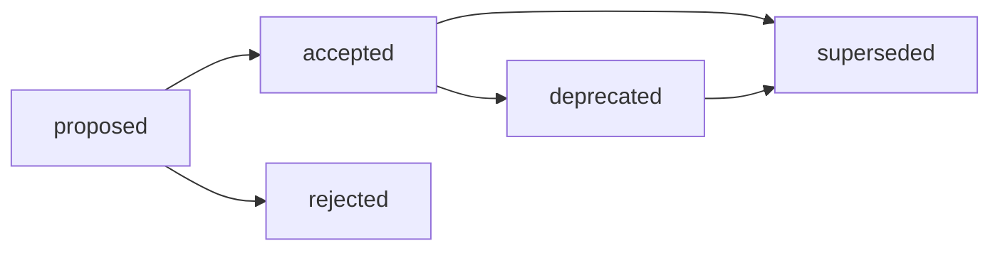

# RFC: Стандарт структуры ADR

## Summary

Принять единый базовый контракт ADR (Architectural Decision Record) для Хаба и
архетипов A/B/C/D: минимальный frontmatter, стабильная идентификация, тело с
контекстом, решением, альтернативами, последствиями, проверкой и явной
семантикой supersession.

Этот RFC не переводит контракт сразу в обязательный standard. После human review
он должен стать входом для одного из следующих артефактов: `standards/`,
`docs/adr/README.md`, ADR template или validator update. До этого документ
является draft proposal в смысле [Governance RFC](README.md).

Входные источники:

- [ADR industry norms research](../../research/hub/2026-06-27-adr-industry-norms-and-variants.md);
- [RFC industry norms research](../../research/hub/2026-06-27-rfc-industry-norms-and-variants.md);
- [ADR-001](../../docs/adr/2026-06-adr-001-ecosystem-infrastructure-methodology.md);
- [ADR-002](../../docs/adr/2026-06-adr-002-artifact-document-methodology.md);
- [Frontmatter Docs Standard](../../standards/frontmatter-docs-standard.md);
- [File Naming](../../standards/file-naming.md).

## Decision

1. ADR фиксирует принятое решение и rationale, а не обсуждение всех вариантов.
2. Текущий Хаб создает ADR в `docs/adr/` и не переносит существующие RFC из
   `governance/rfc/` без отдельного миграционного решения.
3. Новый Hub/HTOM ADR использует имя
   `YYYY-MM-adr-NNN-short-title.md`, где `NNN` - стабильный ADR id.
4. Frontmatter ADR остается минимальным: `status`, `version`, `updated`,
   `temperature`. Поля `type`, `decision-drivers`, `owner`,
   `impacted-artifacts` и `supersedes` обязательны в теле документа, а не в YAML,
   пока локальный ADR index или validator их не потребляет.
5. Базовый ADR contract обязателен для всех архетипов, но вес отдельных секций
   меняется по матрице A/B/C/D.

## Base Contract

### Identification

| Элемент | Решение |
| --- | --- |
| Canonical path | `docs/adr/` для текущего Хаба и HTOM/spoke ADR. |
| Filename | `YYYY-MM-adr-NNN-short-title.md`. |
| Stable id | `ADR-NNN`, совпадает с номером в имени файла и заголовке. |
| Title | `# ADR-NNN: Short decision title`. |
| Date | В имени файла и в `updated`; дата принятия фиксируется в секции Decision Metadata. |
| Source link | Issue, RFC, research или PR, из которого выросло решение. |

Почему не number-first `NNNN-title.md`: это сильная ADR-tool норма, но текущий
репозиторий уже валидирует date-first ADR в `docs/adr/`. Стабильность ссылки
достигается через `ADR-NNN`, а chronology остается совместимой с
[File Naming](../../standards/file-naming.md).

### Frontmatter

Обязательный frontmatter:

```yaml
---
status: draft
version: 0.1
updated: YYYY-MM-DD
temperature: 0.1
---
```

Дополнительные поля не становятся обязательными в YAML. Это защищает ADR от
frontmatter inflation и соответствует [Frontmatter Docs Standard](../../standards/frontmatter-docs-standard.md):
если поле не потребляет инструмент, индекс, шаблон или provenance rule, оно
должно жить в теле.

### Required Body Sections

ADR должен содержать секции в таком порядке:

1. `Decision Metadata`
2. `Context`
3. `Decision`
4. `Decision Drivers`
5. `Alternatives Considered`
6. `Consequences`
7. `Compliance and Validation`
8. `Lifecycle`
9. `Related Artifacts`

Минимальный шаблон:

```markdown
# ADR-NNN: Short decision title

## Decision Metadata

| Field | Value |
| --- | --- |
| ADR id | ADR-NNN |
| Decision type | governance / methodology / product / curriculum / runtime |
| Decision status | proposed / accepted / rejected / deprecated / superseded |
| Decision date | YYYY-MM-DD |
| Owner | Human owner or owning group |
| Source | Issue/RFC/research/PR link |
| Impacted artifacts | Paths or "none" |
| Supersedes | ADR-NNN or "none" |
| Superseded by | ADR-NNN or "none" |

## Context

Problem, constraints, and why the decision is needed now.

## Decision

One accepted decision, stated directly.

## Decision Drivers

- Driver 1.
- Driver 2.

## Alternatives Considered

| Alternative | Why rejected |
| --- | --- |
| ... | ... |

## Consequences

Positive effects, trade-offs, and follow-up work.

## Compliance and Validation

How humans, validators, docs, tests or runtime checks verify the decision.

## Lifecycle

Transition state, review trigger, deprecation and supersession rules.

## Related Artifacts

Links to RFC, standard, template, validator, implementation PR or research.
```

## Lifecycle

ADR lifecycle uses a body-level `Decision status` vocabulary and maps it to the
current frontmatter vocabulary.

| Decision status | Meaning | Frontmatter status today |
| --- | --- | --- |
| `proposed` | ADR text is being reviewed before acceptance. | `draft` |
| `accepted` | Human decision accepted; ADR is the active decision record. | `canonical` |
| `rejected` | Decision proposal was rejected but preserved for rationale. | `reviewed` or `superseded` with body note |
| `deprecated` | Decision still describes history but should not guide new work. | `canonical` with body note until validator supports `deprecated` |
| `superseded` | Later ADR/RFC replaces this decision. | `superseded` |

Allowed transitions:



Rules:

- `accepted` requires explicit human review or merge decision.
- `superseded` requires a backlink to the replacing ADR/RFC.
- `deprecated` requires a migration or replacement note.
- Rejected ADRs remain linkable when the rejected alternative is likely to
  reappear in future work.

## Матрица дельт A/B/C/D

| Архетип | ADR role | Required deltas | Keep light |
| --- | --- | --- | --- |
| A. Governance & Knowledge Hub | Governance-record for cross-repository methodology, lifecycle, standards and AI contracts. | Require source RFC/research link, impacted artifacts, compliance/validation and supersession. | Do not create ADR for typo fixes, local cleanup or accepted RFCs that already serve as decision records. |
| B. Prompt & Pattern Library | Lightweight decision record for stable prompt/process/pattern standards. | Require evidence link, affected prompts/patterns and rollback/evaluation notes. | Do not create ADR for routine prompt wording, experiments or one-off tuning. |
| C. Product Spoke / Runtime | Engineering decision record for public API, runtime architecture, data, compatibility and release-impact choices. | Require compatibility, migration, runtime validation and owner. | Do not duplicate product specs, issue acceptance criteria or small feature PRs. |
| D. Education / Learning Package | Curriculum/platform decision record for durable learning outcomes, assessment and course architecture. | Require learner impact, curriculum migration and review trigger. | Do not create ADR for individual lesson edits or short-lived course notes. |

## Boundary RFC/ADR

Use this rule for the RFC/ADR boundary:

| Situation | Decision |
| --- | --- |
| Proposal needs broad review, alternatives and human choice before the decision. | Create RFC first; create ADR after acceptance only if a short canonical decision record is needed. |
| Accepted RFC already contains final status, rationale, alternatives, consequences and no separate downstream standard is produced. | Accepted RFC may itself be the decision record; do not duplicate it as ADR. |
| Decision is narrow, already accepted, or does not need proposal-stage discussion. | Create ADR directly. |
| Accepted decision creates or changes a standard, template, validator, practice or cross-repository rule. | Prefer RFC -> ADR -> standard/template/validator route. |
| Decision only explains implementation details of one PR. | Do not create ADR; PR description is enough. |

The key invariant: RFC answers "should we accept this change and how?", ADR
answers "what decision was accepted and why?".

## Critical Analysis

| Hypothesis under attack | Refutation attempt | Decision |
| --- | --- | --- |
| ADR filenames should switch to number-first because strict ADR tools use that norm. | Number-first improves ADR tool compatibility, but conflicts with the current Hub date-first ADR validator and would require a migration unrelated to this task. Stable `ADR-NNN` inside a date-first filename preserves both citation and chronology. | Keep `YYYY-MM-adr-NNN-short-title.md`. |
| `type`, `decision-drivers`, `owner` and `supersedes` must be frontmatter. | Rich YAML improves machine querying only after an index/validator consumes it. Today the repo standard says explanatory metadata belongs in the body. Mandatory YAML would add drift without automation. | Require these fields in `Decision Metadata` and body sections, not frontmatter. |
| Every accepted RFC should produce an ADR. | Backstage-like RFC -> ADR separation is useful for large proposal histories, but PEP/EIP/Rust-like accepted proposals can be decision records themselves. Mandatory duplication would create two sources of truth. | ADR is required only when a concise canonical decision or downstream standard trace is needed. |
| One strict ADR template should apply identically to A/B/C/D. | Industry evidence shows strong ADR signals in governance/product contexts and weak signals in prompt/education contexts. Uniform weight would over-formalize B/D. | Use a common base contract plus archetype deltas. |
| `deprecated` should immediately become a frontmatter status. | The current validator accepts `draft`, `reviewed`, `published`, `superseded`, `canonical`, `experimental`. Adding `deprecated` without validator update creates warnings. | Keep `deprecated` in body-level lifecycle until a future validator change. |

Confirmation threshold: all accepted decisions above survived refutation except
with bounded, documented trade-offs. The trade-offs are below the issue's 20%
counter-argument threshold because each rejected alternative requires a broader
migration, extra validator work or duplicate decision source.

## Impacted Artifacts

Immediate PR impact:

- add this RFC under `governance/rfc/`;
- register it in [Governance RFC README](README.md);
- register it in [Artifact Map](../artifact-map.md);
- allow it in `tools/validate-repository-structure.sh`.

Future work after human acceptance:

- create `standards/adr-structure-standard.md` or equivalent;
- create `docs/adr/README.md` index and template if ADR volume grows;
- update validators only if body-level metadata needs machine enforcement.

## Review Status

This RFC is ready for human review as the proposed answer for issue #280. It
does not accept itself and does not create a mandatory ADR standard until the
review decision is made.
