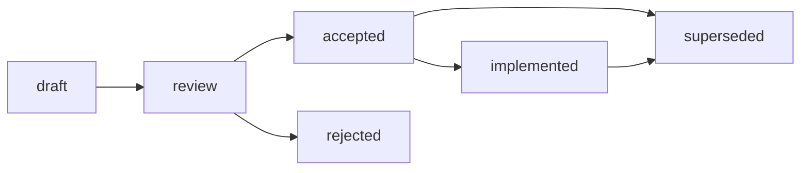

# RFC: Стандарт структуры RFC

## Summary

Принять единый базовый контракт RFC-like документов для Хаба и архетипов
A/B/C/D: proposal с владельцем, мотивацией, решением, альтернативами,
trade-offs, impacted artifacts, открытыми вопросами и lifecycle.

RFC не является обязательной нормой сам по себе. Даже accepted/canonical RFC
должен делегировать исполняемые правила в standard, template, validator,
practice или ADR, если downstream-репозитории должны выполнять правило
механически. Это сохраняет границу из [Governance RFC](README.md) и
[ADR-002](../../docs/adr/2026-06-adr-002-artifact-document-methodology.md).

Входные источники:

- [RFC industry norms research](../../research/hub/2026-06-27-rfc-industry-norms-and-variants.md);
- [ADR industry norms research](../../research/hub/2026-06-27-adr-industry-norms-and-variants.md);
- [ADR-001](../../docs/adr/2026-06-adr-001-ecosystem-infrastructure-methodology.md);
- [ADR-002](../../docs/adr/2026-06-adr-002-artifact-document-methodology.md);
- [Frontmatter Docs Standard](../../standards/frontmatter-docs-standard.md);
- [File Naming](../../standards/file-naming.md).

## Decision

1. RFC отвечает на вопрос "стоит ли принять это значимое изменение и как именно?"
   до финального решения.
2. Текущий Хаб продолжает хранить governance RFC в `governance/rfc/` до
   отдельной миграции. Для новых HTOM/spoke репозиториев целевой путь из ADR-002
   остается `docs/rfc/`.
3. Новый Hub governance RFC, создаваемый из issue/research, использует
   `YYYY-MM-DD-rfc-short-title.md`. Существующие semantic filenames не
   переименовываются.
4. Frontmatter RFC остается минимальным: `status`, `version`, `updated`,
   `temperature`. `owner`, `rfc-status`, `impacted-artifacts`, `decision-link`
   and `implementation-link` обязательны в теле, пока validator или index их не
   потребляет.
5. Базовый RFC contract общий для A/B/C/D, но weight and required evidence
   меняются по архетипу.

## Base Contract

### Identification and Placement

| Элемент | Решение |
| --- | --- |
| Current Hub path | `governance/rfc/` |
| Future HTOM/spoke path | `docs/rfc/`, если repo follows ADR-002 target structure |
| Hub filename | `YYYY-MM-DD-rfc-short-title.md` for new dated governance RFCs; legacy names stay unchanged |
| Spoke filename | `YYYY-MM-name.md` or `YYYY-name.md` until local validator says otherwise |
| Stable reference | Link path plus heading; future numeric RFC ids require index/tooling |
| Canonical delegation | Standard/template/validator/practice/ADR after human decision, not automatic |

Location decision: `governance/rfc/` is semantically correct for the current
Hub because these are governance proposals. `docs/rfc/` is the target for new
HTOM/spoke structures, but moving the current Hub requires a separate migration
PR with link rewrites and validator changes.

### Frontmatter

Обязательный frontmatter:

```yaml
---
status: draft
version: 0.1
updated: YYYY-MM-DD
temperature: 0.1
---
```

`owner`, `status`, `impacted-artifacts` and related proposal metadata are
required in the body-level `RFC Metadata` section. They are not mandatory YAML
fields because [Frontmatter Docs Standard](../../standards/frontmatter-docs-standard.md)
requires the smallest field set unless a tool consumes extra fields.

### Required Body Sections

RFC должен содержать секции в таком порядке:

1. `RFC Metadata`
2. `Summary`
3. `Motivation`
4. `Goals and Non-goals`
5. `Proposal`
6. `Alternatives`
7. `Trade-offs`
8. `Impacted Artifacts`
9. `Implementation and Validation`
10. `Lifecycle and Decision Path`
11. `Open Questions`
12. `Related Artifacts`

Минимальный шаблон:

```markdown
# RFC: Short proposal title

## RFC Metadata

| Field | Value |
| --- | --- |
| Owner | Human owner or owning group |
| RFC status | draft / review / accepted / rejected / implemented / superseded |
| Source issue | Issue link |
| Impacted artifacts | Paths or "none" |
| Decision record | ADR/RFC link or "not yet" |
| Implementation link | PR/tool/standard link or "not yet" |
| Archetype scope | A / B / C / D / multi |

## Summary

One-paragraph proposal.

## Motivation

Problem, current pain, and why issue/PR text is insufficient.

## Goals and Non-goals

What this RFC decides and explicitly does not decide.

## Proposal

The selected solution, stated as a decision draft rather than a menu.

## Alternatives

Rejected alternatives and the reason each one fails.

## Trade-offs

Costs, risks, compatibility and operational impact.

## Impacted Artifacts

Files, standards, templates, validators, docs, projects or "none".

## Implementation and Validation

How the proposal is applied and how local checks prove it.

## Lifecycle and Decision Path

Current state, required human gate, and post-acceptance delegation.

## Open Questions

Only questions that block acceptance or implementation.

## Related Artifacts

Research, ADRs, standards, PRs and issue links.
```

## Lifecycle

RFC lifecycle:



Body-level `RFC status` uses the lifecycle above. Frontmatter status maps to the
current validator vocabulary:

| RFC status | Meaning | Frontmatter status today |
| --- | --- | --- |
| `draft` | Proposal is being written. | `draft` |
| `review` | Ready for human review or in active review. | `reviewed` |
| `accepted` | Human decision accepted the proposal. | `canonical` |
| `rejected` | Proposal rejected but preserved for rationale. | `reviewed` or `superseded` with body note |
| `implemented` | Accepted proposal has been delegated/applied. | `canonical` |
| `superseded` | Later RFC/ADR replaces this proposal or decision. | `superseded` |

Rules:

- Move to `review` only when required sections are complete and local validation
  passes.
- Move to `accepted` only by human decision.
- Move to `implemented` only after impacted artifacts, validators or docs are
  updated.
- Move to `superseded` only with a replacement link.

## Матрица дельт A/B/C/D

| Архетип | RFC role | Required deltas | Avoid |
| --- | --- | --- | --- |
| A. Governance & Knowledge Hub | Formal governance proposal for standards, lifecycle, artifact routing, AI contracts and cross-repository methodology. | Require owner, impacted artifacts, alternatives, trade-offs, decision path, validation and RFC/ADR boundary. | Do not require RFC for typo fixes, link-only cleanup or small local implementation changes. |
| B. Prompt & Pattern Library | Micro-RFC / Design Note for reusable prompt patterns, taxonomy, evaluation and workflow governance. | Require failed case or experiment evidence, affected prompts/patterns, evaluation and rollout/backout. | Do not RFC every prompt wording change or temporary experiment. |
| C. Product Spoke / Runtime | BEP-like / Product Design Proposal for public API, plugin contracts, migrations, compatibility and product architecture. | Require release impact, backward compatibility, migration, testing and owner. | Do not duplicate feature specs or sprint tickets. |
| D. Education / Learning Package | Curriculum RFC for course-wide taxonomy, outcomes, assessment model and contribution policy. | Require learner impact, curriculum migration, assessment impact and review cycle. | Do not RFC individual lesson edits or small content corrections. |

## Boundary RFC/ADR

| Case | Rule |
| --- | --- |
| Proposal has open alternatives, high governance impact or cross-repository consequences. | RFC first. |
| Accepted proposal needs a concise canonical decision record before becoming standard/template/tool/practice. | RFC -> ADR. |
| Accepted RFC already has final decision, rationale, alternatives and consequences, and no separate standard is produced. | Accepted RFC itself is the decision record. |
| Decision is narrow, already accepted or primarily records "why" after a choice. | ADR without RFC. |
| Change is implementation-local and reversible. | Issue/PR is enough; no RFC or ADR. |

The boundary is intentionally functional, not folder-based. A document in
`governance/rfc/` is still a proposal unless its status and human decision say
otherwise.

## Critical Analysis

| Hypothesis under attack | Refutation attempt | Decision |
| --- | --- | --- |
| Hub must immediately move RFCs from `governance/rfc/` to `docs/rfc/` because ADR-002 names `docs/rfc/`. | ADR-002 explicitly says current Hub keeps `governance/rfc/` until a separate migration. Immediate move would change many links and validator assumptions outside issue #280. | Keep current Hub RFCs in `governance/rfc/`; document `docs/rfc/` as target for new HTOM/spoke structures. |
| RFCs should require numeric IDs now. | Strong ecosystems use numeric IDs, but current Hub has semantic filenames and no RFC index allocator. Adding numbers without tooling creates false precision and migration churn. | Use date-first filenames for new dated Hub RFCs; leave numeric ids for a future index/tool decision. |
| Owner and impacted artifacts should be YAML frontmatter fields. | Body-level tables are visible to reviewers and do not require validator changes. YAML fields are justified only when consumed by tooling. | Require these fields in `RFC Metadata`, not frontmatter. |
| One heavy Rust/KEP-like RFC process should apply to all archetypes. | Research shows strong formal RFC signals for A, mixed signals for C, weak signals for B/D. Uniform weight would slow prompt and education workflows. | Use base contract plus archetype-specific deltas. |
| Every accepted RFC must become a standard. | Some accepted RFCs are decision records or rationale only. Forcing standards would violate Anti-Inflation and create norms without operational consumers. | Delegate only when downstream behavior must be repeated or validated. |
| Open Questions should always remain in RFCs for transparency. | Open questions are useful during review, but accepted/implemented RFCs with stale questions confuse future agents. | Require Open Questions, but clear or convert blockers before acceptance. |

Confirmation threshold: the selected rules survived the refutation pass because
their remaining costs are bounded and explicitly delegated to future validator or
migration work. Alternatives that failed would introduce immediate migration,
frontmatter drift, duplicate decision records or over-process for B/D.

## Impacted Artifacts

Immediate PR impact:

- add this RFC under `governance/rfc/`;
- register it in [Governance RFC README](README.md);
- register it in [Artifact Map](../artifact-map.md);
- allow it in `tools/validate-repository-structure.sh`.

Future work after human acceptance:

- create `standards/rfc-structure-standard.md` or equivalent;
- add an RFC template if repeated creation continues;
- extend validators only if RFC metadata must become machine-enforced;
- decide separately whether current Hub RFCs migrate to `docs/rfc/`.

## Review Status

This RFC is ready for human review as the proposed answer for issue #280. It
does not accept itself and does not create a mandatory RFC standard until the
review decision is made.
