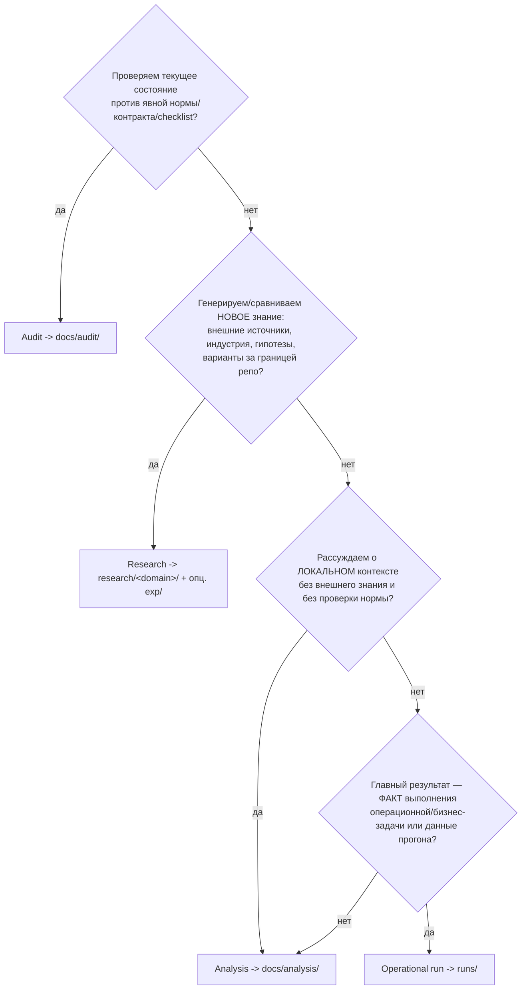
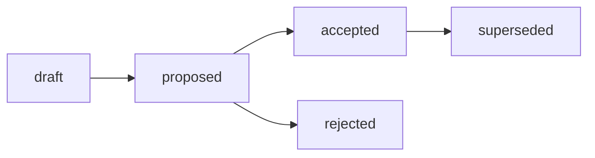

# RFC: Структура research, контейнер `exp/` и маршрутизация Research / Analysis / Audit

## RFC Metadata

| Field | Value |
| --- | --- |
| Owner | G-Ivan-A |
| RFC status | draft (narrative summary; машиночитаемый canon — frontmatter `status`) |
| Source issue | [#302](https://github.com/G-Ivan-A/hybrid-Intelligence-lab/issues/302); [#294](https://github.com/G-Ivan-A/hybrid-Intelligence-lab/issues/294); [#290](https://github.com/G-Ivan-A/hybrid-Intelligence-lab/issues/290); [#288](https://github.com/G-Ivan-A/hybrid-Intelligence-lab/issues/288) |
| Impacted artifacts | `standards/research-profile.md`, `docs/adr/2026-06-adr-002-artifact-document-methodology.md`, `tools/validate-repository-structure.sh`, `tools/validate-file-naming.sh`, `research/hub/exp-*`, `governance/backlog.md` (последствия, не правки в этом RFC) |
| Decision record | [ADR-003](../../docs/adr/2026-07-adr-003-research-structure.md) (B-017, `proposed`) |
| Implementation link | [`standards/research-standard.md`](../../standards/research-standard.md) (B-018, `draft`) |
| Archetype scope | A (Governance & Knowledge Hub); routing-следствия для B/C/D вынесены в downstream chain |

## Summary

Предлагается единый базовый контракт структуры research-артефактов Хаба:
дата-первый Markdown-отчёт `research/<domain>/YYYY-MM-DD-name.md` как основной
носитель знания и **единый контейнер `research/<domain>/exp/<issue-slug>/`** для
воспроизводимой доказательной базы. RFC обосновывает **отказ от вложенной папки
`outputs/`** (плоская структура внутри `exp/<issue-slug>/`), фиксирует границу
между research evidence corpus (`exp/`) и operational run record (`runs/`) и
вводит маршрутизацию Research / Analysis / Audit **по типу задачи, а не по имени
каталога**.

Это RFC, а не норма. Он является входом для ADR-003 (B-017) и нормативного
`standards/research-standard.md` (B-018). Физическая миграция
legacy `exp-*` и изменение валидаторов в этом документе **не выполняются**
(B-022, B-023).

## Motivation

Аудит формата research-артефактов
([docs/audit/2026-06-29](../../docs/audit/2026-06-29-research-artifact-format-contract-audit.md),
issue #290) и инвентаризация Research / Analysis / Audit
([research/hub/2026-06-28](../../research/hub/2026-06-28-research-analysis-audit-inventory.md),
issue #288) зафиксировали две проблемы, которые нельзя устранить точечной
правкой профиля:

1. **Коллизия контейнеров.**
   [`standards/research-profile.md`](../../standards/research-profile.md)
   с 2026-05-26 разрешает `research/<domain>/exp-<slug>/` с вложенным
   `outputs/`. ADR-002 одновременно маршрутизирует execution/run records в
   `runs/`. Аудит назвал это «оставшейся коллизией»: один и тот же токен
   `outputs/` несёт run-семантику, которую ADR-002 уже закрепил за `runs/`.
   Источник папочной структуры найден (profile-standard), но **explicit
   reconciliation между standard-level `exp-<slug>/outputs/` и ADR-level `runs/`
   отсутствует**.

2. **Размытие типов.** Инвентаризация показала, что Research (генерация нового
   знания), Analysis (локальный контекст) и Audit (проверка соответствия) часто
   живут в одном каталоге и нормируются одним профилем. Audit прячется под
   `analysis/`, Research прячется под `analysis/`, RFC/proposal прячется под
   `analysis/`. Один размытый профиль закрепит эту перегрузку.

Почему текста issue/PR недостаточно: решение меняет публичный контракт
структуры Хаба и затрагивает downstream-цепочку B-017..B-023. Такое изменение
требует proposal-stage review с альтернативами, trade-offs и явным decision
path до внедрения (см.
[`standards/rfc-structure-standard.md`](../../standards/rfc-structure-standard.md),
Boundary RFC/ADR).

## Goals and Non-goals

**Goals.**

- Зафиксировать целевую структуру `research/<domain>/` и единый контейнер
  `exp/`.
- Обосновать запрет `outputs/` и плоскую структуру внутри `exp/<issue-slug>/`.
- Определить маршрутизацию Research / Analysis / Audit по типу задачи.
- Описать границу `exp/` (research evidence corpus) vs `runs/` (operational run
  record).
- Предложить эвристические критерии классификации задачи на этапе её создания.
- Описать переходный режим для legacy `exp-*` до миграции (B-022).
- Перечислить последствия для B-017..B-023.

**Non-goals.**

- ❌ Не писать нормативный стандарт — это B-018.
- ❌ Не выполнять физическую миграцию `exp-*` и не удалять `outputs/` физически —
  это B-022.
- ❌ Не менять логику валидаторов research-формата — это B-023. Регистрация этого
  RFC как active artifact в существующих реестрах (allowlist структуры, README,
  artifact-map) не относится к research-format-логике и выполняется как обычная
  постановка артефакта на учёт.
- ❌ Не удалять `standards/research-profile.md` — это B-021, после замены
  стандартом.
- ❌ Не становиться нормой: даже accepted RFC делегирует обязательное правило в
  active artifact (см. [Governance RFC README](README.md)).

## Proposal

Изложено как decision draft, а не меню вариантов. Меню — в разделе Alternatives.

### P1. Целевая структура `research/<domain>/`

Основной носитель знания остаётся дата-первым Markdown-отчётом. Воспроизводимая
доказательная база собирается в **единый контейнер `exp/`** внутри направления,
а не россыпью sibling-папок `exp-<slug>/` на одном уровне с отчётами.

```text
research/<domain>/
  README.md                      # навигация и политики направления
  YYYY-MM-DD-name.md             # research report — основной артефакт знания
  YYYY-MM-DD-other.md
  exp/                           # контейнер воспроизводимой evidence base
    <issue-slug>/                # один эксперимент = один issue-slug
      README.md                  # гипотеза, метод, как запустить и воспроизвести
      <script>.py | run.sh       # точка входа эксперимента
      <evidence>.{json,md,csv}   # зафиксированные результаты прогона (плоско)
```

Правила:

- `research/<domain>/YYYY-MM-DD-name.md` — единственный обязательный носитель
  research-вывода; именование подчиняется
  [`standards/file-naming.md`](../../standards/file-naming.md).
- `research/<domain>/exp/<issue-slug>/` — опциональный evidence corpus. Создаётся
  только когда вывод нужно сделать воспроизводимым (scan, benchmark, сбор
  evidence). Каждый эксперимент ссылается на родительский отчёт.
- `<issue-slug>` ДОЛЖЕН включать номер issue для traceability, например
  `exp/research-structure-302/`. Это отвечает на открытый вопрос аудита №2
  (issue-number slug как обязательная traceability-конвенция).

### P2. Запрет `outputs/`: плоская структура внутри `exp/<issue-slug>/`

Внутри `exp/<issue-slug>/` применяется **плоская структура**: `README.md`,
скрипт и зафиксированные результаты лежат рядом, без обязательных подпапок
`inputs/` и `outputs/`.

Почему запрет `outputs/`:

1. **Снятие коллизии с `runs/`.** Токен `outputs/` несёт run/output-семантику,
   которую ADR-002 уже закрепил за `runs/`. Удаление `outputs/` убирает саму
   поверхность коллизии: `exp/` становится плоским evidence-пакетом, а `runs/`
   остаётся единственным местом с run-семантикой.
2. **Меньше церемонии для малых корпусов.** Разделение `inputs/`/`outputs/`
   дублирует то, что уже даёт git (provenance через историю). Для типичного
   research-эксперимента из скрипта и нескольких файлов результатов это
   бюрократия без выгоды.
3. **Стабильные ссылки и предсказуемость.** Плоская структура уменьшает глубину
   путей и убирает развилку «куда класть файл — в `inputs/` или `outputs/`».
4. **Готовность к воспроизводимости.** Скрипт перезаписывает результаты на месте;
   git фиксирует дельту прогона. Снимок результата остаётся read-only evidence.

Граничный случай большого объёма: если эксперимент оперирует большим числом
входных/выходных файлов, РАЗРЕШАЕТСЯ опциональная группировка по роли данных
(например, `data/`), но **никогда не обязательная папка `outputs/`**. Дефолт —
плоско; группировка появляется только при реальной операционной боли
(Anti-Inflation principle,
[`governance/repo-model.md`](../repo-model.md)).

### P3. Граница `exp/` vs `runs/`

| Контейнер | Назначение | Привязка | Семантика |
| --- | --- | --- | --- |
| `research/<domain>/exp/<issue-slug>/` | Research evidence corpus: воспроизводимая доказательная база, обосновывающая утверждение в research-отчёте. | ВСЕГДА ссылается на parent dated report. | «Докажи знание»: артефакт существует ради knowledge claim. |
| `runs/` | Operational run record: факт выполнения бизнес/операционной задачи или pipeline, его данные и результаты (ADR-002). | НЕ обязан быть привязан к research-отчёту. | «Зафиксируй выполнение»: артефакт существует ради записи прогона. |

Критерий разведения (один вопрос исполнителю):

> Этот артефакт существует, чтобы **доказать утверждение в research-отчёте**
> (→ `exp/`), или чтобы **зафиксировать факт выполнения операционной/бизнес-задачи
> или pipeline** (→ `runs/`)?

Краевой случай: research-эксперимент технически тоже «прогон», но его цель —
доказательная для знания, поэтому он идёт в `exp/`. Операционная задача,
производящая анализируемые данные, идёт в `runs/`; если позже на этих данных
проводится исследование, research-отчёт **цитирует `runs/` как источник данных**,
а не поглощает run-запись внутрь `exp/`.

### P4. Маршрутизация Research / Analysis / Audit по типу задачи

Согласованные определения (issue #302):

- **Research** — генерация нового знания, гипотез, индустриальных норм за
  пределами текущих границ.
- **Analysis** — исследование локального/внутреннего контекста без генерации
  нового внешнего знания.
- **Audit** — проверка соответствия существующему стандарту/контракту.

Маршрутизация (для архетипа A / Хаба; routing для B/C/D — downstream chain):

| Тип | Главный вопрос | Дом артефакта | Доказательная база |
| --- | --- | --- | --- |
| Research | Что известно и какие варианты существуют за нашей границей? | `research/<domain>/YYYY-MM-DD-name.md` | опц. `research/<domain>/exp/<issue-slug>/` |
| Analysis | Что происходит в нашем локальном/внутреннем контексте? | `docs/analysis/YYYY-MM-DD-name.md` | inline или ссылка на `runs/` |
| Audit | Соответствует ли текущее состояние норме/контракту? | `docs/audit/YYYY-MM-DD-name.md` | воспроизводимые проверки / вывод валидатора |
| Operational / Business run | Запись выполнения задачи/pipeline | `runs/` (ADR-002) | — |

Ключевой принцип: **тип определяется содержательной ролью документа, а не именем
каталога**. Аудит, спрятанный в `docs/analysis/`, остаётся Audit; research,
спрятанный в `docs/analysis/`, остаётся Research (см.
[инвентаризацию #288](../../research/hub/2026-06-28-research-analysis-audit-inventory.md),
раздел 4).

### P5. Эвристические критерии классификации на этапе создания задачи

Дерево решений для исполнителя (человек или агент) при постановке задачи:



Тай-брейкеры для граничных кейсов:

- **Research vs Analysis.** Наличие внешних источников, индустриального
  сравнения или проверки гипотезы склоняет к Research; чистое рассуждение о
  внутреннем состоянии — к Analysis. Если документ делает и то, и другое — он
  **разделяется**: research-отчёт цитирует analysis либо классифицируется по
  доминирующему deliverable. Один артефакт не нормируется как два типа сразу.
- **Analysis vs Audit.** Если есть норма и семантика
  pass/fail/finding/remediation — это Audit, даже если файл лежит в
  `docs/analysis/`.
- **Research vs Operational run.** Если артефакт нужен ради knowledge claim —
  `exp/`; если ради записи прогона — `runs/` (см. P3).

### P6. Переходный режим для legacy `exp-*`

Этот RFC **не мигрирует и не переименовывает** существующие
`research/hub/exp-<slug>/` с `outputs/`. До миграции (B-022):

- Существующие `exp-<slug>/outputs/` остаются валидными под
  `research-profile.md` v1.3 как legacy-compatible.
- Целевой формат — `exp/<issue-slug>/` (плоско) — применяется к **новой** работе
  после принятия стандарта (B-018). До этого момента новая работа МОЖЕТ
  продолжать dual-model, но рекомендуемое направление — плоский контейнер `exp/`.
- Валидаторы в этом RFC не меняются; enforcement кодифицируется в B-023, миграция
  — в B-022. Чтение legacy `exp-*` остаётся однозначным: это sibling evidence
  corpus прежнего формата.

## Alternatives

| # | Альтернатива | Почему отклонена |
| --- | --- | --- |
| A1 | Сохранить sibling `exp-<slug>/` с `outputs/` (рекомендация аудита №3). | Не снимает коллизию `outputs/` ↔ `runs/`; оставляет ambiguous future contract и засоряет корень направления смесью отчётов и папок. |
| A2 | Вернуться к md-only (папки запрещены). | Ухудшает воспроизводимость задач вроде #278/#284/#288; аудит явно рекомендовал НЕ делать md-only общим правилом (рекомендация №2). |
| A3 | Перенести research-эксперименты целиком в `runs/`. | Стирает границу «знание vs операция»: `runs/` — operational record, не привязанный к research-отчёту. Research evidence потерял бы привязку к parent report и knowledge lifecycle. |
| A4 | Оставить обязательным `outputs/`, но добавить `inputs/`/`outputs/` и в `runs/`. | Усиливает церемонию и сохраняет коллизию токена; не решает терминологическую проблему, а тиражирует её. |
| A5 | Нормировать Research / Analysis / Audit одним профилем (как сейчас). | Инвентаризация #288 показала, что это закрепит перегрузку `analysis` и смешение типов; нужны три независимые цепочки. |
| A6 | Сразу писать `standards/research-standard.md` без RFC. | Стандарт без принятого rationale выглядел бы как прямая правка профиля; теряются альтернативы, trade-offs и human decision gate (B-017). |

## Trade-offs

- **Стоимость переходного периода.** Какое-то время сосуществуют legacy
  `exp-<slug>/outputs/` и целевой `exp/<issue-slug>/`. Это осознанный долг до
  B-022; чтение однозначно, потому что формат legacy фиксирован.
- **Потеря визуального `inputs`/`outputs` разделения.** Для крупных
  экспериментов плоская структура менее наглядна. Mitigation: опциональная
  группировка по роли данных при реальной боли, но без обязательного `outputs/`.
- **Дисциплина классификации.** Routing по типу задачи требует от исполнителя
  осознанного выбора на старте. Mitigation: дерево решений P5 и тай-брейкеры;
  будущий resolver prompt
  ([resolve-artifact-location-proposal.md](resolve-artifact-location-proposal.md)).
- **Зависимость downstream.** Граница `exp/` vs `runs/` окончательно
  закрепляется только ADR-002 addendum (B-019); до него RFC задаёт направление,
  но не норму.
- **Совместимость.** Решение не ломает текущий репозиторий: ADR-001 сохраняет
  переходный режим Хаба, а валидаторы не меняются в этом RFC.

## Матрица дельт A/B/C/D

Этот RFC имеет `rfc-scope: A`, потому что меняет базовый контракт Хаба. Матрица
ниже фиксирует, какие части proposal применяются к другим архетипам как
downstream input, а не как немедленная норма.

| Архетип | Required deltas | Avoid |
| --- | --- | --- |
| A. Governance & Knowledge Hub | Принять или отклонить целевой контракт `research/<domain>/exp/<issue-slug>/`, запрет `outputs/`, routing Research / Analysis / Audit и границу `exp/` vs `runs/` через ADR B-017, стандарт B-018 и addendum B-019. | Не выполнять миграцию `exp-*`, не менять валидаторы research-формата и не превращать RFC в норму до human decision. |
| B. Prompt & Pattern Library | Если prompt library наследует research-контур Хаба, использовать `exp/` только для воспроизводимой evidence base по prompt experiments; локальные prompt runs остаются в operational records проекта. | Не переносить все prompt experiments в Hub `research/` и не требовать RFC для каждой правки prompt wording. |
| C. Product Spoke / Runtime | Применять distinction `research evidence` vs `operational run` при проектных исследованиях, migration notes и release-impact анализе; runtime pipeline outputs остаются в `runs/` или локальном CI/artifact storage. | Не смешивать customer/runtime artifacts с Hub research evidence и не навязывать Hub-specific path без project-level ADR/standard. |
| D. Education / Learning Package | Использовать Research / Analysis / Audit routing для curriculum research, learner-impact analysis и проверки учебных материалов; evidence для course-wide claims может ссылаться на `exp/`. | Не RFC-ить отдельные lesson edits и не превращать учебные отчеты в research corpus без воспроизводимой гипотезы. |

## Critical Analysis

Стресс-тест предложенных границ: каждую гипотезу пытались опровергнуть.

| Гипотеза под атакой | Попытка опровержения | Решение |
| --- | --- | --- |
| Единый контейнер `exp/` лучше sibling `exp-<slug>/`. | Sibling-папки уже работают и зарегистрированы в валидаторе; контейнер — лишний уровень. | Контейнер изолирует машинный evidence от human-readable отчётов, даёт одно предсказуемое место для exclude из mkdocs и будущего validator-scope, масштабируется. Лишний уровень оправдан разделением аудиторий. Принято. |
| Запрет `outputs/` теряет наглядность. | Крупные эксперименты выигрывают от `inputs/`/`outputs/`. | Дефолт плоский; группировка по роли данных разрешена опционально при реальной боли. Обязательный `outputs/` сохранял бы коллизию с `runs/`. Принято с bounded trade-off. |
| Граница `exp/` vs `runs/` искусственна: эксперимент — это тоже run. | Технически да. | Различает не механика, а цель: knowledge claim (`exp/`) vs запись выполнения (`runs/`). Критерий — один вопрос исполнителю (P3). Принято. |
| Routing по типу задачи субъективен и не воспроизводим. | Два человека могут классифицировать по-разному. | Дерево решений P5 + тай-брейкеры дают детерминированный порядок проверок (Audit → Research → Analysis → run). Спорные документы разделяются, а не классифицируются дважды. Остаточная субъективность фиксируется как open question, не блокирует acceptance. |
| Переходный dual-model порождает новый дрейф. | Сосуществование форматов — риск второй коллизии. | Legacy формат заморожен и читается однозначно; целевой формат применяется к новой работе после B-018; миграция — отдельной задачей B-022 после контракта. Дрейф ограничен по времени и зафиксирован в backlog. Принято. |
| RFC избыточен — можно сразу стандарт. | Цепочка длиннее. | Стандарт без rationale = правка профиля без принятого решения; альтернативы и human gate (B-017) были бы потеряны. Принято: RFC — обязательный вход. |

Порог уверенности: все принятые решения пережили опровержение с явными,
ограниченными trade-offs. Остаточная субъективность routing вынесена в Open
Questions как non-blocking.

## Impacted Artifacts

Затронутые артефакты (последствия, не правки в этом RFC, если не указано иное):

- `standards/research-profile.md` — источник коллизии; заменяется стандартом
  (B-018) и удаляется (B-021).
- `docs/adr/2026-06-adr-002-artifact-document-methodology.md` — получает addendum
  про границу `exp/` vs `runs/` (B-019).
- `tools/validate-repository-structure.sh`, `tools/validate-file-naming.sh` —
  enforcement `exp/` и routing (B-023); в этом RFC изменена только регистрация
  нового active artifact (allowlist + required-files), не research-format-логика.
- `research/hub/exp-*` — физическая миграция в `exp/<issue-slug>/` без `outputs/`
  (B-022).
- `standards/glossary.md` — фиксация терминов Research / Analysis / Audit / RFC /
  ADR / Standard (B-020).
- `governance/backlog.md`, `governance/artifact-map.md`,
  [`governance/rfc/README.md`](README.md) — постановка этого RFC на учёт
  (в этом PR).

Последствия для downstream chain:

| Backlog | Что это | Как зависит от этого RFC |
| --- | --- | --- |
| B-017 | ADR: принять стандарт структуры research | Фиксирует human decision по структуре `research/<domain>/`, контейнеру `exp/`, запрету `outputs/` и routing; ссылается на этот RFC. |
| B-018 | `standards/research-standard.md` | Нормативно описывает `exp/` и отказ от `outputs/`; заменяет профиль. |
| B-019 | ADR-002 addendum: граница `exp/` vs `runs/` | Кодифицирует P3 без противоречия с routing table ADR-002. |
| B-020 | Обновление `standards/glossary.md` | Закрепляет терминологию P4. |
| B-021 | Удаление `standards/research-profile.md` | Убирает конкурирующий источник истины после замены. |
| B-022 | Миграция `exp-*` → `exp/`, удаление `outputs/` | Физическая миграция legacy по P6 после контракта. |
| B-023 | Обновление валидаторов под `exp/` и routing | Делает контракт исполнимым после human decision. |

## Implementation and Validation

В этом PR:

- Создан `governance/rfc/2026-06-30-rfc-research-structure.md` (этот документ).
- RFC поставлен на учёт: запись в [Governance RFC README](README.md),
  [`governance/artifact-map.md`](../artifact-map.md), allowlist/required-files в
  `tools/validate-repository-structure.sh`, обновление статуса B-016 в
  [`governance/backlog.md`](../backlog.md) и запись в `CHANGELOG.md`.

Локальная проверка:

```bash
bash experiments/test-frontmatter-validator.sh
./tools/validate-file-naming.sh
./tools/validate-frontmatter.sh .
./tools/validate-repository-structure.sh
python3 tools/generate-manifest.py --check
```

Нормативный enforcement (`exp/`, запрет `outputs/`, routing) — в B-018/B-023, не
в этом RFC.

## Lifecycle and Decision Path

Текущее состояние: `draft`. Переход в `proposed` — после заполнения обязательных
секций и прохождения локальной валидации; переход в `accepted` — только по
human decision (ADR B-017).



Post-acceptance делегирование: обязательная норма переходит в
`standards/research-standard.md` (B-018) и ADR-002 addendum (B-019). Этот RFC
сохраняет context, alternatives, trade-offs и rationale; он не дублируется в
стандарте как proposal-обёртка.

## Boundary RFC/ADR

Для цепочки B-016..B-023 граница такая:

| Case | Rule for this research-structure change |
| --- | --- |
| Есть открытые альтернативы по структуре `research/`, контейнеру `exp/`, запрету `outputs/` и routing Research / Analysis / Audit. | Нужен RFC: этот документ сохраняет rationale, alternatives, trade-offs и rejected options. |
| Human decision должен принять или отклонить proposal перед появлением нормы. | Нужен ADR B-017: короткая запись принятого решения, которая ссылается на этот RFC. |
| Решение становится обязательным правилом размещения и оформления research artifacts. | Нужен стандарт B-018, а не дальнейшее расширение этого RFC. |
| Граница `exp/` vs `runs/` затрагивает уже принятый ADR-002. | Нужен ADR-002 addendum B-019 после стандарта, чтобы не создать конкурирующий decision source. |
| Требуется физическая миграция `exp-*` или изменение валидаторов. | Это implementation follow-up B-022/B-023 после human decision и стандарта, не часть RFC. |

Итог: RFC отвечает на вопрос "какую модель стоит принять?", ADR B-017 отвечает
"что принято человеком?", а стандарт B-018 и валидаторы отвечают "как исполнять
это правило повторяемо?".

## Open Questions

Блокирующих вопросов для acceptance нет. Non-blocking follow-up:

1. Должен ли `<issue-slug>` всегда включать номер issue, или допускается
   topic-only slug для cross-issue экспериментов? (Кандидат: issue-number
   обязателен; финализируется в B-018.)
2. Должны ли `exp/<issue-slug>/` регистрироваться в artifact-map всегда или
   только когда evidence является durable для reviewed/canonical отчёта? (Аудит
   #290, открытый вопрос №3; финализируется в B-018/B-023.)
3. Где проходит граница опциональной группировки по роли данных внутри `exp/`,
   чтобы она не превратилась в скрытый `outputs/`? (Финализируется в B-023.)

## Related Artifacts

- [Issue #302](https://github.com/G-Ivan-A/hybrid-Intelligence-lab/issues/302) —
  источник этого RFC; [#294](https://github.com/G-Ivan-A/hybrid-Intelligence-lab/issues/294),
  [#290](https://github.com/G-Ivan-A/hybrid-Intelligence-lab/issues/290),
  [#288](https://github.com/G-Ivan-A/hybrid-Intelligence-lab/issues/288).
- [Audit: Research artifact format contract](../../docs/audit/2026-06-29-research-artifact-format-contract-audit.md) —
  коллизия `exp-<slug>/outputs/` vs `runs/`.
- [Research / Analysis / Audit inventory](../../research/hub/2026-06-28-research-analysis-audit-inventory.md) —
  размытие типов и план трёх цепочек.
- [`standards/research-profile.md`](../../standards/research-profile.md) —
  legacy source коллизии.
- [ADR-002](../../docs/adr/2026-06-adr-002-artifact-document-methodology.md) —
  routing `runs/` и lifecycle артефактов.
- [`standards/rfc-structure-standard.md`](../../standards/rfc-structure-standard.md) —
  контракт RFC; [RFC стандарта структуры RFC](2026-06-27-rfc-rfc-standard.md).
- [`standards/file-naming.md`](../../standards/file-naming.md) — дата-первое
  именование.
- [`governance/backlog.md`](../backlog.md) — цепочка B-016..B-023.
- [Knowledge Lifecycle proposal](knowledge-lifecycle-proposal.md),
  [Resolve Artifact Location proposal](resolve-artifact-location-proposal.md) —
  смежные governance-контуры.
