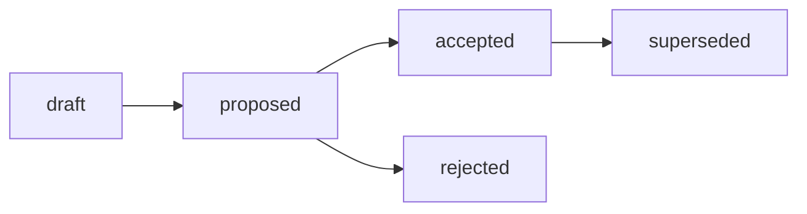

# RFC: Структура Analysis-артефактов — базовый стандарт, профили подтипов и routing

## RFC Metadata

| Field | Value |
| --- | --- |
| Owner | G-Ivan-A |
| RFC status | accepted (narrative summary; машиночитаемый canon — frontmatter `status`) |
| Source issue | [#350](https://github.com/G-Ivan-A/hybrid-Intelligence-lab/issues/350); контекст [#296](https://github.com/G-Ivan-A/hybrid-Intelligence-lab/issues/296), [#342](https://github.com/G-Ivan-A/hybrid-Intelligence-lab/issues/342), [#288](https://github.com/G-Ivan-A/hybrid-Intelligence-lab/issues/288) |
| Impacted artifacts | future `standards/analysis-standard.md` (B-027), future ADR B-026, `docs/analysis/*`, `research/**` (legacy Analysis), `standards/frontmatter-docs-standard.md`, `standards/glossary.md`, `standards/research-standard.md` (routing R/A/A уже задан), `governance/backlog.md`, `governance/artifact-map.md`, `governance/rfc/README.md`, `CHANGELOG.md`, `tools/validate-repository-structure.sh` (постановка на учёт) |
| Decision record | [ADR-005](../../docs/adr/2026-07-adr-005-analysis-structure.md) (B-026, issue [#357](https://github.com/G-Ivan-A/hybrid-Intelligence-lab/issues/357)) — принят Вариант C |
| Implementation link | not yet (future `standards/analysis-standard.md`, B-027) |
| Archetype scope | A (Governance & Knowledge Hub); routing-следствия для B/C/D вынесены в downstream chain |

## Summary

Предлагается базовая модель структуры Analysis-артефактов Хаба: **один базовый
стандарт Analysis** (общий каркас — frontmatter, naming, knowledge-lifecycle,
минимальное ядро секций) плюс **опциональные лёгкие профили подтипов**
(`inventory`, `matrix`, `options`, `recommendation`) как секции этого стандарта,
выделяемые в отдельные файлы только при накоплении operational pain. Канонический
путь размещения — `docs/analysis/YYYY-MM-DD-name.md` (routing уже задан в
[`research-standard.md`](../../standards/research-standard.md)). Analysis получает
frontmatter с relation-метаданными (`source`, `scope`, `based_on`,
`related_artifacts`). Analysis классифицируется по **доминирующей стойке**:
interpretive/causal («что это значит / почему») локального контекста — против
generative («новое внешнее знание») для Research, normative («соответствует ли
норме» + вердикт) для Audit и descriptive («что произошло») для Report.

Это RFC (proposal/rationale, IL-3), а не норма. Decision record делегирован
будущему ADR B-026 (human decision gate), а обязательное правило — будущему
`standards/analysis-standard.md` (B-027). Этот документ **не создаёт** стандарт
Analysis, **не создаёт** ADR, **не мигрирует** файлы и не подменяет собой
делегированные источники. Он опирается на инвентаризацию корпуса
([Analysis inventory](../../docs/analysis/2026-07-02-analysis-artifacts-inventory.md),
B-024), каноническое определение
([glossary](../../standards/glossary.md), B-020), routing R/A/A
([research-standard](../../standards/research-standard.md), B-018), границы
Analysis ↔ Audit
([Audit deep analysis](../../docs/analysis/2026-07-02-audit-artifacts-deep-analysis.md),
B-029) и прецедент Reports
([Reports RFC](2026-07-02-rfc-reports-structure.md), B-041), не воспроизводя их
evidence.

## Motivation

Issue #296 разделило цепочку стандартизации Research / Analysis / Audit на
самостоятельные ветки: Analysis standard **не наследует** Research standard и
**не поглощает** Audit или Report. Перед нормативным `analysis-standard.md`
цепочка `Analysis → RFC → ADR → Standard` требует proposal-stage решения. Входные
данные готовы и их нельзя закрыть точечной правкой:

1. **Корпус инвентаризирован.**
   [Analysis inventory (issue #342, B-024)](../../docs/analysis/2026-07-02-analysis-artifacts-inventory.md)
   просканировал 186 tracked text artifacts по Hub / Mango / Clarify и показал:
   фактических Analysis всего **19 из 186** (10% корпуса). Путь `docs/analysis/`
   не равен типу Analysis — под ним у Mango и Clarify лежат Research, Audit,
   Report и RFC (15 из 21 файла в Mango `docs/analysis/` замаскированы; Clarify
   смешивает sprint execution/kickoff reports). Инвентаризация зафиксировала
   границы Analysis ↔ Research ↔ Audit ↔ Report (B-024 §4) и явно вынесла
   requirements для B-025 (B-024 §7).

2. **Определения и routing уже зафиксированы.**
   [glossary (B-020)](../../standards/glossary.md) даёт каноническое определение
   Analysis («исследование локального или внутреннего контекста без генерации
   нового внешнего знания»), а
   [research-standard (B-018)](../../standards/research-standard.md) §«Маршрутизация
   Research / Analysis / Audit» уже задаёт routing
   `docs/analysis/YYYY-MM-DD-name.md` и content-over-path правило. RFC **не
   переписывает** их, а строит форму артефакта поверх.

3. **Границы уточнены соседними цепочками.**
   [Audit deep analysis (B-029)](../../docs/analysis/2026-07-02-audit-artifacts-deep-analysis.md)
   зафиксировал границу Analysis ↔ Audit (Analysis становится Audit при
   добавлении compliance target и вердиктов), а
   [Reports RFC (B-041)](2026-07-02-rfc-reports-structure.md) — границу Reports ↔
   Analysis (descriptive «что» vs interpretive «почему/что это значит»).

Проблема, требующая proposal-stage решения: если стандартизировать Analysis как
один плоский артефакт, стандарт не даст языка для повторяющихся форм (inventory,
matrix, options), которые уже доминируют в реальном корпусе; если завести Analysis
как подтип Research — стандарт унаследует research-evidence rules и требование
внешних источников, что прямо противоречит определению Analysis (B-024 §7.1); если
оставить Analysis без стандарта (только routing в ADR-002) — не будет контракта
формы для модернизации B-028. Нужно выбрать модель scope, зафиксировать frontmatter
и границы и вынести человеку decision gate (ADR B-026).

Почему текста issue/PR недостаточно: решение фиксирует форму публичного типа
артефакта Хаба и открывает downstream-цепочку B-026..B-028. Такое изменение требует
proposal-stage review с альтернативами, trade-offs и явным decision path до
внедрения (см.
[`standards/rfc-structure-standard.md`](../../standards/rfc-structure-standard.md),
Boundary RFC/ADR). Полная матрица 186 кандидатов **не воспроизводится** здесь — она
делегирована в B-024.

## Goals and Non-goals

**Goals.**

- Предложить базовый стандарт Analysis + опциональные лёгкие профили подтипов
  (`inventory`, `matrix`, `options`, `recommendation`) как выбранную модель scope
  (Вариант C).
- Подтвердить канонический routing `docs/analysis/YYYY-MM-DD-name.md` (уже задан
  research-standard) и правило content-over-path.
- Предложить frontmatter Analysis и relation-метаданные (`source`, `scope`,
  `based_on`, `related_artifacts`).
- Предложить knowledge-lifecycle (`draft → reviewed → canonical → superseded`).
- Зафиксировать границы Analysis ↔ Research ↔ Audit ↔ Report ↔ RFC ↔ ADR
  **ссылкой** на B-024/B-029/B-041/glossary/research-standard (link/cite, не
  restate).
- Дать альтернативы (A/B/C/D), trade-offs и rationale выбора Варианта C.
- Служить входом для человеческого decision gate ADR B-026.

**Non-goals.**

- ❌ Не писать нормативный стандарт Analysis — это B-027.
- ❌ Не создавать ADR внутри RFC — decision record вынесен в ADR B-026.
- ❌ Не выполнять cleanup, миграцию или переименование файлов — это B-028.
- ❌ Не дублировать Research (routing R/A/A, определения) — делегировано в
  research-standard и glossary.
- ❌ Не дублировать инвентаризацию 186 кандидатов B-024 — этот RFC цитирует её.
- ❌ Не дублировать границы Analysis ↔ Audit (B-029) и Analysis ↔ Reports (B-041).
- ❌ Не наследовать Research standard: Analysis — не подкласс Research (B-024 §7.1).
- ❌ Не становиться нормой: даже accepted RFC делегирует обязательное правило в
  active artifact (см. [Governance RFC README](README.md)).

## Proposal

Изложено как decision draft, а не меню вариантов. Меню — в разделе Alternatives.
Формулировки о содержимом будущего стандарта — это **предложение** формы, которую
нормативно закрепит B-027, а не сама норма.

### P1. Базовый стандарт Analysis (общий каркас)

Предлагается один базовый стандарт `standards/analysis-standard.md`, фиксирующий
**общий каркас** interpretation layer:

- **Назначение и стойка.** Analysis — самостоятельный класс по функции
  (interpretation of local/internal context) с доминирующей стойкой interpretive
  /causal («что это значит / какие опции следуют»). Analysis **ссылается и
  цитирует** доказательную базу и соседние артефакты, но **не генерирует новое
  внешнее знание** (это Research) и **не проверяет на норму с вердиктом** (это
  Audit). Определение — каноническое в
  [glossary](../../standards/glossary.md) (B-020), не переписывается здесь.
- **Frontmatter.** Наследует Analysis-профиль
  [`standards/frontmatter-docs-standard.md`](../../standards/frontmatter-docs-standard.md):
  обязательные `status`, `version`, `updated`, `temperature` плюс relation-поля
  (P3).
- **Naming.** `docs/analysis/YYYY-MM-DD-name.md` по
  [`standards/file-naming.md`](../../standards/file-naming.md); routing уже задан
  [`research-standard.md`](../../standards/research-standard.md) (P2).
- **Lifecycle.** Knowledge-словарь статусов (ADR-002): `draft → reviewed →
  canonical → superseded` (P4). Это не governance-словарь RFC/ADR
  (`draft/proposed/accepted/...`): Analysis — knowledge-артефакт (IL-3), а не
  decision record.
- **Минимальное ядро секций** (P6): Summary/BLUF; Context/Scope с обязательными
  дата/автор/источники; Findings/Options (interpretation, не execution log);
  Recommendations; Related Artifacts (ссылки на evidence и parent work).
- **Evidence expectation.** Стандарт требует секцию evidence-ссылок, но **не**
  source-backed research methodology и **не** обязательные внешние источники
  (B-024 §7.3). Analysis может опираться на локальные факты, Research/Audit/Report
  outputs и данные репозитория.

### P2. Routing и канонический путь `docs/analysis/`

- Канонический путь размещения Analysis — **`docs/analysis/YYYY-MM-DD-name.md`**.
  Он **уже нормативно задан** в
  [`research-standard.md`](../../standards/research-standard.md) §«Маршрутизация
  Research / Analysis / Audit» (строка Analysis). Этот RFC его **подтверждает и
  переиспользует**, а не вводит заново — routing R/A/A делегирован в
  research-standard (issue #296 разделила ветки, но не routing).
- **Тип по содержанию, не по каталогу** (content-over-path). Research, Audit или
  Report, спрятанные под `docs/analysis/`, сохраняют фактический тип и
  маршрутизируются по нему (B-024 §3, research-standard §маршрутизация).
  Классификация — по доминирующей стойке (P5).
- **Legacy Analysis в `research/`.** B-024 §2.2 нашёл 6 фактических Analysis под
  Hub `research/`. Это **modernization candidates** для B-028, а не немедленные
  нарушения: «actual Analysis outside path» получает метаданные in place или
  перенос после стандарта и плана миграции (B-024 §7.5).
- **Замаскированные артефакты.** Research/Audit/Report/RFC под `docs/analysis/`
  (особенно Mango и Clarify, B-024 §3) маршрутизируются по **фактическому типу**
  соответствующей цепочкой (Research standard, Audit B-029..B-033, Reports
  B-041..B-044, RFC handling), а не насильно оставляются в Analysis.

### P3. Frontmatter Analysis и relation-метаданные

Предлагаемый frontmatter Analysis-артефакта:

```yaml
---
status: draft            # knowledge: draft | reviewed | canonical | superseded
version: 0.1
updated: YYYY-MM-DD
temperature: 0.1
analysis-subtype: inventory   # inventory | matrix | options | recommendation (опц.)
source: <родительский issue/run или исходный контекст>
scope: <охват: repo | project | ecosystem | slice>
based_on: <артефакты/данные, на которых строится интерпретация или "—">
related_artifacts:
  - <ссылки на evidence, parent work, смежные Analysis/Research/Audit/Report>
---
```

Правила (предложение для B-027):

- Обязательное frontmatter-ядро наследуется из Analysis-профиля
  `frontmatter-docs-standard.md` (`status`/`version`/`updated`/`temperature`).
- `source` / `scope` / `based_on` / `related_artifacts` — relation-метаданные,
  фиксирующие привязку интерпретации к её входам (B-024 §6.2). `source` и `scope`
  обязательны; `based_on` и `related_artifacts` опциональны, но рекомендованы,
  когда Analysis опирается на Research/Audit/Report outputs.
- `analysis-subtype` из фиксированного словаря `inventory | matrix | options |
  recommendation` (опционален; см. P7).
- `ai-generated` во frontmatter **запрещён** (как и для RFC): provenance — в
  issue, PR, changelog.

Relation-словарь **согласован** с Reports RFC (B-041 P4:
`based_on`/`source`/`scope`/`supersedes`/`related_artifacts`), чтобы cross-artifact
метаданные читались единообразно; Analysis не вводит `supersedes` в обязательное
ядро (добавляется только при подтверждённой замене, B-024 §6).

### P4. Lifecycle (knowledge-vocabulary)

Analysis использует knowledge-lifecycle ADR-002, а не governance-словарь RFC/ADR:


- `draft` — черновая интерпретация; `reviewed` — прошла ревью; `canonical` —
  текущий опорный Analysis для своего scope; `superseded` — заменён (с ссылкой на
  замену через `supersedes`/`related_artifacts`).
- Это отличается от lifecycle самого RFC (`draft → proposed → accepted → ...`):
  RFC — decision-proposal, Analysis — knowledge-артефакт.

### P5. Границы Analysis ↔ Research ↔ Audit ↔ Report ↔ RFC ↔ ADR

Границы **фиксируются ссылкой**, а не переписыванием: полные таблицы — в B-024 §4,
B-029 и B-041. Сводно (совместимо с content-over-path, issue #288):

- **Analysis ↔ Research.** Research генерирует новое внешнее/доменное знание
  (source-backed benchmark, гипотеза); Analysis интерпретирует локальный/внутренний
  контекст. Analysis может **цитировать** Research как вход, но **не наследует**
  research-evidence rules и не требует внешних источников
  ([B-024 §4](../../docs/analysis/2026-07-02-analysis-artifacts-inventory.md);
  [glossary](../../standards/glossary.md)).
- **Analysis ↔ Audit.** Audit проверяет соответствие норме/контракту с pass/fail и
  remediation; Analysis объясняет состояние и опции без вердикта. Analysis
  становится Audit при добавлении compliance target и вердиктов
  ([B-029](../../docs/analysis/2026-07-02-audit-artifacts-deep-analysis.md);
  [B-024 §4](../../docs/analysis/2026-07-02-analysis-artifacts-inventory.md)).
- **Analysis ↔ Report.** Report фиксирует «что произошло» (descriptive, execution
  log, kickoff, retrospective); Analysis объясняет, что состояние значит и какие
  опции следуют. Analysis допускает evidence-ссылки на Reports, но не поглощает
  Report-профили
  ([B-041 P5](2026-07-02-rfc-reports-structure.md);
  [B-024 §4](../../docs/analysis/2026-07-02-analysis-artifacts-inventory.md)).
- **Analysis ↔ RFC.** RFC предлагает изменение до decision gate (alternatives +
  acceptance path); Analysis может готовить options и evidence, но proposal с
  decision-альтернативами — это RFC (B-024 §4).
- **Analysis ↔ ADR.** ADR фиксирует принятое решение; Analysis — upstream evidence
  для ADR, но сам не decision record (B-024 §4; ADR-001/ADR-002 — placement/
  lifecycle constraints, не Analysis-примеры).

### P6. Минимальное ядро секций

Базовый стандарт требует минимальное ядро (форма — предложение для B-027):

1. **Summary / BLUF** — вывод интерпретации в одном абзаце.
2. **Context / Scope** — дата, автор, источники, охват (`scope`), что
   интерпретируется.
3. **Findings / Options** — интерпретация локальных фактов, границ и вариантов
   (не execution log, не вердикт).
4. **Recommendations** — что следует из интерпретации (без принятия решения — это
   RFC/ADR).
5. **Related Artifacts** — ссылки на evidence, parent work и смежные артефакты.

Профили подтипов (P7) добавляют обязательное ядро **поверх** этой базы.

### P7. Опциональные профили подтипов (Вариант C: «A сейчас, B потом»)

Подтипы входят как **лёгкие профили-секции** одного базового стандарта, а не как
независимые стандарты. Профиль включается только когда форма реально
повторяется в корпусе (B-024 наблюдает inventory/matrix/options/recommendation как
доминирующие формы Analysis):

| Профиль | Обязательное ядро (сверх базы) | Покрывает |
| --- | --- | --- |
| `inventory` | предмет учёта, охват/снимок, критерии классификации, сводная таблица | сквозные инвентаризации артефактов/корпуса (B-024 сам — inventory Analysis) |
| `matrix` | оси сравнения, критерии, ссылка на воспроизводимый evidence (`exp/`) | сравнительные матрицы кандидатов/вариантов |
| `options` | набор вариантов, критерии сравнения, границы применимости | option analysis без decision gate (вход для RFC) |
| `recommendation` | интерпретация, рекомендация, обоснование, границы | repository-state / recommendation Analysis |

**Триггер B (Anti-Inflation,
[`governance/repo-model.md`](../repo-model.md)).** Профиль выделяется в отдельный
стандарт (`analysis-inventory-standard.md` и т.п.) **только** когда накопит
достаточно собственных обязательных правил или review pain — по тому же принципу,
по которому Хаб откладывает `product-profile`/`education-profile`, а Reports RFC
(B-041) откладывает выделение своих профилей. Это даёт минимальную поверхность
сейчас (как A) и путь к разделению потом (как B).

Ключевой принцип (B-024 §4): «Analysis — interpretation layer». Документ может быть
`inventory analysis` или `options analysis`, но остаётся Analysis по доминирующей
стойке, а не превращается в Research/Audit/Report из-за формы вывода.

## Alternatives

| # | Вариант | Форма | Статус | Почему отклонён / выбран |
| --- | --- | --- | --- | --- |
| A | Один плоский стандарт Analysis, **без** профилей подтипов. | `analysis-standard.md`, подтипы не выделяются. | Отклонён | Проще, но не даёт языка для повторяющихся форм (inventory/matrix/options уже доминируют в корпусе, B-024 §2). При росте формальной специфики файл придётся ретроактивно резать; зеркалит trade-off A vs C из Reports RFC (B-041). |
| B | Analysis как подтип Research (наследование `research-standard.md`). | Analysis-правила — профиль внутри Research standard. | Отклонён | Прямо противоречит issue #296 (ветки самостоятельны) и определению Analysis (B-024 §7.1): наследование навязало бы research-evidence rules и требование внешних источников. Инвентаризация уже показала, что «локальные Analysis прячутся в `research/`» (B-024 §5) — коллапс закрепил бы эту путаницу. |
| C | **Гибрид: базовый стандарт + опциональные профили подтипов**, «A сейчас, B потом» с явным триггером B. | базовый `analysis-standard.md` + лёгкие профили-секции (→ отдельные файлы при росте). | **Рекомендован** | Даёт минимальную поверхность сейчас и шов разделения на будущее; согласован с моделью Reports (B-041 Вариант C) для единообразия цепочек стандартизации; масштабируется под реальные формы Analysis (B-024 §2, §7). |
| D | Analysis без стандарта — только routing в ADR-002. | Никакого `analysis-standard.md`; форма не нормируется. | Отклонён | Оставляет форму артефакта без контракта: модернизация B-028 не сможет опереться на frontmatter/секции, а замаскированные артефакты продолжат «расползаться» (B-024 §5). Routing без формы не закрывает requirements B-024 §7. |

Полная матрица кандидатов и границы — в
[B-024](../../docs/analysis/2026-07-02-analysis-artifacts-inventory.md); здесь
приведена только decision-relevant ветка.

## Trade-offs

- **Координация с Research standard.** Routing R/A/A и определения уже живут в
  `research-standard.md` и glossary. Риск дублирования. Mitigation: RFC
  **делегирует** routing и определения ссылкой и описывает только форму Analysis-
  артефакта, не переписывая маршрутизацию.
- **Координация с Audit standard (B-029..B-033).** Граница Analysis ↔ Audit тонкая
  (compliance target + вердикт). Mitigation: граница зафиксирована ссылкой на B-029
  (P5); Analysis standard не определяет вердикты, checklists и remediation.
- **Координация с Reports standard (B-041..B-044).** Граница Analysis ↔ Report
  (interpretive vs descriptive) и общий relation-словарь. Mitigation: границы и
  словарь согласованы с B-041 ссылкой (P3, P5), а не форком.
- **Legacy файлы в `research/` и `docs/analysis/`.** 6 Analysis под `research/` и
  масса замаскированных артефактов под `docs/analysis/` (B-024 §2, §3). Mitigation:
  миграция вынесена в B-028 после стандарта и плана B-034; RFC не двигает файлы.
- **Дисциплина классификации.** Routing по доминирующей стойке требует осознанного
  выбора на старте. Mitigation: decision-tree по стойке и content-over-path
  наследуются из research-standard; кодифицируются в B-027.
- **Дисциплина триггера B.** Без явного критерия выделения профили-секции
  «расползутся». Mitigation: триггер B кодифицируется в стандарте B-027.
- **Совместимость.** Решение не ломает репозиторий: `docs/analysis/` уже live и
  routing задан research-standard; валидаторы в части Analysis-логики этим RFC не
  меняются (только постановка RFC на учёт).

## Матрица дельт A/B/C/D

Этот RFC имеет `rfc-scope: A`, потому что фиксирует форму базового типа артефакта
Хаба. Матрица показывает, как модель применяется к другим архетипам как downstream
input, а не как немедленная норма.

| Архетип | Required deltas | Avoid |
| --- | --- | --- |
| A. Governance & Knowledge Hub | Принять/отклонить Вариант C, frontmatter + relation-метаданные, knowledge-lifecycle и границы через ADR B-026 и стандарт B-027; подтвердить routing `docs/analysis/` из research-standard. | Не создавать стандарт/ADR в этом RFC, не мигрировать файлы, не наследовать Research standard. |
| B. Prompt & Pattern Library | Использовать базовый Analysis + профили для разбора prompt/pattern корпуса (inventory/matrix/options) с relation-метаданными к исходным экспериментам. | Не заводить отдельный стандарт Analysis на каждый тип prompt-разбора; не превращать experiment log (Report) в Analysis. |
| C. Product Spoke / Runtime | Применять `analysis-subtype` и границу Analysis ↔ Audit к архитектурному/repo-state разбору продукта; ссылаться на runtime evidence, а не поглощать его. | Не смешивать Analysis с audit-вердиктами и execution reports; не навязывать `docs/analysis/` без project-level ADR/standard. |
| D. Education / Learning Package | Использовать recommendation/options профили для разбора учебного корпуса и curriculum-опций. | Не превращать каждый course-review в отдельный стандарт; не RFC-ить отдельные разборы уроков. |

## Critical Analysis

Стресс-тест предложенных границ: каждую гипотезу пытались опровергнуть.

| Гипотеза под атакой | Попытка опровержения | Решение |
| --- | --- | --- |
| Гибрид C лучше плоского A. | A проще и даёт меньше поверхности. | Формы inventory/matrix/options уже доминируют в корпусе (B-024 §2); A потребует ретроактивной резки при росте. C закладывает шов сразу (триггер B). Принято. |
| Analysis — не подтип Research (против B). | Analysis и Research оба «исследуют». | Analysis интерпретирует локальный контекст без нового внешнего знания; наследование навязало бы research-evidence rules (B-024 §7.1, glossary). Принято. |
| Стандарт нужен (против D). | Достаточно routing в ADR-002. | Без контракта формы модернизация B-028 не имеет опоры, а замаскированные артефакты расползаются (B-024 §5). Принято. |
| База + профили не размоет границу с Audit/Report. | `recommendation` близок к Report, `matrix` — к Research evidence. | Классификация по доминирующей стойке (P5); границы делегированы B-029/B-041; профиль описывает форму, не меняет тип. Принято. |
| RFC не избыточен — не «сразу стандарт». | Цепочка длиннее. | Стандарт без принятого rationale = правка без decision gate; альтернативы, trade-offs и human gate (B-026) были бы потеряны. Принято: RFC — обязательный вход (зеркалит Reports/Research RFC). |

Порог уверенности: все принятые решения пережили опровержение с явными,
ограниченными trade-offs. Остаточные вопросы (набор профилей, физический дом legacy
Analysis, пороги триггера B) вынесены в Open Questions как non-blocking для ADR
B-026.

## Impacted Artifacts

Затронутые артефакты (последствия, не правки в этом RFC, если не указано иное):

- future `standards/analysis-standard.md` (B-027) — нормативная форма базы +
  профилей.
- future ADR B-026 — human decision gate; принимает/корректирует эту модель.
- `docs/analysis/*` — существующие Analysis; modernization candidates (B-024 §6).
- `research/**` — legacy Analysis под `research/` (B-024 §2.2); граница без правок.
- `standards/research-standard.md` — источник routing R/A/A (без правок; RFC
  переиспользует).
- `standards/frontmatter-docs-standard.md` — Analysis-профиль frontmatter +
  relation-метаданные (последствие для B-027).
- `standards/glossary.md` — каноническое определение Analysis (без правок; RFC
  цитирует B-020).
- `governance/backlog.md`, `governance/artifact-map.md`,
  [`governance/rfc/README.md`](README.md), `CHANGELOG.md`,
  `tools/validate-repository-structure.sh` — постановка этого RFC на учёт (в этом
  PR).

Последствия для downstream chain (цепочка Analysis зеркалит Research/Reports/Audit):

| Backlog | Что это | Как зависит от этого RFC |
| --- | --- | --- |
| B-024 | analysis: инвентаризация и границы Analysis | Вход этого RFC (границы, scope, requirements). |
| B-025 | rfc: этот документ | Предлагает Вариант C, frontmatter + relation-метаданные, knowledge-lifecycle, границы. |
| B-026 | adr: принятие структуры Analysis | Human decision gate; ссылается на этот RFC. |
| B-027 | standard: `standards/analysis-standard.md` | Нормативно описывает базу + профили; заменяет предложение нормой. |
| B-028 | cleanup: модернизация метаданных и миграция Analysis | Физическая работа после стандарта; координация с планом миграции B-034. |

## Implementation and Validation

В этом PR:

- Создан `governance/rfc/2026-07-02-rfc-analysis-structure.md` (этот документ).
- RFC поставлен на учёт: запись в [Governance RFC README](README.md),
  [`governance/artifact-map.md`](../artifact-map.md), allowlist + required-text в
  `tools/validate-repository-structure.sh`, статус B-025 в
  [`governance/backlog.md`](../backlog.md), запись в `CHANGELOG.md`.

Локальная проверка:

```bash
./tools/validate-frontmatter.sh .
./tools/validate-file-naming.sh
./tools/validate-repository-structure.sh
```

Нормативный enforcement (frontmatter Analysis, профили подтипов, routing
`docs/analysis/`) кодифицируется в стандарте B-027 и валидаторе B-028, не в этом
RFC.

## Lifecycle and Decision Path

Текущее состояние: `accepted` — required-секции полны, локальная валидация
проходит, и решение зафиксировано через ADR B-026 (human decision gate),
[ADR-005](../../docs/adr/2026-07-adr-005-analysis-structure.md). Переход в
`accepted` выполнен ADR-005; до него RFC оставался proposal.



Post-acceptance делегирование: обязательная норма переходит в
`standards/analysis-standard.md` (B-027); решение фиксируется ADR B-026. Этот RFC
сохраняет context, alternatives, trade-offs и rationale; он не дублируется в
стандарте как proposal-обёртка.

## Boundary RFC/ADR

Для цепочки Analysis (B-024..B-028) граница такая:

| Case | Rule for this Analysis-structure change |
| --- | --- |
| Есть открытые альтернативы по scope (A/B/C/D), frontmatter и границам Analysis. | Нужен RFC: этот документ сохраняет rationale, alternatives, trade-offs и rejected options. |
| Человек должен принять/отклонить модель перед появлением нормы. | ADR B-026: короткая запись принятого решения, ссылается на этот RFC. |
| Решение становится обязательным правилом формы и размещения Analysis. | Нужен стандарт B-027, а не расширение этого RFC. |
| Требуется физическая миграция и модернизация метаданных Analysis. | Это implementation follow-up B-028 после human decision и стандарта, не часть RFC. |

Итог: RFC отвечает «какую модель стоит принять?», ADR B-026 — «что принято
человеком?», стандарт B-027 — «как исполнять это правило повторяемо?».

## Open Questions

Только non-blocking вопросы, делегированные в ADR B-026 / стандарт B-027:

1. **Набор профилей подтипов.** Достаточно ли `inventory | matrix | options |
   recommendation`, или корпус потребует иных форм? Делегировано в B-027;
   инвариант: базовый стандарт не зависит от финального набора профилей.
2. **Физический дом legacy Analysis.** 6 Analysis под `research/` (B-024 §2.2):
   метаданные in place или перенос в `docs/analysis/`? Делегировано в план миграции
   B-028/B-034; инвариант: routing `docs/analysis/` каноничен, миграция — после
   стандарта.
3. **Пороги триггера B.** Когда именно профиль выделяется в отдельный стандарт?
   Делегировано в B-027 как anti-inflation criterion (зеркалит Reports Open
   Question 4).
4. **`analysis-subtype` обязателен ли для process outputs?** Делегировано в B-027;
   инвариант: subtype опционален в базе, обязательность — вопрос стандарта.

Ни один из вопросов не блокирует ADR B-026.

## Related Artifacts

- [Issue #350](https://github.com/G-Ivan-A/hybrid-Intelligence-lab/issues/350) —
  источник этого RFC; контекст
  [#296](https://github.com/G-Ivan-A/hybrid-Intelligence-lab/issues/296),
  [#342](https://github.com/G-Ivan-A/hybrid-Intelligence-lab/issues/342),
  [#288](https://github.com/G-Ivan-A/hybrid-Intelligence-lab/issues/288).
- [Analysis inventory and boundaries](../../docs/analysis/2026-07-02-analysis-artifacts-inventory.md) —
  инвентарь 186 кандидатов, границы §4, requirements для B-025 §7 (issue #342, B-024).
- [Analysis inventory evidence](../../research/hub/exp/analysis-inventory-342/) —
  воспроизводимая матрица кандидатов и scan-скрипт.
- [Audit artifacts deep analysis](../../docs/analysis/2026-07-02-audit-artifacts-deep-analysis.md) —
  границы Analysis ↔ Audit (issue #344, B-029).
- [RFC: Структура Reports](2026-07-02-rfc-reports-structure.md) — sibling RFC той же
  цепочки стандартизации; прецедент Варианта C и границы Reports ↔ Analysis (B-041).
- [`standards/glossary.md`](../../standards/glossary.md) — каноническое определение
  Analysis / Research / Audit (B-020).
- [`standards/research-standard.md`](../../standards/research-standard.md) —
  маршрутизация Research / Analysis / Audit и routing `docs/analysis/` (B-018).
- [`standards/rfc-structure-standard.md`](../../standards/rfc-structure-standard.md) —
  стандарт структуры RFC; [`standards/frontmatter-docs-standard.md`](../../standards/frontmatter-docs-standard.md);
  [`standards/file-naming.md`](../../standards/file-naming.md).
- [ADR-002](../../docs/adr/2026-06-adr-002-artifact-document-methodology.md) —
  routing и knowledge-lifecycle артефактов;
  [ADR-003](../../docs/adr/2026-07-adr-003-research-structure.md) — принятая модель
  research.
- [`governance/backlog.md`](../backlog.md) — цепочка B-024..B-028.
