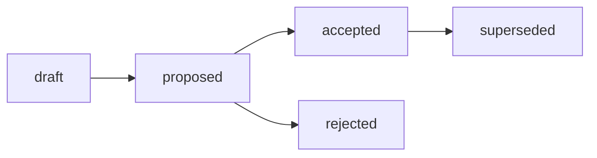

# RFC: Структура Audit-артефактов — базовый стандарт, 4-компонентная модель и разграничение процесс/output

## RFC Metadata

| Field | Value |
| --- | --- |
| Owner | G-Ivan-A |
| RFC status | draft (narrative summary; машиночитаемый canon — frontmatter `status`) |
| Source issue | [#352](https://github.com/G-Ivan-A/hybrid-Intelligence-lab/issues/352); контекст [#296](https://github.com/G-Ivan-A/hybrid-Intelligence-lab/issues/296), [#344](https://github.com/G-Ivan-A/hybrid-Intelligence-lab/issues/344), [#290](https://github.com/G-Ivan-A/hybrid-Intelligence-lab/issues/290), [#288](https://github.com/G-Ivan-A/hybrid-Intelligence-lab/issues/288) |
| Impacted artifacts | future `standards/audit-standard.md` (B-032), future ADR audit-structure (B-031), future `standards/report-standard.md` (B-043, audit-report profile), `docs/audit/*`, замаскированные Audit под `docs/analysis/` и `research/` (из B-029), `standards/frontmatter-docs-standard.md`, `standards/glossary.md`, `governance/backlog.md` (регистрация и lifecycle updates) |
| Decision record | not yet (future ADR audit-structure, B-031) |
| Implementation link | not yet (future `standards/audit-standard.md`, B-032) |
| Archetype scope | A (Governance & Knowledge Hub); routing-следствия для B/C/D вынесены в downstream chain |

## Summary

Предлагается базовая модель структуры Audit-артефактов Хаба: **один базовый
стандарт Audit** с явной **4-компонентной моделью процесса** (compliance target /
evidence model / verdict-finding / deviation handling) плюс **разграничение
Audit-процесс vs audit-report output**. Audit — это не жанр документа, а
процесс/стойка (normative: «соответствует ли норме» + вердикт); audit-report —
durable output этого процесса, форму которого нормирует профиль Reports (B-043).
Канонический путь размещения — `docs/audit/YYYY-MM-DD-name.md` (уже
зафиксирован в `research-standard.md` и ADR-002, дрейфа пути нет). Audit получает
frontmatter с audit-specific метаданными (`audit_target`, `evidence_model`,
`verdict` — обязательны; `severity_scale`, `follow_up`, `related_norm` —
опциональны) и relation-метаданными (`source`, `scope`, `based_on`,
`related_artifacts`).

Это RFC (proposal/rationale, IL-3), а не норма. Decision record — future ADR
(B-031), а обязательное правило делегировано будущему
`standards/audit-standard.md` (B-032). Этот документ **не создаёт** стандарт
Audit, **не мигрирует** файлы и **не дублирует** inventory 29 кандидатов, границы
и masked-audit анализ — они делегированы в
[Audit deep analysis (B-029)](../../docs/analysis/2026-07-02-audit-artifacts-deep-analysis.md).
Он опирается на эту углублённую аналитику и на каноническое определение Audit в
[glossary](../../standards/glossary.md), не воспроизводя их evidence.

## Motivation

Issue #296 разделило Research, Analysis и Audit на отдельные ветки
стандартизации. Три задачи уже подготовили входные данные, которые нельзя закрыть
точечной правкой:

1. **Каноническое определение и routing зафиксированы.**
   [glossary](../../standards/glossary.md) (B-020) определяет Audit как проверку
   текущего состояния на соответствие существующему standard/contract/checklist,
   а [research-standard.md](../../standards/research-standard.md) (B-018) уже
   задаёт routing Research / Analysis / Audit по типу задачи и канонический путь
   `docs/audit/YYYY-MM-DD-name.md`. Определения и routing R/A/A **не
   переписываются** здесь — они делегированы.

2. **Корпус углублённо проанализирован.**
   [Audit deep analysis (B-029)](../../docs/analysis/2026-07-02-audit-artifacts-deep-analysis.md)
   рассмотрел 29 Audit-кандидатов (8 Hub / 14 Mango / 7 Clarify) на фиксированных
   snapshot'ах, для каждого зафиксировал compliance target, Audit-процесс vs
   audit-report output, evidence model и deviation handling; выявил замаскированные
   Audit (6 файлов под `docs/analysis/`, legacy под `research/`) и зафиксировал
   границы Audit ↔ Research ↔ Analysis ↔ Report. Ключевой вывод B-029 (§8):
   **самое стабильное ядро Audit — не путь `docs/audit/`, а 4-компонентная
   модель** (compliance target / evidence model / verdict-finding / deviation
   handling).

3. **Прецедент Reports задал границу.**
   [RFC Reports (B-041)](2026-07-02-rfc-reports-structure.md) предложил профиль
   `audit-report` как форму durable-выхода, но явно **не подменяет** Audit-процесс
   и **не задаёт** Audit-норму: «Report — output shape; Audit — process/stance».
   Границы Reports ↔ Audit делегированы туда.

Проблема, требующая proposal-stage решения: если нормировать Audit как один
плоский «отчёт», стандарт потеряет процессную семантику (норма/вердикт/
remediation) и начнёт конфликтовать с профилем audit-report в Reports (B-043);
если свести Audit к подтипу Analysis или Report — стойка normative («соответствует
ли норме» + вердикт) растворится в causal (Analysis) или descriptive (Report).
Нужно выбрать модель scope между вариантами, зафиксировать 4-компонентную модель,
routing, frontmatter и границу процесс/output, и вынести человеку decision gate.

Почему текста issue/PR недостаточно: решение вводит нормативную семантику нового
класса артефактов (Audit-процесс) и координацию с уже принятым ADR-004 (Reports)
и будущим стандартом Reports (B-043), открывает downstream-цепочку B-031..B-033.
Такое изменение требует proposal-stage review с альтернативами, trade-offs и явным
decision path до внедрения (см.
[`standards/rfc-structure-standard.md`](../../standards/rfc-structure-standard.md),
Boundary RFC/ADR). Полная матрица 29 кандидатов и границы **не воспроизводятся**
здесь — они делегированы в B-029.

## Goals and Non-goals

**Goals.**

- Предложить базовый стандарт Audit + явную **4-компонентную модель** (compliance
  target / evidence model / verdict-finding / deviation handling) как выбранную
  модель scope (Вариант C).
- Предложить frontmatter Audit с audit-specific метаданными (`audit_target`,
  `evidence_model`, `verdict` обязательны; `severity_scale`, `follow_up`,
  `related_norm` опциональны) и relation-метаданными.
- Подтвердить канонический routing `docs/audit/YYYY-MM-DD-name.md` (уже live; без
  ADR-002-дрейфа, в отличие от Reports).
- Разграничить **Audit-процесс** (процессная семантика: норма + вердикт +
  remediation) vs **audit-report output** (durable форма), координируя с профилем
  Reports (B-043).
- Зафиксировать границы Audit ↔ Research ↔ Analysis ↔ Report **ссылкой** на B-029,
  а не переписыванием.
- Дать альтернативы (A/B/C/D), trade-offs и rationale выбора Варианта C.
- Служить входом для человеческого decision gate (future ADR, B-031).

**Non-goals.**

- ❌ Не писать нормативный стандарт Audit — это B-032.
- ❌ Не создавать ADR внутри RFC — decision record вынесен в future ADR (B-031).
- ❌ Не создавать директории и не мигрировать/переименовывать файлы — это B-033.
- ❌ Не дублировать Research (routing R/A/A, определения) — делегировано в
  `research-standard.md` и `glossary.md`.
- ❌ Не дублировать Analysis B-024 (инвентаризацию 186 кандидатов) — делегировано.
- ❌ Не дублировать Audit B-029 (матрицу 29 кандидатов, masked audits, границы) —
  этот RFC цитирует B-029, а не переписывает его.
- ❌ Не подменять будущий Reports standard (B-043): профиль audit-report описывает
  только форму выхода; Audit standard описывает процессную семантику.
- ❌ Не становиться нормой: даже accepted RFC делегирует обязательное правило в
  active artifact (см. [Governance RFC README](README.md)).

## Proposal

Изложено как decision draft, а не меню вариантов. Меню — в разделе Alternatives.
Формулировки о содержимом будущего стандарта — это **предложение** формы, которую
нормативно закрепит B-032, а не сама норма.

### P1. Базовый стандарт Audit — 4-компонентная модель

Предлагается один базовый стандарт `standards/audit-standard.md`, ядром которого
является **4-компонентная модель Audit-процесса** (источник — B-029 §2, §8). Audit
возникает не из имени файла и не из каталога, а из связки всех четырёх компонентов:

| # | Компонент | Что фиксирует | Примеры (из B-029) |
| --- | --- | --- | --- |
| 1 | **Compliance target** | Явная или реконструируемая норма, против которой проверяют: standard, ADR, RFC, contract, checklist, issue DoD, release gate или утверждённый критерий. | contract из `research-profile.md`; ADR-011/ADR-012 taxonomy; `runs/CONTRACT.md`; MVP/ADR risk. |
| 2 | **Evidence model** | Тип доказательств: воспроизводимые проверки, вывод валидатора, script output, manual/expert review, reproducible run, screenshot, log, matrix. | validator-style checks; blind AI mapping; `pytest`/E2E; Playwright screenshots. |
| 3 | **Verdict / finding** | Вердикт и findings: pass/fail/blocked/conditional, severity (critical/major/minor/info), gap, drift, risk, readiness decision. | 68 findings с Critical/Major/Minor/Info; P0/P1=0 → deploy allowed; not-ready verdict. |
| 4 | **Deviation handling** | Обработка отклонения: severity, follow-up issue, remediation, exception, acceptance decision или explicit no-op. | follow-up issue #208; remediation-рекомендации; conditional approve. |

**Стойка.** Audit — самостоятельный класс по стойке: normative («соответствует ли
норме» + вердикт). Она отличается от descriptive Report («что») и causal Analysis
(«почему») — граница делегирована в
[B-029 §5](../../docs/analysis/2026-07-02-audit-artifacts-deep-analysis.md). Если
нет нормы и вердикта — это Research (внешнее знание) или Analysis (локальный
контекст), даже при размещении в `docs/audit/`; и наоборот, проверка на норму с
findings — это Audit, даже если файл лежит в `docs/analysis/` (content-over-path,
issue #288).

### P2. Routing и канонический путь `docs/audit/`

- Канонический путь размещения Audit-артефактов —
  **`docs/audit/YYYY-MM-DD-name.md`**. В отличие от Reports (где был дрейф
  `docs/report/` vs `docs/reports/`), путь Audit **уже консистентен**: он
  зафиксирован в
  [research-standard.md](../../standards/research-standard.md) (routing R/A/A) и в
  [ADR-002](../../docs/adr/2026-06-adr-002-artifact-document-methodology.md). ADR-002-реконсиляция
  routing **не требуется** — это ключевое отличие цепочки Audit от цепочки Reports.
- **Тип по содержанию, не по каталогу** (content-over-path, issue #288). Audit,
  спрятанный под `docs/analysis/` или `research/`, остаётся Audit; классификация —
  по 4-компонентной модели (P1), а не по директории. Конкретные masked-audit
  кандидаты — в [B-029 §4](../../docs/analysis/2026-07-02-audit-artifacts-deep-analysis.md);
  RFC их не перечисляет.
- **Физический дом audit reports.** Профиль audit-report (Reports, B-043) фиксирует
  тег `report-subtype: audit` независимо от итогового пути. Координация физического
  размещения `docs/audit/` vs `docs/report/` вынесена в Open Questions как
  non-blocking (см. также
  [RFC Reports P3](2026-07-02-rfc-reports-structure.md)).

### P3. Frontmatter Audit

Предлагаемый frontmatter Audit-артефакта:

```yaml
---
status: draft            # knowledge: draft | reviewed | canonical | superseded
version: 0.1
updated: YYYY-MM-DD
temperature: 0.1
audit_target: <норма/контракт/checklist>       # обязательно (компонент 1)
evidence_model: <тип доказательств>            # обязательно (компонент 2)
verdict: pass            # обязательно (компонент 3): pass | fail | blocked | conditional
severity_scale: <шкала severity или "—">       # опц. (напр. critical/major/minor/info)
follow_up: <follow-up issue / remediation plan> # опц. (компонент 4)
related_norm: <связанные нормы/стандарты>       # опц.
source: <родительский issue/run или работа>     # relation
scope: <охват: repo | project | ecosystem | slice>  # relation
based_on: <норма/контракт, против которой проверяли или "—">  # relation
related_artifacts:
  - <ссылки на evidence, parent work, смежные Audit/Report>
---
```

Правила (предложение для B-032):

- Обязательное frontmatter-ядро наследуется из
  [`standards/frontmatter-docs-standard.md`](../../standards/frontmatter-docs-standard.md)
  (`status`/`version`/`updated`/`temperature`).
- **Audit-specific обязательные:** `audit_target`, `evidence_model`, `verdict` —
  прямая проекция компонентов 1–3 модели P1; без них артефакт не является полным
  Audit-report.
- **Audit-specific опциональные:** `severity_scale`, `follow_up`, `related_norm`.
  `follow_up` — проекция компонента 4 (deviation handling); при `verdict: fail` или
  `conditional` follow-up SHOULD присутствовать.
- **Relation-метаданные:** `source`, `scope`, `based_on`, `related_artifacts` —
  привязка к родительской работе и evidence.
- `ai-generated` во frontmatter **запрещён** (как и для RFC): provenance — в issue,
  PR, changelog, session record.

### P4. Lifecycle

Audit — knowledge-артефакт (IL-3), а не decision record, поэтому использует
**knowledge-словарь** статусов (ADR-002): `draft → reviewed → canonical →
superseded`. Это не governance-словарь RFC/ADR (`draft/proposed/accepted/...`).
Один Audit `superseded` другим Audit (re-audit) должен нести ссылку на замену.

### P5. Разграничение Audit-процесс vs audit-report output

Это центральное отличие цепочки Audit от Reports и должно быть зафиксировано
нормативно (B-032) с координацией к B-043:

| Аспект | Audit-процесс (Audit standard, B-032) | Audit-report output (Reports profile, B-043) |
| --- | --- | --- |
| Что описывает | Процессную семантику: норму, evidence, вердикт, remediation (4-компонентная модель) | Форму durable-выхода: frontmatter формы отчёта, разделы, lifecycle, размещение |
| Стойка | normative (проверка на норму + вердикт) | output shape (record of results) |
| Кто задаёт норму Audit | Audit standard / конкретный contract/checklist / связанный ADR/RFC | ❌ НЕ Reports standard (B-029 §2.2) |
| Владелец правила | B-032 | B-043 |

**Координация (без дублирования):** Audit standard описывает **процессную
семантику** (что является нормой, какой evidence достаточен, как обрабатывать
отклонение); Reports standard описывает **форму выхода** (audit-report profile).
Reports **не становится** родительским концептом Audit
([B-029 §5.3](../../docs/analysis/2026-07-02-audit-artifacts-deep-analysis.md);
[RFC Reports P5](2026-07-02-rfc-reports-structure.md)).

### P6. Минимальное ядро секций Audit-report

Предложение минимального ядра секций (нормативно закрепит B-032):

- **Summary / BLUF** — вердикт и ключевые findings в одном абзаце.
- **Scope / Target** — что проверяем и против какой нормы (компонент 1).
- **Method / Evidence** — как проверяли, какие доказательства (компонент 2).
- **Findings / Verdict** — что нашли, severity, вердикт (компонент 3).
- **Remediation / Deviation** — что делать с отклонениями, follow-up (компонент 4).
- **Related Artifacts** — норма, evidence, parent work, смежные Audit/Report.

Каждая секция — прямая проекция одного из четырёх компонентов + якорь-контекст, что
делает 4-компонентную модель проверяемой по структуре документа.

## Alternatives

| # | Вариант | Форма | Статус | Почему отклонён / выбран |
| --- | --- | --- | --- | --- |
| A | Один плоский стандарт Audit **без** разграничения process/output. | `audit-standard.md` описывает и процесс, и форму отчёта в одном слое, без шва к Reports. | Отклонён | Смешивает процессную семантику (норма/вердикт/remediation) с output shape; неизбежно продублирует профиль audit-report из Reports (B-043) и создаст competing source для формы отчёта (B-029 §2.2, §5.3). |
| B | Audit как подтип Analysis (наследование от analysis-standard). | Audit нормируется будущим Analysis standard (B-025) как секция. | Отклонён | Коллапс стоек: normative Audit («соответствует ли норме» + вердикт) ≠ causal Analysis («почему»). B-029 §5.1 и glossary разграничивают их наличием нормы и pass/fail/finding; masked audits под `docs/analysis/` — как раз симптом такого коллапса, а не аргумент за него. |
| C | **Базовый стандарт Audit + 4-компонентная модель + разграничение process/output.** | `audit-standard.md` с ядром target/evidence/verdict/deviation; форма отчёта делегирована профилю Reports (B-043). | **Рекомендован** | Совпадает с самым стабильным ядром B-029 (§8): Audit определяется 4-компонентной моделью, а не путём; чёткий шов к Reports (процесс vs output); масштабируется и готов к ADR (B-031). |
| D | Audit как подтип Report (нормировать только output shape). | Audit-выходы нормируются только Reports standard (B-043) как `report-subtype: audit`. | Отклонён | Теряется процессная семантика: Reports нормирует форму, но не норму проверки и не remediation-модель (B-029 §2.2). Reports стал бы родителем Audit, что прямо запрещено границей Reports ↔ Audit ([RFC Reports P5](2026-07-02-rfc-reports-structure.md)). |

Полная матрица 29 кандидатов, masked audits и границы — в
[B-029](../../docs/analysis/2026-07-02-audit-artifacts-deep-analysis.md); здесь
приведена только decision-relevant ветка выбора модели scope.

## Trade-offs

- **Координация с Reports audit profile (B-043).** Audit standard описывает
  процесс, Reports standard — output shape; они живут рядом. Риск размытия границы.
  Mitigation: явная таблица разграничения (P5); норма Audit приходит только из
  Audit standard/contract, не из Reports (B-029 §2.2).
- **Граница Audit vs audit-report.** Процесс vs output легко смешать: один документ
  часто и «проводит» аудит, и является его отчётом. Mitigation: 4-компонентная
  модель (P1) фиксирует процессную семантику независимо от того, где живёт durable
  output; frontmatter (P3) делает компоненты машиночитаемыми.
- **Дисциплина классификации (content-over-path).** Routing по стойке требует
  осознанного выбора: замаскированные Audit под `docs/analysis/`/`research/`
  (B-029 §4) остаются Audit по содержанию. Mitigation: 4-компонентный decision-gate
  в будущем стандарте; RFC не переносит файлы (это B-033).
- **Legacy файлы.** Audit-titled файлы в `research/` и masked audits в
  `docs/analysis/` — миграция и модернизация метаданных отложены в B-033 (после
  стандарта). RFC их не трогает.
- **Evidence/statistics output ≠ audit-report.** Сгенерированные матрицы/scan
  output (B-029 §2.3, §5.4) полезны как evidence, но сами не задают remediation.
  Mitigation: такие артефакты сохраняются как evidence links, а не форсируются в
  audit-report форму (делегировано в B-033).
- **4-компонентная модель обязательна для Audit, но не для всех Report-подтипов.**
  Профиль `report`/`statistics` в Reports не обязан нести `audit_target`/`verdict`.
  Mitigation: обязательность target/evidence/verdict — только для Audit-профиля.
- **Совместимость.** Решение не ломает репозиторий: `docs/audit/` уже live и
  консистентен; валидаторы в части Audit-логики в этом RFC не меняются; ADR-004
  (Reports) не затрагивается по существу — только цитируется граница.

## Матрица дельт A/B/C/D

Этот RFC имеет `rfc-scope: A`, потому что вводит процессную семантику нового класса
артефактов Хаба. Матрица фиксирует, как модель применяется к другим архетипам как
downstream input, а не как немедленная норма.

| Архетип | Required deltas | Avoid |
| --- | --- | --- |
| A. Governance & Knowledge Hub | Принять/отклонить Вариант C, 4-компонентную модель, frontmatter Audit и разграничение process/output через ADR (B-031) и стандарт B-032; закрепить границу к Reports (B-043). | Не создавать стандарт/ADR в этом RFC, не мигрировать файлы, не подменять профиль audit-report из Reports. |
| B. Prompt & Pattern Library | Использовать 4-компонентную модель для conformance-проверок prompt/pattern против eval-контрактов (audit target = eval rubric; evidence = eval run; verdict = pass/fail). | Не путать eval-report (descriptive) с prompt-audit (normative); не заводить отдельный audit-стандарт на каждый prompt-эксперимент. |
| C. Product Spoke / Runtime | Применять модель к release/verification/readiness audits (audit target = release gate; evidence = pytest/E2E/smoke; verdict = ready/not-ready) с follow-up issue. | Не смешивать verification-report shape с процессной семантикой Audit; не навязывать `docs/audit/` без project-level ADR/standard. |
| D. Education / Learning Package | Использовать Audit для проверки учебных материалов на норму курса (audit target = curriculum/assessment standard; verdict + remediation). | Не превращать каждый lesson-review в отдельный Audit; не RFC-ить отдельные проверки уроков. |

## Critical Analysis

Стресс-тест предложенных границ: каждую гипотезу пытались опровергнуть.

| Гипотеза под атакой | Попытка опровержения | Решение |
| --- | --- | --- |
| 4-компонентная модель — правильное ядро Audit. | Ядром можно считать путь `docs/audit/` или наличие слова «audit». | B-029 §8: самое стабильное ядро — не путь и не имя, а связка target/evidence/verdict/deviation; masked audits под `docs/analysis/` подтверждают, что путь ненадёжен. Принято. |
| Вариант C лучше плоского A. | A проще — один стандарт на всё. | A продублирует профиль audit-report из Reports и создаст competing source для формы отчёта; C даёт чистый шов процесс/output. Принято (B-029 §2.2, §5.3). |
| Audit — не подтип Analysis (против B) и не подтип Report (против D). | Executive summary в Analysis и audit-report в Reports «выглядят как аудит». | Стойка решает: normative ≠ causal ≠ descriptive; Reports нормирует форму, но не норму/вердикт/remediation (B-029 §5). Принято. |
| Разграничение process/output не размоет границу с Reports. | Профиль audit-report может подменить Audit standard. | Норма Audit приходит только из Audit standard/contract; Reports описывает лишь output shape; таблица P5 фиксирует владельцев правил. Принято. |
| ADR-002-реконсиляция пути не нужна. | А вдруг есть дрейф, как у Reports? | Проверено: `docs/audit/` уже канонический в research-standard.md и ADR-002; дрейфа нет. Реконсиляция не требуется. Принято. |
| RFC не избыточен — не «сразу стандарт». | Цепочка длиннее. | Стандарт без принятого rationale = правка без decision gate; альтернативы, trade-offs и human gate (B-031) были бы потеряны. Принято: RFC — обязательный вход (зеркалит цепочки Research/Reports). |

Порог уверенности: все принятые решения пережили опровержение с явными,
ограниченными trade-offs. Остаточные вопросы (физический дом audit reports,
судьба evidence/statistics output, модернизация legacy) вынесены в Open Questions
как non-blocking.

## Impacted Artifacts

Затронутые артефакты (последствия, не правки в этом RFC, если не указано иное):

- future `standards/audit-standard.md` (B-032) — нормативная форма 4-компонентной
  модели, frontmatter и границы.
- future ADR audit-structure (B-031) — human decision gate.
- future `standards/report-standard.md` (B-043) — координация профиля audit-report
  (форма выхода) с процессной семантикой Audit.
- `docs/audit/*` — существующие Audit-report exemplars; модернизация метаданных
  (B-033).
- Замаскированные Audit под `docs/analysis/` и legacy под `research/` — routing по
  фактическому типу; конкретный список в
  [B-029 §4](../../docs/analysis/2026-07-02-audit-artifacts-deep-analysis.md) (без
  правок в этом RFC).
- `standards/frontmatter-docs-standard.md` — Audit-профиль frontmatter +
  audit-specific метаданные (последствие для B-032).
- `standards/glossary.md` — термин Audit уже канонизирован (B-020); RFC цитирует,
  не переписывает.
- `governance/backlog.md`, `governance/artifact-map.md`,
  [`governance/rfc/README.md`](README.md), `CHANGELOG.md`,
  `tools/validate-repository-structure.sh` — постановка этого RFC на учёт (в этом
  PR).

Последствия для downstream chain (цепочка Audit зеркалит Research/Reports):

| Backlog | Что это | Как зависит от этого RFC |
| --- | --- | --- |
| B-029 | analysis: сквозной анализ 29 Audit-кандидатов | Вход этого RFC (4-компонентная модель, границы, masked audits). |
| B-030 | rfc: этот документ | Предлагает Вариант C, 4-компонентную модель, frontmatter, routing и границу process/output. |
| B-031 | adr: принятие структуры Audit | Human decision gate; ссылается на этот RFC. |
| B-032 | standard: `standards/audit-standard.md` | Нормативно фиксирует базу + 4-компонентную модель; заменяет предложение нормой. |
| B-033 | cleanup: модернизация метаданных и routing Audit-артефактов | Физическая работа после стандарта; координация с планом миграции B-034. |

## Implementation and Validation

В этом PR:

- Создан `governance/rfc/2026-07-02-rfc-audit-structure.md` (этот документ).
- RFC поставлен на учёт: запись в [Governance RFC README](README.md),
  [`governance/artifact-map.md`](../artifact-map.md), allowlist + required-text в
  `tools/validate-repository-structure.sh`, статус B-030 → `review` в
  [`governance/backlog.md`](../backlog.md), запись в `CHANGELOG.md`.

Локальная проверка:

```bash
./tools/validate-frontmatter.sh .
./tools/validate-file-naming.sh
./tools/validate-repository-structure.sh
```

Нормативный enforcement (frontmatter Audit, 4-компонентная модель, границы
process/output) кодифицируется в стандарте B-032 и валидаторе после B-033, не в
этом RFC.

## Lifecycle and Decision Path

Текущее состояние: `draft`. Переход к `proposed` — когда все обязательные секции
готовы и локальная валидация проходит; переход к `accepted` — только через future
ADR (B-031), фиксирующий human decision gate.



Post-acceptance делегирование: обязательная норма переходит в
`standards/audit-standard.md` (B-032); модернизация метаданных и routing legacy —
в B-033. Этот RFC сохраняет context, alternatives, trade-offs и rationale; он не
дублируется в стандарте как proposal-обёртка.

## Boundary RFC/ADR

Для цепочки Audit (B-029, B-030..B-033) граница такая:

| Case | Rule for this Audit-structure change |
| --- | --- |
| Есть открытые альтернативы по модели (A/B/C/D), границе process/output и frontmatter. | Нужен RFC: этот документ сохраняет rationale, alternatives, trade-offs и rejected options. |
| Человек должен принять/отклонить модель перед появлением нормы. | Future ADR (B-031): короткая запись принятого решения, ссылается на этот RFC. |
| Решение становится обязательным правилом формы и процесса Audit. | Нужен стандарт B-032, а не расширение этого RFC. |
| Требуется физическая миграция и модернизация метаданных Audit. | Это implementation follow-up B-033 после human decision и стандарта, не часть RFC. |

Итог: RFC отвечает «какую модель стоит принять?», ADR (B-031) — «что принято
человеком?», стандарт B-032 — «как исполнять это правило повторяемо?».

## Open Questions

Только вопросы, блокирующие/уточняющие acceptance (все — non-blocking для этого
proposal-этапа; закрываются в ADR B-031 или делегируются в B-032/B-033):

1. **Физический дом audit reports** (`docs/audit/` vs `docs/report/` с
   `report-subtype: audit`) — делегировано в координацию B-032 ↔ B-043; инвариант:
   4-компонентная модель фиксирует Audit-стойку независимо от итогового пути.
2. **Судьба evidence/statistics output** (B-029 §2.3, §5.4) — сохранять как
   evidence links, а не форсировать в audit-report форму; операционное правило —
   в B-032/B-033.
3. **Модернизация legacy** (`_v1`, `#`-имена, masked audits) — делегировано в
   B-033 после того, как стандарт определит required compatibility behavior.
4. **Governance-audits Mango** (`governance/audit-*.md`) — relation-метаданные vs
   merge; решается в B-033, не удаляется до стандарта (B-029 §6).

## Related Artifacts

- [Issue #352](https://github.com/G-Ivan-A/hybrid-Intelligence-lab/issues/352) —
  источник этого RFC; контекст
  [#296](https://github.com/G-Ivan-A/hybrid-Intelligence-lab/issues/296),
  [#344](https://github.com/G-Ivan-A/hybrid-Intelligence-lab/issues/344),
  [#290](https://github.com/G-Ivan-A/hybrid-Intelligence-lab/issues/290),
  [#288](https://github.com/G-Ivan-A/hybrid-Intelligence-lab/issues/288).
- [Audit deep analysis (B-029)](../../docs/analysis/2026-07-02-audit-artifacts-deep-analysis.md) —
  29 кандидатов, 4-компонентная модель §2/§8, masked audits §4, границы §5, B-033
  candidates §6 (issue #344).
- [Analysis artifacts inventory (B-024)](../../docs/analysis/2026-07-02-analysis-artifacts-inventory.md) —
  инвентаризация 186 артефактов (вход B-029).
- [`standards/glossary.md`](../../standards/glossary.md) — каноническое
  определение Audit (B-020).
- [`standards/research-standard.md`](../../standards/research-standard.md) —
  routing Research / Analysis / Audit и канонический путь `docs/audit/` (B-018).
- [ADR-002](../../docs/adr/2026-06-adr-002-artifact-document-methodology.md) —
  routing и knowledge-lifecycle артефактов.
- [ADR-003](../../docs/adr/2026-07-adr-003-research-structure.md) — принятая
  модель research (контейнер `exp/`, routing R/A/A).
- [RFC: Структура Reports](2026-07-02-rfc-reports-structure.md) (B-041) — прецедент
  RFC и граница Reports ↔ Audit (профиль audit-report описывает форму выхода).
- [`standards/rfc-structure-standard.md`](../../standards/rfc-structure-standard.md) —
  стандарт структуры RFC; [`standards/frontmatter-docs-standard.md`](../../standards/frontmatter-docs-standard.md);
  [`standards/file-naming.md`](../../standards/file-naming.md).
- [`governance/backlog.md`](../backlog.md) — цепочка B-029, B-030..B-033.
