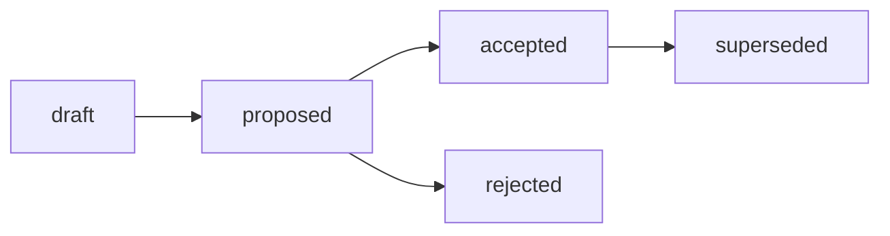

# RFC: Структура Reports-артефактов — базовый стандарт, профили подтипов и routing

## RFC Metadata

| Field | Value |
| --- | --- |
| Owner | G-Ivan-A |
| RFC status | draft (narrative summary; машиночитаемый canon — frontmatter `status`) |
| Source issue | [#328](https://github.com/G-Ivan-A/hybrid-Intelligence-lab/issues/328); контекст [#310](https://github.com/G-Ivan-A/hybrid-Intelligence-lab/issues/310), [#307](https://github.com/G-Ivan-A/hybrid-Intelligence-lab/issues/307), [#288](https://github.com/G-Ivan-A/hybrid-Intelligence-lab/issues/288) |
| Impacted artifacts | future `standards/report-standard.md` (B-043), future ADR Reports (B-042), `docs/adr/2026-06-adr-002-artifact-document-methodology.md` (реконсиляция routing `docs/reports/` → `docs/report/`), `docs/report/*`, `docs/audit/*`, `standards/frontmatter-docs-standard.md`, `standards/glossary.md`, `governance/backlog.md` (последствия, не правки в этом RFC, кроме постановки на учёт) |
| Decision record | not yet (future ADR, B-042) |
| Implementation link | not yet (future `standards/report-standard.md`, B-043) |
| Archetype scope | A (Governance & Knowledge Hub); routing-следствия для B/C/D вынесены в downstream chain |

## Summary

Предлагается базовая модель структуры Reports-артефактов Хаба: **один базовый
стандарт Report** (общий каркас — frontmatter, naming, lifecycle, evidentiary
stance) плюс **три лёгких профиля подтипов** (`audit`, `report`, `statistics`)
как секции этого стандарта. Канонический путь размещения — `docs/report/`
(единственное число). Reports получают frontmatter с relation-метаданными
(`based_on`, `source`, `scope`, `supersedes`, `related_artifacts`) и
опциональным `report-subtype`. Reports классифицируются по **доминирующей
стойке**: descriptive («что») для Report против causal («почему») для Analysis и
normative («соответствует ли норме» + вердикт) для Audit.

Это RFC (proposal, IL-3), а не норма. Он — вход для будущего ADR (B-042, human
decision gate) и `standards/report-standard.md` (B-043). Этот документ **не
создаёт** стандарт Report, **не создаёт** ADR, **не мигрирует** файлы и **не
финализирует** реконсиляцию `docs/report/` ↔ `docs/reports/`: последнее — решение
будущего ADR. Он опирается на исследование индустриальных норм
([Reports industry norms](../../research/hub/2026-06-30-reports-industry-norms-and-standardization-scope.md))
и инвентаризацию корпуса
([Reports inventory](../../docs/analysis/2026-07-01-reports-artifacts-inventory.md)),
не воспроизводя их evidence.

## Motivation

В видении фаундера §3
([research/hub/2026-06-23-repository-structure-concept.md](../../research/hub/2026-06-23-repository-structure-concept.md))
Reports выделены как отдельный тип артефактов с подтипами `аудит / отчёт /
статистика` и целевым базовым размещением в `docs/report/`. Две задачи уже
подготовили входные данные, которые нельзя закрыть точечной правкой:

1. **Индустриальные нормы исследованы.**
   [Research (issue #307)](../../research/hub/2026-06-30-reports-industry-norms-and-standardization-scope.md)
   показал: единого «стандарта Reports вообще» в индустрии нет — нормы
   доменно-специфичны (ISO 19011/ISA 700 для аудита, ANSI/NISO Z39.18 и ГОСТ 7.32
   для общего отчёта, SDMX/DDI для статистики), но они тяжёлые, а доминирующий
   масштабируемый паттерн — «базовая структура + специализация» (Research §2.1,
   §11). Рекомендация исследования — Вариант C.

2. **Корпус инвентаризирован.**
   [Analysis (issue #310)](../../docs/analysis/2026-07-01-reports-artifacts-inventory.md)
   зафиксировал 47 кандидатов в Reports по трём репозиториям (Hub / Mango /
   Clarify), из них 28 — подтип `audit`; audit- и statistics-результаты
   «прячутся» под `docs/analysis/`, а канонический путь `docs/report/` уже частично
   используется. Инвентаризация подтвердила Вариант C для этого корпуса и
   зафиксировала границы Reports ↔ Analysis ↔ Audit (Analysis §3, §6).

Проблема, требующая proposal-stage решения: если стандартизировать всё как один
плоский «отчёт», стандарт начнёт конфликтовать с будущими стандартами Analysis
(B-025) и Audit (B-030); если завести три независимых стандарта — получим тройное
дублирование каркаса. Нужно выбрать модель scope между вариантами, зафиксировать
routing и границы, и вынести человеку decision gate.

Почему текста issue/PR недостаточно: решение вводит новый публичный тип артефакта
и правило размещения `docs/report/`, затрагивает уже принятый ADR-002 (routing) и
открывает downstream-цепочку B-042..B-044. Такое изменение требует
proposal-stage review с альтернативами, trade-offs и явным decision path до
внедрения (см.
[`standards/rfc-structure-standard.md`](../../standards/rfc-structure-standard.md),
Boundary RFC/ADR). Полный бенчмарк и полная матрица кандидатов **не
воспроизводятся** здесь — они делегированы в Research и Analysis.

## Goals and Non-goals

**Goals.**

- Предложить базовый стандарт Report + лёгкие профили подтипов (`audit`,
  `report`, `statistics`) как выбранную модель scope (Вариант C).
- Предложить канонический routing `docs/report/YYYY-MM-DD-name.md` и зафиксировать
  дрейф ADR-002 (`docs/reports/`) как пункт реконсиляции для ADR.
- Предложить frontmatter Reports и relation-метаданные (`based_on`, `source`,
  `scope`, `supersedes`, `related_artifacts`, `report-subtype`).
- Зафиксировать границы Reports ↔ Analysis ↔ Audit и Reports ↔ Research evidence,
  цитируя Analysis и Research (link/cite, не restate).
- Дать альтернативы (A/B/C/D), trade-offs и rationale выбора Варианта C.
- Подготовить вход для человеческого decision gate (ADR B-042).

**Non-goals.**

- ❌ Не писать нормативный стандарт Report — это B-043.
- ❌ Не создавать ADR — это B-042 (следующая задача, human decision gate).
- ❌ Не создавать директории и не мигрировать/переименовывать файлы — это B-044.
- ❌ Не финализировать выбор `docs/report/` vs `docs/reports/` и не править
  ADR-002 — реконсиляция routing table принадлежит ADR B-042.
- ❌ Не дублировать Research (индустриальные нормы, бенчмарк) и Analysis
  (инвентарь 47 кандидатов, evidence-матрица): этот RFC цитирует их, а не
  переписывает.
- ❌ Не подменять будущий Audit standard (B-030): профиль audit-report описывает
  только форму выхода, не нормативный Audit-процесс.
- ❌ Не становиться нормой: даже accepted RFC делегирует обязательное правило в
  active artifact (см. [Governance RFC README](README.md)).

## Proposal

Изложено как decision draft, а не меню вариантов. Меню — в разделе Alternatives.
Формулировки о содержимом будущего стандарта — это **предложение** формы, которую
нормативно закрепит B-043, а не сама норма.

### P1. Базовый стандарт Report (общий каркас)

Предлагается один базовый стандарт `standards/report-standard.md`, фиксирующий
**общий каркас** durable record of results:

- **Назначение и стойка.** Report — самостоятельный класс по форме (record of
  results) с доминирующей стойкой descriptive («что произошло / что измерено /
  что проверено»). Report **ссылается и цитирует** доказательную базу, а не
  переписывает её (delegation, не duplication).
- **Frontmatter.** Наследует Report-профиль
  [`standards/frontmatter-docs-standard.md`](../../standards/frontmatter-docs-standard.md):
  обязательные `status`, `version`, `updated`, `temperature` плюс class/relation
  поля (P4).
- **Naming.** `docs/report/YYYY-MM-DD-name.md` по
  [`standards/file-naming.md`](../../standards/file-naming.md).
- **Lifecycle.** Knowledge-словарь статусов (ADR-002): `draft → reviewed →
  canonical → superseded`. Это не governance-словарь RFC/ADR
  (`draft/proposed/accepted/...`): Report — knowledge-артефакт (IL-3), а не
  decision record.
- **Минимальное ядро секций.** Summary/BLUF; scope/context с обязательными
  дата/период/автор/источники; result/findings (descriptive «что»); ссылки на
  evidence; related artifacts.

### P2. Профили подтипов (Вариант C: «A сейчас, B потом»)

Подтипы входят как **лёгкие профили-секции** одного базового стандарта, а не как
три независимых стандарта. Каждый профиль добавляет обязательное ядро поверх базы:

| Профиль | Обязательное ядро (сверх базы) | Индустриальный якорь | Покрывает |
| --- | --- | --- | --- |
| `audit` | scope, критерии, findings, **вердикт о соответствии** | ISO 19011 / ISA 700 | audit / validation / verification / review / smoke-E2E outputs |
| `report` | реферат/summary, тело, **выводы/conclusions** | ANSI/NISO Z39.18 / ГОСТ 7.32 | project summaries, session digests, experiment reports, retrospectives, execution reports |
| `statistics` | период, **методология**, источник данных, единицы | SDMX (ISO 17369) / DDI | inventory / matrix / scan / sync outputs, machine-readable evidence summaries |

**Триггер B (Anti-Inflation,
[`governance/repo-model.md`](../repo-model.md)).** Профиль выделяется в
отдельный стандарт (`audit-report-standard.md` и т.п.) **только** когда накопит
достаточно собственных правил и повторяющихся кейсов — по тому же принципу, по
которому Хаб откладывает `product-profile`/`education-profile`. Это даёт
минимальную поверхность сейчас (как A) и путь к разделению потом (как B).

Ключевой принцип (Analysis §3): «Report — жанр документа, не конкурирующий
процесс». Документ может быть `audit report` или `statistics report`, тогда как
его родительская работа остаётся Audit / Analysis / Research.

### P3. Routing и канонический путь `docs/report/`

- Канонический путь размещения Reports — **`docs/report/YYYY-MM-DD-name.md`**
  (единственное число). Путь уже частично живой:
  [`docs/report/`](../../docs/report/) содержит существующие Report-артефакты
  (например, placement analysis по #310 и RFC/ADR duplication analysis по #316).
- **Дрейф ADR-002.**
  [ADR-002](../../docs/adr/2026-06-adr-002-artifact-document-methodology.md)
  в routing table упоминает `docs/reports/` (множественное число), тогда как
  issue #328, видение фаундера §3 и Analysis фиксируют `docs/report/`. Этот RFC
  **предлагает** `docs/report/` и помечает строку ADR-002 как пункт
  **реконсиляции для ADR B-042**. RFC не правит ADR-002 и не финализирует выбор:
  это competing decision source было бы нарушением границы RFC/ADR.
- **Тип по содержанию, не по каталогу** (content-over-path, issue #288). Audit,
  спрятанный под `docs/analysis/`, остаётся Audit; статистика, спрятанная там же,
  остаётся statistics-report. Классификация — по доминирующей стойке (P5).
- **Физический дом audit reports.** Крупнейшая группа кандидатов — `audit`
  (Analysis §2). Выбор между физическим размещением под `docs/report/` и
  `docs/audit/` **не финализируется здесь**: он координируется с будущим Audit
  standard (B-030). RFC предлагает тег `report-subtype: audit` независимо от
  итогового пути.
- **Statistics vs research evidence.** Воспроизводимые выходы экспериментов
  остаются в `research/<domain>/exp/<issue-slug>/` как research evidence (ADR-003,
  [research RFC](2026-06-30-rfc-research-structure.md) P3). Публикуемый
  Report-mirror создаётся только при явной потребности — это research-evidence
  policy (Open Question 3).

### P4. Frontmatter Reports и relation-метаданные

Предлагаемый frontmatter Report-артефакта:

```yaml
---
status: draft            # knowledge: draft | reviewed | canonical | superseded
version: 0.1
updated: YYYY-MM-DD
temperature: 0.1
report-subtype: audit    # audit | report | statistics (опц.; обязателен для process outputs)
based_on: <norm/standard/checklist или "—">   # против чего проверяли (для audit)
source: <родительский Audit/Analysis/Research или issue/run>
scope: <охват: repo | project | ecosystem | slice>
supersedes: <заменяемый Report или "—">
related_artifacts:
  - <ссылки на evidence, parent work, смежные Reports>
---
```

Правила (предложение для B-043):

- Обязательное frontmatter-ядро наследуется из Report-профиля
  `frontmatter-docs-standard.md` (`status`/`version`/`updated`/`temperature`).
- `based_on` / `source` / `scope` / `supersedes` / `related_artifacts` —
  relation-метаданные; для **process outputs** (audit report, output-for-analysis)
  `source` и `based_on` обязательны, чтобы фиксировать привязку к родительской
  работе (Analysis §3, строка «standalone vs process output»).
- `report-subtype` из фиксированного словаря `audit | report | statistics`.
- `ai-generated` во frontmatter **запрещён** (как и для RFC): provenance — в
  issue, PR, changelog.

### P5. Границы Reports ↔ Analysis ↔ Audit ↔ Research evidence

Границы **фиксируются ссылкой**, а не переписыванием: полные таблицы — в Analysis
§3 и Research §10. Сводно (совместимо с issue #288):

- **Reports ↔ Analysis.** Report фиксирует «что» (descriptive); Analysis
  объясняет «почему» (causal). Статистическая матрица или ретроспектива может
  быть Report-подтипом, но её родительский разбор остаётся Analysis
  ([Analysis §3](../../docs/analysis/2026-07-01-reports-artifacts-inventory.md);
  Research BC-1, BC-4).
- **Reports ↔ Audit.** Audit — это процесс/стойка (проверка по норме + вердикт);
  audit report — durable-выход этого процесса. Профиль audit-report описывает
  **только форму выхода** и не подменяет будущий Audit standard (B-030)
  ([Analysis §3](../../docs/analysis/2026-07-01-reports-artifacts-inventory.md);
  Research BC-2, BC-3).
- **Reports ↔ Research evidence.** Выходы экспериментов бывают report-like, но они
  — часть воспроизводимых evidence-пакетов в `exp/`. Не переносить
  `research/<domain>/exp/*` до research-evidence policy
  ([Analysis §3](../../docs/analysis/2026-07-01-reports-artifacts-inventory.md);
  ADR-003 / [research RFC](2026-06-30-rfc-research-structure.md) P3).
- **Output surface vs самостоятельный Report.** Терминальная секция/рендер внутри
  Analysis/Audit без своего lifecycle — это output surface, не Report.
  Самостоятельный Report имеет свой frontmatter, имя и статус (Research §10).

## Alternatives

| # | Вариант | Форма | Статус | Почему отклонён / выбран |
| --- | --- | --- | --- | --- |
| A | Единый стандарт Reports с подтипами-секциями, **без** явного шва разделения. | `report-standard.md`, подтипы как секции одного файла, без триггера выделения. | Отклонён | Без триггера B подтипы «расползаются»; при росте доминирующего подтипа (вероятнее аудит, 28/47) файл придётся ретроактивно резать (Research §11.1, §12.2 trade-off A vs C). |
| B | Три независимых стандарта на подтип. | `audit-report-standard.md`, `statistical-report-standard.md`, `general-report-standard.md`. | Отклонён | Тройное дублирование каркаса, три lifecycle, over-engineering для текущего масштаба реальных durable-reports; нарушает Anti-Inflation (Research §11.2, §12.2 trade-off B vs C). |
| C | **Гибрид: базовый стандарт + профили подтипов**, «A сейчас, B потом» с явным триггером B. | базовый `report-standard.md` + лёгкие профили-секции (→ отдельные файлы при росте). | **Рекомендован** | Соответствует DITA-специализации, NIST-шаблонам и repo-практике; масштабируется; минимальная поверхность сейчас и шов разделения на будущее (Research §11.3, §12.1; Analysis §6). |
| D | Reports как подтип Analysis (не самостоятельный тип). | Report-выходы нормируются будущим Analysis standard (B-025). | Отклонён | Смешение доминирующих стоек: Report descriptive «что» ≠ Analysis causal «почему» (Research §2.1 п.6, §10; Analysis §3). Инвентаризация уже показала дрейф, когда audit/statistics прячутся под `docs/analysis/` (Analysis §2.2, §4); коллапс Reports в Analysis закрепил бы эту перегрузку и лишил бы audit/statistics-reports собственного routing и lifecycle. Зеркалит A5 research-RFC (не нормировать разные типы одним профилем). |

Полный каталог вариантов scope и критерий выбора — в
[Research §11](../../research/hub/2026-06-30-reports-industry-norms-and-standardization-scope.md);
здесь приведена только decision-relevant ветка.

## Trade-offs

- **Координация с будущим Audit standard.** Профиль audit-report описывает форму
  выхода, но живёт рядом с нормативным Audit-процессом (B-030). Риск размытия
  границы. Mitigation: профиль фиксирует только output shape; процесс и вердикт-
  семантика — в Audit standard; decision-tree по стойке (P5).
- **Пересечение statistics ↔ research evidence.** Statistics-профиль близок к
  evidence-матрицам в `exp/`. Mitigation: явная граница (P5) — evidence остаётся в
  `exp/`, Report-mirror создаётся только при потребности (Open Question 3).
- **Отложенная реконсиляция пути.** `docs/report/` vs `docs/reports/` (ADR-002)
  не финализируется здесь; до ADR B-042 RFC задаёт направление, но не норму.
  Осознанный долг; риск ограничен, потому что live-практика уже использует
  `docs/report/`.
- **Дисциплина классификации.** Routing по доминирующей стойке
  (descriptive/causal/normative) требует осознанного выбора на старте. Mitigation:
  decision-tree по стойке в будущем стандарте (Research §12.2).
- **Дисциплина триггера B.** Без явного критерия выделения профили-секции
  «расползутся» (Research §11.3, минус). Mitigation: триггер B кодифицируется в
  стандарте B-043.
- **Совместимость.** Решение не ломает репозиторий: `docs/report/` уже live,
  валидаторы в части Reports-логики в этом RFC не меняются, ADR-001 сохраняет
  переходный режим Хаба.

## Матрица дельт A/B/C/D

Этот RFC имеет `rfc-scope: A`, потому что вводит новый базовый тип артефакта и
правило размещения Хаба. Матрица фиксирует, как модель применяется к другим
архетипам как downstream input, а не как немедленная норма.

| Архетип | Required deltas | Avoid |
| --- | --- | --- |
| A. Governance & Knowledge Hub | Принять/отклонить Вариант C, канонический `docs/report/`, frontmatter + relation-метаданные и границы через ADR B-042 и стандарт B-043; реконсилировать routing ADR-002 в ADR. | Не создавать стандарт/ADR в этом RFC, не мигрировать файлы, не финализировать путь до human decision. |
| B. Prompt & Pattern Library | Использовать базовый Report + профили для отчётов об оценке prompt/pattern (eval reports, experiment reports) с relation-метаданными к родительскому эксперименту. | Не заводить отдельные стандарты отчётов на каждый тип prompt-эксперимента; не RFC-ить каждый eval-прогон. |
| C. Product Spoke / Runtime | Применять `report-subtype` и границу Report ↔ Audit к release/verification/execution reports; runtime metrics-выходы могут быть statistics-profile Reports или оставаться в `runs/`. | Не смешивать customer/runtime artifacts с Hub-нормой; не навязывать `docs/report/` без project-level ADR/standard. |
| D. Education / Learning Package | Использовать general report profile для learner-progress и course-review отчётов; audit profile — для проверки учебных материалов на норму. | Не превращать каждый lesson-review в отдельный стандарт; не RFC-ить отдельные отчёты об уроках. |

## Critical Analysis

Стресс-тест предложенных границ: каждую гипотезу пытались опровергнуть.

| Гипотеза под атакой | Попытка опровержения | Решение |
| --- | --- | --- |
| Гибрид C лучше плоского A. | A проще и даёт меньше артефактов. | C закладывает шов разделения сразу (триггер B); A требует ретроактивной резки при росте аудиторской специфики. Принято (Research §12.2). |
| База + профили не размоет границу с Audit/Analysis. | Профиль audit-report может подменить Audit standard. | Профиль описывает только output shape; вердикт-семантика и процесс — в Audit standard (B-030); decision-tree по стойке (P5). Принято. |
| `docs/report/` (singular) — верный канонический путь. | ADR-002 говорит `docs/reports/`. | Issue #328, видение фаундера §3 и Analysis фиксируют `docs/report/`; путь уже live (существующие файлы). Реконсиляция ADR-002 вынесена в ADR B-042, здесь не финализируется. Принято как proposal. |
| Statistics-reports не дублируют research evidence. | Матрицы report-like и живут в `exp/`. | Evidence остаётся в `exp/` (ADR-003); Report-mirror — только при потребности; граница в P5. Принято. |
| Reports — отдельный тип, а не output surface Analysis (против Варианта D). | Executive summary внутри Analysis — тоже «отчёт». | Output surface (секция без своего lifecycle) ≠ самостоятельный Report (свой frontmatter/имя/статус) — Research §10 BC-4. Принято. |
| RFC не избыточен — не «сразу стандарт». | Цепочка длиннее. | Стандарт без принятого rationale = правка без decision gate; альтернативы, trade-offs и human gate (B-042) были бы потеряны. Принято: RFC — обязательный вход (зеркалит A6 research-RFC). |

Порог уверенности: все принятые решения пережили опровержение с явными,
ограниченными trade-offs. Остаточные вопросы (физический дом audit reports,
statistics-mirror policy, финальный путь) вынесены в Open Questions как
non-blocking.

## Impacted Artifacts

Затронутые артефакты (последствия, не правки в этом RFC, если не указано иное):

- future `standards/report-standard.md` (B-043) — нормативная форма базы + профилей.
- future ADR Reports (B-042) — human decision gate; реконсиляция routing ADR-002.
- `docs/adr/2026-06-adr-002-artifact-document-methodology.md` — строка routing
  `docs/reports/` реконсилируется к `docs/report/` в ADR B-042 (в этом RFC только
  флаг, не правка).
- `docs/report/*` — существующие Reports; modernization candidates (Analysis §5).
- `docs/audit/*` — audit reports; граница с будущим Audit standard (B-030).
- `research/<domain>/exp/*` — граница statistics ↔ research evidence (без правок).
- `standards/frontmatter-docs-standard.md` — Report-профиль frontmatter +
  relation-метаданные (последствие для B-043).
- `standards/glossary.md` — термин Report и подтипы (последствие; B-020 покрывает
  Research/Analysis/Audit/RFC/ADR/Standard, Report добавляется в цепочке Reports).
- `governance/backlog.md`, `governance/artifact-map.md`,
  [`governance/rfc/README.md`](README.md), `CHANGELOG.md`,
  `tools/validate-repository-structure.sh` — постановка этого RFC на учёт (в этом
  PR).

Последствия для downstream chain (цепочка Reports зеркалит Research/Analysis/Audit):

| Backlog | Что это | Как зависит от этого RFC |
| --- | --- | --- |
| B-038 | analysis: инвентаризация и границы Reports | Вход этого RFC (границы, scope, Вариант C). |
| B-041 | rfc: этот документ | Предлагает Вариант C, routing `docs/report/`, frontmatter + relation-метаданные, границы. |
| B-042 | adr: принятие структуры Reports + реконсиляция routing ADR-002 | Human decision gate; ссылается на этот RFC. |
| B-043 | standard: `standards/report-standard.md` | Нормативно описывает базу + профили; заменяет предложение нормой. |
| B-044 | cleanup: модернизация метаданных и миграция в `docs/report/` | Физическая работа после стандарта; координация с планом миграции B-034. |

## Implementation and Validation

В этом PR:

- Создан `governance/rfc/2026-07-02-rfc-reports-structure.md` (этот документ).
- RFC поставлен на учёт: запись в [Governance RFC README](README.md),
  [`governance/artifact-map.md`](../artifact-map.md), allowlist + required-text в
  `tools/validate-repository-structure.sh`, добавление цепочки B-041..B-044 и
  статус `review` для B-041 в [`governance/backlog.md`](../backlog.md), запись в
  `CHANGELOG.md`.

Локальная проверка:

```bash
./tools/validate-frontmatter.sh .
./tools/validate-file-naming.sh
./tools/validate-repository-structure.sh
```

Нормативный enforcement (frontmatter Reports, профили подтипов, routing
`docs/report/`) кодифицируется в стандарте B-043 и валидаторе B-044, не в этом
RFC.

## Lifecycle and Decision Path

Текущее состояние: `draft`. Переход к `proposed` — после завершения обязательных
секций и локальной валидации; к `accepted` — только человеческим решением через
ADR B-042.



Post-acceptance делегирование: обязательная норма переходит в
`standards/report-standard.md` (B-043); реконсиляция routing ADR-002 — в ADR
B-042. Этот RFC сохраняет context, alternatives, trade-offs и rationale; он не
дублируется в стандарте как proposal-обёртка.

## Boundary RFC/ADR

Для цепочки Reports (B-038, B-041..B-044) граница такая:

| Case | Rule for this Reports-structure change |
| --- | --- |
| Есть открытые альтернативы по scope (A/B/C/D), routing и границам Reports. | Нужен RFC: этот документ сохраняет rationale, alternatives, trade-offs и rejected options. |
| Человек должен принять/отклонить модель перед появлением нормы. | Нужен ADR B-042: короткая запись принятого решения, ссылается на этот RFC. |
| Решение становится обязательным правилом формы и размещения Reports. | Нужен стандарт B-043, а не расширение этого RFC. |
| Дрейф routing затрагивает уже принятый ADR-002. | Реконсиляция — часть ADR B-042 (single decision source), не отдельная правка ADR-002 в этом RFC. |
| Требуется физическая миграция и модернизация метаданных Reports. | Это implementation follow-up B-044 после human decision и стандарта, не часть RFC. |

Итог: RFC отвечает «какую модель стоит принять?», ADR B-042 — «что принято
человеком?», стандарт B-043 — «как исполнять это правило повторяемо?».

## Open Questions

Блокирующих вопросов для acceptance нет. Non-blocking follow-up:

1. Финальный канонический путь `docs/report/` (singular) и реконсиляция строки
   routing ADR-002 (`docs/reports/`). Кандидат: `docs/report/`; финализируется в
   ADR B-042.
2. Физический дом audit reports (`docs/report/` vs `docs/audit/`). RFC предлагает
   тег `report-subtype: audit` независимо от пути; выбор координируется с Audit
   standard (B-030).
3. Являются ли statistics-матрицы самостоятельными Reports или остаются research
   evidence в `exp/` (нужен ли publishable mirror). Research-evidence policy;
   Analysis §6 open decision.
4. Когда профиль подтипа (вероятнее audit) выделяется в отдельный стандарт
   (Триггер B). Критерий финализируется в стандарте B-043.

## Related Artifacts

- [Issue #328](https://github.com/G-Ivan-A/hybrid-Intelligence-lab/issues/328) —
  источник этого RFC; контекст
  [#310](https://github.com/G-Ivan-A/hybrid-Intelligence-lab/issues/310),
  [#307](https://github.com/G-Ivan-A/hybrid-Intelligence-lab/issues/307),
  [#288](https://github.com/G-Ivan-A/hybrid-Intelligence-lab/issues/288).
- [Reports inventory and boundaries](../../docs/analysis/2026-07-01-reports-artifacts-inventory.md) —
  инвентарь 47 кандидатов, границы §3, рекомендация Варианта C §6 (issue #310, B-038).
- [Reports industry norms and standardization scope](../../research/hub/2026-06-30-reports-industry-norms-and-standardization-scope.md) —
  индустриальные нормы, варианты §11, рекомендация §12, граничные кейсы §10 (issue #307).
- [Reports inventory evidence](../../research/hub/exp/reports-inventory-310/) —
  воспроизводимая матрица кандидатов и scan-скрипт.
- [Repository structure concept (видение фаундера §3)](../../research/hub/2026-06-23-repository-structure-concept.md) —
  Reports как отдельный тип с подтипами и целевым `docs/report/`.
- [ADR-002](../../docs/adr/2026-06-adr-002-artifact-document-methodology.md) —
  routing и knowledge-lifecycle артефактов; источник дрейфа `docs/reports/`.
- [`standards/rfc-structure-standard.md`](../../standards/rfc-structure-standard.md) —
  стандарт структуры RFC; [`standards/frontmatter-docs-standard.md`](../../standards/frontmatter-docs-standard.md);
  [`standards/file-naming.md`](../../standards/file-naming.md).
- [RFC: Структура research](2026-06-30-rfc-research-structure.md) — sibling RFC
  той же цепочки стандартизации (граница `exp/` vs `runs/`, routing по типу задачи).
- [`governance/backlog.md`](../backlog.md) — цепочка B-038, B-041..B-044.
