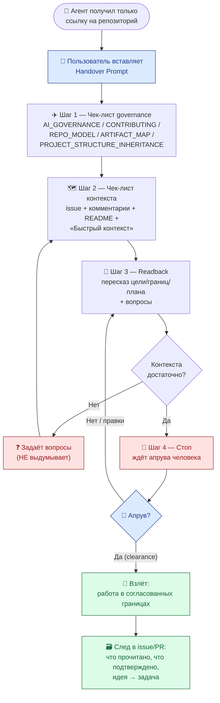

# RFC: Протокол бесшовной передачи проекта (Seamless Project Handover Protocol)

Версия: 1.1

Дата: 2026-06-06

Статус: черновик для согласования (RFC). Решение — за человеком (см. финальный
блок).

Цель документа — спроектировать протокол, благодаря которому **любой** ИИ-агент
или новый участник, получивший только ссылку на репозиторий, загружает *точный*
контекст до первого изменения файлов — и тем самым исключает «холодный старт»
(cold start): галлюцинации недостающего знания и тихие нарушения стандартов. Это
креативное governance-предложение в рамках модели **«Гибридный минимум»** и
Anti-Inflation principle
([governance/REPO_MODEL.md](../REPO_MODEL.md)), а не финальный стандарт. RFC
*проектирует* протокол и сам файл `AGENT_ONBOARDING.md`, но **не создаёт** его в
корне: физическое создание — после Human Review (см. раздел «Интеграция» и
финальный блок).

---

## 🧭 Модель процесса

> В этом документе используются термины из
> [standards/GLOSSARY.md](../../standards/GLOSSARY.md): *Runtime-онбординг*,
> *Handover Prompt*, *Readback*, *Среда работы агента*, *Источник контекста*.
> Здесь они только **используются** — их определения живут в глоссарии как в
> едином источнике истины, и в этом разделе **намеренно нет блока терминологии**.

Концептуальный фундамент этого протокола — манифест разделения двух кейсов
инициализации проекта
[governance/rfc/rfc-two-cases-of-project-initialization.md](rfc-two-cases-of-project-initialization.md).
Данный RFC покрывает **Кейс 1 — Runtime-онбординг** (а не Кейс 2 —
Bootstrap-клонирование).

Модель процесса в одну строку: **агент работает в *Среде работы агента* (чат
диалога) и обращается к *Источнику контекста* (репозиторий) по алгоритму
протокола.** Из этого следует:

- Агент **не запускается в репозитории** и **не живёт** в нём. *Среда работы
  агента* — это чат; репозиторий для агента — внешний *Источник контекста*,
  который он *читает* в оперативную память диалога.
- *Runtime-онбординг* — фаза **read-only**: до апрува человека (Шаг 4) агент
  ничего не пишет в *Источник контекста*. Создание файлов — это уже не онбординг,
  а отдельная работа в согласованных границах.
- Поэтому формулировки вида «запусти агента *в* репозитории» некорректны: они
  смешивают Кейс 1 и Кейс 2 (см. обоснование в манифесте). Правильно: «дай агенту
  ссылку на *Источник контекста* и вставь *Handover Prompt* в чат».

---

## 🛫 Концептуальная аналогия: предполётный чек-лист и «читка обратно» (readback)

Опасность не в полёте, а в **холодном старте**. В авиации катастрофы редко
случаются в крейсерском режиме — они начинаются на земле, когда экипаж взлетает,
не сверив конфигурацию. Поэтому пилот не имеет права на взлёт, пока не выполнил
две вещи:

1. **Предполётный чек-лист (checklist).** Жёсткий, неотменяемый список: топливо,
   закрылки, приборы. Не «прочитал документацию вообще», а «прошёл по пунктам и
   подтвердил каждый».
2. **Читку обратно (readback).** Получив разрешение диспетчера, пилот не
   выполняет его молча — он *повторяет вслух* то, что понял: «Понял, эшелон 120,
   курс 270». Диспетчер слышит и подтверждает (clearance). Именно readback
   ловит расхождение в понимании *до* того, как оно станет необратимым.

ИИ-агент в новом репозитории — это пилот в незнакомой кабине. «Холодный старт» —
это взлёт без чек-листа: агент сразу пишет код, угадывая, где приборы. Протокол
бесшовной передачи переносит ритуал авиации в репозиторий:

| Элемент авиации | Элемент протокола | Что предотвращает |
| --- | --- | --- |
| Предполётный чек-лист | Шаги 1–2: чтение governance и контекста проекта | Взлёт «вслепую», нарушение стандартов |
| Читка обратно (readback) | Шаг 3: агент пересказывает понятый контекст и задаёт вопросы | Молчаливое расхождение в понимании, галлюцинации |
| Разрешение диспетчера (clearance) | Шаг 4: стоп до явного апрува человека | Необратимые действия без согласия |
| Чёрный ящик | След в issue/PR: что прочитано и что подтверждено | Невоспроизводимость и потерю traceability |

**Почему именно эта аналогия, а не «иммунная система».** Иммунная система
*реагирует* на нарушителя постфактум; чек-лист пилота *предотвращает* ошибку до
взлёта. Холодный старт — проблема именно *превентивная*: дешевле не пустить агента
в работу без контекста, чем чинить последствия. И readback — это редкий приём,
где безопасность достигается не запретом, а *проговариванием*: агент не молчит и
не угадывает, он повторяет понятое вслух. Это делает протокол не «полицейским», а
*кооперативным*.

---

## 🎯 Обоснование: какие провалы холодного старта мы лечим

> **О зависимости issue #96.** Задача указывает каноническим источником
> `research/hub/ai-collaboration-retrospective-2026-06.md` («Сначала должен быть
> создан анализ ошибок»). На момент написания этого RFC файл в репозитории
> отсутствует. Чтобы сохранить traceability и не нарушать Anti-Inflation
> principle (не выдумывать несуществующий источник), RFC привязывает каждый
> провал к **уже существующей и проверяемой** ретроспективе холодного старта —
> [research/hub/project-context-and-bootstrap-patterns-2026-05.md](../../research/hub/project-context-and-bootstrap-patterns-2026-05.md)
> (далее — «ретроспектива bootstrap») и аудиту команды C
> [research/hub/team-c-governance-strategy-audit-2026-05.md](../../research/hub/team-c-governance-strategy-audit-2026-05.md).
> Когда ретроспектива `…-2026-06.md` появится, её выводы добавляются в таблицу
> ниже отдельными строками без переписывания протокола.

Ретроспектива bootstrap фиксирует пять провалов холодного старта (раздел
«Проблемы (5 пунктов)»). Каждый из них — это конкретная боль, которую протокол
обязан закрыть. Цитаты приведены дословно.

| # | Провал холодного старта (цитата из ретроспективы) | Риск | Чем лечит протокол |
| --- | --- | --- | --- |
| 1 | «Потеря контекста при смене чата… Новый ИИ получает неполную историю или тратит время на повторное чтение всего дерева.» | Агент стартует с дырой в знании и достраивает её домыслом | **Шаг 2** (чтение `README`/«Быстрый контекст») + **Шаг 3** (readback состояния) |
| 2 | «Непредсказуемое создание папок… Репозиторий теряет плоскую навигацию.» | Агент материализует дерево «на вырост» без спроса | **Шаг 1** (чтение `REPO_MODEL` и `PROJECT_STRUCTURE_INHERITANCE`) + **Шаг 4** (стоп до апрува) |
| 3 | «Новые папки вне стандарта репо… Локальное решение начинает выглядеть как repo-wide standard без согласования.» | Тихое нарушение Anti-Inflation principle | **Шаг 1** + **Шаг 3** (агент предлагает, а не создаёт) |
| 4 | «Рекомендации „в никуда“… Следующие проекты заново открывают те же улучшения.» | Потеря накопленного знания между чатами | **Шаг 3** (readback включает открытые вопросы и рекомендации) |
| 5 | «Нет явного механизма „идея → задача“… Хорошие предложения не доходят до реализации.» | Согласованное так и не превращается в действие | **Шаг 4** (явный handoff: апрув → issue/PR со ссылкой на источник) |

Аудит команды C усиливает направление и даёт прямое предписание для протокола:

> «AI-агент при bootstrap должен читать `AI_GOVERNANCE.md`, `CONTRIBUTING.md`,
> `governance/REPO_MODEL.md` и ближайший README **до создания артефактов**.»
> — [team-c-governance-strategy-audit-2026-05.md](../../research/hub/team-c-governance-strategy-audit-2026-05.md)

И ещё один тезис ретроспективы — прямой анти-галлюцинационный контракт, который
протокол делает обязательным, а не опциональным:

> «Если контекст недоступен, ИИ должен перейти к диалогу, а не выдумывать missing
> knowledge.» — ретроспектива bootstrap, раздел «Что сработало».

Наконец, протокол операционализирует уже записанное правило governance, которое
сегодня существует как текст, но не как ритуал:

> «AI agents читают issue, последние comments, relevant files и текущий PR
> context **до изменения файлов**.» — [AI_GOVERNANCE.md](../../AI_GOVERNANCE.md),
> правило 2.

---

## 🧩 Предлагаемое решение

Протокол — это **двусторонний контракт**. У человека одна обязанность (вставить
готовый промпт), у агента — четыре шага. Оба следа фиксируются в issue/PR, как
запись чёрного ящика.

### Часть A. Готовый промпт для Пользователя (Handover Prompt)

Чтобы соблюдение протокола стало *самым простым путём*, человеку не нужно ничего
формулировать: он копирует один блок в начало диалога с ИИ. Промпт намеренно
короткий — длинный никто не вставляет.

> Промпт параметризован плейсхолдером `{{REPO_NAME}}` (по умолчанию —
> `hybrid-Intelligence-lab`), чтобы один и тот же текст переносился в любой спок
> без правок. Формулировка намеренно избегает «агент в репозитории»: агент
> работает в чате и обращается к репозиторию как к *Источнику контекста* (см.
> раздел «Модель процесса»).

```text
Ты — ИИ-агент, работающий в чате диалога. Твой Источник контекста — репозиторий
{{REPO_NAME}} (модель hub-and-spoke); ты обращаешься к нему, но не «живёшь» в нём.
Прежде чем что-либо менять, выполни Протокол бесшовной передачи проекта
(governance/AGENT_ONBOARDING.md). Это предполётный чек-лист — взлёт (изменение
файлов) запрещён до моего апрува.

Сделай ровно по шагам:
1. ЧЕК-ЛИСТ GOVERNANCE. Прочитай AI_GOVERNANCE.md, CONTRIBUTING.md,
   governance/REPO_MODEL.md, governance/ARTIFACT_MAP.md и
   standards/PROJECT_STRUCTURE_INHERITANCE.md.
2. ЧЕК-ЛИСТ КОНТЕКСТА. Прочитай текст issue и последние комментарии, ближайший
   README (репозитория и затронутого проекта/спока) и блок «Быстрый контекст»,
   если он есть.
3. READBACK. Кратко перескажи своими словами: (а) цель задачи, (б) границы и
   запреты, которые ты понял, (в) релевантные стандарты, (г) план первых
   действий. Затем задай вопросы по всему, что неоднозначно. Если контекста не
   хватает — спрашивай, НЕ выдумывай.
4. СТОП. Остановись и жди моего апрува. Не создавай и не меняй файлы до явного
   «approve / поехали».

Начни с Шага 1.
```

> Идея: тот же промпт целиком переносится в шаблон спока
> (`templates/spoke/`), поэтому каждый клон Хаба наследует протокол «из
> коробки». Один источник — два места применения (Хаб и споки).

### Часть B. Пошаговый алгоритм для ИИ-агента

Алгоритм — это и есть содержимое будущего `AGENT_ONBOARDING.md`. Он построен так,
чтобы соблюдение было дешевле нарушения: каждый шаг — короткий, с явным «выходом»
в следующий.

#### Шаг 1 — Чек-лист governance (читаем правила игры)

Агент читает контракты репозитория **до** контекста задачи:
`AI_GOVERNANCE.md` (роли, эскалация, DoD), `CONTRIBUTING.md` (workflow),
`governance/REPO_MODEL.md` (структура и Anti-Inflation), `governance/ARTIFACT_MAP.md`
(навигация) и `standards/PROJECT_STRUCTURE_INHERITANCE.md` (что можно, а что
нельзя создавать). Выход из шага: агент знает границы *раньше*, чем узнал цель —
поэтому цель не «продавит» границы.
→ Лечит провалы **#2, #3** (непредсказуемые папки и нарушение стандартов).

#### Шаг 2 — Чек-лист контекста проекта (читаем местность)

Агент читает текст issue и последние комментарии, ближайший `README` (корневой и
проекта/спока) и блок «Быстрый контекст». Если контекст распределён или неполон —
это фиксируется как риск, а не достраивается домыслом.
→ Лечит провал **#1** (потеря контекста при смене чата).

#### Шаг 3 — Readback и вопросы (повторяем вслух понятое)

Агент *не молчит*. Он отдаёт человеку короткий пересказ по фиксированному шаблону
и список вопросов. Это ключевой анти-галлюцинационный момент: расхождение
обнаруживается здесь, а не в коде.

```markdown
## 🛫 Readback готовности (Шаг 3)

- **Цель задачи (как понял):** …
- **Границы и запреты:** …
- **Релевантные стандарты:** …
- **План первых действий:** …
- **Открытые вопросы / неоднозначности:** …
- **Рекомендации, замеченные по пути:** … (статус: idea)
- **Чего не хватает в контексте:** … (спрашиваю, не выдумываю)
```

→ Лечит провалы **#1, #4** (контекст + рекомендации «в никуда») и галлюцинации.

#### Шаг 4 — Стоп до апрува (ждём разрешения на взлёт)

Агент **останавливается**. Никаких изменений файлов до явного апрува человека.
После апрува действия идут строго в согласованных границах; согласованная
рекомендация оформляется как issue/PR со ссылкой на источник идеи (маршрут
«идея → задача»). Если человек сознательно просит отклониться от стандарта —
агент фиксирует это как решение со следом (ADR/комментарий), а не как тихую
эрозию.
→ Лечит провалы **#2, #5** (действия без согласия + идея, не дошедшая до задачи).

### Свойство протокола: соблюдать дешевле, чем нарушать

Протокол спроектирован так, что путь «по правилам» — самый короткий: человек
вставляет один готовый блок; агент идёт по четырём пунктам с готовыми шаблонами
readback’а; стоп-точка одна и однозначная. Нарушить дороже: пришлось бы
сочинять контекст, рисковать переделкой и оставлять задачу без следа. Это и есть
«сделать соблюдение протокола самым простым путём для ИИ».

---

## 🗺️ Mermaid-схема: поток инициализации



---

## 🔌 Интеграция: куда поместить файл после апрува

RFC только *проектирует* протокол. Сам файл `AGENT_ONBOARDING.md` создаётся
отдельным issue/PR после Human Review этого предложения. Сравним два места.

| Вариант | Плюсы | Минусы | Оценка |
| --- | --- | --- | --- |
| Корень `/AGENT_ONBOARDING.md` | Максимально заметен; первое, что видит новый чат | Корень — это контракт верхнего уровня; ещё один UPPERCASE-файл размывает фокус `README`/`CONCEPT`/`AI_GOVERNANCE` | Заметность важна, но шум в корне противоречит Anti-Inflation |
| **`governance/AGENT_ONBOARDING.md`** (рекомендация) | Живёт рядом с `REPO_MODEL`/`ARTIFACT_MAP`, где и место операционным правилам; регистрируется в `ARTIFACT_MAP.md`; на него ссылаются `README` и `AI_GOVERNANCE.md` | На один клик дальше от корня | Соответствует структуре governance и снижает шум корня |

**Рекомендация автора RFC: `governance/AGENT_ONBOARDING.md`** с короткой ссылкой
из `README.md` («Новый агент? Начни здесь →») и из `AI_GOVERNANCE.md` (правило 2
получает явную реализацию). Так заметность достигается ссылкой, а не загрязнением
корня. После создания файл регистрируется как active в
`tools/validate-repository-structure.sh` и `governance/ARTIFACT_MAP.md` (тип
`правило`), а Handover Prompt дублируется в `templates/spoke/`, чтобы протокол
наследовался споками.

---

## 🙋 Решение за человеком

Этот документ — предложение, а не финальное решение
([AI_GOVERNANCE.md](../../AI_GOVERNANCE.md): humans принимают финальные решения по
governance). Прошу выбрать направление:

1. **Принять протокол** из 4 шагов (чек-лист governance → чек-лист контекста →
   readback → стоп до апрува) как основу, либо указать, что изменить.
2. **Handover Prompt.** Утвердить текст готового промпта (Часть A) или поправить
   формулировки/набор файлов для чтения.
3. **Место файла.** Подтвердить `governance/AGENT_ONBOARDING.md` (рекомендация),
   либо выбрать корень `/AGENT_ONBOARDING.md`, либо предложить иное.
4. **Следующий шаг.** Создавать ли в отдельном issue/PR сам
   `AGENT_ONBOARDING.md`, ссылки из `README`/`AI_GOVERNANCE.md` и дубль промпта в
   `templates/spoke/` — или сначала доработать дизайн?
5. **Источник.** Когда появится `research/hub/ai-collaboration-retrospective-2026-06.md`,
   добавить ли его выводы в таблицу обоснования отдельными строками?

> **Что мне НЕ создавать без твоего слова:** сам файл `AGENT_ONBOARDING.md` (ни в
> корне, ни в `governance/`), ссылки из `README.md`/`AI_GOVERNANCE.md` и дубль
> промпта в `templates/spoke/`. Этот PR добавляет только данный RFC в
> `governance/rfc/`.

## ✅ Решения фаундера (Human Review 2026-06)

### 2.1. Протокол из 4 шагов

**Решение:** Принято. С учётом стандарта `contract-executability-rfc`:
`executable: true` в frontmatter, структура EXECUTION BLOCK → EXPLANATION BLOCK.

### 2.2. Handover Prompt (Часть A)

**Решение:** Утверждён с адаптацией под стандарт исполнимых документов. Промпт
явно выделен для копирования в чат.

### 2.3. Место файла

**Решение:** `governance/AGENT_ONBOARDING.md` (следовать контракту
`ARTIFACT_MAP.md`). Override контракта не требуется.

### 2.4. Создание файла

**Статус:** Файл уже создан (`governance/AGENT_ONBOARDING.md` v1.1,
2026-06-04) с применением стандарта исполнимых документов (`executable: true`,
`entrypoint: true`).

### 2.5. Выводы из ретроспективы

**Решение:** Добавить после завершения задачи `creative: self-report ошибок
исполнения контрактов`.

---

**Дата утверждения:** 2026-06-06
**Утверждено:** Иван Гулиенко (фаундер)
