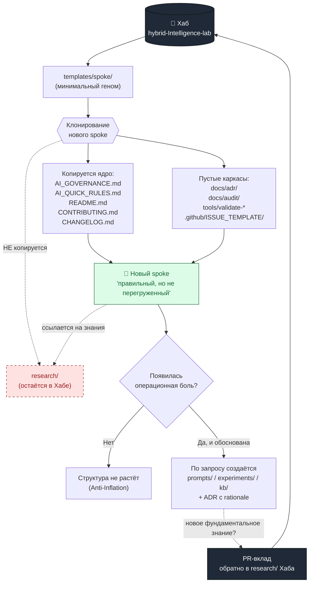

# RFC: "ДНК-шаблон" для клонирования spoke-проектов

Решение по RFC — за человеком (см. финальный блок).

Цель документа — спроектировать механизм, благодаря которому новый spoke рождается
из Хаба уже "правильным", но не перегруженным. Это креативное архитектурное
предложение в рамках модели **"Гибридный минимум"** и Anti-Inflation principle
([governance/repo-model.md](../repo-model.md)), а не финальный стандарт.

---

## 🧬 Концептуальная аналогия: ДНК клетки, а не чемодан переезжающего

Хороший шаблон спока похож на **ДНК клетки**, а не на чемодан переезжающего.
ДНК — это компактный набор инструкций о том, *кем клетка может стать* и *по каким
правилам растёт*, а не готовый набор всех органелл "на всякий случай". Когда
клетке нужна митохондрия, она строит её *по запросу*, читая ген. Так и spoke:
при рождении он получает короткий "геном" (правила, контакт с Хабом, минимальный
каркас), а тяжёлые "органеллы" — `research/`, `prompts/`, `experiments/` —
синтезируются только тогда, когда появляется операционная боль, которая их
оправдывает. Чемодан переезжающего, наоборот, тащит за собой всё подряд: шаблон,
устроенный как чемодан, копирует пустые папки и мёртвые файлы, и каждый новый
spoke рождается уставшим. Мы выбираем геном.

---

## 📊 Сравнительная матрица: имя и форма корневого каталога шаблонов

Где в Хабе живёт сам "геном"? Сравним три кандидата на имя корневого каталога
шаблонов. Оценка по 5-балльной шкале (5 — лучше) по четырём осям: ясность для
человека, считываемость для ИИ-агента (насколько имя само подсказывает действие),
соответствие Anti-Inflation principle и "элегантность" (метафорическая сила без
пафоса).

| Вариант | Ясность для человека | Считываемость для ИИ | Anti-Inflation | Элегантность | Σ |
| --- | :---: | :---: | :---: | :---: | :---: |
| `templates/` | 5 — мгновенно понятно | 5 — однозначный сигнал "копируй отсюда" | 5 — нейтрально, без обещания роста | 3 — честно, но буднично | **18** |
| `blueprints/` | 4 — понятно, но это "чертёж", а не "копия" | 3 — чертёж описывает, а не клонируется | 4 — нейтрально | 4 — красивый инженерный образ | **15** |
| `genesis/` | 3 — требует пояснения | 2 — соблазняет агента "творить", а не копировать минимум | 2 — имя подталкивает к избыточности и пафосу | 5 — самый яркий образ | **12** |

**Рекомендация автора RFC: `templates/`.** Метафора ДНК живёт в *тексте* RFC и в
комментариях к файлам, а имя каталога должно быть скучным и предсказуемым: оно —
интерфейс, а не поэма. `genesis/` красив, но именно его яркость опасна — он
провоцирует и человека, и агента "сотворить мир" вместо того, чтобы скопировать
минимум. `blueprints/` концептуально честен (чертёж ≠ готовое здание), но
повседневно агенту проще рассуждать о действии "копировать template", чем
"материализовать blueprint". Полный путь предложения: `templates/spoke/` —
namespace на случай, если позже появятся шаблоны не-споков (например,
`templates/research-domain/`).

---

## 🗺️ Минималистичная карта шаблона `templates/spoke/`

Точный список того, что копируется в новый spoke. Каждый файл несёт **один**
смысл; всё, что не оправдано болью на старте, отсутствует намеренно.

| Файл шаблона | Зачем он нужен (креативный комментарий) |
| --- | --- |
| `AI_GOVERNANCE.md` | **Ядро генома.** Обязателен в корне каждого спока (жёсткое ограничение). Это "конституция" проекта: кто решает, что делает ИИ, где границы. Без него spoke — это анархия с git-историей. |
| `AI_QUICK_RULES.md` | **"Инструкция по выживанию" для агента в новом проекте.** Одна страница: куда смотреть первым, чего не делать, как звать на помощь человека. ДНК хранит не всю биохимию, а ключевые регуляторные участки — это они. |
| `README.md` | **Визитка и карта местности.** Первое, что читает и человек, и новый чат: что это за spoke, какова его цель, где Хаб, какие папки есть *сейчас*. Точка входа для передачи контекста между чатами. |
| `CONTRIBUTING.md` | **Правила входа.** Короткий workflow: issue → PR → review. Ссылается на `AI_GOVERNANCE.md`, не дублируя его. |
| `CHANGELOG.md` | **Память спока.** Пустой каркас с секцией `## Unreleased`. Дешёвый файл, который окупается с первого же значимого изменения. |
| `docs/adr/.gitkeep` | **Скелет решений.** `adr/` (Architecture Decision Records) — место, где spoke фиксирует "почему", а не только "что". Создаётся пустым: каркас есть, наполнение — по факту первого решения. |
| `docs/audit/.gitkeep` | **Скелет проверок.** `audit/` — место для ревизий, аудитов и проверок соответствия. Тоже пустой каркас. |
| `.github/ISSUE_TEMPLATE/task.yml` | **Воронка задач.** Наследует hub-конвенцию постановки задач (operating mode, контекст, DoD), чтобы spoke с первого дня говорил с Хабом на одном языке. |
| `tools/validate-repository-structure.sh` | **Иммунная система.** Минимальный валидатор структуры спока: ловит самовольный рост дерева до того, как он превратится в хаос. |

**Что НЕ создаётся по умолчанию (намеренные "выключенные гены"):**

- `research/` — фундаментальные знания живут в `research/` *Хаба*. В споке папка
  `research/` по умолчанию **не создаётся** (жёсткое ограничение). Spoke ссылается
  на знания Хаба, а не копирует их внутрь себя.
- `prompts/`, `experiments/`, `kb/`, `standards/`, `decisions/` — создаются только
  по запросу, при появлении операционной боли (см.
  [standards/project-structure-inheritance.md](../../standards/project-structure-inheritance.md)).

---

## 🎭 Антипаттерны: три "вредных совета" для контраста

Чтобы стало очевидно, почему минимальный геном лучше, вот как делать **не надо**.

1. **"Совет хомяка": копируй всё, вдруг пригодится.**
   Создай в шаблоне все 15 папок Хаба, набей их пустыми `.gitkeep` и
   README-заглушками "TODO: заполнить". Результат: каждый spoke рождается с
   кладбищем пустых директорий, агент тратит контекст на обход мёртвых веток, а
   человек не отличает "папка пуста, потому что не нужна" от "папка пуста, потому
   что забыли". Геном не носит с собой запасные органы — он умеет их отращивать.

2. **"Совет копировальщика-перфекциониста": зашей research/ прямо в шаблон.**
   "Знания же важны — пусть едут с проектом!" Так Хаб теряет роль единого
   источника истины: появляются N расходящихся копий research, каждая устаревает
   по-своему, и через месяц никто не знает, какая версия каноническая. Мы
   разделяем: знание — в Хабе, ссылка — в споке.

3. **"Совет архитектора-небоскрёба": заложи структуру 'на вырост'.**
   Спроектируй шаблон под гипотетический spoke с командой из 50 человек:
   `prompts/system/`, `prompts/user/`, `experiments/ab/`, `experiments/metrics/`,
   `decisions/architecture/`, `decisions/process/`… Реальный spoke на старте — это
   один человек и один чат. Глубокая вложенность "на вырост" — это налог, который
   платят все споки ради одного, которого ещё нет. Усложнение должно быть
   *обоснованным*, а не *предвосхищающим*.

---

## 🔀 Обработка краевых случаев ("А что, если...")

Хороший геном элегантен не в типовом случае, а в исключениях. Два сценария.

### Сценарий A: "Пользователь хочет нарушить правило и создать `research/` на старте"

Агент создаёт новый spoke, и человек просит: "сразу заведи папку `research/`".
Это прямой конфликт с жёстким ограничением (research живёт в Хабе).

**Как помогает шаблон.** `AI_QUICK_RULES.md` спока содержит явное правило-предохранитель:
*"В споке `research/` по умолчанию не создаётся; фундаментальные знания —
в `research/` Хаба"*. Агент не отказывает молча и не выполняет слепо, а действует
по протоколу эскалации из `AI_GOVERNANCE.md`:

1. Называет правило и его источник (REPO_MODEL Хаба).
2. Предлагает легитимную альтернативу: ссылку из `README.md` спока на нужный
   домен в `research/` Хаба, либо `docs/adr/` для проектных заметок.
3. Если знание действительно новое и фундаментальное — оформляет его как вклад
   в Хаб через PR, а не закапывает в споке.
4. Если человек настаивает осознанно — фиксирует это как ADR с явным rationale,
   и тогда отклонение от правила становится *задокументированным решением*, а не
   тихой эрозией. Решение остаётся за человеком — шаблон лишь гарантирует, что оно
   принято осознанно и оставило след.

То есть шаблон превращает потенциальное нарушение в развилку с видимыми
последствиями, вместо безмолвного "ок".

### Сценарий B: "Проект внезапно переходит из Open Source в Commercial"

Spoke жил как открытый, а теперь становится коммерческим: появляются клиентские
данные, NDA, закрытые промпты.

**Как помогает шаблон.** Поскольку геном с самого начала отделил *контракт*
(`AI_GOVERNANCE.md`) от *содержимого*, переход — это смена нескольких правил, а
не пересборка проекта:

- `AI_GOVERNANCE.md` уже содержит раздел про secrets и private data — при переходе
  он ужесточается, а не пишется с нуля.
- Решение о смене лицензии и режима публикации фиксируется как ADR в `docs/adr/` —
  у спока уже есть для этого готовый каркас.
- `audit/` получает первый реальный артефакт: аудит того, что нельзя публиковать.
- Поскольку research не был "вшит" в spoke, нет риска, что коммерческий spoke
  утащит за собой открытые знания Хаба или наоборот. Граница уже проведена.

Минимальный геном оказывается *гибче* раздутого: чем меньше зашито жёстко, тем
дешевле смена режима.

---

## 🗺️ Визуализация процесса клонирования

---

## 🙋 Решение за человеком

Этот документ — предложение, а не финальное решение
([AI_GOVERNANCE.md](../../AI_GOVERNANCE.md): humans принимают финальные решения по
структуре и vision). Прошу тебя выбрать направление:

1. **Имя корневого каталога.** Утвердить `templates/` (рекомендация автора), либо
   выбрать `blueprints/` / `genesis/`, либо предложить своё.
2. **Namespace.** Принять путь `templates/spoke/` (с заделом под другие типы
   шаблонов), либо оставить плоский `templates/` без подкаталога.
3. **Карта файлов.** Подтвердить минимальный список из 9 файлов выше, либо
   указать, что добавить/убрать. Особенно: нужен ли `AI_QUICK_RULES.md` как
   отдельный файл, или его роль покрывает `README.md`.
4. **Следующий шаг.** Этот RFC только *проектирует* шаблон. Создавать ли в
   отдельном issue/PR сам каталог `templates/spoke/` с файлами и скрипт
   клонирования — или сначала доработать дизайн?

> **Что мне НЕ создавать без твоего слова:** сам каталог `templates/` с файлами,
> скрипт автоматического клонирования и любые изменения в `research/`. Этот PR
> добавляет только данный RFC в `governance/rfc/`.

## ✅ Решения фаундера (Human Review 2026-06)

### 3.1. Имя корневого каталога

**Решение:** `templates/`

### 3.2. Namespace

**Решение:** `templates/spoke/` (с заделом на будущие типы шаблонов).

### 3.3. Карта файлов (9 файлов)

**Решение:** Подтверждено. `AI_QUICK_RULES.md` нужен отдельно как fail-closed
инструкция для агента (не дублирует README).

### 3.4. Создание каталога

**Статус:** Каталог `templates/spoke/` уже создан со всеми 9 файлами
(2026-06-04). Все исполнимые файлы рефакторены под стандарт
`contract-executability-rfc`.

---

**Дата утверждения:** 2026-06-06
**Утверждено:** Иван Гулиенко (фаундер)
