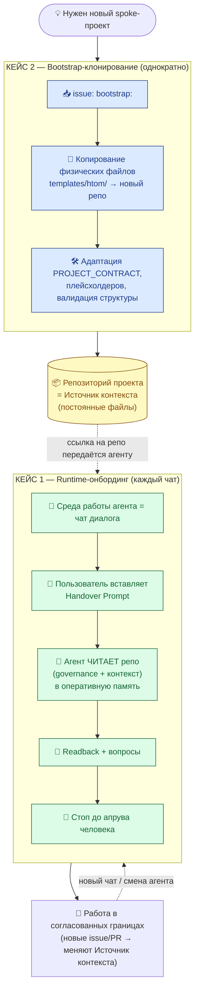

# RFC-манифест: два ортогональных кейса инициализации проекта

Решение по RFC — за человеком (см. финальный блок).

Это **концептуальный («конституционный») манифест**. Его единственная задача —
зафиксировать, что в модели hub-and-spoke слово «инициализация проекта»
скрывает **два разных процесса**, которые нельзя смешивать:

- **Кейс 1 — *Runtime-онбординг*** (см. определение в [standards/glossary.md](../../standards/glossary.md)):
  агент в чате загружает контекст проекта из репозитория в оперативную память
  диалога. Протокол: [governance/agent-onboarding-protocol.md](../agent-onboarding-protocol.md).
- **Кейс 2 — *Bootstrap-клонирование*** (см. определение в [standards/glossary.md](../../standards/glossary.md)):
  из шаблонов Хаба рождается новый репозиторий: HTOM-команда из генома
  `templates/htom/` или spoke-репозиторий из `templates/spoke/` (см.
  [htom-vs-spoke-clarification-2026-06.md](htom-vs-spoke-clarification-2026-06.md)).
  Дизайн генома HTOM-команды: [templates/htom/README.md](../../templates/htom/README.md).

> ⚠️ **Этот документ не определяет термины.** Все термины — *Runtime-онбординг*,
> *Bootstrap-клонирование*, *Handover Prompt*, *Readback*, *Среда работы агента*,
> *Источник контекста* — берутся из единого источника истины
> [standards/glossary.md](../../standards/glossary.md). Здесь они только
> **используются**. Если по ходу обсуждения понадобится новый термин — он сначала
> добавляется в глоссарий, и лишь затем используется здесь.

---

## 🛩️ Концептуальная аналогия: сертификация самолёта ≠ лицензия пилота

Самая яркая аналогия для нашей путаницы — авиационная. Никому не приходит в
голову смешать **сертификацию типа самолёта** (type certificate) с **лицензией
пилота**:

- **Сертификация типа самолёта** отвечает на вопрос «*можно ли вообще
  эксплуатировать машину такой конструкции?*». Её проходят **один раз** на этапе
  создания модели; результат — **физический, постоянный артефакт** (сертификат,
  чертежи, серийный борт). Это наш **Кейс 2 — Bootstrap-клонирование**: новый
  spoke рождается из шаблона с правильной конструкцией.
- **Лицензия пилота + предполётный чек-лист** отвечают на вопрос «*готов ли
  *этот* оператор поднять *этот* борт *сейчас*?*». Это происходит **каждый раз
  перед вылетом**; результат живёт в **оперативной памяти экипажа** (он *знает*
  конфигурацию, маршрут, ограничения), а не в новых деталях самолёта. Это наш
  **Кейс 1 — Runtime-онбординг**: агент в чате каждый раз загружает контекст
  перед работой.

Ключевое наблюдение: **самолёт можно сертифицировать без единого пилота, а пилот
не строит самолёт — он его поднимает.** Точно так же `templates/htom/` создаёт
структуру репозитория *без участия агента в чате*, а Runtime-онбординг загружает
контекст *в уже существующий* репозиторий, ничего в нём (на этом шаге) не строя.
Смешать их — всё равно что выдать пилоту чертежи и потребовать «инициализировать
самолёт»: непонятно, он его проектирует или поднимает.

Эта аналогия — мост к ретроспективе
[research/hub/ai-collaboration-retrospective-2026-06.md](../../research/hub/ai-collaboration-retrospective-2026-06.md):
её системный вывод №2 («pre-flight чтение контекста должно быть обязательным
шагом») — это ровно «лицензия пилота + чек-лист», то есть **Кейс 1**. Когда этот
вывод по ошибке формулируют как «инициализацию репозитория», он подменяет Кейс 1
Кейсом 2 и теряет смысл.

---

## 📜 Таблица-манифест: два кейса построчно

Все термины ниже — из [standards/glossary.md](../../standards/glossary.md).

| № | Аспект | **КЕЙС 1: Runtime-онбординг** | **КЕЙС 2: Bootstrap-клонирование** |
|---|--------|-------------------------------|------------------------------------|
| 1 | **Суть** | Агент в чате загружает контекст проекта из репо в оперативную память диалога | Создаётся новый репозиторий (HTOM-команда или spoke) из шаблонов Хаба |
| 2 | **Вопрос, на который отвечает** | «Готов ли *этот* агент работать с *этим* проектом *сейчас*?» | «Существует ли репозиторий правильной конструкции?» |
| 3 | **Когда** | При старте нового чата, передаче проекта, смене агента — **каждый раз** | При создании нового spoke-проекта — **однократно** |
| 4 | **Триггер** | Пользователь вставляет *Handover Prompt* в чат LLM | Пользователь инициирует issue `bootstrap:` |
| 5 | **Что происходит** | Контекст копируется в **оперативную память агента** (не файлы!) | **Физические файлы** копируются из `templates/htom/` в новый репо |
| 6 | **Среда** | *Среда работы агента* = чат диалога | Файловая система / GitHub нового репо |
| 7 | **Ключевой артефакт Хаба** | `governance/agent-onboarding-protocol.md` | `templates/htom/` (геном-шаблон) |
| 8 | **Результат** | Агент *знает* правила и контекст проекта | Новый репо *имеет* правильную структуру |
| 9 | **Долговечность результата** | Эфемерный (живёт, пока жив чат) | Постоянный (файлы остаются в репо) |
| 10 | **Canonical-точка** | [governance/agent-onboarding-protocol.md](../agent-onboarding-protocol.md) | [templates/htom/README.md](../../templates/htom/README.md) |
| 11 | **Operating Mode задачи** | `Structured` | `Creative`, если нужно выбрать структуру или адаптацию; `Structured`, если bootstrap-шаги уже заданы |
| 12 | **Точка входа для инструкций** | `README.md` Хаба → `governance/agent-onboarding-protocol.md` | `templates/htom/README.md` |
| 13 | **Авиационная аналогия** | Лицензия пилота + предполётный чек-лист | Сертификация типа самолёта |

---

## 🌐 Расширение горизонта: аналогии из смежных областей

Для каждой области — что аналогия объясняет **хорошо**, что **плохо**, и какой
**вывод** для нашей модели.

### 1. Авиация — сертификация типа ↔ лицензия пилота

- **Хорошо объясняет:** «однократное создание конструкции» (Кейс 2) против
  «повторяемой проверки готовности оператора перед каждым вылетом» (Кейс 1);
  эфемерность готовности пилота против постоянства сертификата.
- **Плохо объясняет:** в авиации пилот физически входит *внутрь* самолёта, что
  возвращает ложную метафору «агент внутри репозитория». Поэтому аналогию надо
  ограничить: агент не «садится в репо», он *читает* его как карту и сводки
  погоды перед вылетом.
- **Вывод:** разделяем «есть ли правильная машина» и «готов ли оператор сейчас» —
  это и есть Кейс 2 и Кейс 1. Но *Среду работы агента* фиксируем отдельно (чат),
  чтобы не унаследовать «пилот внутри».

### 2. Медицина — аккредитация клиники ↔ сертификация врача + протокол приёма

- **Хорошо объясняет:** клиника (репо) аккредитуется один раз и существует
  постоянно (Кейс 2); врач (агент) перед каждым приёмом сверяется с протоколом и
  историей болезни (Кейс 1), загружая контекст пациента в свою память.
- **Плохо объясняет:** врач — постоянный сотрудник клиники, тогда как агент в
  чате эфемерен и каждый раз «новый». Аналогия преувеличивает привязанность
  оператора к учреждению.
- **Вывод:** усиливает идею, что *Источник контекста* (история болезни =
  репозиторий) внешний по отношению к оператору; врач его *читает*, а не «живёт
  внутри карты пациента». Это прямой аргумент против формулировки «агент работает
  в репозитории».

### 3. Юриспруденция — регистрация юрлица ↔ назначение директора + доверенность

- **Хорошо объясняет:** регистрация юрлица (Кейс 2) — однократный акт, рождающий
  постоянную сущность; назначение директора и выдача доверенности (Кейс 1) —
  повторяемый акт наделения *конкретного* лица полномочиями действовать от имени
  уже существующей сущности.
- **Плохо объясняет:** правовые полномочия директора долгосрочны и
  зарегистрированы, а «полномочия» агента эфемерны и не оставляют юридического
  следа, кроме записи в issue/PR.
- **Вывод:** подсвечивает, что *Handover Prompt* — это «доверенность»: документ,
  которым человек каждый раз уполномочивает агента действовать в границах
  проекта. Доверенность не меняет устав юрлица — Кейс 1 не меняет структуру репо.

### 4. DevOps — provisioning инфраструктуры ↔ deployment + health check

- **Хорошо объясняет:** `terraform apply` (Кейс 2) создаёт инфраструктуру —
  постоянные ресурсы; deployment приложения с health check (Кейс 1) повторяется
  при каждом релизе и проверяет готовность *перед* трафиком. *Readback* —
  это health check онбординга.
- **Плохо объясняет:** деплой действительно *помещает* артефакты на инфраструктуру
  (меняет состояние), тогда как Runtime-онбординг сознательно **ничего не пишет**
  до апрува человека (Шаг 4 протокола онбординга).
- **Вывод:** аналогия даёт нам слово «health check» для *Readback*, но
  подчёркивает важное отличие нашей модели: онбординг — это *read-only* фаза,
  заканчивающаяся стоп-точкой, а не записью.

**Сводный вывод трёх+ аналогий:** во всех областях есть устойчивое разделение
«создать систему один раз» и «подготовить оператора к работе каждый раз». Наша
модель добавляет к этому два собственных ограничения, которых нет ни в одной
аналогии: (а) *Среда работы агента* — чат, а не «внутренность» системы; (б)
Runtime-онбординг — строго read-only до апрува человека.

---

## 🗺️ Mermaid-схема: жизненный цикл проекта и место каждого кейса

Схема показывает направление времени: **Кейс 2 случается один раз** и рождает
постоянный *Источник контекста*; **Кейс 1 случается заново при каждом чате** и
лишь читает этот источник в *Среду работы агента*. Стрелка-петля «новый чат /
смена агента» подчёркивает повторяемость Кейса 1, которой нет у Кейса 2.

---

## 🧾 Evidence trail: git history + issues + PRs как след доказательств

Узел `Work` на схеме выше («новые issue/PR → меняют *Источник контекста*»)
указывает на свойство, которое до сих пор оставалось неназванным, хотя
**уже работает** в репозитории. Зафиксируем его явно одним именем:

> **Evidence trail** (след доказательств) — это **git history + issues + PRs**,
> которые вместе образуют проверяемую летопись того, *кто, что, когда и почему*
> изменил в *Источнике контекста*. Каждое изменение репозитория проходит через
> issue (зачем) и PR (что именно), а git history фиксирует факт и авторство.

Этот тезис **введён не здесь** — он сформулирован командой С как один из шести
архитектурных gaps (`[C5]`, см.
[external-governance-patterns-review-2026-06.md](../../research/hub/external-governance-patterns-review-2026-06.md),
раздел 1.3, строка *Evidence model*) и помечен в её матрице применимости как
«**взять сейчас**» именно потому, что функция **уже есть** — недоставало лишь
имени (раздел 3.1 того же документа, целевое место — этот манифест; источники
`[C5]`, `[GAP]`). Здесь манифест лишь **называет** существующее и закрепляет имя
рядом с моделью жизненного цикла, где evidence trail естественно возникает.

Связь с двумя кейсами:

- **Кейс 2 (Bootstrap-клонирование)** оставляет *первичный* след — issue
  `bootstrap:<project>` и PR с физическими файлами из `templates/htom/`
  фиксируют рождение spoke в git history.
- **Кейс 1 (Runtime-онбординг)** сам по себе **ничего не пишет** (он read-only до
  апрува человека), но *работа после* онбординга — новые issue/PR — продолжает
  тот же evidence trail, дописывая летопись *Источника контекста*.

> ⚠️ **Это не новый формат и не обёртка.** Манифест сознательно **не вводит**
> JSON-обёртку (Governance Metadata Envelope из external-review отнесена в
> «отклонить») и не создаёт новых артефактов. По принципу Anti-Inflation
> ([governance/repo-model.md](../repo-model.md)) задача — *назвать* уже
> работающую способность, а не нарастить структуру.

---

## 🎯 Обоснование разделения: почему смешение ведёт к ошибкам

Источник ошибок —
[research/hub/ai-collaboration-retrospective-2026-06.md](../../research/hub/ai-collaboration-retrospective-2026-06.md).
Хотя ретроспектива фиксирует ошибки сессии проектирования шаблонов, её системные
выводы прямо мотивируют этот манифест:

| Системный вывод ретроспективы | Как смешение кейсов его нарушает | Что чинит разделение |
| --- | --- | --- |
| №2: «pre-flight чтение контекста должно быть обязательным шагом» | Если pre-flight чтение называть «инициализацией репозитория», его путают с физическим bootstrap и либо пропускают (репо «уже есть»), либо ошибочно начинают создавать файлы | Кейс 1 явно отделён: pre-flight чтение — это read-only загрузка в память, а не работа с файлами |
| №3: «Anti-Inflation проверяется до предложения новой структуры» | Под видом «инициализации проекта» агент создаёт каталоги/файлы, думая, что это часть онбординга | Кейс 1 не создаёт файлов вовсе; создание структуры — только Кейс 2 по шаблону |
| №1: «operating mode должен быть проверяемым значением» | Смешанный кейс провоцирует смешанный режим («инициализация» = и read-only онбординг, и bootstrap-выбор структуры) | Манифест привязывает Кейс 1 → `Structured`, а Кейс 2 → `Creative` для выбора структуры или `Structured` для заданных bootstrap-шагов |

Дополнительно — хронология самого issue #99 (раздел «Фактическая история
диалога»): формулировка *«в этом репо запускаете агента»* создала ложную модель
«агент живёт в репозитории». Манифест устраняет её, вводя через глоссарий
*Среду работы агента* (чат) и *Источник контекста* (репо) как ортогональные
сущности.

---

## 🏗️ Следствие для структуры Хаба: какие README и где

Манифест **не создаёт** README в этой задаче (Anti-Inflation,
[governance/repo-model.md](../repo-model.md)). Он лишь фиксирует, что после
утверждения должны появиться **ровно два** входных документа, по одному на кейс:

| README | Кейс | Где | Что содержит | Перекрёстные ссылки |
| --- | --- | --- | --- | --- |
| `templates/htom/README.md` *(уже существует как шаблон)* | Кейс 2 | `templates/htom/` | Что копировать, как адаптировать `PROJECT_CONTRACT`/плейсхолдеры, как валидировать структуру | → этот манифест, → раздел Design Decisions & Rationale, → README Кейса 1 |
| `governance/agent-onboarding-protocol.md` *(уже существует как executable-контракт)* | Кейс 1 | `governance/` с короткой ссылкой из `README.md` Хаба | *Handover Prompt*, алгоритм чтения файлов, шаблон *Readback* | → этот манифест, → раздел Design Rationale & History, → README Кейса 2 |

Оба документа обязаны **явно ссылаться друг на друга** и на этот манифест —
чтобы читатель, попавший в любую точку входа, сразу видел: «есть второй,
ортогональный кейс, и вот он».

---

## 🔭 Follow-up: задачи, вытекающие из манифеста

После Human Review этого манифеста (каждая — отдельным issue/PR, по Anti-Inflation):

1. **Уточнить `governance/agent-onboarding-protocol.md`** — добавить раздел «Модель
   процесса» со ссылками на глоссарий и на этот манифест, параметризовать
   *Handover Prompt* плейсхолдером `{{REPO_NAME}}`. *(Выполнено в canonical
   executable-контракте.)*
2. **Обновить [governance/repo-model.md](../repo-model.md)** — зафиксировать
   двухкейсовую модель инициализации как часть описания жизненного цикла spoke.
3. **Поддерживать `governance/agent-onboarding-protocol.md`** (Кейс 1) как canonical
   executable-контракт после утверждения решений по онбордингу.
4. **Дополнить `templates/htom/README.md`** (Кейс 2) — раздел про адаптацию и
   валидацию, со ссылкой на этот манифест и на README Кейса 1.
5. **Связать оба README перекрёстными ссылками** и со ссылкой из `README.md`
   Хаба («Новый агент? Начни здесь →» и «Создаёшь новый spoke? Начни здесь →»).

---

## 🙋 Решение за человеком

Этот документ — предложение, а не финальное решение
([AI_GOVERNANCE.md](../../AI_GOVERNANCE.md): humans принимают финальные решения по
governance). Прошу:

1. **Принять разделение** на Кейс 1 (Runtime-онбординг) и Кейс 2
   (Bootstrap-клонирование) как концептуальный фундамент, либо указать, что
   уточнить.
2. **Подтвердить 6 новых терминов** в [standards/glossary.md](../../standards/glossary.md)
   (*Runtime-онбординг*, *Bootstrap-клонирование*, *Handover Prompt*, *Readback*,
   *Среда работы агента*, *Источник контекста*) или поправить формулировки.
3. **Утвердить follow-up-список** (5 задач выше) и порядок их выполнения.

> **Что мне НЕ создавать без твоего слова:** сами README (`templates/htom/README.md`
> наполнять инструкцией Кейса 2, `governance/agent-onboarding-protocol.md`), изменения
> `governance/repo-model.md`. Этот PR добавляет только данный манифест, раздел
> «Модель процесса» в онбординг-RFC и 6 терминов в глоссарий.

## ✅ Решения фаундера (Human Review 2026-06)

### 1.1. Разделение на Кейс 1 и Кейс 2

**Решение:** Принято. Разделение на Runtime-онбординг (Кейс 1) и
Bootstrap-клонирование (Кейс 2) утверждено как концептуальный фундамент.

### 1.2. Новые термины в глоссарии

**Решение:** Подтверждено. Следующие 6 терминов добавлены в
`standards/glossary.md`:

- Runtime-онбординг
- Bootstrap-клонирование
- Handover Prompt
- Readback
- Среда работы агента
- Источник контекста

### 1.3. Follow-up задачи (5 задач)

**Решение:** Утверждено. Статус выполнения:

- ✅ Создать `governance/agent-onboarding-protocol.md` — выполнено (v1.1, 2026-06-04)
- ✅ Создать `templates/htom/README.md` — выполнено
- ✅ Обновить `governance/repo-model.md` — выполнено (v1.1, 2026-06-04)
- ⚠️ Добавить ссылки из `README.md` и `AI_GOVERNANCE.md` — выполняется в
  рамках текущей задачи
- ✅ Создать дубль промпта в `templates/htom/` — выполнено
  (`templates/htom/AI_SESSION_HANDOVER_PROMPT.md`)

---

**Дата утверждения:** 2026-06-06
**Утверждено:** Иван Гулиенко (фаундер)
