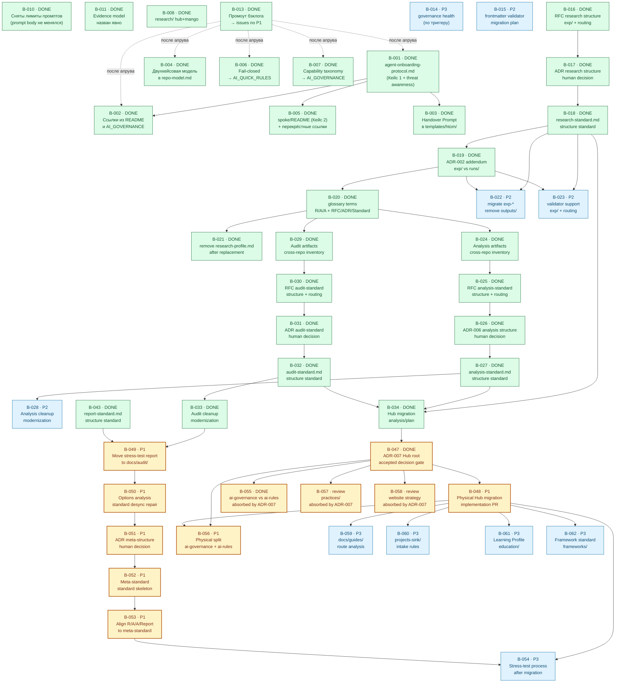

# BACKLOG — единый бэклог работ Хаба

Приоритизация, North Star и триггеры утверждены человеком в рамках задачи
**B-013** ([issue #107](https://github.com/G-Ivan-A/hybrid-Intelligence-lab/issues/107)).
По утверждённым задачам заведены отдельные issues (см. колонку «Issue» в
[разделе 2](#2-сводная-таблица-задач) и [раздел 8](#8-решение-за-человеком)).

> В этом документе используются термины из
> [standards/glossary.md](../standards/glossary.md): *Operating Mode*, *Policy*,
> *Standard*, *Practice*, *Artifact*, *Canonical*, *Draft*, *Runtime-онбординг
> (Кейс 1)*, *Bootstrap-клонирование (Кейс 2)*, *Handover Prompt*, *Readback*,
> *Среда работы агента*, *Источник контекста*, *North Star*, *Триггер
> внедрения*. Глоссарий — единственный источник истины для терминов; здесь они
> только **используются**.

---

## 1. Введение

### 1.1. Назначение документа

`backlog.md` — это **единая точка входа в запланированные работы Хаба**. Карта
артефактов ([pr-ops/artifact-map.md](artifact-map.md)) отвечает на вопрос
«*что уже есть и как связано*»; бэклог отвечает на ортогональный вопрос «*что
осталось сделать, в каком порядке и почему именно в этом*».

До этого документа задачи были рассыпаны по трём источникам, и ни один из них не
давал целостной картины:

- блоки **Follow-up** в утверждённых onboarding/bootstrap-артефактах
  ([templates/htom/README.md](../templates/htom/README.md),
  [ai-rules/agent-onboarding-protocol.md](../ai-rules/agent-onboarding-protocol.md),
  [rfc-two-cases-of-project-initialization.md](../docs/rfc/rfc-two-cases-of-project-initialization.md));
- матрица применимости рекомендаций внешних экспертов
  ([research/hub/2026-06-02-external-governance-patterns-review.md](../research/hub/2026-06-02-external-governance-patterns-review.md));
- разрозненные задачи из обсуждений (рефакторинг `research/`, лимиты
  Mango-промптов).

Бэклог **не копирует** эти источники построчно. Он их *синтезирует*: переводит
рекомендации в задачи с единой системой приоритетов, прослеживает зависимости,
выделяет критический путь и явно фиксирует, что уже сделано, а что — нет.

Документ служит двум читателям:

1. **Пользователю** — как инструмент Human Review: утвердить
   приоритеты, скорректировать порядок, дать команду заводить issues.
2. **Агенту-исполнителю** — как источник для последующего создания отдельных
   issues по маршруту «идея → задача» (но **не в этой задаче**: см.
   [раздел 6](#6-ограничения)).

### 1.2. Принцип приоритизации: «практика первична, документация растёт по факту боли»

Главный фильтр бэклога — тот же, что у матрицы применимости и Anti-Inflation
principle ([pr-ops/repo-model.md](repo-model.md)): **артефакт создаётся
только под доказанную операционную боль, а не под красоту целевой архитектуры.**

Из этого принципа выводится шкала приоритетов. Приоритет — это *не* важность
идеи «в вакууме», а ответ на вопрос «*насколько остро эта работа болит
сейчас*»:

| Приоритет | Что означает (операционально) | Правило назначения |
| --- | --- | --- |
| **P0** | Ломает действующий инвариант репозитория **прямо сейчас**. | Назначается, только если что-то уже сломано или блокирует всё остальное. |
| **P1** | Высокая ценность при низкой стоимости: либо «бесплатное» улучшение (одна фраза/поле), либо ключевое звено критического пути онбординга/bootstrap. | Делать в первую очередь после снятия P0. |
| **P2** | Ценно, но стоимость оправдана только по мере удобства или при подходе к соответствующему этапу. | Делать после P1, не блокирует критический путь. |
| **P3** | Отложено до конкретного *Триггера внедрения*. | Не делать, пока триггер не сработал. |

> ⚖️ **Ключевое следствие принципа для этого спринта.** «Практика первична»
> означает, что **уже существующая практика (валидатор структуры) должна
> работать раньше, чем мы добавляем новые governance-правила.** Поэтому
> единственная задача уровня **P0** в бэклоге — это **B-010** (снятие
> искусственных лимитов длины Mango-промптов), а не какая-либо
> «архитектурная» рекомендация команд С или Q. Это прямой, проверяемый вывод
> принципа, который ни одна из внешних команд не назвала, потому что он виден
> только изнутри репозитория (см.
> [раздел 4.3](#43-позиция-агента-исполнителя-в-чём-она-расходится-с-командами-с-и-q)).

### 1.3. Правила обновления бэклога

- **Источник обязателен.** Каждая задача ссылается на свой источник (RFC,
  команда С, команда Q, обсуждение, валидатор). Задача без трассируемого
  источника не добавляется.
- **Статус отражает факт, а не план.** `DONE` ставится только для работ, уже
  выполненных в репозитории (проверяемо через `git`/валидатор), а не «почти
  готово». Это та же дисциплина, что у [artifact-map.md](artifact-map.md):
  карта отражает фактическое состояние.
- **Новая задача — под боль.** Прежде чем добавить строку, ответь: какую
  повторяющуюся путаницу, review pain, ownership gap или невоспроизводимость она
  снижает (Anti-Inflation principle).
- **Без инфляции файлов.** Бэклог — это **один файл**. Идеи новых артефактов
  живут *строками таблицы*, а не новыми пустыми файлами.
- **Пересмотр — по триггеру, а не по календарю.** Условия возврата к бэклогу —
  в [разделе 7](#7-триггеры-для-пересмотра-бэклога).
- **После изменения** — обнови поле `updated` во frontmatter и прогони локальные
  проверки (`./tools/validate-frontmatter.sh .` и
  `./tools/validate-repository-structure.sh`).

---

## Открытые вопросы

Единый трекер открытых вопросов из
[`pr-ops/session-digests.md`](session-digests.md). При создании нового
дайджеста вопросы из блока «Открытые вопросы» добавляются сюда. Если вопрос уже
есть, строка не дублируется: новая ссылка добавляется в колонку «Связанные
дайджесты».

| Дата | Источник | Суть | Статус | Связанные дайджесты | Связанный артефакт |
| --- | --- | --- | --- | --- | --- |
| 2026-06-13 | session-digest: [2026-06-13](session-digests.md#2026-06-13--архитектура-документации-и-баланс-anti-inflation-vs-атомарность) | Когда переходить к графовой структуре знаний вместо плоского индекса. | open | [session-digests.md#2026-06-13](session-digests.md#2026-06-13--архитектура-документации-и-баланс-anti-inflation-vs-атомарность) | — |
| 2026-06-13 | session-digest: [2026-06-13](session-digests.md#2026-06-13--архитектура-документации-и-баланс-anti-inflation-vs-атомарность) | Как фиксировать связи между атомами без дублирования метаданных и нарушения Anti-Inflation. | open | [session-digests.md#2026-06-13](session-digests.md#2026-06-13--архитектура-документации-и-баланс-anti-inflation-vs-атомарность) | [draft-triage-and-exit-plan.md](../docs/rfc/draft-triage-and-exit-plan.md) |

---

## 2. Сводная таблица задач

Минимум 10 задач. Колонка «Источник» обеспечивает трассируемость (🔗). Статусы:
`TODO` — не начато; `review` — выполнено в PR и ожидает review; `DONE` —
выполнено в репозитории; `ЧАСТИЧНО` — выполнено частично. Для `DONE` строк в
скобках указан текущий lifecycle-статус связанного артефакта из frontmatter
(`artifact: ...` / `artifacts: ...`) либо явное отсутствие frontmatter у script.

| ID | Название | Приоритет | Зависимости | Статус | Issue | Источник | Обоснование приоритета |
| --- | --- | --- | --- | --- | --- | --- | --- |
| **B-010** | Снять лимиты длины Mango-промптов; промпты не менять | **P0** | — | DONE (script: no frontmatter) | [#105](https://github.com/G-Ivan-A/hybrid-Intelligence-lab/issues/105) | Issue #105; [validator](../tools/validate-repository-structure.sh) | Искусственный лимит ограничивал prompt body; инвариант восстановлен снятием лимита, без правки промптов. |
| **B-001** | Создать `ai-rules/agent-onboarding-protocol.md` (Кейс 1, вкл. threat awareness) | **P1** | — | DONE (artifact: canonical) | [#109](https://github.com/G-Ivan-A/hybrid-Intelligence-lab/issues/109) | RFC-онбординг; RFC-два-кейса (follow-up #3); Q «взять сейчас» | Краеугольный артефакт *Runtime-онбординга* и старт критического пути; правило «новый агент → начни здесь» имеет canonical-адрес. |
| **B-002** | Связать онбординг ссылками из `README.md` Хаба и `AI_GOVERNANCE.md` | **P1** | B-001 | DONE (artifacts: canonical/canonical) | [#110](https://github.com/G-Ivan-A/hybrid-Intelligence-lab/issues/110) | RFC-два-кейса (follow-up #5); RFC-онбординг | Дёшево и замыкает точку входа: README и AI_GOVERNANCE указывают на onboarding. |
| **B-004** | Зафиксировать двухкейсовую модель инициализации в `pr-ops/repo-model.md` | **P1** | — | DONE (artifact: canonical) | [#111](https://github.com/G-Ivan-A/hybrid-Intelligence-lab/issues/111) | RFC-два-кейса (follow-up #2) | Закрепляет концептуальный фундамент в каноне; снижает риск повторной терминологической путаницы (ошибка №5 ретроспективы). |
| **B-006** | Fail-closed semantics одной фразой → `templates/htom/AI_QUICK_RULES.md` | **P1** | — | DONE (artifact: draft) | [#112](https://github.com/G-Ivan-A/hybrid-Intelligence-lab/issues/112) | Q «взять сейчас»; С [C5]; [EGA] | «Бесплатно» (одна фраза), прямо снижает риск галлюцинаций агента уже сегодня. |
| **B-007** | Простая capability taxonomy (3 корзины) → `templates/htom/AI_GOVERNANCE.md` | **P1** | — | DONE (artifact: draft) | [#113](https://github.com/G-Ivan-A/hybrid-Intelligence-lab/issues/113) | Q «взять сейчас»; С [C5]; [GAP] | «Бесплатно» (3 строки прозой), даёт агенту ясные границы без машинерии. |
| **B-003** | Продублировать *Handover Prompt* в `templates/htom/` | **P2** | B-001 | DONE (artifact: draft) | [#114](https://github.com/G-Ivan-A/hybrid-Intelligence-lab/issues/114) | RFC-онбординг | Полезно для самодостаточности спока, но не блокирует критический путь. |
| **B-005** | Дополнить `templates/htom/README.md` (Кейс 2) + перекрёстные ссылки README | **P2** | B-001 | DONE (artifact: canonical) | [#115](https://github.com/G-Ivan-A/hybrid-Intelligence-lab/issues/115) | RFC-два-кейса (follow-up #4, #5) | Завершает «обе точки входа ссылаются друг на друга»; полезно для будущих bootstrap-спринтов. |
| **B-011** | Явно назвать Evidence model в RFC-манифесте | **P2** | — | DONE (artifact: accepted) | [#116](https://github.com/G-Ivan-A/hybrid-Intelligence-lab/issues/116) | Q «взять сейчас»; С [C5]; [GAP] | Evidence trail явно назван в RFC-манифесте и связан ссылкой с external-review. |
| **B-008** | Рефакторинг `research/` (разделение `hub/` и `mango/`) | **P1** | — | DONE (artifacts: canonical/canonical) | [#91](https://github.com/G-Ivan-A/hybrid-Intelligence-lab/issues/91) | Обсуждение §5 | Выполнено в предыдущих PR; зафиксировано как факт для целостности картины. |
| **B-013** | 💡 Промоут `backlog.md` в `canonical` и завести issues по утверждённым P1 | **P1** | (этот PR) | DONE (artifact: canonical) | [#107](https://github.com/G-Ivan-A/hybrid-Intelligence-lab/issues/107) | Креативное улучшение агента-исполнителя | Замыкает маршрут «бэклог → issues»; без него бэклог остаётся планом без исполнения. |
| **B-014** | 💡 Лёгкий «governance health»: регулярный прогон валидаторов + мониторинг триггеров | **P3** | — | TODO | — (отложено) | Креативное улучшение агента-исполнителя | Ценно, но боль возникнет позже; внедряется по триггеру, не сейчас. |
| **B-015** | RFC: Валидатор frontmatter, миграция статусов и approved list | **P2** | RFC/ADR structure standards | TODO | — (tech debt) | [Ripple Effects 282](../research/hub/2026-06-28-ripple-effects-282-research.md); issue [#286](https://github.com/G-Ivan-A/hybrid-Intelligence-lab/issues/286) | Нужен отдельный RFC/implementation path для routing, status migration, approved fields and CI modes; issue #286 сознательно не меняет validator/migration rules. |
| **B-016** | RFC: Структура research, контейнер `exp/` и маршрутизация Research/Analysis/Audit | **P0** | — | DONE (artifact: accepted) | [#302](https://github.com/G-Ivan-A/hybrid-Intelligence-lab/issues/302) (PR [#303](https://github.com/G-Ivan-A/hybrid-Intelligence-lab/pull/303); accepted через ADR-003: issue [#322](https://github.com/G-Ivan-A/hybrid-Intelligence-lab/issues/322), PR [#323](https://github.com/G-Ivan-A/hybrid-Intelligence-lab/pull/323)) | Issue [#294](https://github.com/G-Ivan-A/hybrid-Intelligence-lab/issues/294); issue [#290](https://github.com/G-Ivan-A/hybrid-Intelligence-lab/issues/290); issue [#288](https://github.com/G-Ivan-A/hybrid-Intelligence-lab/issues/288) | Запустил согласованную цепочку Research → RFC → ADR → Standard и снял неоднозначность `exp-*`/`outputs` vs `runs/` на proposal/decision level. |
| **B-017** | ADR: Принять стандарт структуры research | **P0** | B-016 | DONE (artifact: accepted) | [#314](https://github.com/G-Ivan-A/hybrid-Intelligence-lab/issues/314) (PR [#315](https://github.com/G-Ivan-A/hybrid-Intelligence-lab/pull/315); ADR-003 accepted: issue [#322](https://github.com/G-Ivan-A/hybrid-Intelligence-lab/issues/322), PR [#323](https://github.com/G-Ivan-A/hybrid-Intelligence-lab/pull/323)) | Issue [#294](https://github.com/G-Ivan-A/hybrid-Intelligence-lab/issues/294); RFC B-016 | Фиксирует human decision до стандарта; обязательное правило делегировано в B-018/B-019. |
| **B-018** | Создать `standards/research-standard.md` как стандарт структуры research | **P0** | B-017 | DONE (artifact: draft) | [#318](https://github.com/G-Ivan-A/hybrid-Intelligence-lab/issues/318) (PR [#319](https://github.com/G-Ivan-A/hybrid-Intelligence-lab/pull/319)) | Issue [#294](https://github.com/G-Ivan-A/hybrid-Intelligence-lab/issues/294); ADR-003 (B-017) | Заменяет профиль полноценным стандартом: `research/`, `exp/`, запрет `outputs`, routing по типам задач. |
| **B-019** | ADR-002 addendum: граница `exp/` vs `runs/` | **P0** | B-018 | DONE (artifact: accepted) | [#326](https://github.com/G-Ivan-A/hybrid-Intelligence-lab/issues/326) (PR [#327](https://github.com/G-Ivan-A/hybrid-Intelligence-lab/pull/327)) | Issue [#294](https://github.com/G-Ivan-A/hybrid-Intelligence-lab/issues/294); [ADR-002](../docs/adr/2026-06-adr-002-artifact-document-methodology.md); issue [#290](https://github.com/G-Ivan-A/hybrid-Intelligence-lab/issues/290) | Устраняет коллизию между research evidence corpus и operational run record. |
| **B-020** | Обновить `standards/glossary.md`: Research / Analysis / Audit / RFC / ADR / Standard | **P1** | B-019 | DONE (artifact: accepted) | [#336](https://github.com/G-Ivan-A/hybrid-Intelligence-lab/issues/336) (PR [#337](https://github.com/G-Ivan-A/hybrid-Intelligence-lab/pull/337)) | Issue [#294](https://github.com/G-Ivan-A/hybrid-Intelligence-lab/issues/294); issue [#288](https://github.com/G-Ivan-A/hybrid-Intelligence-lab/issues/288) | Терминологическая граница закреплена в glossary: Research, Analysis, Audit, RFC, ADR, Standard разведены по функции артефакта и связаны с routing/lifecycle. |
| **B-021** | Удалить `standards/research-profile.md` после замены стандартом | **P1** | B-020 | DONE (replacement artifact: draft) | [#340](https://github.com/G-Ivan-A/hybrid-Intelligence-lab/issues/340) (PR [#341](https://github.com/G-Ivan-A/hybrid-Intelligence-lab/pull/341)) | Issue [#294](https://github.com/G-Ivan-A/hybrid-Intelligence-lab/issues/294); legacy `standards/research-profile.md`, replacement `standards/research-standard.md` | Убирает конкурирующий источник истины; требует CHANGELOG entry и проверки ссылок. |
| **B-022** | Мигрировать существующие `exp-*` в контейнер `exp/`, убрать `outputs/` | **P2** | B-018, B-019 | TODO | — (tech debt) | Issue [#294](https://github.com/G-Ivan-A/hybrid-Intelligence-lab/issues/294); issue [#290](https://github.com/G-Ivan-A/hybrid-Intelligence-lab/issues/290); текущие `research/hub/exp-*` | Физическая миграция полезна, но должна идти после стандарта, чтобы не закрепить новый дрейф. |
| **B-023** | Обновить валидатор структуры под `exp/` и routing по типам задач | **P2** | B-018, B-019 | TODO | — (tech debt) | Issue [#294](https://github.com/G-Ivan-A/hybrid-Intelligence-lab/issues/294); `tools/validate-repository-structure.sh`; `tools/validate-file-naming.sh` | Делает новый стандарт исполнимым после human decision; не должен предвосхищать стандарт. |
| **B-024** | analysis: Сквозной анализ артефактов Analysis (Хаб, Mango, Clarify) | **P0** | B-020 | DONE (artifact: draft) | [#342](https://github.com/G-Ivan-A/hybrid-Intelligence-lab/issues/342) (PR [#343](https://github.com/G-Ivan-A/hybrid-Intelligence-lab/pull/343)) | Issue [#296](https://github.com/G-Ivan-A/hybrid-Intelligence-lab/issues/296); issue [#288](https://github.com/G-Ivan-A/hybrid-Intelligence-lab/issues/288); B-020; [Analysis inventory](../docs/analysis/2026-07-02-analysis-artifacts-inventory.md); [evidence](../research/hub/exp/analysis-inventory-342/README.md) | Даёт входные данные для `analysis-standard.md`: фактические Analysis-артефакты, подмены понятий, дубли и кандидаты на модернизацию. PR #343 merged; cleanup не выполнялся. |
| **B-025** | rfc: Структура Analysis-артефактов (базовый стандарт + профили подтипов + routing) | **P0** | B-024 | DONE (artifact: accepted) | [#350](https://github.com/G-Ivan-A/hybrid-Intelligence-lab/issues/350) (PR [#351](https://github.com/G-Ivan-A/hybrid-Intelligence-lab/pull/351)) | Issue [#296](https://github.com/G-Ivan-A/hybrid-Intelligence-lab/issues/296); [Analysis inventory](../docs/analysis/2026-07-02-analysis-artifacts-inventory.md) (B-024); [Audit deep analysis](../docs/analysis/2026-07-02-audit-artifacts-deep-analysis.md) (B-029); [RFC Reports](../docs/rfc/2026-07-02-rfc-reports-structure.md) (B-041); `standards/rfc-structure-standard.md`; ADR-001/ADR-002 | RFC ([docs/rfc/2026-07-02-rfc-analysis-structure.md](../docs/rfc/2026-07-02-rfc-analysis-structure.md), status `accepted` через [ADR-006](../docs/adr/2026-07-adr-006-analysis-structure.md)) — proposal-вход цепочки Analysis после инвентаризации B-024: фиксирует Вариант C (базовый стандарт Analysis + лёгкие профили `inventory`/`matrix`/`options`/`recommendation`), routing `docs/analysis/`, relation-метаданные, knowledge-lifecycle и границы Analysis ↔ Research ↔ Audit ↔ Report ↔ RFC ↔ ADR; decision gate (B-026) принят человеком в ADR-006. Стандарт/ADR не создаются, миграция не выполняется. PR #351 merged. Зеркалит цепочку Reports (B-041). |
| **B-026** | adr: Принятие структуры Analysis (Вариант C RFC B-025) | **P0** | B-025 | DONE (artifact: accepted) | [#357](https://github.com/G-Ivan-A/hybrid-Intelligence-lab/issues/357) (PR [#360](https://github.com/G-Ivan-A/hybrid-Intelligence-lab/pull/360)) | Issue [#296](https://github.com/G-Ivan-A/hybrid-Intelligence-lab/issues/296); RFC B-025 ([docs/rfc/2026-07-02-rfc-analysis-structure.md](../docs/rfc/2026-07-02-rfc-analysis-structure.md)); [ADR-006](../docs/adr/2026-07-adr-006-analysis-structure.md); `standards/adr-structure-standard.md` | Human decision gate выполнен: принят Вариант C (базовый стандарт Analysis + лёгкие профили `inventory`/`matrix`/`options`/`recommendation`), подтверждены routing `docs/analysis/`, relation-frontmatter, knowledge-lifecycle и границы Analysis ↔ Research ↔ Audit ↔ Report; Open Questions RFC B-025 закрыты делегированием в B-027/B-028/B-034; разблокирована B-027. Стандарт не создаётся, файлы не мигрируются. Зеркалит B-042/B-031. |
| **B-027** | chore: Создание `standards/analysis-standard.md` | **P0** | B-026 | DONE (artifact: draft) | [#366](https://github.com/G-Ivan-A/hybrid-Intelligence-lab/issues/366) (PR [#369](https://github.com/G-Ivan-A/hybrid-Intelligence-lab/pull/369)) | Issue [#296](https://github.com/G-Ivan-A/hybrid-Intelligence-lab/issues/296); [ADR-006](../docs/adr/2026-07-adr-006-analysis-structure.md) (B-026); RFC B-025 ([docs/rfc/2026-07-02-rfc-analysis-structure.md](../docs/rfc/2026-07-02-rfc-analysis-structure.md)) | Нормативно зафиксирован базовый каркас Analysis как **interpretation layer** + опциональные профили подтипов (`inventory`/`matrix`/`options`/`recommendation`) как секции, relation-frontmatter, routing `docs/analysis/`, knowledge-lifecycle, триггер B (anti-inflation) и границы Analysis ↔ Research ↔ Audit ↔ Report ↔ RFC ↔ ADR. PR #369 merged. |
| **B-028** | chore: Cleanup и модернизация Analysis-артефактов | **P2** | B-027 | TODO | — (tech debt) | Issue [#296](https://github.com/G-Ivan-A/hybrid-Intelligence-lab/issues/296); analysis-аудит B-024; `standards/analysis-standard.md` | Пост-standard cleanup: убрать дубли, обновить frontmatter/cross-references и индексы без преждевременной миграции. |
| **B-029** | analysis: Сквозной анализ артефактов Audit (Хаб, Mango, Clarify) | **P0** | B-020 | DONE (artifact: draft) | [#344](https://github.com/G-Ivan-A/hybrid-Intelligence-lab/issues/344) (PR [#347](https://github.com/G-Ivan-A/hybrid-Intelligence-lab/pull/347)) | Issue [#296](https://github.com/G-Ivan-A/hybrid-Intelligence-lab/issues/296); issue [#288](https://github.com/G-Ivan-A/hybrid-Intelligence-lab/issues/288); issue [#290](https://github.com/G-Ivan-A/hybrid-Intelligence-lab/issues/290); B-020; [B-024 Analysis inventory](../docs/analysis/2026-07-02-analysis-artifacts-inventory.md); [Audit deep analysis](../docs/analysis/2026-07-02-audit-artifacts-deep-analysis.md); [B-024 matrix](../research/hub/exp/analysis-inventory-342/2026-07-02-analysis-artifact-matrix.md) | Даёт входные данные для `audit-standard.md`: 29 Audit-кандидатов, compliance targets, evidence/deviation models, masked audits and B-033 modernization candidates. Cleanup не выполнялся. |
| **B-030** | rfc: Стандарт структуры Audit | **P0** | B-029 | DONE (artifact: draft) | [#352](https://github.com/G-Ivan-A/hybrid-Intelligence-lab/issues/352) (PR [#353](https://github.com/G-Ivan-A/hybrid-Intelligence-lab/pull/353)) | Issue [#296](https://github.com/G-Ivan-A/hybrid-Intelligence-lab/issues/296); [Audit deep analysis](../docs/analysis/2026-07-02-audit-artifacts-deep-analysis.md) (B-029); [RFC](../docs/rfc/2026-07-02-rfc-audit-structure.md); `standards/rfc-structure-standard.md`; ADR-001/ADR-002 | Proposal-stage для Audit: Вариант C (базовый стандарт Audit + 4-компонентная модель compliance target / evidence model / verdict-finding / deviation handling), routing `docs/audit/`, разграничение Audit-процесс vs audit-report output (координация с Reports B-043) и границы Audit ↔ Research ↔ Analysis ↔ Report (delegate на B-029). PR #353 merged; decision gate выполнен в B-031. |
| **B-031** | adr: Принятие `audit-standard` | **P0** | B-030 | DONE (artifact: accepted) | [#358](https://github.com/G-Ivan-A/hybrid-Intelligence-lab/issues/358) (PR [#361](https://github.com/G-Ivan-A/hybrid-Intelligence-lab/pull/361)) | Issue [#296](https://github.com/G-Ivan-A/hybrid-Intelligence-lab/issues/296); RFC B-030 ([docs/rfc/2026-07-02-rfc-audit-structure.md](../docs/rfc/2026-07-02-rfc-audit-structure.md)); [ADR-005](../docs/adr/2026-07-adr-005-audit-structure.md); [ADR-004](../docs/adr/2026-07-adr-004-reports-structure.md); `standards/adr-structure-standard.md` | Human decision gate выполнен: принят Вариант C из RFC B-030 (базовый стандарт Audit + 4-компонентная модель compliance target / evidence model / verdict-finding / deviation handling), подтверждён routing `docs/audit/`, frontmatter с audit-specific метаданными, knowledge-lifecycle и разграничение Audit-процесс (B-032) vs audit-report output (B-043); open questions RFC B-030 закрыты/делегированы (физический дом audit reports уже решён в ADR-004 v0.3). Разблокирована B-032. Зеркалит B-026/B-042. |
| **B-032** | chore: Создание `standards/audit-standard.md` | **P0** | B-031 | DONE (artifact: draft) | [#362](https://github.com/G-Ivan-A/hybrid-Intelligence-lab/issues/362) (PR [#363](https://github.com/G-Ivan-A/hybrid-Intelligence-lab/pull/363)) | Issue [#296](https://github.com/G-Ivan-A/hybrid-Intelligence-lab/issues/296); [ADR-005](../docs/adr/2026-07-adr-005-audit-structure.md) (B-031); RFC B-030 ([docs/rfc/2026-07-02-rfc-audit-structure.md](../docs/rfc/2026-07-02-rfc-audit-structure.md)) | Нормативно фиксирует базовый каркас Audit + **4-компонентную модель** (`compliance target`/`evidence model`/`verdict-finding`/`deviation handling`), audit-specific frontmatter (`audit_target`/`evidence_model`/`verdict` обязательны; `severity_scale`/`follow_up`/`related_norm` опциональны), routing `docs/audit/`, knowledge-lifecycle (`draft → reviewed → canonical → superseded`), разграничение Audit-процесс vs audit-report output (B-043) и границы Audit ↔ Research ↔ Analysis ↔ Report; разблокирован после ADR-005. Prerequisite для плана миграции репо (B-034) и cleanup Audit-артефактов (B-033). PR #363 merged. Зеркалит B-027/B-043. |
| **B-033** | chore: Cleanup и модернизация Audit-артефактов | **P2** | B-032 | DONE (artifacts: draft/draft/draft) | [#367](https://github.com/G-Ivan-A/hybrid-Intelligence-lab/issues/367) (PR [#368](https://github.com/G-Ivan-A/hybrid-Intelligence-lab/pull/368)) | Issue [#296](https://github.com/G-Ivan-A/hybrid-Intelligence-lab/issues/296); audit-аудит B-029; `standards/audit-standard.md` | Local Hub `docs/audit/` artifacts модернизированы под Audit-frontmatter/section core, legacy suffix-date filename переименован, validators and indexes updated; broad repo migration and external Mango/Clarify snapshots deferred. PR #368 merged. |
| **B-034** | analysis: План миграции репо Хаба после стандартов Research/Analysis/Audit | **P1** | B-018, B-027, B-032 | DONE (artifact: draft) | [#372](https://github.com/G-Ivan-A/hybrid-Intelligence-lab/issues/372) (PR [#373](https://github.com/G-Ivan-A/hybrid-Intelligence-lab/pull/373)) | Issue [#296](https://github.com/G-Ivan-A/hybrid-Intelligence-lab/issues/296); ADR-001/ADR-002; R/A/A standards | Scope B-034 уточнён как анализ/план: upstream document-plan [docs/analysis/2026-07-04-hub-migration-and-root-structure-plan.md](../docs/analysis/2026-07-04-hub-migration-and-root-structure-plan.md) нашёл источник истины (ADR-001 + ADR-002), целевую архитектуру корня, provisional-механизм и As-Is → To-Be матрицу. Decision gate и физическая миграция вынесены в B-047/B-048. |
| **B-035** | Реорганизация `backlog.md` в каталог `pr-ops/backlog/` (contract + active + archive) | **P3** | B-016..B-023, B-034 | TODO | — (tech debt) | Согласование в чате 2026-06-30; issue [#297](https://github.com/G-Ivan-A/hybrid-Intelligence-lab/issues/297) | Текущий монолитный бэклог функционален. Реорганизация — гигиеническая задача после стабилизации research/analysis/audit цепочек. Триггер повышения до P1 — review pain из-за размера бэклога. |
| **B-036** | Зафиксировать 3-tier amendment policy в `AI_GOVERNANCE.md` | **P2** | — | TODO | — (tech debt) | Согласование в чате 2026-06-30; issue [#297](https://github.com/G-Ivan-A/hybrid-Intelligence-lab/issues/297); [docs/analysis/2026-06-30-backlog-and-artifact-change-policy-analysis.md](../docs/analysis/2026-06-30-backlog-and-artifact-change-policy-analysis.md) | Блокирует корректное выполнение Tier 1/2 правок без бюрократии. Без policy агент будет либо игнорировать малые правки (дрейф), либо запускать полный цикл RFC→ADR на каждое уточнение (паралич). |
| **B-037** | Обновить `validate-repository-structure.sh` под каталог `pr-ops/backlog/` (2FA-исключение) | **P3** | B-035 | TODO | — (tech debt) | Согласование в чате 2026-06-30; [tools/validate-repository-structure.sh](../tools/validate-repository-structure.sh) | Делает новую структуру бэклога исполнимой. Выполняется после физической реорганизации. |
| **B-038** | analysis: Инвентаризация и границы Reports-артефактов (аудит / отчёт / статистика) | **P1** | B-020 | DONE (artifacts: draft/draft) | [#307](https://github.com/G-Ivan-A/hybrid-Intelligence-lab/issues/307) (PR [#308](https://github.com/G-Ivan-A/hybrid-Intelligence-lab/pull/308)); [#310](https://github.com/G-Ivan-A/hybrid-Intelligence-lab/issues/310) (PR [#312](https://github.com/G-Ivan-A/hybrid-Intelligence-lab/pull/312)) | Видение фаундера §3 ([research/hub/2026-06-23-repository-structure-concept.md](../research/hub/2026-06-23-repository-structure-concept.md)); согласование в чате 2026-07-01; [Reports inventory](../docs/analysis/2026-07-01-reports-artifacts-inventory.md); [placement report](../docs/report/2026-07-01-reports-inventory-placement-analysis.md) | Reports — базовый подкаталог `docs/`; канонический путь зафиксирован как `docs/report/` (единственное число) по видению фаундера §3 и review PR #312. Inventory готовит границы с Analysis/Audit и scope будущего стандарта перед планом миграции репо (B-034). |
| **B-039** | audit: Проверка документации на коллизии интерпретации стандартов RFC/ADR/Standard | **P1** | B-017, B-018 | DONE (artifacts: draft/draft) | [#320](https://github.com/G-Ivan-A/hybrid-Intelligence-lab/issues/320) (PR [#321](https://github.com/G-Ivan-A/hybrid-Intelligence-lab/pull/321)) | Root-cause отчёт [docs/report/2026-07-01-rfc-adr-duplication-analysis.md](../docs/report/2026-07-01-rfc-adr-duplication-analysis.md) (issue #316); `standards/adr-structure-standard.md`, `standards/rfc-structure-standard.md`, `standards/glossary.md`; [audit](../docs/audit/2026-07-01-documentation-boundary-audit.md) | Аудит 5 IL-3 артефактов на дублирование, proposal-обёртку и смешение словарей по трём измерениям. Вердикты без блокеров (ADR-003 ремедиирован); зафиксированы причины (смешение терминов Standard/Contract, шаблон ADR, отсутствие overlap-guard) vs последствия и трёхуровневые рекомендации по лечению причин. Правки артефактов/стандартов — отдельные задачи (Tier 2). |
| **B-040** | adr + standard: Принять ADR-003 и устранить причинные дефекты стандартов | **P0** | B-039, B-017, B-018 | DONE (artifacts: accepted/draft) | [#322](https://github.com/G-Ivan-A/hybrid-Intelligence-lab/issues/322) (PR [#323](https://github.com/G-Ivan-A/hybrid-Intelligence-lab/pull/323)) | [audit](../docs/audit/2026-07-01-documentation-boundary-audit.md); ADR-003; RFC B-016; `standards/adr-structure-standard.md`; `standards/rfc-structure-standard.md`; `standards/research-standard.md` | Tier 2 remediation причин F-01/F-07/F-07-parallel/F-08: Standard≠Contract, section-level delegation, Research→RFC delegation, metadata placeholder update rule and ADR acceptance checklist. |
| **B-041** | rfc: Структура Reports-артефактов (базовый стандарт + профили подтипов + routing) | **P1** | B-038 | DONE (artifact: accepted) | [#328](https://github.com/G-Ivan-A/hybrid-Intelligence-lab/issues/328) (PR [#329](https://github.com/G-Ivan-A/hybrid-Intelligence-lab/pull/329)) | [Reports inventory](../docs/analysis/2026-07-01-reports-artifacts-inventory.md) (B-038); [Reports industry norms](../research/hub/2026-06-30-reports-industry-norms-and-standardization-scope.md); Видение фаундера §3 ([research/hub/2026-06-23-repository-structure-concept.md](../research/hub/2026-06-23-repository-structure-concept.md)); `standards/rfc-structure-standard.md` | RFC — proposal-вход цепочки стандартизации Reports после инвентаризации B-038: фиксирует Вариант C (базовый стандарт Report + лёгкие профили `audit`/`report`/`statistics`), канонический routing `docs/report/`, relation-метаданные и границы Reports ↔ Analysis ↔ Audit; выносит decision gate (B-042) человеку перед нормативным стандартом (B-043). Зеркалит цепочки Analysis (B-025) и Audit (B-030). |
| **B-042** | adr: Принятие структуры Reports + реконсиляция routing ADR-002 (`docs/reports/` → `docs/report/`) | **P1** | B-041 | DONE (artifact: accepted) | [#338](https://github.com/G-Ivan-A/hybrid-Intelligence-lab/issues/338) (PR [#339](https://github.com/G-Ivan-A/hybrid-Intelligence-lab/pull/339)) | Issue [#338](https://github.com/G-Ivan-A/hybrid-Intelligence-lab/issues/338); RFC B-041 ([docs/rfc/2026-07-02-rfc-reports-structure.md](../docs/rfc/2026-07-02-rfc-reports-structure.md)); [ADR-004](../docs/adr/2026-07-adr-004-reports-structure.md); [ADR-002](../docs/adr/2026-06-adr-002-artifact-document-methodology.md); `standards/adr-structure-standard.md` | Human decision gate выполнен: принят Вариант C и канонический `docs/report/`, строка routing ADR-002 (`docs/reports/` → `docs/report/`) реконсилирована как single decision source перед нормативным стандартом. Зеркалит B-026/B-031. |
| **B-043** | chore: Создание `standards/report-standard.md` (базовый стандарт Report + профили подтипов) | **P1** | B-042 | DONE (artifact: draft) | [#354](https://github.com/G-Ivan-A/hybrid-Intelligence-lab/issues/354) (PR [#355](https://github.com/G-Ivan-A/hybrid-Intelligence-lab/pull/355)) | Issue [#328](https://github.com/G-Ivan-A/hybrid-Intelligence-lab/issues/328); [ADR-004](../docs/adr/2026-07-adr-004-reports-structure.md) (B-042); RFC B-041 ([docs/rfc/2026-07-02-rfc-reports-structure.md](../docs/rfc/2026-07-02-rfc-reports-structure.md)); [Reports industry norms §12](../research/hub/2026-06-30-reports-industry-norms-and-standardization-scope.md) | Нормативно фиксирует базу + профили `audit`/`report`/`statistics`, frontmatter с relation-метаданными, lifecycle (draft → reviewed → canonical → superseded) и routing split (`docs/report/` + `docs/audit/`); разблокирована после ADR-004. Prerequisite для cleanup Reports-артефактов (B-044). Зеркалит B-027/B-032. |
| **B-044** | chore: Cleanup и модернизация Reports-артефактов (миграция кандидатов в `docs/report/`) | **P2** | B-043, B-034 | TODO | — (tech debt) | Issue [#328](https://github.com/G-Ivan-A/hybrid-Intelligence-lab/issues/328); [Reports inventory §5](../docs/analysis/2026-07-01-reports-artifacts-inventory.md); будущий standard B-043; план миграции репо B-034 | Пост-standard cleanup: обновить frontmatter (`report-subtype`, relation-поля), убрать дубли/замаскированные отчёты, cross-references, artifact-map и индексы; координируется с планом миграции репо (B-034). Зеркалит B-028/B-033. |
| **B-045** | research: Режимы выполнения задач для ИИ-агентов — индустриальные нормы и паттерны классификации | **P1** | B-016, B-018 | DONE (artifact: draft) | [#330](https://github.com/G-Ivan-A/hybrid-Intelligence-lab/issues/330) (PR [#331](https://github.com/G-Ivan-A/hybrid-Intelligence-lab/pull/331)) | Видение фаундера ([research/hub/2026-06-23-repository-structure-concept.md](../research/hub/2026-06-23-repository-structure-concept.md)); `standards/glossary.md` (Operating Mode); [research-отчёт](../research/hub/2026-07-02-task-execution-modes-research.md); [experiment](../research/hub/exp/task-execution-modes-330/README.md) | Research + Creative + Deep Think от лица 4 экспертов: индустриальные нормы (Cynefin/Bloom/Cognitive Load, ReAct/Reflexion/Plan-and-Solve, CrewAI/LangGraph/MetaGPT/AutoGPT, guardrails/evals/HITL), паттерны Hub/Mango и 5 реальных тестов (rule-based классификатор v1→v2). Подтверждает триаду Creative/Structured/Hybrid и action-anchored сигнал как решающий вход. Без предложения решений, новых режимов и стандартов — только исследование, паттерны, тесты, выводы. |
| **B-046** | chore: Синхронизировать `pr-ops/backlog.md` с фактическими статусами артефактов | **P1** | — | DONE (artifact: canonical) | [#364](https://github.com/G-Ivan-A/hybrid-Intelligence-lab/issues/364) (PR [#365](https://github.com/G-Ivan-A/hybrid-Intelligence-lab/pull/365)) | Issue [#364](https://github.com/G-Ivan-A/hybrid-Intelligence-lab/issues/364); artifact frontmatter statuses; this backlog | Предыдущий sync закрыт: статусы на момент PR #365 сверены с artifact frontmatter and merged PRs, без миграции файлов и без изменения внешних артефактов. |
| **B-047** | adr: Целевая структура корня Хаба и provisional-механизм | **P1** | B-034 | DONE (artifact: accepted) | [#378](https://github.com/G-Ivan-A/hybrid-Intelligence-lab/issues/378) (PR [#379](https://github.com/G-Ivan-A/hybrid-Intelligence-lab/pull/379)); refinement [#382](https://github.com/G-Ivan-A/hybrid-Intelligence-lab/issues/382) (PR [#383](https://github.com/G-Ivan-A/hybrid-Intelligence-lab/pull/383)) | Issue [#378](https://github.com/G-Ivan-A/hybrid-Intelligence-lab/issues/378); issue [#382](https://github.com/G-Ivan-A/hybrid-Intelligence-lab/issues/382); B-034 document-plan; ADR-001/ADR-002; founder decision 2026-07-04; [ADR-007](../docs/adr/2026-07-adr-007-hub-root-structure.md) | Decision gate перед физической миграцией: ADR-007 фиксирует целевую структуру корня Хаба, `projects-sink/`, границу `ai-governance/` vs `ai-rules/`, root `practices/`, `docs/guides/`, `education/`, `frameworks/`, `docs/concept.md`, retirement `website/`/`mkdocs.yml`/`experiments/`, provisional-standards через lifecycle и стратегию B-048. Issue #382 adds the full To-Be tree (ADR-001 core + ADR-007 delta) without physical migration. |
| **B-048** | chore: Физическая миграция репо Хаба по принятой ADR-007 | **P1** | B-047 | DONE | [#384](https://github.com/G-Ivan-A/hybrid-Intelligence-lab/issues/384) (PR [#388](https://github.com/G-Ivan-A/hybrid-Intelligence-lab/pull/388)) | Issue [#374](https://github.com/G-Ivan-A/hybrid-Intelligence-lab/issues/374); issue [#376](https://github.com/G-Ivan-A/hybrid-Intelligence-lab/issues/376); issue [#378](https://github.com/G-Ivan-A/hybrid-Intelligence-lab/issues/378); accepted ADR-007/B-047 | Implementation path after accepted ADR-007: file moves, link rewrites, validator/nav updates and rollback-safe sequencing. Phase 4 (Reconcile 🟡) is one task, not "one catalog = one PR"; integrity stress-test happens inside that PR before review. Выполнено: `governance/` разделён на `ai-governance/`/`ai-rules/`/`pr-ops/`/`docs/rfc/`, созданы `projects-sink/` и `docs/guides/`, `CONCEPT.md` → `docs/concept.md`, удалены `website/`/`mkdocs.yml`/`deploy-docs.yml`/`experiments/` (тесты → `tools/`), ссылки и валидаторы синхронизированы, integrity stress-test пройден внутри PR. |
| **B-049** | audit: Переместить отчёт кросс-стресс-тестов в `docs/audit/` и модернизировать frontmatter | **P1** | B-033, B-043 | DONE | [#396](https://github.com/G-Ivan-A/hybrid-Intelligence-lab/issues/396) (PR [#397](https://github.com/G-Ivan-A/hybrid-Intelligence-lab/pull/397)) | Issue [#396](https://github.com/G-Ivan-A/hybrid-Intelligence-lab/issues/396); issue [#374](https://github.com/G-Ivan-A/hybrid-Intelligence-lab/issues/374); issue [#370](https://github.com/G-Ivan-A/hybrid-Intelligence-lab/issues/370); [cross-standard stress-tests](../docs/audit/2026-07-04-cross-standard-stress-tests.md) | Выполнено: отчёт (audit-природа — conformance/stress test against standards) перемещён `docs/report/` → `docs/audit/` с audit-specific frontmatter (`audit_target`, `evidence_model`, `verdict: conditional`, `severity_scale`, `follow_up`, `related_norm`) и секцией Remediation/Deviation; содержание findings не менялось. Параллельно синхронизирован `standards/glossary.md` (v1.5→v1.6) с терминами R/A/A/Report, ADR-007 и кросс-стресс-тестов. |
| **B-050** | analysis: Варианты решения структурного рассинхрона стандартов R/A/A/Report | **P1** | B-049 | TODO | — (planned) | Issue [#374](https://github.com/G-Ivan-A/hybrid-Intelligence-lab/issues/374); stress-test findings #370 | Исследует варианты: Subtype Profiles везде vs 4-компонентная модель vs явное отсутствие профилей, унификация vs разделение, impact on validators and review pain. |
| **B-051** | adr: Принять мета-структуру стандартов | **P1** | B-050 | TODO | — (planned) | Issue [#374](https://github.com/G-Ivan-A/hybrid-Intelligence-lab/issues/374); future options analysis B-050 | Human decision gate: принимает/корректирует вариант мета-структуры перед созданием стандарта стандартов и массовой правкой R/A/A/Report. |
| **B-052** | standard: Создать мета-стандарт структуры стандартов | **P1** | B-051 | TODO | — (planned) | Issue [#374](https://github.com/G-Ivan-A/hybrid-Intelligence-lab/issues/374); future ADR B-051 | Нормирует единый инвариантный skeleton для стандартов: разделы, порядок, profile/model block policy, frontmatter convention, boundary delegation and validation expectations. |
| **B-053** | chore: Привести Research/Analysis/Audit/Report standards к мета-стандарту | **P1** | B-052 | TODO | — (planned) | Issue [#374](https://github.com/G-Ivan-A/hybrid-Intelligence-lab/issues/374); future meta-standard B-052 | Исправляет рассинхрон четырёх стандартов по принятому invariant skeleton без повторного обсуждения решений, с обновлением validators/navigation where required. |
| **B-054** | standard: Стандарт процесса стресс-тестирования связанных документов | **P3** | B-048, B-053 | TODO | — (deferred) | Issue [#374](https://github.com/G-Ivan-A/hybrid-Intelligence-lab/issues/374); issue [#370](https://github.com/G-Ivan-A/hybrid-Intelligence-lab/issues/370) | Отложенная мета-задача после миграции: нормирует периодичность, методологию и критерии проверки комплексов связанных документов. Не делать до завершения migration implementation path. |
| **B-055** | adr: Зафиксировать разделение `ai-governance/` и `ai-rules/` как экосистемную политику | **P1** | B-047 | DONE (absorbed by ADR-007/B-047) | [#378](https://github.com/G-Ivan-A/hybrid-Intelligence-lab/issues/378) (PR [#379](https://github.com/G-Ivan-A/hybrid-Intelligence-lab/pull/379)); refinement [#382](https://github.com/G-Ivan-A/hybrid-Intelligence-lab/issues/382) | Issue [#376](https://github.com/G-Ivan-A/hybrid-Intelligence-lab/issues/376); issue [#378](https://github.com/G-Ivan-A/hybrid-Intelligence-lab/issues/378); issue [#382](https://github.com/G-Ivan-A/hybrid-Intelligence-lab/issues/382); B-034 document-plan; [ADR-007](../docs/adr/2026-07-adr-007-hub-root-structure.md) | Boundary decision moved into accepted ADR-007: `ai-governance/` хранит политики/внешние ограничения, `ai-rules/` хранит правила поведения агента and quick-sync context for external agents. Separate post-migration ADR is unnecessary unless ADR-007 is later superseded. |
| **B-056** | chore: Физически разделить `governance/` на `ai-governance/` и `ai-rules/` | **P1** | B-048, B-047 | TODO | — (planned) | Issue [#376](https://github.com/G-Ivan-A/hybrid-Intelligence-lab/issues/376); issue [#378](https://github.com/G-Ivan-A/hybrid-Intelligence-lab/issues/378); B-034 Phase 3; accepted ADR-007/B-047 | Downstream implementation of the accepted split: extract policy/compliance material into `ai-governance/`, agent behavior/sync rules into `ai-rules/`, update links/validators/navigation, and preserve rollback-safe sequencing. |
| **B-057** | adr: Зафиксировать специфичность Хаба — корневой `practices/` vs `docs/practice/` | **P1** | B-047 | review (absorbed by ADR-007/B-047) | [#378](https://github.com/G-Ivan-A/hybrid-Intelligence-lab/issues/378) (PR [#379](https://github.com/G-Ivan-A/hybrid-Intelligence-lab/pull/379)) | Issue [#380](https://github.com/G-Ivan-A/hybrid-Intelligence-lab/issues/380); B-034 document-plan; [ADR-007](../docs/adr/2026-07-adr-007-hub-root-structure.md) | Practice-routing decision moved into ADR-007: root `practices/` remains a Hub-specific Archetype A extension; separate ADR is unnecessary unless ADR-007 is rejected or superseded. |
| **B-058** | adr: Отменить или подтвердить веб-стратегию Хаба (`website/`, `mkdocs.yml`) | **P1** | B-047 | review (absorbed by ADR-007/B-047) | [#378](https://github.com/G-Ivan-A/hybrid-Intelligence-lab/issues/378) (PR [#379](https://github.com/G-Ivan-A/hybrid-Intelligence-lab/pull/379)) | Issue [#380](https://github.com/G-Ivan-A/hybrid-Intelligence-lab/issues/380); B-034 document-plan; [ADR-007](../docs/adr/2026-07-adr-007-hub-root-structure.md); current `mkdocs.yml` | Website strategy decision moved into ADR-007: `website/` and `mkdocs.yml` are retired from the Hub root and physical removal is delegated to B-048. |
| **B-059** | analysis: Проверить целесообразность `docs/guides/` как единого дома руководств | **P3** | B-048 | TODO | — (deferred) | Issue [#380](https://github.com/G-Ivan-A/hybrid-Intelligence-lab/issues/380); B-034 §4.3/§6; ADR-007; current `guides/` | Triggered research for guide routing once `guides/` vs `docs/guides/` causes review pain or Phase 4 reconcile requires a decision. |
| **B-060** | analysis: Структура и правила наполнения `projects-sink/` | **P3** | B-048 | TODO | — (deferred) | Issue [#380](https://github.com/G-Ivan-A/hybrid-Intelligence-lab/issues/380); B-034 Phase 4; ADR-007; `projects/` intake pain | Triggered research for a managed intake buffer from ecosystem projects; do not create the directory until repeated intake ambiguity appears. |
| **B-061** | standard: Learning Profile архетипа D для `education/` | **P3** | B-048 | TODO | — (deferred) | Issue [#380](https://github.com/G-Ivan-A/hybrid-Intelligence-lab/issues/380); B-034 §4.3; ADR-007; `standards/education-profile.md` | Deferred until founder initiates an actual course project; then standardize education/Learning Profile boundaries before filling `education/`. |
| **B-062** | standard: Стандарт фреймворков (архетип A/B) для `frameworks/` | **P3** | B-048 | TODO | — (deferred) | Issue [#380](https://github.com/G-Ivan-A/hybrid-Intelligence-lab/issues/380); B-034 §4.3; ADR-007; current `frameworks/` placeholder | Deferred until the first reusable framework emerges from project methodology; then decide whether `frameworks/` is a Hub capability or spoke/product artifact. |
| **B-063** | chore: Ревизия валидаторов после физической миграции Хаба | **P2** | B-048 | review | [#390](https://github.com/G-Ivan-A/hybrid-Intelligence-lab/issues/390) (PR [#391](https://github.com/G-Ivan-A/hybrid-Intelligence-lab/pull/391)) | ADR-007/B-048; [artifact map](artifact-map.md); [repo model](repo-model.md); validators | Post-migration audit closes stale validator references to retired root paths, adds regression coverage, and keeps validator registry files synced with the actual ADR-007 tree. |

💡 — креативные задачи, предложенные агентом-исполнителем и не упомянутые во входном
контексте напрямую (обоснование — в их детальных описаниях).

---

## 📋 Бэклог: Внедрение стандарта исполнимых документов

Источник: [`docs/rfc/contract-executability-rfc.md`](../docs/rfc/contract-executability-rfc.md),
§6.1 «Файлы, подлежащие обновлению». Реестр созданных issues:
[`pr-ops/executable-documents-issues.md`](executable-documents-issues.md).

Ограничение scope: этот раздел фиксирует только файлы из RFC §6.1. README-разметка
из RFC §6.2 не добавлена как отдельная задача в рамках issue #133, потому что
в задаче явно задан принцип «не добавлять файлы сверх плана §6.1».

| ID | Файл | Приоритет | Зависимости | Статус | Issue |
| --- | --- | --- | --- | --- | --- |
| CE-001 | `ai-rules/agent-onboarding-protocol.md` | P0 | CE-008 | DONE (artifact: canonical) | [#138](https://github.com/G-Ivan-A/hybrid-Intelligence-lab/issues/138) |
| CE-002 | `templates/htom/AI_QUICK_RULES.md` | P0 | CE-008 | DONE (artifact: draft) | [#139](https://github.com/G-Ivan-A/hybrid-Intelligence-lab/issues/139) |
| CE-003 | `templates/htom/AI_SESSION_HANDOVER_PROMPT.md` | P1 | CE-001, CE-008 | DONE (artifact: draft) | [#140](https://github.com/G-Ivan-A/hybrid-Intelligence-lab/issues/140) |
| CE-004 | `AI_GOVERNANCE.md` | P1 | CE-001, CE-008 | DONE (artifact: canonical) | [#141](https://github.com/G-Ivan-A/hybrid-Intelligence-lab/issues/141) |
| CE-005 | `pr-ops/repo-model.md` | P2 | CE-008 | DONE (artifact: canonical) | [#142](https://github.com/G-Ivan-A/hybrid-Intelligence-lab/issues/142) |
| CE-006 | `standards/project-structure-inheritance.md` | P3 | CE-008 | DONE (artifact: accepted) | [#143](https://github.com/G-Ivan-A/hybrid-Intelligence-lab/issues/143) |
| CE-007 | `standards/issue-workflow.md` | P3 | CE-008 | DONE (artifact: accepted) | [#144](https://github.com/G-Ivan-A/hybrid-Intelligence-lab/issues/144) |
| CE-008 | `standards/glossary.md` | P1 | — | DONE (artifact: accepted) | [#145](https://github.com/G-Ivan-A/hybrid-Intelligence-lab/issues/145) |
| CE-009 | `tools/validate-frontmatter.sh` | P2 | CE-008 | DONE (script: no frontmatter) | [#146](https://github.com/G-Ivan-A/hybrid-Intelligence-lab/issues/146) |
| CE-010 | `pr-ops/artifact-map.md` | P2 | CE-001, CE-002, CE-003, CE-004, CE-008 | DONE (artifact: canonical) | [#147](https://github.com/G-Ivan-A/hybrid-Intelligence-lab/issues/147) |

---

## 3. Детальное описание задач

Задачи описаны в порядке приоритета (P0 → P1 → P2 → P3), а не по номеру ID, —
чтобы порядок чтения совпадал с рекомендуемым порядком выполнения.

### B-010: Снять лимиты длины Mango-промптов; промпты не менять

**Приоритет:** P0
**Источник:** 🔗 Issue #105; прежнее правило длины в
[tools/validate-repository-structure.sh](../tools/validate-repository-structure.sh)
(`require_max_body_chars`)
**Зависимости:** —
**Статус:** **DONE** (script: no frontmatter; issue #105)
**Режим работы:** `Structured`

**Контекст:**
Предыдущая версия бэклога предлагала нормализовать Mango-промпты до
фиксированного лимита длины. Human Review в issue #105 скорректировал решение:
лимиты длины нужно снять полностью, prompt body не ограничивать, а сами промпты
не менять без отдельных задач. Структурный валидатор должен проверять наличие
prompt assets и обязательных секций, но не сжимать продуктовый контент до
искусственного лимита.

**Что было сделано:**
1. Удалены проверки `require_max_body_chars` для всех Mango prompt-файлов.
2. Удалён сам helper `require_max_body_chars`, так как после снятия лимитов он не
   используется.
3. Prompt-файлы Mango не изменялись; рабочая версия живёт во внешнем
   spoke-репозитории `mango_ba_prompts`.

**Ожидаемые артефакты:**
- `tools/validate-repository-structure.sh` (изменён)
- `pr-ops/backlog.md` (скорректирован)

**Критерии приёмки (DoD):**
- [x] В валидаторе нет проверок длины body для Mango-промптов.
- [x] Prompt-файлы Mango не изменены.
- [x] `./tools/validate-repository-structure.sh` проходит без FAIL по длине.

**Обоснование приоритета:**
Единственный P0 в бэклоге, потому что речь о действующем инварианте репозитория:
валидатор не должен принуждать к изменению смыслового содержимого промптов.
Правка возвращает инвариант к структурной проверке и убирает риск случайного
редактирования продуктового prompt content ради технического лимита.

**Риски и ограничения:**
Снятие лимитов не означает, что промпты можно менять без review. Любая правка
текста prompt body остаётся отдельной задачей с отдельным качественным review.

---

### B-001: Создать `ai-rules/agent-onboarding-protocol.md` (Кейс 1)

**Приоритет:** P1
**Источник:** 🔗 [ai-rules/agent-onboarding-protocol.md](../ai-rules/agent-onboarding-protocol.md);
[rfc-two-cases-of-project-initialization.md](../docs/rfc/rfc-two-cases-of-project-initialization.md)
(follow-up #3); команда Q «взять сейчас» (threat awareness)
**Зависимости:** —
**Статус:** **DONE** (artifact: canonical; issue #109)
**Режим работы:** `Structured`

**Контекст:**
*Runtime-онбординг* (Кейс 1) — это процесс, в котором агент в *Среде работы
агента* (чате) загружает контекст из *Источника контекста* (репо) в оперативную
память. У этого процесса по дизайну должен быть один входной артефакт —
`ai-rules/agent-onboarding-protocol.md`; он создан и имеет lifecycle-статус
`canonical`. Правило «новый агент → начни здесь» (системный вывод №2
ретроспективы про обязательное pre-flight чтение) имеет адресата.

**Что сделано:**
1. Создан `ai-rules/agent-onboarding-protocol.md` по дизайну онбординг-RFC:
   4-шаговый алгоритм (governance → контекст → *Readback* → стоп до апрува).
2. Включён *Handover Prompt* с плейсхолдером `{{REPO_NAME}}`.
3. Встроен раздел «Что может пойти не так» (3–5 рисков) — реализация *threat
   awareness* из матрицы команды Q без отдельного файла.
4. Добавлена перекрёстная ссылка на `templates/htom/README.md` (Кейс 2) и на
   RFC-манифест двух кейсов.

**Ожидаемые артефакты:**
- `ai-rules/agent-onboarding-protocol.md` (создан, status `canonical`)
- строка в [artifact-map.md](artifact-map.md) и регистрация в валидаторе

**Критерии приёмки (DoD):**
- [x] Файл содержит 4-шаговый протокол, *Handover Prompt* с `{{REPO_NAME}}` и
      раздел threat awareness.
- [x] Все термины — со ссылкой на [GLOSSARY](../standards/glossary.md).
- [x] Файл зарегистрирован в `artifact-map.md` и валидаторе; валидатор проходит.

**Обоснование приоритета:**
P1 и старт критического пути. Это не «бесплатное» улучшение, но это
*краеугольный камень* Кейса 1: от него зависят B-002, B-003, и косвенно
готовность к будущим bootstrap-спринтам. Threat awareness складывается сюда же —
экономим файл (Anti-Inflation).

**Риски и ограничения:**
Риск дублирования с онбординг-RFC: RFC остаётся *проектом* (`rfc/`), а
`agent-onboarding-protocol.md` — рабочей инструкцией. Граница должна быть явной, иначе
получим два источника истины.

---

### B-002: Связать онбординг ссылками из `README.md` и `AI_GOVERNANCE.md`

**Приоритет:** P1
**Источник:** 🔗 [rfc-two-cases-of-project-initialization.md](../docs/rfc/rfc-two-cases-of-project-initialization.md)
(follow-up #5); онбординг-RFC
**Зависимости:** B-001
**Статус:** **DONE** (artifacts: README canonical; AI_GOVERNANCE canonical; issue #110)
**Режим работы:** `Structured`

**Контекст:**
Артефакт без входной ссылки невидим. После создания `agent-onboarding-protocol.md`
на него поставлены указатели из двух очевидных точек входа: визитки репозитория
(`README.md`) и контракта AI-работы (`AI_GOVERNANCE.md`).

**Что сделано:**
1. В `README.md` добавлен блок «Новый агент? Начни здесь → `ai-rules/agent-onboarding-protocol.md`».
2. В `AI_GOVERNANCE.md` добавлена ссылка на онбординг как на обязательный pre-flight шаг.

**Ожидаемые артефакты:**
- `README.md` (изменён), `AI_GOVERNANCE.md` (изменён)

**Критерии приёмки (DoD):**
- [x] Из `README.md` и `AI_GOVERNANCE.md` есть рабочие ссылки на онбординг.
- [x] Навигационные проверки валидатора (`require_text`) проходят.

**Обоснование приоритета:**
P1 — дёшево и замыкает Кейс 1. Откладывать нет смысла: создать артефакт и не
сослаться на него — значит оставить работу B-001 наполовину.

**Риски и ограничения:**
Минимальные; следить, чтобы не расплодить дублирующиеся описания протокола в
трёх местах — ссылки, а не копии.

---

### B-004: Зафиксировать двухкейсовую модель инициализации в `pr-ops/repo-model.md`

**Приоритет:** P1
**Источник:** 🔗 [rfc-two-cases-of-project-initialization.md](../docs/rfc/rfc-two-cases-of-project-initialization.md)
(follow-up #2)
**Зависимости:** —
**Режим работы:** `Structured`
**Статус:** **DONE** (artifact: canonical; issue #111)

**Контекст:**
Разделение Кейс 1 / Кейс 2 уже зафиксировано в GLOSSARY и в RFC-манифесте, но
ещё не вошло в каноническое описание модели репозитория. `repo-model.md` —
правильное место для жизненного цикла spoke; без этого фрагмента модель неполна,
и сохраняется риск повторения терминологической путаницы (ошибка №5
ретроспективы).

**Что нужно сделать:**
1. Добавить в `repo-model.md` краткий раздел о двух ортогональных кейсах
   инициализации со ссылкой на RFC-манифест и GLOSSARY.
2. Привязать Operating Mode к кейсу (Кейс 1 → `Structured`, Кейс 2 → `Creative`
   для выбора структуры или `Structured` для заданных bootstrap-шагов).

**Ожидаемые артефакты:**
- `pr-ops/repo-model.md` (изменён)

**Критерии приёмки (DoD):**
- [x] В `repo-model.md` есть раздел о двух кейсах со ссылками на GLOSSARY и
      RFC-манифест.
- [x] Валидатор проходит.

**Обоснование приоритета:**
P1 — закрепляет концептуальный фундамент в каноне (а не только в `draft`-RFC).
Дёшево и снижает повторяющуюся путаницу.

**Риски и ограничения:**
Не превратить краткий раздел в копию RFC — каноничный документ ссылается на RFC,
а не дублирует его.

---

### B-006: Fail-closed semantics одной фразой → `templates/htom/AI_QUICK_RULES.md`

**Приоритет:** P1
**Источник:** 🔗 Команда Q «взять сейчас»; команда С [C5]; внешний паттерн [EGA]
(через external-review)
**Зависимости:** —
**Статус:** **DONE** (artifact: draft; issue #112)
**Режим работы:** `Structured`

**Контекст:**
«DENY BY DEFAULT»: что явно не разрешено — агент не делает, а запрашивает human
review. Операционно это уже заложено в Шаг 4 онбординга (стоп до апрува); не
хватает одной явной фразы в «инструкции по выживанию» спока.

**Что сделано:**
1. В `templates/htom/AI_QUICK_RULES.md` добавлена фраза: «Если действие не
   описано в контракте — не выполняй, а запроси human review».

**Ожидаемые артефакты:**
- `templates/htom/AI_QUICK_RULES.md` (изменён)

**Критерии приёмки (DoD):**
- [x] В шаблоне присутствует явная формулировка fail-closed.
- [x] Валидатор проходит.

**Обоснование приоритета:**
P1 — «бесплатно» (одна фраза) и сразу снижает риск галлюцинаций. Классический
кандидат «взять сейчас»: высокая ценность при нулевой стоимости машинерии.

**Риски и ограничения:**
Формулировка не должна превратиться в жёсткое `Policy` с процедурой — это пока
*Practice*-уровень, одна фраза.

---

### B-007: Простая capability taxonomy (3 корзины) → `templates/htom/AI_GOVERNANCE.md`

**Приоритет:** P1
**Источник:** 🔗 Команда Q «взять сейчас»; команда С [C5]; внешний паттерн [GAP]
(через external-review)
**Зависимости:** —
**Статус:** **DONE** (artifact: draft; issue #113)
**Режим работы:** `Structured`

**Контекст:**
Агенту нужны ясные границы. Команда С предлагала формальный Capability Manifest
(YAML); команда Q справедливо упростила это до «ментального списка трёх корзин».
Агент-исполнитель идёт дальше: это должны быть **3 строки прозой**, а не
отдельный раздел-машинерия (см. [раздел 4.3](#43-позиция-агента-исполнителя-в-чём-она-расходится-с-командами-с-и-q)).

**Что сделано:**
1. В `templates/htom/AI_GOVERNANCE.md` добавлены три строки: «можно без спроса /
   можно с апрувом / нельзя никогда» с 1–2 примерами на корзину.

**Ожидаемые артефакты:**
- `templates/htom/AI_GOVERNANCE.md` (изменён)

**Критерии приёмки (DoD):**
- [x] В шаблоне есть три корзины разрешений в прозе.
- [x] Нет YAML-машинерии (соответствие решению «отложить» для манифеста).
- [x] Валидатор проходит.

**Обоснование приоритета:**
P1 — «бесплатно» и снижает неопределённость границ. Стоимость близка к нулю,
ценность — высокая.

**Риски и ограничения:**
Соблазн сразу сделать YAML-манифест — это `ОТЛОЖИТЬ` до первого инцидента (см.
матрицу, [раздел 4.2](#42-матрица-применимости-агента-исполнителя)).

---

### B-003: Продублировать *Handover Prompt* в `templates/htom/`

**Приоритет:** P2
**Источник:** 🔗 [ai-rules/agent-onboarding-protocol.md](../ai-rules/agent-onboarding-protocol.md)
**Зависимости:** B-001
**Статус:** **DONE** (artifact: draft; issue #114)
**Режим работы:** `Structured`

**Контекст:**
Чтобы новый спок был самодостаточен, *Handover Prompt* (с `{{REPO_NAME}}`)
должен лежать и в геноме шаблона, а не только в Хабе. Тогда у склонированного
репо сразу есть «доверенность» для запуска агента.

**Что сделано:**
1. Параметризованный *Handover Prompt* помещён в подходящий файл
   `templates/htom/` (вероятно, рядом с `AI_QUICK_RULES.md`).
2. Он связан ссылкой с хабовым `agent-onboarding-protocol.md`.

**Ожидаемые артефакты:**
- файл(ы) в `templates/htom/` (изменены/дополнены)

**Критерии приёмки (DoD):**
- [x] В геноме спока есть *Handover Prompt* с `{{REPO_NAME}}`.
- [x] Валидатор спока и Хаба проходят.

**Обоснование приоритета:**
P2 — полезно для UX bootstrap, но не блокирует критический путь и осмысленно
только после B-001.

**Риски и ограничения:**
Два места хранения промпта → риск рассинхронизации. Зафиксировать Хаб как
источник истины, спок — как копию шаблона.

---

### B-005: Дополнить `templates/htom/README.md` (Кейс 2) + перекрёстные ссылки

**Приоритет:** P2
**Источник:** 🔗 [rfc-two-cases-of-project-initialization.md](../docs/rfc/rfc-two-cases-of-project-initialization.md)
(follow-up #4, #5)
**Зависимости:** B-001
**Статус:** **DONE** (artifact: canonical; issue #115)
**Режим работы:** `Creative`

**Контекст:**
RFC-манифест требует, чтобы **обе** точки входа (Кейс 1 и Кейс 2) ссылались друг
на друга. `templates/htom/README.md` существует как шаблон; раздел про
адаптацию/валидацию и перекрёстная ссылка на онбординг (Кейс 1) добавлены для
полноты.

**Что сделано:**
1. `templates/htom/README.md` дополнен разделом «как адаптировать
   `{{...}}`-плейсхолдеры и валидировать структуру».
2. Добавлены перекрёстные ссылки: спок-README → `agent-onboarding-protocol.md` и наоборот.

**Ожидаемые артефакты:**
- `templates/htom/README.md` (изменён); ссылки в `agent-onboarding-protocol.md`

**Критерии приёмки (DoD):**
- [x] Обе точки входа ссылаются друг на друга.
- [x] Раздел про адаптацию/валидацию присутствует.

**Обоснование приоритета:**
P2 — нужно к моменту будущих bootstrap-спринтов, но до этого момента боли нет.

**Риски и ограничения:**
Зависит от B-001 (онбординг должен существовать, чтобы на него ссылаться).

---

### B-011: Явно назвать Evidence model в RFC-манифесте

**Приоритет:** P2
**Источник:** 🔗 Команда Q «взять сейчас»; команда С [C5]; [GAP]
**Зависимости:** —
**Статус:** DONE (artifact: accepted; issue #116)
**Режим работы:** `Research`

**Контекст:**
Тезис «git history + issues + PRs = evidence trail» уже **введён** в
[2026-06-02-external-governance-patterns-review.md](../research/hub/2026-06-02-external-governance-patterns-review.md)
(раздел 2). Осталась консолидация: команда Q указывала целевым местом
RFC-манифест двух кейсов, где термин логично закрепить рядом с моделью
жизненного цикла.

**Что нужно сделать:**
1. Добавить в RFC-манифест абзац, явно называющий evidence trail и ссылающийся
   на external-review.

**Ожидаемые артефакты:**
- `docs/rfc/rfc-two-cases-of-project-initialization.md` (изменён)

**Критерии приёмки (DoD):**
- [x] Evidence trail явно назван и связан ссылкой с external-review.

**Обоснование приоритета:**
P2 — функция уже существует и частично описана; это «бухгалтерия», а не новая
способность. Низкая срочность.

**Риски и ограничения:**
Не вводить новый формат/обёртку — только *назвать* существующее (JSON-обёртка
Governance Metadata Envelope находится в «отклонить», см. матрицу).

---

### B-008: Рефакторинг `research/` (разделение `hub/` и `mango/`)

**Приоритет:** P1 (исторический)
**Источник:** 🔗 Обсуждение §5
**Зависимости:** —
**Статус:** **DONE** (artifacts: research/hub README canonical; research/mango README canonical)
**Режим работы:** `Structured`

**Контекст:**
В `research/` смешивались исследования Хаба и Mango. Решение — `research/hub/` и
`research/mango/` с запретом файлов в корне `research/`.

**Что было сделано:**
1. Созданы `research/hub/` и `research/mango/` с индексами.
2. Валидатор структуры теперь требует размещения файлов только в подкаталогах
   (корень `research/` содержит лишь `README.md`).

**Ожидаемые артефакты:**
- `research/hub/`, `research/mango/` (созданы); правило в валидаторе (активно)

**Критерии приёмки (DoD):**
- [x] `research/hub/` и `research/mango/` существуют и проиндексированы.
- [x] Файлы в корне `research/` запрещены валидатором.

**Обоснование приоритета:**
Был P1 (разделяет scope `repo-wide` и `mango-only`). Зафиксирован как `DONE` для
целостности картины бэклога — бэклог отражает факт, а не только планы.

**Риски и ограничения:**
Закрыто; дальнейших действий не требует.

---

### B-013: 💡 Промоут `backlog.md` в `canonical` и завести issues по P1

**Приоритет:** P1
**Источник:** 🔗 Креативное улучшение агента-исполнителя (маршрут «идея → задача» из
онбординг-RFC)
**Зависимости:** этот PR (создание бэклога)
**Статус:** **DONE** (artifact: canonical; реализовано в [issue #107](https://github.com/G-Ivan-A/hybrid-Intelligence-lab/issues/107) / PR)
**Режим работы:** `Structured`

**Контекст:**
Бэклог без исполнения — это план на полке. Human Review дал команду на B-013
([issue #107](https://github.com/G-Ivan-A/hybrid-Intelligence-lab/issues/107)):
(1) перевести `backlog.md` из `draft` в `canonical` и (2) завести отдельные
issues по утверждённым задачам — именно то, что предыдущая версия этой задачи
запрещала делать до апрува (см. [раздел 6](#6-ограничения)). P0-задача B-010 уже
выполнена в рамках корректировки issue #105. Этот шаг замыкает маршрут «бэклог →
issues».

**Что сделано:**
1. `status: draft → canonical`, `version: 0.1 → 1.0` (по команде issue #107).
2. Заведены отдельные issues по всем открытым задачам бэклога, кроме B-014
   (отложена по решению человека). Каждый issue ссылается на строку бэклога как
   источник. Маппинг:

   | Задача | Issue | Приоритет |
   | --- | --- | --- |
   | B-001 | [#109](https://github.com/G-Ivan-A/hybrid-Intelligence-lab/issues/109) | P1 |
   | B-002 | [#110](https://github.com/G-Ivan-A/hybrid-Intelligence-lab/issues/110) | P1 |
   | B-004 | [#111](https://github.com/G-Ivan-A/hybrid-Intelligence-lab/issues/111) | P1 |
   | B-006 | [#112](https://github.com/G-Ivan-A/hybrid-Intelligence-lab/issues/112) | P1 |
   | B-007 | [#113](https://github.com/G-Ivan-A/hybrid-Intelligence-lab/issues/113) | P1 |
   | B-003 | [#114](https://github.com/G-Ivan-A/hybrid-Intelligence-lab/issues/114) | P2 |
   | B-005 | [#115](https://github.com/G-Ivan-A/hybrid-Intelligence-lab/issues/115) | P2 |
   | B-011 | [#116](https://github.com/G-Ivan-A/hybrid-Intelligence-lab/issues/116) | P2 |

   Задачи `DONE` (B-010 → #105, B-008 → #91) уже имеют свои issues и завершены —
   новые не заводятся. B-013 — это [issue #107](https://github.com/G-Ivan-A/hybrid-Intelligence-lab/issues/107).
   B-014 (P3) намеренно **не заводится** — отложена до триггера
   ([раздел 7](#7-триггеры-для-пересмотра-бэклога)).

**Ожидаемые артефакты:**
- `pr-ops/backlog.md` (статус `canonical`, маппинг issues); набор issues #109–#116

**Критерии приёмки (DoD):**
- [x] Бэклог `canonical` по команде человека (issue #107).
- [x] По каждой утверждённой P1-задаче заведён issue со ссылкой на бэклог.

**Обоснование приоритета:**
P1 — замыкает петлю «бэклог → работа». Без него весь этот документ не имеет
исполнительной силы.

**Риски и ограничения:**
Issues заведены **по явной команде человека** (issue #107), а не самовольно;
B-014 исключена согласно решению. Это сохраняет инвариант «финальные решения по
governance — за человеком» и Anti-Inflation для issue-трекера.

---

### B-014: 💡 Лёгкий «governance health»: регулярный прогон валидаторов + мониторинг триггеров

**Приоритет:** P3
**Источник:** 🔗 Креативное улучшение агента-исполнителя
**Зависимости:** B-010
**Режим работы:** `Structured`

**Контекст:**
Сейчас валидаторы запускаются вручную, а *Триггеры внедрения* отслеживаются «на
глаз». При росте репозитория появится боль: структурные регрессии могут
обнаруживаться поздно. Лёгкая практика «health-прогон» (например, заметка о
периодическом запуске обоих валидаторов и сверке триггеров раздела 7) снизит эту
боль — **когда** она появится.

**Что нужно сделать:**
1. Зафиксировать практику регулярного прогона `validate-frontmatter.sh` и
   `validate-repository-structure.sh` (в `CONTRIBUTING.md` как чек-лист).
2. Привязать сверку с триггерами бэклога к тем же прогонам.

**Ожидаемые артефакты:**
- `CONTRIBUTING.md` (изменён) — без новых файлов

**Критерии приёмки (DoD):**
- [ ] Описана практика health-прогона и сверки триггеров.

**Обоснование приоритета:**
P3 — отложено до *Триггера внедрения*: «первая регрессия, не пойманная при
ревью» или «появление CI». Сейчас один контрибьютор прогоняет проверки вручную —
острой боли нет.

**Риски и ограничения:**
Не вводить тяжёлый CI/автоматизацию преждевременно (это `ОТЛОЖИТЬ` до появления
команды/CI-боли).

---

### B-015: RFC: Валидатор frontmatter, миграция статусов и approved list

**Приоритет:** P2
**Источник:** 🔗 [Ripple Effects issue 282](../research/hub/2026-06-28-ripple-effects-282-research.md);
[issue #286](https://github.com/G-Ivan-A/hybrid-Intelligence-lab/issues/286)
**Зависимости:** Accepted RFC/ADR structure RFCs and standards
**Режим работы:** `Structured`

**Контекст:**
Issue #286 сознательно выводит физическую миграцию существующих ADR/RFC,
изменение валидатора и удаление legacy `ai-generated` из scope. Ripple-effects
research показал, что это отдельный контур решений: routing validator-а,
transition matrix статусов, approved list frontmatter-полей, migration mode and
CI fail-open/fail-closed behavior.

**Что нужно сделать:**
1. Подготовить RFC или implementation plan для frontmatter validator routing:
   path-first/type-first/hybrid/manifest.
2. Зафиксировать transition matrix для Knowledge и Governance vocabulary.
3. Выбрать approved field registry: Markdown table, YAML/JSON manifest, schema
   or validator-owned rules.
4. Определить migration mode for legacy fields and statuses.
5. Определить CI mode: warning only, changed-files strict, whole-repo strict or
   two-step bridge.

**Ожидаемые артефакты:**
- RFC/issue for validator and migration decisions;
- optional validator/registry update after human decision.

**Критерии приёмки (DoD):**
- [ ] Есть выбранный routing rule and conflict rule.
- [ ] Есть transition matrix для старых и новых статусов.
- [ ] Approved list полей трассируется к consumers.
- [ ] CI mode and migration mode explicit.
- [ ] Validator/templates do not generate invalid docs.

**Обоснование приоритета:**
P2: работа важна для enforceability новых стандартов, но не блокирует issue
#286. Делать её внутри этого PR рискованно: это превратит acceptance standards
в массовую migration/validator task.

**Риски и ограничения:**
Не менять текущий validator без human-approved migration plan; иначе можно
случайно повысить или сломать legacy governance artifacts.

---

### B-016: RFC: Структура research, контейнер `exp/` и маршрутизация Research/Analysis/Audit

**Приоритет:** P0
**Источник:** 🔗 [issue #294](https://github.com/G-Ivan-A/hybrid-Intelligence-lab/issues/294);
[issue #290](https://github.com/G-Ivan-A/hybrid-Intelligence-lab/issues/290);
[issue #288](https://github.com/G-Ivan-A/hybrid-Intelligence-lab/issues/288);
согласование в чате: контейнер `exp/`, без `outputs/`, маршрутизация по типам
задач
**Зависимости:** —
**Статус:** DONE (artifact: accepted; RFC accepted через ADR-003 по issue #322 / PR #323)
**Режим работы:** `Structured`

**Контекст:**
Аудит issue #290 показал коллизию между `research/<domain>/exp-*/outputs/` из
`standards/research-profile.md` и `runs/` из ADR-002. Анализ issue #288
показал, что Research, Analysis и Audit нельзя нормировать одним размытым
профилем. Согласованное направление — пройти полную цепочку
`Research -> RFC -> ADR -> Standard`, а не править профиль напрямую.

**Что нужно сделать:**
1. Создать `docs/rfc/YYYY-MM-DD-rfc-research-structure.md`.
2. Описать целевую структуру `research/<domain>/` с контейнером `exp/` и без
   вложенного `outputs/`.
3. Развести research report, research experiment corpus, local analysis, audit и
   operational run record.
4. Зафиксировать варианты, rejected alternatives и migration impact для текущих
   `research/hub/exp-*`.

**Ожидаемые артефакты:**
- `docs/rfc/2026-06-30-rfc-research-structure.md` (новый RFC, создан в PR #303)

**Критерии приёмки (DoD):**
- [x] RFC ссылается на issues #294, #290, #288 и связанные артефакты.
- [x] RFC явно описывает `exp/`, запрет `outputs/` в research experiment corpus
      и границу с `runs/`.
- [x] RFC определяет routing Research / Analysis / Audit по типу задачи, а не
      только по имени каталога.
- [x] RFC указывает последствия для B-017..B-023.

**Обоснование приоритета:**
P0, потому что без RFC вся последующая цепочка будет либо прямой правкой
стандарта без rationale, либо миграцией без принятой модели. Это входная точка
для снятия текущей структурной неоднозначности.

**Риски и ограничения:**
RFC не должен выполнять миграцию и не должен сам становиться нормой. Human
decision фиксируется отдельным ADR (B-017).

---

### B-017: ADR: Принять стандарт структуры research

**Приоритет:** P0
**Источник:** 🔗 [issue #314](https://github.com/G-Ivan-A/hybrid-Intelligence-lab/issues/314);
[issue #294](https://github.com/G-Ivan-A/hybrid-Intelligence-lab/issues/294);
RFC B-016
**Зависимости:** B-016
**Статус:** DONE (artifact: accepted; ADR-003 accepted по issue #322 / PR #323)
**Режим работы:** `Structured`

**Контекст:**
ADR нужен как decision gate между RFC-вариантами и стандартом.
Иначе `standards/research-standard.md` будет выглядеть как прямое продолжение
исполнительской инициативы без явного human decision.

**Что нужно сделать:**
1. Создать `docs/adr/YYYY-MM-adr-NNN-research-structure.md`.
2. Зафиксировать принятое решение по структуре research, контейнеру `exp/`,
   отказу от `outputs/` и routing по Research / Analysis / Audit.
3. Описать последствия для `standards/research-standard.md`, ADR-002 addendum,
   glossary, migration и validator.

**Ожидаемые артефакты:**
- `docs/adr/2026-07-adr-003-research-structure.md` (новый ADR)

**Критерии приёмки (DoD):**
- [x] ADR ссылается на RFC B-016 и issues #294/#290/#288.
- [x] Decision явно принимает или корректирует модель из RFC.
- [x] Consequences перечисляют B-018..B-023.

**Обоснование приоритета:**
P0, потому что это обязательный decision gate перед стандартом. Стандарт без ADR
снова размоет границу между research, proposal и нормой.

**Риски и ограничения:**
Не дублировать RFC целиком; ADR фиксирует решение, rationale и последствия.

---

### B-018: Создать `standards/research-standard.md` как стандарт структуры research

**Приоритет:** P0
**Источник:** 🔗 [issue #318](https://github.com/G-Ivan-A/hybrid-Intelligence-lab/issues/318);
[issue #294](https://github.com/G-Ivan-A/hybrid-Intelligence-lab/issues/294);
ADR-003 (B-017)
**Зависимости:** B-017
**Статус:** DONE (artifact: draft; issue #318 / PR [#319](https://github.com/G-Ivan-A/hybrid-Intelligence-lab/pull/319))
**Режим работы:** `Structured`

**Контекст:**
`standards/research-profile.md` не прошёл полную цепочку ратификации как
единый стандарт и содержит устаревающую форму `exp-<slug>/outputs/`. После ADR
нужен новый стандарт, который станет единственным источником правил для Hub
research.

**Что нужно сделать:**
1. Создать `standards/research-standard.md`.
2. Зафиксировать структуру `research/<domain>/`, контейнер `exp/`, запрет
   `outputs/` и связь experiment corpus с parent report.
3. Описать routing Research / Analysis / Audit и границы с RFC, ADR, Standard и
   `runs/`.
4. Указать frontmatter, naming, evidence, reproducibility и migration notes.

**Ожидаемые артефакты:**
- `standards/research-standard.md` (новый standard)
- обновления навигации и реестров, если required by current standards registry

**Критерии приёмки (DoD):**
- [x] Standard ссылается на ADR B-017 (ADR-003), RFC B-016 и issues #294/#290/#288.
- [x] `exp/` и отказ от `outputs/` описаны нормативно.
- [x] Routing по типам задач проверяем и не смешивает Research / Analysis /
      Audit.
- [x] Документ готов стать replacement для `standards/research-profile.md`.

**Обоснование приоритета:**
P0: это целевой стандарт структуры. Без него addendum, glossary, deletion,
migration и validator не имеют стабильной базы.

**Риски и ограничения:**
Не выполнять физическую миграцию в этом же шаге, если scope отдельной задачи
требует только создание стандарта.

---

### B-019: ADR-002 addendum: граница `exp/` vs `runs/`

**Приоритет:** P0
**Источник:** 🔗 [issue #294](https://github.com/G-Ivan-A/hybrid-Intelligence-lab/issues/294);
[issue #326](https://github.com/G-Ivan-A/hybrid-Intelligence-lab/issues/326);
[ADR-002](../docs/adr/2026-06-adr-002-artifact-document-methodology.md);
[audit issue #290](../docs/audit/2026-06-29-research-artifact-format-contract-audit.md)
**Зависимости:** B-018
**Статус:** DONE (artifact: accepted; issue #326 / PR [#327](https://github.com/G-Ivan-A/hybrid-Intelligence-lab/pull/327))
**Режим работы:** `Structured`

**Контекст:**
ADR-002 маршрутизирует run record в `runs/`, а старый research profile держит
experiment outputs рядом с research report. После появления нового research
standard нужно явно развести curated research evidence corpus и operational run
record.

**Что нужно сделать:**
1. Создать `docs/adr/2026-06-adr-002-addendum-exp-boundary.md`.
2. Зафиксировать, что `research/<domain>/exp/` хранит воспроизводимую evidence
   base для research report.
3. Зафиксировать, что `runs/` хранит operational execution/run records.
4. Указать, как читать legacy `exp-*` до миграции B-022.

**Ожидаемые артефакты:**
- `docs/adr/2026-06-adr-002-artifact-document-methodology.md` (addendum B-019)

**Критерии приёмки (DoD):**
- [x] Addendum ссылается на ADR-002, standard B-018 и audit #290.
- [x] Граница `exp/` vs `runs/` описана без противоречия с routing table ADR-002.
- [x] Legacy state и future migration path явно названы.

**Обоснование приоритета:**
P0, потому что именно эта коллизия стала корневой причиной issue #290 и sprint
#294. Новый standard без ADR-002 addendum оставит два конфликтующих маршрута.

**Риски и ограничения:**
Не переписывать весь ADR-002; addendum должен быть малым и адресным.

---

### B-020: Обновить `standards/glossary.md`: Research / Analysis / Audit / RFC / ADR / Standard

**Приоритет:** P1
**Источник:** 🔗 [issue #294](https://github.com/G-Ivan-A/hybrid-Intelligence-lab/issues/294);
[issue #288](https://github.com/G-Ivan-A/hybrid-Intelligence-lab/issues/288);
[issue #336](https://github.com/G-Ivan-A/hybrid-Intelligence-lab/issues/336)
(PR [#337](https://github.com/G-Ivan-A/hybrid-Intelligence-lab/pull/337))
**Зависимости:** B-019
**Статус:** DONE (artifact: accepted; issue #336 / PR #337)
**Режим работы:** `Structured`

**Контекст:**
Issue #288 показал, что названия каталогов и документов часто скрывают
фактический тип работы. После принятия research standard и addendum нужно
обновить общий glossary, чтобы downstream задачи ссылались на одни и те же
определения.

**Что сделано:**
1. Уточнены определения Research, Analysis, Audit, RFC, ADR и Standard через
   функцию артефакта.
2. Термины связаны с routing и lifecycle из Research/Analysis/Audit/Report
   standards and ADR/RFC structure standards.
3. Разведены evidence generation, local-context analysis, conformance audit,
   proposal-stage RFC and decision-record ADR.

**Ожидаемые артефакты:**
- `standards/glossary.md` (изменён)

**Критерии приёмки (DoD):**
- [x] Все шесть терминов определены через функцию артефакта.
- [x] Термины согласованы с B-018 и B-019.
- [x] В glossary есть ссылки на relevant standard/ADR where useful.

**Обоснование приоритета:**
P1: терминология не блокирует создание стандарта, но блокирует устойчивое
использование новых правил в последующих задачах.

**Риски и ограничения:**
Не превращать glossary в дубликат standards; определения должны быть короткими и
навигационными.

---

### B-021: Удалить `standards/research-profile.md` после замены стандартом

**Приоритет:** P1
**Источник:** 🔗 [issue #294](https://github.com/G-Ivan-A/hybrid-Intelligence-lab/issues/294);
legacy `standards/research-profile.md`, replacement
[standards/research-standard.md](../standards/research-standard.md)
**Зависимости:** B-020
**Статус:** DONE (replacement artifact: draft; issue #340 / PR #341)
**Режим работы:** `Structured`

**Контекст:**
После появления `standards/research-standard.md` старый profile станет
конкурирующим источником истины. Issue #294 прямо указывает удалить профиль,
зафиксировав это в CHANGELOG.

**Что нужно сделать:**
1. Удалить `standards/research-profile.md`.
2. Перенаправить ссылки на `standards/research-standard.md` или на
   migration/audit context where needed.
3. Добавить CHANGELOG entry о замене profile на standard.

**Ожидаемые артефакты:**
- `standards/research-profile.md` (удалён)
- `CHANGELOG.md` (изменён)
- ссылки/навигация/валидаторы обновлены, если они ссылались на profile

**Критерии приёмки (DoD):**
- [x] В репозитории нет активных ссылок на удалённый profile как на normative
      source.
- [x] CHANGELOG объясняет замену profile на research standard.
- [x] Локальные проверки проходят.

**Обоснование приоритета:**
P1: после создания нового стандарта старый profile будет создавать drift. Но
удаление должно идти только после glossary update, чтобы термины и ссылки уже
были готовы.

**Риски и ограничения:**
Не удалять historical context silently: если ссылка нужна как evidence, она
должна указывать на issue/audit/PR history, а не на активный standard.

---

### B-022: Мигрировать существующие `exp-*` в контейнер `exp/`, убрать `outputs/`

**Приоритет:** P2
**Источник:** 🔗 [issue #294](https://github.com/G-Ivan-A/hybrid-Intelligence-lab/issues/294);
[audit issue #290](../docs/audit/2026-06-29-research-artifact-format-contract-audit.md);
текущие `research/hub/exp-*`
**Зависимости:** B-018, B-019
**Статус:** TODO
**Режим работы:** `Structured`

**Контекст:**
Физическая миграция existing experiment folders нужна для выравнивания дерева с
новым standard, но преждевременный перенос до принятого стандарта создаст новый
дрейф. Поэтому это отдельный tech debt после normative chain.

**Что нужно сделать:**
1. Перенести существующие `research/hub/exp-*` в согласованный контейнер `exp/`.
2. Убрать вложенный `outputs/` according to research standard.
3. Обновить ссылки из parent reports, README, artifact-map, MkDocs and
   experiment README files.
4. Сохранить git history через `git mv`, где это возможно.

**Ожидаемые артефакты:**
- перемещённые experiment corpus directories under `research/<domain>/exp/`
- обновлённые ссылки и навигация

**Критерии приёмки (DoD):**
- [ ] Все legacy `research/hub/exp-*` приведены к новому standard или явно
      отмечены как exception.
- [ ] Внутри migrated research experiment corpus нет `outputs/`, если standard
      не утвердил exception.
- [ ] Parent reports and indexes link to new paths.
- [ ] Валидаторы проходят.

**Обоснование приоритета:**
P2 tech debt: это важно для cleanliness и UX, но не должно блокировать принятие
стандарта и addendum.

**Риски и ограничения:**
Не менять содержательные результаты экспериментов при переносе; это механическая
миграция структуры и ссылок.

---

### B-023: Обновить валидатор структуры под `exp/` и routing по типам задач

**Приоритет:** P2
**Источник:** 🔗 [issue #294](https://github.com/G-Ivan-A/hybrid-Intelligence-lab/issues/294);
[tools/validate-repository-structure.sh](../tools/validate-repository-structure.sh);
[tools/validate-file-naming.sh](../tools/validate-file-naming.sh)
**Зависимости:** B-018, B-019
**Статус:** TODO
**Режим работы:** `Structured`

**Контекст:**
Новый standard должен стать исполнимым, но validator нельзя менять до human
decision: иначе инструмент начнёт навязывать ещё не принятое правило. После
B-018/B-019 validator может проверять контейнер `exp/`, запрет legacy `outputs/`
и минимальные routing invariants.

**Что нужно сделать:**
1. Обновить structure validator для `research/<domain>/exp/`.
2. Проверять наличие parent report link для experiment corpus.
3. Проверять запрет `outputs/` или approved exceptions according to standard.
4. При необходимости обновить file naming validator for allowed research
   directories.

**Ожидаемые артефакты:**
- `tools/validate-repository-structure.sh` (изменён)
- `tools/validate-file-naming.sh` (если нужно)
- focused validator tests/experiments where practical

**Критерии приёмки (DoD):**
- [ ] Validator enforces the accepted `exp/` contract.
- [ ] Validator rejects ambiguous legacy shape unless explicitly allowed.
- [ ] Existing repository passes after migration or approved exceptions.
- [ ] Local validation commands documented in PR.

**Обоснование приоритета:**
P2 tech debt: enforcement нужен после стандарта, но не заменяет сам standard и не
должен запускаться до принятия boundary.

**Риски и ограничения:**
Не расширять validator на весь unresolved R/A/A routing без clear standard rules;
иначе можно получить ложные FAIL по legacy artifacts.

---

### B-024: analysis: Сквозной анализ артефактов Analysis (Хаб, Mango, Clarify)

**Приоритет:** P0
**Источник:** 🔗 [issue #296](https://github.com/G-Ivan-A/hybrid-Intelligence-lab/issues/296);
[issue #288](https://github.com/G-Ivan-A/hybrid-Intelligence-lab/issues/288);
B-020 glossary update
**Зависимости:** B-020
**Статус:** DONE (artifact: draft; issue #342 / PR #343 merged)
**Режим работы:** `Analysis`

**Контекст:**
Analysis standard должен быть независимым стандартом, а не наследником research
profile. Перед RFC нужно повторно сузить результаты issue #288 именно на
Analysis: локальный/внутренний контекст, наложение данных на уже существующие
определения и отсутствие генерации нового внешнего знания.

**Что сделано:**
1. Просканированы `docs/analysis/`, `docs/report/`, `docs/audit/`, `research/`
   и `governance/` в Хабе, Mango и Clarify.
2. Для каждого кандидата определён фактический тип по содержанию и цели, а не
   по текущему пути.
3. Выявлены RFC, Audit, convergence-test и report artifacts, которые сейчас
   замаскированы под Analysis.
4. Составлен список кандидатов на перенос, удаление дублей или модернизацию
   после принятия standard.

**Ожидаемые артефакты:**
- [docs/analysis/2026-07-02-analysis-artifacts-inventory.md](../docs/analysis/2026-07-02-analysis-artifacts-inventory.md)
- [research/hub/exp/analysis-inventory-342/](../research/hub/exp/analysis-inventory-342/)

**Критерии приёмки (DoD):**
- [x] В анализе перечислены Hub, Mango и Clarify candidates with rationale.
- [x] Для каждого candidate указан фактический тип: Research / Analysis / Audit
      / Report / RFC / ADR / Other.
- [x] Есть список duplicates, concept substitutions and modernization
      candidates for B-028.
- [x] Результат ссылается на issue #296, issue #288, ADR-001/ADR-002 and B-020.

**Обоснование приоритета:**
P0: без scoped current-state analysis RFC B-025 будет строиться на непроверенной
классификации и может закрепить существующее смешение Analysis, Research и Audit.

**Риски и ограничения:**
Не выполнять cleanup в этом шаге. Stage 1 фиксирует факты и candidates; правки
existing artifacts идут только после accepted standard.

---

### B-025: rfc: Структура Analysis-артефактов (базовый стандарт + профили подтипов + routing)

**Приоритет:** P0
**Источник:** 🔗 [issue #350](https://github.com/G-Ivan-A/hybrid-Intelligence-lab/issues/350)
(PR [#351](https://github.com/G-Ivan-A/hybrid-Intelligence-lab/pull/351)); контекст
[issue #296](https://github.com/G-Ivan-A/hybrid-Intelligence-lab/issues/296);
[Analysis inventory](../docs/analysis/2026-07-02-analysis-artifacts-inventory.md) (B-024);
[Audit deep analysis](../docs/analysis/2026-07-02-audit-artifacts-deep-analysis.md) (B-029);
[RFC Reports](../docs/rfc/2026-07-02-rfc-reports-structure.md) (B-041);
[RFC Structure Standard](../standards/rfc-structure-standard.md)
**Зависимости:** B-024
**Статус:** DONE (artifact: accepted; PR [#351](https://github.com/G-Ivan-A/hybrid-Intelligence-lab/pull/351) merged)
**Режим работы:** `Hybrid` (структура RFC фиксирована стандартом, содержание — предложение)

**Контекст:**
RFC нужен как proposal-stage перед `analysis-standard.md`: он описывает
варианты, rejected alternatives, trade-offs и правила routing, но не становится
стандартом сам по себе. Опирается на инвентаризацию B-024 (границы, requirements
§7), границы Analysis ↔ Audit (B-029) и прецедент Reports RFC (B-041, Вариант C),
делегируя evidence этим источникам, а routing и определения — `research-standard`
и `glossary`.

**Что было сделано:**
1. Создан `docs/rfc/2026-07-02-rfc-analysis-structure.md` (текущий status
   `accepted` через ADR-006, rfc-scope A).
2. Предложена структура Analysis artifact: базовый стандарт + опциональные лёгкие
   профили подтипов (`inventory`/`matrix`/`options`/`recommendation`), frontmatter
   с relation-метаданными (`source`/`scope`/`based_on`/`related_artifacts`/
   `analysis-subtype`), минимальное ядро секций, knowledge-lifecycle
   (`draft → reviewed → canonical → superseded`) и evidence expectation без
   research-methodology.
3. Подтверждён routing `docs/analysis/YYYY-MM-DD-name.md` (делегировано
   `research-standard`) и зафиксированы границы Analysis ↔ Research ↔ Audit ↔
   Report ↔ RFC ↔ ADR (link/cite к B-024/B-029/B-041/glossary/research-standard).
4. Добавлены Alternatives A/B/C/D (Вариант C рекомендован), Trade-offs, матрица
   дельт A/B/C/D, Critical Analysis и Boundary RFC/ADR.
5. Перечислены impacted artifacts из B-024 и последствия для цепочки B-026..B-028.
6. RFC поставлен на учёт: RFC README, `pr-ops/artifact-map.md`, allowlist +
   required-text валидатора, `CHANGELOG.md`.

**Ожидаемые артефакты:**
- `docs/rfc/2026-07-02-rfc-analysis-structure.md` (new RFC) ✅

**Критерии приёмки (DoD):**
- [x] RFC follows `standards/rfc-structure-standard.md`.
- [x] RFC states Analysis definition and routing rules without inheriting
      Research or Audit standard.
- [x] RFC includes alternatives, trade-offs, impacted artifacts, A/B/C/D deltas
      and decision path.
- [x] Open Questions are limited to blockers for ADR B-026.

**Обоснование приоритета:**
P0: это proposal gate для Analysis standard и prerequisite для repo migration
planning. Прямая запись standard без RFC нарушит agreed chain
`Analysis -> RFC -> ADR -> Standard`.

**Риски и ограничения:**
RFC не выполняет cleanup, не создаёт ADR (B-026) и стандарт (B-027), не мигрирует
файлы (B-028) и не превращается в accepted norm без ADR.

---

### B-026: adr: Принятие `analysis-standard`

**Приоритет:** P0
**Источник:** 🔗 [issue #296](https://github.com/G-Ivan-A/hybrid-Intelligence-lab/issues/296);
issue [#357](https://github.com/G-Ivan-A/hybrid-Intelligence-lab/issues/357) (PR [#360](https://github.com/G-Ivan-A/hybrid-Intelligence-lab/pull/360));
RFC B-025; [ADR-006](../docs/adr/2026-07-adr-006-analysis-structure.md);
[ADR Structure Standard](../standards/adr-structure-standard.md)
**Зависимости:** B-025
**Статус:** DONE (artifact: accepted; issue #357 / PR #360)
**Режим работы:** `Structured`

**Контекст:**
ADR фиксирует human decision между RFC proposal и нормативным standard. Без
него `standards/analysis-standard.md` будет выглядеть как исполнительская
инициатива, а не принятое governance-решение.

**Что нужно сделать:**
1. Создать `docs/adr/YYYY-MM-adr-NNN-analysis-structure.md`. ✅ ADR-006.
2. Зафиксировать принятое решение по structure, lifecycle and routing Analysis. ✅
3. Указать impacted artifacts and consequences for B-027, B-028 and migration
   planning B-034. ✅

**Ожидаемые артефакты:**
- [`docs/adr/2026-07-adr-006-analysis-structure.md`](../docs/adr/2026-07-adr-006-analysis-structure.md) (new ADR)

**Критерии приёмки (DoD):**
- [x] ADR follows `standards/adr-structure-standard.md`.
- [x] Decision accepts or explicitly corrects RFC B-025.
- [x] Consequences name `standards/analysis-standard.md`, cleanup B-028 and
      migration planning B-034.
- [x] Supersession and validation expectations are explicit.

**Обоснование приоритета:**
P0: это required decision gate before the standard. Он защищает chain от
прямого прыжка из анализа в норму.

**Риски и ограничения:**
Не дублировать RFC. ADR должен быть коротким decision record with rationale and
consequences.

---

### B-027: chore: Создание `standards/analysis-standard.md`

**Приоритет:** P0
**Источник:** 🔗 [issue #296](https://github.com/G-Ivan-A/hybrid-Intelligence-lab/issues/296);
issue [#366](https://github.com/G-Ivan-A/hybrid-Intelligence-lab/issues/366)
(PR [#369](https://github.com/G-Ivan-A/hybrid-Intelligence-lab/pull/369));
[ADR-006](../docs/adr/2026-07-adr-006-analysis-structure.md) (B-026)
**Зависимости:** B-026
**Статус:** DONE (artifact: draft; issue #366 / PR #369)
**Режим работы:** `Structured`

**Контекст:**
После ADR нужен standard без proposal-обёртки. Standard должен дать
исполнителям и reviewers проверяемый формат Analysis artifact and routing rules
for future migration planning.

**Что сделано:**
1. Создан `standards/analysis-standard.md`.
2. Зафиксированы назначение Analysis, frontmatter, required body sections,
   lifecycle, routing and review criteria.
3. Описаны отличия от Research, Audit, RFC, ADR and Report.
4. Указано how this standard feeds cleanup B-028 and migration planning B-034.

**Ожидаемые артефакты:**
- [`standards/analysis-standard.md`](../standards/analysis-standard.md)
- registry/navigation updates required by current standards process

**Критерии приёмки (DoD):**
- [x] Standard references ADR B-026, RFC B-025, issue #296 and issue #288.
- [x] Normative body does not include proposal language or unresolved variants.
- [x] Routing rules are actionable for future agents and reviewers.
- [x] `standards/README.md`, artifact-map and validators are updated if this
      active standard requires registration.

**Обоснование приоритета:**
P0: это целевой contract for Analysis. Без него repo migration plan B-034 не
имеет правил для routing локального анализа.

**Риски и ограничения:**
Не выполнять modernization of existing Analysis artifacts in the same step
unless task scope explicitly includes B-028.

---

### B-028: chore: Cleanup и модернизация Analysis-артефактов

**Приоритет:** P2
**Источник:** 🔗 [issue #296](https://github.com/G-Ivan-A/hybrid-Intelligence-lab/issues/296);
analysis inventory B-024;
`standards/analysis-standard.md`
**Зависимости:** B-027
**Статус:** TODO
**Режим работы:** `Structured`

**Контекст:**
Cleanup is intentionally post-standard work. It applies accepted Analysis rules
to existing artifacts without folding the broader repository migration into the
standardization sprint.

**Что нужно сделать:**
1. Remove or mark duplicate/competing Analysis artifacts according to B-024 and
   the accepted standard.
2. Modernize retained artifacts: frontmatter, cross-references, lifecycle status
   and source links.
3. Update `pr-ops/artifact-map.md`, relevant indexes and validator
   references where the standard requires it.
4. Leave broad physical repository migration to B-034.

**Ожидаемые артефакты:**
- changed existing Analysis artifacts and navigation/index files

**Критерии приёмки (DoD):**
- [ ] B-024 candidates are resolved or explicitly deferred.
- [ ] Retained Analysis artifacts comply with `standards/analysis-standard.md`.
- [ ] Artifact-map and indexes do not point to obsolete Analysis sources.
- [ ] Local validation passes.

**Обоснование приоритета:**
P2: cleanup matters for repo hygiene, but doing it before standard acceptance
would freeze the wrong routing model.

**Риски и ограничения:**
Do not rename or move large artifact sets as a hidden migration. Structural repo
migration remains B-034.

---

### B-029: analysis: Сквозной анализ артефактов Audit (Хаб, Mango, Clarify)

**Приоритет:** P0
**Источник:** 🔗 [issue #296](https://github.com/G-Ivan-A/hybrid-Intelligence-lab/issues/296);
[issue #288](https://github.com/G-Ivan-A/hybrid-Intelligence-lab/issues/288);
[issue #290](https://github.com/G-Ivan-A/hybrid-Intelligence-lab/issues/290);
[issue #344](https://github.com/G-Ivan-A/hybrid-Intelligence-lab/issues/344);
[PR #347](https://github.com/G-Ivan-A/hybrid-Intelligence-lab/pull/347);
B-020 glossary update; B-024 Analysis inventory; B-041 Reports RFC
**Зависимости:** B-020
**Статус:** DONE (artifact: draft; issue #344 / PR #347)
**Режим работы:** `Analysis`

**Контекст:**
Audit standard должен описывать compliance/conformance artifacts, а не общий
analysis или research. Перед RFC нужно выделить фактические audit artifacts,
включая случаи, где аудит сейчас лежит в `research/` или `docs/analysis/`.

**Что сделано:**
1. Использована матрица B-024 вместо повторного repository scan: Audit-кандидаты
   взяты из
   [analysis artifact matrix](../research/hub/exp/analysis-inventory-342/2026-07-02-analysis-artifact-matrix.md).
2. Reviewed 29 Audit candidates across Hub, Mango and Clarify at fixed
   snapshots: 8 Hub/local, 14 Mango and 7 Clarify.
3. For every candidate, recorded compliance target, Audit process/stance vs
   audit-report output, evidence model, deviation handling and B-033 candidate.
4. Identified masked Audit under `docs/analysis/`, legacy `research/` and
   `governance/` paths, plus evidence/statistics outputs that are not full
   audit reports.
5. Clarified Audit ↔ Research ↔ Analysis ↔ Report boundaries using ADR-001,
   ADR-002, B-020 terminology input and B-041 Reports boundary.

**Ожидаемые артефакты:**
- [docs/analysis/2026-07-02-audit-artifacts-deep-analysis.md](../docs/analysis/2026-07-02-audit-artifacts-deep-analysis.md)

**Критерии приёмки (DoD):**
- [x] Hub, Mango and Clarify audit candidates are listed with rationale.
- [x] Compliance target or checked contract is identified where possible.
- [x] Duplicates, concept substitutions and modernization candidates feed B-033.
- [x] Result references issue #296, issue #288, issue #290, ADR-001/ADR-002,
      B-020, B-024 and B-041.
- [x] Work stayed within Analysis scope: no RFC/ADR/Standard was created, no
      file moves were performed and cleanup was not executed.

**Обоснование приоритета:**
P0: without this stage, audit-standard RFC would encode assumed compliance
categories instead of actual ecosystem evidence.

**Риски и ограничения:**
Stage 1 does not fix existing audit/report files. It classifies and scopes work
for RFC, ADR, standard and cleanup. No file moves, deletions or modernization
were performed in B-029.

---

### B-030: rfc: Стандарт структуры Audit

**Приоритет:** P0
**Источник:** 🔗 [issue #352](https://github.com/G-Ivan-A/hybrid-Intelligence-lab/issues/352)
(PR [#353](https://github.com/G-Ivan-A/hybrid-Intelligence-lab/pull/353)); 🔗 [issue #296](https://github.com/G-Ivan-A/hybrid-Intelligence-lab/issues/296);
[Audit deep analysis](../docs/analysis/2026-07-02-audit-artifacts-deep-analysis.md) (B-029);
[RFC Structure Standard](../standards/rfc-structure-standard.md)
**Зависимости:** B-029
**Статус:** DONE (artifact: draft; issue #352 / PR #353 merged)
**Режим работы:** `Structured`

**Контекст:**
Audit RFC proposes the shape of conformance-check artifacts: what standard or
contract is checked, what evidence is required, how deviations are recorded and
where reports belong.

**Что сделано:**
1. Создан `docs/rfc/2026-07-02-rfc-audit-structure.md`.
2. Defined Audit artifact structure: frontmatter, required sections, evidence
   model, deviation/severity language and lifecycle.
3. Defined routing boundaries with Research, Analysis, Report, RFC and ADR.
4. Added A/B/C/D delta matrix and impacted artifacts from B-029.
5. Stated consequences for B-031..B-033 and migration planning B-034.

**Ожидаемые артефакты:**
- `docs/rfc/2026-07-02-rfc-audit-structure.md` (new RFC) ✅

**Критерии приёмки (DoD):**
- [x] RFC follows `standards/rfc-structure-standard.md`.
- [x] Audit is defined as compliance/conformance checking against an explicit
      standard, contract or norm.
- [x] RFC distinguishes Audit from Analysis and Research with concrete routing
      rules.
- [x] Alternatives, trade-offs, impacted artifacts and A/B/C/D deltas are
      complete enough for ADR.

**Обоснование приоритета:**
P0: Audit standard is a prerequisite for migration planning and for cleaning
current misplaced audit artifacts.

**Риски и ограничения:**
Do not make audit-standard a generic report standard. Reports can be an output
surface, but Audit is defined by conformance checking.

---

### B-031: adr: Принятие `audit-standard`

**Приоритет:** P0
**Источник:** 🔗 [issue #296](https://github.com/G-Ivan-A/hybrid-Intelligence-lab/issues/296);
[issue #358](https://github.com/G-Ivan-A/hybrid-Intelligence-lab/issues/358) (PR [#361](https://github.com/G-Ivan-A/hybrid-Intelligence-lab/pull/361));
RFC B-030 ([docs/rfc/2026-07-02-rfc-audit-structure.md](../docs/rfc/2026-07-02-rfc-audit-structure.md));
[ADR-005](../docs/adr/2026-07-adr-005-audit-structure.md);
[ADR Structure Standard](../standards/adr-structure-standard.md)
**Зависимости:** B-030
**Статус:** DONE (artifact: accepted; issue #358 / PR #361)
**Режим работы:** `Structured`

**Контекст:**
ADR is the human decision gate that accepts or corrects the Audit RFC before the
normative standard is written. Выполнено в
[ADR-005](../docs/adr/2026-07-adr-005-audit-structure.md).

**Что сделано:**
1. Создан `docs/adr/2026-07-adr-005-audit-structure.md`.
2. Recorded the accepted Audit structure, routing, evidence expectations and
   report boundary.
3. Listed impacted artifacts, cleanup implications and migration planning impact.

**Ожидаемые артефакты:**
- `docs/adr/2026-07-adr-005-audit-structure.md` (new ADR)

**Критерии приёмки (DoD):**
- [x] ADR follows `standards/adr-structure-standard.md`.
- [x] Decision accepts or explicitly corrects RFC B-030.
- [x] Consequences name `standards/audit-standard.md`, cleanup B-033 and
      migration planning B-034.
- [x] Validation and supersession rules are explicit.

**Обоснование приоритета:**
P0: accepted Audit standard needs a decision record, because it controls routing
of compliance evidence across current and future repositories.

**Риски и ограничения:**
Keep rationale concise. The detailed proposal stays in RFC B-030.

---

### B-032: chore: Создание `standards/audit-standard.md`

**Приоритет:** P0
**Источник:** 🔗 [issue #296](https://github.com/G-Ivan-A/hybrid-Intelligence-lab/issues/296);
[ADR-005](../docs/adr/2026-07-adr-005-audit-structure.md) (B-031);
RFC B-030 ([docs/rfc/2026-07-02-rfc-audit-structure.md](../docs/rfc/2026-07-02-rfc-audit-structure.md))
**Зависимости:** B-031 (разблокирован ADR-005)
**Статус:** DONE (artifact: draft; issue #362 / PR [#363](https://github.com/G-Ivan-A/hybrid-Intelligence-lab/pull/363) merged)
**Режим работы:** `Structured`

**Контекст:**
Audit standard becomes the reusable rule for conformance-check artifacts:
what is being checked, what evidence is sufficient and how deviations are
reported.

**Что сделано:**
1. Создан `standards/audit-standard.md`.
2. Defined required frontmatter, body sections, evidence expectations, deviation
   handling, lifecycle and routing.
3. Stated boundaries with Research, Analysis, Report, RFC, ADR and operational
   run records.
4. Linked cleanup B-033 and migration planning B-034.

**Ожидаемые артефакты:**
- `standards/audit-standard.md` (new standard)
- registry/navigation updates required by current standards process

**Критерии приёмки (DoD):**
- [x] Standard references ADR B-031, RFC B-030, issue #296 and issue #288.
- [x] Normative text does not contain unresolved RFC alternatives.
- [x] Audit requires an explicit checked standard/contract/norm or explains
      why the audit target is unavailable.
- [x] `standards/README.md`, artifact-map and validators are updated if this
      active standard requires registration.

**Обоснование приоритета:**
P0: this is the accepted contract for Audit routing. Without it, repo migration
cannot distinguish conformance evidence from general local analysis.

**Риски и ограничения:**
Do not use Audit standard to retroactively rewrite all reports in the same PR
unless the task explicitly includes B-033.

---

### B-033: chore: Cleanup и модернизация Audit-артефактов

**Приоритет:** P2
**Источник:** 🔗 [issue #296](https://github.com/G-Ivan-A/hybrid-Intelligence-lab/issues/296);
[issue #367](https://github.com/G-Ivan-A/hybrid-Intelligence-lab/issues/367);
audit inventory B-029;
`standards/audit-standard.md`
**Зависимости:** B-032
**Статус:** DONE (artifacts: draft/draft/draft; issue #367 / PR #368)
**Режим работы:** `Structured`

**Контекст:**
After the standard is accepted, existing audit/report artifacts can be cleaned
without guessing their future format. This implementation handles the local Hub
`docs/audit/` scope and explicitly avoids the broad physical migration of the
Hub repository.

**Что сделано:**
1. Resolve or defer duplicates and competing Audit artifacts identified in B-029.
   Local Hub `docs/audit/` artifacts are retained and modernized; external
   Mango/Clarify governance-audit snapshots remain evidence links, not files to
   delete or migrate here.
2. Modernize retained artifacts: frontmatter, checked target, evidence section,
   deviations, cross-references and lifecycle status.
3. Update `pr-ops/artifact-map.md`, relevant indexes and validator references
   where needed.
4. Broader repository restructuring deferred to B-034/B-047/B-048.

**Ожидаемые артефакты:**
- `docs/audit/2026-06-11-task-execution-audit.md` (renamed from legacy
  suffix-date filename and modernized)
- modernized existing Audit artifacts in `docs/audit/`
- validator, navigation, artifact-map, changelog and backlog updates

**Критерии приёмки (DoD):**
- [x] B-029 candidates are resolved or explicitly deferred for the local Hub
      cleanup scope.
- [x] Retained Audit artifacts comply with `standards/audit-standard.md`.
- [x] Artifact-map and indexes do not point to obsolete active Audit sources.
- [x] Local validation passes in PR #368.

**Обоснование приоритета:**
P2: cleanup is valuable but should follow the accepted standard; otherwise it
can create another round of routing drift.

**Риски и ограничения:**
No hidden repo migration. File moves that affect broad structure belong in the
separate migration decision/implementation path.

---

### B-034: analysis: План миграции репо Хаба после стандартов Research/Analysis/Audit

**Приоритет:** P1
**Источник:** 🔗 [issue #296](https://github.com/G-Ivan-A/hybrid-Intelligence-lab/issues/296);
issue [#372](https://github.com/G-Ivan-A/hybrid-Intelligence-lab/issues/372)
(PR [#373](https://github.com/G-Ivan-A/hybrid-Intelligence-lab/pull/373));
ADR-001, ADR-002 and Research/Analysis/Audit standards
**Зависимости:** B-018, B-027, B-032
**Статус:** DONE (artifact: draft; issue #372 / PR #373)
**Режим работы:** `Analysis`

**Контекст:**
Issue #296 explicitly separates standardization from physical repository
migration. Migration planning becomes valid only after all three artifact-type
standards exist, because the plan must apply accepted routing rules rather than
subjective classification. Issue #374 уточняет scope B-034: это только upstream
analysis/plan, not a decision record and not physical migration.

**Что сделано (issue #372, PR #373):** Подготовлен upstream document-plan
[docs/analysis/2026-07-04-hub-migration-and-root-structure-plan.md](../docs/analysis/2026-07-04-hub-migration-and-root-structure-plan.md)
в режиме Deep Think (Ecosystem Architect / Data Migration Specialist /
Governance Auditor): независимо найден «крайний документ» о структуре каталогов
архетипов (ADR-001, спутник — ADR-002; R/A/A-стандарты источником физической
структуры не являются), выведена целевая архитектура корня как дельта от
универсального ядра без смешения Hub/Portal, спроектирован механизм
provisional-стандартов, построена матрица миграции As-Is → To-Be с обоснованием
по источнику и явной пометкой неоднозначных целей на человеческое решение,
рекомендованы фазы внедрения и стратегия обновления перекрёстных ссылок. Файлы
не перемещались, валидаторы не переделывались, RFC/ADR не создавались. Этот
анализ — вход для B-047 (ADR decision gate).

**Ожидаемые артефакты:**
- [`docs/analysis/2026-07-04-hub-migration-and-root-structure-plan.md`](../docs/analysis/2026-07-04-hub-migration-and-root-structure-plan.md)

**Критерии приёмки (DoD):**
- [x] План опирается на accepted source of truth for root structure (ADR-001) and
      artifact routing (ADR-002/R/A/A standards).
- [x] План applies standards to the actual current Hub tree.
- [x] План separates analysis, future decision gate and physical migration PRs.
- [x] Link rewrite, validator impact and ambiguous human decisions are explicit.

**Обоснование приоритета:**
P1: это не physical migration, а upstream planning gate after the three standards.
Recording it prevents accidental migration work from being smuggled into
Analysis/Audit cleanup.

**Риски и ограничения:**
Do not start ADR implementation or physical migration here. B-047 created and
accepted ADR-007; B-048 performs implementation PRs after the ADR is accepted.

---

### B-047: adr: Целевая структура корня Хаба и provisional-механизм

**Приоритет:** P1
**Источник:** 🔗 [issue #378](https://github.com/G-Ivan-A/hybrid-Intelligence-lab/issues/378);
[issue #382](https://github.com/G-Ivan-A/hybrid-Intelligence-lab/issues/382);
B-034 document-plan; founder decision 2026-07-04; ADR-001/ADR-002
**Зависимости:** B-034
**Статус:** DONE (artifact: accepted)
**Режим работы:** `Hybrid`

**Контекст:**
B-034 produced an upstream analysis/plan and marked several root-structure
targets as requiring human decision. Issue #378 records the founder decision, so
B-047 is now an accepted ADR decision record rather than a separate RFC. The ADR
fixes the target structure and implementation strategy while keeping physical
moves in B-048. Issue #382 refines the record with a full To-Be tree so B-048
executors can read ADR-007 without reconstructing the final structure from
ADR-001 plus delta tables.

**Что сделано:**
1. Create ADR-007 in `docs/adr/`.
2. Cite B-034, ADR-001, ADR-002 and issue #378 as decision provenance.
3. Record the accepted To-Be root decisions: `projects-sink/`,
   `ai-governance/`, `ai-rules/`, root `practices/`, `docs/guides/`,
   `education/`, `frameworks/`, `docs/concept.md`, and retirement of
   `website/`, `mkdocs.yml` and root `experiments/`.
4. Record split `governance/` → `ai-governance/` + `pr-ops/` + `docs/rfc/`,
   including `docs/rfc/` → `docs/rfc/`.
5. Record lifecycle-status provisional standards and B-048 implementation
   strategy, including Phase 4 as one task with integrity stress-test.
6. Update artifact-map, backlog, changelog and validator allowlists/required
   files.
7. Add the issue #382 refinement: explicit ADR-001 + ADR-007 formula and a
   commented full To-Be repository tree.

**Ожидаемые артефакты:**
- [docs/adr/2026-07-adr-007-hub-root-structure.md](../docs/adr/2026-07-adr-007-hub-root-structure.md)
- updated `pr-ops/artifact-map.md`
- updated `pr-ops/backlog.md`
- updated `tools/validate-repository-structure.sh`
- updated `CHANGELOG.md`

**Критерии приёмки (DoD):**
- [x] ADR-007 follows `standards/adr-structure-standard.md`; after PR #379
      merge it is `status: accepted`, `version: 0.2`, `updated: 2026-07-04`.
- [x] ADR-007 records the founder decision without reopening alternatives.
- [x] ADR-007 names impacted artifacts and consequences for B-048 and
      B-054..B-062.
- [x] ADR-007 contains the issue #382 full To-Be tree with comments for core
      directories, archetype A deltas and retired paths.
- [x] Artifact-map, backlog, changelog and structure validator are synchronized.
- [x] No physical migration is performed in B-047.

**Обоснование приоритета:**
P1: this is the decision gate after B-034. It prevents unreviewed structural file
moves while avoiding an unnecessary RFC after the founder decision is already
made.

**Риски и ограничения:**
Do not move files or turn the Hub into Portal in this ADR PR.

---

### B-048: chore: Физическая миграция репо Хаба по принятой ADR-007

**Приоритет:** P1
**Источник:** 🔗 [issue #374](https://github.com/G-Ivan-A/hybrid-Intelligence-lab/issues/374);
issue [#378](https://github.com/G-Ivan-A/hybrid-Intelligence-lab/issues/378);
accepted ADR-007/B-047
**Зависимости:** B-047
**Статус:** DONE (PR [#388](https://github.com/G-Ivan-A/hybrid-Intelligence-lab/pull/388))
**Режим работы:** `Structured`

**Контекст:**
Physical migration is implementation work after ADR-007/B-047 acceptance. The
accepted ADR controls target structure and sequencing. Phase 4 (Reconcile 🟡) is
executed as **one task**, not as "one catalog = one PR". The executor performs
an integrity stress-test (validators + link/cross-reference check) inside that
PR before requesting review.

**Рекомендуемые фазы:**
1. Phase 0: decision gate in B-047 (accepted ADR-007).
2. Phase 1: neutral target introductions such as `kb/`, `runs/`, `ai-rules/`
   and `GOVERNANCE.md` anchors.
3. Phase 2: `docs/rfc/` → `docs/rfc/` move with link rewrites.
4. Phase 3: governance split (`ai-governance/`, `ai-rules/`, `pr-ops/`) under
   the accepted ADR constraints.
5. Phase 4: Reconcile 🟡 entities in one task/PR, with integrity stress-test
   before review.
6. Phase 5: validators, maps, `repo-model.md` and MkDocs/navigation alignment
   after structure changes.
7. Phase 6: alias stabilization and retirement only after links and registries
   are proven stable.

**Что нужно сделать:**
1. Execute file moves according to accepted ADR-007/B-047 sequencing.
2. Rewrite links and navigation atomically with moved files.
3. Update validators, allowlists and required-text checks to the new structure.
4. Execute Phase 4 as one Reconcile task and record the stress-test result before
   review.
5. Preserve rollback path and avoid mixing unrelated cleanup.

**Ожидаемые артефакты:**
- moved files/directories according to ADR-007/B-047
- updated validators, navigation and changelog entries

**Критерии приёмки (DoD):**
- [x] Physical structure matches accepted ADR-007/B-047.
- [x] Links resolve after moves (MkDocs navigation retired per ADR-007: `website/`,
      `mkdocs.yml` и `deploy-docs.yml` удалены).
- [x] Repository validators pass after migration.
- [x] Phase 4 Reconcile is one task/PR and includes validator + cross-reference
      stress-test evidence before review.
- [x] PR sequencing is rollback-safe and documented.

**Обоснование приоритета:**
P1: implementation unlocks the target architecture, but only after the ADR human
decision gate.

**Риски и ограничения:**
Do not start before B-047 is accepted.

---

### B-049: audit: Переместить отчёт кросс-стресс-тестов в `docs/audit/`

**Приоритет:** P1
**Источник:** 🔗 [issue #374](https://github.com/G-Ivan-A/hybrid-Intelligence-lab/issues/374);
[issue #370](https://github.com/G-Ivan-A/hybrid-Intelligence-lab/issues/370);
[cross-standard stress-tests](../docs/audit/2026-07-04-cross-standard-stress-tests.md)
**Зависимости:** B-033, B-043
**Статус:** DONE (issue [#396](https://github.com/G-Ivan-A/hybrid-Intelligence-lab/issues/396), PR [#397](https://github.com/G-Ivan-A/hybrid-Intelligence-lab/pull/397))
**Режим работы:** `Structured`

**Контекст:**
The cross-standard stress-test report checks conformance/consistency of a set of
standards. Its nature is audit-like, but the merged artifact is currently routed
as a generic report under `docs/report/`.

**Что нужно сделать:**
1. Move the stress-test artifact to `docs/audit/` using date-first naming.
2. Add Audit-specific frontmatter (`audit_target`, `evidence_model`, `verdict`)
   and body sections required by `standards/audit-standard.md`.
3. Update links, mkdocs navigation, artifact-map, validator allowlists and
   changelog.
4. Preserve the original issue #370 findings as evidence/provenance.

**Ожидаемые артефакты:**
- moved/modernized cross-standard stress-test audit artifact
- updated navigation/index/validator metadata

**Критерии приёмки (DoD):**
- [x] Artifact lives in the Audit route and passes audit frontmatter validation.
- [x] Links from backlog/changelog/mkdocs/artifact-map are updated.
- [x] The original stress-test findings remain traceable to issue #370 / PR #371.
- [x] Local validation passes.

**Обоснование приоритета:**
P1: the report itself documents routing/structure drift. Leaving it in the wrong
route creates a fresh example of the same problem.

**Риски и ограничения:**
Do not fix the standards themselves in this task; only route and modernize the
audit artifact.

---

### B-050: analysis: Варианты решения структурного рассинхрона стандартов R/A/A/Report

**Приоритет:** P1
**Источник:** 🔗 [issue #374](https://github.com/G-Ivan-A/hybrid-Intelligence-lab/issues/374);
stress-test findings from issue #370
**Зависимости:** B-049
**Статус:** TODO
**Режим работы:** `Analysis`

**Контекст:**
Issue #370 found real structural desynchronization across Research, Analysis,
Audit and Report standards. Before choosing a single solution, the repo needs an
options analysis that names trade-offs instead of jumping straight to edits.

**Что нужно сделать:**
1. Compare variants: universal `Subtype Profiles`, explicit "no profiles" blocks,
   Audit 4-component model, and a shared profile/model slot.
2. Analyze unification vs justified separation across section sets, section
   order, frontmatter naming and boundary delegation.
3. Identify validator impact, migration cost and review ergonomics.
4. Recommend an option for ADR B-051.

**Ожидаемые артефакты:**
- `docs/analysis/YYYY-MM-DD-standard-structure-desync-options.md` or accepted
  analysis path at execution time

**Критерии приёмки (DoD):**
- [ ] Options and rejected alternatives are explicit.
- [ ] Trade-offs cover human review, validation, backward compatibility and
      future standards.
- [ ] Recommendation is traceable to findings from issue #370.
- [ ] No standards are changed in the analysis task.

**Обоснование приоритета:**
P1: choosing the wrong invariant will create another round of standard drift.

**Риски и ограничения:**
Do not turn the analysis into the ADR or meta-standard.

---

### B-051: adr: Принять мета-структуру стандартов

**Приоритет:** P1
**Источник:** 🔗 [issue #374](https://github.com/G-Ivan-A/hybrid-Intelligence-lab/issues/374);
future options analysis B-050
**Зависимости:** B-050
**Статус:** TODO
**Режим работы:** `Structured`

**Контекст:**
The meta-structure of standards is a human decision gate: it decides whether the
repo wants a shared invariant skeleton, where variation is allowed and how future
standards avoid hidden drift.

**Что нужно сделать:**
1. Create ADR accepting or correcting the B-050 recommendation.
2. Decide the invariant section skeleton, profile/model block policy, frontmatter
   naming convention and boundary-delegation rule.
3. State consequences for B-052 and B-053.

**Ожидаемые артефакты:**
- `docs/adr/YYYY-MM-adr-NNN-standard-structure-meta-standard.md` or accepted ADR
  path at execution time

**Критерии приёмки (DoD):**
- [ ] ADR follows `standards/adr-structure-standard.md`.
- [ ] Decision is explicit and traceable to B-050 / issue #370 findings.
- [ ] Consequences name meta-standard creation and R/A/A/Report updates.

**Обоснование приоритета:**
P1: this is the human decision gate before introducing a new standard that will
affect multiple existing standards.

**Риски и ограничения:**
Do not write the meta-standard inside the ADR.

---

### B-052: standard: Создать мета-стандарт структуры стандартов

**Приоритет:** P1
**Источник:** 🔗 [issue #374](https://github.com/G-Ivan-A/hybrid-Intelligence-lab/issues/374);
future ADR B-051
**Зависимости:** B-051
**Статус:** TODO
**Режим работы:** `Structured`

**Контекст:**
After ADR approval, the repo needs a reusable standard that defines the invariant
skeleton for standards themselves. This should be a normative standard, not a
report or one-off checklist.

**Что нужно сделать:**
1. Create a meta-standard for standards structure.
2. Define required sections, section order, profile/model slot policy,
   frontmatter conventions, boundary-delegation rules and validation
   expectations.
3. Link ADR B-051 and affected standards.

**Ожидаемые артефакты:**
- `standards/standard-structure-standard.md` or accepted standard name at
  execution time

**Критерии приёмки (DoD):**
- [ ] Standard follows the ADR decision without proposal leftovers.
- [ ] Invariant skeleton is actionable for future standard authors/reviewers.
- [ ] Validator impact is explicitly named, even if implementation is deferred.

**Обоснование приоритета:**
P1: this turns the decision into a reusable rule and prevents every new standard
from re-solving structure locally.

**Риски и ограничения:**
Keep the standard focused on structure of standards; do not rewrite R/A/A/Report
inside this task.

---

### B-053: chore: Привести Research/Analysis/Audit/Report standards к мета-стандарту

**Приоритет:** P1
**Источник:** 🔗 [issue #374](https://github.com/G-Ivan-A/hybrid-Intelligence-lab/issues/374);
future meta-standard B-052
**Зависимости:** B-052
**Статус:** TODO
**Режим работы:** `Structured`

**Контекст:**
Once the meta-standard exists, the four affected standards need a coordinated
cleanup so their section skeleton, frontmatter conventions and boundary
delegation follow the same invariant.

**Что нужно сделать:**
1. Update `standards/research-standard.md`, `standards/analysis-standard.md`,
   `standards/audit-standard.md` and `standards/report-standard.md`.
2. Apply the invariant skeleton without reopening accepted semantic decisions.
3. Update validators, standards index, artifact-map and changelog as required.
4. Keep migration of existing content artifacts separate unless explicitly
   required by the meta-standard.

**Ожидаемые артефакты:**
- updated R/A/A/Report standards
- supporting validator/navigation/metadata changes

**Критерии приёмки (DoD):**
- [ ] Four standards conform to the meta-standard.
- [ ] Existing accepted ADR/RFC decisions remain traceable.
- [ ] Validator and navigation expectations are consistent with the new skeleton.
- [ ] Local validation passes.

**Обоснование приоритета:**
P1: this is the actual repair step for the desynchronization found by issue #370.

**Риски и ограничения:**
Do not smuggle physical repository migration or artifact cleanup into this task.

---

### B-054: standard: Стандарт процесса стресс-тестирования связанных документов

**Приоритет:** P3
**Источник:** 🔗 [issue #374](https://github.com/G-Ivan-A/hybrid-Intelligence-lab/issues/374);
[issue #370](https://github.com/G-Ivan-A/hybrid-Intelligence-lab/issues/370)
**Зависимости:** B-048, B-053
**Статус:** TODO
**Режим работы:** `Structured`

**Контекст:**
The stress-test report from issue #370 exposed the value of periodically checking
sets of related documents, but process standardization is intentionally delayed
until after migration and after the current R/A/A/Report desync is repaired.

**Что нужно сделать:**
1. Define when cross-document stress tests are required.
2. Standardize method, perspectives, severity scale, output route and acceptance
   criteria.
3. Link the process to validator/CI escalation only if repeated operational pain
   justifies it.

**Ожидаемые артефакты:**
- future process standard or practice/standard path selected at execution time

**Критерии приёмки (DoD):**
- [ ] The standard names periodicity/triggers, methodology and review criteria.
- [ ] It distinguishes one-off audits from recurring stress-test process.
- [ ] It is created only after migration path and B-053 are complete.

**Обоснование приоритета:**
P3: valuable process hardening, but delayed until after migration because current
structural drift should be fixed before institutionalizing the test process.

**Риски и ограничения:**
Do not create this standard before B-048 and B-053.

---

### B-055: adr: Зафиксировать разделение `ai-governance/` и `ai-rules/` как экосистемную политику

**Приоритет:** P1
**Источник:** 🔗 [issue #376](https://github.com/G-Ivan-A/hybrid-Intelligence-lab/issues/376);
issue [#378](https://github.com/G-Ivan-A/hybrid-Intelligence-lab/issues/378);
[issue #382](https://github.com/G-Ivan-A/hybrid-Intelligence-lab/issues/382);
B-034 document-plan; ADR-007/B-047
**Зависимости:** B-047
**Статус:** DONE (absorbed by ADR-007/B-047)
**Режим работы:** `Structured`

**Контекст:**
Issue #376 originally planned a separate post-migration ADR for the
`ai-governance/` vs `ai-rules/` boundary. Issue #378 moves that human decision
into ADR-007/B-047. ADR-007 is accepted, so this backlog item is absorbed and a
separate post-migration ADR is unnecessary unless ADR-007 is later superseded.

**Что сделано:**
1. Keep the boundary in ADR-007: `ai-governance/` = policies, state constraints,
   business rules, information security and external compliance;
   `ai-rules/` = agent behavior rules and fast external-agent synchronization
   with project context.
2. Keep this backlog row as traceability from issue #376 to issue #378 and the
   issue #382 refinement.
3. Do not create a second ADR unless ADR-007 is later superseded.
4. Let B-056 use ADR-007/B-047 as its decision source.

**Ожидаемые артефакты:**
- [docs/adr/2026-07-adr-007-hub-root-structure.md](../docs/adr/2026-07-adr-007-hub-root-structure.md)

**Критерии приёмки (DoD):**
- [x] ADR-007 explicitly defines `ai-governance/` and `ai-rules/`.
- [x] Boundary is stated as ecosystem policy, not only Hub cleanup.
- [x] Decision traces to issue #376, issue #378, issue #382 and B-034.
- [x] B-056 is clearly scoped by ADR-007/B-047.

**Обоснование приоритета:**
P1: this prevents a high-probability post-migration drift where policies,
security/compliance constraints and operational agent rules collapse back into a
single governance bucket.

**Риски и ограничения:**
Do not create a duplicate ADR while ADR-007 is the active decision record.

---

### B-056: chore: Физически разделить `governance/` на `ai-governance/` и `ai-rules/`

**Приоритет:** P1
**Источник:** 🔗 [issue #376](https://github.com/G-Ivan-A/hybrid-Intelligence-lab/issues/376);
issue [#378](https://github.com/G-Ivan-A/hybrid-Intelligence-lab/issues/378);
B-034 Phase 3; accepted ADR-007/B-047
**Зависимости:** B-048, B-047
**Статус:** TODO
**Режим работы:** `Structured`

**Контекст:**
После accepted migration path and ADR-007/B-047 the repository needs the physical
split that makes the policy/rule boundary executable. This task covers the
follow-up extraction of remaining policy/compliance material into
`ai-governance/` and agent behavior/synchronization rules into `ai-rules/`.
It is downstream from B-048 because it must reflect the actual migrated tree and
not pre-empt the accepted migration sequence.

**Что нужно сделать:**
1. Inventory current `governance/`, `AI_GOVERNANCE.md`, `practices/ai-governance/`
   and `practices/agent-work/` material against the ADR-007/B-047 boundary.
2. Move or split files into `ai-governance/` and `ai-rules/` according to the
   accepted ADR-007 and migration state.
3. Update links, MkDocs/navigation, validators, artifact-map, README-style entry
   points and changelog as required by the moved paths.
4. Keep aliases/rollback path explicit until cross-references stabilize.

**Ожидаемые артефакты:**
- migrated `ai-governance/` and `ai-rules/` contents
- updated links, validators/navigation and governance indexes

**Критерии приёмки (DoD):**
- [ ] Policy/compliance material is routed to `ai-governance/`.
- [ ] Agent behavior and quick-sync rules are routed to `ai-rules/`.
- [ ] Old `governance/` leftovers are either migrated, intentionally retained or
      documented with rationale.
- [ ] Validators, links and navigation pass after the split.
- [ ] Rollback path and transition aliases are documented.

**Обоснование приоритета:**
P1: the split turns the accepted ecosystem boundary into a repository invariant
and reduces onboarding/review ambiguity for humans and external agents.

**Риски и ограничения:**
Do not reopen the ADR-007 decision or combine this with unrelated root cleanup.

---

### B-057: adr: Зафиксировать специфичность Хаба — корневой `practices/` vs `docs/practice/`

**Приоритет:** P1
**Источник:** 🔗 [issue #380](https://github.com/G-Ivan-A/hybrid-Intelligence-lab/issues/380);
B-034 document-plan; ADR-007/B-047
**Зависимости:** B-047
**Статус:** review (absorbed by ADR-007/B-047)
**Режим работы:** `Structured`

**Контекст:**
Issue #380 required explicit tracking of the `practices/` vs `docs/practice/`
ambiguity from B-034. ADR-007 resolves that decision by keeping root
`practices/` as a Hub-specific Archetype A extension. This item remains as
traceability and should not create a duplicate ADR unless ADR-007 is rejected or
superseded.

**Критерии приёмки (DoD):**
- [ ] ADR-007 explicitly states the root `practices/` decision.
- [ ] B-048 consequences for links, validators and navigation are named.
- [ ] No physical move is performed in this backlog synchronization task.

---

### B-058: adr: Отменить или подтвердить веб-стратегию Хаба (`website/`, `mkdocs.yml`)

**Приоритет:** P1
**Источник:** 🔗 [issue #380](https://github.com/G-Ivan-A/hybrid-Intelligence-lab/issues/380);
B-034 document-plan; ADR-007/B-047; current `mkdocs.yml`
**Зависимости:** B-047
**Статус:** review (absorbed by ADR-007/B-047)
**Режим работы:** `Structured`

**Контекст:**
Issue #380 required explicit tracking of whether the Hub website path is kept or
retired. ADR-007 resolves the decision by retiring `website/` and `mkdocs.yml`
from the Hub root while delegating physical removal to B-048.

**Критерии приёмки (DoD):**
- [ ] ADR-007 explicitly covers `website/` and `mkdocs.yml`.
- [ ] Physical removal is delegated to B-048 or a scoped implementation task.
- [ ] CI/MkDocs validation impact is considered before removal.

---

### B-059: analysis: Проверить целесообразность `docs/guides/` как единого дома руководств

**Приоритет:** P3
**Источник:** 🔗 [issue #380](https://github.com/G-Ivan-A/hybrid-Intelligence-lab/issues/380);
B-034 §4.3/§6; ADR-007; current `guides/`
**Зависимости:** B-048
**Статус:** TODO
**Режим работы:** `Creative`

**Контекст:**
ADR-007 names `docs/guides/` as the target concept, but issue #380 asks to keep
guide-routing research trigger-based. Do not introduce or fill a new guide home
until B-048 or repeated review pain creates evidence.

**Триггеры:**
- B-048 Phase 4 needs a guide-routing decision.
- Review repeatedly asks whether guide material belongs under root `guides/` or
  `docs/guides/`.

---

### B-060: analysis: Структура и правила наполнения `projects-sink/`

**Приоритет:** P3
**Источник:** 🔗 [issue #380](https://github.com/G-Ivan-A/hybrid-Intelligence-lab/issues/380);
B-034 Phase 4; ADR-007; `projects/` intake pain
**Зависимости:** B-048
**Статус:** TODO
**Режим работы:** `Creative`

**Контекст:**
ADR-007 includes `projects-sink/` in the target structure. This task defers the
detailed intake rules until real ecosystem-project intake creates ambiguity.
Do not create the directory as an empty placeholder without evidence.

---

### B-061: standard: Learning Profile архетипа D для `education/`

**Приоритет:** P3
**Источник:** 🔗 [issue #380](https://github.com/G-Ivan-A/hybrid-Intelligence-lab/issues/380);
B-034 §4.3; ADR-007; `standards/education-profile.md`
**Зависимости:** B-048
**Статус:** TODO
**Режим работы:** `Creative`

**Контекст:**
ADR-007 reserves `education/` for future learning/curriculum material. Standard
work should wait until the founder starts an actual course or learning product,
so the Learning Profile captures practice rather than speculative taxonomy.

---

### B-062: standard: Стандарт фреймворков (архетип A/B) для `frameworks/`

**Приоритет:** P3
**Источник:** 🔗 [issue #380](https://github.com/G-Ivan-A/hybrid-Intelligence-lab/issues/380);
B-034 §4.3; ADR-007; current `frameworks/` placeholder
**Зависимости:** B-048
**Статус:** TODO
**Режим работы:** `Creative`

**Контекст:**
ADR-007 keeps `frameworks/` as a future reusable-framework route. Standardize it
only after a real framework emerges from Hub methodology and the repository must
decide whether it is Hub capability material or spoke/product material.

---

### B-063: chore: Ревизия валидаторов после физической миграции Хаба

**Приоритет:** P2
**Источник:** 🔗 [issue #390](https://github.com/G-Ivan-A/hybrid-Intelligence-lab/issues/390);
ADR-007/B-048; [pr-ops/artifact-map.md](artifact-map.md);
[pr-ops/repo-model.md](repo-model.md)
**Зависимости:** B-048
**Статус:** review (PR [#391](https://github.com/G-Ivan-A/hybrid-Intelligence-lab/pull/391))
**Режим работы:** `Structured`

**Контекст:**
После физической миграции B-048 валидаторы должны отражать новую структуру Хаба:
`ai-governance/`, `ai-rules/`, `pr-ops/`, `projects-sink/`, `docs/rfc/` и
`docs/guides/` являются целевыми путями, а root `governance/`, `website/`,
`experiments/` и `mkdocs.yml` не должны возвращаться как active paths.

**Что сделано в PR #391:**
- [x] Добавлен regression-test `tools/test-post-migration-validator.sh`.
- [x] `tools/validate-repository-structure.sh` явно запрещает retired root paths.
- [x] Stale HTOM/self-check references moved from `governance/` to `ai-rules/`
      and `pr-ops/`.
- [x] `docs/guides/*.md` покрыт guide-class frontmatter routing and tests.
- [x] `CHANGELOG.md`, `pr-ops/artifact-map.md` и этот backlog синхронизированы.

**Критерии приёмки (DoD):**
- [x] All local validators pass.
- [x] CI includes the post-migration regression test.
- [x] No validator self-check requires migrated root `governance/` paths.

---

## 4. Анализ рекомендаций команд С и Q

### 4.1. Сравнение позиций

| Аспект | Команда С (внешний review) | Команда Q (внутренний фильтр) |
| --- | --- | --- |
| **Роль** | Описывает **целевое состояние** production-grade agent infrastructure через emerging patterns ([GAP]/[EGA]/[AID]). | Фильтрует рекомендации С через принцип «практика первична, документация растёт по факту боли». |
| **Оптика** | «Что *идеально* для auditable agent ecosystems». | «Что *окупается сейчас* при одном пользователе и нуле реальных споков». |
| **Главный вклад** | Назвала 6 архитектурных gaps и стратегический вывод (early governance substrate). | Перевела gaps в матрицу «взять сейчас / отложить / отклонить» с привязкой к артефактам и триггерам. |
| **Риск позиции** | Внедрить всё сразу → «смерть под весом governance-машины». | Недовнедрить → пропустить дешёвое, но ценное (Q это учитывает через «взять сейчас»). |

Команды **не противоречат** друг другу — они на разных уровнях. С отвечает на
вопрос «*куда*», Q — «*с какой скоростью и что первым*». Конфликт возник бы,
только если бы кто-то попытался выполнить PRIORITY 1–4 команды С (Formal State
Machine, YAML Capability Manifest, Signed Artifacts, JSON Envelope) **немедленно** —
а это ровно то, что Q корректно отправила в «отложить/отклонить».

### 4.2. Матрица применимости агента-исполнителя

Агент-исполнитель **полностью принимает** трёхкорзинную матрицу команды Q как
методологию и фактически наследует её распределение. Добавленная ценность
агента-исполнителя — не переспорить матрицу, а **операционализировать** её:
превратить колонку Q «куда встроить» в конкретные, приоритизированные,
связанные зависимостями задачи бэклога. Ниже — матрица с этой привязкой.

**ВЗЯТЬ СЕЙЧАС** (приняты, переведены в задачи):

| Идея (источник) | Решение | Задача бэклога |
| --- | --- | --- |
| Fail-closed semantics (Q, [C5], [EGA]) | ✅ Принять — одна фраза | **B-006** |
| Capability taxonomy простая (Q, [C5], [GAP]) | ✅ Принять — 3 строки прозой (упрощение сильнее Q) | **B-007** |
| Threat awareness (Q, [C5]) | ✅ Принять — **без отдельного файла**, как раздел в B-001 | **B-001** |
| Evidence model — назвать (Q, [C5], [GAP]) | ✅ Принять — уже частично сделано в external-review | **B-011** |

**ОТЛОЖИТЬ** (приняты как отложенные, привязаны к *Триггеру внедрения*):

| Идея (источник) | Триггер внедрения | Где зафиксировано |
| --- | --- | --- |
| Formal state machine (С PRIORITY 1, [EGA]) | 3+ агента одновременно → коллизии | [раздел 7](#7-триггеры-для-пересмотра-бэклога) |
| Capability Manifest YAML (С PRIORITY 2, [GAP]) | первый инцидент «агент сделал лишнее» | раздел 7 |
| Approval semantics `approved_by:` (Q, [C5], [EGA]) | команда > 2 человек или рост критичных approval-решений | раздел 7 |
| Signed onboarding artifacts (С PRIORITY 3, [AID]) | первое требование compliance | раздел 7 |
| Delegation chain ([GAP]) | реальная multi-agent оркестрация | раздел 7 |
| Approval TTL / replay policy ([EGA], [AID]) | первый replay-инцидент | раздел 7 |
| OpenTelemetry traces ([GAP]) | первый серьёзный failure | раздел 7 |

**ОТКЛОНИТЬ / упростить** (согласие с Q):

| Идея (источник) | Почему не сейчас |
| --- | --- |
| Cryptographic agent identity (С, [AID]) | один пользователь/агент, локальные репо → identity = git author + апрув. |
| Governance Metadata Envelope JSON (С PRIORITY 4, [GAP]/[EGA]) | human-to-agent: markdown + git достаточно, у JSON нет потребителя. |
| Hash-chained events ([GAP]) | git уже даёт immutable history — дублирование. |
| Multi-party approval ([EGA]) | единственный владелец — кворум не нужен. |

### 4.3. Позиция агента-исполнителя: в чём она расходится с командами С и Q

Агент-исполнитель согласен с обеими по существу, но добавляет **четыре
уточнения**, которые видны только изнутри текущего состояния репозитория:

1. **Самый острый приоритет — не из внешних рекомендаций, а из факта локальной
   политики.** Ни С, ни Q не назвали `B-010`, потому что искусственный лимит
   prompt body — это операционная реальность Хаба, а не emerging pattern.
   «Практика первична» буквально означает: сначала привести существующую
   практику (валидатор) к human decision, потом добавлять новые правила. Поэтому
   **B-010 — единственный P0**, выше любой архитектурной идеи С.

2. **Threat awareness — без отдельного файла.** Q указала целью
   `ai-rules/agent-onboarding-protocol.md`. Агент-исполнитель не создаёт
   отдельный артефакт под threat awareness, а складывает его *разделом* в
   B-001 — иначе нарушим Anti-Inflation (новый файл без отдельной боли).

3. **Capability taxonomy — упрощение сильнее Q.** Q предложила «ментальный список
   трёх корзин». Агент-исполнитель фиксирует жёстче: это **3 строки прозой
   внутри существующего шаблона**, без отдельного раздела-машинерии. Любая
   попытка превратить это в структуру — сигнал, что мы скатываемся к
   YAML-манифесту, который сам же отложили.

4. **Evidence model — уже почти сделано.** Q держит его в «взять сейчас», но
   фактически термин уже введён в external-review. Поэтому агент-исполнитель
   понижает срочность до P2 (B-011): осталась консолидация, а не новая работа.

### 4.4. North Star проекта

> **North Star** (см. [GLOSSARY](../standards/glossary.md)): проект движется в
> сторону **governance-grade provenance-aware hybrid intelligence
> infrastructure** — не «очередного AI-agent framework», а *early governance
> substrate for auditable agent ecosystems*.

Обоснование (трассируется к выводу `[C6]` команды С и к
[external-review](../research/hub/2026-06-02-external-governance-patterns-review.md),
раздел 4): рынок orchestration переполнён, а ниша governance / provenance /
trust lifecycle / auditability только формируется. Актив раннего входа у Хаба уже
есть: git-native governance, зачаток trust lifecycle и фокус на anti-drift.

**North Star задаёт направление, бэклог задаёт темп.** Двигаться к нему нужно по
факту боли (приоритеты раздела 2), а не по факту красоты целевой архитектуры. В
этом смысле сам порядок бэклога — P0 (починить практику) перед P1 (дешёвые
governance-улучшения) перед P2/P3 — и есть операционализация North Star.

---

## 5. Локальная валидация и текущее состояние инварианта

Этот раздел честно фиксирует фактическое состояние проверки на момент
корректировки бэклога — чтобы Human Review опирался на реальность, а не на
оптимистичное «всё зелёно».

**Что сделано для валидатора:**

- `pr-ops/backlog.md` зарегистрирован в
  [tools/validate-repository-structure.sh](../tools/validate-repository-structure.sh)
  (`is_active_file` и `required_files`) и в [artifact-map.md](artifact-map.md).
- Удалён сгенерированный харнессом файл `/.gitkeep` (его нет в `main`; валидатор
  справедливо помечал его как `tracked legacy file`). Это снимает один FAIL, не
  внося новых.
- По issue #105 удалены проверки длины prompt body (`require_max_body_chars`) для
  Mango-промптов. Валидатор продолжает проверять структуру prompt assets
  (`type`, `variant`, `scope`, `based_on`, обязательные разделы), но больше не
  ограничивает объём текста.

**Текущее состояние:**

`./tools/validate-repository-structure.sh` должен проходить без FAIL. Если
появляется новая структурная регрессия, она рассматривается как отдельный P0 по
правилу раздела 7. Длина prompt body больше не является валидируемым инвариантом.

**Промпты Mango сознательно не правятся.** Любые изменения текста во внешнем
spoke-репозитории `mango_ba_prompts` требуют отдельной задачи и review качества
prompt content.

---

## 6. Ограничения

- **Бэклог — один файл.** В рамках этой задачи не создаётся ни одного нового
  артефакта, кроме `pr-ops/backlog.md` (Anti-Inflation principle,
  [repo-model.md](repo-model.md)). Все будущие артефакты живут *строками
  таблицы*.
- **Issues заведены по команде человека.** Изначально это ограничение
  запрещало заводить issues до утверждения бэклога. Оно **снято** командой
  человека на B-013 ([issue #107](https://github.com/G-Ivan-A/hybrid-Intelligence-lab/issues/107)):
  issues по открытым задачам заведены (кроме B-014, отложенной), см.
  [раздел 3 → B-013](#b-013--промоут-backlogmd-в-canonical-и-завести-issues-по-p1)
  и колонку «Issue» [раздела 2](#2-сводная-таблица-задач).
- **Промпты Mango не правятся.** Issue #105 снимает лимиты в валидаторе, но не
  меняет prompt body. Любая правка текста промптов — отдельная задача.
- **Bootstrap первого спока не входит в этот бэклог.** Создание
  `mango_ba_prompts` — отдельный sprint/issue вне текущего списка задач.
- **Внешние источники** `[GAP]`, `[EGA]`, `[AID]` не верифицированы независимо;
  используются как контекст рекомендаций команды С (граница анализа повторяет
  external-review).
- **Статусы отражают факт на 2026-07-04.** Пересмотр — по триггерам раздела 7.

---

## 7. Триггеры для пересмотра бэклога

Условия, при наступлении любого из которых нужно вернуться к бэклогу и
пересмотреть приоритеты и распределение «взять/отложить/отклонить» (см. термин
*Триггер внедрения* в [GLOSSARY](../standards/glossary.md)). Триггеры
**событийные**, а не календарные.

- [ ] **Утверждён новый RFC** → перенести его follow-up в бэклог отдельными
      строками с источником.
- [ ] **Валидатор стал красным** (новая структурная регрессия) → завести
      P0-задачу. Длина prompt body не является валидируемым инвариантом.
- [ ] **3+ активных spoke-проекта** одновременно → пересмотреть Formal state
      machine (из «отложить»).
- [ ] **Команда > 2 человек** → пересмотреть Approval semantics, multi-party
      approval, поле `approved_by:`.
- [ ] **Первый инцидент безопасности** (агент выполнил несанкционированное
      действие) → Capability Manifest (YAML), fail-closed как жёсткое `Policy`.
- [ ] **Первое требование compliance** от внешнего партнёра → Signed onboarding
      artifacts, agent identity.
- [ ] **Появилась multi-agent оркестрация** → Delegation chain, OpenTelemetry
      traces.
- [ ] **Первый replay-инцидент** → Approval TTL / replay policy.
- [ ] **Появился CI** или первая непойманная при ревью регрессия → поднять
      приоритет B-014 (governance health).

При срабатывании триггера: создаётся issue со ссылкой на конкретную строку
бэклога и на источник идеи (маршрут «идея → задача»).

---

## 8. Решение за человеком

> ✅ **Статус (2026-06-02):** команда на B-013 получена
> ([issue #107](https://github.com/G-Ivan-A/hybrid-Intelligence-lab/issues/107)).
> Бэклог переведён в `canonical`, по открытым задачам заведены issues #109–#116
> (кроме B-014, отложенной). Пункты 1–5 ниже сохранены как исходная просьба
> Human Review для трассируемости.

Этот документ был предложением до утверждения; финальные решения по governance
принимает человек ([AI_GOVERNANCE.md](../AI_GOVERNANCE.md)). Исходная просьба
Human Review:

1. **Утвердить приоритизацию** (P0–P3) и распределение задач раздела 2 или
   скорректировать строки.
2. **Подтвердить, что B-010 выполнен как снятие лимитов**, а не как сокращение
   промптов (раздел 5).
3. **Утвердить North Star** (раздел 4.4) как рабочее стратегическое направление.
4. **Согласовать триггеры** раздела 7 как условия возврата к бэклогу.
5. **Дать команду на B-013** — перевод бэклога в `canonical` и заведение issues
   по утверждённым P1-задачам. ✅ **Выполнено** (issue #107).

> **Что я по-прежнему НЕ делаю без твоего слова:** не правлю prompt body Mango,
> не создаю `mango_ba_prompts`, не создаю файлы будущих артефактов
> (`agent-onboarding-protocol.md` и т.д.) — это работа по отдельным заведённым issues
> (#109–#116), выполняемая в своих PR с Human Review. B-014 не заведена.

---

## 9. Связь с другими артефактами

| Артефакт | Роль в контексте бэклога |
| --- | --- |
| [pr-ops/artifact-map.md](artifact-map.md) | Карта «что есть»; бэклог — её ортогональная пара «что осталось». |
| [pr-ops/repo-model.md](repo-model.md) | Anti-Inflation principle — фундамент шкалы приоритетов. |
| [ai-rules/agent-onboarding-protocol.md](../ai-rules/agent-onboarding-protocol.md) | Источник задач B-001, B-002, B-003 (Кейс 1). |
| [templates/htom/README.md](../templates/htom/README.md) | Контекст генома `templates/htom/`; первый bootstrap вынесен за пределы текущего бэклога. |
| [docs/rfc/rfc-two-cases-of-project-initialization.md](../docs/rfc/rfc-two-cases-of-project-initialization.md) | Источник задач B-004, B-005, B-011. |
| [research/hub/2026-06-02-external-governance-patterns-review.md](../research/hub/2026-06-02-external-governance-patterns-review.md) | Источник матрицы С/Q, North Star и триггеров (B-006, B-007, B-011, deferred `approved_by:`). |
| [research/hub/2026-06-02-ai-collaboration-retrospective.md](../research/hub/2026-06-02-ai-collaboration-retrospective.md) | Системные ошибки, мотивирующие fail-closed, threat awareness и двухкейсовую модель. |
| [research/hub/2026-06-28-research-analysis-audit-inventory.md](../research/hub/2026-06-28-research-analysis-audit-inventory.md) | Источник разделения Research / Analysis / Audit и плана будущих цепочек стандартизации для B-016..B-020 и B-024..B-033. |
| [docs/audit/2026-06-29-research-artifact-format-contract-audit.md](../docs/audit/2026-06-29-research-artifact-format-contract-audit.md) | Источник коллизии `exp-<slug>/outputs/` vs `runs/` и rationale для B-016, B-019, B-022. |
| `standards/research-profile.md` | Legacy profile, заменён `standards/research-standard.md` и удалён в B-021. |
| [docs/adr/2026-06-adr-002-artifact-document-methodology.md](../docs/adr/2026-06-adr-002-artifact-document-methodology.md) | Current artifact routing ADR; требует addendum B-019 для границы `exp/` vs `runs/`. |
| [standards/glossary.md](../standards/glossary.md) | Единый источник терминов для всего бэклога. |
| [issue #296](https://github.com/G-Ivan-A/hybrid-Intelligence-lab/issues/296) | Источник sprint chains для `analysis-standard.md` и `audit-standard.md`; фиксирует, что migration plan is a separate RFC after all three standards. |
| [standards/analysis-standard.md](../standards/analysis-standard.md) | Закрывает B-027 и разблокирует cleanup Analysis (B-028), migration planning (B-034) and standard-desync repair chain. |
| [docs/analysis/2026-07-04-hub-migration-and-root-structure-plan.md](../docs/analysis/2026-07-04-hub-migration-and-root-structure-plan.md) | Результат B-034: upstream analysis/plan for ADR decision gate B-047, physical migration B-048 and issue #380 follow-up tracking B-057..B-062. |
| [docs/adr/2026-07-adr-007-hub-root-structure.md](../docs/adr/2026-07-adr-007-hub-root-structure.md) | Proposed ADR for issue #378 / B-047: founder decision on Hub root To-Be structure, provisional-standard mechanism, B-048 implementation strategy and absorbed B-055/B-057/B-058 decisions. |
| [docs/audit/2026-07-04-cross-standard-stress-tests.md](../docs/audit/2026-07-04-cross-standard-stress-tests.md) | Source findings for the standard-desync repair chain B-049..B-054; routed to the Audit class (B-049, issue #396) with audit-specific frontmatter. |

---

## 10. Зависимости и критический путь

Диаграмма фокусируется на историческом critical path B-001..B-034 и новых
downstream chains B-047..B-062. Строки B-035..B-046 остаются в сводной таблице
раздела 2, но B-046 уже закрыта как предыдущая синхронизация. B-001..B-008,
B-010, B-011, B-013, B-016..B-021, B-024..B-027, B-029..B-034, B-038..B-043,
B-045 and B-046 уже выполнены.

Issue #296 довёл цепочки Analysis и Audit до стандартов:
`B-020 → B-024 → B-025 → B-026 → B-027 → B-028` для Analysis и
`B-020 → B-029 → B-030 → B-031 → B-032 → B-033` для Audit. Открытым остаётся
post-standard cleanup Analysis B-028 and technical cleanup B-022/B-023.

B-034 теперь явно закрыт как **analysis/plan**. Следующий migration path:
`B-034 → B-047 → B-048`, где B-047 accepted ADR-007 as the decision gate, and
B-048 performs physical migration after acceptance. B-048 explicitly keeps
Phase 4 Reconcile as one task with validator + cross-reference stress-test
before review. The previously separate policy split ADR B-055 is absorbed by
ADR-007/B-047; practice-routing and website-strategy decisions B-057/B-058 are
also absorbed by ADR-007/B-047. Physical split B-056 remains downstream from
B-048 and accepted B-047. Cross-standard stress-test follow-ups form a separate repair chain:
`B-049 → B-050 → B-051 → B-052 → B-053`, with deferred process standard B-054
after migration and desync repair. Root-catalog research tasks B-059..B-062 are
P3 trigger-based follow-ups for guides, project intake, education and frameworks.

Чтение диаграммы: зелёные узлы уже выполнены; жёлтые узлы — оставшиеся critical
gates for migration and standard-desync repair; голубые — deferred/cleanup
tasks. Пунктирные стрелки — мягкие зависимости (порядок/апрув), сплошные —
жёсткие.
