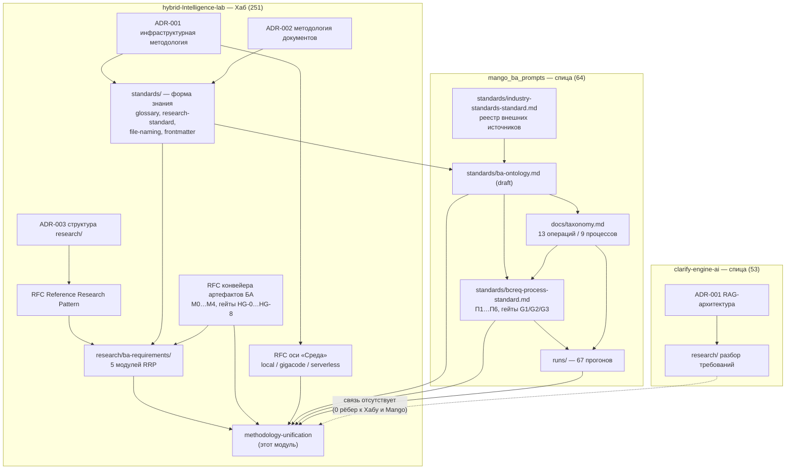

# Инвентаризация знаний экосистемы и топология связей: замер на 2026-09-07

> **Назначение.** Это датированный **снимок замера**, а не модуль исследования.
> Он отделён от модуля
> [`methodology-unification/`](https://github.com/G-Ivan-A/hybrid-Intelligence-lab/tree/main/research/ba-requirements/methodology-unification),
> потому что у замера есть дата и три коммита, а у модуля — нет: корпус растёт,
> и повторный прогон завтра даст другие числа при неизменных выводах модуля.
> Все ссылки абсолютные (требование НФТ-2 issue #557), кроме вынужденного
> исключения в README контейнера доказательств.

## Метод

Реестр вычислен, а не составлен вручную:
[`inventory-knowledge.py`](https://github.com/G-Ivan-A/hybrid-Intelligence-lab/blob/main/research/ba-requirements/exp/ba-methodology-unification-557/inventory-knowledge.py)
обходит три локальных клона, относит каждый markdown-файл к классу знания по
каталогу, читает frontmatter (`status`, `type`, `context`), извлекает заголовок
и строит рёбра из markdown-ссылок — как относительных, так и абсолютных вида
`https://github.com/G-Ivan-A/<repo>/blob/<ref>/<path>`. Ребро засчитывается,
только если цель существует в корпусе.

Коммиты замера: `hybrid-Intelligence-lab` `c259d61`, `mango_ba_prompts`
`8cbf82a`, `clarify-engine-ai` `96c288f`. Границы измерения и способ
воспроизведения — в
[README контейнера](https://github.com/G-Ivan-A/hybrid-Intelligence-lab/blob/main/research/ba-requirements/exp/ba-methodology-unification-557/README.md).

## 1. Размер корпуса

**368 артефактов знания** в трёх репозиториях.

| Репозиторий | Артефактов | Доля | Роль в экосистеме |
| --- | --- | --- | --- |
| [`hybrid-Intelligence-lab`](https://github.com/G-Ivan-A/hybrid-Intelligence-lab) | 251 | 68 % | Хаб: методология, стандарты, исследования |
| [`mango_ba_prompts`](https://github.com/G-Ivan-A/mango_ba_prompts) | 64 | 17 % | Спица: предметная практика БА команды КК |
| [`clarify-engine-ai`](https://github.com/G-Ivan-A/clarify-engine-ai) | 53 | 14 % | Спица: движок разбора требований (RAG) |

## 2. Реестр по классам

| Класс | Всего | Хаб | Mango | Clarify |
| --- | --- | --- | --- | --- |
| Research | 173 | 163 | — | 10 |
| Standard | 53 | 26 | 19 | 8 |
| RFC | 39 | 28 | 11 | — |
| ADR | 37 | 11 | 15 | 11 |
| Analysis | 31 | 13 | 7 | 11 |
| Audit | 21 | 6 | 9 | 6 |
| Backlog | 7 | — | — | 7 |
| Report | 7 | 4 | 3 | — |

Три наблюдения из таблицы, значимые для методологии:

1. **Исследования сосредоточены в Хабе** (163 из 173). Спицы производят
   решения (ADR/RFC) и стандарты, но почти не производят переносимого знания —
   у Mango класс Research отсутствует физически.
2. **Стандарты рассредоточены** (26 / 19 / 8). Нормативный слой существует в
   трёх местах одновременно; ни один машинный механизм не связывает их в
   отношение наследования.
3. **Решений больше, чем исследований, в обеих спицах.** У Mango 26 ADR+RFC
   против 7 Analysis; решения принимаются быстрее, чем накапливается
   доказательная база.

## 3. Реестр по статусам

| Статус | Артефактов | Доля |
| --- | --- | --- |
| `draft` | 242 | 65,8 % |
| без frontmatter | 53 | 14,4 % |
| `accepted` | 41 | 11,1 % |
| `proposed` | 17 | 4,6 % |
| `canonical` | 7 | 1,9 % |
| `reviewed` | 5 | 1,4 % |
| `superseded` / `review` / `complete` | по 1 | 0,8 % |

**Ключевой факт для ФТ-2.** Доля знания, дошедшего до состояния «пригодно как
норма» (`canonical` + `accepted`), составляет **48 из 368 — 13 %**. Все 53
артефакта без frontmatter принадлежат `clarify-engine-ai`: репозиторий не
подключён к контракту frontmatter Хаба
([`standards/frontmatter-docs-standard.md`](https://github.com/G-Ivan-A/hybrid-Intelligence-lab/blob/main/standards/frontmatter-docs-standard.md)),
поэтому его знание машинно неотличимо по зрелости.

## 4. BA-слой

Фильтр по словарю ключевых слов (BA, требования, ФТ/ТЗ, BCREQ, use case,
онтология, таксономия) выделяет **175 артефактов**: Хаб 114, Mango 41,
Clarify 20.

| Где сосредоточен BA-слой Хаба | Артефактов |
| --- | --- |
| [`research/ba-requirements/`](https://github.com/G-Ivan-A/hybrid-Intelligence-lab/tree/main/research/ba-requirements) — 5 модулей RRP по 6 файлов и 3 датированных снимка | 33 |
| `research/ai-education/*` — retrieval, task-processing, multi-agent-orchestration и другие | 25 |
| [`research/hub/`](https://github.com/G-Ivan-A/hybrid-Intelligence-lab/tree/main/research/hub) | 13 |
| `docs/rfc/` | 10 |
| [`research/mango/`](https://github.com/G-Ivan-A/hybrid-Intelligence-lab/tree/main/research/mango) | 9 |
| `docs/analysis/` | 8 |
| `research/*` — прочие направления | 8 |
| `docs/adr/` | 5 |
| `docs/audit/` | 2 |
| `standards/` | 1 |
| **Итого** | **114** |

**Нормативный слой Хаба предметно не про БА:** BA-релевантен 1 стандарт из 26.
Весь BA-слой Хаба — это исследования (88 из 114) и решения, но не нормы.

У Mango BA-релевантны 10 из 19 стандартов, 10 из 15 ADR и 10 из 11 RFC — то
есть спица почти целиком является предметным BA-артефактом. У Clarify
BA-релевантны 6 ADR, 6 исследований и 5 файлов бэклога, но лишь 1 стандарт из 8:
предметное знание там есть, нормативного слоя БА нет.

## 5. Топология

Граф ссылок внутри корпуса: **3361 ребро**, из них **200 — межрепозиторные**,
**19 узлов изолированы** (ни входящих, ни исходящих рёбер внутри корпуса).

### 5.1. Межрепозиторные связи асимметричны

| Направление | Рёбер |
| --- | --- |
| `mango` → `hub` | 81 |
| `hub` → `mango` | 31 |
| `hub` → `clarify` | 1 |
| `clarify` → `hub` | 0 |
| `clarify` → `mango`, `mango` → `clarify` | 0 |

Модель «Хаб — спица» подтверждается фактически только для Mango: спица ссылается
на Хаб в 2,6 раза чаще, чем Хаб на неё, — это нормальная топология наследования
методологии. **`clarify-engine-ai` из этой топологии выпадает полностью**: одна
входящая ссылка и ни одной исходящей. Репозиторий не наследует методологию Хаба
и не возвращает знание в него; в терминах ФТ-2 он не подключён ни к одному
уровню governance.

### 5.2. Центры притяжения (входящая степень)

| Артефакт | Репозиторий | Входящих |
| --- | --- | --- |
| [`standards/glossary.md`](https://github.com/G-Ivan-A/hybrid-Intelligence-lab/blob/main/standards/glossary.md) | hub | 39 |
| [`standards/research-standard.md`](https://github.com/G-Ivan-A/hybrid-Intelligence-lab/blob/main/standards/research-standard.md) | hub | 37 |
| [`docs/adr/2026-06-adr-002-artifact-document-methodology.md`](https://github.com/G-Ivan-A/hybrid-Intelligence-lab/blob/main/docs/adr/2026-06-adr-002-artifact-document-methodology.md) | hub | 36 |
| [`standards/file-naming.md`](https://github.com/G-Ivan-A/hybrid-Intelligence-lab/blob/main/standards/file-naming.md) | hub | 31 |
| [`docs/ADR/001-rag-architecture.md`](https://github.com/G-Ivan-A/clarify-engine-ai/blob/main/docs/ADR/001-rag-architecture.md) | clarify | 29 |
| [`research/ai-education/retrieval/00-introduction.md`](https://github.com/G-Ivan-A/hybrid-Intelligence-lab/blob/main/research/ai-education/retrieval/00-introduction.md) | hub | 25 |
| [`standards/frontmatter-docs-standard.md`](https://github.com/G-Ivan-A/hybrid-Intelligence-lab/blob/main/standards/frontmatter-docs-standard.md) | hub | 23 |
| [`docs/standards/naming-convention.md`](https://github.com/G-Ivan-A/clarify-engine-ai/blob/main/docs/standards/naming-convention.md) | clarify | 21 |
| [`docs/adr/2026-07-adr-003-research-structure.md`](https://github.com/G-Ivan-A/hybrid-Intelligence-lab/blob/main/docs/adr/2026-07-adr-003-research-structure.md) | hub | 19 |
| [`docs/adr/2026-06-adr-001-ecosystem-infrastructure-methodology.md`](https://github.com/G-Ivan-A/hybrid-Intelligence-lab/blob/main/docs/adr/2026-06-adr-001-ecosystem-infrastructure-methodology.md) | hub | 19 |
| [`docs/rfc/2026-07-17-rfc-reference-research-pattern.md`](https://github.com/G-Ivan-A/hybrid-Intelligence-lab/blob/main/docs/rfc/2026-07-17-rfc-reference-research-pattern.md) | hub | 18 |
| [`research/ai-education/task-processing/00-introduction.md`](https://github.com/G-Ivan-A/hybrid-Intelligence-lab/blob/main/research/ai-education/task-processing/00-introduction.md) | hub | 17 |
| [`standards/adr-structure-standard.md`](https://github.com/G-Ivan-A/hybrid-Intelligence-lab/blob/main/standards/adr-structure-standard.md) | hub | 16 |
| [`standards/ba-ontology.md`](https://github.com/G-Ivan-A/mango_ba_prompts/blob/main/standards/ba-ontology.md) | mango | 16 |
| [`research/external-knowledge/external-sources-registry.md`](https://github.com/G-Ivan-A/hybrid-Intelligence-lab/blob/main/research/external-knowledge/external-sources-registry.md) | hub | 16 |

**Ни один из 15 центров притяжения не является предметным методологическим
артефактом бизнес-анализа уровня экосистемы.** Тринадцать из них нормируют
*форму* знания (глоссарий, стандарт исследования, именование, frontmatter,
структура ADR/исследований), два — архитектуру одной спицы. Единственный
предметный BA-артефакт в списке —
[`standards/ba-ontology.md`](https://github.com/G-Ivan-A/mango_ba_prompts/blob/main/standards/ba-ontology.md)
Mango со статусом `draft`: де-факто предметное ядро методологии БА лежит в спице
и не имеет нормативного статуса.

### 5.3. Изолированные узлы

19 артефактов не связаны с корпусом ни одним ребром: 9 в Хабе (включая четыре
`*-proposal-*.md` в `docs/rfc/` и два исследования от 2026-05-28), 6 в Mango
(преимущественно `docs/report/` и `docs/analysis/` за 2026-08…09), 4 в Clarify.
Это верхняя оценка «висящего знания»: артефакт существует, но ни один документ
на него не опирается и он ни на что не опирается.

### 5.4. Карта знаний (топологическая)

Карта показывает **несущие отношения** («что на что опирается») по BA-контуру,
а не все 3361 ребро. Толщина связи в тексте не кодируется; направление стрелки
читается как «источник опирается на цель».

Читается так: форма знания нормирована Хабом и наследуется вниз; предметная
методология БА нормирована Mango и вверх **не** наследуется; `clarify-engine-ai`
не соединён ни с одной ветвью. Интерпретация — в
[`20-taxonomy.md`](https://github.com/G-Ivan-A/hybrid-Intelligence-lab/blob/main/research/ba-requirements/methodology-unification/20-taxonomy.md)
и
[`30-decision-framework.md`](https://github.com/G-Ivan-A/hybrid-Intelligence-lab/blob/main/research/ba-requirements/methodology-unification/30-decision-framework.md).

## 6. Что этот замер не показывает

- **Качество содержания.** Метрика зрелости здесь — объявленный `status`, а не
  экспертная оценка. Артефакт `canonical` может быть устаревшим.
- **Фактическое использование.** Граф ссылок — не граф чтения: артефакт с
  нулевой входящей степенью может ежедневно использоваться человеком.
- **Операционный контур.** `runs/`, `prompts/`, `patterns/`, `kb/` намеренно вне
  корпуса; их замер — в
  [`2026-08-26-rrp-full-cycle-corpus-facts.md`](https://github.com/G-Ivan-A/hybrid-Intelligence-lab/blob/main/research/ba-requirements/2026-08-26-rrp-full-cycle-corpus-facts.md).
- **Репозитории вне трёх названных.** `aether-orbis` и шаблоны спиц в корпус не
  входили: issue #557 ограничивает периметр тремя репозиториями.

## Источники

- Контейнер доказательств: [`research/ba-requirements/exp/ba-methodology-unification-557/`](https://github.com/G-Ivan-A/hybrid-Intelligence-lab/tree/main/research/ba-requirements/exp/ba-methodology-unification-557)
- Постановка: [issue #557](https://github.com/G-Ivan-A/hybrid-Intelligence-lab/issues/557)
- Стандарт исследований: [`standards/research-standard.md`](https://github.com/G-Ivan-A/hybrid-Intelligence-lab/blob/main/standards/research-standard.md)
