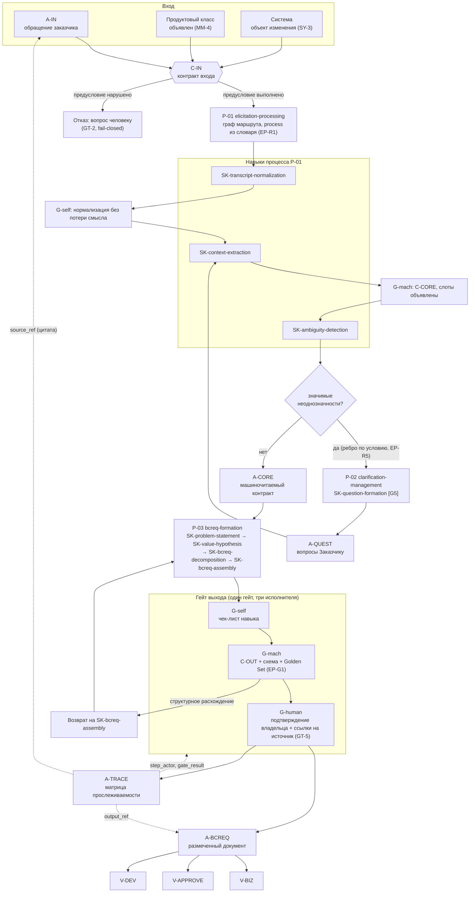

# Практика: модель производства артефакта и вертикальный срез

> Файл опирается на основание модуля: закон производства и сущности —
> [`10-theory.md`](10-theory.md), таксономии и депрекация —
> [`20-taxonomy.md`](20-taxonomy.md), состав пакета —
> [`30-decision-framework.md`](30-decision-framework.md).

## 1. Модель производства артефакта: BCREQ

Сквозной случай — производство документа BCREQ (`A-BCREQ`) из входного
обращения (`A-IN`). Показаны предусловия, операции, гейты, контракты и след.

**Как читать граф.**

1. **Предусловия — не первый шаг, а условие входа.** `C-IN` проверяется до
   запуска маршрута; необъявленный продуктовый класс или необъявленная Система
   останавливают прогон, а не заменяются догадкой.
2. **Ромб `G3` — ветвление графа, а не смена маршрута.** Уход в `P-02` при
   найденных неоднозначностях — пройденное ребро объявленного графа (`EP-R3`);
   в листе прогона он записывается как решение с наблюдённым значением
   предиката (`EP-R6`).
3. **Навыки разные, гейт один.** `G-self`, `G-mach`, `G-human` — три
   исполнителя одного гейта, а не три разных гейта (`10-theory.md`, §2). Гейт
   стоит на границе навыка-подпроцесса, а не после каждой операции: операция
   собственного гейта не имеет (`OA-2`). На промежуточных узлах присутствуют не
   все исполнители, и это объявлено явно.
4. **Контракт задаёт предмет проверки, гейт — момент.** `C-OUT` описывает, чему
   должен удовлетворять выход; `G4` — точка, где это проверяется.
5. **Проекции не являются отдельными артефактами.** `V-BIZ`, `V-APPROVE`,
   `V-DEV` — три чтения одного `A-BCREQ`.
6. **След — артефакт первого класса.** `A-TRACE` производится тем же прогоном и
   связывает вход, гейты и выход; без него прогон не считается принятым
   (`EP-R4`).

## 2. Сквозная прослеживаемость

| Звено | Чем выражено | Где проверяется |
| --- | --- | --- |
| обращение → прогон | `trace.input_ref` | `G-mach`, обязательность поля |
| прогон → процесс | `process` из закрытого словаря `L2` | `G-mach`, `EP-R1` |
| прогон → траектория | `path` и `decisions` листа прогона | `G-mach`, `EP-R6` |
| утверждение → цитата источника | `source_ref`: документ, раздел, страница, дословная цитата | `G-mach` (`check-source-evidence`), затем `G-human` (`GT-5`) |
| шаг → актор | `step_actor` | `G-mach`, `EP-R2` |
| шаг → результат гейта | `gate_result` с исполнителем | `G-mach` |
| прогон → документ | `trace.output_ref` | `G-human` |
| документ → слоты | подписи слотов в шаблоне | `G-mach`, схема `C-OUT` |

Замер показал, что сегодня эта цепочка разорвана в первом же звене: **50 из 67
прогонов** не содержат ссылки на промпт, а 66 значений `process` из 67 лежат
вне словаря (`D7`). Поэтому прослеживаемость входит в MVP как **измеряемая величина**, а
не как декларация.

## 3. Вертикальный MVP-срез

Срез намеренно узкий: один продуктовый класс, один процесс, один целевой
артефакт. Цель — не покрытие, а получение первых эмпирических данных.

| Параметр среза | Значение | Почему так |
| --- | --- | --- |
| Продуктовый класс | `contact-center` | наибольшее историческое покрытие в корпусе |
| Система | один компонент продукта, объявлен до запуска | `SY-3`: без объявленной Системы требование не имеет субъекта поведения |
| Процессы | `P-01` `elicitation-processing` и `P-03` `bcreq-formation`, ветвь `P-02` `clarification-management` | цепочка от сырого входа до целевого артефакта; ветвь обязательна, иначе неоднозначность нечем разрешить |
| Целевой артефакт | `A-BCREQ` | сквозной артефакт из issue #563 |
| Навыки | 7 скомпилированных `SKILL.md` (3 в `P-01`, 4 в `P-03`) плюс 3 навыка ветви `P-02` | единица компиляции — навык-подпроцесс, а не операция (`SK-1`) |
| Операции | словарь `ba-operation-taxonomy`, вызываются внутри навыков | операция не компилируется отдельно: она шаг внутри навыка |
| Гейты | `G-self` внутри навыка, `G-mach` на границе навыка, `G-human` на выходе и в `P-02` | минимум, при котором отказ возможен; человеческий гейт требует ссылок на источник (`GT-5`) |
| Эталоны | 2 (`contact-center`, профиль `P-SETTINGS` и `P-NO-SETTINGS`) | уже смоделированы в `exp/ba-micro-structure-561/` |
| Объём прогонов | 10 задач | нижняя граница, при которой доля отказов различима |

## 4. План сбора эмпирических данных

| Метрика | Определение | Как считается | Целевое поведение |
| --- | --- | --- | --- |
| `M-1` структурная воспроизводимость | доля прогонов, чей скелет совпал с эталонным | сравнение подписей слотов | растёт; базовая линия 0 (17 документов — 17 скелетов) |
| `M-2` доля машинных отказов | `G-mach` reject / все прогоны | счётчик гейта | ненулевая: нулевая означает, что гейт не проверяет |
| `M-3` доля человеческих правок после `G-mach` | правки на `G-human` / принятые `G-mach` | diff выхода | падает; показывает, что ловит машина, а что нет |
| `M-4` полнота следа | доля прогонов с четырьмя обязательными полями | валидатор `EP-R4` | 100% как условие приёма прогона |
| `M-5` доля пустых слотов с объявленной причиной | пустые слоты с причиной / все пустые | разбор шаблона | растёт; отличает «нет» от «не рассматривали» |

К пяти метрикам пакета версия 0.2 добавляет метрики новых таксономий:
`MP-1`…`MP-6` для процессов и навыков
([`ba-process-taxonomy/40-practice-and-cases.md`](https://github.com/G-Ivan-A/hybrid-Intelligence-lab/blob/main/research/ba-requirements/ba-process-taxonomy/40-practice-and-cases.md))
и `MO-1`…`MO-5` для операций
([`ba-operation-taxonomy/40-practice-and-cases.md`](https://github.com/G-Ivan-A/hybrid-Intelligence-lab/blob/main/research/ba-requirements/ba-operation-taxonomy/40-practice-and-cases.md)).
Пересечения нет: `M-1`…`M-5` измеряют прогон пакета, `MP-*` и `MO-*` — качество
самой таксономии.

**Условие честности замера.** Базовая линия по `M-1`…`M-3` снимается **до**
внедрения пакета на тех же 10 задачах, иначе улучшение неотличимо от подбора
задач. Замер без базовой линии в отчёт не принимается.

**Порог решения.** Срез считается успешным, если `M-4` = 100% и `M-1` заметно
выше базовой линии при ненулевом `M-2`. Комбинация «`M-1` высокий, `M-2` = 0»
трактуется как неработающий гейт, а не как успех.

## 5. Граничные кейсы

| Кейс | Поведение по модели | Почему не иначе |
| --- | --- | --- |
| Продуктовый класс не определяется по входу | прогон останавливается на `C-IN`, вопрос человеку | `MM-4`: класс объявлен, а не выведен лексически; замер показал, что лексические маркеры неразличающие (66 из 67 обращений мультидоменные) |
| Задача затрагивает два продукта с разными профилями | один прогон, один документ, слоты профилей объявлены раздельно | эталон `2026-09-08-golden-set-multi-product.md` уже моделирует случай |
| Требуется навык без скомпилированного `SKILL.md` | узел помечается `actor: human`, агент его не выполняет | `EP-R2`; иначе модель имитирует покрытие, которого нет |
| Нормализация нашла неоднозначность | прогон уходит по условному ребру в `P-02`, затем возвращается в `P-01` | `EP-R3`: ветвление — исполнение графа; возврат записывается в `decisions` |
| Человек принимает утверждение без ссылки на источник | гейт не проходится: утверждение переносится в список гипотез исполнителя | `GT-5`; иначе домысел агента становится требованием |
| Исторический промпт существует в трёх режимах | берётся один навык; режим выражается полем `interaction` маршрута | `DP-1`…`DP-3`, ADR-013 |
| Исторический промпт содержит удачную формулировку правила | формулировка заимствуется с явным объявлением; окружающий скелет промпта не переносится | `LG-3`, ADR-014 |
| Структура нового навыка выведена «по образцу» старого промпта | к компиляции не принимается: `derived_from` не может ссылаться на `prompts/` или `runs/` | `LG-4`, `EP-C6`, `SK-7` |
| `G-mach` отказывает трижды подряд | прогон эскалируется человеку, а не повторяется | защита от цикла; отказ — сигнал о дефекте навыка |
| Эталон для продуктового класса отсутствует | `G-mach` проверяет только схему, факт неполноты записывается в след | `EP-G3`: отсутствие эталона не блокирует, но фиксируется |
| Frontmatter пакета не совпадает с версиями слоёв Хаба | пакет считается протухшим и подлежит перекомпиляции | `EP-C2`, `EP-C5` |

## 6. Границы практики

- Граф и срез описывают **проектируемое** поведение: ни один прогон по модели
  ещё не выполнен, все цифры целевых метрик — базовая линия и определения, а не
  результаты.
- Срез покрывает один продуктовый класс: переносимость на `security` и
  `hardware`, для которых исторических данных нет, срезом не проверяется.
- Пороги решения выбраны как первое приближение и подлежат пересмотру после
  первых десяти прогонов.
- Срез описан в словаре версии 0.2 (`P-01`, `P-03`, навыки `SK-*`); прежнее
  описание среза в терминах `fr-generation` и шести операций депрекировано
  вместе со словарём
  ([`20-taxonomy.md`](20-taxonomy.md), §4).
