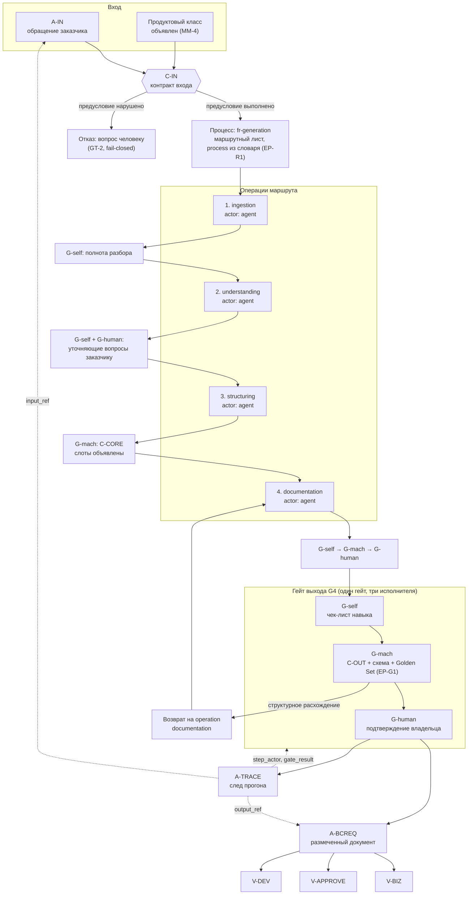

# Практика: модель производства артефакта и вертикальный срез

> Файл опирается на основание модуля: закон производства и сущности —
> [`10-theory.md`](10-theory.md), таксономии и депрекация —
> [`20-taxonomy.md`](20-taxonomy.md), состав пакета —
> [`30-decision-framework.md`](30-decision-framework.md).

## 1. Модель производства артефакта: BCREQ

Сквозной случай — производство документа BCREQ (`A-BCREQ`) из входного
обращения (`A-IN`). Показаны предусловия, операции, гейты, контракты и след.

**Как читать граф.**

1. **Предусловия — не первый шаг, а условие входа.** `C-IN` проверяется до
   запуска маршрута; необъявленный продуктовый класс останавливает прогон, а не
   заменяется догадкой.
2. **Операции разные, гейт один.** `G-self`, `G-mach`, `G-human` — три
   исполнителя одного гейта, а не три разных гейта (`10-theory.md`, §2). На
   промежуточных шагах присутствуют не все исполнители, и это объявлено явно.
3. **Контракт задаёт предмет проверки, гейт — момент.** `C-OUT` описывает, чему
   должен удовлетворять выход; `G4` — точка, где это проверяется.
4. **Проекции не являются отдельными артефактами.** `V-BIZ`, `V-APPROVE`,
   `V-DEV` — три чтения одного `A-BCREQ`.
5. **След — артефакт первого класса.** `A-TRACE` производится тем же прогоном и
   связывает вход, гейты и выход; без него прогон не считается принятым
   (`EP-R4`).

## 2. Сквозная прослеживаемость

| Звено | Чем выражено | Где проверяется |
| --- | --- | --- |
| обращение → прогон | `trace.input_ref` | `G-mach`, обязательность поля |
| прогон → процесс | `process` из закрытого словаря | `G-mach`, `EP-R1` |
| шаг → актор | `step_actor` | `G-mach`, `EP-R2` |
| шаг → результат гейта | `gate_result` с исполнителем | `G-mach` |
| прогон → документ | `trace.output_ref` | `G-human` |
| документ → слоты | подписи слотов в шаблоне | `G-mach`, схема `C-OUT` |

Замер показал, что сегодня эта цепочка разорвана в первом же звене: **50 из 67
прогонов** не содержат ссылки на промпт, а 65 значений `process` лежат вне
словаря. Поэтому прослеживаемость входит в MVP как **измеряемая величина**, а
не как декларация.

## 3. Вертикальный MVP-срез

Срез намеренно узкий: один продуктовый класс, один процесс, один целевой
артефакт. Цель — не покрытие, а получение первых эмпирических данных.

| Параметр среза | Значение | Почему так |
| --- | --- | --- |
| Продуктовый класс | `contact-center` | наибольшее историческое покрытие в корпусе |
| Процесс | `fr-generation` | единственный процесс, наблюдаемый в метаданных прогонов |
| Целевой артефакт | `A-BCREQ` | сквозной артефакт из issue #563 |
| Операции | `ingestion`, `understanding`, `structuring`, `documentation` | четыре из шести операций, у которых есть промпты |
| Навыки | 4 скомпилированных `SKILL.md` | по одному на операцию среза |
| Гейты | `G-self` на каждом шаге, `G-mach` и `G-human` на выходе | минимум, при котором отказ возможен |
| Эталоны | 2 (`contact-center`, профиль `P-SETTINGS` и `P-NO-SETTINGS`) | уже смоделированы в `exp/ba-micro-structure-561/` |
| Объём прогонов | 10 задач | нижняя граница, при которой доля отказов различима |

## 4. План сбора эмпирических данных

| Метрика | Определение | Как считается | Целевое поведение |
| --- | --- | --- | --- |
| `M-1` структурная воспроизводимость | доля прогонов, чей скелет совпал с эталонным | сравнение подписей слотов | растёт; базовая линия 0 (17 документов — 17 скелетов) |
| `M-2` доля машинных отказов | `G-mach` reject / все прогоны | счётчик гейта | ненулевая: нулевая означает, что гейт не проверяет |
| `M-3` доля человеческих правок после `G-mach` | правки на `G-human` / принятые `G-mach` | diff выхода | падает; показывает, что ловит машина, а что нет |
| `M-4` полнота следа | доля прогонов с четырьмя обязательными полями | валидатор `EP-R4` | 100% как условие приёма прогона |
| `M-5` доля пустых слотов с объявленной причиной | пустые слоты с причиной / все пустые | разбор шаблона | растёт; отличает «нет» от «не рассматривали» |

**Условие честности замера.** Базовая линия по `M-1`…`M-3` снимается **до**
внедрения пакета на тех же 10 задачах, иначе улучшение неотличимо от подбора
задач. Замер без базовой линии в отчёт не принимается.

**Порог решения.** Срез считается успешным, если `M-4` = 100% и `M-1` заметно
выше базовой линии при ненулевом `M-2`. Комбинация «`M-1` высокий, `M-2` = 0»
трактуется как неработающий гейт, а не как успех.

## 5. Граничные кейсы

| Кейс | Поведение по модели | Почему не иначе |
| --- | --- | --- |
| Продуктовый класс не определяется по входу | прогон останавливается на `C-IN`, вопрос человеку | `MM-4`: класс объявлен, а не выведен лексически; замер показал, что лексические маркеры неразличающие (66 из 67 обращений мультидоменные) |
| Задача затрагивает два продукта с разными профилями | один прогон, один документ, слоты профилей объявлены раздельно | эталон `2026-09-08-golden-set-multi-product.md` уже моделирует случай |
| Требуется операция без навыка (7 из 13) | шаг помечается `actor: human`, агент его не выполняет | `EP-R2`; иначе модель имитирует покрытие, которого нет |
| Исторический промпт существует в трёх режимах | берётся один навык на операцию; режимы не переносятся | `DP-1`…`DP-3`, ADR-013 |
| `G-mach` отказывает трижды подряд | прогон эскалируется человеку, а не повторяется | защита от цикла; отказ — сигнал о дефекте навыка |
| Эталон для продуктового класса отсутствует | `G-mach` проверяет только схему, факт неполноты записывается в след | `EP-G3`: отсутствие эталона не блокирует, но фиксируется |
| Frontmatter пакета не совпадает с версиями слоёв Хаба | пакет считается протухшим и подлежит перекомпиляции | `EP-C2`, `EP-C5` |

## 6. Границы практики

- Граф и срез описывают **проектируемое** поведение: ни один прогон по модели
  ещё не выполнен, все цифры целевых метрик — базовая линия и определения, а не
  результаты.
- Срез покрывает один продуктовый класс: переносимость на `security` и
  `hardware`, для которых исторических данных нет, срезом не проверяется.
- Пороги решения выбраны как первое приближение и подлежат пересмотру после
  первых десяти прогонов.
