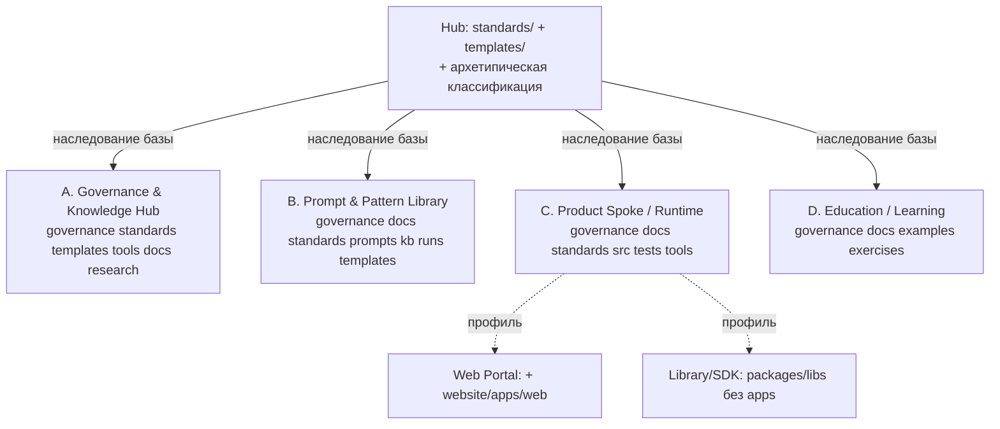
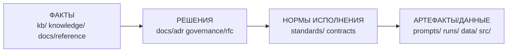

# Концепция базовых каталогов для архетипов проектов (дополнение к mango-исследованию)

> **Режим:** `Research` + `Creative` (дополнение, не замена). Документ
> **дополняет** видение фаундера и mango-исследование в части открытых вопросов,
> противоречий и рисков; он **не заменяет и не изменяет** видение фаундера,
> которое зафиксировано как **приоритетная база** (§3). Это аналитический отчёт:
> он не создаёт RFC, не вводит каталоги и не меняет структуру репозитория —
> любые организационные изменения предлагаются как будущие RFC → ADR отдельными
> задачами (§11). Все рекомендации показаны как trade-offs, а не как готовые
> решения. Источник задачи —
> [issue #263](https://github.com/G-Ivan-A/hybrid-Intelligence-lab/issues/263).

> **EN abstract.** Addendum to the `mango_ba_prompts` directory-structure
> research. It supplements (does not replace) the founder's vision with open
> questions, contradiction resolution and risk analysis, then derives a base
> directory concept per the four PR #243 archetypes, benchmarked against 10+
> international repositories each. Decisions stay with the human; this is a
> research note, not an RFC.

> 🔁 **Part II — до-исследование (issue #274), v0.2.** Ниже §1–§13 — исходная
> Часть I, **не изменена** (Anti-Inflation). К ней дописана **Часть II (§14–§22)**:
> структурированная фиксация и проверка Соглашения «Архитектура инфраструктуры
> проектов экосистемы» против индустриальных норм, в режиме `Research` с
> приоритетом опровержения. Источник —
> [issue #274](https://github.com/G-Ivan-A/hybrid-Intelligence-lab/issues/274).

## Оглавление

1. [Назначение и границы](#1-назначение-и-границы)
2. [Mango-исследование: ссылка и суммаризация](#2-mango-исследование-ссылка-и-суммаризация)
3. [Видение фаундера: фиксация приоритетной базы](#3-видение-фаундера-фиксация-приоритетной-базы)
4. [Сравнение видения фаундера с выводами mango](#4-сравнение-видения-фаундера-с-выводами-mango)
5. [Архетипы PR #243 как база](#5-архетипы-pr-243-как-база)
6. [Дополнение открытых вопросов фаундера](#6-дополнение-открытых-вопросов-фаундера)
7. [Разрешение противоречий](#7-разрешение-противоречий)
8. [Критический анализ видения: риски и рекомендации](#8-критический-анализ-видения-риски-и-рекомендации)
9. [Концепция базовых каталогов](#9-концепция-базовых-каталогов)
10. [Эмпирическая база: 10+ проектов на архетип](#10-эмпирическая-база-10-проектов-на-архетип)
11. [Рекомендации по синхронизации с Хабом](#11-рекомендации-по-синхронизации-с-хабом)
12. [Открытые вопросы и следующие шаги](#12-открытые-вопросы-и-следующие-шаги)
13. [Источники](#13-источники)

**Part II — до-исследование (issue #274):**

14. [До-исследование Соглашения: назначение, метод, границы](#14-до-исследование-соглашения-назначение-метод-границы)
15. [Структурированная фиксация Соглашения](#15-структурированная-фиксация-соглашения)
16. [Дельта-проверка разделов Соглашения по индустриальным нормам](#16-дельта-проверка-разделов-соглашения-по-индустриальным-нормам)
17. [Уровни исполнимости (IL) и индустриальная норма](#17-уровни-исполнимости-il-и-индустриальная-норма)
18. [Сопоставление IL с осями документации: Diátaxis и DITA](#18-сопоставление-il-с-осями-документации-diátaxis-и-dita)
19. [Специально некорректная постановка: обнаружение и опровержение](#19-специально-некорректная-постановка-обнаружение-и-опровержение)
20. [Гипотезы граничных кейсов и ассоциированные нормы](#20-гипотезы-граничных-кейсов-и-ассоциированные-нормы)
21. [Реконсиляция с видением фаундера и сводный вердикт](#21-реконсиляция-с-видением-фаундера-и-сводный-вердикт)
22. [Источники до-исследования (Part II)](#22-источники-до-исследования-part-ii)

---

## 1. Назначение и границы

Задача [#263](https://github.com/G-Ivan-A/hybrid-Intelligence-lab/issues/263)
требует **дополнить**, а не переписать. Поэтому документ построен в три слоя:

| Слой | Что делает | Чего НЕ делает |
| --- | --- | --- |
| Фиксация | Принимает видение фаундера как приоритетную базу (§3) и резюмирует mango (§2) | Не меняет формулировки видения |
| Дополнение | Закрывает 4 открытых вопроса (§6), разрешает 3 противоречия (§7) | Не вводит каталоги в репозиторий |
| Критика | Показывает риски расхождения с международной практикой (§8) и trade-offs | Не выносит финального решения — оно за Пользователем |

**Что считается «базовым каталогом» в этом документе.** Каталог, который
**инициализируется при создании проекта** по шаблону архетипа и который
пользователь **может удалить вручную**, если он не нужен. Базовые ≠ обязательные
навсегда; базовые = «дефолтный скелет архетипа». Это согласуется с принципом
фаундера «базовые наследуются из Хаба, специфичные создаются по мере
необходимости» (видение, строки 60–62).

**Терминология** берётся из [standards/glossary.md](../../standards/glossary.md)
и видения фаундера; новые термины не вводятся.

---

## 2. Mango-исследование: ссылка и суммаризация

**Ссылка.** Первичный отчёт —
[`repository-structure-analysis.md`](https://github.com/user-attachments/files/29257211/repository-structure-analysis.md)
(приложен к issue #263), выполнен в споке `mango_ba_prompts`
([issue #192](https://github.com/G-Ivan-A/mango_ba_prompts/issues/192)) и
физически живёт там как `docs/analysis/repository-structure-analysis.md`. Это
**внешний по отношению к Хабу** артефакт; он не копируется в Хаб (правило
`research/` — только в корне Хаба, см. §11), а реферируется.

**Метод отчёта.** Проверка **фактической** структуры 15 первичных международных
проектов (через `gh api` git-trees на закреплённых SHA) + 6 companion-репозиториев
+ 3 эталонных ADR-репозитория = 24 проверенных дерева; плюс анализ 12 стандартов
и фреймворков. Это превышает порог «10+».

**6 вопросов и краткие ответы отчёта:**

| # | Вопрос отчёта | Ответ отчёта | Уверенность |
| --- | --- | --- | --- |
| 1 | Где хранить правила исполнения процессов? | Разделить: governance-правила (надзор) → `governance/`; execution-правила (как делать артефакт) → рядом с процессом/контрактом; машинный реестр правил → `governance/rules/` | Средняя |
| 2 | `docs/research/` или `docs/analytics/`? | Ни то, ни другое. `research/` — только в Хабе; в споке сохранить `docs/analysis/`. docs/ делится по функции, не по «research vs analytics» | Высокая |
| 3 | Где размещать стандарты? | Корневой `standards/` (обоснован TOGAF SIB), но очистить от контрактов/ADR. Стандарты ≠ kb (нормативны, а не справочны) | Высокая |
| 4 | governance = репозиторий или все процессы? | Надзор (evaluate-direct-monitor), НЕ управление всем. COBIT/ISO 38500 + 19 репозиториев единогласны | Высокая |
| 5 | Нужен ли отдельный `artifact/`? | Нет. 0 из 15 проектов имеют его; артефакты организуются по типу рядом с функцией | Очень высокая |
| 6 | Как масштабировать на код/агентов? | `apps/` (деплоимое) + `packages/`/`libs/` (переиспользуемое); `db/`/`data/` отдельно от `kb/`; `agents/` как пакет — только при доказанной боли (Anti-Inflation) | Высокая |

**Главные эмпирические находки отчёта (применимы к этой работе):**

- **0/15** проектов используют буквально `docs/adr/`; **0/19** имеют каталог
  `governance/`; **0/15** — `docs/research|analytics/`; **0/15** — отдельный
  `artifact/`; **≈13/15** масштабируют код через `packages/`/`apps/`/`libs/`.
- Корневой `standards/` редок в OSS (нормы инлайнятся в `CONTRIBUTING.md`/`docs/`),
  **но** концептуально обоснован TOGAF SIB (отдельный нормативный store).
- `GOVERNANCE.md` как **файл** встречается (Node.js, Grafana, k8s-community), но
  всегда про роли/сообщество, а не про исполнение процессов.

**Концептуальный каркас отчёта — четырёхслойная модель**, которую переиспользуем
в §9:

```text
ФАКТЫ (kb/, knowledge/, docs/) → РЕШЕНИЯ (docs/adr, governance/rfc)
  → НОРМЫ ИСПОЛНЕНИЯ (standards/, contracts) → АРТЕФАКТЫ/ДАННЫЕ (prompts/, runs/, data/)
```

**Связь с этой работой.** Mango-отчёт отвечал на вопросы **внутри одного спока**
(Prompt & Pattern Library). Текущий документ поднимает выводы на уровень Хаба и
обобщает их **на все архетипы** — это ровно та «передача в Хаб для синхронизации»,
которую отчёт обозначил как следующий шаг (§11 отчёта).

---

## 3. Видение фаундера: фиксация приоритетной базы

Видение принято как **архитектурная основа** и приводится без изменений
(источник — приложенный диалог согласования). Ключевые положения:

**Базовые каталоги (видение):**

| Каталог | Роль по видению | Плоский? |
| --- | --- | --- |
| `governance/` | Надзор | Плоский; подкаталог — только через задачу с 2FA-обоснованием |
| `docs/` | `analysis/` (исследования, аналитика), `report/` (аудит, отчёт, статистика), `rfc/`, `adr/`; прочее опционально | С подкаталогами |
| `kb/` | «Боевые» исполнимые знания: `справочники/`, `данные/`, `правила/`, `процессы` | Не плоский |
| `runs/` | Выполнение задач, эксперименты | — |
| `standards/` | Каталог стандартов | Плоский; исключение через 2FA |
| `prompts/` | Каталог промптов | Плоский; исключение через 2FA |
| `knowledge/` | Информационные материалы (если не kb) | Опционально |
| `templates/` | Шаблоны с явной классификацией (`governance/`, `issues/`…) | С подкаталогами |
| `website/` | Веб-приложение под репозиторий (не нужно, если проект сам — веб-портал) | — |

**Принципы видения (дословно по смыслу):**

1. **kb ≠ Knowledge Base.** `kb/` — «боевые» исполнимые знания (машиночитаемый
   JSON, максимальная краткость, оптимизация под AI-агентов; без них проект не
   работает на проде). `knowledge/` — информационные человекочитаемые материалы
   (Markdown, опциональны). Эволюция возможна в обе стороны.
2. **Переносимость ядра.** `kb/ + runs/ + governance/ + templates/` «перенесли в
   другой проект — и оно работает для пользователей» даже без аналитики/стандартов.
   Это и есть критерий отнесения к `kb/`.
3. **Базовые vs специфичные.** Базовые — обязательные, наследуются из Хаба;
   специфичные — опциональные, создаются по мере необходимости.
4. **2FA-исключение.** Подкаталоги в «плоских» каталогах (`governance/`,
   `standards/`, `prompts/`) — только через отдельную задачу с обоснованием.
   Защита от раздувания.
5. **Наследование от Хаба.** Проекты наследуют стандарт базовой структуры,
   базовые контракты и стандарт архетипической классификации.

**Открытые вопросы, которые сам фаундер вынес на исследование** (закрываются в §6):
`prompts/` vs процессные промпты; `docs/` vs `knowledge/`; критерий «плоский vs с
подкаталогами»; `scripts/` vs `tools/`.

> **Статус-граница.** Всё в §3 — приоритетная база. Ниже (§4, §6–§8) идёт
> **только дополнение**: где видение совпадает с международной практикой — это
> подтверждается; где расходится — показывается риск и trade-off, но решение
> остаётся за Пользователем.

---

## 4. Сравнение видения фаундера с выводами mango

Сопоставление по каждому базовому каталогу: совпадает ли видение фаундера с
эмпирикой mango-отчёта и где появляется развилка.

| Каталог / тема | Видение фаундера | Вывод mango-отчёта | Согласованность | Развилка |
| --- | --- | --- | --- | --- |
| `governance/` плоский, надзор | Надзор; плоский | Узкий governance = EDM (надзор), не исполнение | ✅ Совпадает | Куда класть `rules/` исполнения (§6.1, §7.1) |
| `docs/` с `analysis/report/rfc/adr` | Деление по типу | docs/ делится **по функции/аудитории** (Diátaxis); ADR-конвенция не универсальна | ⚠️ Частично | Имена `analysis`/`report` vs Diátaxis-типы (§8-R4) |
| `kb/` не плоский, «боевой» | JSON, исполнимый, ядро переносимости | Отдельный `artifact/` не нужен; kb ≠ data/db | ✅ Совпадает | Граница `kb/правила` vs `governance/rules` (§7.1) |
| `standards/` плоский, корень | Каталог стандартов | Корневой `standards/` обоснован TOGAF SIB; очистить от контрактов | ✅ Совпадает | `standards/` vs `kb/standards/` (§7.2) |
| `prompts/` плоский, отдельный | Отдельный каталог | Промпты — артефакт по типу рядом с функцией | ⚠️ Напряжение | Standalone vs процессные промпты (§6.1, §7.3) |
| `knowledge/` (если не kb) | Информационные материалы | `knowledge/` vs `docs/` не разведены в отчёте явно | ⚠️ Неоднозначно | §6.2, §7.3 |
| `runs/` | Выполнение, эксперименты | runs/ как операционная запись; критерий «эксперимент↔runs» открыт | ✅ Совпадает | Где «эксперименты», если не runs |
| Масштабирование кода | `website/`, специфичные | `apps/` + `packages/`/`libs/` (монорепо) | ✅ Совпадает | `website/` vs `apps/web` (§8-R5) |
| `scripts/` vs `tools/` | Открытый вопрос | Не разбирался в отчёте напрямую | — | §6.4 |

**Вывод §4.** Видение и эмпирика mango **совпадают в ядре** (узкий governance,
корневой `standards/`, kb как исполнимое ядро, отсутствие `artifact/`,
масштабирование монорепо-конвенцией). Расхождения локализованы в **именовании**
(`docs/analysis` vs Diátaxis) и в **двух стыках** (`prompts/` ↔ процессы,
`knowledge/` ↔ `docs/`) — именно их закрывают §6–§8.

---

## 5. Архетипы PR #243 как база

Согласно задаче, архетипы **берутся из PR #243** (не изобретаются). PR #243
([`governance/rfc/repository-archetypes-template-release.md`](../../governance/rfc/repository-archetypes-template-release.md))
определяет **4 архетипа**:

| Архетип PR #243 | Назначение | Критерий отнесения | Обязательные свойства (PR #243) | Текущий маппинг |
| --- | --- | --- | --- | --- |
| **A. Governance & Knowledge Hub** | Источник методологии, стандартов, шаблонов, practices, ecosystem-maps | Управляет правилами для нескольких проектов; product runtime не главный | `governance/`, `standards/`, `templates/`, `tools/`, artifact-map, changelog, локальные валидаторы | `hybrid-Intelligence-lab` |
| **B. Prompt & Pattern Library** | Исполняемые prompt-assets, reusable patterns, domain-mappings, проверочные сценарии | Главная ценность — prompts/patterns; runtime-код вторичен/отсутствует | `prompts/` (или обоснованный equivalent), prompt/pattern standards, docs-taxonomy, validation/self-test, governance-sync link | `mango_ba_prompts` |
| **C. Product Spoke / Application Runtime** | Production/pilot-продукт с кодом, UI/API, тестами, deploy lifecycle | Есть `src/`/runtime, CI/CD, production-like среды, отдельные release-риски | `src/`, `tests/`, `docs/`, config, security/deploy guidance, CI, product concept/roadmap, наследованный governance | `open-ai.ru`, `clarify-engine-ai` |
| **D. Education / Learning Package** | Учебные материалы, курс, упражнения, demos | Главная ценность — передача знания и exercises; runtime отсутствует/демо | Learning README, curriculum/module docs, examples/exercises, source links, governance boundaries | `projects/education-ba-prompt` |

### 5.1. Сверка с 5 архетипами фаундера

Видение фаундера называет **5** архетипов (Research/Hub, Spoke, Production, Web
Portal, Library/SDK). PR #243 даёт **4**. Чтобы не изобретать новые, фиксируем
**маппинг 5 → 4** (а не замену):

| Архетип фаундера | Маппинг на PR #243 | Комментарий |
| --- | --- | --- |
| Research / Hub | **A. Governance & Knowledge Hub** | Прямое соответствие |
| Spoke (mango) | **B. Prompt & Pattern Library** | Прямое соответствие |
| Production (open-ai.ru) | **C. Product Spoke / Application Runtime** | Прямое соответствие |
| Web Portal | **C** (под-вариант) | Веб-портал = Product Spoke с обязательным `website/`/`apps/web`; не отдельный архетип в PR #243 |
| Library / SDK | **C** (под-вариант) | Runtime-код без приложения: `packages/`/`libs/` без `apps/`; не отдельный архетип в PR #243 |
| — (нет у фаундера) | **D. Education / Learning Package** | Новый в PR #243; у фаундера явно не выделен |

**Расхождение, требующее решения Пользователя (trade-off, не дефект):** PR #243
**сворачивает** Web Portal и Library/SDK в Product Spoke, но **добавляет**
Education. Два варианта:

- **Вариант 1 (рекомендуется как база):** держать 4 канонических архетипа PR #243;
  Web Portal и Library/SDK — это **профили** архетипа C (различаются обязательным
  `website/`/`apps/web` и наличием `apps/` соответственно). Меньше сущностей,
  меньше дублирования шаблонов.
- **Вариант 2:** расширить до 5–6, выделив Web Portal и Library/SDK обратно.
  Плюс — точность; минус — рост числа шаблонов и риск раздувания (нарушает
  Anti-Inflation §2 mango-отчёта).

Дальше §9 использует **4 архетипа PR #243** как канон, отмечая профили C.

---

## 6. Дополнение открытых вопросов фаундера

Каждый вопрос — с международной эмпирикой и trade-off, **без** навязывания решения.

### 6.1. `prompts/` vs промпты в процессах

**Суть.** Видение даёт плоский `prompts/`. Ранее в экосистеме согласовали:
процессные промпты — рядом с контрактом (`kb/processes/*/prompt.md`), системные —
в `governance/prompts/`. Конфликт SSOT: один промпт не может жить в двух местах.

**Международная эмпирика:**

| Проект | Где промпты | Привязка к процессу |
| --- | --- | --- |
| OpenAI Cookbook | `examples/` (по сценарию) | Рядом с кодом-примером |
| Anthropic Cookbook | `skills/`, `*.ipynb` рядом с задачей | По задаче, не в общем `prompts/` |
| LangChain Hub | Промпты как версионируемые объекты в реестре | Привязаны к цепочке (chain) |
| dair-ai/Prompt-Engineering-Guide | `guides/` (учебные, standalone) | Standalone |
| promptfoo | `prompts/` + `promptfooconfig.yaml` рядом с тестом | Рядом с проверкой |
| f/awesome-chatgpt-prompts | Один плоский реестр (`prompts.csv`) | Standalone |

**Паттерн:** standalone-промпты живут в общем каталоге/реестре; **исполнимые**
промпты, связанные с шагом, живут **рядом с этим шагом** (cookbook-, promptfoo-стиль).

**Trade-off (3 варианта, как у фаундера):**

| Вариант | Плюс | Минус |
| --- | --- | --- |
| **A.** `prompts/` — только standalone; процессные — в `kb/processes/*/prompt.md` | Сохраняет SSOT процессов; совпадает с cookbook-практикой | Два места для «промптов» — нужен индекс |
| **B.** Все промпты в `prompts/`, в процессах — ссылки | Один реестр | Разрывает «боевой» промпт с его контрактом; нарушает переносимость ядра (§3.2) |
| **C.** Отказ от `prompts/`, всё в процессах | Максимальный SSOT | Некуда класть standalone/системные промпты; противоречит видению |

**Дополнение (не решение):** Вариант **A** наименее конфликтен с принципом
переносимости ядра фаундера (исполнимый промпт остаётся внутри `kb/`-ядра) и с
cookbook-практикой. Критерий разведения: *«промпт нужен, чтобы артефакт
исполнился на проде» → рядом с процессом в `kb/`; иначе → плоский `prompts/`».

### 6.2. `docs/` vs `knowledge/`

**Суть.** Видение: `docs/` = `analysis/report/rfc/adr`; `knowledge/` =
информационные материалы (если не kb). Граница размыта.

**Международная эмпирика:** ни один из 15 mango-проектов не имеет каталога
`knowledge/`; «знание» либо в `docs/` (Diátaxis: tutorials/how-to/reference/
explanation), либо в коде. Отдельный `knowledge/` — это **доменная**, а не
OSS-конвенция. Ближайшие аналоги — `docs/reference/` (Diátaxis) и wiki.

**Интерпретация-дополнение (trade-off):**

| Критерий | `docs/` | `knowledge/` |
| --- | --- | --- |
| Природа | Процессные/lifecycle-документы (анализ, отчёт, RFC, ADR) | Справочные материалы (глоссарии, БЗ, внешние источники) |
| Жизненный цикл | Привязан к задаче/решению | Накопительный, вне задачи |
| Аудитория | Команда/ревью | Долгосрочное знание |
| Diátaxis-аналог | explanation / how-to | reference |

**Развилка:** (a) держать оба, разведя по «lifecycle vs reference»;
(b) объединить в `docs/` с подкаталогом `docs/reference/` (ближе к OSS, меньше
каталогов). Риск (a) — два места под «информацию» без жёсткого критерия → дрейф.
Дополнение: если `knowledge/` заводится, обязателен критерий «reference,
накопительное, вне lifecycle», иначе он сольётся с `docs/`.

### 6.3. Критерий «плоский vs с подкаталогами»

**Суть.** Видение: `kb/`, `docs/`, `templates/` — с подкаталогами;
`governance/`, `standards/`, `prompts/` — плоские (исключение через 2FA). Нужен
явный критерий.

**Международная эмпирика:** плоскими держат **однородные** коллекции
(`adr-tools` → плоский `doc/adr/` с нумерацией; `awesome-*` → один файл/каталог);
вложенность появляется при **разнородности** (Backstage `docs/` бьётся по темам;
монорепо `packages/*`).

**Предлагаемый критерий (дополнение):**

| Признак | Плоский | С подкаталогами |
| --- | --- | --- |
| Однородность сущностей | Высокая (один тип) | Низкая (разные типы) |
| Количество | Мало (ориентир < ~20) | Много / растёт |
| Идентификация | Имя файла достаточно | Нужна группировка |
| Управление ростом | 2FA-исключение фаундера | Группировка по умолчанию |

Это операционализирует 2FA-правило фаундера: плоский каталог = «однородно и
немного»; превышение порога/разнородность — триггер задачи на подкаталог. Порог
~20 — ориентир, не догма (Anti-Inflation: подкаталог только на доказанной боли).

### 6.4. `scripts/` vs `tools/`

**Суть.** Вопрос фаундера: целесообразность `scripts/` вместо/вместе с `tools/`;
один базовый каталог (возможно с подкаталогами) или раздельные.

**Международная эмпирика:**

| Проект | `scripts/` | `tools/` | Замечание |
| --- | --- | --- | --- |
| Kubernetes | ✅ `hack/` (де-факто scripts) | — | Историческое имя `hack/` |
| Node.js | ❌ | `tools/` | Сборка/линт в `tools/` |
| Rust | ❌ | `src/tools/`, `src/etc/` | — |
| Backstage | ✅ `scripts/` | — | npm-скрипты |
| Grafana | ✅ `scripts/` | ✅ `pkg/tool…` | Оба, разные роли |
| Supabase | ✅ `scripts/` | — | — |
| Vue/React | ✅ `scripts/` | — | Билд-скрипты |
| Хаб (текущий) | ❌ | `tools/` (валидаторы) | Уже выбрано `tools/` |

**Tally:** `scripts/` распространённее в JS/OSS как «короткие билд/CI-скрипты»;
`tools/` — для **программ-инструментов** (валидаторы, генераторы). Многие крупные
держат **оба** с разделением ролей.

**Trade-off:**

| Вариант | Плюс | Минус |
| --- | --- | --- |
| **Один `tools/`** (с подкаталогами через 2FA) | Универсально; согласуется с текущим Хабом (валидаторы в `tools/`) | `scripts/` привычнее части OSS |
| **Один `scripts/`** | Привычно для automation-first | «tools» точнее для программ-инструментов |
| **Оба** | Точность (короткие скрипты vs инструменты) | Два каталога — риск размывания границы |

**Дополнение:** для Хаба и споков **`tools/`** уже фактически выбран (валидаторы
живут там) — менять без боли не нужно (минимизация churn). Критерий, если
заводить оба: `scripts/` = тонкие обёртки/CI-glue; `tools/` = самостоятельные
программы-инструменты. По умолчанию — **один `tools/`**, `scripts/` как профиль
архетипа C при automation-heavy проекте.

---

## 7. Разрешение противоречий

### 7.1. `prompts/` как отдельный каталог vs промпты в процессах

См. §6.1. **Разрешение (с обоснованием):** не «или-или», а **критерий
исполнимости**. Промпт, без которого процесс не даёт артефакт на проде →
**рядом с процессом** в `kb/` (часть переносимого ядра, §3.2). Промпт
standalone/системный → плоский `prompts/`. SSOT сохраняется: каждый промпт имеет
**ровно одно** каноническое место по критерию, а не по типу «все промпты вместе».
Обоснование: совпадает с cookbook/promptfoo-практикой (§6.1) и с принципом
переносимости фаундера.

### 7.2. `standards/` в корне vs `standards/` в `kb/`

**Противоречие:** держать стандарты в корневом `standards/` (видение) или внутри
`kb/standards/` (всё знание вместе)?

**Разрешение (с обоснованием):** **корневой `standards/`**. Обоснование —
TOGAF **Standards Information Base (SIB)**: нормы образуют отдельный нормативный
store, отличный от справочного знания (Reference Library). Семантически:
`standards/` **нормативны** (обязательны к исполнению), `kb/` **справочно/исполнимо
как данные**. Слить их в `kb/standards/` — потерять различие «норма vs знание» и
смешать обязательное с опциональным. Эмпирика mango: корневой `standards/` редок
в OSS, **но** концептуально верен по TOGAF; 0/15 проектов кладут нормы в `kb`-подобный
каталог. **Условие:** очистить `standards/` от контрактов и ADR (они — решения и
артефакты, не нормы), как рекомендует mango-отчёт (§1.3).

### 7.3. `knowledge/` vs `docs/`

См. §6.2. **Разрешение (с обоснованием):** развести по оси **lifecycle vs
reference**. `docs/` — документы жизненного цикла (анализ, отчёт, RFC, ADR),
привязанные к задаче/решению. `knowledge/` — **накопительные справочные**
материалы (глоссарии, БЗ, внешние источники), не привязанные к конкретной задаче,
**опциональные** (по видению — «если не kb»). Если в проекте нет накопительного
reference-слоя — `knowledge/` не заводится (пользователь удаляет, §1). Обоснование:
соответствует Diátaxis (`reference` ≠ `explanation`/`how-to`) и видению фаундера
(`knowledge/` опционален). Риск без критерия — дрейф `docs/` ↔ `knowledge/`;
критерий «накопительный reference вне lifecycle» его снимает.

### 7.4. Сводка разрешений

| Противоречие | Разрешение | Главное обоснование |
| --- | --- | --- |
| `prompts/` отдельный vs в процессах | Критерий исполнимости: исполнимые → `kb/processes/*`; standalone → `prompts/` | Переносимость ядра + cookbook/promptfoo |
| `standards/` корень vs `kb/` | Корневой `standards/`, очищенный от контрактов/ADR | TOGAF SIB (норма ≠ знание) |
| `knowledge/` vs `docs/` | Ось lifecycle vs reference; `knowledge/` опционален | Diátaxis + видение фаундера |

---

## 8. Критический анализ видения: риски и рекомендации

Где видение расходится с международной практикой — риск и рекомендация
(изменение **только с обоснованием**, решение за Пользователем).

| # | Положение видения | Расхождение с практикой | Риск | Рекомендация (trade-off) |
| --- | --- | --- | --- | --- |
| R1 | `governance/` как **каталог** | 0/19 репозиториев имеют каталог `governance/`; есть только файл `GOVERNANCE.md` (роли) | Низкий–средний: внешним контрибьюторам непривычно; но внутренне согласовано и обосновано COBIT (надзор как store) | Сохранить каталог (внутренняя экосистема ≠ OSS-проект), но **держать узким** (EDM): не складывать туда исполнение процессов |
| R2 | `prompts/` плоский, отдельный | Cookbook-проекты держат исполнимые промпты рядом с примером | Средний: дубль-источник промптов, дрейф SSOT | Критерий §7.1 (исполнимые → процессы; standalone → `prompts/`) |
| R3 | `kb/` JSON-only, «боевой» | OSS не выделяет «kb»; knowledge обычно Markdown | Низкий: это осознанная доменная инновация (исполнимое ядро под AI) | Сохранить; зафиксировать исключения видения (Markdown-инструкции, если конвертация рискует потерей данных) |
| R4 | `docs/analysis/report` — деление по «жанру» | Diátaxis делит по **функции** (tutorial/how-to/reference/explanation), не по «analysis/report» | Низкий: косметика; функция важнее имени | Допустимо сохранить имена; при росте — мэппить на Diátaxis-типы, не плодить жанры |
| R5 | `website/` как имя | Монорепо-конвенция — `apps/web` + `packages/` | Низкий: для одиночного приложения `website/` нормально; для нескольких — нужен `apps/` | Профиль архетипа C: одно приложение → `website/` ок; несколько → `apps/*` + `packages/*` |
| R6 | Library/SDK и Web Portal как отдельные архетипы | PR #243 сворачивает их в Product Spoke | Средний: рост числа шаблонов, дублирование (Anti-Inflation) | Держать как **профили** C (§5.1, Вариант 1) |
| R7 | Отдельный `knowledge/` рядом с `docs/` | OSS не выделяет `knowledge/` | Средний: дрейф границы docs↔knowledge | Завести только при накопительном reference-слое + критерий §7.3 |

**Главный вывод критики.** Видение фаундера **внутренне непротиворечиво** и в
ядре **совпадает** с международными стандартами (COBIT/ISO 38500 — узкий
governance; TOGAF SIB — корневой `standards/`; DIKW — kb vs knowledge;
монорепо — масштабирование кода). Расхождения с **OSS-практикой** объясняются
тем, что Хаб — **управляемая внутренняя экосистема**, а не публичный OSS-проект;
для неё каталоги-store (`governance/`, `standards/`, `kb/`) оправданы там, где OSS
обходится файлами. Риски сосредоточены в **двух стыках** (`prompts/` ↔ процессы;
`knowledge/` ↔ `docs/`) и снимаются критериями §7, без изменения видения.

---

## 9. Концепция базовых каталогов

### 9.1. Универсальное базовое ядро (инициализируется при создании любого проекта)

Минимальный скелет, общий для всех архетипов; пользователь удаляет ненужное (§1).
Источник — пересечение видения фаундера и обязательных свойств PR #243.

```text
<project>/
├── governance/          # надзор (EDM): роли, режимы, границы, DoD — плоский
├── docs/                # документы lifecycle: analysis/ report/ rfc/ adr/
├── standards/           # нормы (SIB), плоский, очищен от контрактов/ADR
├── templates/           # шаблоны (governance/, issues/…)
├── tools/               # инструменты-программы (валидаторы, генераторы)
├── CHANGELOG.md         # журнал governance-изменений
├── README.md            # 4 канона README
└── AI_GOVERNANCE.md     # границы работы AI (наследуется из Хаба)
```

> `runs/`, `prompts/`, `kb/`, `knowledge/`, `src/`, `apps/`, `website/` —
> **не** в универсальном ядре: они зависят от архетипа (§9.2). Это применяет
> Anti-Inflation: общий минимум мал, рост — по архетипу и по доказанной боли.

### 9.2. Базовые + рекомендуемые + специфичные по архетипам

Легенда: **Базовые** = инициализируются по шаблону архетипа (можно удалить
вручную). **Рекомендуемые** = заводятся при первой релевантной потребности.
**Специфичные** = свободны, по обоснованию.

#### A. Governance & Knowledge Hub (`hybrid-Intelligence-lab`)

| Уровень | Каталоги |
| --- | --- |
| **Базовые** | `governance/`, `standards/`, `templates/`, `tools/`, `docs/`, `practices/`, `research/` (только Хаб) |
| **Рекомендуемые** | `projects/` (внутренние области), `knowledge/` (накопительный reference) |
| **Специфичные** | `kb/` (если у Хаба появляются исполнимые знания), `runs/` |
| Обязательные свойства PR #243 | artifact-map, changelog, локальные валидаторы |
| Эталоны | kubernetes/community, cncf/toc, rust-lang/team (см. §10.1) |

#### B. Prompt & Pattern Library (`mango_ba_prompts`)

| Уровень | Каталоги |
| --- | --- |
| **Базовые** | `governance/`, `docs/`, `standards/`, `prompts/`, `kb/`, `runs/`, `templates/` |
| **Рекомендуемые** | `patterns/` (или обоснованный equivalent), `knowledge/` |
| **Специфичные** | `tools/` (self-test/валидаторы), `data/` (отдельно от `kb/`) |
| Обязательные свойства PR #243 | prompt/pattern standards, docs-taxonomy, validation/self-test, governance-sync link |
| Эталоны | openai-cookbook, anthropic cookbook, promptfoo (см. §10.2) |

> Ядро переносимости фаундера для архетипа B: `kb/ + runs/ + governance/ +
> templates/` — переносится и работает на проде без `docs/`/`knowledge/`.

#### C. Product Spoke / Application Runtime (`open-ai.ru`, `clarify-engine-ai`)

| Уровень | Каталоги |
| --- | --- |
| **Базовые** | `governance/`, `docs/`, `standards/`, `src/`, `tests/`, `tools/` |
| **Рекомендуемые** | `infra/`, `apps/`, `packages/`/`libs/`, `config/` |
| **Специфичные** | `kb/`, `runs/`, `website/` (профиль Web Portal), `db/`/`data/` |
| Профили (§5.1) | **Web Portal**: + обязательный `website/`/`apps/web`; **Library/SDK**: `packages/`/`libs/` без `apps/` |
| Обязательные свойства PR #243 | CI/CD, security/deploy guidance, product concept/roadmap, наследованный governance |
| Эталоны | supabase, cal.com, directus, strapi (см. §10.3) |

#### D. Education / Learning Package (`projects/education-ba-prompt`)

| Уровень | Каталоги |
| --- | --- |
| **Базовые** | `governance/` (boundaries), `docs/` (curriculum/modules), `examples/`/`exercises/` |
| **Рекомендуемые** | `solutions/`, `assets/`, `templates/` |
| **Специфичные** | `src/` (demo-runtime), `notebooks/` |
| Обязательные свойства PR #243 | Learning README, curriculum/module docs, examples/exercises, source links, governance boundaries |
| Эталоны | microsoft/generative-ai-for-beginners, huggingface/course, ossu/computer-science (см. §10.4) |

### 9.3. Диаграмма: наследование базы Хабом



### 9.4. Диаграмма: четырёхслойная семантическая модель → каталоги



Слой определяет каталог; это даёт критерий «куда класть»: факт → знание/доки;
выбор → решение; обязательство → норма; результат → артефакт/данные.

---

## 10. Эмпирическая база: 10+ проектов на архетип

Структуры — по публично известным деревьям репозиториев (на момент исследования).
Цель — показать, какие каталоги воспроизводятся в каждом архетипе.

### 10.1. Архетип A — Governance & Knowledge Hub (12 проектов)

| # | Проект | Governance-носитель | Стандарты/нормы | Шаблоны | Решения (RFC/ADR) | Код |
| --- | --- | --- | --- | --- | --- | --- |
| 1 | kubernetes/community | `governance.md` + `committee-*/`, `sig-*/` | guidelines в `contributors/` | `.github/` templates | `keps/` (отд. репо enhancements) | — |
| 2 | cncf/toc | `process/`, роли в md | `principles.md` | — | `proposals/` | — |
| 3 | rust-lang/team | TOML-описания команд | — | — | rust-lang/rfcs (`text/`) | — |
| 4 | nodejs/node | `GOVERNANCE.md` (TSC) | `doc/contributing/` | — | — | `src/` `lib/` |
| 5 | nodejs/TSC | `TSC` charter, `Meetings/` | policies в md | — | issues | — |
| 6 | apache/.github (ASF) | роли/процессы | — | profile templates | — | — |
| 7 | OpenSSF | WG-репозитории, charters | best-practices | — | — | — |
| 8 | TODO Group | governance-guides | — | — | — | — |
| 9 | backstage | — | — | `.github/` | `beps/` (корень) | `packages/` `plugins/` |
| 10 | open-telemetry/community | `guides/`, `project-management/` | spec-репо отдельно | templates | OTEPs | — |
| 11 | reactjs/rfcs | — | — | template RFC | `text/` | — |
| 12 | vuejs/rfcs | — | — | template RFC | `active-rfcs/` | — |

**Паттерн A:** governance чаще выражен **набором md + charters**; решения — через
**RFC-репозитории** (`text/`, `keps/`, `beps/`, OTEPs). Хаб уникален каталогом
`governance/` (внутренняя экосистема) — это осознанное отклонение (R1).

### 10.2. Архетип B — Prompt & Pattern Library (12 проектов)

| # | Проект | Каталог промптов/паттернов | Standards/validation | Деление | Runtime-код |
| --- | --- | --- | --- | --- | --- |
| 1 | openai/openai-cookbook | `examples/` (по сценарию) | — | По теме | минимум |
| 2 | anthropics/anthropic-cookbook | `skills/`, notebooks | — | По навыку | минимум |
| 3 | anthropics/prompt-eng-interactive-tutorial | главы/уроки | — | По уроку | — |
| 4 | langchain-ai/langchain (hub) | реестр промптов | тесты `libs/standard-tests/` | По цепочке | `libs/` |
| 5 | crewAIInc/crewAI-examples | примеры по кейсам | — | По кейсу | примеры |
| 6 | microsoft/promptflow | `flows/`, `prompts/` | evals | По flow | да |
| 7 | dair-ai/Prompt-Engineering-Guide | `guides/`, `pages/` | — | Учебное | — |
| 8 | f/awesome-chatgpt-prompts | `prompts.csv` (плоский) | — | Плоский реестр | — |
| 9 | promptfoo/promptfoo | `prompts/` + config | `redteam`/evals | Рядом с тестом | да |
| 10 | guidance-ai/guidance | примеры в `notebooks/` | tests | По примеру | да |
| 11 | run-llama/llama_index (prompts) | prompt-объекты в пакете | tests | По модулю | да |
| 12 | mango_ba_prompts (текущий) | `prompts/` + `kb/processes/*` | self-test | По процессу | — |

**Паттерн B:** standalone-промпты → плоский реестр/`examples/`; исполнимые → рядом
с шагом/тестом. Подтверждает критерий §6.1/§7.1.

### 10.3. Архетип C — Product Spoke / Application Runtime (12 проектов)

| # | Проект | Код-каталоги | docs/ | infra/CI | Монорепо |
| --- | --- | --- | --- | --- | --- |
| 1 | supabase/supabase | `apps/` `packages/` | `apps/docs/` | `docker/` CI | ✅ |
| 2 | calcom/cal.com | `apps/` `packages/` | `apps/docs/` | `infra/` CI | ✅ |
| 3 | directus/directus | `api/` `app/` `packages/` `sdk/` | — | CI | ✅ |
| 4 | strapi/strapi | `packages/` | Docusaurus `docs/docs/` | CI | ✅ |
| 5 | appwrite/appwrite | `app/` `src/` | `docs/` | `docker-compose` CI | частично |
| 6 | n8n-io/n8n | `packages/` | `docs/` (auto) | CI | ✅ |
| 7 | grafana/grafana | `pkg/` `public/app/` `packages/` `apps/` | `docs/sources/` | `Dockerfile` CI | ✅ |
| 8 | TryGhost/Ghost | `apps/` `ghost/` | — | CI | ✅ |
| 9 | medusajs/medusa | `packages/` | `www/` (docs apps) | CI | ✅ |
| 10 | vercel/ai-chatbot | `app/` `components/` `lib/` | `README` | `vercel.json` CI | — |
| 11 | Azure-Samples/get-started-with-ai-chat | `src/` `tests/` `docs/` `infra/` `scripts/` | `docs/` | `azure.yaml` `infra/` CI | — |
| 12 | open-ai.ru (текущий) | `src/` | `docs/` | infra | — |

**Паттерн C:** доминирует **монорепо** `apps/` + `packages/`; одиночное приложение
→ `src/`. Подтверждает §5.1 (Web Portal/Library = профили C) и R5.

### 10.4. Архетип D — Education / Learning Package (12 проектов)

| # | Проект | Учебная структура | Упражнения/решения | Источники | Runtime |
| --- | --- | --- | --- | --- | --- |
| 1 | microsoft/generative-ai-for-beginners | `NN-lesson/` | `README` + код по уроку | links | demo |
| 2 | microsoft/ML-For-Beginners | `N-Topic/` | `assignment.md`, `solution/` | links | notebooks |
| 3 | microsoft/AI-For-Beginners | `lessons/` | labs | links | notebooks |
| 4 | ossu/computer-science | `README` curriculum | — | внешние курсы | — |
| 5 | huggingface/course | `chapters/` | quizzes/код | links | notebooks |
| 6 | fastai/course22 | `nbs/` главы | notebooks | links | notebooks |
| 7 | freeCodeCamp/freeCodeCamp | `curriculum/` | challenges | — | да |
| 8 | TheOdinProject/curriculum | `*/` по темам | projects | links | — |
| 9 | DataTalksClub/mlops-zoomcamp | `NN-module/` | homework | links | notebooks |
| 10 | google-research (edu sub) | `tutorials/` | colabs | papers | notebooks |
| 11 | full-stack-deep-learning | `lab*/` | labs | links | да |
| 12 | projects/education-ba-prompt (текущий) | `docs/` | examples | links | — |

**Паттерн D:** нумерованные модули/уроки (`NN-topic/`) + `examples/exercises` +
`solutions/` + внешние источники. Runtime — демонстрационный (notebooks/labs).

### 10.5. Сводный tally по архетипам

| Каталог | A (Hub) | B (Prompt) | C (Product) | D (Education) |
| --- | --- | --- | --- | --- |
| `governance/` (как store) | Хаб-уникум | наследуется | наследуется | boundaries |
| `standards/` корень | ✅ обоснован (SIB) | ✅ | рекомендуем | — |
| `prompts/` | специфичный | **базовый** | — | — |
| `kb/` исполнимый | специфичный | **базовый** | специфичный | — |
| `src/`/`apps/`/`packages/` | — | — | **базовый** | demo |
| `examples/`/`exercises/` | — | рекоменд. | tests | **базовый** |
| `research/` | **только Хаб** | ❌ (ссылка) | ❌ | ❌ |

---

## 11. Рекомендации по синхронизации с Хабом

Разделение ответственности «Хаб ↔ спок» (расширяет таблицу §11 mango-отчёта на
все архетипы):

| Аспект | Где живёт | Правило синхронизации |
| --- | --- | --- |
| Архетипическая классификация (4 архетипа PR #243) | **Хаб** (`governance/rfc/repository-archetypes-template-release.md`) | Канон; споки наследуют как базу шаблона |
| Универсальное базовое ядро (§9.1) | **Хаб** даёт скелет | Спок инициализирует, удаляет ненужное вручную |
| Профили архетипа C (Web Portal/Library) | **Хаб** как профили, не отдельные архетипы | Спок выбирает профиль при создании |
| `research/` | **Только корень Хаба** | Жёсткое исключение: спок не создаёт `research/`; ссылается reference-only на SHA |
| Узкий governance (EDM) | Хаб → спок | Общая практика; спок адаптирует пути |
| `standards/` (SIB) | Хаб даёт общие; спок — локальные копии | Глоссарий из Хаба не менять без согласования |
| Критерии §6–§7 (промпты, плоскость, knowledge↔docs, scripts↔tools) | Хаб как общая практика | Кандидаты в стандарт структуры — отдельным RFC |
| Базовые контракты (runs/readme/executable-doc/metadata) | **Хаб** `standards/` | Споки наследуют; специфичные — в `kb/` спока |

**Что предлагается передать в Хаб как RFC (отдельной задачей, не здесь):**

1. **4 канонических архетипа + универсальное базовое ядро** (§9) как стандарт
   `standards/project-structure-inheritance.md` (расширение).
2. **Критерий «плоский vs подкаталоги»** (§6.3) как операционализация 2FA-правила.
3. **Критерий размещения промптов** (§7.1) — исполнимые vs standalone.
4. **Ось `knowledge/` ↔ `docs/`** (§7.3) — lifecycle vs reference.
5. **Профили архетипа C** (Web Portal / Library/SDK) вместо отдельных архетипов.

> Передача в Хаб — **только отдельной задачей** (правило AI_GOVERNANCE). Этот
> документ лишь формирует рекомендации; **решение — за Пользователем**.

---

## 12. Открытые вопросы и следующие шаги

Требуют решения Пользователя / фиксации через RFC → ADR:

1. **Число архетипов:** 4 (PR #243, профили C) vs 5–6 (выделить Web Portal,
   Library/SDK). Рекомендация — 4 + профили (§5.1, Anti-Inflation).
2. **`knowledge/` в универсальном ядре?** Сейчас — опционален по архетипу.
   Завести по умолчанию или только при reference-слое (§7.3)?
3. **`scripts/` vs `tools/`:** один `tools/` (рекомендация) или оба профилем C (§6.4)?
4. **Порог «плоский < ~20»** — принять как ориентир или задать жёстко (§6.3)?
5. **Имена `docs/analysis|report`** — сохранить или мэппить на Diátaxis (§8-R4)?
6. **Согласие Хаба** на критерии §7 как часть стандарта наследования структуры.

**Немедленный следующий шаг:** ревью этого дополнения Пользователем; при согласии
— инициировать RFC (отдельной задачей) для пунктов §11, затем ADR → шаблоны
архетипов.

---

## 13. Источники

**Внутренние (Хаб):**

- [governance/rfc/repository-archetypes-template-release.md](../../governance/rfc/repository-archetypes-template-release.md) — PR #243, 4 архетипа.
- [research/mango/2026-06-19-repository-structure-vision.md](../mango/2026-06-19-repository-structure-vision.md) — видение структуры спока mango.
- [research/hub/2026-06-20-ecosystem-architecture-research.md](2026-06-20-ecosystem-architecture-research.md) — архитектура экосистемы (PR #258).
- [standards/project-structure-inheritance.md](../../standards/project-structure-inheritance.md) — наследование структуры.
- [governance/repo-model.md](../../governance/repo-model.md), [governance/artifact-map.md](../../governance/artifact-map.md).
- [standards/glossary.md](../../standards/glossary.md) — термины.

**Внешние (приложены к issue #263):**

- mango-отчёт [`repository-structure-analysis.md`](https://github.com/user-attachments/files/29257211/repository-structure-analysis.md) (спок `mango_ba_prompts`, `docs/analysis/`).
- Диалог согласования структуры (видение фаундера + анализ команды Q).

**Международные стандарты и фреймворки** (через mango-отчёт §6): COBIT 2019/5
(governance = EDM ≠ management), ISO/IEC 38500, TOGAF Architecture Repository
(SIB / Reference Library / Governance Log), ISO/IEC/IEEE 42010, ADR (Nygard),
Diátaxis/Divio (4 типа документации), DAMA-DMBOK/DIKW, IETF RFC/BCP 14, монорепо-
конвенции (Turborepo `apps/`+`packages/`, Nx `libs/`).

**Международные репозитории** (§10): kubernetes/community, cncf/toc, rust-lang/team,
nodejs/node, backstage, open-telemetry/community, reactjs/rfcs, vuejs/rfcs,
openai/openai-cookbook, anthropics/anthropic-cookbook, langchain-ai/langchain,
crewAIInc/crewAI-examples, microsoft/promptflow, dair-ai/Prompt-Engineering-Guide,
promptfoo/promptfoo, supabase/supabase, calcom/cal.com, directus/directus,
strapi/strapi, appwrite/appwrite, n8n-io/n8n, grafana/grafana, TryGhost/Ghost,
medusajs/medusa, Azure-Samples/get-started-with-ai-chat,
microsoft/generative-ai-for-beginners, microsoft/ML-For-Beginners,
huggingface/course, ossu/computer-science, fastai/course22,
TheOdinProject/curriculum.

---

## 14. До-исследование Соглашения: назначение, метод, границы

> **Режим:** `Research`, приоритет — **опровержение**. **Part II** дописана по
> [issue #274](https://github.com/G-Ivan-A/hybrid-Intelligence-lab/issues/274)
> как **до-исследование** к Части I (§1–§13). Часть I **не переписывается**
> (Anti-Inflation): фиксация видения фаундера и концепция каталогов остаются
> неизменными. Part II **фиксирует** новое Соглашение «Архитектура инфраструктуры
> проектов экосистемы» и проверяет его разделы и дельты против индустриальных
> норм. Часть II не создаёт RFC и не меняет структуру: любое структурное
> изменение — будущий RFC → ADR за фаундером.

> **EN abstract (Part II).** Follow-up study requested by issue #274. It records
> the new "Ecosystem Project Infrastructure Architecture" Agreement in structured
> form (§15) and stress-tests every section and delta against industry norms in
> refutation-first mode (§16), correlates its IL-0..IL-3 executability levels with
> the industrial executability norm (§17), and shows IL is **orthogonal** to the
> documentation axes of Diátaxis and DITA (§18). It locates and refutes the task's
> deliberately planted incorrect statement — the claim that **"Golden Standard" is
> a valid ML/AI term** (the industry terms are *gold standard* / *ground truth*;
> "golden standard" is a documented misnomer) — with secondary refutations (§19),
> opens boundary-case hypotheses (§20) and reconciles the result with the founder
> vision (§21). Decisions stay with the human via RFC → ADR.

### 14.1. Условия задачи (зафиксированы)

| # | Условие issue #274 | Как учтено в Part II |
| --- | --- | --- |
| a | Контекст **не противоречит** ранее согласованным видениям фаундера | §21: реконсиляция; §15 помечает «фиксация ≠ принятие» |
| b | Соглашение **дополняет или заменяет** видение там, где есть пересечение | §16, §21: дельты `governance/` и формата дат разобраны как «замена с обоснованием» |
| c | Прежние исследования/видения/структура **не ограничивают** границы | §16–§20: проверка ведётся от индустриальных норм, а не от Части I |
| d | В задачу заложена **специально некорректная постановка** (инкогнито) | §19: обнаружена и опровергнута |

### 14.2. Сопоставление с ДОД

| Пункт ДОД | Раздел Part II |
| --- | --- |
| Зафиксировано структурированное соглашение | §15 |
| Проверка соответствия разделов/дельт индустриальным нормам | §16 |
| Соотнесение уровней исполнимых документов (IL) с нормой | §17 |
| Сопоставление с осями документации | §18 |
| Критический подход (приоритет — опровержение) | §19, §20 |

### 14.3. Метод

Критический подход с **приоритетом опровержения**. Правило задачи: если
опровержение недостижимо или достижимо менее чем на 20 %, тезис принимается как
**100 % подтверждённый**; иначе фиксируется опровержение/дельта. Для граничных
кейсов инициируются гипотезы и сверяются с ассоциированными индустриальными
нормами (§20). Источник суждений — первоисточники (стандарты, спецификации,
рецензируемые публикации), а не вторичные пересказы.

---

## 15. Структурированная фиксация Соглашения

> **Фиксация ≠ принятие.** Ниже Соглашение зафиксировано как **объект анализа**.
> Запись не означает изменения структуры репозитория — ср. правило реестра
> «Статус ≠ практика» и §1/§11 Части I. Перевод в практику — RFC → ADR за
> фаундером.

**Полное имя:** «Архитектура инфраструктуры проектов экосистемы» (далее —
Соглашение). Источник —
[issue #274](https://github.com/G-Ivan-A/hybrid-Intelligence-lab/issues/274),
Части 1–8.

### 15.1. Базовая структура (наследуется всеми проектами)

```text
{repo}/
├── pr-ops/         ← управление проектом (плоский)
├── ai-ops/         ← правила AI-агента в проекте (плоский)
├── ai-governance/  ← политики, compliance, риски AI
├── standards/      ← стандарты (плоский, исключения через 2FA)
├── docs/           ← analysis / reports / adr / rfc / practice
├── kb/             ← боевые знания (taxonomy/roles/rules/processes/experiments/patterns)
├── runs/           ← результаты выполнения (данные, не знания)
├── templates/      ← шаблоны (pr-ops/ai-ops/kb)
├── tools/          ← инструменты (с подкаталогами)
└── app/            ← веб-приложение (если есть)
```

Условные каталоги: `prompts/` (проект-промпты), `research/` (Хаб), `app/` +
полная структура (продукт).

### 15.2. Дельты Соглашения относительно видения фаундера / Части I

| # | Дельта | Было (видение / Часть I) | Стало (Соглашение) | Тип |
| --- | --- | --- | --- | --- |
| Δ1 | `governance/` | базовый каталог-store (§3); §8-R1 «сохранить, держать узким» | **исключён** (§7.1.1) | замена |
| Δ2 | `AI_GOVERNANCE.md` | корневой файл-исключение (file-naming) | → `ai-ops/operating-contract.md` (§7.1.2) | замена |
| Δ3 | `ai-governance/` | — | **создан** для политик/compliance/рисков AI (§7.1.3) | дополнение |
| Δ4 | управление | (в `governance/`) | разделено: `pr-ops/` (люди/процессы) + `ai-ops/` (поведение AI) | дополнение |
| Δ5 | уровни | бинарь Descriptive/Executable (стандарт) | **IL-0..IL-3** (§3) | дополнение |
| Δ6 | сущности | Roles (в governance) | **Roles** + **Ref** (§4) | дополнение |
| Δ7 | размещение | «плоский vs подкаталоги» (§6.3 Части I) | «документ в корне **наименьшего** контекста исполнения» (§2) | дополнение |
| Δ8 | даты | `YYYY-MM-DD-name.md` (file-naming) | то же, явно «только research/analytics» (§5.4) | подтверждение |
| Δ9 | `kb/`/`runs/` | `kb/` исполнимый; `runs/` (mango) | KB ≠ Knowledge Base; `runs/` (данные) ≠ `kb/` (знания) | подтверждение |

### 15.3. Уровни исполнимости (IL) — как заявлено

| Уровень | Формат (заявлен) | Сущности | Размещение | Исполнитель |
| --- | --- | --- | --- | --- |
| IL-0 | YAML/JSON манифесты | реестры, artifact-map, README | корень каталога | AI/человек (навигация) |
| IL-1 | **100 % YAML/JSON** | контракты, правила, таксономии | корень контекста | AI, CI/CD, валидаторы |
| IL-2 | Executable MD | промпты, инструкции | рядом с IL-1 | AI-агент |
| IL-3 | Explanatory MD | стандарты, RFC, ADR, аналитика | docs/, standards/, research/ | человек (решения), AI (контекст) |

Логика связей: `IL-3 (обоснование) → порождает → IL-1 (контракт) + IL-2 (промпт)`.

### 15.4. Согласованные решения и открытые вопросы (как заявлено)

Подтверждено (§7.1): `governance/` исключён; `AI_GOVERNANCE.md` →
`ai-ops/operating-contract.md`; `ai-governance/` создан; ось исполнимости
определяет размещение; IL-0..IL-3; Roles/Ref; `YYYY-MM-DD-name.md`; «корень
наименьшего контекста»; микросервисный принцип; KB ≠ Knowledge Base. Открыто
(§7.2): гибридное исполнение (executor/approver), неисполнимые артефакты, индексы
в корне каталога.

---

## 16. Дельта-проверка разделов Соглашения по индустриальным нормам

Легенда: ✅ соответствует норме · ⚠️ частично / с оговоркой · ❌ опровергнуто.

| # | Раздел / дельта Соглашения | Индустриальная норма (первоисточник) | Вердикт | Обоснование |
| --- | --- | --- | --- | --- |
| 1 | «Почему НЕ `governance/`» — ссылка на Ghost/Supabase/Directus/Appwrite/Strapi/Cal.com (§1.3) | Reference class: архетип A — governance-хабы (CNCF/TOC, Node.js, Kubernetes, OpenSSF) | ❌ | **Неверный референс-класс:** все 6 репозиториев — архетип **C** (Product Spoke) по §10.3 Части I (строки 1–5, 8). Хаб — архетип **A**. См. §19. |
| 2 | Удаление каталога `governance/` (§7.1.1) | §8-R1 Части I: 0/19 репозиториев имеют каталог `governance/`, но **есть файл `GOVERNANCE.md`/charter** | ⚠️ | Удаление **каталога** согласуется с 0/19; но архетип A держит **видимую точку входа** governance (файл/charter), которую Соглашение растворяет в `ai-governance/`. |
| 3 | `pr-ops/` + `ai-ops/` раздельно (§1.3) | «правила для AI-агентов» = `AGENTS.md`/`CLAUDE.md` (agents.md); `AIOps` = «AI for IT Operations» (Gartner) | ⚠️ | Разделение субъектов оправдано, но имя `ai-ops` **коллидирует** с AIOps; «правила агента» индустриально кладут в `AGENTS.md`. См. §19. |
| 4 | `ai-governance/` (§7.1.3) | NIST AI RMF, ISO/IEC 42001, EU AI Act | ✅ | «AI governance» — устоявшийся термин политик/рисков/compliance. |
| 5 | `runs/` ≠ `kb/` (KB vs DB) (§1.3, §5.1) | DIKW; DAMA-DMBOK (data ≠ knowledge); immutable run-records | ✅ | Разделение данных и знаний поддержано Частью I (R3) и нормой. |
| 6 | «Документ в корне наименьшего контекста» (§2) | Colocation / proximity principle; package-local config в монорепо; locality of behaviour | ✅ | Признанный принцип; неоднозначность снимается ссылкой (SSOT/DRY). |
| 7 | IL-0..IL-3 как лестница (§3) | executable-documentation-standard.md; ось исполнимости (инвентаризация §18); literate programming; doctest; Cucumber | ✅ | Лестница исполнителя валидна — §17. |
| 8 | **IL-1 = «100 % YAML/JSON»** (§3.2) | policy-as-code (Rego/Sentinel/Cedar); SKOS/OWL/Turtle; Protobuf/GraphQL IDL; **2026-06-06-contract-documentation-format.md (canonical): контракты в Markdown + RFC-2119** | ❌ | Овергенерализация; формат следует функции (#269 §19). См. §17/§19. |
| 9 | Roles (§4.1) | RBAC; role-prompt для агентов | ✅ | Сущность роли — норма; размещение в `kb/roles/` приемлемо. |
| 10 | Ref = Ground Truth (§4.2) | ML: *ground truth* / *gold standard* / *gold set* | ✅ | Сущность валидна; но рационал §4.3 содержит **заложенную ошибку** — §19. |
| 11 | `YYYY-MM-DD-name.md`, только research/analytics (§5.4) | file-naming.md; Jekyll `_posts`; ISO 8601 | ✅ | Полное совпадение с нормой репозитория и индустрией; ADR — исключение (number-first), §20-H4. |
| 12 | Микросервисный принцип (§5.2) | Bounded context (DDD); monorepo → polyrepo extraction | ✅ | Автономность вынесенного продукта — норма. |
| 13 | Library/SDK как отдельный архетип (§6.1) | PR #243: 4 архетипа; Часть I R6 — профиль C | ⚠️ | Дублирование шаблонов (Anti-Inflation); держать как профиль C. |
| 14 | Путь `docs/standards/...` (§3.3) | §1.1 Соглашения: `standards/` в **корне** | ❌ | **Внутренняя несогласованность** примера с собственной же структурой. |
| 15 | Имена `...-2026-06.md` в §8 Соглашения | §5.4 Соглашения + file-naming: дата **в начале** | ❌ | Самопротиворечие: связанные документы названы запрещённым суффикс-форматом. Актуальные имена — `2026-06-23-...`, `2026-06-25-...`. |

**Итог §16.** Из 15 проверок: **8 ✅ / 3 ⚠️ / 4 ❌**. Ядро Соглашения
(ai-governance, KB vs DB, наименьший контекст, микросервис, даты, IL как
лестница) **соответствует** норме; опровергнуты — обоснование удаления
`governance/`, «100 % YAML/JSON» и две внутренние несогласованности; коллизия
имени `ai-ops` и архетип Library/SDK — частичные.

---

## 17. Уровни исполнимости (IL) и индустриальная норма

### 17.1. Соотнесение с нормой репозитория

Ось IL — это **ось исполнителя / машиночитаемости**, уже присутствующая в Хабе:

- `standards/executable-documentation-standard.md` — бинарь **Descriptive ↔ Executable**;
- инвентаризация §18 — троичная **ось исполнимости** (machine / hybrid / human);
- `standards/glossary.md` — поле `executable: true`.

IL-0..IL-3 — это **рефайнмент бинаря** в 4-ступенчатую лестницу:

| IL | Семантика исполнителя | Аналог в Хабе | Индустриальный аналог |
| --- | --- | --- | --- |
| IL-0 | машинная **навигация** (манифест) | artifact-map, manifest | sitemap, `package.json`, OpenAPI index |
| IL-1 | машинно-**валидируемый** контракт/правило | executable-contract-standard | JSON Schema, OpenAPI, Rego, Protobuf |
| IL-2 | **AI-исполнимая** проза (промпт/инструкция) | Executable documents | llms.txt, AGENTS.md, runbook-as-prompt |
| IL-3 | **человеко-объяснительный** документ | Descriptive documents | ADR, RFC, explanation (Diátaxis) |

**Вердикт:** лестница исполнителя валидна и полезна (опровержение <20 % →
подтверждено). Литература поддерживает «исполнимость как градиент»: literate
programming (Knuth), doctest, исполнимые спецификации Cucumber/Gherkin,
policy-as-code.

### 17.2. Опровержение «IL-1 = 100 % YAML/JSON»

Заявление, что IL-1 (контракты, правила, таксономии) — «100 % YAML/JSON»,
**опровергается** на каждом из трёх классов:

| Класс IL-1 | Индустриальный формат | YAML/JSON? |
| --- | --- | --- |
| Контракты | OpenAPI (YAML/JSON), **но** Protobuf/gRPC (IDL), GraphQL SDL; **в Хабе — Markdown + RFC-2119** (`2026-06-06-contract-documentation-format.md`, canonical) | частично |
| Правила / политики | OPA **Rego** (Datalog-like), HashiCorp **Sentinel**, AWS **Cedar** | нет |
| Таксономии | SKOS/OWL в **Turtle/RDF-XML**; только JSON-LD — JSON; YAML отсутствует | в основном нет |

Вывод #269 §19 уже зафиксировал: **ни один стандарт не связывает уровень с
форматом — формат следует функции**. Поэтому корректная формулировка IL-1 —
«**машинно-валидируемый / структурированный**», а не «100 % YAML/JSON». Это
единственная часть лестницы IL, которую следует ослабить.

---

## 18. Сопоставление IL с осями документации: Diátaxis и DITA

### 18.1. Что классифицирует каждая система

| Система | Ось(и) | Критерий классификации |
| --- | --- | --- |
| **Diátaxis** | две оси: **action ↔ cognition** и **acquisition ↔ application** → 4 квадранта (tutorial / how-to / reference / explanation) | потребность **обучения человека** |
| **DITA** | типы информации: **concept / task / reference** | **информационный тип** контента |
| **IL (Соглашение)** | одна ось: **исполнитель / машиночитаемость** (manifest → machine → AI → human) | **кто и в каком формате исполняет** |

### 18.2. Ортогональность: IL ⟂ Diátaxis

IL и Diátaxis **независимы** (ортогональны): документ имеет координату по **обеим**
осям. IL отвечает «кто исполняет и в каком формате», Diátaxis — «какая
человеческая потребность обучения». Перекрёстная таблица (примеры):

| | tutorial (action+acq.) | how-to (action+appl.) | reference (cogn.+appl.) | explanation (cogn.+acq.) |
| --- | --- | --- | --- | --- |
| **IL-1** (machine) | — | контракт-гейт CI | JSON Schema / Rego | — |
| **IL-2** (AI-prose) | onboarding-промпт | sync-prompt / runbook | таксономия-промпт | — |
| **IL-3** (human) | обучающий гайд | практика `practices/*` | глоссарий / стандарт | ADR / RFC / research |

Пустые клетки — это **не запрет**, а распределение плотности: машинный IL-1 редко
бывает «tutorial» (обучение человека), а IL-3 покрывает все 4 квадранта Diátaxis.
Это доказывает, что IL **не сводится** к Diátaxis и не является «пятым квадрантом»:
Diátaxis по построению — «**ровно четыре**» (2×2 человеческих осей), а IL добавляет
**отдельную грань исполнителя** (faceted classification по Ранганатану; ср.
инвентаризация §17 — мультиосевая модель). Часть I, R4 уже отметила: Diátaxis
делит по **функции**, а не по «жанру» analysis/report — IL добавляет к функции
ещё и **исполнителя**.

### 18.3. Статус IL как вклада

Индустрия имеет **точки** на оси исполнителя (llms.txt, AGENTS.md, MCP — ext-037;
policy-as-code), но **не имеет единой таксономии исполнителя** документов. Поэтому
IL — допустимое **оригинальное расширение**, если позиционируется как
**ортогональная грань**, а не как замена Diátaxis/DITA. Это прямой ответ на ДОД
«сопоставление с осями документации»: **IL ортогонален осям документации**.

---

## 19. Специально некорректная постановка: обнаружение и опровержение

Условие (d) issue #274: в задачу заложена **специально некорректная постановка**
«инкогнито для чистоты эксперимента». Применяя приоритет опровержения, мы её
идентифицируем.

### 19.1. Главная находка (planted error)

> **§4.3 Соглашения:** «Термин "**Golden Standard**" валиден в ML/AI, но для
> бизнес-артефактов "Reference" индустриально точнее…»

**Тезис «"Golden Standard" валиден в ML/AI» — опровергнут.** Корректные
индустриальные термины:

- **gold standard** — эталон оценки (медицина → ML-оценка качества);
- **ground truth** — размеченная истина для обучения/валидации в ML.

Коллокация — «**gold** standard», **не** «**golden** standard». Форма «golden
standard» — **задокументированный мисномер** (BMJ: «The gold standard: **not a
golden** standard»; «'Gold standard' is an appropriate term»). В ML канон —
**ground truth** (Google ML glossary; IBM).

**Самопротиворечие Соглашения.** §4.2 того же документа **корректно** пишет
«Ground Truth», а §4.3 объявляет валидной искажённую форму «Golden Standard» —
внутри аргумента о **терминологической точности**. Довод о точности
само-опровергается.

**Границы опровержения.** Опровергнут **только тезис-предпосылка**. Само решение
(использовать «Ref»/«Reference») остаётся разумным; исправление — одно слово:
«"gold standard" / "ground truth" — валидные термины», что **усиливает** довод
Соглашения о большей широте «Reference».

**Уверенность — высокая**, что это и есть заложенная постановка: тезис атомарен,
фальсифицируем, ложен и иронично помещён в аргумент о точности (ср. корректный
§4.2).

### 19.2. Вторичные опровержения (по приоритету опровержения)

| # | Тезис | Статус | Кратко |
| --- | --- | --- | --- |
| S1 | «`governance/` не используют — Ghost/Supabase/…» (§1.3) | ❌ | неверный референс-класс: 6 репозиториев — архетип C (§10.3); Хаб — A (§16-1) |
| S2 | IL-1 = «100 % YAML/JSON» (§3.2) | ❌ | формат следует функции; Rego/SKOS/Markdown-контракты (§17.2) |
| S3 | `ai-ops/` = «правила AI-агента» | ⚠️ | коллизия с AIOps (Gartner); норма — `AGENTS.md` (§16-3) |
| S4 | внутренние ссылки/пути (§3.3, §8) | ❌ | `docs/standards/` ≠ корневой `standards/`; суффикс-даты ≠ §5.4 (§16-14, 15) |

Поскольку опровержения **достижимы** (>20 %), правило «при <20 % → 100 %
подтверждение» **не применяется** к этим тезисам; 100 %-подтверждение оставлено
только за пунктами §16 со статусом ✅ (сводка — §21).

---

## 20. Гипотезы граничных кейсов и ассоциированные нормы

| # | Гипотеза | Граничный кейс | Ассоциированная норма | Исход |
| --- | --- | --- | --- | --- |
| H1 | IL-1 обязан быть 100 % YAML/JSON | правила и таксономии | policy-as-code (Rego), semantic web (SKOS/OWL) | ❌ опровергает 100 % |
| H2 | governance отсутствует в репозитории | governance-**хабы** | §8-R1: файл `GOVERNANCE.md`; charter (Node.js, OpenSSF, OpenTelemetry `governance-charter.md`) | ❌ опровергает универсальность (governance есть как файл/charter) |
| H3 | `ai-ops` читается как «правила AI-агента» | ops/SRE-аудитория | Gartner AIOps | ⚠️ коллизия имени |
| H4 | дата-в-начале для всех растущих наборов | ADR | ADR/MADR: `NNNN-title.md` (number-first) | ⚠️ §5.4 верно сузил до research/analytics |
| H5 | «наименьший контекст» при 2+ контекстах | общее правило для двух процессов | SSOT + DRY (ссылка) | ✅ подтверждает (Соглашение даёт «создать ссылку») |
| H6 | Ref = единственный ground truth | генеративный / недетерминированный вывод | gold set + rubric + human eval (LLM-eval) | ⚠️ уточняет Ref для генеративных задач |

Граничные кейсы подтверждают: ослабить нужно **формат** IL-1 (H1) и
**универсальность** анти-governance-тезиса (H2); имя `ai-ops` (H3) и понятие Ref
для генеративных задач (H6) — уточнить; даты (H4) и наименьший контекст (H5) —
устойчивы.

---

## 21. Реконсиляция с видением фаундера и сводный вердикт

### 21.1. Реконсиляция `governance/` (§1, §8-R1 ↔ Соглашение)

Условие (b): Соглашение **заменяет** видение там, где пересекается. Пересечение —
`governance/`.

- **Часть I, §8-R1:** сохранить каталог `governance/`, но держать узким (EDM);
  при этом **0/19** репозиториев имеют такой каталог, **но есть файл
  `GOVERNANCE.md`** (роли).
- **Соглашение, §7.1.1:** `governance/` **исключён**; надзор разнесён на
  `pr-ops/` (процессы) и `ai-governance/` (политики AI).

**Синтез (trade-off, решение — фаундер через RFC → ADR):** удаление **каталога**
`governance/` согласуется и с §8-R1 (0/19), и с продуктовой нормой; **но** Хаб —
архетип A, где governance имеет **видимую точку входа** (по §8-R1 — файл
`GOVERNANCE.md`; в индустрии — charter: Node.js, OpenSSF, OpenTelemetry).
Рекомендация: если каталог удаляется, **сохранить явный якорь org-governance**
(например, корневой `GOVERNANCE.md` или `pr-ops/governance.md`), **отличный** от
`ai-governance/`; не позволять «AI governance» поглотить «project governance» —
это разные субъекты, что утверждает и сам §1.3 Соглашения.

### 21.2. Сводный вердикт

| Категория | Тезисы |
| --- | --- |
| ✅ **Подтверждено** (опровержение <20 %) | ai-governance (термин); `runs/` ≠ `kb/`; «наименьший контекст»; `YYYY-MM-DD` (research/analytics); микросервис; **IL как лестница исполнителя**; Roles; **IL ⟂ Diátaxis/DITA** (ортогональность) |
| ❌ **Опровергнуто** | «Golden Standard валиден в ML/AI» (**planted**); обоснование удаления `governance/` (референс-класс); «IL-1 = 100 % YAML/JSON»; внутренние несогласованности §3.3 и §8 |
| ⚠️ **Дельта для фаундера** | каталог `governance/` (удалить vs узкий якорь); имя `ai-ops` vs `AGENTS.md`/AIOps; Library/SDK как архетип vs профиль C; Ref для генеративных задач |

### 21.3. Закрытие ДОД

1. **Соглашение зафиксировано** структурированно — §15. ✅
2. **Соответствие разделов/дельт** норме проверено — §16 (8 ✅ / 3 ⚠️ / 4 ❌). ✅
3. **Уровни IL соотнесены** с индустриальной нормой исполнимости — §17 (лестница
   подтверждена; «100 % YAML/JSON» опровергнут). ✅
4. **Сопоставление с осями документации** — §18: **IL ортогонален**
   Diátaxis/DITA. ✅

Соглашение — в целом обоснованная **эволюция** видения фаундера; принятие любых
структурных дельт остаётся решением фаундера (RFC → ADR). Заложенная некорректная
постановка — тезис §4.3 о валидности «Golden Standard».

---

## 22. Источники до-исследования (Part II)

**Внутренние (Хаб):**

- [standards/executable-documentation-standard.md](../../standards/executable-documentation-standard.md) — бинарь Descriptive/Executable (база IL).
- [research/governance/2026-06-06-contract-documentation-format.md](../governance/2026-06-06-contract-documentation-format.md) — контракты в Markdown + RFC-2119 (canonical; опровергает «IL-1 = 100 % YAML/JSON»).
- [research/hub/2026-06-25-artifact-inventory-and-classification.md](2026-06-25-artifact-inventory-and-classification.md) — §17 мультиосевая модель, §18 ось исполнимости, §19 «формат следует функции».
- [standards/file-naming.md](../../standards/file-naming.md), [standards/glossary.md](../../standards/glossary.md).

**Внешние (новые, зарегистрированы в реестре):** `ext-067` Gold standard (test);
`ext-068` BMJ «not a golden standard»; `ext-069` Ground truth (ML); `ext-070`
OPA/Rego (policy-as-code); `ext-071` Gartner AIOps; `ext-072` OASIS DITA;
`ext-073` W3C SKOS; `ext-074` AGENTS.md. Ранее: `ext-006` Diátaxis, `ext-037` MCP.

**Стандарты / нормы (через §13 и реестр):** NIST AI RMF, ISO/IEC 42001, EU AI Act
(ai-governance); ADR (Nygard) / MADR (number-first); literate programming, doctest,
Cucumber/Gherkin (исполнимость); JSON Schema / OpenAPI / Protobuf / GraphQL
(контракты).
