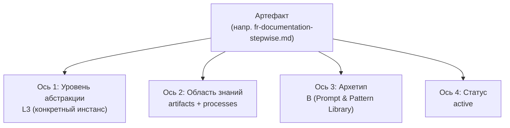
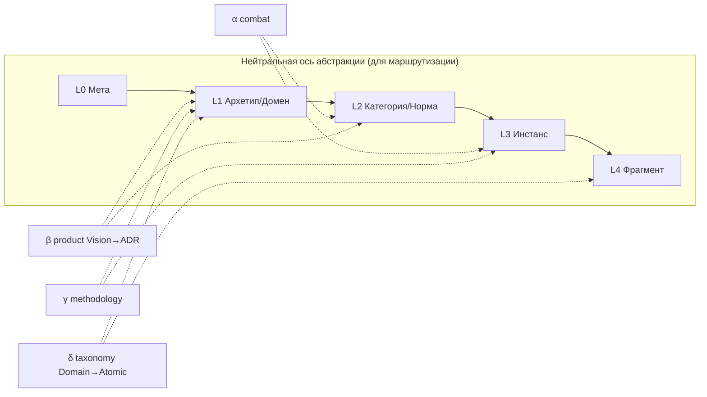
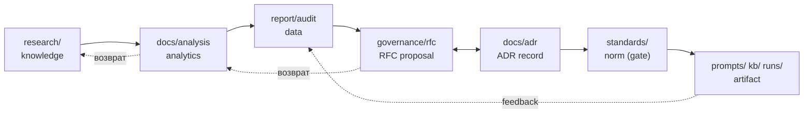
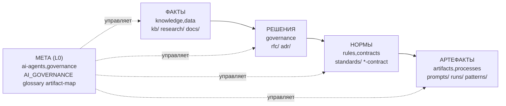

# Инвентаризация и классификация артефактов экосистемы (mango_ba_prompts + hybrid-Intelligence-lab)

> **Режим:** `Research` + `Creative`. Документ — **аналитический отчёт**: он не
> создаёт RFC, не вводит каталоги, не меняет структуру и **не удаляет артефакты**.
> Все рекомендации показаны как trade-offs; решения по удалению/перемещению —
> за Пользователем (фаундером) через RFC → ADR отдельными задачами. Источник —
> [issue #265](https://github.com/G-Ivan-A/hybrid-Intelligence-lab/issues/265).

> **EN abstract.** A full artifact inventory of the two ecosystem repositories
> (the Governance Hub `hybrid-Intelligence-lab` and the Prompt & Pattern Library
> `mango_ba_prompts`), classified on four orthogonal axes — abstraction level
> (L0–L4), knowledge area (8), archetype (A–D) and lifecycle status — then
> overlaid on four prior studies (directory-structure concept, artifact-chain
> hypothesis, approval-contract test, BCREQ-FR contract analysis). It surfaces
> the ecosystem's central classification hazard — **four mutually incompatible
> "L1–L4" ladders** — proposes a single neutral routing ladder to reconcile
> them, lists cleanup candidates with impact assessment, and derives executable
> routing rules for AI agents. Decisions stay with the human.

## Оглавление

1. [Введение](#1-введение)
2. [Результаты исследования (BLUF)](#2-результаты-исследования-bluf)
3. [Методология инвентаризации](#3-методология-инвентаризации)
4. [Перечень артефактов: hybrid-Intelligence-lab (Хаб)](#4-перечень-артефактов-hybrid-intelligence-lab-хаб)
5. [Перечень артефактов: mango_ba_prompts (спок)](#5-перечень-артефактов-mango_ba_prompts-спок)
6. [Классификация по уровням: проблема четырёх лестниц и предложение L0–L4](#6-классификация-по-уровням-проблема-четырёх-лестниц-и-предложение-l0l4)
7. [Классификация по областям знаний/процессов](#7-классификация-по-областям-знанийпроцессов)
8. [Привязка к каталогам: фактическое vs концептуальное](#8-привязка-к-каталогам-фактическое-vs-концептуальное)
9. [Наложение на четыре исследования](#9-наложение-на-четыре-исследования)
10. [Кандидаты на cleanup (бесполезные/дублирующиеся артефакты)](#10-кандидаты-на-cleanup-бесполезныедублирующиеся-артефакты)
11. [Правила маршрутизации артефактов для AI-агентов](#11-правила-маршрутизации-артефактов-для-ai-агентов)
12. [Диаграммы архитектуры](#12-диаграммы-архитектуры)
13. [Сводка trade-offs](#13-сводка-trade-offs)
14. [Открытые вопросы и следующие шаги](#14-открытые-вопросы-и-следующие-шаги)
15. [Источники](#15-источники)

**Часть II (issue [#269](https://github.com/G-Ivan-A/hybrid-Intelligence-lab/issues/269)) — критическое исследование, предоставление вариантов:**

16. [Реестр проблем (без решений)](#16-реестр-проблем-без-решений)
17. [Декомпозиция осей классификации (варианты)](#17-декомпозиция-осей-классификации-варианты)
18. [Ось исполнимости (варианты)](#18-ось-исполнимости-варианты)
19. [Правило «уровень абстракции → формат» (варианты)](#19-правило-уровень-абстракции--формат-варианты)
20. [Варианты инфраструктуры по каталогам (доказательное обоснование)](#20-варианты-инфраструктуры-по-каталогам-доказательное-обоснование)
21. [Гипотеза о контракте Depends On (проверка + варианты формулировок)](#21-гипотеза-о-контракте-depends-on-проверка--варианты-формулировок)
22. [Стандартизация именования research-файлов (варианты)](#22-стандартизация-именования-research-файлов-варианты)
23. [Источники Части II](#23-источники-части-ii)

---

## 1. Введение

**Причина.** Проведены исследования структуры каталогов
([`2026-06-23-repository-structure-concept.md`](2026-06-23-repository-structure-concept.md))
и концепция архетипов, но **отсутствует полная инвентаризация артефактов** обоих
ключевых репозиториев с их классификацией. Без неё нельзя: определить правила
маршрутизации для AI-агентов, выявить бесполезные/дублирующиеся артефакты,
построить правила классификации на уровне агентов, принять решения по структуре
каталогов на фактических данных (issue #265).

**Цель.** (1) Составить полный перечень артефактов в обоих репозиториях;
(2) классифицировать по уровням L1–L3 (с обоснованным расширением); (3)
классифицировать по областям знаний/процессов с привязкой к каталогам; (4)
наложить данные на 4 существующих исследования; (5) выявить бесполезные
артефакты; (6) сформировать правила маршрутизации для AI-агентов.

**Границы.** Это **research → decision support**. Документ ничего не удаляет и не
перемещает (`AI_GOVERNANCE`, §«ЧТО НЕ ДЕЛАЕМ» issue). Каждое предложение —
trade-off, финальное решение за Пользователем.

**Связанные артефакты.**
- [`research/hub/2026-06-23-repository-structure-concept.md`](2026-06-23-repository-structure-concept.md)
  — концепция базовых каталогов и четырёхслойная семантическая модель (база §6–§8).
- [`governance/artifact-map.md`](../../governance/artifact-map.md) — контролируемый
  словарь типов артефактов Хаба (переиспользуется в §4).
- [`standards/glossary.md`](../../standards/glossary.md) — термины уровней и типов.
- mango: `docs/analysis/{artifact-chain-hypothesis-research, approval-contract-test-industry-rfc, bcreq-fr-contract-process-analysis}.md`
  — наложение в §9.

**Метод.** Полный обход обоих рабочих деревьев (`git clone` на закреплённых SHA),
подсчёт размеров и приближённой токенизации (bytes ÷ 4), сверка фактического
размещения с контролируемым словарём `artifact-map.md` и концепцией §9 структурного
исследования; четырёхосевая классификация (уровень × область × архетип × статус);
наложение на 4 отчёта; детект дубликатов/legacy/пустых файлов программно.

**Выбор места отчёта (обоснование).** Issue допускает два размещения. Отчёт
помещён в **`research/hub/`**, а не в `mango/docs/analysis/`, потому что: (a) он
имеет `scope: repo-wide` и охватывает **оба** репозитория, а не один спок;
(b) прямо продолжает [`2026-06-23-repository-structure-concept.md`](2026-06-23-repository-structure-concept.md),
который живёт в `research/hub/`; (c) правило экосистемы — `research/` существует
**только в корне Хаба** (структурное исследование §11, R-«research/»), споки на
него ссылаются reference-only. Артефакт инвентаризации экосистемы — каноничный
Хаб-артефакт.

---

## 2. Результаты исследования (BLUF)

### 2.1. Главные выводы

**В1. Главная находка — не «беспорядок в файлах», а семантический конфликт:
в экосистеме сосуществуют ЧЕТЫРЕ несовместимых лестницы «L1–L4».** Их смешение —
системный риск (это же зафиксировал
[`open-ai-ru/...l3-l4.md`](../open-ai-ru/2026-06-20-open-ai-ru-repository-architecture-and-l3-l4.md)
как «две лестницы», но фактически их **четыре**):

| Лестница | L1 | L2 | L3 | L4 | Где используется |
| --- | --- | --- | --- | --- | --- |
| **(α) Боевая** (combat-asset) | контракты, промпты | реестры, карты-связи | документация, гипотезы | — | bcreq-fr-анализ mango |
| **(β) Продуктовая** | Product Vision | Product Concept | Solution Concept | ADR | `webportal-*-standard`, open-ai.ru |
| **(γ) Методологическая Хаба** | Framework | Framework | governance/standards | practices | `docs/ecosystem-map.md` |
| **(δ) Продуктовая таксономия** | Domain | Capability | Feature | Atomic Function | mango `2026-05-22-classification.md` v3.0 |

Одни и те же символы «L1/L2/L3» означают **четыре разных вещи**. Любая
инвентаризация, которая просто скажет «классифицировано по L1–L3», лишь усугубит
путаницу. Поэтому отчёт **не выбирает одну из четырёх**, а вводит **нейтральную
ось абстракции L0–L4 для маршрутизации** (§6) и явно мэппит на неё все четыре
доменные лестницы — это и есть требуемое issue «расширение классификации с
обоснованием».

**В2. Инвентаризация — это четыре ортогональных оси, а не одна.** Каждый артефакт
описывается координатами: **уровень абстракции** (L0–L4, §6) × **область знаний**
(8 областей, §7) × **архетип** (A/B/C/D) × **статус жизненного цикла** (active /
draft / legacy / duplicate / orphan). Одна ось не заменяет другую: «промпт» — это
L3-абстракция, область `artifacts`/`processes`, архетип B, статус active/legacy.

**В3. Структурно репозитории здоровы; отклонения локализованы.** Хаб точно
соответствует архетипу A (концепция §9.2.A), mango — архетипу B. Фактическое
размещение совпадает с концепцией в ядре; расхождения сосредоточены в **трёх
точках** (§8): (a) `prompts/` плоский vs процессные промпты в `kb/` — но в mango
**нет** `kb/processes/`, что делает критерий §7.1 концепции пока неприменённым;
(b) `docs/analysis/` в mango смешивает анализ, RFC и таксономии; (c) контракты
живут в `governance/`, что концепция §7.1 структурного отчёта прямо одобряет.

**В4. Цепочка артефактов подтверждается как граф, не конвейер.** Наложение
(§9) подтверждает гипотезу `research → analytics → report → RFC/ADR → standard →
artifact` **как граф с возвратами и decision-gates**, и подтверждает её разрыв на
практике mango: BCREQ-FR-контракт теряет process-traceability (нет связи
«операция/промпт → раздел»), что напрямую видно в инвентаре `runs/` (RUN-0014
записал только `contract_used`, RUN-0010/0011 — полную цепочку промптов).

**В5. Бесполезных артефактов в строгом смысле — мало; кандидатов на cleanup —
больше.** «Удалить без последствий» можно немногое (§10): пустой каталог-дубль
`docs/ba-process/` (singular) при наличии `docs/ba-processes/` (plural);
scratch-выгрузки `experiments/*.txt`. Большинство «подозрительных» (legacy-промпты,
56 `.gitkeep`, дубль `.executable.md`/`.md`) — **намеренные паттерны**, удаление
которых имеет последствия; рекомендация — архивировать/задокументировать, не
удалять.

### 2.2. Ключевые цифры инвентаризации

| Метрика | Хаб (hybrid-Intelligence-lab) | Спок (mango_ba_prompts) |
| --- | --- | --- |
| Всего файлов (вне `.git`) | 178 | 9 150 |
| «Смысловых» артефактов (md/json/sh/py/yml, вне processed product-docs) | ~178 | ~361 |
| Processed product-docs (`kb/.../sections/*.md`) | — | 2 189 .md + 5 472 изображений |
| PDF-первоисточники (`kb/.../sources/`) | — | 26 PDF |
| Приближённый объём «смысловых» артефактов | ~0.65M токенов | ~1.4M токенов (вне processed) |
| Объём processed KB (исполнимое знание) | — | ~2.69M токенов |
| Самый «тяжёлый» каталог | `research/` (~326K ток) | `kb/` processed (~2.69M ток) |
| `.gitkeep`-плейсхолдеров | 3 | 56 |
| Валидаторов (`tools/`/`scripts/`) | 4 | 60 (`validate_issue_*.py`) |

> Токены — приближение `bytes ÷ 4` (UTF-8, кириллица занимает ~2 байта/символ,
> поэтому оценка для русских .md **завышена** в ~1.5–2 раза; для кода/JSON близка).

### 2.3. Открытые вопросы и рекомендации (high-level)

| # | Рекомендация (trade-off) | Зависит от решения |
| --- | --- | --- |
| R1 | Принять нейтральную ось **L0–L4 абстракции** для инвентаря/маршрутизации; доменные лестницы (α–δ) — помечать суффиксом (`L2-product`, `L1-combat`) | Пользователь |
| R2 | Закрепить **8 областей знаний** (§7) как контролируемый словарь маршрутизации в `governance/` | RFC отдельной задачей |
| R3 | Завести в mango `kb/processes/*/` и перенести туда процессные промпты по критерию §7.1 концепции (или зафиксировать отказ) | Founder (mango) |
| R4 | Cleanup-кандидаты §10 — отдельной задачей с human-review | Пользователь |
| R5 | Ввести поле связи «контракт ↔ операции» и `runs.applied_prompts` (из bcreq-анализа) | Founder (mango) |
| R6 | Правила маршрутизации §11 — кандидат в стандарт `standards/artifact-routing.md` Хаба | RFC отдельной задачей |

---

## 3. Методология инвентаризации

**Источник данных.** Рабочие деревья обоих репозиториев, склонированные локально
на момент исследования (2026-06-25). Хаб — текущая ветка; mango — `main`.

**Что считается «артефактом».** Любой версионируемый файл, несущий
самостоятельную ценность (документ, контракт, стандарт, промпт, скрипт, данные,
конфиг, изображение-доказательство). `.gitkeep` и пустые плейсхолдеры считаются
артефактами **структуры** (см. §10). Бинарные processed-изображения и
PDF-первоисточники инвентаризируются **агрегатно** (по группам), а не пофайлово —
их 11 000+, индивидуальная ценность каждого = «фрагмент знания» (L4, §6).

**Контролируемый словарь типов.** Берётся из
[`governance/artifact-map.md`](../../governance/artifact-map.md): `навигация`,
`концепция`, `контракт`, `правило`, `руководство`, `стандарт`, `профиль`,
`шаблон`, `исследование`, `утилита`, `журнал`, `лицензия`, `каталог`. Для mango
добавлены типы спока: `промпт`, `паттерн`, `run`, `kb-реестр`, `kb-фрагмент`,
`product-doc`, `валидатор`, `ADR`, `RFC`.

**Оси классификации (четыре, ортогональные):**

1. **Уровень абстракции L0–L4** (§6) — «насколько мета/конкретен артефакт».
2. **Область знаний** (§7) — одна из 8: knowledge, processes, data, rules,
   contracts, artifacts, governance, ai-agents.
3. **Архетип** (§5 концепции) — A/B/C/D.
4. **Статус жизненного цикла** — active / draft / legacy / duplicate / orphan / placeholder.

**Размер.** `wc -c` агрегатно по каталогам + ключевым файлам; токены = `bytes ÷ 4`.

**Детект «бесполезности»** (§10) — программно: `.gitkeep`/пустые (`-size -50c`),
`*legacy*`/`archive/`, дубль-каталоги (`ba-process` vs `ba-processes`),
scratch-выгрузки (`experiments/*.txt`), дубль-форматы (`*.executable.md` + `*.md`),
кросс-репозиторные копии (`research/mango/` Хаба vs mango).

---

## 4. Перечень артефактов: hybrid-Intelligence-lab (Хаб)

Архетип репозитория — **A. Governance & Knowledge Hub**. Ниже — по каталогам;
колонка «Тип» из контролируемого словаря, «Обл.» — область знаний (§7), «Lvl» —
уровень абстракции (§6).

### 4.1. Корень

| Артефакт | Тип | Lvl | Обл. | ~ток | Назначение / статус |
| --- | --- | --- | --- | --- | --- |
| `README.md` | навигация | L1 | governance | 2.6K | Визитка Хаба. active |
| `AI_GOVERNANCE.md` | правило | L0 | ai-agents | 3.3K | Границы работы AI. active |
| `AI_PROJECT_CONTEXT-Summary.md` | навигация | L1 | governance | 0.7K | Сжатый контекст проекта. active |
| `CONCEPT.md` | концепция | L1 | governance | 1.7K | Цель/границы Хаба. active |
| `CONTRIBUTING.md` | руководство | L2 | governance | 2.1K | Правила вклада. active |
| `CHANGELOG.md` | журнал | L3 | data | 20.7K | Журнал governance-изменений. active (растёт) |
| `LICENSE` | лицензия | L0 | governance | <0.1K | Placeholder. active |
| `mkdocs.yml`, `.gitignore`, `.gitkeep` | каталог/конфиг | L0 | governance | 1.9K | Инфраструктура сайта/репо. active |

### 4.2. `governance/` (надзор, EDM) — 26 файлов, ~143K ток

| Группа | Файлы | Тип | Lvl | Обл. |
| --- | --- | --- | --- | --- |
| Карты/навигация | `artifact-map.md` (v1.44), `repo-model.md`, `backlog.md`, `executable-documents-issues.md`, `session-digests.md` | навигация/правило | L0–L1 | governance |
| Онбординг AI | `agent-onboarding-protocol.md` | правило | L0 | ai-agents |
| **RFC-реестр** (`rfc/`) | 18 файлов: `README.md` + 17 RFC (`contract-executability-rfc`, `documentation-architecture-balance`, `draft-triage-and-exit-plan`, `external-knowledge-integration`, `htom-vs-spoke-clarification-2026-06`, `hub-vision-concept-proposal-2026-06`, `knowledge-lifecycle-proposal`, `methodology-research-and-proposals`, `product-concept-template-proposal`, `repository-archetypes-template-release` (PR #243), `repository-quality-improvement-plan`, `research-memory-source-intelligence`, `resolve-artifact-location-proposal`, `rfc-two-cases-of-project-initialization`, `solution-concept-template-proposal`, `tech-debt-solutions-proposal-2026-06`) | RFC (предложение) | L2 | governance/contracts |

> Замечание: `repository-archetypes-template-release.md` — **источник 4 архетипов**
> (PR #243), цитируется концепцией §5. Это якорный L2-артефакт экосистемы.

### 4.3. `standards/` (нормы, SIB) — 17 файлов, ~54K ток

Плоский каталог (по видению фаундера). Все — тип `стандарт`/`профиль`, **L2**,
область **rules** (нормы):

`contract-documentation-standard`, `executable-contract-standard`,
`executable-documentation-standard`, `file-naming`, `frontmatter-standard`,
`frontmatter-docs-standard`, `htom-documentation-structure`, `issue-workflow`,
`project-structure-inheritance`, `session-handover-standard`, `team-contract`,
`glossary` — **нормы и словарь**; `education-profile`, `product-profile`,
`research-profile`, `webportal-product-concept-standard`,
`webportal-solution-concept-standard` — **профили/шаблоны-нормы**.

> Соответствие концепции §7.2: `standards/` корневой, без контрактов/ADR — **✅
> выполнено** (контракты Хаба живут как RFC в `governance/`, ADR в Хабе нет —
> это валидно для архетипа A, где решения идут через RFC-реестр, ср. §10.1
> концепции: «0/19 имеют каталог governance/, решения — через RFC-репо»).

### 4.4. `practices/`, `guides/`, `frameworks/`, `education/`

| Каталог | Содержание | Тип | Lvl | Обл. |
| --- | --- | --- | --- | --- |
| `practices/agent-work/` | 6 файлов: DoR-check, hybrid-search, plan-verify-ship, skill-catalog-token-budget, skills-as-reusable-workflows | руководство | L2 | ai-agents/processes |
| `practices/ai-governance/` | 6 файлов: anthropic-thresholds, eu-ai-act, google-saif, iso-42001, nist-ai-rmf, openai-eval-loop | руководство | L2 | ai-agents/rules |
| `guides/` | 11 how-to: deploy, glossary, init-spoke-repo, quick-start, sync-*, troubleshooting | руководство | L2 | processes |
| `frameworks/`, `education/` | README-заглушки | каталог | L1 | knowledge |

### 4.5. `research/` (только Хаб) — 50+ файлов, ~326K ток (самый «тяжёлый»)

| Подкаталог | Файлы | Тип | Lvl | Обл. |
| --- | --- | --- | --- | --- |
| `research/hub/` | 14: bootstrap-patterns, prompts-classification-audit/standard, team-c-audit, user-prompts-analysis, 2× ai-collaboration-retrospective, external-governance-patterns, ecosystem-governance-audit, **ecosystem-architecture-research**, external-practice-intake, international-ai-governance, **repository-structure-concept** (+ этот файл) | исследование | **L3** | knowledge |
| `research/mango/` | 11: classification, classification-tz, requirements-flow, taxonomy-concept, ai-classifications-formalization, capability-decomposition, rag-mapping-roadmap, repository-structure-vision, requirements-engineering-ai-era, requirements-lifecycle-uncertainty, token-optimization-proposal | исследование | L3 | knowledge |
| `research/governance/` | 4: contract-documentation-format, executable-contract-format, governance-folder-structure-decisions, research-documentation-format | исследование | L3 | knowledge/rules |
| `research/external-knowledge/` | external-sources-registry, wigers-requirements-analysis, `external-insights/` (5: 12-factor-agents, agent-local-memory, building-effective-agents, spec-driven-dev, structured-prompt-driven-dev) | исследование | L3 | knowledge |
| `research/cicd/`, `open-ai-ru/`, `reputation-technologies/` | cicd-template-analysis; open-ai-ru-architecture-l3-l4; 5 reputation-technologies (executive-summary, founders-vision, framework-standard, glossary, white-paper) | исследование | L3 | knowledge |

> **Кросс-репозиторное замечание:** файлы `research/mango/{2026-05-22-classification,
> 2026-05-22-classification-tz, 2026-05-22-requirements-flow,
> 2026-05-26-taxonomy-concept}.md` **отсутствуют** в текущем mango
> (проверено: `find` не нашёл) — они **мигрированы** из спока в Хаб (frontmatter
> `2026-05-22-classification.md`: «source: git history before migration»). Это **не дубль**,
> а knowledge-transfer; канон теперь в Хабе. ✅ соответствует правилу «research/
> только в Хабе».

### 4.6. `docs/`, `projects/`, `templates/`, `tools/`

| Каталог | Содержание | Тип | Lvl | Обл. |
| --- | --- | --- | --- | --- |
| `docs/` | ecosystem-map(+Index), product-concept, vision, audit/task-execution-audit, project-summaries/ (4) | концепция/исследование/навигация | L1–L3 | knowledge/governance |
| `projects/` | repo-development/ (3 docs: contract-violations-self-report, migration-plan, migration-audit), education-ba-prompt/ (course-ideas) | исследование/run | L3 | processes/artifacts |
| `templates/` | `htom/` (полный скелет спока: AI_*, CHANGELOG, init.sh, validate-*.sh, ISSUE_TEMPLATE), `spoke/`, `manifest.json`, `sync-metadata.json`, webportal-*-template, sync-project-with-hub-prompt | шаблон | L1 | artifacts/processes |
| `tools/` | generate-manifest.py, sync-from-hub.sh, validate-frontmatter.sh, validate-mkdocs-site.sh, validate-repository-structure.sh | утилита | L3 | ai-agents/processes |
| `website/`, `.github/` | index.md, extra.css; ISSUE_TEMPLATE, workflows (deploy-docs, update-manifest) | каталог/утилита | L0–L1 | governance |

**Итог по Хабу:** структура **канонична для архетипа A** — `governance/` +
`standards/` + `templates/` + `tools/` + `docs/` + `practices/` + `research/`
(ровно базовый набор §9.2.A концепции). Отклонений от концепции нет; `kb/` и
`runs/` отсутствуют — корректно (они «специфичные» для A, §9.2.A).

---

## 5. Перечень артефактов: mango_ba_prompts (спок)

Архетип — **B. Prompt & Pattern Library**. 9 150 файлов, из них ~361 «смысловых»
+ ~7 661 processed product-docs (sections + images) + 26 PDF.

### 5.1. Корень — исполнимое governance-ядро спока

| Артефакт | Тип | Lvl | Обл. | ~ток |
| --- | --- | --- | --- | --- |
| `README.md` | навигация | L1 | governance | 5.2K |
| `AI_GOVERNANCE.md` | правило | L0 | ai-agents | 2.8K |
| `AI_QUICK_RULES.md` | правило | L0 | ai-agents | 1.6K |
| `AI_SESSION_HANDOVER_PROMPT.md` (+`.executable.md`) | контракт/промпт | L1 | ai-agents | 3.8K+2.1K |
| `CHANGELOG.md` | журнал | L3 | data | 37K |
| `Makefile` | утилита | L3 | ai-agents/processes | 2.4K |
| `.hub-profile.json` | конфиг-связь | L0 | governance | 0.6K |
| `CONTRIBUTING.md`, `LICENSE`, `.gitattributes`, `.gitignore` | руководство/инфра | L0–L2 | governance |

### 5.2. `prompts/` (плоский) — 28 файлов, ~46K ток — **ядро ценности B**

| Группа | Файлы | Статус |
| --- | --- | --- |
| Активные oneshot/stepwise | asr-ingestion-oneshot, constraints-documentation-{oneshot,stepwise}, fr-documentation-{oneshot,stepwise}, fr-validation-{oneshot,stepwise}, glossary-context-understanding-{oneshot,stepwise}, meeting-{customer,team}-documentation-stepwise, questions-customer-understanding-stepwise, session-debug-documentation-oneshot, technical-details-solution-design-{oneshot,stepwise}, uc-modeling-{oneshot,stepwise}, us-modeling-{oneshot,stepwise} | **active** (L3, processes/artifacts) |
| `README.md` (+`.executable.md`) | реестр промптов | active (L1) |
| **Legacy в корне** | asr-ingestion-legacy, fr-validation-legacy, letter-customer-documentation-legacy, questions-customer-understanding-legacy, technical-details-solution-design-legacy | **legacy** (§10) |
| **`prompts/archive/`** | tz-stats-generator-{,simple-}legacy, usecase-stepwise-generator-{,simple-}legacy, user-story-generator-{,simple-}legacy | **archived** (L3, статус retired) |

> Конвенция имён: `<artifact>-<action>-<mode>` где mode ∈ {oneshot, stepwise,
> legacy}. Это L3-боевые ассеты архетипа B.

### 5.3. `patterns/` — 8 паттернов × (README+example), ~19K ток

`asr-ingestion`, `fr-generation`, `fr-validation`, `glossary-context-generation`,
`meeting-summary-generation`, `usecase-generation`, `user-story-generation` —
каждый `README.md` + `examples/basic-example.md`. Тип `паттерн`, **L2** (категория
переиспользуемой логики), область **processes**.

### 5.4. `standards/` — 21 файл, ~104K ток

Нормы спока (**L2**, **rules**): artifact-naming, ba-ontology(+executable),
bcreq-process, cascading-context-loading, executable-contract, experiment-log,
industry-standards, industry-taxonomy, kb, mango-taxonomy, pages-ux, pattern,
product-classification-contract, prompt, readme, runs-contract, team-directory,
GLOSSARY; `decisions/ADR-011-industry-taxonomy`, `ADR-012-mango-taxonomy`.

> ⚠️ Отклонение от концепции §7.2: `standards/decisions/ADR-*` держит ADR **внутри**
> `standards/`. Концепция рекомендует «очистить `standards/` от контрактов и ADR».
> Trade-off §8. Также `product-classification-contract.md` — это **контракт** в
> `standards/`, тоже кандидат на вынос.

### 5.5. `governance/` — 31 файл, ~101K ток

| Группа | Файлы | Тип | Lvl | Обл. |
| --- | --- | --- | --- | --- |
| Контракты-генераторы | `bcreq-fr-generation-contract.md`, `rfc-generation-contract.md`, `approval-contract.md` | контракт | **L1** (combat) | contracts |
| Реестры | `contracts-registry.md`, `rfc-register.md`, `migration-issues-registry.md`, `artifact-map.md` | навигация/реестр | L2 | governance |
| Процессы | `prompt-debugging-process.md`, `rfc-process.md`, `agent-onboarding-protocol(.executable).md` | правило/процесс | L1–L2 | processes/ai-agents |
| Аудиты (date-based) | `audit-contracts-2026-06-17`, `audit-contracts-mango-...`, `audit-hub-...`, `audit-research-1027`, `sync-matrix-...` | исследование/отчёт | L3 | data |
| Knowledge-transfer | `knowledge-transfer-to-hub/` (ba-ontology, bcreq-process, operations-taxonomy, pages-ux), `rfc-to-hub-001/002` | RFC/исследование | L2–L3 | knowledge |
| `rfc/` | bcreq-ft-scope-formation, prompt-improvement-bcreq-1025, prompt-improvement-multichannel | RFC | L2 | governance |
| Прочее | `BACKLOG.md`, `session-digests.md`, `migration-manifest.md`, `migration-phase1-issues.md`, `prompt-feedback.json` | навигация/журнал | L1–L3 | governance/data |

### 5.6. `kb/` — исполнимое знание (ядро B), ~227K ток смысл. + 2.69M processed

| Подкаталог | Содержание | Тип | Lvl | Обл. |
| --- | --- | --- | --- | --- |
| `kb/industry-taxonomy/` | registry.json + schema + README | kb-реестр | **L2/L3** | data/knowledge |
| `kb/mango-taxonomy/` | registry.json + schema + README | kb-реестр | L2/L3 | data/knowledge |
| `kb/golden-examples/` | CONTRACT.md, README, adr/bcreq-fr/rfc (.gitkeep) | контракт/пример | L2 | contracts/knowledge |
| `kb/fragments/`, `kb/practices/` | README, source-backed-analysis | kb-фрагмент | L3–L4 | knowledge |
| `kb/mango-product-docs/sources/` | **26 PDF** (16 продуктов: VATS, CC-manual, LK-manual, mTalker, speech-analytics, vpbx-api, integrations 1C/amoCRM/Bitrix24, …) + meta.json | product-doc (источник) | **L4** | data |
| `kb/mango-product-docs/processed/` | **2 189 `*.md` sections + 5 472 изображений** | kb-фрагмент (исполнимое знание) | **L4** | data/knowledge |

> `kb/` — главное по объёму (~2.9M ток с processed). Это «боевое исполнимое
> знание» по видению фаундера: машиночитаемые секции + реестры-таксономии. L4
> processed-фрагменты — атомарные единицы знания (RAG-ready).

### 5.7. `runs/` — операционная запись, 15 прогонов, ~117K ток

`RUN-0001..0015`, каждый — `metadata.yaml` + `inputs/` + `outputs/` + `logs/` +
`feedback/`; плюс `CONTRACT.md`, `README.md`, `REGISTRY.md`, `stats/{by-date,
by-process,by-type}.md`. Тип `run`, **L3** (конкретный артефакт-исполнения),
область **artifacts/data**.

> Ключ для §9: RUN-0010/0011 фиксируют **цепочку промптов** (`prompts-chain.md`,
> `steps/step-1..5`); RUN-0014 (применил контракт) записал только `contract_used`.
> Это эмпирическое подтверждение разрыва process-traceability (bcreq-fr-анализ).

### 5.8. `scripts/`, `experiments/`, `docs/`, `site/`, `templates/`

| Каталог | Содержание | Тип | Lvl | Обл. |
| --- | --- | --- | --- | --- |
| `scripts/` | **60 `validate_issue_*.py`** + kb/ (extract, process_sources, tokens, make_sample_pdf) + generate-pages-data.mjs | валидатор/утилита | L3 | ai-agents/processes |
| `experiments/` | issue-174/176/180/208/221 (JSON-данные, score.py), build_*.py, cascade_fill.py, **+5 `*.txt` scratch** (doc_catalog, evidence_paths, industry_nodes, inventory_current, per_product_state) | run/утилита | L3–L4 | data/artifacts |
| `docs/adr/` | 13 ADR (0001-0003 + 001-010): prompt/pattern/ontology/operations-taxonomy/kb/industry/bcreq/pages стандарты | ADR (решение) | **L2** | governance/contracts |
| `docs/analysis/` | **21 файл**: 4 наложения (§9) + ba-processes-industry, executable-contracts-problems, industry-inventory, issue-170-mango-inventory, migration-strategy-rfc, naming-convention-audit, **repository-structure-analysis** (база концепции §2), rfc-*-taxonomy-improvement(×3), rfc-rules-registry, runs-*-audit/research, taxonomy-convergence-test(×2), telecom-vendors, voice-digital-channels | исследование/RFC/анализ | **L3** | knowledge |
| `docs/audit/` | initial-state, issue-115/144/146, taxonomy-standards-review | исследование/отчёт | L3 | data |
| `docs/ba-processes/` | `00-index.md` (52K!) + `.executable.md` + README — **карта операций L3** (ключ bcreq-анализа) | навигация/процесс | **L2** | processes |
| `docs/ba-process/` (singular) | **только README.md** | каталог | — | **orphan, §10** |
| `docs/` прочее | ba-ecosystem, hub-research-dependencies, kb-experiment-report, requirements-engineering-crosswalk, rfc-hub-integration, taxonomy, task-for-konard-template, reviews/, screenshots/ (15 PNG) | разное | L1–L3 | knowledge/data |
| `site/` | app.js, index.html, styles.css, data/*.json (7) — GitHub Pages UI | утилита/данные | L3 | artifacts |
| `templates/` | readme-template.md | шаблон | L1 | artifacts |

**Итог по mango:** структура **канонична для архетипа B** — `prompts/` + `kb/` +
`runs/` + `patterns/` + `standards/` + `governance/` + `docs/` (ср. §9.2.B
концепции). Отклонения: ADR/контракт в `standards/` (§5.4), дубль-каталог
`ba-process` (§5.8), отсутствие `kb/processes/` (В3).

---

## 6. Классификация по уровням: проблема четырёх лестниц и предложение L0–L4

### 6.1. Проблема: «L1–L3» перегружено четырьмя смыслами

Issue требует «классифицировать по L1–L3 и предложить расширение». Но
**нельзя классифицировать по L1–L3, пока не выбрано, какая это лестница** — в
экосистеме их четыре (В1), и они **ортогональны**:

- **(α) Боевая** (combat-asset, bcreq-анализ): L1=исполняемые ассеты, L2=реестры/связи,
  L3=документация/гипотезы. Ось — «насколько близко к проду».
- **(β) Продуктовая** (webportal-стандарты): L1 Vision → L2 Concept → L3 Solution →
  L4 ADR. Ось — «стадия проектирования продукта».
- **(γ) Методологическая Хаба** (ecosystem-map): L1–L2 Framework, L3–L4 Methodology.
  Ось — «слой знания Хаба».
- **(δ) Продуктовая таксономия** (mango classification v3.0): Domain → Capability →
  Feature → Atomic Function. Ось — «гранулярность предметной области MANGO».

Смешение этих лестниц — уже зафиксированный риск
([open-ai-ru l3-l4](../open-ai-ru/2026-06-20-open-ai-ru-repository-architecture-and-l3-l4.md):
«две разные лестницы L1–L4, их смешение — главный риск»). Инвентаризация
**обнаруживает, что лестниц не две, а четыре**.

### 6.2. Предложение (расширение): нейтральная ось абстракции **L0–L4** для маршрутизации

Чтобы инвентаризировать и маршрутизировать артефакты **независимо от домена**,
вводится пятая, **нейтральная** ось — уровень **абстракции/мета-ранга** артефакта.
Она не конкурирует с α–δ, а служит **общим знаменателем** для routing-правил
(§11). Обоснование L0 и L4 (расширение за пределы L1–L3) дано в таблице.

| Lvl | Имя | Определение (что это) | Критерий отнесения | Примеры |
| --- | --- | --- | --- | --- |
| **L0** | **Мета** (rules-about-rules) | Определяет саму систему: как устроены правила, словарь, размещение, границы AI | «Артефакт управляет другими артефактами/процессом, а не предметной областью» | `AI_GOVERNANCE.md`, `glossary`/`GLOSSARY.md`, `artifact-map.md`, `file-naming`, `frontmatter-standard`, `project-structure-inheritance`, `.hub-profile.json`, `LICENSE` |
| **L1** | **Архетип / Домен** (high-level) | Высокоуровневые сущности: архетипы, домены, видения, концепции, карты экосистемы | «Отвечает на вопрос *что за мир/проект*, без деталей реализации» | архетипы PR #243, `CONCEPT.md`, `vision.md`, `ecosystem-map.md`, `README.md`-навигация, Product Vision (β-L1), Domain (δ) |
| **L2** | **Категория / Процесс / Норма** (mid-level) | Стандарты, процессы, паттерны, RFC/ADR-решения, таксономии-как-реестры, контракты-как-спецификация | «Повторяемое правило/категория для класса конкретных артефактов» | `standards/*`, `patterns/*`, RFC, ADR, `*-generation-contract`, `kb/*-taxonomy/registry`, карта операций `00-index` |
| **L3** | **Конкретный артефакт** (low-level) | Экземпляры: промпты, прогоны, отчёты-исследования, аудиты, валидаторы | «Конкретный файл-инстанс, созданный по норме L2» | `prompts/*`, `runs/RUN-*`, `research/*`, `docs/analysis/*`, `validate_issue_*.py`, CHANGELOG |
| **L4** | **Фрагмент / Данные** (atomic) | Атомарные единицы: KB-фрагменты, processed-секции, изображения, узлы таксономии, логи прогонов | «Минимальная единица данных/знания внутри артефакта L3» | `kb/.../processed/*/sections/*.md`, processed-изображения, PDF-источники, узлы `registry.json`, `runs/.../logs/*`, Atomic Function (δ) |

**Почему именно L0–L4 (расширение L1–L3):**

- **L0 необходим**, потому что без него мета-правила (`AI_GOVERNANCE`, `glossary`,
  `artifact-map`, нормы именования) попадают в один уровень с предметными
  стандартами, тогда как они **управляют классификацией самих стандартов**. Это
  отдельный мета-ранг (ср. governance-of-governance). 12 артефактов Хаба и 6 mango
  — чистый L0.
- **L4 необходим**, потому что 7 661 processed-фрагмент + узлы таксономий — это
  **не «конкретные артефакты», а данные внутри них**. Без L4 инвентарь
  схлопывает 99% файлов mango в один уровень с промптами, теряя гранулярность
  RAG (ср. δ-Atomic Function, `rag-mapping-roadmap`).
- **L1–L3 сохраняются** как в исходном требовании issue; расширение **аддитивно**
  (не ломает существующие ссылки на L1–L3 в α/β/γ/δ).

### 6.3. Мэппинг доменных лестниц на нейтральную ось

| Доменная лестница | На нейтральной оси | Комментарий |
| --- | --- | --- |
| (α) combat L1 (контракт/промпт) | **L2** (контракт-спец) + **L3** (промпт-инстанс) | «Боевой» ≠ «высокоуровневый»: контракт — норма L2, промпт — инстанс L3 |
| (α) combat L2 (реестр/карта) | **L2** | Совпадает по смыслу «категория/связь» |
| (α) combat L3 (доки/гипотезы) | **L3** | Совпадает |
| (β) product L1–L4 (Vision→ADR) | **L1** (Vision/Concept) → **L2** (Solution/ADR) | Стадия проектирования ≠ абстракция файла |
| (γ) methodology L1–L4 | **L1** (Framework) → **L2** (governance/standards) → **L3** (practices-инстансы) | Слой знания |
| (δ) taxonomy Domain→Atomic | **L1** (Domain) → **L2** (Capability/Feature) → **L4** (Atomic Function) | Гранулярность предметной области |

**Рекомендация R1:** в метаданных артефактов использовать **квалифицированные**
метки доменных лестниц (`L2-product`, `L1-combat`, `L3-taxonomy`), а
«голые» `L0–L4` зарезервировать за нейтральной осью абстракции. Это снимает
коллизию символов без изобретения новых сущностей сверх необходимого.

### 6.4. Сводное распределение по L0–L4 (приближённо)

| Lvl | Хаб (шт.) | mango (шт., вне processed) | Доминирующая область |
| --- | --- | --- | --- |
| L0 | ~12 | ~6 | governance, ai-agents |
| L1 | ~20 | ~15 | knowledge, governance |
| L2 | ~60 (standards+RFC+practices) | ~70 (standards+patterns+ADR+contracts) | rules, processes, contracts |
| L3 | ~80 (research+docs+tools) | ~250 (prompts+runs+analysis+scripts) | knowledge, artifacts |
| L4 | — | **~7 661** (processed) + узлы реестров | data |

---

## 7. Классификация по областям знаний/процессов

### 7.1. Восемь областей (контролируемый словарь маршрутизации)

Issue задаёт 8 областей. Они **ортогональны** уровню L0–L4 и **накладываются на
четырёхслойную семантическую модель** концепции (`ФАКТЫ → РЕШЕНИЯ → НОРМЫ →
АРТЕФАКТЫ`, §9.4 концепции):

| Область | Вопрос | Слой модели концепции | Каталог-носитель (факт) | Тип артефактов |
| --- | --- | --- | --- | --- |
| **knowledge** (знания) | что знаем | ФАКТЫ | `research/`, `kb/`, `docs/`, `knowledge/` | исследование, kb-фрагмент, концепция |
| **processes** (процессы) | как работаем | НОРМЫ/АРТЕФАКТЫ | `patterns/`, `docs/ba-processes/`, `guides/`, `practices/` | процесс, паттерн, руководство |
| **data** (данные) | что произошло | АРТЕФАКТЫ/ДАННЫЕ | `runs/`, `CHANGELOG`, `kb/.../processed/`, аудиты | run, журнал, kb-фрагмент, отчёт |
| **rules** (правила) | ограничения | НОРМЫ | `standards/` | стандарт, профиль, правило |
| **contracts** (контракты) | формальные соглашения | НОРМЫ | `governance/*-contract`, `kb/golden-examples/CONTRACT` | контракт |
| **artifacts** (исполнение) | результаты | АРТЕФАКТЫ | `prompts/`, `runs/outputs/`, `templates/`, `site/` | промпт, run-output, шаблон |
| **governance** (управление) | как управляем | РЕШЕНИЯ/НОРМЫ | `governance/`, RFC, ADR, реестры | RFC, ADR, навигация, правило |
| **ai-agents** (правила AI) | как работает AI | НОРМЫ/МЕТА | `AI_GOVERNANCE`, `practices/agent-work/`, `tools/`, валидаторы | правило, утилита, протокол |

### 7.2. Принципы (не только правила) распределения по областям

1. **Принцип SSOT-по-области.** Артефакт принадлежит **ровно одной** первичной
   области (каноническое место); вторичные связи — ссылками. Пример: `prompt-standard`
   — первично **rules** (это норма), не **artifacts** (хотя про промпты).
2. **Принцип «факт → решение → норма → артефакт»** (из концепции §9.4): область
   определяется тем, на каком слое лежит артефакт. Research = факт (knowledge);
   RFC/ADR = решение (governance); standard = норма (rules); prompt/run = результат
   (artifacts/data).
3. **Принцип исполнимости (combat).** Если артефакт нужен, *чтобы что-то
   исполнилось на проде* — он тяготеет к **artifacts/contracts/processes** и каталогу
   `kb/`/`prompts/`/`governance/`; если он *описывает/обосновывает* — к
   **knowledge** и `research/`/`docs/`.
4. **Принцип мета-изоляции (ai-agents/L0).** Правила для AI (`AI_GOVERNANCE`,
   onboarding, валидаторы) — отдельная область, потому что они **управляют тем, как
   агент трогает все остальные** (защита runtime от L3-загрузки, ср. bcreq-анализ
   «L1/L2 не грузить L3-документами»).

### 7.3. Матрица «область × архетип» (где область обязательна)

| Область | A (Hub) | B (mango) | C (Product) | D (Education) |
| --- | --- | --- | --- | --- |
| knowledge | ✅ research/ | ✅ kb/ docs/ | ◻ docs/ | ✅ curriculum |
| processes | ✅ practices/ guides/ | ✅ patterns/ ba-processes/ | ◻ | ◻ |
| data | ◻ | ✅ runs/ kb/processed | ✅ data/ db/ | ◻ |
| rules | ✅ standards/ | ✅ standards/ | ◻ inherited | ◻ |
| contracts | ◻ RFC | ✅ governance/ | ◻ | — |
| artifacts | ✅ templates/ | ✅ prompts/ runs/ | ✅ src/ | ✅ examples/ |
| governance | ✅ governance/ | ✅ governance/ | ◻ inherited | ◻ boundaries |
| ai-agents | ✅ AI_GOVERNANCE practices/ | ✅ AI_* tools | ◻ inherited | ◻ |

(✅ = ядро архетипа, ◻ = рекомендуемо/наследуется, — = отсутствует)

---

## 8. Привязка к каталогам: фактическое vs концептуальное

Сверка фактического размещения с концепцией §9.2 структурного исследования.

| # | Артефакт/группа | Фактически | Концепция (§ структурного исслед.) | Статус | Действие (trade-off) |
| --- | --- | --- | --- | --- | --- |
| 1 | Контракты-генераторы mango | `governance/*-contract.md` | §7.1: контракты-исполнение — рядом с процессом/governance | ✅ Совпадает | — |
| 2 | ADR mango | `standards/decisions/ADR-*` | §7.2: очистить `standards/` от ADR | ⚠️ Отклонение | Вынести в `docs/adr/` (там уже 13 ADR) — **дубль-локация ADR** |
| 3 | `product-classification-contract` | `standards/` | §7.2: контракты не в `standards/` | ⚠️ Отклонение | Вынести в `governance/`/`kb/golden-examples/` |
| 4 | Процессные промпты mango | `prompts/` (плоский) | §7.1: исполнимые → `kb/processes/*/prompt.md` | ⚠️ Не применено | Завести `kb/processes/` **или** зафиксировать отказ (В3, R3) |
| 5 | RFC mango | `docs/analysis/` **и** `governance/rfc/` | §2 (Q2): RFC — деление по функции | ⚠️ Двойственность | Свести RFC в один канон (`governance/rfc/`); `docs/analysis/` — только анализ |
| 6 | `research/` Хаба | только Хаб | §11: research только в Хабе | ✅ Совпадает | — |
| 7 | `tools/` vs `scripts/` | Хаб=`tools/`, mango=`scripts/` | §6.4: по умолчанию `tools/`, `scripts/` — профиль | ⚠️ Расхождение | Косметика; mango automation-heavy → `scripts/` допустим |
| 8 | `kb/` исполнимый | mango `kb/` (JSON+sections) | §3: kb = боевое исполнимое | ✅ Совпадает | — |
| 9 | `knowledge/` | отсутствует в обоих | §7.3: опционален | ✅ Норм | — |
| 10 | ADR Хаба | отсутствуют (решения = RFC) | §10.1: A решает через RFC | ✅ Совпадает | — |

**Вывод §8.** Ядро обоих репозиториев **совпадает** с концепцией. Все отклонения
(2,3,4,5) — в спок-mango и касаются **границы «норма vs решение vs контракт vs
исполнение»**: ADR и контракты «протекли» в `standards/`, RFC раздвоились между
`docs/analysis/` и `governance/rfc/`, а критерий процессных промптов (§7.1
концепции) ещё не применён, т.к. нет `kb/processes/`.

---

## 9. Наложение на четыре исследования

### 9.1. Концепция структуры каталогов (`2026-06-23-repository-structure-concept.md`)

| Тезис концепции | Проверка инвентарём | Вывод |
| --- | --- | --- |
| Хаб = архетип A (§9.2.A: governance+standards+templates+tools+docs+practices+research) | Все 7 каталогов присутствуют, kb/runs отсутствуют (специфичные) | ✅ **Подтверждено полностью** |
| mango = архетип B (§9.2.B: governance+docs+standards+prompts+kb+runs+templates+patterns) | Все присутствуют | ✅ **Подтверждено** |
| `standards/` очищен от контрактов/ADR (§7.2) | Хаб — ✅; mango — ❌ (ADR-011/012, product-classification-contract в standards/) | ⚠️ **Частично** (§8.2–8.3) |
| Процессные промпты → `kb/processes/*` (§7.1) | `kb/processes/` **не существует** в mango | ⚠️ **Не реализовано** (R3) |
| `research/` только в Хабе (§11) | mango research мигрирован в Хаб `research/mango/` | ✅ **Подтверждено** (§4.5) |
| Четырёхслойная модель ФАКТЫ→РЕШЕНИЯ→НОРМЫ→АРТЕФАКТЫ (§9.4) | Использована как ось областей (§7) | ✅ **Переиспользована** |

### 9.2. Artifact Chain Hypothesis (`artifact-chain-hypothesis-research.md`)

Гипотеза: `research → analytics → report → RFC/ADR → standard → artifact` как
**граф с возвратами**, не конвейер; H1–H4 подтверждены отраслевой практикой.

| Звено цепи | Артефакты в инвентаре (Хаб/mango) | Подтверждение |
| --- | --- | --- |
| research | Хаб `research/*` (50+), mango `docs/analysis/*` | ✅ существует как слой |
| analytics ≠ report | mango смешивает в `docs/analysis/` (анализ + RFC + convergence-тесты) | ⚠️ граница размыта (риск R-2 гипотезы) |
| RFC ↔ ADR | Хаб: только RFC (`governance/rfc/`), 0 ADR; mango: RFC + 13 ADR (`docs/adr/`) + 2 в `standards/decisions/` | ⚠️ ADR-локация раздвоена (§8.2) |
| standard как отдельный gate (H4) | `standards/` обоих репо — отдельный слой | ✅ подтверждает H4 (standard ≠ автонормализация RFC) |
| artifact | `prompts/`, `runs/`, `kb/` | ✅ конечное звено |

**Вывод:** инвентарь **эмпирически подтверждает** гипотезу-граф и её риск R-3
(дублирование RFC/ADR без entry-criteria): ADR живут в **двух** местах mango,
RFC — в **двух** (`docs/analysis/` и `governance/rfc/`). Это ровно «дублирование
без entry criteria», предсказанное гипотезой.

### 9.3. Approval Contract Test (`approval-contract-test-industry-rfc.md`)

Контракт согласования (`governance/approval-contract.md`) + его тест на RFC
industry-taxonomy; маршрутизация: контракты → `governance/`, RFC → `docs/analysis/`,
стандарты/ADR → `standards/`+`standards/decisions/`, тесты контрактов → `scripts/`.

| Находка отчёта | В инвентаре | Вывод |
| --- | --- | --- |
| `governance/approval-contract.md` существует | ✅ присутствует (§5.5) | подтверждено |
| Тесты контрактов = `validate_issue_*.py` | ✅ `validate_issue_193_approval_contract.py` среди 60 валидаторов (§5.8) | ✅ паттерн «контракт ↔ валидатор» виден в инвентаре |
| Каждый артефакт — YAML-frontmatter (status/version/type/issue) | ✅ соблюдается (проверено на выборке) | подтверждено |
| Маршрут: контракт→governance, RFC→docs/analysis | ⚠️ RFC и в `governance/rfc/` тоже | двойственность (§8.5) |

**Вклад в классификацию:** подтверждает связку **contract (L2, область contracts)
↔ validator (L3, область ai-agents)** как воспроизводимый паттерн; в правилах
маршрутизации (§11) фиксируется: «контракт без парного валидатора = неполный
артефакт».

### 9.4. BCREQ-FR Contract Process Analysis (`bcreq-fr-contract-process-analysis.md`)

Контракт `bcreq-fr-generation-contract.md` (L1-combat) применяется монолитно;
теряется process-traceability (нет связи «операция/промпт → раздел»).

| Находка отчёта | Подтверждение инвентарём | Вывод |
| --- | --- | --- |
| Контракт не ссылается на промпты | `governance/bcreq-fr-generation-contract.md` существует; `prompts/` отдельно, без обратных ссылок | ✅ структурный разрыв виден |
| RUN-0010/0011 фиксируют цепочку, RUN-0014 — только `contract_used` | ✅ инвентарь `runs/`: RUN-0011 имеет `outputs/prompts-chain.md`+`steps/`; RUN-0014 — нет | ✅ **прямое эмпирическое подтверждение** |
| Карта операций — `docs/ba-processes/00-index.md` (L3) | ✅ существует (52K), + дубль singular `ba-process/` (orphan) | подтверждено + найден orphan (§10) |
| Две декомпозиции (3 шага контракта vs 6 операций карты) не сверяются | контракт в `governance/`, карта в `docs/ba-processes/` — нет связующего поля | ✅ подтверждает root-cause |
| Нет `runs.applied_prompts` | schema runs (`runs/CONTRACT.md`) без слота операций | ✅ R5 |

**Вклад в классификацию:** различает **два вида трассируемости** — artifact
(FR→источник→таксономия, сильная) и process (операция→раздел, разорвана). В
правилах §11 это даёт триггер: «combat-контракт L1 должен иметь поле связи с
операциями (L2-карта)».

### 9.5. Сводный вывод наложения

Все 4 исследования **сходятся** на одной структурной проблеме, видимой в
инвентаре: **граница «норма (standard) ↔ решение (RFC/ADR) ↔ контракт ↔
исполнение (prompt/run)» размыта в mango**, а связующие поля между уровнями
(контракт↔операции, run↔промпты, RFC↔ADR-канон) **отсутствуют**. Инвентарь —
не самоцель, а карта, на которой эта проблема локализуется в конкретных файлах.

---

## 10. Кандидаты на cleanup (бесполезные/дублирующиеся артефакты)

> ⚠️ **Ничего не удаляется этим отчётом.** Ниже — кандидаты с критерием,
> последствиями и рекомендацией. Решение — за Пользователем (issue: «НЕ удалять —
> только рекомендовать»).

| # | Артефакт | Критерий | Последствия удаления | Рекомендация |
| --- | --- | --- | --- | --- |
| 1 | mango `docs/ba-process/` (singular, только README) | **Дубль-каталог** при `docs/ba-processes/` (plural, реальный индекс) | Нет, если контент README не уникален | **Проверить и объединить/удалить** (низкий риск) |
| 2 | mango `experiments/*.txt` (doc_catalog, evidence_paths 217K, industry_nodes, inventory_current, per_product_state) | **Scratch-выгрузки** (не .md/не воспроизводимый скрипт) | Низкие (промежуточные данные старых issue) | **Архивировать** или удалить с фиксацией в CHANGELOG |
| 3 | mango `prompts/*-legacy.md` (5 в корне) + `prompts/archive/*-legacy.md` (6) | **Устаревание** (заменены oneshot/stepwise) | Средние: история/сравнение | **Не удалять**; консолидировать корневые legacy в `prompts/archive/` (сейчас разнесены) |
| 4 | 56 `.gitkeep` (mango) / 3 (Хаб) | **Пустые плейсхолдеры** | Сломают пустые каталоги в git | **Не удалять** (намеренный паттерн структуры) |
| 5 | Дубль-формат `*.executable.md` + `*.md` (5 пар mango, напр. `ba-ontology`, `00-index`, `agent-onboarding`) | **Дублирование контента** в двух форматах | Сломает executable-doc-паттерн (`executable-documentation-standard`) | **Не удалять** (намеренно: human-doc + machine-exec); задокументировать паритет |
| 6 | mango `docs/analysis/` смешивает анализ + RFC + convergence-тесты (21 файл) | **Изоляция/смешение** типов | — | **Не удалять**; рассортировать (RFC→`governance/rfc/`) |
| 7 | mango `standards/decisions/ADR-011/012` + `docs/adr/*` | **Дубль-локация ADR** (два места) | Риск рассинхрона | **Свести в один канон** (`docs/adr/`) |
| 8 | Параллельные реестры: `governance/contracts-registry.md`, `rfc-register.md`, `migration-issues-registry.md`, `artifact-map.md` | Потенциальное **дублирование** связей | Потеря навигации | **Проверить пересечение**; не удалять без сверки |

**Истинно «удалить без последствий»** — только #1 (после проверки README) и #2
(scratch). Остальное — намеренные паттерны или требует консолидации, а не удаления.
Это и есть честный ответ на DoD «выявить бесполезные артефакты»: их **мало**, и
шум в репозитории — не «мусор», а **размытые границы** (§8, §9).

---

## 11. Правила маршрутизации артефактов для AI-агентов

Исполнимые правила (decision-tree), чтобы агент клал новый артефакт в каноническое
место. Формат — «триггер → каталог → проверка». Это кандидат в стандарт
`standards/artifact-routing.md` Хаба (R6).

### 11.1. Корневой decision-tree (по областям §7 и уровню §6)

```text
1. Это правило о САМОЙ системе (словарь, именование, границы AI, карта)?
   → L0 / область governance|ai-agents
   → Хаб: корень или governance/ ; спок: корень (AI_*) или standards/glossary
2. Это высокоуровневая сущность (архетип/домен/видение/концепция)?
   → L1 / knowledge|governance → docs/ (concept,vision) | README
3. Это ПОВТОРЯЕМОЕ правило/категория для класса артефактов?
   3a. Норма оформления/критерий?      → L2/rules     → standards/ (плоский)
   3b. Решение «что менять» (proposal)? → L2/governance→ governance/rfc/
   3c. Решение «как построено» (record)?→ L2/governance→ docs/adr/  (ОДИН канон)
   3d. Формальное соглашение ролей?     → L2/contracts → governance/*-contract
   3e. Переиспользуемая логика-процесс? → L2/processes → patterns/
4. Это КОНКРЕТНЫЙ артефакт-инстанс?
   4a. Промпт нужен, чтобы артефакт исполнился на проде (combat)?
        → рядом с процессом → kb/processes/<process>/prompt.md  [критерий §7.1]
   4b. Промпт standalone/системный?     → L3/artifacts → prompts/ (плоский)
   4c. Прогон/эксперимент?              → L3/data      → runs/RUN-NNNN/
   4d. Исследование/анализ/аудит?       → L3/knowledge → research/ (Хаб) | docs/analysis (спок)
   4e. Воспроизводимая проверка?        → L3/ai-agents → tools/ (Хаб) | scripts/ (спок)
5. Это АТОМАРНАЯ единица данных/знания?
   → L4/data → kb/.../processed | kb/*-taxonomy/registry (узлы) | runs/.../logs
```

### 11.2. Правила-инварианты (валидируемые)

| ID | Правило | Проверка (валидатор) |
| --- | --- | --- |
| RT-01 | Каждый артефакт имеет YAML-frontmatter (status, version, type, область) | `validate-frontmatter.sh` |
| RT-02 | `standards/` не содержит контрактов и ADR (концепция §7.2) | grep `type: contract|adr` в standards/ → fail |
| RT-03 | ADR существует **ровно в одном** каноне (`docs/adr/`) | детект ADR-* вне `docs/adr/` → warn |
| RT-04 | RFC — в `governance/rfc/`; `docs/analysis/` — только `type: analysis|research` | детект `type: rfc` в docs/analysis → warn |
| RT-05 | Combat-контракт (L1) имеет поле связи `operations:`/`prompts:` (bcreq-анализ R5) | schema-check контракта |
| RT-06 | Каждый `*-contract` имеет парный `validate_*` (approval-test §9.3) | детект контракта без валидатора → warn |
| RT-07 | `run` фиксирует `applied_prompts`/`operations` (bcreq-анализ R5) | schema-check `runs/CONTRACT.md` |
| RT-08 | `research/` создаётся **только в Хабе**; спок ссылается reference-only | детект `research/` в споке → fail |
| RT-09 | Процессный (combat) промпт живёт у процесса (`kb/processes/*`), не в плоском `prompts/` | детект по `mode: combat` |
| RT-10 | Уровень L0–L4 в метаданных — нейтральная ось; доменные лестницы — с суффиксом (`L2-product`) | lint метки уровня |

### 11.3. Триггеры перемещения (когда артефакт «переехал по смыслу»)

| Триггер | Из → В |
| --- | --- |
| Research-вывод стал нормой (H3/H4 гипотезы: через gate) | `research/` → RFC → ADR → `standards/` |
| Промпт стал «боевым» (нужен для прод-исполнения) | `prompts/` → `kb/processes/<p>/prompt.md` |
| Анализ оформлен как предложение изменения | `docs/analysis/` → `governance/rfc/` |
| RFC принят как решение | `governance/rfc/` → `docs/adr/` (record) |
| KB-фрагмент устарел | `kb/.../processed` → пометка `status: deprecated` (не удалять) |
| Промпт заменён новой версией | `prompts/x.md` → `prompts/archive/x-legacy.md` |

### 11.4. Автоматизация (предложение)

- **Генератор индекса:** скрипт строит `artifact-map.md` из frontmatter (тип,
  область, уровень) — устраняет ручной дрейф карты (сейчас v1.44 ведётся вручную).
- **Валидатор маршрутизации:** реализует RT-01…RT-10 как один
  `validate-artifact-routing.sh` (Хаб) — расширение `validate-repository-structure.sh`.
- **Линтер уровней:** проверяет, что метки уровня используют нейтральную ось или
  квалифицированы суффиксом (RT-10).

---

## 12. Диаграммы архитектуры

### 12.1. Четыре оси классификации одного артефакта



### 12.2. Нейтральная ось L0–L4 и четыре доменные лестницы



### 12.3. Цепочка артефактов как граф (наложение §9.2) с каталогами



### 12.4. Семантическая модель → области → каталоги



---

## 13. Сводка trade-offs

| Решение | Вариант A | Вариант B | Рекомендация (не решение) |
| --- | --- | --- | --- |
| Лестница уровней | Выбрать одну из α–δ как канон | Нейтральная L0–L4 + мэппинг (§6) | **B** — не ломает существующие лестницы, снимает коллизию символов |
| Расширение L1–L3 | Оставить L1–L3 | Добавить L0+L4 | **L0+L4** — мета-правила и data-фрагменты иначе схлопываются |
| ADR-локация mango | `standards/decisions/` | `docs/adr/` | **`docs/adr/`** (один канон, RT-03); очистить standards (§7.2 концепции) |
| Процессные промпты | Плоский `prompts/` | `kb/processes/*/prompt.md` | Зависит от введения `kb/processes/`; **зафиксировать решение явно** (R3) |
| RFC-локация mango | `docs/analysis/` | `governance/rfc/` | **`governance/rfc/`** канон; analysis — только анализ |
| `scripts/` vs `tools/` | Унифицировать | Оставить (Хаб=tools, mango=scripts) | **Оставить** (automation-heavy спок); косметика |
| Cleanup | Удалить кандидатов §10 | Архивировать/консолидировать | **Архивировать**; удалять только #1, #2 после проверки |
| Routing-правила | Документ-гайд | Валидируемый `validate-artifact-routing.sh` | **Валидатор** (RT-01…10), иначе дрейф |

---

## 14. Открытые вопросы и следующие шаги

Требуют решения Пользователя / фиксации через RFC → ADR:

1. **Принять ли нейтральную ось L0–L4** (§6) как стандарт инвентаря/маршрутизации,
   с квалификацией доменных лестниц (R1)?
2. **Закрепить ли 8 областей** (§7) как контролируемый словарь маршрутизации в
   `governance/` (R2)?
3. **Завести ли `kb/processes/`** в mango и применить критерий §7.1 концепции к
   процессным промптам — или зафиксировать осознанный отказ (R3)?
4. **Свести ли ADR mango в один канон** `docs/adr/` (очистить `standards/decisions/`)?
5. **Свести ли RFC mango в `governance/rfc/`** (разгрузить `docs/analysis/`)?
6. **Ввести ли поля связи** «контракт↔операции» и `runs.applied_prompts` (R5,
   bcreq-анализ) — закрывает разрыв process-traceability?
7. **Реализовать ли `validate-artifact-routing.sh`** (RT-01…RT-10, §11.2) как
   расширение валидатора структуры (R6)?
8. **Cleanup-кандидаты §10** — отдельной задачей с human-review?

**Немедленный следующий шаг:** ревью этого отчёта Пользователем; при согласии —
инициировать RFC (отдельными задачами) для пунктов R1–R6, затем ADR → обновление
`standards/`/`governance/` Хаба и шаблонов архетипов. **Передача в Хаб как
стандарт — только отдельной задачей** (правило AI_GOVERNANCE); этот документ лишь
формирует рекомендации.

---

## 15. Источники

**Внутренние (Хаб):**

- [research/hub/2026-06-23-repository-structure-concept.md](2026-06-23-repository-structure-concept.md)
  — концепция базовых каталогов, 4 архетипа, четырёхслойная модель (база §6–§9).
- [research/hub/2026-06-20-ecosystem-architecture-research.md](2026-06-20-ecosystem-architecture-research.md)
  — архитектура экосистемы, L1–L4 для open-ai.ru.
- [research/open-ai-ru/2026-06-20-open-ai-ru-repository-architecture-and-l3-l4.md](../open-ai-ru/2026-06-20-open-ai-ru-repository-architecture-and-l3-l4.md)
  — «две лестницы L1–L4» (фундамент проблемы четырёх лестниц §6.1).
- [research/mango/2026-05-22-classification.md](../mango/2026-05-22-classification.md) — таксономия δ
  (Domain→Capability→Feature→Atomic Function).
- [governance/artifact-map.md](../../governance/artifact-map.md) — контролируемый
  словарь типов (метод §3).
- [governance/repo-model.md](../../governance/repo-model.md),
  [standards/project-structure-inheritance.md](../../standards/project-structure-inheritance.md),
  [standards/glossary.md](../../standards/glossary.md).

**Внешние (спок `mango_ba_prompts`, reference-only на момент исследования):**

- `docs/analysis/repository-structure-analysis.md` — первичный отчёт структуры (база концепции).
- `docs/analysis/artifact-chain-hypothesis-research.md` — цепочка артефактов (§9.2).
- `docs/analysis/approval-contract-test-industry-rfc.md` — контракт согласования (§9.3).
- `docs/analysis/bcreq-fr-contract-process-analysis.md` — BCREQ-FR контракт (§9.4).
- `governance/{bcreq-fr-generation-contract, approval-contract}.md`, `runs/RUN-0001..0015`,
  `prompts/`, `kb/`, `docs/ba-processes/00-index.md` — инвентаризированные артефакты (§5).

**Методологические основания** (через концепцию §13): COBIT 2019/ISO 38500 (узкий
governance), TOGAF SIB (норма ≠ знание), Diátaxis (типы документации), DAMA-DMBOK/DIKW
(факты↔знание), ADR (Nygard/MADR), IETF RFC/BCP 14 (proposal ≠ record).

**Воспроизводимость.** Метод инвентаризации (обход дерева, подсчёт размеров/токенов,
детект дубликатов) описан в §3; команды воспроизводимы стандартными `find`/`wc`/`grep`.

---

# Часть II. Критическое исследование: декомпозиция осей, исполнимость, маршрутизация и форматы (варианты)

> **Режим:** `Research` + `Critical`. Источник — [issue #269](https://github.com/G-Ivan-A/hybrid-Intelligence-lab/issues/269).
> **Ключевое правило этой части (отличие от Части I).** Часть I (issue #265) была
> отчётом с **рекомендациями** (R1–R6, §13–§14: «Рекомендация (не решение)»).
> Часть II по требованию issue #269 **намеренно не рекомендует и не предлагает
> «лучший вариант»**. Она заново открывает пространство решений и предоставляет
> **объективные варианты** с доказательной базой; право выбора передаётся фаундеру.
> Где Часть I выражала склонность (R1–R6) — здесь те же развилки переизложены как
> нейтральные варианты. Часть I **не переписывается** (Anti-Inflation, `AI_GOVERNANCE`,
> правило 7): развитие — аддитивно.
>
> **Правило `Depends On` = контекст.** Список «Depends On» issue #269
> (`repository-structure-concept`, `artifact-chain-hypothesis`,
> `approval-contract-test`, `bcreq-fr-contract-process-analysis`) трактуется
> **исключительно как контекст**, а не как граница анализа. Часть II **выходит за
> рамки** зафиксированных в Части I и в этих исследованиях выводов (см. §16, проблема 5).
>
> **Критерий доказательности (для каждого варианта).** Вариант сопровождается либо
> ссылкой на международную практику (конкретный проект/стандарт), либо явной
> пометкой **«практика отсутствует — вариант теоретический»** с логическим
> обоснованием. Это прямое требование issue (раздел «Ограничения»).

## Оглавление Части II

16. [Реестр проблем (без решений)](#16-реестр-проблем-без-решений)
17. [Декомпозиция осей классификации (варианты)](#17-декомпозиция-осей-классификации-варианты)
18. [Ось исполнимости (варианты)](#18-ось-исполнимости-варианты)
19. [Правило «уровень абстракции → формат» (варианты)](#19-правило-уровень-абстракции--формат-варианты)
20. [Варианты инфраструктуры по каталогам (доказательное обоснование)](#20-варианты-инфраструктуры-по-каталогам-доказательное-обоснование)
21. [Гипотеза о контракте Depends On (проверка + варианты формулировок)](#21-гипотеза-о-контракте-depends-on-проверка--варианты-формулировок)
22. [Стандартизация именования research-файлов (варианты)](#22-стандартизация-именования-research-файлов-варианты)
23. [Источники Части II](#23-источники-части-ii)

---

## 16. Реестр проблем (без решений)

> Решения **не приводятся** — их определяет фаундер на основе вариантов (§17–§22).
> Ниже — фиксация проблем как пространства, которое исследуют последующие разделы.
> Колонка «Статус доказанности» отделяет эмпирически подтверждённое (виден в
> инвентаре/контракте) от гипотез (требуют проверки в §21).

| # | Проблема | Суть | Статус доказанности | Где исследуется |
| --- | --- | --- | --- | --- |
| **P1** | **Конфляция ортогональных осей в единую лестницу** | 4 независимые оси (α боевая, β продуктовая, γ методологическая, δ таксономическая) объединены в одну «нейтральную лестницу L0–L4»; уровни имеют разную семантику, объединение уничтожает различия и делает классификацию непригодной для маршрутизации. | Подтверждено инвентарём (§2.1 В1, §6.1: символы «L1–L3» несут 4 смысла) | §17 |
| **P2** | **Отсутствие оси исполнимости как фактора маршрутизации** | Классификация не отвечает на вопрос «как этот документ исполняется?»; ответ определяет каталог, формат и субъект исполнения. Таксономия/продуктовая лестница не определяют физическое размещение файла. | Подтверждено: ось исполнимости упомянута в §7.2 как «принцип», но не выделена в отдельную ось классификации | §18 |
| **P3** | **Не определена связь «уровень абстракции → формат»** | Нет формального правила, связывающего уровень классификации с форматом (YAML / executable MD / explanatory MD). Без правила AI-агент не может определить, в каком формате создавать документ. | Подтверждено: в Части I правило отсутствует | §19 |
| **P4** | **Размытие границ «контекст» vs «ограничение» в контрактах задач** | Гипотеза: в операционных контрактах AI-агента нет явной записи, что `Depends On` в задачах типа `Research` — это контекст, а не ограничение области исследования. | **Гипотеза** — проверяется в §21 (подтверждена: запись отсутствует) | §21 |
| **P5** | **Повторяемость выводов без приращения знания** | Последовательные исследования воспроизводят одни и те же структурные выводы; причина — восприятие предыдущих исследований как границ, а не как контекста. | Косвенно подтверждено: Часть I воспроизвела вывод open-ai-ru о «двух лестницах», лишь уточнив до четырёх; P5 связана с P4 | §17–§22 (выход за рамки), §21 |
| **P6** | **Отсутствие доказательной базы для структурных решений** | Рекомендации по структуре каталогов в Части I основаны на адаптации к существующему состоянию, а не на доказательном обосновании. | Подтверждено: §8 Части I — сверка «фактическое vs концептуальное» (адаптация) | §20 (каждый вариант — с международной практикой, без адаптации к текущему) |

**Связь P4 ↔ P5 ↔ P6.** Три проблемы образуют причинную цепь: контракт не
различает контекст и ограничение (**P4**) → исполнитель воспринимает прошлые
выводы как границы (**P5**) → новые структурные решения адаптируются к текущему
состоянию вместо доказательного обоснования (**P6**). §21 разрывает цепь на уровне
контракта; §17–§20 и §22 — на уровне метода (доказательная база вместо адаптации).

---

## 17. Декомпозиция осей классификации (варианты)

**Задача раздела.** Проблема P1 — конфляция четырёх лестниц в одну. Раздел
**исследует и предоставляет варианты** разделения на независимые ортогональные оси.
Раздел **не выбирает** набор осей — он предоставляет варианты с доказательной базой.

### 17.1. Теоретическая база: почему «оси», а не «лестница» (международная практика)

Сама идея «классифицировать по нескольким независимым осям, а не по одной
иерархии» — это **фасетная классификация**, устоявшаяся дисциплина:

| Практика | Происхождение | Что доказывает для P1 |
| --- | --- | --- |
| **Фасетная классификация / Colon Classification (PMEST)** | Ш. Ранганатан, библиотечная наука | Объект описывается координатами в **независимых фасетах** (Personality, Matter, Energy, Space, Time), а не одним деревом. Прямое доказательство: одна лестница не способна выразить ортогональные свойства. |
| **Diátaxis** | Д. Procida (документация ПО; Django, Cloudflare, Gatsby) | Документация раскладывается на **2 ортогональные оси** (теория↔практика, изучение↔применение) → 4 типа. Пример декомпозиции одной «кучи документов» на оси. |
| **Zachman Framework** | Дж. Захман, enterprise architecture | Матрица «вопросы (что/как/где/кто/когда/почему) × перспективы» — **двумерная**, не лестница. |
| **ISO 25964 / ANSI-NISO Z39.19** | Стандарты тезаурусов и контролируемых словарей | Формализуют фасетный анализ для управляемых словарей; фасеты **взаимно исключающи и исчерпывающи**. |

**Вывод базы (не рекомендация):** международная практика **поддерживает** переход
от единой лестницы к набору ортогональных осей. Это снимает возражение «оси —
выдумка»: фасетная классификация старше реляционных БД.

### 17.2. Каталог осей-кандидатов (с критерием допустимости)

Критерий допустимости (из issue): ось включается, только если есть международная
практика **или** дано явное доказательство отсутствия практики + теоретическая
целесообразность. Ниже — все оси-кандидаты, каждая со своей **семантикой уровней**,
**задачей классификации** и **практикой**.

| Ось | Семантика уровней | Какую задачу классификации решает | Международная практика | Допустимость |
| --- | --- | --- | --- | --- |
| **A. Абстракция / мета-ранг** | L0 мета → L1 домен → L2 категория → L3 инстанс → L4 фрагмент | «Насколько мета/конкретен артефакт» | **C4 model** (Context→Container→Component→Code, S. Brown); **TOGAF** Enterprise→Segment→Capability continuum; **DIKW** (Data→Information→Knowledge→Wisdom) | ✅ практика есть |
| **B. Область знаний / домен** | домен → способность → фича → атом | «К какой предметной области относится» | **DDD** (subdomain / bounded context, E. Evans); **BIZBOK** business capability map; **SKOS**/фасетная таксономия | ✅ практика есть |
| **C. Исполнимость / функция** | машинная / гибридная / человеческая (детально — §18) | «Как и кем артефакт исполняется» | **docs-as-code**; **Infrastructure as Code** (Terraform); **Policy as Code** (OPA/Rego); **literate programming** (D. Knuth) | ✅ практика есть |
| **D. Стадия жизненного цикла / зрелость** | draft → active → deprecated → archived | «В каком состоянии жизненного цикла» | **SemVer**; **DITA** `@status`; **ISO/IEC/IEEE 12207/15288** (lifecycle processes); **CMMI** (уровни зрелости) | ✅ практика есть |
| **E. Стадия проектирования продукта (β)** | Vision → Concept → Solution → Decision (ADR) | «На какой фазе проектирования продукта» | **Double Diamond** (UK Design Council); **Stage-Gate** (R. Cooper); **arc42** (Vision→Building Blocks) | ✅ практика есть |
| **F. Методологический слой (γ)** | Framework → Methodology → Practice | «К какому слою знания Хаба» | **Diátaxis** (типы информации); **DITA information typing** (concept/task/reference); **SAFe** big-picture слои | ✅ практика есть |
| **G. Близость к проду / боевой статус (α)** | combat-asset → registry → documentation | «Насколько близко к продакшен-исполнению» | Перекрывается с осью **C** (исполнимость) и со стадиями CI/CD-пайплайна | ⚠️ **не полностью ортогональна C** (см. 17.4) |

### 17.3. Варианты набора осей

> Все три варианта используют **ровно те же оси-кандидаты** (17.2), но по-разному
> отвечают на вопрос «сколько осей фиксировать и как мэппить α/β/γ/δ». Ни один не
> «смешивает» оси в лестницу (запрет issue соблюдён): различие — в **числе**
> зафиксированных независимых осей.

**Вариант A — максимальная декомпозиция (≈6–7 осей).**
Каждая исходная лестница (α/β/γ/δ) выделяется в собственную именованную ось плюс
нейтральная абстракция (A), исполнимость (C), жизненный цикл (D).

- *Семантика:* артефакт = кортеж `(абстракция, домен, исполнимость, цикл, стадия-продукта, метод-слой)`.
- *Практика:* **Zachman** (фактически 6×6 = много осей); фасетная классификация Ранганатана (≥5 фасетов).
- *Trade-off:* максимальная выразительность; **высокая когнитивная и метаданная стоимость** (6+ полей на артефакт), риск незаполнения.

**Вариант B — минимальный ортогональный набор (4 оси).**
Зафиксировать наименьший набор, поддержанный практикой: **A** абстракция, **C**
исполнимость, **D** жизненный цикл, **B** область знаний. Лестницы α/β/γ/δ
становятся **квалифицированными метками** внутри этих осей (как `stage:solution`,
`combat:true`), а не отдельными осями.

- *Практика:* **Diátaxis** (2 оси → достаточно для документации); **DDD** + **SemVer** + docs-as-code как 3 независимых измерения в реальных репозиториях.
- *Trade-off:* низкая стоимость метаданных, легко валидируется; **теряет тонкие различия** β-стадий и γ-слоёв (они «схлопываются» в метки).

**Вариант C — фасетные координаты без фиксированной лестницы (модель SKOS/Ранганатана).**
Не фиксировать *ни одной* сквозной «лестницы L0–L4». Каждый артефакт несёт
**независимое значение по каждому фасету** (`abstraction=L2`, `exec=machine`,
`domain=contracts`, `stage=record`), значения композируются как координаты; «уровни»
существуют только *внутри* фасета, не между фасетами.

- *Практика:* **фасетный поиск** (faceted navigation, library/e-commerce); **SKOS**/RDF; **ISO 25964**.
- *Trade-off:* максимальная гибкость и расширяемость (добавить фасет ≠ ломать остальные); **нет единой «оси маршрутизации»** — маршрутизация требует правила композиции фасетов (§18, §20).

### 17.4. Открытое наблюдение исполнителя (выход за рамки выводов Части I)

Часть I трактовала α (боевая), β, γ, δ как **четыре ортогональные** доменные
лестницы. Критический анализ выявляет: **ось G (близость к проду / α) и ось C
(исполнимость) не являются взаимно ортогональными** — «боевой/combat» во многом
*и есть* «машинно/CI-исполнимый». Это значит, что любой набор осей сталкивается с
развилкой:

- **Развилка G-1:** держать α (combat) как **отдельную ось** «близость к проду»
  (как в Части I). *Практика:* стадии deployment-пайплайна (dev→staging→prod) —
  отдельное измерение зрелости развёртывания.
- **Развилка G-2:** **свернуть** α в ось исполнимости C (combat ≡ machine/CI-исполнимый).
  *Практика:* в docs-as-code «боевитость» документа = его исполнимость, отдельной
  оси не вводят.

Это **не рекомендация**, а зафиксированная развилка: выбор G-1/G-2 определяет,
будет ли в наборе 7 осей (Вариант A) или 6. Передаётся фаундеру.

---

## 18. Ось исполнимости (варианты)

**Задача раздела.** Проблема P2 — ось исполнимости не выделена как фактор
маршрутизации. Раздел предоставляет **варианты типов исполнимости**, **правил
маршрутизации** (где физически лежит документ) и **принципов размещения**, каждый
с международной практикой. Раздел **не выбирает** правило.

### 18.1. Почему исполнимость — самостоятельная ось (международная практика)

«Документ можно исполнить» — не метафора, а индустриальный класс артефактов:

| Практика | Что исполняется | Кем/чем |
| --- | --- | --- |
| **Infrastructure as Code** (Terraform HCL, CloudFormation, Pulumi) | Декларация инфраструктуры | Машина (provisioner) |
| **Policy as Code** (OPA/Rego, HashiCorp Sentinel, Kyverno, Gatekeeper) | Политика/governance-правило | Машина (policy engine в CI/admission) |
| **GitOps** (Argo CD, Flux) | Желаемое состояние кластера | Машина (reconciler) |
| **BDD / executable specs** (Cucumber/Gherkin, Spec by Example) | Спецификация поведения | Гибрид (человек пишет, машина проверяет) |
| **Literate programming** (Knuth WEB; Jupyter; R Markdown/Quarto) | Документ = код + проза | Гибрид |
| **Runbooks / playbooks** (Google SRE; Ansible playbook) | Операционная процедура | Человек или машина |
| **docs-as-code** (Markdown + CI lint/test/build) | Документация | Машина (CI) проверяет, человек читает |

**Вывод базы:** исполнимость — **доказанная ось** (критерий допустимости выполнен).
Она отвечает на вопрос, который не решают ни абстракция, ни домен: *кто и как
приводит документ в действие.*

### 18.2. Варианты типологии исполнимости

**Вариант A — троичная (машинная / гибридная / человеческая).**

| Тип | Определение | Пример из репо/практики |
| --- | --- | --- |
| **Machine-executable** | Исполняется без человека (linter, policy engine, CI job, provisioner) | `tools/*.sh`, frontmatter-валидаторы, OPA-политики |
| **Hybrid** | Человек инициирует/интерпретирует, машина проверяет/исполняет часть | Executable contracts, Gherkin, Jupyter |
| **Human-executable** | Исполняет только человек (читает и действует) | Research-документы, governance-проза, runbook для оператора |

- *Практика:* docs-as-code обычно различает «проверяемое CI» vs «читаемое человеком»; троичность добавляет промежуточный гибрид (literate programming).
- *Trade-off:* проста; **«гибрид» — широкое ведро**, в которое попадает слишком много.

**Вариант B — четверичная (+ CI/CD как отдельный тип).**
Добавляет **CI/CD-orchestrated** между machine и hybrid: документ не исполняется
сам, но **является входом пайплайна** (`.github/workflows/*.yml`, `Makefile`,
`pre-commit-config`).

- *Практика:* GitHub Actions / GitLab CI трактуют workflow-файлы как отдельный
  класс — «оркестрация», а не «политика» и не «инфраструктура».
- *Trade-off:* точнее для CI-тяжёлых репозиториев; **избыточно**, если CI минимален.

**Вариант C — по субъекту исполнения (actor-centric).**
Не «насколько машинный», а «**кто актор**»: `agent` (AI-агент), `human`, `runner`
(CI/CD), `engine` (policy/IaC). Артефакт может иметь несколько акторов.

- *Практика:* RACI-матрицы; модель акторов в BPMN; разделение «human task» vs
  «service task» в BPMN 2.0.
- *Trade-off:* прямо отвечает «кому адресован документ»; **многозначность** (один
  документ — несколько акторов) усложняет однозначную маршрутизацию.

### 18.3. Варианты правил маршрутизации (где физически лежит файл)

> Это ядро P2: классификация должна определять **каталог**. Ниже — конкурирующие
> правила; различие — по какому свойству выбирается путь.

**Правило R-1 — co-location (рядом с тем, что исполняется/описывается).**
Документ кладётся рядом с артефактом, к которому относится.

- *Практика:* Go `foo_test.go` рядом с `foo.go`; Jest `__tests__` рядом с модулем;
  `.github/workflows/` в корне репо; **«Locality of Behaviour»** (C. Gross);
  vertical-slice / feature-folder архитектура.
- *Trade-off:* высокая локальность, легко поддерживать вместе; **рассеивает**
  однотипные документы по дереву (трудно «собрать все политики»).

**Правило R-2 — by-type (по типу артефакта, выделенные каталоги).**
Документ кладётся в каталог своего типа: все политики → `governance/`, вся
документация → `docs/`, все исследования → `research/`.

- *Практика:* классический layered/MVC (`controllers/`, `models/`, `views/`);
  `docs/` в большинстве OSS; `policies/` в OPA-репозиториях.
- *Trade-off:* легко «собрать всё одного типа», предсказуемо; **низкая локальность**
  (связанные артефакты разнесены), риск «свалки» при росте.

**Правило R-3 — by-executor (по субъекту исполнения).**
Каталог выбирается по тому, **кто исполняет**: machine-executable → `tools/`,
human-readable knowledge → `kb/`, CI → `.github/`.

- *Практика:* разделение `bin/`/`scripts/` (машинное) vs `docs/` (человеческое) —
  фактически универсальная конвенция Unix-проектов.
- *Trade-off:* прямо реализует ось исполнимости как маршрутизатор; **требует**,
  чтобы тип исполнимости был однозначен (конфликт с Вариантом C из 18.2).

### 18.4. Варианты принципов размещения

Принцип — это правило верхнего уровня, из которого выводятся R-1…R-3:

| Принцип | Формулировка | Практика | Какое правило маршрутизации порождает |
| --- | --- | --- | --- |
| **P-exec** | «Документ лежит там, где исполняется» | `.github/workflows/`, IaC рядом с сервисом, runbook рядом с системой | R-1 (co-location) |
| **P-type** | «Документ лежит по типу сущности» | `docs/`, `governance/`, `research/` | R-2 (by-type) |
| **P-owner** | «Документ лежит у того, кто им владеет/исполняет» | `CODEOWNERS`, OWNERS-файлы (Kubernetes), team-folders | R-1 или R-3 (по владельцу) |

**Зафиксированное напряжение (не решение):** P-exec и P-type **конкурируют** —
P-exec оптимизирует локальность и исполнение, P-type оптимизирует «собрать всё
одного рода». Issue #265 (Часть I) фактически выбрала **гибрид** (RT-01…RT-10), но
это был выбор-рекомендация. Здесь оба принципа предъявлены как равноправные
варианты для решения фаундера.

---

## 19. Правило «уровень абстракции → формат» (варианты)

**Задача раздела.** Проблема P3 — нет формального правила «уровень → формат».
Issue предлагает к проверке **Вариант A** (L1→YAML/JSON, L2→executable MD,
L3→explanatory MD) и просит дать **альтернативы** с доказательной базой или явной
пометкой «практика отсутствует».

### 19.1. Критическое замечание о доказуемости (честный результат)

**Прямого международного стандарта, который связывал бы «уровень абстракции» с
«форматом файла», не обнаружено.** Форматы в индустрии выбираются по **функции**
(машиночитаемость, исполняемость, человекочитаемость), а **не** по уровню
абстракции в иерархии. Поэтому:

- **Вариант A (из issue) помечается как ЧАСТИЧНО ТЕОРЕТИЧЕСКИЙ**: связь
  «уровень↔формат» как таковая — практика отсутствует. Но его можно **обосновать
  косвенно** через корреляцию «низкий уровень ⇒ чаще машинный ⇒ структурированный
  формат». Это обоснование логическое, не эмпирическое.

Этот честный вывод — выход за рамки наивной формулировки issue: правило
существует, но его «осью» является функция, а не абстракция.

### 19.2. Варианты правил «X → формат»

**Вариант A — по уровню абстракции (формулировка issue).**

| Уровень | Формат | Обоснование |
| --- | --- | --- |
| L1 (домен/декларация) | YAML / JSON | Машинно-парсимо |
| L2 (категория/процесс) | Executable Markdown | Человек+машина |
| L3 (инстанс/объяснение) | Explanatory Markdown | Человекочитаемо |

- *Статус:* **практика прямой связи отсутствует — вариант теоретический**;
  косвенно опирается на корреляцию уровня и машинности.

**Вариант B — по функции/исполнимости (доказательная альтернатива).**
Формат определяется **осью исполнимости** (§18), а не абстракцией:

| Функция | Формат | Международная практика |
| --- | --- | --- |
| Машинная конфигурация/декларация | YAML / JSON / TOML / HCL | Kubernetes manifests, OpenAPI, `package.json`, Terraform HCL |
| Исполнимая спецификация | DSL/Gherkin/executable MD | Cucumber `.feature`, нотбуки |
| Человекочитаемое знание | Markdown / reStructuredText | docs-as-code, Sphinx, MkDocs |
| Промпт | `.prompt` / шаблон | Google **dotprompt**, `.prompt` файлы |

- *Статус:* **практика есть** (каждая строка — реальный стандарт).

**Вариант C — единый файл, формат внутри (frontmatter + тело).**
Не разделять форматы по файлам, а **совмещать**: машиночитаемые метаданные во
frontmatter (YAML), человекочитаемое тело в Markdown, исполнимые блоки —
fenced-блоки кода.

- *Практика:* **Jekyll/Hugo/Astro/Obsidian frontmatter**; **MADR** (Markdown ADR с
  YAML-шапкой); сам этот репозиторий (frontmatter `status/version/...`).
- *Статус:* **практика есть**; согласуется с текущим устройством репо.
- *Trade-off:* один артефакт несёт все уровни сразу; **сложнее** машинно извлекать
  «только декларацию».

**Вариант D — типизированная схема на тип информации (DITA-подход).**
Формат/схема определяется **информационным типом** (concept / task / reference), а
не уровнем: каждый тип имеет свою схему валидации.

- *Практика:* **DITA information typing**; **DocBook**; OpenAPI как схема для
  reference-типа.
- *Статус:* **практика есть**; тяжелее для лёгкого Markdown-репо.

### 19.3. Сводная матрица (по какой оси выбирается формат)

| Вариант | Ось выбора формата | Практика прямой связи | Главный trade-off |
| --- | --- | --- | --- |
| A | Уровень абстракции | ❌ теоретическая | Простая идея, но без эмпирики |
| B | Функция/исполнимость | ✅ есть | Нужно сперва определить исполнимость (§18) |
| C | Единый файл, слои внутри | ✅ есть | Трудно извлечь один слой |
| D | Информационный тип | ✅ есть | Тяжесть схем для лёгкого репо |

Выбор оси выбора формата (абстракция vs функция vs тип) — **решение фаундера**.

---

## 20. Варианты инфраструктуры по каталогам (доказательное обоснование)

**Задача раздела.** Проблема P6 — структурные решения Части I адаптированы к
текущему состоянию, а не доказаны. Раздел даёт для **каждого ключевого каталога ≥2
варианта** организации, **каждый — с международной практикой и trade-off**.
Намеренно **не адаптируется** к текущему состоянию репозитория (это и есть выход за
рамки P6). Раздел **не выбирает** вариант для каталога.

> Каталоги-кандидаты берутся из концепции репозитория (Часть I, §8; archetype-каталоги
> в `repository-structure-concept`): `governance`, `kb`, `standards`, `prompts`,
> `docs`, `runs`.

### 20.1. `governance/` — управление и политики

| Вариант | Суть | Международная практика | Trade-off |
| --- | --- | --- | --- |
| **G-a. Централизованные корневые файлы** | Все governance-документы в одном каталоге/корне (`GOVERNANCE.md`, `CODE_OF_CONDUCT.md`, `CONTRIBUTING.md`) | **CNCF**, **Apache Foundation**, GitHub community-health файлы | Просто найти; **не исполнимо** (проза, не проверяется) |
| **G-b. Policy-as-Code** | Политики как исполнимые правила в движке | **OPA/Rego**, **Gatekeeper**, **Kyverno**, **Sentinel** | Машинно-проверяемо в CI; **высокий порог входа**, нужна инфраструктура движка |
| **G-c. Встроенное владение (OWNERS/CODEOWNERS)** | Governance распределён рядом с артефактами через файлы владения | **Kubernetes OWNERS**, GitHub `CODEOWNERS` | Локально и точечно; **нет единой точки обзора** политик |

### 20.2. `kb/` — база знаний

| Вариант | Суть | Международная практика | Trade-off |
| --- | --- | --- | --- |
| **KB-a. Плоская коллекция для RAG** | Документы-чанки без глубокой иерархии, оптимизированы под retrieval | RAG-пайплайны (LangChain/LlamaIndex doc stores) | Идеально для AI-поиска; **слабая человеческая навигация** |
| **KB-b. Иерархическая типизация** | Дерево по типам знаний (concept/task/reference) | **DITA**, **DocBook**, корпоративные вики | Структурно строго; **тяжело поддерживать**, ригидно |
| **KB-c. Реестр/граф (контролируемый словарь)** | Узлы + связи, управляемая таксономия | **SKOS**, **ISO 25964**, knowledge graph | Богатые связи, фасетная навигация; **сложность моделирования** |
| **KB-d. Zettelkasten (атомарные заметки + линки)** | Мелкие заметки, связность через ссылки | **Obsidian**, Zettelkasten, Roam | Эмерджентная структура, гибко; **риск хаоса** без дисциплины |

### 20.3. `standards/` — стандарты

| Вариант | Суть | Международная практика | Trade-off |
| --- | --- | --- | --- |
| **S-a. Плоский нумерованный реестр** | Стандарты как пронумерованный список документов | **IETF RFC** (номера), **ISO** (номера), **W3C** | Стабильные идентификаторы, цитируемость; **номер ≠ смысл**, нужен индекс |
| **S-b. Категоризованные по доменам** | Каталоги по областям (`naming/`, `format/`, `process/`) | W3C по группам; внутренние корпоративные стандарты | Тематически читаемо; **границы категорий спорны** |
| **S-c. Standards-as-code** | Стандарт = исполнимый конфиг/линтер | **EditorConfig**, **ESLint/Prettier config**, **Spectral** (OpenAPI lint) | Автопроверка соответствия; **покрывает только формализуемое** |

### 20.4. `prompts/` — промпты

| Вариант | Суть | Международная практика | Trade-off |
| --- | --- | --- | --- |
| **P-a. Плоская библиотека промптов** | Отдельный каталог-библиотека промптов | **LangChain Hub**, **promptfoo**, prompt-каталоги | Переиспользуемо, легко индексировать; **оторвано от контекста** применения |
| **P-b. Co-located с процессами/KB** | Промпт лежит рядом с процессом/знанием, которое обслуживает | Locality-of-Behaviour; feature-folders | Высокая локальность; **трудно «собрать все промпты»** |
| **P-c. Типизированный реестр `.prompt`** | Промпты как версионируемые типизированные файлы с метаданными | **Google dotprompt** (`.prompt`), **PromptLayer**, **Langfuse** prompt management | Версионирование, A/B, телеметрия; **нужна инфраструктура** управления |

### 20.5. `docs/` — документация

| Вариант | Суть | Международная практика | Trade-off |
| --- | --- | --- | --- |
| **D-a. Diátaxis (4 типа)** | tutorials / how-to / reference / explanation | **Django**, **Cloudflare**, **Gatsby** | Доказанная типология, ясные роли; **порог обучения** команды |
| **D-b. По аудитории** | Разделы по читателю (user / developer / operator) | Многие SaaS doc-порталы | Прямая адресность; **дублирование** между аудиториями |
| **D-c. Плоский handbook** | Единый линейный справочник | **GitLab Handbook** (single source) | Один источник правды, легко искать; **гигантизм** при росте |
| **D-d. docs-as-code сайт** | Markdown + генератор статики + CI | **MkDocs**, **Docusaurus**, **Sphinx** | Версионирование, превью, CI-проверки; **нужен build-пайплайн** |

### 20.6. `runs/` — прогоны/эксперименты

| Вариант | Суть | Международная практика | Trade-off |
| --- | --- | --- | --- |
| **R-a. Каталог на прогон** | Каждый запуск — отдельная папка с метаданными/артефактами | **MLflow** (`mlruns/`), **DVC**, **Weights & Biases** | Изоляция, воспроизводимость, сравнение; **разрастание** числа папок |
| **R-b. Append-only журнал событий** | Прогоны как записи в едином логе | event sourcing; audit log | Компактно, хронологично; **трудно** изолировать большие артефакты |
| **R-c. Внешнее хранилище** | Метаданные в репо, артефакты — во внешнем сторе | W&B/MLflow remote, S3 + ссылки | Репозиторий лёгкий; **зависимость** от внешнего сервиса |

**Общий принцип раздела (не решение):** для каждого каталога предъявлено ≥2
доказательных варианта; ни один не выбран. Выбор по каждому каталогу — **отдельное
решение фаундера**, которое может комбинировать варианты (например, `kb/` = KB-a +
KB-c гибрид).

---

## 21. Гипотеза о контракте Depends On (проверка + варианты формулировок)

**Задача раздела.** Проблема P4 — гипотеза, что в операционных контрактах нет явной
записи «`Depends On` в `Research`-задачах = контекст, не ограничение». Раздел
**проверяет гипотезу** и даёт **варианты точной формулировки** для внесения
семантики. Раздел **не редактирует** контракты — он предоставляет варианты текста.

### 21.1. Проверка гипотезы (эмпирическая)

Проверены действующие операционные контракты репозитория:

| Контракт | Что найдено по `Depends On` | Вывод |
| --- | --- | --- |
| `templates/htom/.github/ISSUE_TEMPLATE/task.md` | Поле `- Depends On: \`-\`` (Мета, стр. 26). **Семантики нет.** Блок «Ограничения» предписывает «Не менять unrelated files и не расширять структуру 'на вырост'» | Поле есть, **значение `Depends On` не определено**; рядом — формулировки, склоняющие к *ограничительному* прочтению |
| `AI_GOVERNANCE` / Operating Modes | Режимы (Structured/Creative/Research/Education) описаны; **связь режима с трактовкой `Depends On` отсутствует** | Нет правила «в `Research` зависимости = контекст» |

**Гипотеза P4 ПОДТВЕРЖДЕНА:** явной записи о том, что `Depends On` в
`Research`-задачах — это **контекст** (входной материал), а не **ограничение**
(граница области), в контрактах **нет**. Более того, соседние формулировки
(«не расширять на вырост», «не менять unrelated») подталкивают исполнителя к
ограничительному прочтению — что напрямую питает проблемы P5 (повтор выводов) и P6
(адаптация вместо доказательства).

### 21.2. Почему различие «контекст vs ограничение» — стандартная практика

Различение информативного и нормативного — устоявшаяся индустриальная норма:

| Практика | Различение | Применимость к `Depends On` |
| --- | --- | --- |
| **IETF RFC 7322 §4.8.6** + **RFC 2119 / BCP 14** | «Normative» vs «Informative» references; ключевые слова MUST/SHOULD/MAY | Прямой аналог: зависимость может быть *informative* (контекст) или *normative* (ограничение) |
| **ISO/IEC Directives, Part 2** | «Normative references» (обязательны) vs «Bibliography» (справочно) | Та же дихотомия в стандартизации |
| **Трекеры задач** (GitHub/Jira/GitLab) | `blocks`/`is blocked by`/`depends on` (жёсткая связь) vs `relates to` (мягкая) | Семантика связи определяет, ограничение это или контекст |

**Вывод:** ввести явную семантику `Depends On` — не изобретение, а перенос
зрелой практики «normative vs informative» на контракт задачи.

### 21.3. Варианты формулировок (текст для решения фаундера)

> Формулировки приведены **как варианты текста**; внесение в `task.md`/`AI_GOVERNANCE`
> — **решение человека** (правило «повышение/изменение контракта — решение человека»).

**Вариант A — одно предложение в шаблоне задачи (минимальный).**

> «`Depends On` перечисляет **контекст** (что прочитать перед стартом), а не границу
> области. В задачах режима `Research` зависимости — входной материал; исследование
> **обязано выходить за рамки** их выводов, если этого требует цель.»

- *Практика:* RFC 2119-стиль (одна нормативная фраза). *Trade-off:* просто; **не
  различает** режимы тонко.

**Вариант B — разделение «normative vs informative» (по RFC 7322).**
Ввести в шаблон два под-поля:

> - `Depends On (context)`: материалы для чтения — **не ограничивают** область.
> - `Constrained By (normative)`: явные ограничения области/решений — **обязательны**.

- *Практика:* RFC 7322 §4.8.6; ISO Directives. *Trade-off:* максимально однозначно;
  **усложняет** шаблон, требует миграции.

**Вариант C — правило, обусловленное Operating Mode (строка в `AI_GOVERNANCE`).**
Добавить в таблицу режимов колонку «трактовка `Depends On`»:

> | Режим | Трактовка `Depends On` |
> | --- | --- |
> | Structured | контекст + мягкое ограничение области |
> | Research | **только контекст**; выход за рамки обязателен при необходимости |
> | Creative | контекст-вдохновение |
> | Education | контекст-источник |

- *Практика:* связь «режим → семантика» как в SAFe/процессных фреймворках.
  *Trade-off:* централизованно и масштабируемо; **дальше** от глаз автора задачи.

**Вариант D — пер-полевое уточнение (Depends On vs Scoped By).**
Оставить `Depends On` смыслом «контекст» по умолчанию **везде**, а для ограничений
ввести отдельное поле `Scoped By` — чтобы поля **по имени** различали роль.

- *Практика:* трекеры (`depends on` ≠ `blocks`). *Trade-off:* имена
  самодокументируемы; **ещё одно поле** в контракте.

### 21.4. Контрольная сверка с самим issue #269

Issue #269 сам является примером: его `Depends On` (4 исследования) — это
**контекст**, и задача прямо требует «выйти за рамки зафиксированных выводов». Таким
образом, любая из формулировок A–D, будь она в контракте на момент постановки,
сделала бы требование issue #269 **явным**, а не подразумеваемым. Это эмпирическое
подтверждение полезности внесения семантики (но не выбор варианта).

---

## 22. Стандартизация именования research-файлов (варианты)

**Задача раздела.** Issue требует варианты стандарта именования research-файлов:
**Вариант A** `YYYY-MM-name.md` (дата-префикс), **Вариант B** альтернативы — с
обоснованием. Раздел **не выбирает** стандарт.

> **Контекст (обновление при слиянии с `main`).** Пока issue #269 исследовала
> варианты, экосистема **параллельно приняла Вариант A** (`YYYY-MM-name`) через
> issue [#267](https://github.com/G-Ivan-A/hybrid-Intelligence-lab/issues/267)
> (PR #268): добавлены `standards/file-naming-convention.md` и CI-gate
> `tools/validate-file-naming.sh`, а хронологические файлы `research/`
> переименованы в `YYYY-MM-name.md`. Это **решение фаундера**, а не вывод данного
> раздела. Сами варианты ниже сохранены **без изменений как объективный анализ
> пространства решений** (требование issue #269 — предоставлять варианты, а не
> рекомендовать); обновлены лишь эмпирика §22.1 и колонка «согласие с репо»
> §22.2–§22.3 — под фактическое пост-миграционное состояние.

### 22.1. Эмпирика текущего состояния (данные, не адаптация)

Замер именования в репозитории **после миграции issue #267** (для информирования
выбора, не для адаптации к нему; 52 файла `research/**/*.md`):

| Паттерн | Пример | Встречаемость (замер, пост-миграция) |
| --- | --- | --- |
| **Префикс-дата** `YYYY-MM-name` | `2026-06-artifact-inventory-and-classification.md` | 41 файл + 1 `YYYY-name` (доминирующий) |
| **Суффикс-дата** `name-YYYY-MM` | — (был доминирующим до #267, мигрирован) | 0 файлов |
| **Без даты** | `README.md`, `external-sources-registry.md` | 10 файлов (9× README + реестр) |

*Историческая справка (до #267):* доминировал **суффикс-дата** (~31 файл),
префикс-дата встречался редко (~7), без даты — ~14. Именно этот разрыв «практика
репо ↔ практика Hugo/Jekyll» и был развилкой, ради которой issue #269 запросила
варианты; issue #267 разрешил его в пользу префикса.

`standards/file-naming.md` (v1.4) фиксирует `lowercase-with-hyphens` и ISO 8601
`YYYY-MM-DD` для **полей** датировки; теперь его дополняет
`standards/file-naming-convention.md` (issue #267), предписывающий **префикс-дату
`YYYY-MM-name`** в самом имени файла. До #267 стандарт не предписывал
префикс-vs-суффикс — это и была реальная развилка, ныне закрытая.

### 22.2. Варианты стандарта именования

**Вариант A — дата-префикс `YYYY-MM-name.md`.**

- *Практика:* **Hugo/Jekyll** posts (`YYYY-MM-DD-title.md`); **Zettelkasten**
  timestamp-префиксы; хронологическая сортировка «из коробки».
- *Trade-off:* файлы сортируются по времени; **совпадает** с принятым стандартом
  репозитория (issue #267) — миграция research-файлов **уже выполнена**.

**Вариант B — дата-суффикс `name-YYYY-MM.md`.**

- *Практика:* классическая topic-first конвенция; **прежний** доминирующий стиль
  репо (до #267, сохранён в истории); группировка по теме при сортировке.
- *Trade-off:* семантика темы видна первой; **хуже** хронологическая сортировка;
  **расходится** с ныне принятым стандартом репо (issue #267).

**Вариант C — полная дата `YYYY-MM-DD-name.md`.**

- *Практика:* **Hugo/Jekyll** в полном виде; точная датировка.
- *Trade-off:* точность до дня; **избыточно** для месячных исследований, длиннее;
  это более строгая форма принятого префикса A.

**Вариант D — порядковый номер `NNNN-name.md`.**

- *Практика:* **ADR/MADR** (`0001-record-architecture-decisions.md`); **IETF RFC**
  номера; стабильные цитируемые идентификаторы.
- *Trade-off:* стабильная ссылка, порядок создания; **номер не несёт даты/смысла**,
  нужен индекс.

**Вариант E — семантическое имя, дата только во frontmatter.**

- *Практика:* большинство wiki/docs-as-code (дата — метаданное `updated:`, не имя);
  согласуется с тем, что репо уже хранит `updated:` во frontmatter.
- *Trade-off:* чистые стабильные имена (нет переименования при правках); **дата не
  видна** в листинге файлов.

### 22.3. Сводка развилки

| Вариант | Сортировка по времени | Согласие с репо (пост-#267) | Стабильность ссылки | Практика |
| --- | --- | --- | --- | --- |
| A префикс | ✅ | ✅ принят (#267) | ⚠️ | Hugo/Jekyll/Zettelkasten |
| B суффикс | ❌ | ❌ (мигрирован прочь) | ⚠️ | классич. topic-first |
| C полная дата | ✅ | ⚠️ (строже A) | ⚠️ | Hugo/Jekyll |
| D номер | по созданию | ❌ | ✅ | ADR/MADR/IETF |
| E semantic | ❌ (дата в FM) | ⚠️ частично | ✅ | docs-as-code/wiki |

Выбор стандарта именования — **решение фаундера**; применительно к research-файлам
оно **уже сделано** в пользу Варианта A через issue #267 (миграция выполнена,
закреплена CI-валидатором). Выбор B/C/D/E теперь потребовал бы **обратной**
миграции принятых ~42 файлов (или двойного стандарта «новые vs унаследованные»,
как допускает `file-naming.md`). Раздел фиксирует это как факт состояния, а не как
рекомендацию.

---

## 23. Источники Части II

Источники приведены по разделам; внешние ссылки и версии помечены как требующие
проверки перед переводом документа в `reviewed` (политика
[research-profile.md](../../standards/research-profile.md)).

**Фасетная классификация и оси (§17).**
- Ш. Ранганатан — Colon Classification, фасеты **PMEST** (Personality, Matter, Energy, Space, Time).
- [Diátaxis](https://diataxis.fr/) — 2 ортогональные оси документации.
- Zachman Framework — матрица перспектив enterprise-архитектуры.
- ANSI/NISO **Z39.19**, **ISO 25964** — тезаурусы и контролируемые словари; фасетный анализ.
- **C4 model** (S. Brown), **TOGAF**, **DIKW** — уровни абстракции.
- **DDD** (E. Evans) bounded contexts/subdomains; **BIZBOK** capability maps; **SKOS**/RDF.
- **SemVer**, **DITA** `@status`, **ISO/IEC/IEEE 12207/15288**, **CMMI** — жизненный цикл/зрелость.
- **Double Diamond** (UK Design Council), **Stage-Gate** (R. Cooper), **arc42** — стадии проектирования.

**Исполнимость и маршрутизация (§18).**
- **Terraform/HCL**, **CloudFormation**, **Pulumi** — Infrastructure as Code.
- **OPA/Rego**, **Gatekeeper**, **Kyverno**, **HashiCorp Sentinel** — Policy as Code.
- **Argo CD**, **Flux** — GitOps.
- **Cucumber/Gherkin**, Spec by Example — BDD/executable specs.
- D. Knuth — literate programming; **Jupyter**, **Quarto/R Markdown**.
- **Google SRE** runbooks; **Ansible** playbooks.
- C. Gross — **«Locality of Behaviour»**; Go `_test.go`; Jest `__tests__`; vertical slice architecture.
- **BPMN 2.0** — human task vs service task; **RACI**.

**Формат (§19).**
- **Kubernetes manifests**, **OpenAPI**, `package.json`, **Terraform HCL** — формат по функции.
- **Jekyll/Hugo/Astro/Obsidian** frontmatter; **MADR** (Markdown ADR).
- **DITA** information typing (concept/task/reference); **DocBook**.
- Google **dotprompt** (`.prompt`).

**Инфраструктура по каталогам (§20).**
- **CNCF**, **Apache Foundation**, GitHub community-health files; **CODEOWNERS**, Kubernetes **OWNERS**.
- **LangChain** RAG doc stores; **SKOS**; **Obsidian**/Zettelkasten.
- **IETF RFC**, **ISO**, **W3C** numbering; **EditorConfig**, **ESLint/Prettier**, **Spectral**.
- **LangChain Hub**, **promptfoo**, **dotprompt**, **PromptLayer**, **Langfuse**.
- **Django**, **Cloudflare**, **Gatsby** (Diátaxis); **GitLab Handbook**; **MkDocs**, **Docusaurus**, **Sphinx**.
- **MLflow** (`mlruns/`), **DVC**, **Weights & Biases**; event sourcing/audit log.

**Контракт Depends On (§21).**
- **IETF RFC 7322 §4.8.6** (normative vs informative references); **RFC 2119 / BCP 14** (MUST/SHOULD/MAY).
- **ISO/IEC Directives, Part 2** — normative references vs bibliography.
- Трекеры: **GitHub** (blocks/relates), **Jira**, **GitLab** — семантика связей зависимостей.
- Внутренние: `templates/htom/.github/ISSUE_TEMPLATE/task.md`, `AI_GOVERNANCE`.

**Именование (§22).**
- **Hugo/Jekyll** `YYYY-MM-DD-title`; **Zettelkasten** timestamp-префиксы.
- **ADR/MADR** `NNNN-title.md`; **IETF RFC** numbering.
- Внутренние: [standards/file-naming.md](../../standards/file-naming.md) (v1.4), эмпирический замер репозитория.

---

> **Замечание о статусе Части II.** Это исследование (`Research` mode): оно
> предоставляет **варианты с доказательной базой**, а не решение. Перевод любого
> варианта в действие (изменение структуры, контрактов, стандарта именования) —
> **отдельное решение фаундера**, оформляемое ADR и отдельной задачей. Часть II
> сознательно не содержит раздела «Рекомендации» (в отличие от Части I) — это
> прямое требование issue #269.
