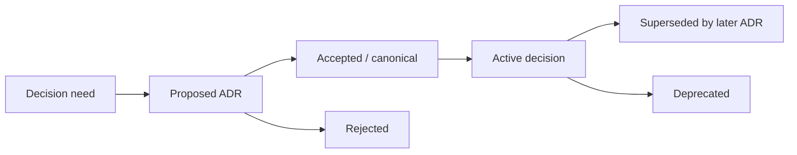
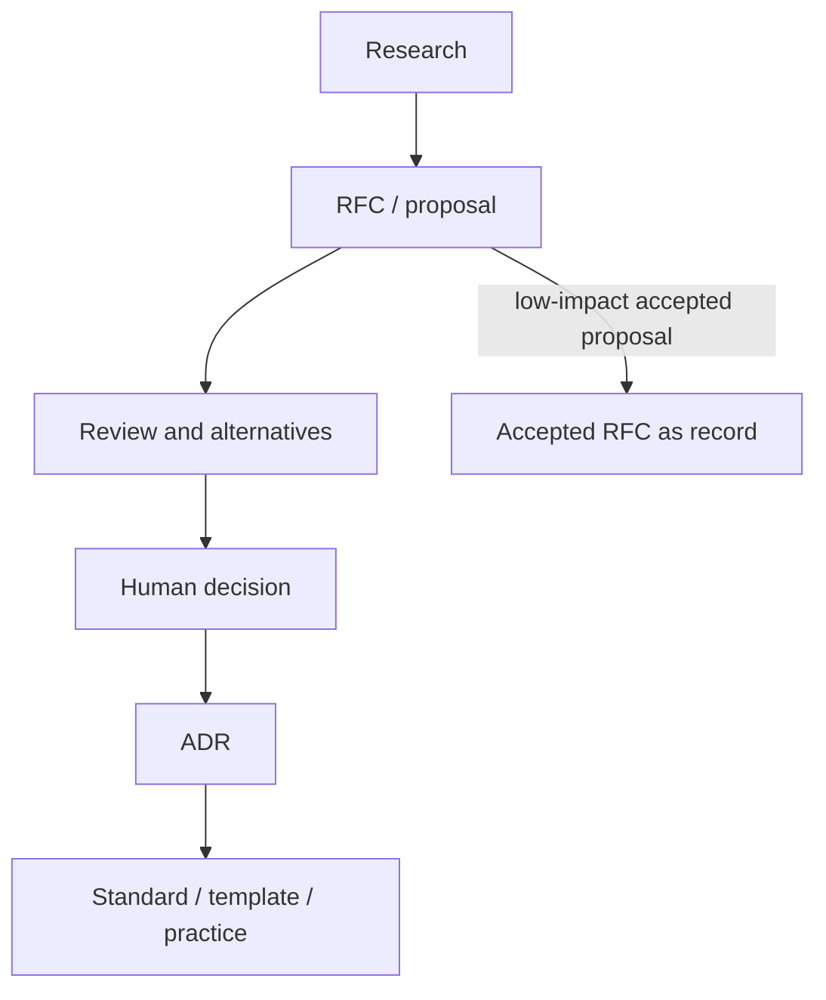
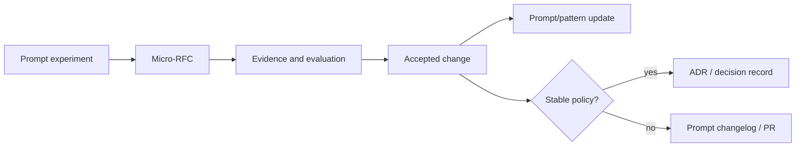

# ADR: индустриальные нормы, дельты и варианты для Hub / Mango

> **Режим:** `Research`. Этот документ не создаёт новый ADR, не принимает
> архитектурные решения и не меняет существующие статусы. Он фиксирует
> индустриальные паттерны Architecture Decision Records / decision records,
> сравнивает их с Hub/Mango и формирует варианты для будущего human decision.
> Источник задачи:
> [issue #278](https://github.com/G-Ivan-A/hybrid-Intelligence-lab/issues/278).

> **EN abstract.** Source-backed ADR governance research for Hub and Mango. It
> audits existing decision records, benchmarks ADR practices and adjacent
> architecture-governance methods, identifies deltas, and offers variants for
> location, naming, lifecycle and RFC/ADR relationships. It does not create or
> approve an ADR.

## Оглавление

1. [Введение](#1-введение)
2. [Результаты исследования](#2-результаты-исследования)
3. [Метод и воспроизводимость](#3-метод-и-воспроизводимость)
4. [Аудит ADR в Hub и Mango](#4-аудит-adr-в-hub-и-mango)
5. [Индустриальная норма ADR](#5-индустриальная-норма-adr)
6. [Архетип A: Governance & Knowledge Hub](#6-архетип-a-governance--knowledge-hub)
7. [Архетип B: Prompt & Pattern Library](#7-архетип-b-prompt--pattern-library)
8. [Архетип C: Product Spoke / Runtime](#8-архетип-c-product-spoke--runtime)
9. [Архетип D: Education](#9-архетип-d-education)
10. [Дельты текущей экосистемы](#10-дельты-текущей-экосистемы)
11. [Варианты ADR-модели для экосистемы](#11-варианты-adr-модели-для-экосистемы)
12. [Критерии применимости](#12-критерии-применимости)
13. [Lifecycle diagrams](#13-lifecycle-diagrams)
14. [Ограничения исследования](#14-ограничения-исследования)
15. [Источники](#15-источники)

## 1. Введение

### 1.1. Что здесь называется ADR

ADR (Architecture Decision Record) в этом исследовании - это короткая,
долгоживущая запись о принятом архитектурном, методологическом или governance
решении: контекст, решение, последствия, статус и связь с альтернативами.

Термин "decision record" шире ADR. В industry corpus decision-record роль иногда
выполняют accepted RFCs, PEPs, EIPs, BIPs, KEPs, BEPs, architecture docs,
governance meeting decisions или standards documents. Поэтому исследование
разделяет:

- strict ADR: документы в стиле Nygard/MADR/adr-tools;
- ADR-like decision records: accepted proposals that preserve rationale;
- adjacent architecture governance: C4, TOGAF, IEEE 42010-like architecture
  descriptions, which help describe systems but are not ADR templates.

### 1.2. Почему нужен отдельный ADR-анализ

ADR-001 и ADR-002 уже существуют в Hub и задают сильный методологический
прецедент. Но issue #278 требует не повторить их содержание, а проверить:

- как текущие Hub/Mango decision records выглядят относительно industry;
- какие варианты location/naming/lifecycle подходят A/B/C/D archetypes;
- когда нужен ADR после RFC, а когда accepted RFC уже достаточно;
- какие дельты стоит учитывать в будущем стандарте.

## 2. Результаты исследования

### 2.1. BLUF

1. Строгая ADR-норма в industry компактнее RFC-нормы: stable folder, number-first
   filenames, status, date, context, decision, consequences, and supersession.
2. Hub имеет 2 canonical ADR в `docs/adr/`, оба date-first and issue-linked.
   Это соответствует текущему repo naming standard, но отличается от
   number-first ADR norm used by Nygard/MADR/adr-tools/Backstage/Home Assistant.
3. Mango имеет 15 ADR/decision records: 13 в `docs/adr/` и 2 canonical records в
   `standards/decisions/`. Это сильный сигнал decision-record потребности, но
   dual location creates a canon problem.
4. Для архетипа A ADR нужен как короткий canonical decision после research/RFC
   или вместо RFC для small but long-lived governance decisions.
5. Для архетипа B ADR нужен редко: только когда prompt/pattern/process decision
   becomes a stable standard. Большинство prompt experiments should not become
   ADRs.
6. Для архетипа C ADR is valuable for product architecture boundaries, public
   API decisions, deployment/runtime constraints, data contracts and
   irreversible trade-offs.
7. Для архетипа D ADR should be limited to durable curriculum/platform
   decisions; curriculum RFC or contributor docs are often enough.
8. Main deltas: naming identity, status vocabulary, supersession semantics,
   single canonical location, index/readme, and explicit RFC/ADR boundary.

### 2.2. Сводная матрица

| Архетип | ADR signal in corpus | Норма | Вывод для экосистемы |
| --- | --- | --- | --- |
| A: Governance & Knowledge Hub | Strong via strict ADR tools plus accepted RFC/KEP/PEP-like decision records | Decision log or accepted proposal archive with stable status | Hub should keep a canonical decision-record layer |
| B: Prompt & Pattern Library | Weak: most prompt libraries do not expose ADR folders | Record stable prompt/process standards, not every experiment | Mango needs lightweight decision records only after proposal acceptance |
| C: Product Spoke / Runtime | Mixed: Backstage ADRs, Home Assistant ADRs, Grafana architecture docs | ADRs for durable product architecture choices | Product spokes need ADRs where future maintainers need "why" |
| D: Education | Weak and mostly documentation false positives | Curriculum decisions usually live in docs/PRs | ADR only for program-level or platform-level choices |

## 3. Метод и воспроизводимость

### 3.1. Корпус

The ADR analysis uses:

1. Local Hub/Mango audit from the same experiment used by the RFC companion
   report.
2. GitHub tree scan across 48 ADR-oriented sources.
3. Manual primary-source reading for strict ADR sources and high-signal product
   sources: Nygard, MADR, adr-tools, Backstage ADRs, Home Assistant Architecture,
   Backstage BEPs, C4, TOGAF and selected accepted RFC-like ecosystems.

Reproducible files:

- [2026-06-27-local-rfc-adr-audit.md](exp/rfc-adr-industry-norms-278/2026-06-27-local-rfc-adr-audit.md)
  - current Hub/Mango ADR/RFC inventory.
- [2026-06-27-adr-external-tree-summary.md](exp/rfc-adr-industry-norms-278/2026-06-27-adr-external-tree-summary.md)
  - external ADR-like path signals.
- [exp/rfc-adr-industry-norms-278/README.md](exp/rfc-adr-industry-norms-278/README.md)
  - method and rerun instructions.

### 3.2. Reading rule

The tree scan intentionally over-collects possible signals. For example, generic
`architecture/` docs in education/content repositories are not treated as ADRs.
They only show that architecture vocabulary appears in paths. Strong conclusions
require a template, README, status model or explicit decision-record text.

## 4. Аудит ADR в Hub и Mango

### 4.1. Hub

Hub contains 2 ADRs:

| Path | Status | Role |
| --- | --- | --- |
| `docs/adr/2026-06-adr-001-ecosystem-infrastructure-methodology.md` | `canonical` | Methodology decision for ecosystem infrastructure |
| `docs/adr/2026-06-adr-002-artifact-document-methodology.md` | `canonical` | Methodology decision for artifact/document management |

Observed properties:

- location is `docs/adr/`, consistent with ADR-001/002 becoming productized
  framework/methodology documentation;
- filenames are date-first: consistent with current repository naming
  validators, but unlike many ADR tools;
- statuses use `canonical`, not the common `accepted`;
- both ADRs are large enough to contain research-backed rationale, not only a
  minimal Nygard record;
- there is no local `docs/adr/README.md` index yet.

### 4.2. Mango

Mango contains 15 ADR/decision records:

| Location | Count | Statuses | Pattern |
| --- | ---: | --- | --- |
| `docs/adr/` | 13 | `accepted`: 5, `proposed`: 8 | Mixed number-first identities: `0001`, `0002`, `0003`, then `001`..`010` |
| `standards/decisions/` | 2 | `canonical`: 2 | Uppercase `ADR-011`, `ADR-012` decision records in standards area |

Strengths:

- Mango clearly uses decision records as part of governance;
- many decisions are domain/process/prompt standards, not accidental notes;
- proposed vs accepted/canonical distinction is visible.

Risks:

- dual canonical locations make the decision log harder to query;
- `0001` vs `001` numbering creates identity ambiguity;
- `accepted`, `proposed` and `canonical` need mapped semantics;
- if `standards/decisions/` remains canonical, `docs/adr/` may become a staging
  area by accident rather than explicit policy.

### 4.3. Ecosystem implication

Hub has a small but high-significance ADR layer. Mango has a larger and more
operational decision corpus. A single ADR standard should define a shared minimum
contract but allow archetype-specific profiles.

## 5. Индустриальная норма ADR

### 5.1. Strict ADR norm

Strict ADR sources converge on a compact record:

| Source | Practice | Implication |
| --- | --- | --- |
| Michael Nygard | ADRs capture a decision with context and consequences | Minimal ADR can be short and still valuable |
| MADR | Adds decision drivers, options, outcome, confirmation, status | Useful when alternatives and verification matter |
| adr-tools | Default `doc/adr`, numbered Markdown, `adr new`, supersession support | Number-first and supersession are practical tool norms |
| Backstage ADRs | `docs/architecture-decisions`, records are not deleted, can be superseded/deprecated | Decision log should preserve history |
| Home Assistant Architecture | `adr/0019-GPIO.md` style, status/date/context/decision/consequences | Product architecture ADR can stay compact |

### 5.2. Common fields

| Field | Strict norm | Hub/Mango relevance |
| --- | --- | --- |
| Number / stable id | Common | Useful for cross-references and source registry links |
| Title | Common | Human-readable search |
| Date | Common | Hub already uses date-first filenames; still useful in frontmatter |
| Status | Common | Need controlled vocabulary and transition semantics |
| Context | Common | Why this decision exists |
| Decision | Common | What was chosen |
| Consequences | Common | Costs and follow-up impact |
| Alternatives/options | Common in richer templates | Needed for high-stakes governance choices |
| Supersedes/superseded-by | Common in tools and Backstage practice | Needed for safe evolution |
| Confirmation / validation | MADR-style | Useful for executable contracts and standards |

### 5.3. Adjacent frameworks are not ADR replacements

Architecture frameworks help describe systems, not replace decision records:

- C4 is useful for views and diagrams of software architecture.
- TOGAF is an enterprise architecture methodology/framework.
- IEEE 42010-family architecture descriptions are about stakeholders, concerns,
  viewpoints/views and architecture description structure.

These are useful companions to ADRs. They do not answer the ADR question alone:
"which option did we choose, why, and with what consequences?"

## 6. Архетип A: Governance & Knowledge Hub

### 6.1. ADR role in A

For a governance hub, ADRs are not just software architecture notes. They record
methodological decisions that shape multiple repositories:

- artifact lifecycle;
- repository structure profiles;
- file naming and validation rules;
- AI governance contracts;
- template inheritance;
- Hub-to-spoke synchronization rules;
- taxonomy and glossary decisions.

### 6.2. Hub-fit decision boundary

Hub should use ADR when:

- an accepted decision must be short, stable and canonical;
- future agents need a source of truth stronger than a research report;
- an RFC has converged and the final choice should be separated from proposal
  history;
- a standard/template/tool/practice is being created from prior research/RFC.

Hub can skip ADR when:

- the accepted RFC is already the canonical artifact and no downstream standard
  is produced;
- the change is reversible and local;
- the PR itself is enough as a decision record.

## 7. Архетип B: Prompt & Pattern Library

### 7.1. ADR role in B

Prompt libraries and pattern libraries change quickly. ADR is valuable only when
the decision becomes a stable constraint:

- prompt naming standard;
- prompt taxonomy;
- evaluation or observability method;
- reusable BA pattern standard;
- KB/citation contract;
- human-gate policy for prompt execution.

Routine prompt tuning should stay as experiment, PR or prompt changelog.

### 7.2. Mango-fit interpretation

Mango already has more ADR records than Hub. The next improvement is not "more
ADR", but clearer canonicality:

| Problem | Low-cost fix variant |
| --- | --- |
| `docs/adr/` and `standards/decisions/` both hold decisions | Define one canonical decision log and one staging/standard area |
| `0001` and `001` numbering coexist | Freeze old ids, use one numbering style for new records |
| proposed/accepted/canonical semantics differ | Add a status glossary in ADR README |
| Prompt experiments can become decisions too early | Require evidence/proposal link before ADR acceptance |

## 8. Архетип C: Product Spoke / Runtime

### 8.1. Product sources

Product ADR-like signals appear in:

- Backstage: current ADR log under `docs/architecture-decisions/`, plus BEP for
  proposals.
- Home Assistant Architecture: compact ADR files under `adr/`.
- Grafana: architecture contribution docs, not necessarily strict ADR.
- Kibana: legacy RFCs that preserve design rationale and can act as
  decision-record history.

### 8.2. Product ADR boundary

Product ADRs should record durable choices such as:

- public API semantics;
- plugin contracts;
- runtime architecture;
- deployment topology;
- data storage and migration;
- authentication/authorization architecture;
- technology selection;
- compatibility/deprecation policy.

Product ADRs should not record:

- minor UI changes;
- small bug fixes;
- temporary feature flags;
- implementation tasks already clear from issue/PR.

## 9. Архетип D: Education

### 9.1. Education decision records

Education projects usually need course design clarity, not full architecture
governance. ADR-like records are justified for:

- learning outcomes model;
- curriculum taxonomy;
- assessment/grading model;
- certification policy;
- course platform/tooling architecture;
- contribution rules that affect many lessons.

### 9.2. Avoiding false formalization

If every lesson edit creates ADR overhead, contributors will stop updating
content. Education ADR should be reserved for decisions with multi-module or
multi-cohort consequences.

## 10. Дельты текущей экосистемы

### 10.1. Delta table

| Delta | Hub/Mango now | Industry norm | Impact |
| --- | --- | --- | --- |
| Stable id | Hub date-first ADRs; Mango number-first but mixed width | Number-first stable id is common in strict ADR tools | Cross-reference style is not uniform |
| Date | Hub filename includes date; Mango often metadata/title based | Date often in body/frontmatter, not always filename | Hub optimizes chronology; tools optimize id stability |
| Status vocabulary | `canonical`, `accepted`, `proposed` | `proposed`, `accepted`, `rejected`, `deprecated`, `superseded` common | Agents may treat canonical/accepted inconsistently |
| Location | Hub `docs/adr/`; Mango `docs/adr/` plus `standards/decisions/` | Single ADR folder/index common | Mango has canon split risk |
| Supersession | Not consistently explicit | Common in adr-tools/MADR/Backstage | Old decisions may look current |
| Index | Hub no ADR README; Mango may rely on directory | ADR logs often have index/navigation | Harder to see latest active decision set |
| RFC/ADR boundary | Implied by lifecycle; not fully standardized | Both accepted RFC-as-record and RFC->ADR exist | Risk of duplicate or missing decision records |

### 10.2. Naming trade-off

Current Hub date-first ADR names are defensible because repository naming rules
optimize chronological research/analysis artifacts and review timing. Strict ADR
tools optimize stable identity with `NNNN-title.md`.

This is a real trade-off:

| Naming variant | Pros | Cons |
| --- | --- | --- |
| Date-first `YYYY-MM-adr-NNN-title.md` | Chronology visible; matches current validator | ADR id is not the first parse key |
| Number-first `NNNN-title.md` | Strong ADR norm; clean references | Conflicts with current date-first policy unless exempted |
| Hybrid path `docs/adr/YYYY/MM/NNNN-title.md` | Chronology and id both visible | More directory depth and tooling complexity |
| Keep current, add `adr_id` frontmatter | No rename needed; stable machine id possible | Requires validator/manifest awareness |

## 11. Варианты ADR-модели для экосистемы

### 11.1. Variant A: Hub canonical ADR log

| Field | Proposed shape |
| --- | --- |
| Scope | Cross-repository methodology and architecture decisions |
| Location | `docs/adr/` with README/index |
| Identity | Keep current date-first names or add stable `adr_id` frontmatter |
| Statuses | `proposed`, `accepted`, `canonical`, `rejected`, `deprecated`, `superseded` with mapping |
| Required sections | Context, Decision, Consequences, Alternatives, Source inputs, Follow-up artifacts |
| RFC relation | RFC -> ADR for high-impact decisions; ADR-only for narrow decisions |

Pros: preserves current Hub direction.
Cons: may need explicit id policy to align with industry tools.

### 11.2. Variant B: Mango decision log profile

| Field | Proposed shape |
| --- | --- |
| Scope | Prompt/process/BA-pattern decisions that become stable project policy |
| Location | One canonical folder: either `docs/adr/` or `standards/decisions/`, not both as active canon |
| Identity | Freeze existing ids; use one new-width convention |
| Statuses | `proposed`, `accepted`, `canonical`, `superseded`, `deprecated` |
| Required sections | Problem, Decision, Affected prompts/patterns, Evidence, Consequences, Supersession |
| RFC relation | Micro-RFC first when decision needs experiment/proposal; ADR after acceptance |

Pros: matches Mango's existing corpus.
Cons: requires a cleanup/mapping step if dual locations remain.

### 11.3. Variant C: Product architecture ADR

| Field | Proposed shape |
| --- | --- |
| Scope | Product architecture, public contracts, runtime topology, data decisions |
| Location | `docs/adr/`, `docs/architecture-decisions/` or product-conventional folder |
| Identity | Number-first preferred if product has long-lived external references |
| Statuses | `proposed`, `accepted`, `rejected`, `deprecated`, `superseded` |
| Required sections | Context, Decision, Consequences, Alternatives, Compatibility, Confirmation |
| RFC relation | BEP/RFC for proposal; ADR for final architecture decision |

Pros: future maintainers get a concise why-history.
Cons: can duplicate product specs if not scoped tightly.

### 11.4. Variant D: Education decision note

| Field | Proposed shape |
| --- | --- |
| Scope | Curriculum architecture, assessment model, platform/tool choices |
| Location | `education/<program>/decisions/` only if repeated need appears |
| Identity | Date-first likely sufficient for low-volume records |
| Statuses | `proposed`, `accepted`, `deprecated`, `superseded` |
| Required sections | Learner context, Decision, Consequences, Migration, Review date |
| RFC relation | Curriculum RFC may be enough; ADR only for durable program decisions |

Pros: avoids hiding course rationale in PR history.
Cons: overkill for lesson content edits.

## 12. Критерии применимости

### 12.1. ADR is required

ADR is required when:

- decision has long-lived architectural or methodological consequences;
- rejected alternatives matter for future maintainers;
- accepted decision creates or changes a standard/template/tool/practice;
- future AI agents need a canonical instruction source;
- multiple repositories or project archetypes are affected;
- decision supersedes prior decision.

### 12.2. ADR is optional

ADR is optional when:

- accepted RFC already contains final decision, status and consequences;
- decision is local but useful to remember;
- a product team wants a concise why-record for technology choice;
- there are no downstream standards to update.

### 12.3. ADR should be avoided

ADR should be avoided when:

- it only repeats a PR description;
- decision is temporary or experimental;
- context is not understood yet and research/RFC should come first;
- the artifact would become a second source of truth for implementation detail.

## 13. Lifecycle diagrams

### 13.1. Strict ADR lifecycle

### 13.2. RFC to ADR route

### 13.3. Mango prompt decision route

## 14. Ограничения исследования

1. Path scan cannot see decisions stored only in GitHub Issues, Discussions,
   private documents or meeting notes.
2. Architecture docs are not automatically ADRs; the report separates strict
   decision records from adjacent architecture description methods.
3. Mango was analyzed from local clone commit
   `ed636a38a762e848907fcaf607fecf764dcbb9c8`.
4. No migration of current Hub/Mango ADRs is proposed here.
5. This is a research report; all normative changes require future RFC/ADR or
   explicit human approval.

## 15. Источники

### 15.1. Локальные источники и эксперимент

- [Issue #278](https://github.com/G-Ivan-A/hybrid-Intelligence-lab/issues/278)
  - постановка задачи.
- [exp/rfc-adr-industry-norms-278/README.md](exp/rfc-adr-industry-norms-278/README.md)
  - воспроизводимый эксперимент и команды запуска.
- [2026-06-27-local-rfc-adr-audit.md](exp/rfc-adr-industry-norms-278/2026-06-27-local-rfc-adr-audit.md)
  - Hub/Mango RFC/ADR audit.
- [2026-06-27-adr-external-tree-summary.md](exp/rfc-adr-industry-norms-278/2026-06-27-adr-external-tree-summary.md)
  - external ADR-like tree signals.
- [ADR-001](../../docs/adr/2026-06-adr-001-ecosystem-infrastructure-methodology.md)
  and [ADR-002](../../docs/adr/2026-06-adr-002-artifact-document-methodology.md)
  - current Hub methodology decisions.
- [RFC companion research](2026-06-27-rfc-industry-norms-and-variants.md)
  - RFC norms and RFC/ADR boundary context.

### 15.2. Primary ADR and architecture decision sources

- [Michael Nygard - Documenting Architecture Decisions](https://www.cognitect.com/blog/2011/11/15/documenting-architecture-decisions).
- [MADR template](https://raw.githubusercontent.com/adr/madr/develop/template/adr-template.md)
  and [MADR decisions index](https://raw.githubusercontent.com/adr/madr/develop/docs/decisions/index.md).
- [adr-tools README](https://raw.githubusercontent.com/npryce/adr-tools/master/README.md)
  and [adr-tools ADR 0004](https://raw.githubusercontent.com/npryce/adr-tools/master/doc/adr/0004-markdown-format.md).
- [Backstage architecture decisions index](https://raw.githubusercontent.com/backstage/backstage/master/docs/architecture-decisions/index.md),
  [Backstage ADR template](https://raw.githubusercontent.com/backstage/backstage/master/docs/architecture-decisions/adr000-template.md),
  and [Backstage ADR 001](https://raw.githubusercontent.com/backstage/backstage/master/docs/architecture-decisions/adr001-add-adr-log.md).
- [Home Assistant Architecture ADR 0019](https://raw.githubusercontent.com/home-assistant/architecture/master/adr/0019-GPIO.md).
- [Backstage BEP README](https://raw.githubusercontent.com/backstage/backstage/master/beps/README.md)
  - useful contrast between proposals and ADRs.
- [C4 Model](https://c4model.com/) - architecture visualization companion, not
  an ADR replacement.
- [The Open Group TOGAF](https://www.opengroup.org/togaf) - enterprise
  architecture methodology/framework companion, not an ADR template.
- [ISO/IEC/IEEE 42010 official information site](https://www.iso-architecture.org/42010/)
  - architecture description family reference; treated here as adjacent context.
