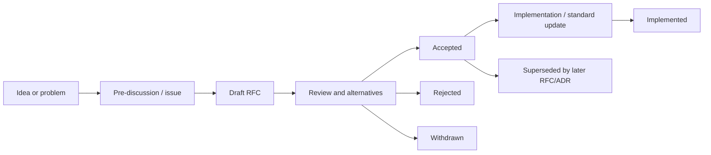
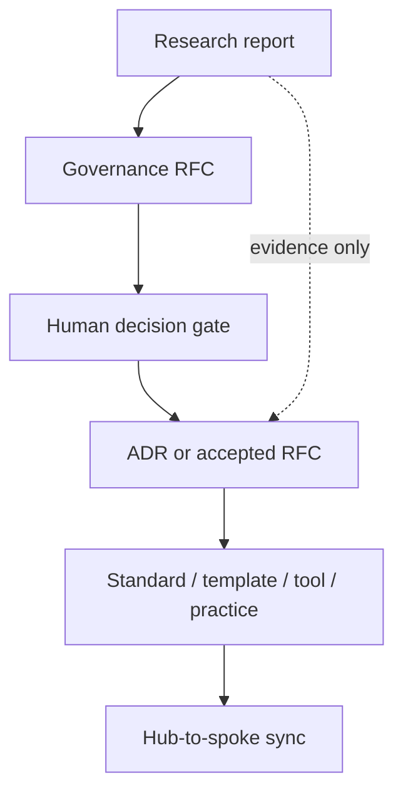
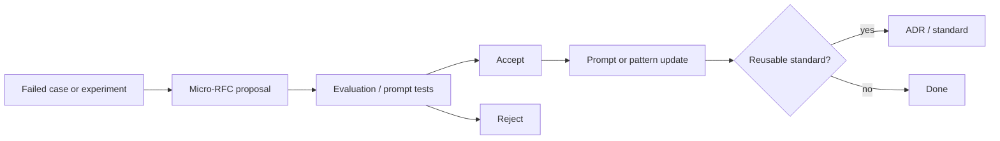

# RFC: индустриальные нормы, дельты и варианты для Hub / Mango

> **Режим:** `Research`. Этот документ не создаёт RFC, не меняет жизненный цикл
> решений и не переводит существующие документы между статусами. Он фиксирует
> эмпирическую картину RFC-like практик, сравнивает её с текущим Hub/Mango и даёт
> варианты для будущих human decisions. Источник задачи:
> [issue #278](https://github.com/G-Ivan-A/hybrid-Intelligence-lab/issues/278).

> **EN abstract.** Source-backed RFC governance research for Hub and Mango. It
> audits the current RFC corpus, benchmarks RFC-like practices across four
> repository archetypes, identifies deltas against industry norms, and offers
> lifecycle/template/location variants. It deliberately does not create a new
> RFC or decide the future standard.

## Оглавление

1. [Введение](#1-введение)
2. [Результаты исследования](#2-результаты-исследования)
3. [Метод и воспроизводимость](#3-метод-и-воспроизводимость)
4. [Аудит RFC в Hub и Mango](#4-аудит-rfc-в-hub-и-mango)
5. [Индустриальная норма RFC-like документов](#5-индустриальная-норма-rfc-like-документов)
6. [Архетип A: Governance & Knowledge Hub](#6-архетип-a-governance--knowledge-hub)
7. [Архетип B: Prompt & Pattern Library](#7-архетип-b-prompt--pattern-library)
8. [Архетип C: Product Spoke / Runtime](#8-архетип-c-product-spoke--runtime)
9. [Архетип D: Education](#9-архетип-d-education)
10. [Дельты текущей экосистемы](#10-дельты-текущей-экосистемы)
11. [Варианты RFC-модели для экосистемы](#11-варианты-rfc-модели-для-экосистемы)
12. [Критерии применимости](#12-критерии-применимости)
13. [Lifecycle diagrams](#13-lifecycle-diagrams)
14. [Ограничения исследования](#14-ограничения-исследования)
15. [Источники](#15-источники)

## 1. Введение

### 1.1. Зачем нужен отдельный RFC-анализ

ADR-001 и ADR-002 зафиксировали для Хаба методологический маршрут
`research -> RFC -> ADR -> standard/template/tool/practice`, но они не отвечали
на узкий вопрос issue #278: насколько текущая RFC-практика Hub/Mango совпадает
с индустриальной нормой и какие варианты процесса подходят разным архетипам.

Здесь RFC понимается широко: как публичный или внутрипроектный proposal/design
document, через который команда обсуждает значимое изменение до принятия
решения. В разных экосистемах этот формат называется RFC, KEP, PEP, EIP, BIP,
OTEP, BEP, proposal или design document. Термин "RFC-like" используется там, где
формат выполняет функцию RFC, но называется иначе.

### 1.2. Что не входит в документ

Документ не решает, должен ли Хаб переехать из `governance/rfc/` в `docs/rfc/`,
не переименовывает существующие RFC, не объявляет новые статусы обязательными и
не нормирует Mango. Эти действия требуют отдельного RFC/ADR или явного human
approval. Задача здесь: дать проверяемую основу для такого решения.

## 2. Результаты исследования

### 2.1. BLUF

1. Для архетипа A формальная RFC-like модель является сильной индустриальной
   нормой: Rust RFCs, Kubernetes KEPs, Python PEPs, Ethereum EIPs, Bitcoin BIPs,
   OpenTelemetry OTEPs и Go proposals используют стабильные каталоги, номера,
   шаблоны, статусы и review gates.
2. Для архетипа B формальная RFC-модель почти не видна в репозиториях prompt /
   AI pattern libraries. В 12 проверенных B-репозиториях только Promptfoo дал
   слабый proposal-сигнал через `docs/plans/`. Норма: лёгкие issue/PR/design
   notes; RFC нужен только для изменений prompt-архитектуры, taxonomy, reusable
   patterns или evaluation governance.
3. Для архетипа C норма смешанная: часть продуктовых платформ держит RFC/BEP
   каталоги (Backstage, Kibana legacy RFCs, Strapi), большинство runtime/product
   репозиториев обходится issues/PRs/architecture docs. RFC применим к public API,
   platform capabilities, migrations, architecture boundaries и release-impact
   изменениям.
4. Для архетипа D формальный RFC почти отсутствует как стабильный каталог.
   Образовательные проекты чаще используют contributor docs, curriculum PRs,
   issues и roadmap files. RFC подходит только для крупных учебных рамок:
   taxonomy курса, assessment model, public curriculum contract.
5. Hub уже ближе к архетипу A: есть `governance/rfc/`, индекс и 16 RFC-like
   документов без README. Mango ближе к архетипу B: 4 RFC-like proposal-документа
   в `governance/rfc/`.
6. Главные дельты Hub/Mango против сильных индустриальных RFC-практик:
   lifecycle vocabulary не унифицирован, numbering отсутствует или нестабилен,
   связь RFC -> implementation/ADR не формализована, template fields разнородны,
   а `governance/rfc/` vs `docs/rfc/` остаётся архитектурным выбором.
7. Лучший дальнейший ход: не копировать один стандарт, а выбрать вариант по
   архетипу. Для Hub полезна тяжёлая governance RFC-модель; для Mango и prompt
   libraries нужна облегчённая micro-RFC модель; для product spokes нужен BEP-like
   product design proposal; для education нужен curriculum RFC только по крупным
   изменениям.

### 2.2. Сводная матрица

| Архетип | Индустриальный сигнал | Норма | Риск механического переноса в экосистему |
| --- | --- | --- | --- |
| A: Governance & Knowledge Hub | Сильный: 10 из 12 источников дали RFC/proposal path signals | Formal RFC-like process with numbered proposals, owners, statuses, review gates | Over-process, если применять к мелким docs edits |
| B: Prompt & Pattern Library | Слабый: 1 из 12 источников дал proposal path signal | Lightweight issues/PRs/design notes; RFC only for reusable governance changes | Бюрократия вокруг каждого prompt edit |
| C: Product Spoke / Runtime | Смешанный: 3 из 12 источников дали strong signals | RFC/BEP for public API, platform, migration, architecture boundary | Потеря delivery speed при обязательном RFC на каждую фичу |
| D: Education | Слабый и частично false-positive: 3 из 11 path signals, в основном не RFC | Curriculum docs + PR review; RFC only for course-wide learning contracts | Излишняя formalization учебных материалов |

## 3. Метод и воспроизводимость

### 3.1. Корпус

Исследование использует три слоя источников:

1. Локальный аудит текущих Hub и Mango RFC/ADR артефактов.
2. GitHub tree scan по 47 RFC-oriented external repositories, распределённым по
   архетипам A/B/C/D.
3. Ручное чтение primary-source README/templates/process docs для источников с
   сильным сигналом.

Воспроизводимый эксперимент находится в
[exp-rfc-adr-industry-norms/](exp-rfc-adr-industry-norms/). Основные выводы по
деревьям:

- [2026-06-27-local-rfc-adr-audit.md](exp-rfc-adr-industry-norms/outputs/2026-06-27-local-rfc-adr-audit.md)
  фиксирует текущий Hub и локальный clone Mango на дату анализа.
- [2026-06-27-rfc-external-tree-summary.md](exp-rfc-adr-industry-norms/outputs/2026-06-27-rfc-external-tree-summary.md)
  фиксирует RFC-like path signals по внешним репозиториям.
- JSON-выгрузки в `outputs/` сохраняют полный machine-readable результат.

### 3.2. Как читать path signals

Path signal не является доказательством "у проекта есть RFC-стандарт". Это
только первичный признак: каталог `rfcs/`, `keps/`, `peps/`, `beps/`, `proposals/`,
`legacy_rfcs/`, number-first proposal files или похожий путь. Каждый сильный
вывод подтверждался чтением README/template/process файла. Нулевой path signal
тоже не доказывает отсутствие design governance: проект может вести решения в
issues, discussions, docs или внешних системах.

## 4. Аудит RFC в Hub и Mango

### 4.1. Hub

На дату аудита в Hub найдено:

| Область | Количество | Статусы |
| --- | ---: | --- |
| `governance/rfc/*.md`, включая `README.md` | 17 | `draft`: 12, `canonical`: 4, `reviewed`: 1 |
| RFC-документы без `README.md` | 16 | `draft`: 12, `canonical`: 3, `reviewed`: 1 |
| `docs/rfc/` | 0 | каталог отсутствует |

Сильные стороны Hub:

- есть выделенный RFC-каталог и навигационный README;
- RFC уже используются как proposals/research-to-decision inputs;
- часть RFC связана с artifact map, standards and governance files;
- naming в основном semantic-kebab-case, удобный для чтения человеком.

Слабые места Hub:

- нет единой number-first идентичности RFC;
- `draft`, `reviewed`, `canonical` используются, но lifecycle переходы не
  описаны как state machine;
- не в каждом RFC одинаково видны owner, stakeholders, alternatives, unresolved
  questions, implementation link, ADR link;
- `governance/rfc/` выбран исторически, а ADR-001/002 задают вопрос о `docs/rfc/`
  как возможном target для решений инфраструктуры.

### 4.2. Mango

В локальном clone `mango_ba_prompts` найдено:

| Область | Количество | Статусы |
| --- | ---: | --- |
| `governance/rfc/*.md` | 4 | `proposed`: 3, `draft`: 1 |
| `docs/rfc/` | 0 | каталог отсутствует |

Mango RFC выглядят как practical prompt/process proposals: BCREQ scope rules,
prompt improvement proposals and observability implementation proposal. Это
соответствует архетипу B: changes are domain/process/prompt-oriented, and the
cost of a heavy Rust/KEP-like RFC would often be higher than the benefit.

### 4.3. Промежуточный вывод по экосистеме

Hub уже имеет основу для formal RFC governance. Mango имеет точечные proposal
документы, но не должен автоматически наследовать весь Hub-level процесс. Для
экосистемы полезнее "core RFC contract + archetype profiles", чем один
обязательный процесс для всех repositories.

## 5. Индустриальная норма RFC-like документов

### 5.1. Общий паттерн

Сильные RFC-like экосистемы имеют повторяющийся набор признаков:

| Признак | Норма в источниках | Зачем нужен |
| --- | --- | --- |
| Stable directory | `text/`, `keps/`, `peps/`, `EIPS/`, `beps/`, `legacy_rfcs/`, `design/` | Один вход для поиска и ссылок |
| Number-first identity | `0000-template`, `pep-0001`, `eip-1`, `bip-0002`, `beps/0013-*` | Стабильные ссылки, независимые от заголовка |
| Explicit template | Motivation, detailed design, alternatives, drawbacks, unresolved questions | Сравнимое качество proposals |
| Status model | Draft, review, accepted/final, implemented, rejected, withdrawn, superseded | Читатель понимает силу документа |
| Owner / champion | author, sponsor, SIG, owning team, champion | Есть ответственный за продвижение |
| Review gate | PR review, FCP, SIG approval, editor/sponsor, last call | Решение не маскируется под одиночную заметку |
| Historical record | accepted proposals остаются в repo | Можно понять "почему так" через годы |

### 5.2. Что не является универсальной нормой

Не универсальны:

- точное имя каталога: индустрия использует `rfcs`, `keps`, `peps`, `EIPS`,
  `BIPS`, `beps`, `legacy_rfcs`, `design`;
- обязательная связка RFC -> ADR: PEP/EIP/BIP/Rust RFC часто сами являются
  decision records после принятия;
- обязательный format Markdown: PEP исторически в reStructuredText, BIP в
  Markdown/MediaWiki, часть standards ecosystems использует specs and issues;
- одинаковая тяжесть процесса: Rust/KEP гораздо тяжелее, чем product design
  proposal в application repo.

### 5.3. Разница RFC и ADR

RFC отвечает на вопрос: "Стоит ли нам принять это значимое изменение и как
именно?". ADR отвечает на вопрос: "Какое решение принято и почему?". В некоторых
экосистемах accepted RFC становится decision record; в других RFC порождает ADR.
Значит, для Hub/Mango возможны обе модели, но их нужно явно различить:

| Модель | Когда подходит | Риск |
| --- | --- | --- |
| RFC -> ADR | Когда proposal long-running, обсуждение широкое, а ADR нужен как короткий canonical decision | Дублирование текста |
| Accepted RFC as decision record | Когда proposal уже содержит rationale, alternatives и final status | Сложнее отделить proposal history от final rule |
| ADR without RFC | Когда решение узкое, уже принято или не требует широкой дискуссии | Потеря обсуждения альтернатив |

## 6. Архетип A: Governance & Knowledge Hub

### 6.1. Источники с сильным сигналом

| Источник | Наблюдаемая практика | Вывод для Hub |
| --- | --- | --- |
| Rust RFCs | `0000-template.md`, accepted text files, rationale/alternatives/unresolved questions | Hub RFC should carry rationale and alternatives, not just recommendation |
| Kubernetes KEPs | SIG-owned KEPs, status, release signoff checklist, graduation criteria, production readiness | For repo-wide governance, add owner/stakeholder/release-impact fields only when impact warrants it |
| OpenTelemetry OTEPs | Cross-cutting spec proposals, approval by reviewers, later integration into specs | Hub RFC can govern cross-project methodology before standards update |
| Python PEPs | Types and statuses, sponsor/editor workflow, historical record | Separate process/informational/standards-track RFC-like classes if needed |
| Ethereum EIPs | Formal statuses, category/type, required sections including security | For public/ecosystem standards, lifecycle vocabulary must be explicit |
| Bitcoin BIPs | Statuses and adoption/finality language; authors do not self-assign numbers | If number-first is adopted, numbering should be governed by index/tooling |
| Go proposals | Design docs under `design/`, issue-backed proposal process | Lightweight design docs can coexist with full RFCs |
| Backstage BEPs | BEPs propose efforts; ADRs document decisions | Clear division of proposal vs decision is valuable for Hub |

### 6.2. Hub-fit interpretation

Hub is closest to a governance and knowledge hub. Therefore a formal RFC process
is justified when a change:

- affects multiple repositories or templates;
- changes governance, standards, file layout, lifecycle, AI contracts or artifact
  routing;
- requires founder/human choice among documented variants;
- should leave a traceable public rationale.

For small corrections, typo fixes, link updates and local implementation cleanup,
Hub should avoid RFC overhead.

## 7. Архетип B: Prompt & Pattern Library

### 7.1. Corpus result

Across LangChain, LangGraph, Promptflow, Promptfoo, Guidance, OpenAI Cookbook,
Anthropic Cookbook, Microsoft Generative AI for Beginners, Haystack, LlamaIndex,
CrewAI and DSPy, the tree scan found almost no formal RFC directories. Promptfoo
has `docs/plans/` proposal-like files; most others use docs, examples, tests,
issues or PRs.

### 7.2. Prompt library norm

For prompt/pattern libraries, the industry norm is not "no governance"; it is
"lighter governance closer to experiments and docs". This fits Mango:

| Change type | Recommended RFC weight | Reason |
| --- | --- | --- |
| One prompt wording improvement | No RFC; experiment note or PR | Feedback cycle must stay short |
| Reusable prompt pattern | Micro-RFC or design note | Future users need rationale and evaluation context |
| Taxonomy / naming / KB standard | RFC-like proposal | Cross-cutting governance impact |
| Evaluation method / observability | RFC-like proposal with experiment link | Changes how quality is measured |
| Multi-channel workflow contract | RFC-like proposal | Affects multiple prompts and agents |

### 7.3. Mango-fit interpretation

Mango should not inherit Rust/KEP-level templates by default. A Mango RFC should
look like a short proposal with:

- context/problem;
- affected prompts/patterns/processes;
- evidence: experiment, failed case, user workflow, measurement;
- proposed change;
- alternatives;
- acceptance criteria;
- rollout/backout;
- link to future ADR/standard only if the decision becomes canonical.

## 8. Архетип C: Product Spoke / Runtime

### 8.1. Corpus result

Product/runtime repositories showed mixed behavior:

| Project | RFC-like signal | Interpretation |
| --- | --- | --- |
| Strapi | `docs/docs/rfcs/` | Public framework/platform changes benefit from RFC docs |
| Backstage | `beps/` | BEP is explicitly proposal/coordination format; ADRs are separate |
| Kibana | `legacy_rfcs/` | Large product/platform teams used RFCs for high-impact changes |
| Grafana, Supabase, Directus, n8n, Mattermost, Terraform, Home Assistant Core, Penpot | No strong RFC directory in this scan | Governance may live in issues, docs, maintainers, or separate architecture repos |

### 8.2. Product norm

Product spokes need RFC-like process when changes are expensive to reverse or
affect public contracts:

- public API or SDK behavior;
- plugin/platform extension points;
- migrations and deprecations;
- architecture boundaries;
- data model and compatibility;
- release/rollout plan with adoption impact.

Routine product work should remain in product backlog, issue/PR and tests.

## 9. Архетип D: Education

### 9.1. Corpus result

Education repositories rarely expose formal RFC directories. freeCodeCamp, MDN
content, OSSU, TheAlgorithms, Build Your Own X and Microsoft Web Dev for
Beginners did not show stable RFC path signals in this scan. Some path matches
in Kubernetes Website and GitHub Docs are documentation/content false positives,
not proof of a formal education RFC system.

### 9.2. Education norm

Education projects need clarity more than heavy proposal machinery. RFC-like
documents are justified when the decision changes:

- curriculum taxonomy;
- learning outcomes and module boundaries;
- assessment model;
- certification or grading rules;
- public contribution rules for course content;
- platform-wide content architecture.

For lesson-level edits, PR review and content style guides are enough.

## 10. Дельты текущей экосистемы

### 10.1. Delta table

| Delta | Hub/Mango now | Industry norm | Impact |
| --- | --- | --- | --- |
| Location | Hub and Mango use `governance/rfc/`; `docs/rfc/` absent | Varied: root RFC repos, `keps/`, `beps/`, `text/`, `design/`, `legacy_rfcs/` | Location is not the problem by itself; semantics must be explicit |
| Numbering | Semantic filenames, some date suffixes | Strong RFC ecosystems use stable numeric identity | Harder to cite "RFC-012" across docs |
| Status vocabulary | `draft`, `reviewed`, `canonical`, `proposed` across repos | Explicit lifecycle vocabularies and transition criteria | Reader cannot infer decision force uniformly |
| Template | Inconsistent sections | Templates include motivation, design, alternatives, drawbacks, unresolved questions, owners | Quality varies and review questions repeat |
| Owner/stakeholders | Not consistently present | Common in KEP/BEP/Kibana-like proposals | Accountability can be unclear |
| Implementation linkage | Present ad hoc | Often linked to tracking issue, PR, release, spec integration | Accepted proposal may not show execution state |
| RFC/ADR relation | ADR-001/002 imply route; not fully codified for all cases | Both RFC -> ADR and accepted-RFC-as-record exist | Future agents may duplicate or skip decision records |

### 10.2. The important non-delta

`governance/rfc/` is not automatically "wrong" because industry uses varied
locations. The true question is whether Hub wants RFCs as governance artifacts
or product/docs artifacts. For current Hub, `governance/rfc/` matches the
meaning: proposals about methodology, repository governance and artifact
lifecycle. If a future standard chooses `docs/rfc/`, the migration reason should
be semantic consistency with ADR-001/002, not "industry requires docs/rfc".

## 11. Варианты RFC-модели для экосистемы

### 11.1. Variant A: Hub-heavy governance RFC

| Field | Proposed shape |
| --- | --- |
| Scope | Cross-repository governance, standards, templates, artifact lifecycle |
| Location | Keep `governance/rfc/` or migrate to `docs/rfc/` only by separate ADR |
| Naming | Either current semantic names or future `NNNN-short-title.md` |
| Statuses | `draft`, `proposed`, `accepted`, `rejected`, `withdrawn`, `superseded`, `implemented` |
| Required sections | Summary, Context, Problem, Goals, Non-goals, Proposal, Alternatives, Trade-offs, Impacted artifacts, Review/decision path, Open questions |
| Decision relation | RFC -> ADR for canonical methodology decisions; accepted RFC may be enough for lower-impact governance proposals |

Pros: traceability and comparable quality for Hub decisions.
Cons: too heavy for prompt and lesson edits.

### 11.2. Variant B: Mango micro-RFC

| Field | Proposed shape |
| --- | --- |
| Scope | Prompt/process/pattern changes with reusable or cross-prompt impact |
| Location | `governance/rfc/` in Mango or `docs/analysis/` until canonical |
| Naming | Semantic filename with optional issue/experiment id |
| Statuses | `draft`, `proposed`, `accepted`, `rejected`, `superseded` |
| Required sections | Problem, Evidence, Affected prompts, Proposed change, Evaluation, Rollout, Open questions |
| Decision relation | ADR only when accepted proposal becomes a stable Mango standard |

Pros: fits prompt iteration speed.
Cons: weaker long-term catalog identity unless index is maintained.

### 11.3. Variant C: Product BEP-style proposal

| Field | Proposed shape |
| --- | --- |
| Scope | Product/platform changes: public API, plugins, migrations, data compatibility |
| Location | `beps/`, `docs/rfc/` or `docs/design/` depending on product repo convention |
| Naming | `NNNN-short-title/README.md` or `YYYY-MM-DD-short-title.md` |
| Statuses | `proposed`, `implementable`, `implemented`, `deferred`, `rejected`, `replaced` |
| Required sections | Summary, Motivation, Goals, Non-goals, Proposal, Design details, Release plan, Backward compatibility, Alternatives |
| Decision relation | Accepted proposal plus ADR for architecture decision with long shelf life |

Pros: connects proposal to implementation/release.
Cons: too delivery-heavy for pure governance research.

### 11.4. Variant D: Curriculum RFC

| Field | Proposed shape |
| --- | --- |
| Scope | Course-wide taxonomy, assessment, module structure, contribution policy |
| Location | `education/<program>/rfcs/` only if repeated need emerges |
| Naming | `YYYY-MM-DD-curriculum-topic.md` or `NNNN-topic.md` if many records |
| Statuses | `draft`, `reviewed`, `accepted`, `deprecated`, `superseded` |
| Required sections | Learning problem, Learners, Outcomes, Curriculum impact, Assessment impact, Alternatives, Migration |
| Decision relation | ADR only for platform/architecture decisions; accepted curriculum RFC can be enough for content model |

Pros: protects course coherence.
Cons: unnecessary for ordinary lesson edits.

## 12. Критерии применимости

### 12.1. RFC is required

RFC-like document is required when at least two conditions hold:

- change affects multiple repositories, templates, standards or teams;
- change is costly to reverse;
- change introduces a new lifecycle/status/contract;
- change requires human choice among non-trivial variants;
- future maintainers must understand rejected alternatives;
- implementation spans several PRs or releases.

### 12.2. RFC is optional

RFC is optional when:

- change is local to one document or one prompt;
- alternatives are obvious and low-risk;
- PR description can hold the rationale;
- decision can be captured directly as an ADR;
- the work is an experiment with no normative consequence.

### 12.3. RFC should be avoided

RFC should be avoided when it would only restate implementation details, create
a second source of truth or delay a reversible change. In those cases, use issue,
PR, experiment note or ADR directly.

## 13. Lifecycle diagrams

### 13.1. Generic RFC-like lifecycle

### 13.2. Hub research-to-decision lifecycle

### 13.3. Mango micro-RFC lifecycle

## 14. Ограничения исследования

1. GitHub tree scan detects path signals, not full governance behavior.
2. Private discussions, GitHub Discussions and external issue trackers were not
   exhaustively mined.
3. Mango was analyzed from a local clone at commit
   `ed636a38a762e848907fcaf607fecf764dcbb9c8`; later Mango changes may differ.
4. The source corpus intentionally emphasizes primary project repositories and
   official templates over secondary blog advice.
5. This document gives variants, not a selected RFC standard.

## 15. Источники

### 15.1. Локальные источники и эксперимент

- [Issue #278](https://github.com/G-Ivan-A/hybrid-Intelligence-lab/issues/278)
  - постановка задачи.
- [exp-rfc-adr-industry-norms/README.md](exp-rfc-adr-industry-norms/README.md)
  - воспроизводимый эксперимент и команды запуска.
- [2026-06-27-local-rfc-adr-audit.md](exp-rfc-adr-industry-norms/outputs/2026-06-27-local-rfc-adr-audit.md)
  - Hub/Mango RFC/ADR audit.
- [2026-06-27-rfc-external-tree-summary.md](exp-rfc-adr-industry-norms/outputs/2026-06-27-rfc-external-tree-summary.md)
  - external RFC-like tree signals.
- [Governance RFC README](../../governance/rfc/README.md) - текущий индекс RFC
  Hub.
- [ADR-001](../../docs/adr/2026-06-adr-001-ecosystem-infrastructure-methodology.md)
  and [ADR-002](../../docs/adr/2026-06-adr-002-artifact-document-methodology.md)
  - current Hub methodology decisions.

### 15.2. Primary RFC-like sources

- [Rust RFCs README](https://raw.githubusercontent.com/rust-lang/rfcs/master/README.md)
  and [Rust RFC template](https://raw.githubusercontent.com/rust-lang/rfcs/master/0000-template.md).
- [Kubernetes KEP README](https://raw.githubusercontent.com/kubernetes/enhancements/master/keps/README.md)
  and [KEP template](https://raw.githubusercontent.com/kubernetes/enhancements/master/keps/NNNN-kep-template/README.md).
- [OpenTelemetry OTEPs README](https://raw.githubusercontent.com/open-telemetry/oteps/main/README.md)
  and [OTEP template](https://raw.githubusercontent.com/open-telemetry/oteps/main/0000-template.md).
- [Python PEP 1](https://raw.githubusercontent.com/python/peps/main/peps/pep-0001.rst).
- [Ethereum EIP-1](https://raw.githubusercontent.com/ethereum/EIPs/master/EIPS/eip-1.md).
- [Bitcoin BIP-2](https://raw.githubusercontent.com/bitcoin/bips/master/bip-0002.mediawiki).
- [Go proposal repository](https://github.com/golang/proposal).
- [TC39 proposals](https://github.com/tc39/proposals).
- [WICG proposals](https://github.com/WICG/proposals).
- [CNCF TOC repository](https://github.com/cncf/toc).
- [Node.js TSC repository](https://github.com/nodejs/TSC).
- [Strapi RFC intro](https://raw.githubusercontent.com/strapi/strapi/develop/docs/docs/rfcs/00-intro.md).
- [Backstage BEP README](https://raw.githubusercontent.com/backstage/backstage/master/beps/README.md)
  and [BEP template](https://raw.githubusercontent.com/backstage/backstage/master/beps/NNNN-template/README.md).
- [Kibana legacy RFC template](https://raw.githubusercontent.com/elastic/kibana/main/legacy_rfcs/0000_template.md).
- [RFC Editor](https://www.rfc-editor.org/) - official RFC Series reference.
