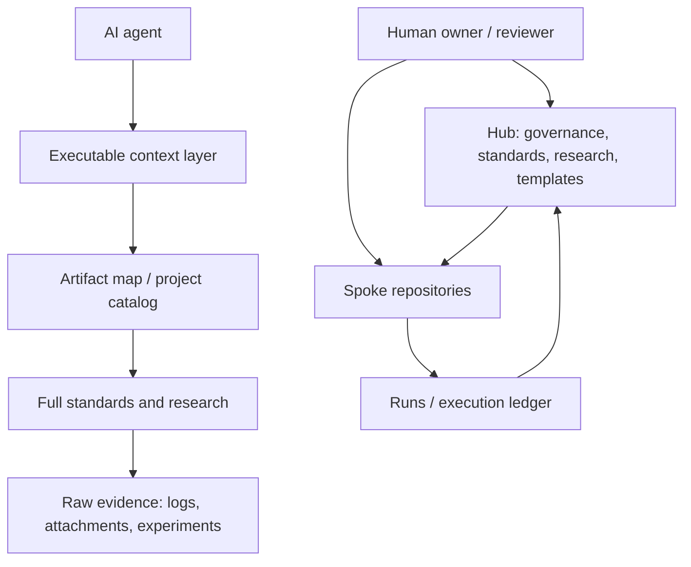
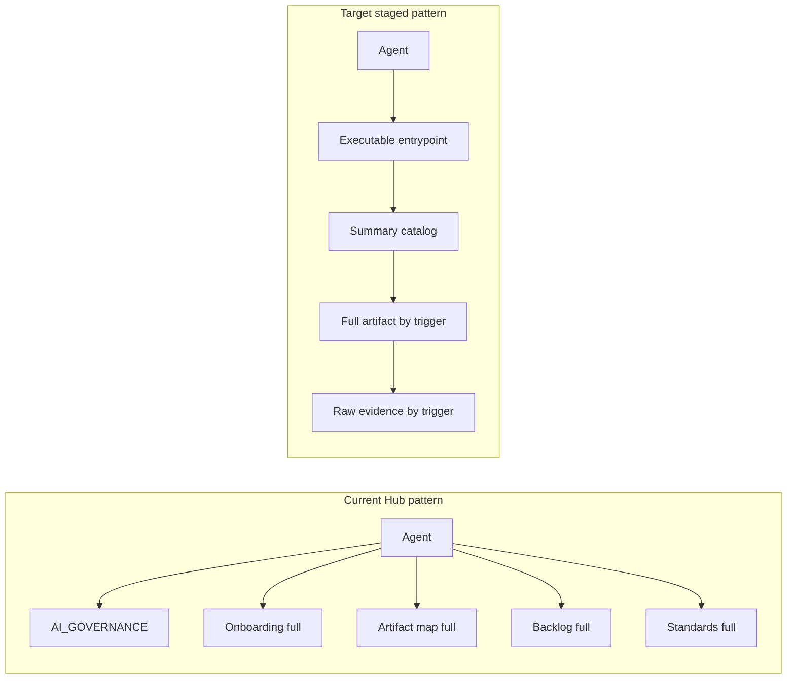
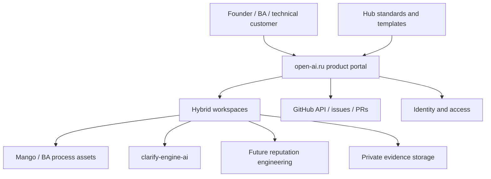
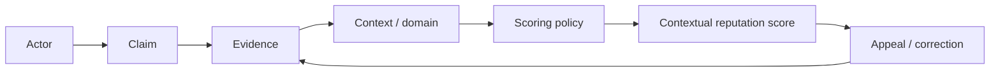
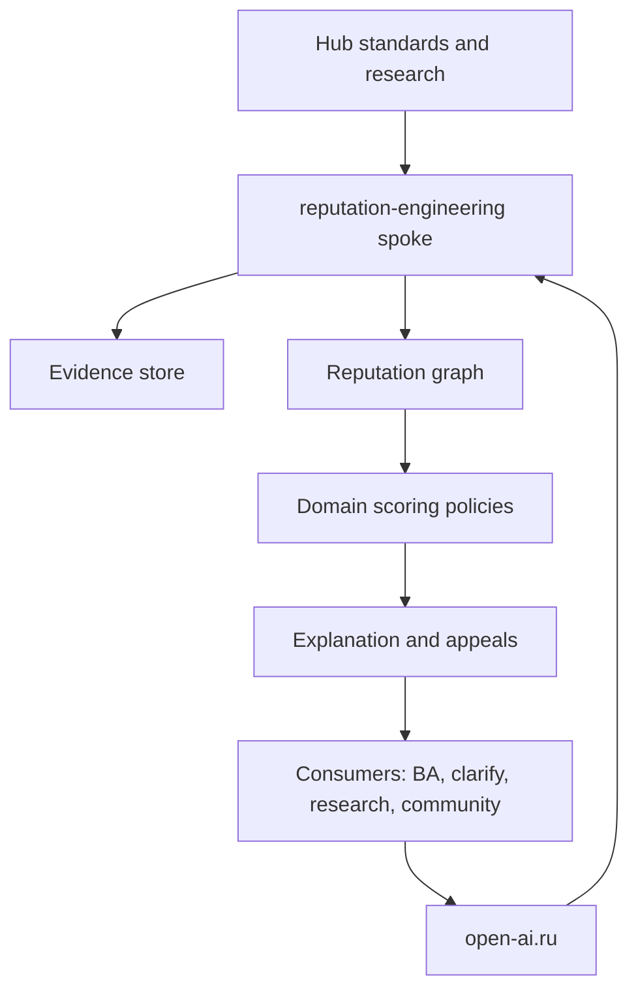
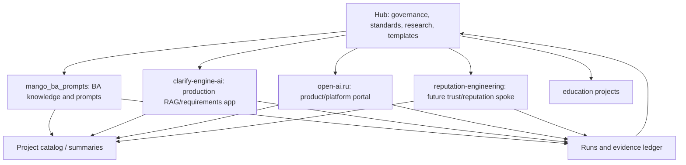

# Комплексное исследование архитектуры экосистемы: Hub, open-ai.ru, репутационные технологии

## Введение

### Контекст задачи

Issue #257 требует не реализации готовых решений, а исследовательского отчета по
трем связанным осям:

1. Архитектура Hub как центра 5+ проектов экосистемы, включая баланс между
   качеством контекста и расходом токенов.
2. Архитектура `open-ai.ru`, включая уровни L1-L4 и рекомендации на основе
   международных практик.
3. Исследование репутационных технологий на основе доступных данных и внешних
   паттернов.

Ключевой риск задачи: попытка решить все через "сохранить токены" или через
добавление очередного слоя governance. Такой ответ был бы недостаточным.
Проблема глубже: экосистема уже содержит несколько типов знания, несколько
проектов с разной зрелостью и разные режимы использования документов человеком
и AI-агентом. Значит, архитектура должна управлять не только объемом текста, но
и назначением артефакта, владельцем, стадией жизненного цикла, маршрутом
эскалации контекста и проверяемостью решений.

### Метод

Исследование собрано из четырех типов источников:

- внутренние артефакты Hub: `repo-model`, `artifact-map`, `backlog`, RFC,
  research-документы и standards;
- связанные spoke-репозитории: `mango_ba_prompts`, `open-ai.ru`,
  `clarify-engine-ai`;
- приложенные к issue #257 аудиты команд G и Q;
- внешние практики: C4, TM Forum ODA/SID, ITIL 4, Azure Cloud Adoption
  Framework, CNCF Platform Engineering Maturity Model, Backstage, LangChain,
  CrewAI, LlamaIndex, Trust over IP, W3C VC/DID, Stack Overflow, Trustpilot,
  Community Notes, OpenRank.

### Ограничения источников

В issue #257 упомянуты "исходные данные по репутационным технологиям", но в
теле issue и комментариях доступны только два вложения с аудитами Hub от команд
G и Q. Комментарии issue пустые. Поиск по коду организации по ключам
`репутац`, `reputation`, `reputational technologies` не выявил отдельного
набора raw data. Поэтому ось 3 ниже основана на доступных внутренних сигналах
(`open-ai.ru`, `ecosystem-map`, RFC по методологиям) и внешних источниках. Перед
превращением выводов по репутационным технологиям в стандарт или product
concept нужно запросить и приложить raw data.

## Результаты

### Executive Summary

Hub уже решает задачу "центр экосистемы" на уровне принципов: есть
hub-and-spoke модель, запрет production-кода в Hub, стандарты, RFC, research,
templates и project summaries. Но текущая архитектура перегружает governance и
навигационные документы. Крупные документы вроде `artifact-map`,
`backlog`, `agent-onboarding-protocol`, `team-contract`, `research-profile` и
`AI_GOVERNANCE` одновременно служат индексом, объяснением, историей, контрактом
и операционным контекстом. Это создает token overhead, дублирование и риск, что
AI-агент будет читать "все важное" вместо минимального исполнимого слоя.

Главный вывод: Hub не нужно срочно дробить на большее число top-level папок.
Сначала нужен явный слой data classes и staged loading:

- `Executable` - краткие документы, которые агент обязан выполнить;
- `Summary` - навигационные карты и резюме для выбора следующего файла;
- `Full` - подробные стандарты, RFC и исследования;
- `Raw/Evidence` - вложения, логи, эксперименты и первичные данные, которые
  читаются только по триггеру.

Для Hub это означает: добавить или спроектировать operational слой `runs/`,
разгрузить governance от журналов исполнения, сохранить artifact-map как
каталог, но не как единственный "глобальный мозг", и ввести token budget не как
цель экономии, а как контроль качества контекста.

Для `open-ai.ru` вывод другой: репозиторий сейчас находится в Phase 0 и не
должен копировать всю сложность Hub. Ему нужна структура L1-L4, где L1 и L2
держат продуктовую рамку, L3 описывает solution architecture и service
boundaries, L4 содержит ADR/runbooks/API/prompts/runtime contracts. Лучший путь:
сделать `open-ai.ru` product/platform spoke с минимальным Hub-inherited
governance, отдельной private operations зоной для чувствительных данных и
ясной трассировкой к проектам `mango_ba_prompts`, `clarify-engine-ai` и будущему
направлению `reputation-engineering`.

Для репутационных технологий главный риск - начать с универсального "рейтинга
доверия". Международные примеры показывают, что надежнее начинать с evidence
objects, provenance, контекстных claims, прав на апелляцию и доменных score
models. Stack Overflow, Trustpilot, Community Notes, ToIP/W3C VC/DID и OpenRank
дают разные уроки: репутация может быть полезной, если она привязана к
конкретному действию и проверяемому свидетельству; она становится опасной, если
претендует на универсальную оценку человека, команды или компании.

### Три приоритетных решения

| Приоритет | Решение | Где применяется | Почему важно |
| --- | --- | --- | --- |
| P0 | Ввести layered context contract: `Executable -> Summary -> Full -> Raw` с явными триггерами эскалации. | Hub, templates, spokes | Снижает token waste без потери качества, traceability и управляемости. |
| P0 | Выделить operational evidence из governance в модель `runs/` или эквивалентный execution ledger. | Hub, Mango pattern, будущие spokes | Убирает логи, digests и результаты исполнения из governance-ядра. |
| P1 | Зафиксировать L1-L4 для `open-ai.ru` как product/platform spoke, не как копию Hub. | open-ai.ru | Дает ясную структуру продукта, решения и runtime-контрактов. |
| P1 | Начинать репутационные технологии с evidence graph, claims и governance, а не с общего score. | open-ai.ru, future reputation spoke | Снижает риск непрозрачных оценок и делает модель проверяемой. |
| P2 | Добавить source/data gap protocol для исследований: если raw data не приложены, отчет фиксирует границу и не выдает выводы за validated facts. | Hub research | Предотвращает ложную уверенность в широких research-задачах. |

### Что подтверждают аудиты команд G и Q

Оба аудита сходятся на том, что Hub зрелый, но начинает платить высокую цену за
мета-слой. Команда G акцентирует "meta-inflation": `artifact-map`, `backlog`,
`session-digests`, RFC и стандарты расширяются быстрее, чем результатные
потоки. Команда Q добавляет структурный диагноз: top-level структура понятна,
но governance перегружен, папки `runs/` нет, а `docs/`, `governance/`,
`research/` и `standards/` частично дублируют объяснения.

Мой вывод: оба аудита правы, но решение не должно быть "удалить большие
документы". Большие документы нужны для humans, reviews и traceability.
Проблема в том, что они используются как runtime-контекст. Значит, нужны
исполняемые фасады, summary-слои и строгие escalation triggers.

### Целевая архитектурная позиция



Архитектурный смысл схемы: агент начинает с исполнимого слоя, выбирает нужный
полный документ через каталог и спускается к raw evidence только при
необходимости. Человек сохраняет право решения, а Hub хранит методологическую
память вместо операционного шума.

## Детализация

## Ось 1. Архитектура Hub для 5+ проектов и token balance

### Текущее состояние Hub

На момент исследования top-level структура Hub включает 14 активных каталогов:
`.github`, `docs`, `education`, `experiments`, `frameworks`, `governance`,
`guides`, `practices`, `projects`, `research`, `standards`, `templates`,
`tools`, `website`. Это не выглядит избыточным само по себе. Разделение в целом
разумное:

- `governance/` - активная модель принятия решений, backlog, RFC, onboarding;
- `standards/` - форматы и профили документов;
- `research/` - исследования по доменам;
- `practices/` - фиксированные практики после отбора;
- `templates/` - переносимые заготовки для новых проектов;
- `projects/` - project knowledge bases и summaries;
- `tools/` - валидаторы и генераторы.

Проблема не в количестве папок, а в смешении ролей внутри документов. Самые
крупные активные документы показывают hotspots:

| Артефакт | Наблюдение | Архитектурный риск |
| --- | --- | --- |
| `governance/artifact-map.md` | Самый крупный навигационный документ, содержит почти полную карту активных артефактов. | При использовании как runtime-контекста превращается в глобальный prompt overload. |
| `governance/backlog.md` | Сводит множество задач, источников, приоритетов и открытых вопросов. | Становится вторым "центром правды" рядом с GitHub Issues и artifact-map. |
| `governance/agent-onboarding-protocol.md` | Одновременно instruction, rationale, checklist и troubleshooting. | Агент получает больше объяснения, чем нужно для конкретной операции. |
| `standards/research-profile.md` | Нужен для качества research, но объемен для простого создания отчета. | Требуется краткая executable версия или summary entrypoint. |
| `AI_GOVERNANCE.md` | Важный высокий уровень правил. | Частично пересекается с onboarding и team contracts. |

Эти hotspots подтверждают вывод из аудитов G/Q: Hub уже накопил достаточную
архитектурную зрелость, но теперь нуждается в механике сжатия контекста и
разделения режимов чтения.

### Data classes как основа архитектуры

Опыт `mango_ba_prompts` особенно важен: там уже появились `runs/`,
`runs/CONTRACT.md`, `runs/REGISTRY.md` и executable-варианты handover/onboarding
документов. Это практический benchmark для Hub. Вместо новой абстрактной
иерархии Hub может использовать пять data classes:

| Data class | Смысл | Где сейчас | Целевое состояние |
| --- | --- | --- | --- |
| Knowledge | Исследования, внешние источники, domain knowledge. | `research/`, `external-knowledge/`, часть RFC. | Остается в research; raw data явно отделяются от выводов. |
| Standards | Правила формата и качества. | `standards/`. | Для каждого крупного стандарта появляется краткий executable entrypoint. |
| Processes | Повторяемые workflows и practices. | `practices/`, `guides/`, часть governance. | Practices становятся импортируемыми атомарными nodes. |
| Runs | Исполнения, логи, результаты, evidence по задачам. | В Hub нет явной папки; часть сведений в backlog/session-digests. | `runs/` или эквивалентный ledger с lifecycle и registry. |
| Governance | Принципы, решения, RFC, права человека. | `governance/`. | Очищается от операционных журналов и повторяющихся summary. |

Главная польза этой модели: она не спорит с существующими папками, а задает
правило размещения и чтения. Новый документ сначала классифицируется по data
class, затем получает уровень контекста.

### Token balance: не экономия, а качество контекста

Token optimization должна считаться не сокращением текста, а управлением
потоком доказательств. В research и governance есть четыре разных режима:

| Режим | Кто читает | Сколько контекста нужно | Пример |
| --- | --- | --- | --- |
| Executable | AI-агент в задаче | Минимально достаточный контракт и ссылки на эскалацию. | `*.executable.md`, короткий onboarding, task checklist. |
| Summary | Агент или человек выбирает маршрут. | Карта, назначение, owner, статус, ссылки. | `README.md`, artifact catalog, project summary. |
| Full | Человек review или агент при сложной задаче. | Полная аргументация, trade-offs, tables. | Research report, RFC, standard. |
| Raw | Аудит, спор, воспроизведение. | Первичные данные, attachments, logs, experiments. | CI logs, downloaded issue attachments, raw interview notes. |

Рекомендуемый escalation contract:

1. Начинай с `Executable` или `Summary`.
2. Открывай `Full`, если задача не решается из summary, в summary есть ссылка на
   обязательный стандарт, пользователь просит research/обоснование или есть
   конфликт между артефактами.
3. Открывай `Raw`, если нужно проверить источник, спорную формулировку, CI/log
   failure, screenshot, raw data или вопрос высокой точности.
4. Фиксируй, какой уровень был использован, в PR description или report
   traceability.

Такой подход сохраняет качество: AI не "слепнет" от сжатия, но перестает
читать полные трактаты там, где достаточно исполнимого контракта.

### Current vs target Hub



### Варианты развития Hub

| Вариант | Содержание | Плюсы | Минусы | Рекомендация |
| --- | --- | --- | --- | --- |
| A. Minimal cleanup | Добавить `runs/`, governance README и краткие summaries для hotspots. | Быстро, низкий риск, совместимо с текущим repo-model. | Не решит долгосрочную навигацию для 10+ проектов. | Принять как Phase 1. |
| B. Layered context architecture | Формализовать `Executable/Summary/Full/Raw`, добавить token budget metadata и escalation triggers. | Решает core problem token/quality/traceability. | Требует дисциплины и validator support. | Основная рекомендация. |
| C. Developer portal/catalog | Вынести каталог проектов и ownership в Backstage-подобный портал. | Масштабируется на десятки сервисов. | Рано для текущей зрелости, добавляет операционные расходы. | Отложить до 8-10 активных production spokes. |
| D. Split Hub into multiple repos | Разнести governance, standards, research, templates. | Снижает размер одного репозитория. | Увеличивает sync-cost и риск расхождения стандартов. | Не делать сейчас. |

### Что именно стоит вынести из governance

Governance должен отвечать за принципы, права, решения и RFC. Он не должен быть
местом для больших журналов выполнения. Предлагаемый маршрут:

| Текущий тип данных | Проблема | Куда двигать |
| --- | --- | --- |
| Session digests | Операционный журнал смешан с governance. | `runs/` или `projects/repo-development/runs/` после RFC. |
| Results/output pipeline | Нет явного места для outcome evidence. | `runs/<yyyy-mm>/<issue-or-pr>/` или ledger registry. |
| Большие onboarding rationale | Агент читает объяснение вместе с инструкцией. | `agent-onboarding-protocol.executable.md` + full rationale отдельно. |
| Backlog evidence | Backlog конкурирует с GitHub Issues. | Backlog как roadmap summary, evidence в issue/PR/runs. |

### Рекомендации для Hub

1. Создать RFC "Hub layered context architecture", не сразу менять все файлы.
2. Взять из Mango pattern `runs/CONTRACT.md` и `runs/REGISTRY.md` как основу,
   но адаптировать к repo-wide governance.
3. Для 5-7 самых крупных runtime-документов добавить executable facade:
   onboarding, research-profile, issue-workflow, sync prompt, team-contract,
   artifact-map summary.
4. Ввести `context_level` в research/relevant frontmatter только после RFC.
5. Добавить валидируемое правило: active artifact должен быть в artifact-map,
   но artifact-map не должен быть единственным runtime entrypoint.
6. Не дробить Hub на много репозиториев до появления устойчивого числа
   production spokes и реальной боли в sync.

## Ось 2. Архитектура open-ai.ru и уровни L1-L4

### Текущее состояние open-ai.ru

`open-ai.ru` сейчас выглядит как ранний product/platform spoke:

- `README.md` описывает AI-native платформу для гибридных команд;
- `docs/vision.md` и `docs/product-concept.md` задают продуктовую рамку;
- `docs/solution-concept.md` пока placeholder;
- `team/` и `governance/rfc/` содержат начальный team/governance слой;
- `src/.gitkeep` показывает, что production implementation еще не начата.

В `docs/product-concept.md` уже есть важная логика: open-ai.ru не просто сайт,
а рабочая среда, где люди и AI-команды выполняют полезную работу. MVP связан с
BA-процессами, workspace, debugging/feedback, knowledge base emulation и
статистикой. Репутационная инженерия указана как будущая Phase 3.

Это означает, что open-ai.ru должен быть спроектирован как продуктовый фасад и
операционный слой экосистемы, а не как еще один governance Hub.

### L1-L4: предлагаемая модель

У Hub уже есть разделение Framework/Methodology L1-L4 в `artifact-map`. Для
open-ai.ru полезно сохранить совместимость по духу, но сделать уровни
продуктовыми:

| Уровень | Назначение | Главный вопрос | Артефакты open-ai.ru |
| --- | --- | --- | --- |
| L1 Product Vision | Обещание продукта, аудитория, границы. | Зачем существует open-ai.ru? | `docs/vision.md`, README. |
| L2 Product Concept | Пользовательские сценарии, capabilities, value metrics. | Что именно пользователь может делать? | `docs/product-concept.md`, roadmap, personas. |
| L3 Solution Concept | Архитектура сервисов, данные, интеграции, риски. | Как это будет работать как система? | `docs/solution-concept.md`, C4 context/container, data model. |
| L4 Runtime Contracts | ADR, runbooks, API schemas, prompts, CI/CD, observability. | Как безопасно менять и эксплуатировать? | `docs/adr/`, `runbooks/`, `prompts/`, `configs/`, `tests/`. |

Такая модель совместима с C4: L1 соответствует system context и product
intent, L2 - capabilities and user journeys, L3 - container/component
architecture, L4 - deployment/runtime/decision records. Она также совместима с
ITIL 4, где сервисное управление требует смотреть не только на технологии, но
и на людей, процессы, партнеров и value streams.

### Целевая карта open-ai.ru



### Международные практики, применимые к open-ai.ru

| Практика | Что взять | Что не копировать буквально |
| --- | --- | --- |
| C4 Model (`ext-051`) | Контекстная и container-схема для L3, простая нотация для human review. | Не превращать C4 в тяжелый enterprise-modeling процесс. |
| TM Forum ODA/SID (`ext-049`, `ext-050`) | Разделение capabilities, components, APIs и common data vocabulary. | Не копировать telco-домены; взять принцип common information model. |
| ITIL 4 (`ext-052`) | Сервисная рамка: value chain, governance, four dimensions. | Не вводить ITSM-бюрократию до появления service operations. |
| Azure CAF (`ext-053`) | Phased adoption: strategy, plan, ready, adopt, govern, secure, manage. | Не привязываться к Azure как платформе. |
| CNCF Platform Engineering Maturity (`ext-054`) | Оценивать платформу по people/process/policy/technology и outcomes. | Не строить internal developer platform раньше продукта. |
| Backstage catalog (`ext-055`) | Ownership metadata near code, software catalog for many services. | Не внедрять Backstage до появления достаточного количества services. |
| LangChain/CrewAI/LlamaIndex (`ext-056`..`ext-058`) | Agent/workflow/tool/data patterns for future runtime. | Не строить продукт вокруг фреймворка как архитектурного центра. |

### Архитектурные варианты open-ai.ru

| Вариант | Структура | Когда подходит | Риск |
| --- | --- | --- | --- |
| A. Lightweight web repo | `docs/`, `src/`, `tests/`, минимум governance. | Landing/product prototype, низкая сложность. | Быстро упрется в данные, auth, workspace и auditability. |
| B. Product/platform spoke | Public product repo + private operations/data + inherited Hub standards. | Лучшее соответствие текущей vision. | Нужна дисциплина boundaries и data classification. |
| C. Ecosystem monorepo | Portal, BA, clarify, reputation, shared libs в одном repo. | Только если команда мала и runtime общий. | Высокий риск coupling и governance bloat. |
| D. Full platform engineering portal | Backstage-like catalog, services, ownership, templates. | После 8-10 активных services/spokes. | Слишком рано для Phase 0. |

Рекомендация: вариант B. `open-ai.ru` должен быть product/platform spoke,
который наследует Hub стандарты, но не хранит в себе весь Hub governance. Для
чувствительных пользовательских данных нужна private operations зона или
отдельное private repo/object storage. Public repo может содержать product
concept, solution concept, ADR, templates и безопасные examples.

### Минимальный L3 для open-ai.ru

`docs/solution-concept.md` должен перестать быть placeholder. Минимальный L3
должен включать:

1. System context: пользователи, Hub, GitHub, spoke repos, hosting, identity.
2. Container model: web app, API/backend, worker, database, object storage,
   observability, integration adapters.
3. Data classes: public docs, workspace state, prompts, raw evidence, secrets,
   user data, derived analytics.
4. Security and privacy boundaries: что public, что private, что never commit.
5. AI workflow boundaries: где человек принимает решение, где агент предлагает,
   где runtime может действовать автоматически.
6. Traceability model: user action -> issue/PR/run -> evidence -> report.
7. MVP slice: BA workspace first, reputation engineering later.

### Рекомендации для L4 open-ai.ru

| L4 artifact | Почему нужен | Когда создавать |
| --- | --- | --- |
| ADR template | Фиксирует архитектурные решения без длинных RFC. | До первого backend/framework выбора. |
| API schema | Делает integrations testable. | При появлении backend API. |
| Prompt contracts | Отделяют product prompts от docs. | При появлении AI workflows. |
| Runbooks | Нужны для deploy/rollback/incident. | Перед публичным MVP. |
| Data retention policy | Нужна для raw evidence и user data. | До приема реальных данных. |
| Evaluation checklist | Нужна для качества AI outputs. | До user-facing AI features. |

## Ось 3. Репутационные технологии

### Внутренний baseline

В текущих внутренних артефактах репутационные технологии появляются как future
phase:

- `open-ai.ru` product concept упоминает reputation engineering как Phase 3;
- `docs/ecosystem-map.md` фиксирует planned spoke `reputation-engineering`;
- RFC по методологиям включает Influence & Network Analysis как будущую
  методологическую область;
- внешние источники `ext-042`..`ext-045` уже покрывают social network analysis,
  centrality, PageRank и knowledge graphs.

Этого достаточно для архитектурного исследования, но недостаточно для выбора
готовой scoring model. Нужны raw data: какие объекты оцениваются, кто источник
сигнала, какие есть негативные/позитивные события, какие риски false positive,
какая бизнес-цель и кто имеет право апелляции.

### Репутация как evidence graph, а не общий рейтинг

Репутационная система должна начинаться с вопроса "для какого решения нужен
сигнал доверия?". Возможные решения:

- кому дать расширенные права в community;
- какой отзыв считать более надежным;
- какой источник знаний использовать в research;
- какой AI-output пропустить дальше по pipeline;
- какой участник может выступать reviewer в конкретном домене.

Универсальный score плохо подходит для всех этих задач. Лучше использовать
модель:



### Уроки внешних репутационных систем

| Источник | Модель | Сильная сторона | Риск/ограничение для open-ai.ru |
| --- | --- | --- | --- |
| Stack Overflow (`ext-062`) | Community trust через votes и privileges. | Репутация привязана к полезным действиям и открывает конкретные права. | Не переносить на оценку личности вне community context. |
| Trustpilot (`ext-063`) | TrustScore из отзывов, времени, частоты и веса сигналов. | Понятная consumer-facing логика review reputation. | Риск gaming, review fraud и спорных business incentives. |
| Community Notes (`ext-064`) | Open ranking, helpfulness, diversity of perspectives. | Репутационный сигнал учитывает disagreement bridging, не только majority. | Зависит от объема участников и прозрачности алгоритма. |
| W3C VC/DID + ToIP (`ext-059`..`ext-061`) | Verifiable credentials, decentralized identifiers, trust layers. | Сильная база для provenance, issuers, holders, verifiers. | Сложнее UX и governance; не решает scoring само по себе. |
| OpenRank (`ext-065`, `ext-066`) | Decentralized graph reputation, EigenTrust-like compute. | Полезный reference для open reputation compute. | В июне 2026 проект объявил остановку; использовать как case study, не как active platform dependency. |

### Архитектура будущего reputation spoke



Рекомендуемый repo skeleton для future spoke:

```text
reputation-engineering/
  README.md
  docs/
    vision.md
    product-concept.md
    solution-concept.md
    adr/
  research/
    external-sources-registry.md
    raw-data-readme.md
  standards/
    evidence-object-profile.md
    reputation-claim-profile.md
  experiments/
    exp-graph-ranking/
    exp-appeal-workflow/
  src/
  tests/
```

Важно: `raw-data-readme.md` описывает схему и правила доступа, но сами
чувствительные raw data не должны попадать в public repo.

### Минимальная модель объектов

| Объект | Поля первого уровня | Зачем |
| --- | --- | --- |
| `EvidenceObject` | `id`, `source`, `timestamp`, `actor`, `claim_ref`, `visibility`, `provenance` | Позволяет проверить, откуда взялся сигнал. |
| `ReputationClaim` | `subject`, `predicate`, `value`, `context`, `issuer`, `confidence` | Делает оценку атомарной и доменной. |
| `ScoringPolicy` | `context`, `inputs`, `weights`, `decay`, `exclusions`, `appeal_rule` | Делает score объяснимым и изменяемым. |
| `ReputationScore` | `subject`, `context`, `score`, `interval`, `policy_ref`, `evidence_refs` | Связывает результат с политикой и доказательствами. |
| `AppealRecord` | `score_ref`, `actor`, `reason`, `decision`, `reviewer`, `timestamp` | Позволяет исправлять ошибки и снижать governance risk. |

### Что нельзя делать в Phase 1

- Нельзя вводить единый "индекс доверия" для всех людей, компаний или AI-агентов.
- Нельзя использовать непрозрачный score без evidence refs и policy refs.
- Нельзя смешивать reputation signals из разных доменов без явного context.
- Нельзя публиковать raw personal/business data в public repo.
- Нельзя считать OpenRank active dependency после объявления остановки в июне
  2026; можно использовать его только как изученный кейс.

## Cross-cutting architecture

### Целевая экосистема



### Управляющие принципы

| Принцип | Практическое следствие |
| --- | --- |
| Hub is methodology, spokes are production. | Production code, client data and runtime secrets stay outside Hub. |
| Large documents are allowed, but not as default runtime context. | Every major full document should have summary or executable entrypoint. |
| Token budget is a quality control, not a cost-only metric. | Budget must preserve source traceability, decision rights and escalation paths. |
| Reputation is contextual. | Scores must be tied to domain, evidence and appeal route. |
| International practices are reference models, not cargo cult. | Adopt principles from C4/ODA/ITIL/CAF/CNCF/Backstage, not their full organizational weight. |

### Roadmap

| Phase | Scope | Deliverable | Exit criteria |
| --- | --- | --- | --- |
| 0. Research acceptance | Issue #257 | This report, source registry update, PR review. | Human accepts research boundaries and raw data gap. |
| 1. Hub context architecture RFC | Hub | RFC for `Executable/Summary/Full/Raw`, `runs/` placement and escalation triggers. | RFC approved or rejected with explicit trade-offs. |
| 2. Hub pilot | Hub + Mango pattern | Executable facades for 3-5 hotspots and `runs/` draft contract. | Local validators pass; one PR uses the new route. |
| 3. open-ai.ru L3 | open-ai.ru | Filled `docs/solution-concept.md` with C4/data/security sections. | MVP architecture reviewed before implementation. |
| 4. Reputation raw data intake | Future reputation spoke | Data inventory, evidence object profile, risk checklist. | Raw data access and privacy rules explicit. |
| 5. Cross-project catalog | Hub + spokes | Project catalog metadata and summaries. | Agent can choose correct project context without reading all docs. |

### Open questions for human review

| Question | Why it matters |
| --- | --- |
| Where should Hub operational records live: `runs/` in root, `projects/repo-development/runs/`, or only GitHub Issues/PRs? | This decides whether Hub gets a new top-level data class. |
| Should `open-ai.ru` use a private companion repo for operations/data from the start? | Public/private boundary affects architecture and compliance. |
| What are the missing raw data for reputational technologies? | Without them, scoring recommendations remain hypotheses. |
| Should executable facades be separate files (`*.executable.md`) or frontmatter sections inside full documents? | Separate files optimize runtime; sections reduce file count. |
| When should a catalog tool like Backstage become worth the cost? | Premature portalization would add complexity before service count justifies it. |

## Проверка требований issue #257

| Требование issue | Где покрыто |
| --- | --- |
| Архитектура Hub для 5+ проектов | Ось 1, cross-cutting ecosystem diagram, roadmap. |
| Token balance optimization | Ось 1, staged context model and escalation contract. |
| open-ai.ru architecture and L1-L4 | Ось 2, L1-L4 table, target map, L3/L4 recommendations. |
| Репутационные технологии | Ось 3, external examples, evidence graph, future spoke skeleton. |
| International best practices | C4, TM Forum ODA/SID, ITIL, Azure CAF, CNCF, Backstage, agent frameworks, ToIP/W3C. |
| Alternatives and trade-offs | Variant tables for Hub and open-ai.ru, reputation risks. |
| Research only, no ready solution implementation | Report gives recommendations and roadmap, not production code. |
| 20-30 page equivalent detail | Multi-section report with tables, diagrams, roadmap and traceability. |
| Local validation | Expected checks: frontmatter, repository structure, manifest check. |

## Источники

### Внутренние источники

- Issue #257: <https://github.com/G-Ivan-A/hybrid-Intelligence-lab/issues/257>
- PR #258: <https://github.com/G-Ivan-A/hybrid-Intelligence-lab/pull/258>
- `governance/repo-model.md`
- `governance/artifact-map.md`
- `governance/backlog.md`
- `governance/rfc/methodology-research-and-proposals.md`
- `research/hub/ecosystem-governance-audit-2026-06.md`
- `research/mango/repository-structure-vision-2026-06.md`
- `research/mango/token-optimization-proposal-2026-06.md`
- `research/external-knowledge/external-sources-registry.md`
- `mango_ba_prompts` repository snapshot, especially `runs/` and executable
  onboarding/handover patterns.
- `open-ai.ru` repository snapshot, especially `README.md`,
  `docs/product-concept.md`, `docs/solution-concept.md`.
- `clarify-engine-ai` repository snapshot, especially `README.md` and
  `docs/CONCEPT.md`.
- Issue #257 attachments: Hub audit by Team G and Hub audit by Team Q.

### Внешние источники

The external sources used here are registered in
`research/external-knowledge/external-sources-registry.md` as `ext-049` through
`ext-066`:

- TM Forum Open Digital Architecture and Information Framework SID.
- C4 Model.
- ITIL 4 Foundation overview.
- Microsoft Azure Cloud Adoption Framework.
- CNCF Platform Engineering Maturity Model.
- Backstage Software Catalog.
- LangChain, CrewAI and LlamaIndex documentation.
- Trust over IP stack, W3C Verifiable Credentials and W3C DIDs.
- Stack Overflow reputation help, Trustpilot Trust Centre, X Community Notes
  documentation.
- OpenRank documentation and June 2026 shutdown notice.
