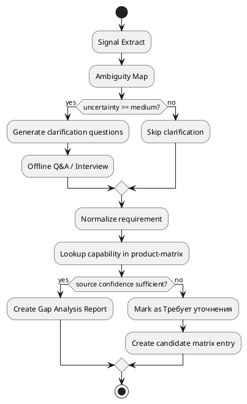
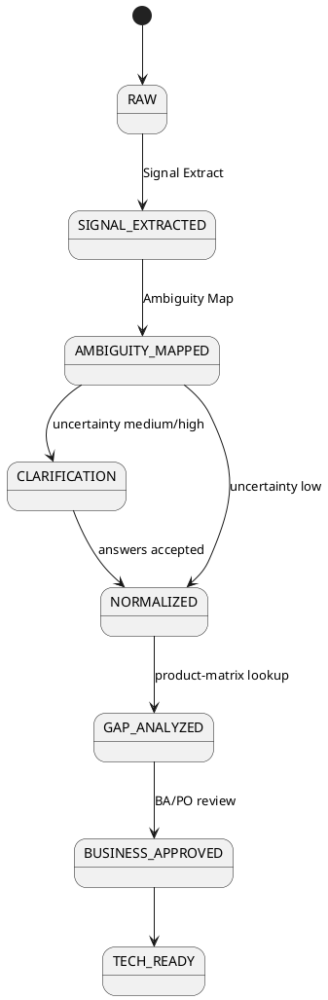
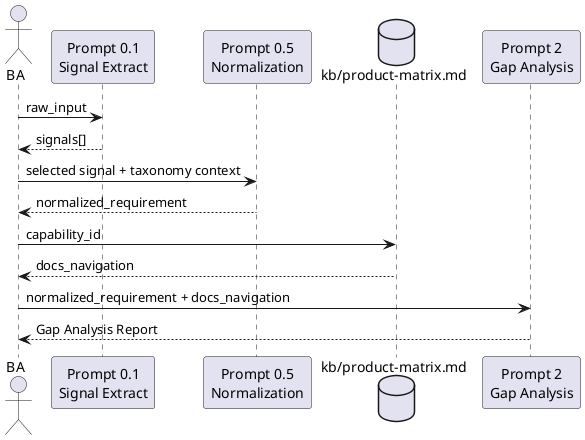
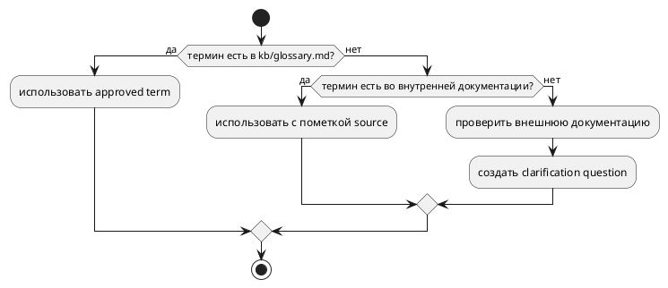
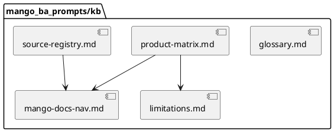

# Маппинг продуктов/фич Mango как RAG-навигатор и roadmap автоматизации БА

Версия: 0.1

Дата: 2026-05-26

Документ предлагает практичную структуру `kb/product-matrix.md` для Mango:
не хранилище полной документации, а навигатор, который связывает нормализованное
требование с узким набором разделов базы знаний, публичной документации и
источников evidence. Фокус этого исследования - навигатор, roadmap внедрения и
карта диаграмм для процесса БА; глоссарий и глубокий аудит
`docs.mango-office.ru` остаются отдельными работами.

## Назначение и границы

| Параметр | Значение |
| --- | --- |
| Operating Mode | `creative` - предлагаем структуру, варианты и roadmap, не блокируя прогресс при неопределенности. |
| В фокусе | Запросы на доработку системы или новую фичу; этап `2` Gap-анализ и его связь с этапами `0 -> 1`; документационная стратегия для `kb/`. |
| Вне фокуса | Валидация готовых ТЗ, детальная инвентаризация `docs.mango-office.ru`, формирование полного glossary, копирование внешней документации в репозиторий. |
| Опора | [taxonomy-concept-2026-05.md](taxonomy-concept-2026-05.md), [requirements-lifecycle-uncertainty-2026-05.md](requirements-lifecycle-uncertainty-2026-05.md), [mango_ba_prompts](https://github.com/G-Ivan-A/mango_ba_prompts). |
| Принцип | Anti-Inflation: создаем research draft и план `kb/`, а не новый стандарт и не полный проектный каталог. |

Рабочая модель: БА получил сырой сигнал, провел Signal Extract и
Normalization, получил `capability_id` / `domain` / `feature_type`, затем
обращается к RAG-навигатору. Навигатор возвращает короткий список источников,
которые нужно проверить для Gap-анализа и evidence, вместо загрузки всей
документации Mango в контекст.

## 1. 🗺️ Маппинг продуктов/фич как RAG-навигатор (предложение структуры)

### 1.1 Роль `kb/product-matrix.md`

`kb/product-matrix.md` должен отвечать на один вопрос: **куда смотреть, если
нормализованное требование относится к capability X**. Он не должен:

- заменять Unified Capability Taxonomy;
- хранить полный текст документации;
- фиксировать окончательный статус покрытия без BA/SME review;
- становиться продуктовым каталогом с тарифами и коммерческими условиями.

Минимальная ответственность файла:

| Слой | Что хранит | Зачем промпту |
| --- | --- | --- |
| Capability key | Стабильный ключ фичи (`voice.call-routing`) и связка с taxonomy path. | Найти правильную запись после `0.5 Normalization`. |
| Product/documentation route | Список разделов `kb/`, `docs.mango-office.ru`, публичного каталога или API-документации. | Ограничить поиск 3-7 релевантными источниками. |
| Evidence policy | Приоритет источника, достоверность, дата проверки и owner review. | Не выдавать гипотезу за подтвержденный статус. |
| Related features | Соседние capabilities и типовые зависимости. | Не потерять составные требования. |
| Limitations ref | Ссылка на будущий файл ограничений или known gaps. | Ускорить Gap-анализ и вопросы к PO. |

### 1.2 Предлагаемый формат записи

Формат остается Markdown-first: человек читает таблицу и блоки YAML, LLM
обрабатывает структуру как стабильный контракт. Для пилота достаточно одного
файла `mango_ba_prompts/kb/product-matrix.md`; при росте объема его можно
разбить по доменам без изменения интерфейса промпта.

```yaml
voice.call-routing:
  capability_id: "MGO-UC-ROUTING-001"
  taxonomy_path: "UC > call-management > routing"
  feature_type: "core-feature"
  maturity: "L3 mapped"
  owner_route: "UCaaS PO + Contact Center PO"
  docs_navigation:
    - section: "Виртуальная АТС / Обработка звонков / Голосовое меню и распределение"
      url: "https://docs.mango-office.ru/ru/produkty-i-prilozheniya/virtualnaya-ats-i-lichnyi-kabinet/4_4_obrabotka_zvonkov/4_4_2_golosovoe_menyu_i_raspredelenie_zvonkov.html"
      source_type: "official-docs"
      confidence: "high"
      priority: 1
      keywords: ["распределение звонков", "группа", "голосовое меню", "маршрут"]
      checked_at: "2026-05-26"
    - section: "API MANGO OFFICE / API ВАТС"
      url: "https://docs.mango-office.ru/ru/api-i-razrabotka/api-mango-office/index.html"
      source_type: "official-api-docs"
      confidence: "medium"
      priority: 2
      keywords: ["callback", "call", "commands", "events"]
      checked_at: "2026-05-26"
    - section: "Публичный каталог / Распределение вызовов"
      url: "https://www.mango-office.ru/products/virtualnaya_ats/raspredelenie_vyzovov/"
      source_type: "public-product-page"
      confidence: "medium"
      priority: 3
      keywords: ["распределение вызовов", "АТС", "отдел"]
      checked_at: "2026-05-26"
  related_features: ["voice.ivr", "voice.recording", "cc.queue-routing"]
  limitations_ref: "kb/limitations.md#voice-call-routing"
  gap_questions:
    - "Нужна маршрутизация внутри ВАТС, Контакт-центра или cross-product сценарий?"
    - "Требуется ли skill-based routing или достаточно групп/очередей?"
```

Пример для интеграционной capability:

```yaml
integration.crm-recording-export:
  capability_id: "MGO-IP-CRM-001"
  taxonomy_path: "IP > crm-integration > call-record-export"
  feature_type: "integration"
  maturity: "L2 normalized"
  owner_route: "Platform Integrations SME + Security review"
  docs_navigation:
    - section: "Интеграции / Алфавитный каталог интеграций"
      url: "https://docs.mango-office.ru/ru/integratsii/index.html"
      source_type: "official-docs"
      confidence: "high"
      priority: 1
      keywords: ["интеграции", "CRM", "amoCRM", "Битрикс24"]
      checked_at: "2026-05-26"
    - section: "API и разработка / API MANGO OFFICE"
      url: "https://docs.mango-office.ru/ru/api-i-razrabotka/api-mango-office/index.html"
      source_type: "official-api-docs"
      confidence: "high"
      priority: 2
      keywords: ["записи разговоров", "events", "history", "API"]
      checked_at: "2026-05-26"
    - section: "Публичная страница документации интеграций"
      url: "https://www.mango-office.ru/products/integraciya/docs/"
      source_type: "public-docs-index"
      confidence: "high"
      priority: 3
      keywords: ["готовые интеграции", "API", "webhook"]
      checked_at: "2026-05-26"
  related_features: ["voice.recording", "cc.case-management", "analytics.call-history"]
  limitations_ref: "kb/limitations.md#crm-recording-export"
  compliance_triggers: ["personal-data", "call-recording", "external-system"]
```

### 1.3 Как промпт использует навигатор

```text
Вход:
  Normalized Requirement
  -> capability_id / domain / feature_type / uncertainty

Шаги:
  1. Найти запись в kb/product-matrix.md по capability_id или taxonomy_path.
  2. Взять docs_navigation, отсортировать по priority.
  3. Отфильтровать источники по confidence и source_type.
  4. Сформировать узкий запрос к документации:
     - только выбранные разделы;
     - только keywords из записи;
     - только связанные features при composite requirement.
  5. Вернуть Gap Analysis Report:
     - preliminary_coverage_status;
     - evidence_refs;
     - assumptions;
     - clarification_questions;
     - owner_route.

Выход:
  Gap Analysis Report, который БА проверяет до перехода к техническому слою.
```

Правило для controlled generation: если запись не найдена или все источники
имеют `confidence: low`, промпт не должен придумывать покрытие. Он возвращает
`coverage_status: Требует уточнения`, предлагает candidate-запись для
`product-matrix.md` и формирует вопросы к BA/SME.

### 1.4 Интерфейс для будущей векторной БД

Важно сохранить одинаковый интерфейс для промпта независимо от источника:

```json
{
  "capability_key": "voice.call-routing",
  "capability_id": "MGO-UC-ROUTING-001",
  "query": "распределение входящих вызовов по группам и навыкам",
  "filters": {
    "domain": "UC",
    "source_type": ["official-docs", "official-api-docs"],
    "confidence_min": "medium"
  },
  "result_limit": 7
}
```

| Вариант источника | Как работает | Плюсы | Минусы | Когда переходить |
| --- | --- | --- | --- | --- |
| A. Один Markdown-файл | Промпт читает `kb/product-matrix.md` и выбирает ссылки. | Быстрый старт, review через PR, легко версионировать. | Ручное обновление, ограниченный поиск по смыслу. | Спринт 2, первый пилот. |
| B. Модульные Markdown-файлы | `kb/product-matrix/voice.md`, `contact-center.md`, `integrations.md`. | Меньше конфликтов, проще ownership по доменам. | Нужен индекс и правило разбиения. | После 50-70 capability-записей. |
| C. Векторная БД + registry | Markdown остается registry, chunks уходят в embeddings. | Semantic search, лучше для большой документации. | Нужны ingestion, контроль freshness и security. | Когда ручной поиск становится bottleneck и есть validated pilot. |

Рекомендация: начать с варианта A, но сразу проектировать поля так, чтобы
векторная БД возвращала тот же контракт: `capability_key`, `source_id`,
`section`, `url`, `confidence`, `evidence_snippet_ref`, `checked_at`.

## 2. 🔍 Источники документации Mango (оценка достоверности)

Этот раздел фиксирует source map, а не глубокий аудит. Дата среза:
`2026-05-26`.

### 2.1 ✅ Высокая достоверность

| Источник | Что подтверждено на срезе | Как использовать в навигаторе | Ограничение |
| --- | --- | --- | --- |
| `docs.mango-office.ru/ru/index.html` | Верхний уровень Diplodoc-навигации: «Начать здесь», «Кейсы и сценарии», «Продукты и приложения», «Интеграции», «API и разработка», «Администрирование», «Поддержка», «Архив». | Главная карта разделов для `docs_navigation`. | Не заменяет проверку конкретной страницы перед Gap-анализом. |
| `docs.mango-office.ru/ru/produkty-i-prilozheniya/index.html` | Продуктовый раздел содержит материалы по ВАТС, Личному кабинету, Контакт-центру, Mango Talker, мобильному ЛК, Манго Диалогам, аналитике, SIP Trunk и другим продуктам. | Приоритет 1 для product behavior и пользовательских сценариев. | Страница описывает работу продукта, но не всегда отвечает на commercial/package вопрос. |
| `docs.mango-office.ru/ru/integratsii/index.html` | Есть раздел интеграций, сгруппированный отдельно от API и продуктовых страниц. | Приоритет 1 для готовых CRM/бизнес-интеграций. | Нужна проверка конкретной интеграции и версии. |
| `docs.mango-office.ru/ru/api-i-razrabotka/index.html` | Есть отдельный раздел API и разработки, включая API MANGO OFFICE, Манго Диалоги и webhooks/API-related материалы. | Приоритет 1-2 для технической реализуемости интеграций. | Для бизнес-слоя использовать только как evidence, не подменять User Story техническими методами. |
| `www.mango-office.ru/products/` | Публичный каталог показывает продуктовые группы: Виртуальная АТС, Контакт-центр, Коллтрекинг, Роботы, Речевая аналитика, интеграции и другие возможности. | Evidence для публично заявленного product/package presence. | Публичный каталог не доказывает глубину функции, ограничения и доступность на тарифе. |
| `www.mango-office.ru/products/integraciya/docs/` | Публичная страница документации интеграций перечисляет готовые интеграции, API-документацию и Webhook как отдельные группы. | Индекс для поиска integration/API источников, особенно при внешней CRM. | PDF/страницы нужно проверять отдельно; не копировать содержимое в `kb/`. |

### 2.2 ⚠️ Низкая достоверность (гипотезы, требуется ручная проверка)

| Гипотеза источника | Почему полезно | Почему нельзя считать подтвержденным |
| --- | --- | --- |
| Официальный glossary Mango внутри `docs.mango-office.ru` или support-раздела. | Может стать источником терминов после `kb/glossary.md`. | На срезе подтверждена только общая навигация и наличие FAQ/глоссарных зон, не проведен аудит терминов. |
| Детальные ограничения по тарифам и доступности функций. | Критично для `coverage_status: Частично`. | Публичные страницы и docs могут не отражать договорные условия, enterprise exceptions и beta-функции. |
| Полная карта API endpoints для ВАТС, Контакт-центра, Манго Диалогов и Коллтрекинга. | Нужна для технического слоя и интеграционного Gap-анализа. | Текущий документ не проводит глубокую инвентаризацию endpoint-ов; API может иметь версии и ограничения доступа. |
| Каталог партнерских/готовых интеграций как authoritative source. | Полезен для CRM/ERP требований. | Нужна ручная проверка каждой интеграции, версии, сценария и ownership. |
| Внутренние SME notes, коммерческие правила и backlog-статусы. | Могут сильнее публичных страниц отвечать на реальную реализуемость. | Не публичные источники; нельзя использовать без governance, доступа и sanitation. |

### 2.3 Рекомендация по повышению достоверности

| Шаг | Действие | Артефакт | Критерий готовности |
| --- | --- | --- | --- |
| 1. Ручная проверка источника | БА/SME открывает конкретную страницу и фиксирует, что она отвечает на feature question. | `checked_at`, `checked_by`, `source_type`, `confidence`. | У записи есть дата и owner review. |
| 2. Фиксация навигации | Добавить ссылку в `kb/product-matrix.md`, а общие разделы - в `kb/mango-docs-nav.md`. | `kb/mango-docs-nav.md` как индекс верхнего уровня. | Есть не более 3-7 ссылок на capability. |
| 3. Evidence для Gap-анализа | В `Gap Analysis Report` указывать конкретные evidence refs, а не общую ссылку на каталог. | `evidence_refs[]`. | Каждое покрытие имеет источник и уровень уверенности. |
| 4. Freshness-control | Для тендера или важного gap повторно проверять sources старше 90 дней. | `stale_evidence` flag. | Старые ссылки не используются как единственное доказательство. |
| 5. Подготовка к RAG | Нарезать проверенные страницы на chunks с source_id, но оставить Markdown registry источником правды. | `source_id`, `chunk_id`, `embedding_version`. | Поиск возвращает те же поля, что Markdown-навигатор. |

## 3. 🗓️ Roadmap реализации проекта (с учетом будущей структуры)

`mango_ba_prompts/README.md` уже существует как навигация spoke-проекта. Roadmap
ниже не создает новые папки в этом PR; он планирует расширение
`mango_ba_prompts/` до `kb/`, `prompts/`, `docs/` и `experiments/` после
согласования с PO/Founder.

### Этап 1 (Спринт 2): Markdown-навигатор и один проверенный подпроцесс

| Поле | Содержание |
| --- | --- |
| Цель | Создать минимальный `mango_ba_prompts/kb/product-matrix.md` и проверить его на одном подпроцессе `Signal Extract -> Normalization -> Gap Analysis`. |
| Артефакты | `mango_ba_prompts/kb/README.md`, `kb/product-matrix.md`, `kb/mango-docs-nav.md`, `kb/orchestration-rules.md`, 10-15 capability-записей уровня `L2-L3`. |
| Scope пилота | ВАТС/обработка звонков, Контакт-центр/очереди, интеграции CRM, речевая аналитика/QM. |
| Критерии готовности | Для 10 pilot capabilities есть `docs_navigation`, `owner_route`, `confidence`, `checked_at`; один реальный запрос проходит до `Gap Analysis Report`. |
| Риски | Перегрузка полями; ложная точность по публичным страницам; спор между taxonomy и product catalog. |
| Митигация | Обязательны только 8 полей; статус покрытия подтверждает БА/SME; product-matrix хранит ссылки, а не финальную truth. |
| Метрики успеха | 80% pilot requirements находят запись в matrix; медианное время поиска источников меньше 15 минут; не более 25% SME override по routing. |

### Этап 2 (Спринт 3): Промпты, цепочка `0 -> 1 -> 2` и составное требование

| Поле | Содержание |
| --- | --- |
| Цель | Настроить промпт-цепочку на использование `kb/product-matrix.md` и проверить составной запрос, затрагивающий несколько продуктов. |
| Артефакты | `mango_ba_prompts/prompts/signal-extract.md`, `prompts/normalization.md`, `prompts/gap-analysis.md`, `docs/pilot-cases.md`, regression examples для 5 типовых требований. |
| Scope пилота | Cross-product кейс: статистика звонков в ЛК + экспорт записей в CRM + compliance-trigger по ПДн. |
| Критерии готовности | Промпт возвращает одинаковый `capability_id` при повторном прогоне; подтребования связаны `request_id`; Gap-анализ содержит evidence refs и вопросы. |
| Риски | Нестабильность вывода LLM; потеря secondary capability; смешение бизнес-слоя с техническим API-решением. |
| Митигация | JSON/Markdown output contract; composite linking rule; gate `Business Alignment Pack` до технического слоя. |
| Метрики успеха | `output stability` >= 90% на regression examples; 100% composite subrequirements сохраняют связь; один clarification round или меньше. |

### Этап 3 (Спринт 4): Evidence governance и подготовка к векторной БД

| Поле | Содержание |
| --- | --- |
| Цель | Ввести freshness-control, source confidence и подготовить ingestion-контракт без обязательного запуска vector DB. |
| Артефакты | `kb/source-registry.md`, `kb/limitations.md`, `experiments/rag-nav-eval/README.md`, ingestion contract (`source_id`, `chunk_id`, `confidence`, `checked_at`). |
| Scope пилота | 30-50 требований из корпуса или свежего RFI/RFP; только sanitized examples. |
| Критерии готовности | У каждого `coverage_status` есть source confidence; stale sources старше 90 дней помечаются; есть отчет по ошибкам поиска. |
| Риски | Векторная БД начнет восприниматься как authoritative truth; источники устареют; появятся NDA/ПДн риски при ingestion. |
| Митигация | Markdown registry остается source of truth; chunks содержат только ссылки/санитизированные фрагменты; private sources требуют отдельной политики. |
| Метрики успеха | `% evidence-backed` >= 70%; stale evidence используется только с re-check; не менее 80% запросов находят 3 релевантных источника. |

### Этап 4 (Спринт 5+): n8n-оркестрация и масштабирование

| Поле | Содержание |
| --- | --- |
| Цель | Перевести ручную цепочку БА в полуавтоматический workflow с human gates. |
| Артефакты | n8n workflow spec, `prompts/orchestrator.md`, audit log template, dashboard метрик. |
| Scope пилота | `0.1 Signal Extract`, `0.2 Ambiguity Map`, `0.5 Normalization`, `2 Gap Analysis`; `1` и PO decisions остаются с человеком. |
| Критерии готовности | Workflow сохраняет вход, выход, sources, decisions и manual overrides; возможен rollback prompt/version. |
| Риски | Автоматизация преждевременно вытеснит BA judgment; workflow станет сложнее процесса. |
| Митигация | Human approval gates; ограниченный набор продуктов; weekly review ошибок. |
| Метрики успеха | Время от сырого запроса до Gap Analysis снижается на 30%; manual override trend падает; БА удовлетворены качеством evidence. |

## 4. 📊 Карта применения диаграмм для документации проекта

PlantUML нужен как текстовый формат, который версионируется вместе с
документацией и может рендериться в review. Основной инструмент сейчас -
Activity Diagram, потому что главная неопределенность лежит в бизнес-логике
переходов и решений.

| Цель | Тип диаграммы в PlantUML | Пример кода (фрагмент) |
| --- | --- | --- |
| Бизнес-логика процесса | Activity Diagram | `start; :Signal Extract; if (есть неопределенности?) then (да); :Offline Q&A; else (нет); :Normalization; endif; :Gap Analysis; stop;` |
| Состояния требования | State Diagram | `[*] --> RAW; RAW --> NORMALIZED: normalization; NORMALIZED --> GAP_ANALYZED: evidence found; GAP_ANALYZED --> BUSINESS_APPROVED;` |
| Взаимодействие промптов | Sequence Diagram | `BA -> Prompt01: raw_input; Prompt01 --> BA: signals; BA -> ProductMatrix: capability_id; ProductMatrix --> BA: docs_navigation;` |
| Правила классификации | Activity + Decision | `if (feature found in matrix?) then (yes); :use docs_navigation; else (no); :create candidate entry; endif;` |
| Структура артефактов `kb/` | Component Diagram | `[product-matrix.md] --> [mango-docs-nav.md]; [gap-analysis.md] --> [source-registry.md];` |
| Связь требования с evidence | Object Diagram | `object Requirement; object Capability; object EvidenceRef; Requirement --> Capability; Capability --> EvidenceRef;` |

### 4.1 Activity Diagram - основной формат пилота

Когда создавать: для каждого процесса, где есть ветвления, gate-критерии,
uncertainty или human-in-the-loop.

Кто использует: БА, PO, prompt designer, reviewer PR.

Как версионировать: хранить `.puml` рядом с процессным документом или вставлять
фрагмент в Markdown; при изменении процесса обновлять диаграмму в том же PR.

Как экспортировать: рендерить в PNG/SVG для презентации, но source of truth -
PlantUML-код.



### 4.2 State Diagram - lifecycle требования

Когда создавать: когда нужно зафиксировать допустимые статусы и запретить
переходы без gate.

Кто использует: БА, PO, будущая n8n-оркестрация.

Как версионировать: одна диаграмма на lifecycle version, например
`requirement-lifecycle-v0.1.puml`.

Как экспортировать: в README процесса и в onboarding materials.



### 4.3 Sequence Diagram - взаимодействие промптов и источников

Когда создавать: для цепочек промптов, где важно показать входы/выходы,
контракты и human gates.

Кто использует: prompt designer, БА-оркестратор, reviewer.

Как версионировать: вместе с prompt chain contract; изменения промпта должны
обновлять sequence.

Как экспортировать: в `mango_ba_prompts/docs/prompt-orchestration.md` после
создания проектной документации.



### 4.4 Activity + Decision - правила классификации

Когда создавать: для спорных правил, где нужна прозрачная логика выбора:
glossary vs docs, direct feature vs composite, high confidence vs low
confidence.

Кто использует: БА, SME, prompt reviewer.

Как версионировать: включать в `orchestration-rules.md`; правило получает ID,
например `RULE-RAG-001`.

Как экспортировать: в PR description при изменении rule.



### 4.5 Component Diagram - структура `kb/`

Когда создавать: когда появляется больше трех `kb/`-артефактов и нужно
объяснить зависимости без чтения всех файлов.

Кто использует: PO, repository reviewer, AI-agent onboarding.

Как версионировать: обновлять при добавлении нового `kb/` файла.

Как экспортировать: в `mango_ba_prompts/kb/README.md`.



## 5. 🔗 Связи с другими исследованиями `research/mango/`

Этот раздел фиксирует пересечения, чтобы новый файл дополнял существующие
исследования, а не дублировал их.

| Файл | Что уже закрыто | Чем дополняет текущий документ |
| --- | --- | --- |
| [taxonomy-concept-2026-05.md](taxonomy-concept-2026-05.md) | Unified Capability Taxonomy: 7 доменов, maturity `L0-L5`, поля capability, mapping к продуктам, owner_route, evidence_refs, uncertainty. | Использует taxonomy как вход для RAG-навигатора: `capability_id` и `taxonomy_path` становятся ключами поиска источников. Не переопределяет домены и модель зрелости. |
| [requirements-lifecycle-uncertainty-2026-05.md](requirements-lifecycle-uncertainty-2026-05.md) | Движение требования `0 -> 1`, Ambiguity Map, кейсы One-to-One / неполное / Cross-Product, список артефактов автоматизации. | Закрывает пробел этапа `2`: как `kb/product-matrix.md` помогает Gap-анализу после нормализации и как связать процесс с documentation strategy. |
| [requirements-flow.md](requirements-flow.md) | Flow AI-анализа готовых тендерных ТЗ: атомизация, coverage status, evidence, BA review и state machine. | Берет идею evidence и статусов покрытия, но применяет ее к запросу на доработку/новую фичу, где сначала нужен RAG-навигатор по продуктам/фичам. |
| [classification.md](classification.md) | Рабочая классификация продуктов MANGO OFFICE, продуктовые семейства, международные и российские классификаторы, compliance overlay. | Использует продуктовые семейства и compliance triggers как source для `source_type`, `domain` и owner routing, но не повторяет продуктовый каталог. |
| [classification-tz.md](classification-tz.md) | Анализ корпуса 30 ТЗ, частотность функций, gaps и рекомендации к классификатору. | Дает реалистичные pilot cases и regression examples для проверки `product-matrix.md`, особенно API, CRM, QM, WFM, voice-bot и multi-lot RFI. |
| [research/mango/README.md](README.md) | Навигация по исследовательским материалам Mango. | Должен получить ссылку на текущий roadmap-файл как на новый active research artifact. |

Вывод: текущий файл занимает нишу между Unified Capability Taxonomy и
Gap-анализом. Он отвечает на вопрос **как capability находит документацию и
evidence**, а не на вопрос **как устроена taxonomy** или **как валидировать
готовое ТЗ**.

## 6. 🎯 Рекомендации для стандарта процесса БА Mango

Рекомендации сформулированы как кандидаты для будущего стандарта. Утверждать
их как canonical rule стоит только после пилота и review.

### 6.1 Утвердить mapping-формат

| Рекомендация | Практическое правило |
| --- | --- |
| Ввести `capability_key` как человекочитаемый ключ. | Формат: `<domain>.<feature>` (`voice.call-routing`, `integration.crm-recording-export`). |
| Связать каждую запись с taxonomy. | Обязательные поля: `capability_id`, `taxonomy_path`, `feature_type`, `owner_route`. |
| Хранить источники как navigation, а не контент. | `docs_navigation[]` содержит ссылку, тип, confidence, priority, keywords, checked_at. |
| Разделить evidence и гипотезы. | `confidence: high/medium/low`; low не может быть единственным основанием для `Покрывается`. |
| Сразу учитывать composite requirements. | `related_features[]` и общий `request_id` для связанных подтребований. |

### 6.2 Вести roadmap через pilot increments

| Рекомендация | Практическое правило |
| --- | --- |
| Не создавать всю `kb/` сразу. | Сначала `product-matrix.md` и `mango-docs-nav.md`, потом limitations/source registry. |
| Каждый sprint должен давать проверяемый результат. | Спринт заканчивается regression examples и метриками, а не только новым документом. |
| Разделять source registry и prompt behavior. | Источники живут в `kb/`, правила промптов - в `prompts/` или `orchestration-rules.md`. |
| Не переходить к vector DB без markdown pilot. | Сначала доказать, что структура полей и source confidence работают вручную. |

### 6.3 Интегрировать диаграммы в workflow БА

| Рекомендация | Практическое правило |
| --- | --- |
| Activity Diagram - обязательна для процесса с gate. | Любое изменение `0 -> 1 -> 2` обновляет Activity Diagram. |
| State Diagram - для lifecycle и статусов. | Использовать при добавлении новых статусов или переходов. |
| Sequence Diagram - для prompt chains. | Использовать при добавлении нового промпта или внешнего источника. |
| Component Diagram - для `kb/` структуры. | Использовать после появления нескольких связанных `kb/` файлов. |

### 6.4 Метрики контроля

| Метрика | Что измеряет | Целевой ориентир пилота |
| --- | --- | --- |
| `% requirements routed through navigator` | Доля нормализованных требований, для которых найдена запись в `product-matrix.md`. | >= 80% pilot requirements. |
| `time raw request -> specification` | Время от сырого запроса до согласованного `Business Alignment Pack` + preliminary Gap Analysis. | Снижение на 20-30% после второго спринта. |
| `% evidence-backed coverage decisions` | Доля решений `Покрывается/Частично/Не покрывается`, где есть source confidence и evidence refs. | >= 70% в пилоте. |
| `SME override rate` | Доля случаев, где SME меняет routing или coverage. | < 25%; выше - требуется улучшить matrix/taxonomy. |
| `output stability` | Повторный прогон промпта дает тот же capability и source set. | >= 90% на regression examples. |
| `BA satisfaction` | Оценка БА по шкале 1-5: стало ли проще искать источники и готовить Gap-анализ. | >= 4/5 после двух недель пилота. |

### 6.5 Минимальный Definition of Done для `product-matrix.md`

Запись capability готова к пилоту, если:

- есть `capability_id`, `taxonomy_path`, `feature_type`, `owner_route`;
- есть 2-5 ссылок в `docs_navigation`;
- у каждой ссылки есть `source_type`, `confidence`, `priority`, `keywords`,
  `checked_at`;
- есть `related_features` для составных сценариев;
- есть `limitations_ref` или явно указано `limitations_ref: TBD`;
- запись прошла BA/SME review или помечена `status: candidate`.

## Вопросы для согласования с PO/Founder

1. Какой формат маппинга предпочтителен для пилота: один большой
   `kb/product-matrix.md` или модульная структура по доменам
   `kb/product-matrix/{voice,cc,ai,integrations}.md`?
2. Какие capability взять в первый pilot slice: ВАТС/распределение звонков,
   Контакт-центр/очереди, CRM-интеграции, речевая аналитика/QM или голосовые
   роботы?
3. Какие этапы roadmap приоритетны для первого пилота: source map,
   prompt-chain regression examples или подготовка `limitations.md`?
4. Какие диаграммы начать использовать сразу: только Activity Diagram для
   бизнес-логики или также Sequence Diagram для промпт-цепочек?
5. Кто подтверждает `confidence: high` для source refs: БА, PO, SME,
   технический писатель или отдельный taxonomy/source owner?
6. Какой freshness threshold принять для evidence: 30, 60 или 90 дней до
   обязательной повторной проверки?
7. Какие источники нельзя индексировать в будущую RAG/Vector DB из-за NDA,
   ПДн, коммерческой тайны или ограничений доступа?

## Источники и адаптация

Внутренние артефакты:

- [research/mango/taxonomy-concept-2026-05.md](taxonomy-concept-2026-05.md) -
  Unified Capability Taxonomy и модель capability/evidence/owner.
- [research/mango/requirements-lifecycle-uncertainty-2026-05.md](requirements-lifecycle-uncertainty-2026-05.md) -
  процесс `0 -> 1`, Ambiguity Map и prompt-chain artifacts.
- [research/mango/requirements-flow.md](requirements-flow.md) - evidence и
  coverage status для анализа готовых ТЗ.
- [research/mango/classification.md](classification.md) - продуктовая
  классификация Mango и compliance overlay.
- [research/mango/classification-tz.md](classification-tz.md) - корпус ТЗ и
  regression candidates.
- [mango_ba_prompts](https://github.com/G-Ivan-A/mango_ba_prompts) - контекст
  spoke-проекта Mango и будущей `kb/` структуры.
- [standards/RESEARCH_PROFILE.md](../../standards/RESEARCH_PROFILE.md) -
  профиль research-артефактов.
- [governance/REPO_MODEL.md](../../governance/REPO_MODEL.md) -
  Anti-Inflation principle и правила размещения.

Внешние источники на срезе `2026-05-26`:

- MANGO OFFICE, документация Diplodoc: <https://docs.mango-office.ru/ru/index.html>
- MANGO OFFICE, публичный каталог продуктов: <https://www.mango-office.ru/products/>
- MANGO OFFICE, документация по интеграциям: <https://www.mango-office.ru/products/integraciya/docs/>
- MANGO OFFICE, API support overview: <https://www.mango-office.ru/support/api/>
- PlantUML, документация по диаграммам: <https://plantuml.com/>
