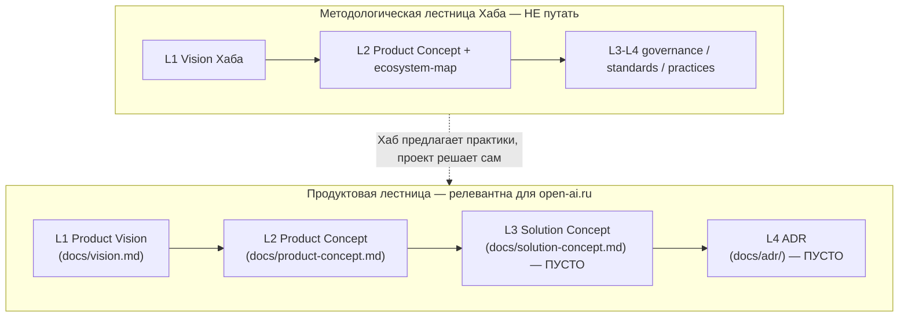
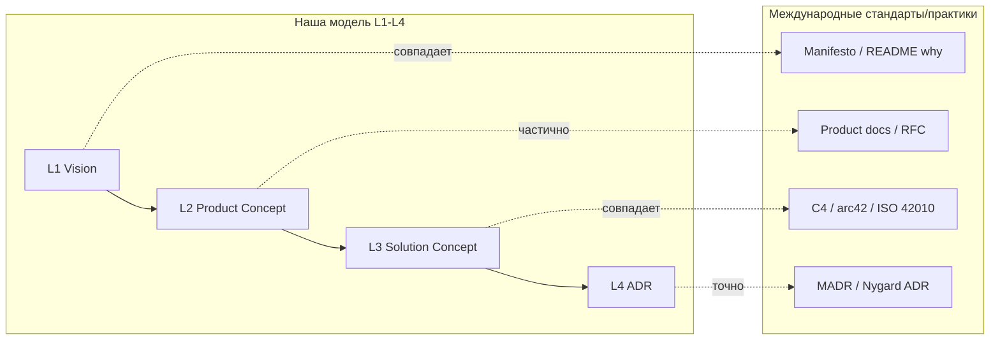
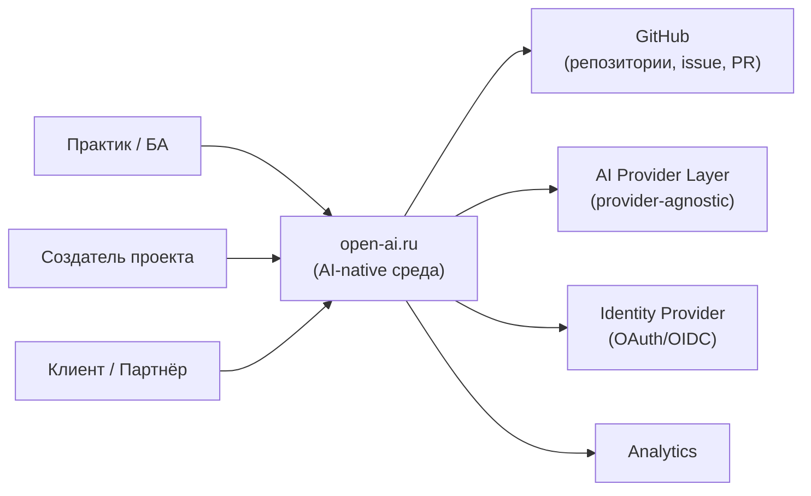
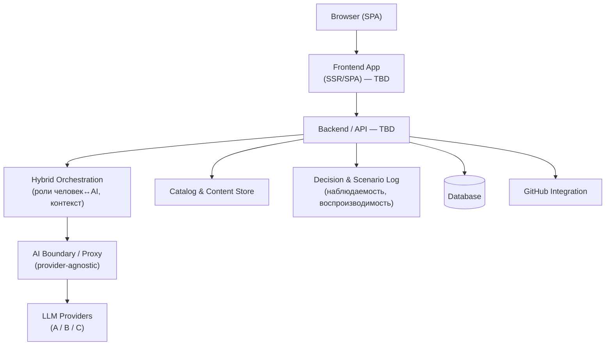
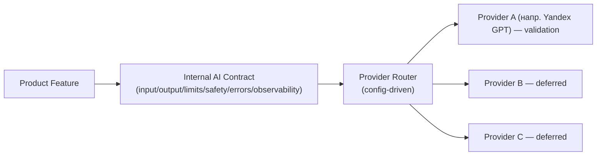
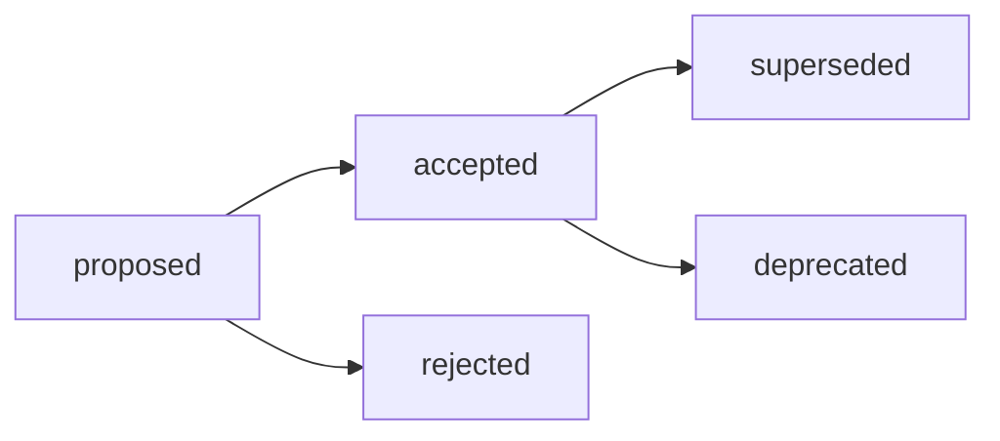
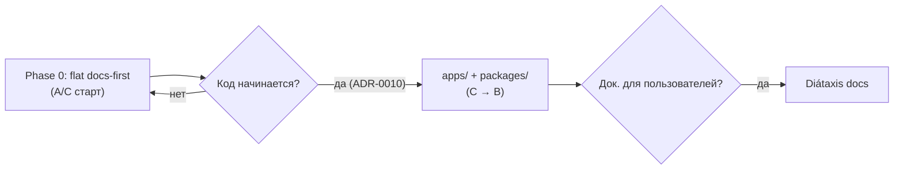
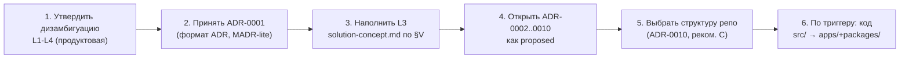

# Архитектура репозитория open-ai.ru и разработка уровней L3–L4 на основе международных практик

## Введение

### Контекст задачи

Issue #259 требует не реализации продуктового кода, а **исследовательского
отчёта** по архитектуре репозитория [open-ai.ru](https://github.com/G-Ivan-A/open-ai.ru)
и детальной разработке уровней **L3–L4** специально для этого проекта. Задача
объявлена независимой от исследования архитектуры Хаба (issue #257) и может
выполняться параллельно; пересечение по теме L1–L4 учтено через ссылку на уже
существующий отчёт
[`research/hub/2026-06-20-ecosystem-architecture-research.md`](../hub/2026-06-20-ecosystem-architecture-research.md).

open-ai.ru — это **production-портал** экосистемы Hybrid Intelligence Lab:
AI-native рабочая среда для гибридных (human + AI) команд. На момент
исследования проект находится в фазе **Phase 0 «Planning & Vision»**: оформлены
Vision (L1) и Product Concept (L2), а Solution Concept (L3) и ADR (L4) — пустые
placeholders. Значит, задача попадает точно в разрыв между «что строим» и «как
строим».

### Метод

Исследование собрано из четырёх типов источников:

1. **Внутренние стандарты Хаба** по продуктовым уровням: `product-profile.md`,
   `webportal-product-concept-standard.md`, `webportal-solution-concept-standard.md`,
   `project-structure-inheritance.md`, `research-profile.md`, `docs/ecosystem-map.md`.
2. **Артефакты самого репозитория open-ai.ru** (прочитаны через GitHub API):
   `README.md`, `AI_GOVERNANCE.md`, `docs/vision.md`, `docs/product-concept.md`,
   `docs/solution-concept.md` (placeholder), дерево каталогов, `governance/rfc/`,
   `team/`.
3. **Международные проекты** с публичными репозиториями: Supabase, Next.js
   (Vercel), Ghost, Directus, Appwrite, Strapi, Backstage, Cal.com. Их
   **верхнеуровневая структура каталогов проверена напрямую** через GitHub API
   (`git/trees/HEAD`) на 2026-06-20 — это фактическая, а не пересказанная база
   сравнения.
4. **Международные стандарты архитектуры**: C4 model, arc42, TM Forum ODA,
   ITIL 4, ISO/IEC/IEEE 42010 (architecture description), MADR/Nygard ADR,
   CNCF Platform Engineering Maturity Model, Diátaxis (документация).

Метод — **сравнительный анализ** (comparative-analysis): для каждого решения
показаны альтернативы и trade-offs, выводы привязаны к источнику или явно
отмечены как допущение.

### Ограничения источников (честная фиксация)

- **Структура репозиториев проверена, внутренняя «лестница уровней» — нет.**
  Большинство международных проектов **не используют явную нотацию L1–L4**.
  Соответствие их артефактов нашим уровням — это **интерпретация автора**, а не
  их собственная модель. Везде, где проводится такое отображение, оно помечено
  как аналитическое сопоставление.
- **Финансовые показатели — порядковые оценки.** Цифры оборота (≤$500M/год)
  взяты из публичных оценок и пресс-сообщений и приведены как **индикативные**,
  не как аудированные данные. Для целей исследования важно лишь, что все
  выбранные проекты находятся в нише «успешный продукт ≤ $500M», а не
  гиперскейлер уровня Google/Microsoft.
- **Архитектура L3–L4 для open-ai.ru — это предложение Creative-режима, а не
  утверждённое решение.** Финальные технические развилки (стек, хостинг)
  принимает Founder через ADR. Отчёт даёт **каркас и кандидатов**, а не готовый
  выбор стека.
- Задача запрещает создавать файлы в репозитории open-ai.ru — отчёт это
  соблюдает: всё живёт на стороне Хаба в `research/open-ai-ru/`.

---

## Executive Summary

**1. Стандарты Хаба по L1–L4 подтверждаются как база для open-ai.ru — с одной
важной оговоркой.** В экосистеме сосуществуют **две разные лестницы L1–L4**, и
их смешение — главный риск задачи (детально в §1.1):

- **Продуктовая лестница** (для spoke-проекта): L1 Product Vision → L2 Product
  Concept → L3 Solution Concept → L4 ADR. Это та лестница, по которой строится
  open-ai.ru, и именно она зафиксирована в `webportal-*-standard.md`.
- **Методологическая лестница Хаба** (`docs/ecosystem-map.md`): Framework-слой
  (L1–L2) и Methodology-слой (L3–L4 = governance/standards/practices). Это про
  знание Хаба, а не про продукт.

Для open-ai.ru релевантна **только продуктовая лестница**. Рекомендация:
зафиксировать это явно, чтобы L3/L4 open-ai.ru не путали с L3/L4 Хаба.

**2. Репозиторий open-ai.ru здоров для своей фазы, но имеет дыру ровно по теме
задачи.** L1 и L2 проработаны качественно (Vision и Product Concept —
содержательные документы с RFC-обоснованием). L3 (`docs/solution-concept.md`) —
заглушка «🚧 В разработке», L4 (`docs/adr/`) — пустой каталог с `.gitkeep`.
Продуктового кода нет (`src/.gitkeep`), что **корректно** для Phase 0
(Anti-Inflation principle).

**3. Международные практики дают сходящийся паттерн.** Восемь проверенных
репозиториев показывают устойчивую структуру: `docs/` (часто Diátaxis-подобная),
выделенный `adr/` или `docs/adr/`, монорепо `packages/` + `apps/`, отдельные
`examples/`, `tests/`, `.github/`. Явной нотации «L1–L4» нет ни у кого — вместо
неё **слои выражены расположением артефактов**: vision/RFC → docs → ADR → код.
Наша модель L1–L4 — это, по сути, формализация того, что зрелые проекты делают
неявно. Это аргумент **в пользу** нашей модели, а не против.

**4. L3 для open-ai.ru предлагается строить по стандарту
`webportal-solution-concept-standard.md`**, наполнив его двенадцатью разделами
(C4, стек, интеграции, данные, NFR, deployment, provider-agnostic AI boundary,
риски, ADR-кандидаты). Ключевые архитектурные оси open-ai.ru: provider-agnostic
AI-слой, наблюдаемость гибридной работы (observability of human↔AI), GitHub-как-
бэкенд для прозрачности, и разделение «каталог сценариев / рабочее пространство /
коммуникация» из L2.

**5. L4 для open-ai.ru предлагается вести в формате MADR-lite** в `docs/adr/`,
с явным жизненным циклом статусов (proposed → accepted → superseded) и стартовым
набором из ~10 ADR-кандидатов, вытекающих из L3.

**6. Структура репозитория: рекомендуется «documentation-first hybrid»** —
эволюция текущей плоской структуры, а не прыжок в монорепо. Монорепо
(`packages/`+`apps/`) предлагается как **отложенное** решение, активируемое
триггером (появление второго деплоя/пакета), а не «на вырост». Это согласуется с
Anti-Inflation principle Хаба и с тем, как Ghost/Cal.com стартовали до монорепо.

Все рекомендации даны с альтернативами и trade-offs; ни одна не предлагается как
единственно верная.

---

# Часть I. Инвентаризация стандартов Хаба по L1–L4

## 1.1. Две лестницы L1–L4 (ключевая дизамбигуация)

Самое важное наблюдение исследования: **в экосистеме слово «L1–L4» означает две
разные вещи**, и задача #259 находится на их стыке.

| Лестница | Где определена | L1 | L2 | L3 | L4 | Про что |
| --- | --- | --- | --- | --- | --- | --- |
| **Продуктовая** | `webportal-product-concept-standard.md`, `webportal-solution-concept-standard.md`, `product-profile.md` | Product Vision (зачем/для кого) | Product Concept (что/функции) | Solution Concept (как реализуем) | ADR (конкретные решения) | Жизненный цикл **продукта/спока** |
| **Методологическая Хаба** | `docs/ecosystem-map.md`, `docs/vision.md` | Vision Хаба | Product Concept Хаба + ecosystem-map | governance/standards/practices | (внутри methodology-слоя) | Жизненный цикл **знания Хаба** |



**Вывод и рекомендация.** Issue #259 говорит «разработать L3–L4 для open-ai.ru».
Это про **продуктовую лестницу**. Методологическая лестница Хаба — это контекст
наследования (governance, frontmatter, file-naming), но не «уровни open-ai.ru».
Рекомендуется зафиксировать дизамбигуацию прямо в L3-документе open-ai.ru
(одной врезкой), чтобы будущие исполнители и AI-агенты не смешивали два смысла.
Это пример «пробела в стандартах», который задача просила инициативно выявить.

## 1.2. Реестр релевантных стандартов Хаба

| Стандарт | Уровень | Что фиксирует | Статус | Применимость к open-ai.ru |
| --- | --- | --- | --- | --- |
| [`product-profile.md`](../../standards/product-profile.md) | мета (L1–L4) | Обязательные/рекомендуемые артефакты продуктового спока, lifecycle, где живёт `PRODUCT_VISION.md` | canonical | Высокая — open-ai.ru есть рыночный продукт |
| [`webportal-product-concept-standard.md`](../../standards/webportal-product-concept-standard.md) | L2 | Структура Product Concept: personas, JTBD, MVP scope, user flows, метрики | draft | Уже применён (docs/product-concept.md) |
| [`webportal-solution-concept-standard.md`](../../standards/webportal-solution-concept-standard.md) | L3 | Структура Solution Concept: C4, стек, интеграции, данные, NFR, deployment, provider-agnostic AI, риски | draft | **Прямая база для L3 open-ai.ru** |
| [`templates/webportal-solution-concept-template.md`](../../templates/webportal-solution-concept-template.md) | L3 | Заполняемый шаблон Solution Concept | — | Прямой шаблон для L3 |
| [`project-structure-inheritance.md`](../../standards/project-structure-inheritance.md) | мета | Правила наследования каталогов проектами без жёстких зависимостей | canonical | Высокая — основа предложения структуры репо |
| `research-profile.md` | мета | Где и как живут исследования (этот отчёт) | canonical | Применён здесь |
| [`docs/ecosystem-map.md`](../../docs/ecosystem-map.md) | методология | Связь L1–L4, принцип Need-to-Know, импорт практик | canonical | Контекст наследования |
| [`frontmatter-standard.md`](../../standards/frontmatter-standard.md), [`file-naming.md`](../../standards/file-naming.md) | мета | Метаданные и именование | canonical | Наследуются как есть |

**Главный факт:** уровень L3 для веб-порталов в Хабе **уже стандартизован** —
есть и стандарт, и шаблон. Значит, «разработка L3 для open-ai.ru» — это не
изобретение структуры, а **наполнение готового каркаса предметной спецификой**
open-ai.ru. Уровень L4 (ADR) описан тоньше: стандарт ссылается на «ADR» как
формат, но отдельного ADR-стандарта Хаба нет — это второй выявленный пробел
(детально в §6).

## 1.3. Что open-ai.ru наследует от Хаба

Из `open-ai-ru-context-Summary.md` и `AI_GOVERNANCE.md` репозитория:

- **Геном управления:** `AI_GOVERNANCE.md` (human-in-control, provider-agnostic,
  scope-first, traceability, minimal structure, flagship-first).
- **Frontmatter и file-naming** Хаба.
- **Модель hub-and-spoke** (`governance/repo-model.md` Хаба).
- **Жизненный цикл знаний** для входящих идей.
- **Anti-Inflation principle** — не вводить инфраструктуру «на вырост».

Не наследуется (специфика продукта): C4-архитектура, стек, схема данных, NFR,
deployment, release lifecycle с версиями — это всё L3/L4 самого open-ai.ru.

---

# Часть II. Аудит репозитория open-ai.ru

## 2.1. Текущая структура (проверено через GitHub API, 2026-06-20)

```text
open-ai.ru/
├── README.md                 # точка входа, Phase 0
├── AI_GOVERNANCE.md          # операционный контракт ИИ
├── AI_HANDOVER_PROMPT.md     # передача сессии
├── AI_QUICK_RULES.md         # быстрые правила
├── LICENSE
├── docs/
│   ├── vision.md             # L1 — Product Vision (содержателен)
│   ├── product-concept.md    # L2 — Product Concept (содержателен)
│   ├── solution-concept.md   # L3 — 🚧 ЗАГЛУШКА
│   └── adr/.gitkeep          # L4 — ПУСТО
├── governance/
│   └── rfc/portal-vision-concept-proposal-2026-06.md
├── team/
│   ├── operating-model.md
│   ├── roles-and-structure.md
│   ├── task-modes.md
│   └── task-template.md
└── src/.gitkeep              # кода нет (корректно для Phase 0)
```

## 2.2. Состояние уровней L1–L4

| Уровень | Артефакт | Состояние | Оценка |
| --- | --- | --- | --- |
| L1 | `docs/vision.md` | Заполнен: Vision, Mission, Core Innovation, Validation Principle, Target Groups, Value Prop, Business Model | ✅ Зрелый для Phase 0 |
| L2 | `docs/product-concept.md` | Заполнен: 3 функции с приоритетами, функциональная архитектура, personas, JTBD | ✅ Зрелый для Phase 0 |
| L3 | `docs/solution-concept.md` | «🚧 В разработке — будет заполнено в следующей задаче» | ❌ **Дыра — цель задачи** |
| L4 | `docs/adr/` | Пустой каталог (`.gitkeep`) | ❌ **Дыра — цель задачи** |

## 2.3. Связь с экосистемой

open-ai.ru — **spoke-репозиторий** в hub-and-spoke модели. Из `docs/vision.md`
его два флагмана:

- **БА-автоматизация (Mango)** — операционная валидация (workflows, оркестрация).
- **Репутационный инжиниринг** — витринная валидация (подача, обучение,
  путь open-source → custom).

Это важно для L3: архитектура должна поддержать **оба режима** одним движком
(«рабочее пространство человек↔AI» + «витрина/каталог»), а не строить две
системы.

## 2.4. Выявленные сильные стороны и риски репозитория

**Сильные стороны:**
- Дисциплина уровней: L1/L2 не залезают в стек (явно сказано «архитектура
  вынесена на L3/L4»). Это редкая зрелость для ранней стадии.
- Provider-agnostic зафиксирован уже на уровне governance, не только L3.
- Минимализм: нет преждевременной инфраструктуры.

**Риски (для L3):**
- `solution-concept.md` как один файл может вырасти до 50 страниц и стать
  нечитаемым — нужно решить заранее, один файл или папка `docs/solution/`.
- ADR-процесс не описан — без него L4 рискует не появиться вовсе.
- Нет `docs/ecosystem-context.md` / `.hub-ecosystem.json` (Need-to-Know из
  ecosystem-map Хаба) — частичный граф связей не зафиксирован.

---

# Часть III. Международные практики построения репозиториев

## 3.1. Выборка проектов (оборот ≤ $500M/год, оценки)

Восемь open-source проектов с production-порталами/платформами. Финансовые
оценки — индикативные, из публичных источников; см. ограничения во введении.

| Проект | Ниша | Оборот (порядковая оценка) | Почему релевантен |
| --- | --- | --- | --- |
| **Supabase** | BaaS (Firebase alt.) | ~$100M ARR | AI-native экосистема, монорепо + docs-портал |
| **Vercel / Next.js** | Frontend cloud + framework | ~$200M ARR | Эталон веб-портала и DX, монорепо |
| **Ghost** | Publishing/CMS | ~$8–10M (foundation) | Production-портал, выделенный `adr/`, не-VC |
| **Directus** | Headless CMS/Data platform | < $50M | Монорепо `api`+`app`+`packages`, data-centric |
| **Appwrite** | BaaS | < $50M | `docs/`, `src/`, `app/`, чёткая граница ядра |
| **Strapi** | Headless CMS | ~$30–50M | Монорепо, `docs/`, `examples/`, `templates/` |
| **Backstage** (Spotify) | Developer portal | open-source (внутри Spotify) | Эталон «портала» и плагинной архитектуры |
| **Cal.com** | Scheduling SaaS | < $50M | Open-source SaaS, монорепо apps+packages |

## 3.2. Фактические верхнеуровневые структуры (проверено через GitHub API)

| Проект | Ключевые верхнеуровневые каталоги | ADR | Docs | Монорепо |
| --- | --- | --- | --- | --- |
| Supabase | `apps/ packages/ docker/ examples/ e2e/ scripts/ i18n/ supabase/` | в docs | портал (`apps/docs`) | ✅ apps+packages |
| Next.js | `packages/ docs/ examples/ test/ bench/ errors/ scripts/ crates/` | RFC-репо отдельно | `docs/` | ✅ packages |
| Ghost | `ghost/ apps/ docs/ adr/ e2e/ docker/ scripts/` | **`adr/` (top-level)** | `docs/` | ✅ + явный `adr/` |
| Directus | `api/ app/ packages/ sdk/ docs/ tests/` | в docs | `docs/` | ✅ api+app+packages |
| Appwrite | `src/ app/ docs/ public/ dev/ tests/` | в docs | `docs/` | частично |
| Strapi | `packages/ docs/ examples/ templates/ scripts/ tests/` | в docs | `docs/` | ✅ packages |
| Backstage | `packages/ plugins/ docs/ microsite/ contrib/` | `docs/architecture-decisions/` | `docs/` | ✅ packages+plugins |
| Cal.com | `apps/ packages/ tests/ docs/` | в docs | `docs/` | ✅ apps+packages |

> Примечание: почти все проекты содержат служебные каталоги AI-агентов (`.claude`,
> `.cursor`, `.agents`, `.codex`) — это новый отраслевой паттерн 2025–2026:
> репозиторий несёт инструкции для AI-агентов наравне с CI-конфигом. Для
> open-ai.ru это прямой сигнал: `AI_GOVERNANCE.md` / `AI_QUICK_RULES.md` в корне
> — соответствуют тренду.

## 3.3. Выявленные паттерны (best practices)

1. **Docs-as-code в `docs/`.** Документация живёт рядом с кодом, версионируется,
   часто построена по **Diátaxis** (tutorials / how-to / reference / explanation).
2. **Выделенный ADR-каталог.** Ghost (`adr/`), Backstage
   (`docs/architecture-decisions/`) — ADR как первоклассный артефакт, а не
   разрозненные заметки. Подтверждает нашу L4.
3. **Монорепо `packages/` + `apps/`.** Разделение переиспользуемых пакетов и
   деплой-целей (Supabase, Next.js, Directus, Cal.com, Backstage).
4. **`examples/` как онбординг.** Готовые примеры использования — канал adoption.
5. **Чёткое ядро.** `ghost/`, `api/`+`app/`, `src/` — ядро отделено от
   периферии (docs, examples, scripts).
6. **`.github/` как контракт CI/CD.** Workflows, issue/PR templates, CODEOWNERS.
7. **AI-агентские инструкции в корне** — новый паттерн (см. примечание выше).

## 3.4. Anti-patterns (чего избегают)

| Anti-pattern | Симптом | Как избегают зрелые проекты |
| --- | --- | --- |
| **Premature monorepo** | `packages/` с одним пакетом «на вырост» | Стартуют плоско, дробят по триггеру (Ghost годами был не-монорепо) |
| **Docs-свалка** | один гигантский README/`docs.md` | Diátaxis-разбиение по типу задачи читателя |
| **ADR-вакуум** | решения только в PR-тредах, теряются | Выделенный `adr/`, нумерация, статусы |
| **Vendor lock-in в ядре** | SDK провайдера в бизнес-логике | Абстрактный слой/адаптеры |
| **Структура без владельцев** | каталоги без CODEOWNERS/README | README в каждом значимом каталоге |
| **Mixing levels** | стек-решения в vision-документе | Явное разделение «что» (L1/L2) и «как» (L3/L4) |

---

# Часть IV. Сравнение наших L1–L4 с международными практиками

## 4.1. Сопоставление (наша модель vs неявные слои зрелых проектов)

| Наш уровень | Наш артефакт | Аналог в международных проектах | Совпадение | Комментарий |
| --- | --- | --- | --- | --- |
| **L1 Vision** | `docs/vision.md` | `README`/`VISION`/манифест, blog «why» | Высокое | Все имеют «зачем», но реже формализуют как отдельный уровень |
| **L2 Product Concept** | `docs/product-concept.md` | Product docs, roadmap, RFC | Среднее | У многих размыто между docs и RFC |
| **L3 Solution Concept** | `docs/solution-concept.md` | `docs/architecture`, arc42/C4 docs, DESIGN.md | Высокое | C4/arc42 — прямой международный аналог |
| **L4 ADR** | `docs/adr/` | `adr/`, `docs/architecture-decisions/` (MADR) | **Точное** | ADR — устоявшийся международный стандарт |

**Главный вывод сравнения:** наша лестница L1–L4 — это **явная формализация
того, что зрелые проекты делают неявно**. L3↔C4/arc42 и L4↔ADR совпадают почти
дословно с международными стандартами (ISO/IEC/IEEE 42010, MADR, Nygard).
Слабее всего формализован L2 — но и у них он размыт. Это **подтверждает**
стандарты Хаба как базу, а не опровергает их.

## 4.2. Что можно улучшить в наших стандартах (на основе сравнения)

| Наблюдение из практик | Чего не хватает у нас | Рекомендация |
| --- | --- | --- |
| Все ведут ADR явно (Ghost, Backstage) | Нет отдельного ADR-стандарта Хаба | Создать `standards/adr-standard.md` (MADR-lite) — см. §6 |
| Diátaxis для docs | `webportal-solution-concept` не описывает, когда L3 дробится на папку | Добавить правило «1 файл до N стр., затем `docs/solution/`» |
| `examples/` как adoption | Не упомянут в product-profile | Рекомендовать `examples/` для production-споков |
| Ecosystem-context в проекте | open-ai.ru не имеет `.hub-ecosystem.json` | Применить Need-to-Know из ecosystem-map |

## 4.3. Диаграмма соответствия уровней



---

# Часть V. Детализация уровня L3 (Solution Concept) для open-ai.ru

L3 наполняется по `webportal-solution-concept-standard.md` (12 разделов). Ниже —
предметный каркас, привязанный к Vision/Product Concept open-ai.ru. Это
**кандидат на содержание `docs/solution-concept.md`**, который Founder утверждает
через ADR; конкретные технологии помечены `TBD/proposed`.

## 5.1. Границы и контракт L2 → L3

L3 обязан трассироваться к L2. Контракт входа из L2 (`product-concept.md`):

| Из L2 (что) | В L3 (как реализуем) |
| --- | --- |
| Функция 1 — Интерфейс (каталог + рабочее пространство + отладка) | Frontend SPA/SSR + API; каталог как контент-модель; рабочее пространство как сессия диалога с AI |
| Функция 2 — Практика (координация, наблюдаемость, воспроизводимость) | Слой оркестрации + event log решений «человек/AI» + хранилище истории сценариев |
| Функция 3 — Коммуникация (4 аудитории) | Публичная витрина + профили проектов + обратная связь |
| Provider-agnostic (принцип L1/L2) | Внутренний AI-контракт + provider router (см. §5.5) |

## 5.2. C4: Context Diagram (open-ai.ru)



## 5.3. C4: Container Diagram (предложение, статусы proposed)



Для каждого контейнера в финальном L3 указываются: назначение, владелец, runtime,
интерфейсы, читаемые/изменяемые данные, критичные ограничения (по стандарту).

## 5.4. Архитектурные оси, специфичные для open-ai.ru

1. **Наблюдаемость гибридной работы как first-class.** «Где решил человек, где
   AI, как проверено» из L2 — это не лог общего назначения, а доменная сущность
   `Decision/Scenario`. Архитектурно: event-sourced или append-only лог решений,
   привязанный к сценарию и пользователю.
2. **Воспроизводимость сценариев.** История «почему так решили» + статистика по
   классификациям — требует версионирования промптов/контекста.
3. **GitHub как источник прозрачности.** Vision говорит «видно, как рождается
   результат» — естественный бэкенд: репозитории/issue/PR. Интеграция с GitHub
   API — отдельный контейнер и ADR-кандидат.
4. **Двойной режим (операционный + витринный).** Один движок обслуживает и
   «рабочее пространство», и «витрину» — общая контент/каталог-модель.

## 5.5. Provider-agnostic AI boundary (обязателен по стандарту)



Правила (из стандарта L3): продуктовый код зависит от внутреннего контракта, не
от SDK вендора; выбор провайдера — конфигурация; добавление второго провайдера
не переписывает user flows; промпты/ключи/квоты изолированы за границей.

## 5.6. Скелет разделов L3 (готов к наполнению)

| # | Раздел | Статус готовности для open-ai.ru |
| --- | --- | --- |
| 1 | Summary | каркас есть (этот отчёт) |
| 2 | Product Inputs from L2 | §5.1 — готово |
| 3 | System Architecture (C4) | §5.2–5.3 — Context/Container предложены |
| 4 | Technology Stack | TBD (ADR-кандидаты, §6) |
| 5 | Integration Points | GitHub, AI layer, Auth, Analytics — каркас §5.2 |
| 6 | Data Model | сущности: User, Scenario, Decision, ContentItem, AIRequest, Project |
| 7 | NFR | производительность, доступность, безопасность, приватность, accessibility (WCAG 2.2 AA) |
| 8 | Deployment | environments, CI/CD, rollback, secrets — TBD |
| 9 | Provider-Agnostic AI | §5.5 — готово |
| 10 | Risks & Mitigations | §VIII + lock-in, scale, наблюдаемость |
| 11 | ADR Candidates | §6.3 |
| 12 | Open Technical Questions | §X |

## 5.7. Минимальная модель данных (предложение)

| Сущность | Назначение | Хранение | Чувствительность |
| --- | --- | --- | --- |
| User | Идентичность и доступ | DB | персональные данные |
| Project | Проект экосистемы (витрина) | DB + GitHub | публичные/внутренние |
| Scenario | Повторяемый рабочий сценарий человек↔AI | DB | смешанная |
| Decision | Событие решения (кто: человек/AI, почему) | append-only log | может содержать контекст |
| ContentItem | Контент каталога/витрины | Content store | публичные |
| AIRequest | Метаданные запроса к AI | logs/DB (ограниченно) | может содержать чувствительный контекст |

---

# Часть VI. Детализация уровня L4 (ADR) для open-ai.ru

## 6.1. Пробел и предложение

У Хаба нет отдельного ADR-стандарта (стандарт L3 лишь ссылается на «ADR»). Это
второй выявленный пробел. Рекомендуется принять **MADR-lite** (Markdown
Architectural Decision Records) — международно признанный формат, совместимый с
практикой Ghost/Backstage.

## 6.2. Предлагаемый формат ADR (MADR-lite)

```markdown
# ADR-NNNN: <краткое решение>

- Status: proposed | accepted | superseded by ADR-XXXX | deprecated | rejected
- Date: YYYY-MM-DD
- Deciders: Founder, <роли>
- Level: L4 (trace to L3 §<раздел>)

## Context
<какая сила/проблема требует решения; ссылка на L3>

## Decision
<что решили>

## Alternatives Considered
| Вариант | Плюсы | Минусы |

## Consequences
<последствия: положительные, отрицательные, риски>

## Trace
- L3 раздел: ...
- Связанные ADR: ...
```

**Жизненный цикл статусов:**



Размещение: `docs/adr/NNNN-kebab-title.md`, нумерация сквозная, индекс в
`docs/adr/README.md`.

## 6.3. Стартовый набор ADR-кандидатов для open-ai.ru

Выведены прямо из L3-каркаса; статусы — `proposed`:

| ADR | Решение | Источник (L3) |
| --- | --- | --- |
| ADR-0001 | Формат и процесс ADR (этот формат) | §6 |
| ADR-0002 | Frontend framework (SSR vs SPA) | §5.3 / стек |
| ADR-0003 | Backend framework и API-стиль (REST/GraphQL) | §5.3 / стек |
| ADR-0004 | Хранилище: модель данных и СУБД | §5.7 |
| ADR-0005 | Дизайн provider-agnostic AI boundary | §5.5 |
| ADR-0006 | Наблюдаемость гибридной работы: event log решений | §5.4 |
| ADR-0007 | Интеграция с GitHub как бэкендом прозрачности | §5.4 |
| ADR-0008 | Identity/Auth (OAuth/OIDC провайдер) | §5.2 |
| ADR-0009 | Deployment: environments, CI/CD, rollback, secrets | §5.6 |
| ADR-0010 | Структура репозитория (плоская vs монорепо) | Часть VII |

## 6.4. Контракт L3 → L4

L3 **порождает кандидатов** (раздел 11 стандарта), L4 **фиксирует выбор** с
альтернативами и последствиями. Обратная связь: принятый ADR обновляет статус
соответствующей строки stack matrix в L3 (`proposed` → `accepted`).

---

# Часть VII. Предложение структуры репозитория open-ai.ru

Соблюдается `project-structure-inheritance.md` (наследование без жёстких
зависимостей) и Anti-Inflation principle. Ниже — три альтернативы с trade-offs.

## 7.1. Альтернатива A — «Documentation-first flat» (эволюция текущей)

```text
open-ai.ru/
├── README.md  AI_GOVERNANCE.md  AI_QUICK_RULES.md  LICENSE
├── docs/
│   ├── vision.md  product-concept.md  solution-concept.md
│   ├── adr/  (README.md + NNNN-*.md)
│   ├── ecosystem-context.md          # NEW (Need-to-Know)
│   └── .hub-ecosystem.json           # NEW (машиночитаемый частичный граф)
├── governance/rfc/
├── team/
├── examples/                          # NEW (по триггеру adoption)
└── src/.gitkeep
```

| Плюсы | Минусы |
| --- | --- |
| Минимум изменений, соответствует Anti-Inflation | Не готова к нескольким деплой-целям |
| Низкий когнитивный overhead для Phase 0 | `solution-concept.md` может разрастись |
| Совпадает с тем, как Ghost жил до монорепо | Рефакторинг при появлении кода |

## 7.2. Альтернатива B — «Монорепо сразу» (Supabase/Cal.com-style)

```text
open-ai.ru/
├── apps/{web, api, docs}
├── packages/{ai-boundary, ui, shared, config}
├── docs/  governance/  team/  examples/  e2e/
└── .github/
```

| Плюсы | Минусы |
| --- | --- |
| Готова к масштабу, чёткие границы пакетов | Преждевременно для Phase 0 (нет кода) |
| Соответствует эталонам (Supabase, Next.js) | Высокий overhead, нарушает Anti-Inflation |
| Переиспользуемый `ai-boundary` как пакет | Пустые каталоги «на вырост» |

## 7.3. Альтернатива C — «Documentation-first hybrid» (РЕКОМЕНДУЕТСЯ)

Старт как A, с **заранее зафиксированным триггером** перехода к B. Когда L3
утверждён и начинается код — `src/` заменяется на `apps/`+`packages/` одним
ADR-решением (ADR-0010), без переписывания docs.

```text
open-ai.ru/
├── README.md  AI_GOVERNANCE.md  AI_QUICK_RULES.md  LICENSE
├── docs/
│   ├── vision.md  product-concept.md
│   ├── solution-concept.md            # или solution/ если > N стр.
│   ├── adr/{README.md, NNNN-*.md}
│   ├── ecosystem-context.md  .hub-ecosystem.json
│   └── (Diátaxis: tutorials/ how-to/ reference/ explanation/ — по мере роста)
├── governance/rfc/
├── team/
├── examples/
├── .github/{workflows, ISSUE_TEMPLATE, CODEOWNERS}   # при первом коде
└── src/.gitkeep   →   apps/ + packages/  (по триггеру ADR-0010)
```

**Триггеры эволюции (явные, чтобы не расти «на вырост»):**

| Триггер | Действие |
| --- | --- |
| L3 утверждён, начинается код | `src/` → `apps/web` + `apps/api` |
| Появился переиспользуемый AI-слой | выделить `packages/ai-boundary` |
| `solution-concept.md` > ~40 стр. | разбить на `docs/solution/` |
| Появился CI | добавить `.github/workflows` + CODEOWNERS |
| Документация для пользователей | ввести Diátaxis-разделы |

## 7.4. Сравнительная таблица альтернатив

| Критерий | A (flat) | B (monorepo) | C (hybrid) |
| --- | --- | --- | --- |
| Соответствие Anti-Inflation | ✅ | ❌ | ✅ |
| Готовность к масштабу | ❌ | ✅ | ◐ (по триггеру) |
| Когнитивный overhead сейчас | низкий | высокий | низкий |
| Соответствие эталонам | ◐ | ✅ | ✅ (поэтапно) |
| Риск переделки | средний | низкий | низкий (триггеры заданы) |
| **Рекомендация для Phase 0** | приемлемо | нет | **да** |

## 7.5. Диаграмма рекомендуемой эволюции



---

# Часть VIII. Дополнительные исследования (инициатива)

Задача требовала инициативно углубиться в выявленные аспекты.

## 8.1. Безопасность production-портала

| Аспект | Рекомендация | Источник практики |
| --- | --- | --- |
| Секреты | вне VCS, ротация, владелец задокументирован | стандарт L3 §3.6 |
| AI safety | внутренний контракт содержит safety controls и error model | §5.5 |
| PII | минимизация, разграничение в data model | §5.7 |
| Клиент-бандл | нет секретов в клиенте, шифрование в транзите | NFR |
| Прозрачность vs приватность | публичность GitHub-бэкенда ≠ публичность данных пользователя | ADR-кандидат |

## 8.2. Scalability

Архитектурный триггер масштабирования документируется (NFR `Scalability`). Для
двойного режима (операционный + витринный) витрина кешируется/статична, рабочее
пространство — stateful; разделять пути масштабирования.

## 8.3. CI/CD

Применима cicd-практика Хаба (`research/cicd/2026-06-09-js-cicd-template-analysis.md`)
при появлении кода. Required checks → фиксируются в project contract; deploy from
main; tested rollback (стандарт L3 §3.6).

## 8.4. Нужны ли уровни L0 или L5?

| Уровень | За | Против | Вывод |
| --- | --- | --- | --- |
| **L0** (Ecosystem/Strategy над Vision) | Связь spoke ↔ Хаб | Уже покрыто ecosystem-map Хаба | **Не вводить** в open-ai.ru; жить ссылкой на Хаб |
| **L5** (Implementation/Code под ADR) | Явность кода | Код и так ниже ADR; плодит нотацию | **Не вводить**; код — это реализация L4-решений |

Рекомендация: **оставить L1–L4**. Введение L0/L5 нарушило бы Anti-Inflation без
доказанной потребности. Это пример инициативного «обосновать или отклонить».

---

# Часть IX. Roadmap реализации



| Шаг | Результат | Кто решает | Зависит от |
| --- | --- | --- | --- |
| 1 | Врезка-дизамбигуация в L3 | AI-агент (Creative) | — |
| 2 | `standards/adr-standard.md` (Хаб) + ADR-0001 (проект) | Founder | §6 |
| 3 | Заполненный `docs/solution-concept.md` | Founder review | §V, шаг 1–2 |
| 4 | ADR-0002…0010 в статусе proposed | Founder | шаг 3 |
| 5 | Решение по структуре (реком. C) | Founder | шаг 3–4 |
| 6 | Переход к коду по триггеру | Founder | шаг 5 |

---

# Часть X. Открытые вопросы (для Founder)

1. **Один файл L3 или папка `docs/solution/`?** Рекомендация: один файл до
   ~40 стр., затем разбить (триггер задан).
2. **GitHub как бэкенд** — насколько глубоко (issue/PR как сущности продукта или
   только витрина)? Влияет на ADR-0007.
3. **Первый AI-провайдер для валидации** (Yandex GPT упомянут в стандарте как
   пример) — это валидатор, не архитектурное ограничение; подтвердить.
4. **Создавать ли ADR-стандарт на уровне Хаба** (`standards/adr-standard.md`) —
   или вести ADR-формат локально в open-ai.ru? Рекомендация: вынести в Хаб
   (переиспользуемо другими споками).
5. **Нужен ли `examples/` уже сейчас** или по триггеру adoption? Рекомендация:
   по триггеру.

---

# Часть XI. Соответствие Definition of Done (issue #259)

| Критерий DoD | Где закрыт |
| --- | --- |
| Изучены стандарты Хаба по L1–L4 | Часть I (§1.1–1.3) |
| Изучена концепция open-ai.ru | Часть II (§2.1–2.3), Введение |
| Проанализирована структура репо open-ai.ru | Часть II (§2.1) |
| 5–10 международных проектов (≤$500M) | Часть III (8 проектов) |
| Изучена их структура репозиториев | §3.2 (проверено через API) |
| Как они определяют уровни | §3.3, Часть IV |
| Сравнительная таблица наши L1–L4 vs практики | §4.1, §4.3 |
| Подтверждены/уточнены стандарты Хаба как база | §4.1–4.2, Executive Summary |
| Разработаны L3–L4 для open-ai.ru | Части V и VI |
| Границы между уровнями | §5.1, §6.4, §1.1 |
| Контракты между уровнями | §5.1 (L2→L3), §6.4 (L3→L4) |
| Предложена структура репозитория | Часть VII (3 альтернативы) |
| Диаграммы архитектуры | §1.1, 4.3, 5.2, 5.3, 5.5, 6.2, 7.5, IX (Mermaid) |
| Инициированы доп. исследования | Часть VIII (security/scale/CI-CD/L0-L5) |
| Trade-offs каждого подхода | §7.1–7.4, §8.4, везде |
| Roadmap реализации | Часть IX |
| Итоговый отчёт 20–30 стр. | этот документ |

---

# Источники

**Внутренние (Хаб):**
- `standards/product-profile.md`, `standards/webportal-product-concept-standard.md`,
  `standards/webportal-solution-concept-standard.md`,
  `standards/project-structure-inheritance.md`, `standards/research-profile.md`
- `docs/ecosystem-map.md`, `docs/project-summaries/open-ai-ru-context-Summary.md`
- `templates/webportal-solution-concept-template.md`
- `research/hub/2026-06-20-ecosystem-architecture-research.md` (issue #257)

**Репозиторий open-ai.ru** (через GitHub API, 2026-06-20):
- `README.md`, `AI_GOVERNANCE.md`, `docs/vision.md`, `docs/product-concept.md`,
  `docs/solution-concept.md`, дерево каталогов, `governance/rfc/`, `team/`

**Международные проекты** (top-level дерево проверено через GitHub API, 2026-06-20):
- Supabase, Next.js/Vercel, Ghost, Directus, Appwrite, Strapi, Backstage, Cal.com

**Международные стандарты/методологии:**
- C4 model (Simon Brown); arc42; ISO/IEC/IEEE 42010 (architecture description)
- MADR (Markdown ADR); ADR — Michael Nygard
- Diátaxis (документация); TM Forum ODA; ITIL 4
- CNCF Platform Engineering Maturity Model

> Ограничения: финансовые показатели — порядковые публичные оценки; отображение
> «артефакт проекта ↔ наш уровень L1–L4» — аналитическая интерпретация автора,
> т.к. перечисленные проекты не используют явную нотацию L1–L4 (см. Введение).
