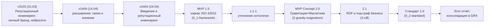
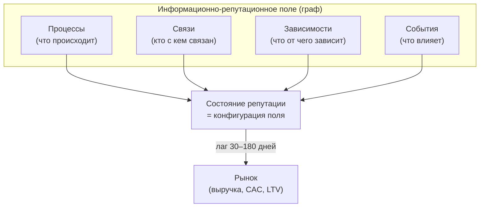
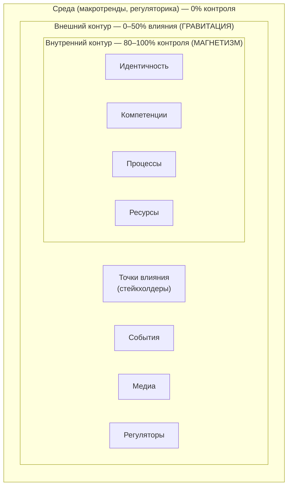
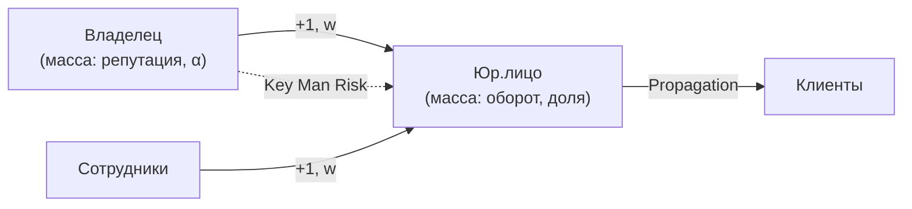
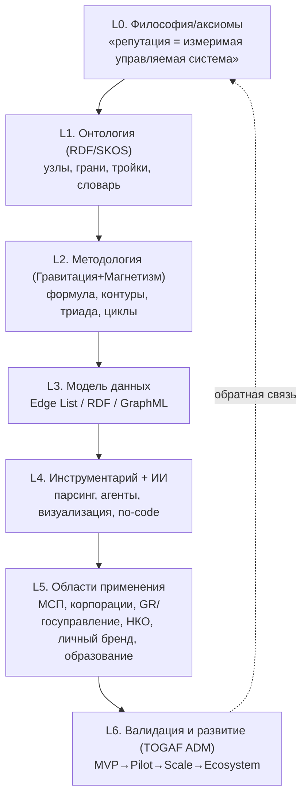
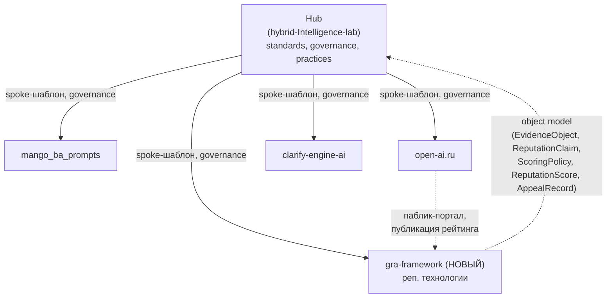
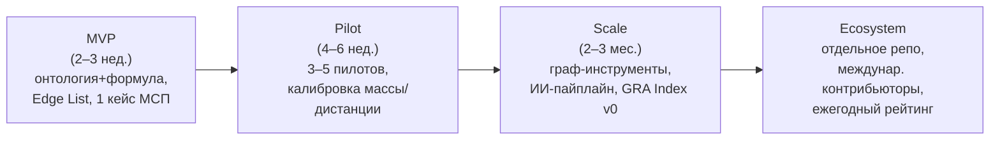

# Репутационные технологии: от видения фаундера к международному стандарту GRA

> Исследовательский отчёт в режиме **Creative** (максимальное погружение, инициатива исследований).
> Независимый исследователь репутационных технологий + стандартизатор.
> Это **исследовательский отчёт**, а не реализация фреймворка: артефакты фреймворка
> (код, отдельный репозиторий) здесь только **проектируются и рекомендуются**, но не создаются
> (см. ограничение issue #260: «не создавать файлы фреймворка в этом репозитории»).

Этот документ выделяет **видение фаундера** (Иван Гулиенко) из трёх групп прикреплённых
материалов, очищает его от образовательной обёртки, формализует как базу фреймворка,
сравнивает с **15 международными проектами**, проектирует **фреймворк GRA** и его
**международный стандарт**, и предлагает **архитектуру отдельного репозитория** в экосистеме
Hub. Спутниковые документы — стандарт (EN), white paper (EN), executive summary (RU+EN) и
терминологический словарь (RU↔EN) — вынесены в отдельные файлы этого же домена и связаны ссылками.

Навигация по домену — в [README.md](README.md). Сводка для руководителей —
в [executive summary](2026-06-20-executive-summary.ru-en.md). Полный словарь терминов —
в [glossary](2026-06-20-glossary.ru-en.md).

## Введение

### Причина

Issue [#260](https://github.com/G-Ivan-A/hybrid-Intelligence-lab/issues/260) ставит задачу
сформировать из «сырых» материалов фаундера целостный, готовый к международной презентации
**фреймворк репутационных технологий** и проект **международного стандарта**. Параллельное
исследование архитектуры экосистемы
([research/hub/2026-06-20-ecosystem-architecture-research.md](../hub/2026-06-20-ecosystem-architecture-research.md))
прямо зафиксировало, что «сырые данные по репутационным технологиям отсутствуют» и их нужно
«запросить и приложить» прежде, чем превращать выводы в стандарт. Настоящий отчёт **закрывает
этот пробел**: материалы приложены к issue #260 и проанализированы здесь.

### Цель

1. Выделить и формализовать **видение фаундера**, очищенное от образовательного контекста.
2. Провести **концептуальный анализ репутации как системы** (процессы, связи, зависимости, события; уровни индивид → бренд → компания → государство).
3. Описать **роль ИИ** в моделировании, управлении, прогнозировании и автоматизации репутации.
4. Сравнить видение с **10+ международными проектами** (таблица, позиционирование, white space).
5. Проанализировать **коммерциализацию и продвижение** аналогов.
6. Сформировать **фреймворк GRA** (концептуальная модель + архитектура + методологии применения ИИ).
7. Определить **стандарт фреймворка** в международном формате и **roadmap стандартизации**.
8. Предложить **архитектуру отдельного репозитория** и интеграцию с экосистемой.
9. Везде показывать **trade-offs и альтернативы**, а не готовые решения.

### Связанные артефакты (источники задачи)

Все три группы материалов, требуемые Definition of Done, проанализированы:

| Группа | Файлы (вложения issue #260) | Что извлечено |
| --- | --- | --- |
| **A. Сырые данные / каркас** | `0_1-framework.txt` (MVP 1.0, каркас ISO 42010), `0_2-standard.txt` (Стандарт фреймворка), `1-strategic-session.txt` (стратегическая сессия МСП), `2-gravity-magnetism.txt` (методология), `3-rdf.txt` (RDF и внутренняя структура бизнеса) | Ядро концепций, каркас стандарта, словарь, формула, графовая модель |
| **B. Эволюционные артефакты** | `v3103` (31.03), `v1404` (14.04), `v2404` (24.04) — «Репутационный инжиниринг: личный бренд, нейросети, связи и влияние» | Хронология идей: что осталось, трансформировалось, отброшено |
| **C. Диалоги с командами** | `Q.txt` (972 КБ), `Q-2.txt` (149 КБ) — команда Q (Qwen.ai); `G.txt` (360 КБ) — команда G (Grok/xAI) | Тезисы фаундера vs. предложения команд; принятые решения |

### Метод

- **Source synthesis** — построчный разбор 11 вложений; отделение тезисов фаундера от комментариев команд; реконструкция хронологии версий.
- **Comparative analysis** — независимое исследование 15 международных проектов в 8 категориях с проверкой фактов по первоисточникам (расхождения и исправления вынесены явно).
- **Standards mapping** — сопоставление с ISO/IEC/IEEE, W3C, GRI/SASB, TOGAF, GOST, EU AI Act, OECD.
- **Trade-off framing** — каждое архитектурное решение сопровождается альтернативами и их издержками (требование Creative Mode).
- **Best-practice анчоры** — FAIR, The Turing Way, IMRaD, ISO/IEC/IEEE 42010; цитирование данных по TOP Guidelines.

Метафора «поля сил» (гравитация/магнетизм) трактуется честно: это **интуитивный интерфейс**
над строгой математикой графов и теорией доверия, а не закон физики (строгий аналог —
**социофизика**, Castellano–Fortunato–Loreto, 2009).

---

## Результаты

### Ключевые выводы

1. **Ядро видения фаундера измеримо и формализуемо.** Фаундер последовательно утверждает:
   «репутация — не абстракция, а **измеримая, моделируемая и управляемая система**» через
   процессы, связи, зависимости и события. Это ядро устойчиво проходит через все версии и оба
   диалога (Q и G) и не зависит от образовательной обёртки (курс — лишь один из каналов применения).

2. **Модель «Гравитация + Магнетизм» — оригинальный вклад.** Репутационное взаимодействие
   описывается вектором **F(t) = (Масса_A × Масса_B) / Дистанция² × Полярность(t)**, где Масса —
   влияние/ресурс/репутационный капитал, Дистанция — обратна доверию, Полярность ∈ {+1, 0, −1}.
   Это соединяет **гравитационную модель торговли** (Tinbergen, 1962) и **анализ силового поля**
   (Lewin, 1947) в едином графовом формализме.

3. **«Информационно-репутационное поле» опережает рынок.** Поле ⊃ Рынок; изменения в поле
   проявляются на рынке с лагом **30–180 дней**. Это даёт прогностический горизонт и обосновывает
   управление репутацией как опережающим индикатором выручки (**Репутационный ROI**:
   Репутация → Доверие → ↓CAC → ↑LTV → Прибыль).

4. **Найдено «белое пятно» рынка.** Из 15 международных проектов **ни один** не является
   одновременно: (1) предписывающим/инженерным, (2) графовым, (3) кросс-уровневым (индивид →
   бренд → компания → государство) и (4) **открытым стандартом**. Именно это пересечение —
   позиция GRA.

5. **Самая сильная модель продвижения в отрасли — «ежегодный публикуемый рейтинг».** Edelman
   (Давос), RepTrak (Global RepTrak 100), Anholt-Ipsos (NBI) превращают бесплатный рейтинг в
   маховик заработанных медиа и воронку продаж. GRA следует это перенять.

6. **Главный риск — «aggregate confusion».** ESG-рейтинги расходятся (корреляции 0.38–0.71);
   если GRA опубликует репутационный балл, который не сходится с реальностью/другими, он
   унаследует ту же критику. Ответ — **открытая, прозрачная, графово-аудируемая методология**
   (согласуется с регулированием ESG-рейтингов в ЕС).

7. **Наименование требует консолидации.** Фаундер использует трёхуровневую схему (Global
   Reputation Agreement → Gravity–Resonance Architecture → GRANIT). Для международной легибельности
   рекомендуется единый бэкроним **GRA = Gravitational & Magnetic Reputation Architecture** с
   сохранением публичного слогана и фиксацией trade-offs (см. §8.1).

### Рекомендации

| # | Рекомендация | Куда фиксируется |
| --- | --- | --- |
| R1 | Принять ядро видения «репутация как измеримая управляемая система» базой фреймворка | Этот отчёт, §I; [framework-standard.en.md](2026-06-20-framework-standard.en.md) §3 |
| R2 | Консолидировать наименование в единый бэкроним **GRA = Gravitational & Magnetic Reputation Architecture**, сохранив публичный слоган «Global Reputation Agreement» | §8.1; [framework-standard.en.md](2026-06-20-framework-standard.en.md) §4 |
| R3 | Базировать стандарт на **ISO/IEC/IEEE 42010:2022** и явно добавить **ISO/IEC 42001:2023 (AI management)** как ключевой недостающий якорь | §IX; [framework-standard.en.md](2026-06-20-framework-standard.en.md) §2 |
| R4 | Формализовать онтологию в **W3C RDF 1.1 + SKOS + PROV-O**; для МСП — рекомендовать **Edge List** как точку входа | §IV.4; [glossary](2026-06-20-glossary.ru-en.md) |
| R5 | Перенять модель продвижения «ежегодный публикуемый рейтинг» как маховик | §VII; [white-paper.en.md](2026-06-20-white-paper.en.md) §6 |
| R6 | Создать **отдельный репозиторий** (`reputation-engineering` / `gra-framework`), наследующий governance Hub через spoke-шаблон | §X; связь с [ecosystem-architecture-research](../hub/2026-06-20-ecosystem-architecture-research.md) |
| R7 | Реализовать **двойную защиту от «aggregate confusion»**: открытая методология + аудит графа + дисклеймер «метафора, не физика» | §VIII.5, §VI (white space) |
| R8 | Двигаться к признанию по пути **de-facto стандарта** (Schema.org/OpenAPI-модель), а не сразу к ISO/PAS | §XI (roadmap стандартизации) |

### Открытые вопросы

1. **Калибровка «Массы» и «Дистанции».** Нужны эмпирические протоколы измерения (пилоты на МСП);
   без них формула остаётся качественной. → пилоты, §XI.
2. **Этическая граница «серых» методов.** Классификация White/Grey/Black задаёт направление, но
   требует операциональных критериев и согласования с EU AI Act (прозрачность, запрет манипуляций).
3. **Юрисдикция данных.** Кросс-уровневый граф (включая персональные узлы) затрагивает GDPR/152-ФЗ;
   требуется DPIA до любых публичных данных.
4. **Модель монетизации открытого стандарта.** Web3-репутация так и не решила монетизацию;
   GRA нужно выбрать между «standard-setter + advisory» и «SaaS поверх стандарта» (§VII, trade-offs).
5. **Сходимость балла.** Нужен бенчмарк сходимости GRA-score с независимыми сигналами, чтобы не
   повторить ESG-divergence.

### Учёт мнения команд (Q и G)

- **Команда Q (Qwen.ai, + персона «Мария Родина»)** дала **академический скелет**: дисциплина
  структуры (ISO 42010, IMRaD, ГОСТ-библиография), аккуратные определения, требование
  доказательной базы. Принято: каркас стандарта и аннотированная библиография.
- **Команда G (Grok/xAI)** выступила **интегратором**: связала артефакты, ввела термин
  **«Рекурсия восприятия» (Recursion of Perception)**, указала прямых конкурентов (RepTrak,
  Kalicube/Jason Barnard, Ingegneria Reputazionale). Принято: конкурентная рамка, рекурсия как
  свойство динамики.
- **Решения, принятые в диалогах:** (а) переход от «Резонанса» к «Магнетизму» (полярность ±1/0)
  как более операциональному; (б) замена «стейкхолдеров» на **«точки/узлы влияния»** и связей —
  на **«грани развития»**; (в) упрощение трёхуровневого нейминга к единому GRA (рекомендация R2).

---

## Детализация

## Часть I. Видение фаундера (выделенное и очищенное)

### I.1. Ядро (инвариант всех версий)

Очищенное от образовательной обёртки, **ядро видения** формулируется в трёх тезисах:

1. **Онтологический тезис.** Репутация — это **система**, а не свойство-ярлык. Её носитель —
   не «голова клиента», а **связи между субъектами**: «Репутация живёт не в голове клиента, а в
   связях между клиентами» (`2-gravity-magnetism.txt`). Отсюда — графовая природа объекта.

2. **Управленческий тезис.** Раз система измерима и моделируема, она **управляема**. Управление
   идёт через четыре рычага, заявленные в issue и подтверждённые в материалах: **процессы**
   (что происходит), **связи** (кто с кем связан), **зависимости** (что от чего зависит),
   **события** (что влияет на репутацию).

3. **Инструментальный тезис.** **ИИ — инструмент**, который делает моделирование и управление
   практически выполнимыми: моделирование систем, управление процессами, прогноз событий,
   автоматизация рутины.

Стратегическая рамка фаундера шире курса: репутацией управляют **на разных уровнях — от
маркетинга бренда до управления государством** («Государство как сверхмассивный объект» —
`1-strategic-session.txt`). Образование — лишь один из каналов вывода (курс «Репутационная
навигация» — пример применения, не предел видения).

### I.2. Уникальные идеи (вклад, которого нет у аналогов)

| Идея | Формулировка фаундера | Почему уникально |
| --- | --- | --- |
| **Гравитация + Магнетизм** | Сила связи = (Масса_A × Масса_B)/Дистанция² × Полярность | Соединяет gravity-model и force-field в графе; ни один аналог не использует физическую метафору как операциональную модель |
| **Информационно-репутационное поле ⊃ рынок** | Поле опережает рынок на 30–180 дней | Превращает репутацию в опережающий индикатор выручки |
| **Контуры управления** | Внутренний (80–100% контроля) / внешний (0–50% влияния) / среда | Чёткая граница «что я контролирую» vs «на что влияю» |
| **Триада И-К-В** | Идентичность–Компетенция–Влияние | Кросс-уровневый «паспорт узла» (от человека до государства) |
| **Кросс-уровневость** | Индивид → бренд → компания → государство в одной модели | Никто из 15 аналогов не покрывает все 4 уровня |
| **Бизнес как под-граф** | Юр.лицо/Владелец/Сотрудники + Propagation of Reputation, Key Man Risk | Решает «чёрный ящик» внутренней структуры бизнеса (`3-rdf.txt`) |

### I.3. Что отброшено как «образовательная обёртка»

- Привязка исключительно к «личному бренду эксперта» и продаже курса — это **частный случай**
  применения, а не ядро (видение явно шире, см. issue: «НЕ ограничиваться образовательным контекстом»).
- Мотивационная риторика «файндер/нейросети/влияние» из ранних версий (v3103/v1404) — это
  **маркетинговый язык**, который в стандарте заменяется операциональными определениями.

> Принцип очистки: оставляем то, что **измеримо, моделируемо, переносимо между доменами**;
> убираем то, что привязано к конкретному инфопродукту или аудитории.

---

## Часть II. Эволюция видения (история развития)

### II.1. Хронология артефактов



### II.2. Что осталось / трансформировалось / отброшено

| Веха | Осталось (преемственность) | Трансформировалось | Отброшено |
| --- | --- | --- | --- |
| v3103 → v1404 → v2404 | «Репутация = связи и влияние»; роль нейросетей | «личный бренд» → «репутационный инжиниринг» (шире) | узкая фиксация на эксперте-инфобизнесе |
| MVP 1.0 (0_1) | каркас ISO 42010 (10 разделов), стейкхолдеры | «методичка» → «фреймворк/стандарт» | свободная эссеистика |
| Concept 2.0 (2-gravity) | графовая природа, формула | «Резонанс» → **«Магнетизм» (полярность ±1/0)** | расплывчатый «резонанс ценностей» как метрика |
| 2.1 (3-rdf) | онтология | стейкхолдеры → **точки/узлы влияния**, связи → **грани развития** | «чёрный ящик» бизнеса (вскрыт под-графом) |
| Стандарт 1.0 (0_2) | ISO 42010, W3C RDF, TOGAF, ГОСТ, IMRaD | трёхуровневый нейминг | — |
| Команда G | конкурентная рамка | + «Рекурсия восприятия» | — |

### II.3. Эволюция наименования (ключевое решение)

`0_2-standard.txt` фиксирует **трёхуровневую** схему наименования:

| Уровень | Название (фаундер) | EN | Назначение |
| --- | --- | --- | --- |
| L1 Публичный | Фреймворк **GRA** | **Global Reputation Agreement** | практики, МСП, лендинги, курсы |
| L2 Методологический | Gravity–Resonance Architecture | Gravity–Resonance Architecture | методологи, ИИ-инженеры |
| L3 Научный | **GRANIT** | — | научные публикации |

**Проблема:** «Resonance» (L2) расходится с операциональным «Магнетизмом» (полярность),
принятым в Concept 2.0; три имени фрагментируют бренд на международном уровне.

**Рекомендация R2 (с trade-off, см. §8.1):** консолидировать в **единый бэкроним**
**GRA = Gravitational & Magnetic Reputation Architecture**, сохранив публичный слоган
«Global Reputation Agreement» как маркетинговую обёртку. Это сохраняет узнаваемую аббревиатуру,
устраняет конфликт «Resonance vs Magnetism» и даёт международно-читаемое расшифровывание.

---

## Часть III. Концептуальный анализ репутации как системы

### III.1. Определение и компоненты

**Репутация (в GRA)** — это динамическое состояние **информационно-репутационного поля**:
взвешенного направленного графа узлов (субъектов/объектов) и связей (граней), где сила и знак
связи определяются «массой» узлов, «дистанцией» (обратной доверию) и «полярностью».

Компоненты системы (рычаги управления из issue):



### III.2. Уровни репутации (кросс-уровневая шкала)

| Уровень | Узел | «Масса» (примеры) | Аналог-инцидент |
| --- | --- | --- | --- |
| **Индивид** | человек, эксперт | экспертиза, охват, доверие | личный бренд, Key Man Risk |
| **Бренд** | продукт/линейка | доля голоса, отзывы, NPS | ORM-платформы (Birdeye) |
| **Компания** | юр.лицо | оборот, доля рынка, авторитет | RepTrak, MSCI ESG |
| **Государство** | страна | мягкая сила, доверие институтам | Anholt-Ipsos NBI, Edelman |

Кросс-уровневость — ключевое отличие: **одна модель и один формализм** работают на всех
уровнях; «масса» и «дистанция» переинтерпретируются, но математика графа неизменна.

### III.3. Измеримость

Репутация измеряется тремя слоями метрик:

1. **Структурные** (из графа): центральности (degree/betweenness/eigenvector), плотность,
   модулярность сообществ, доля положительных/отрицательных граней.
2. **Капитальные**: **Trust Equity** (репутационный капитал) = накопленный положительный поток;
   **Репутационный ROI**.
3. **Динамические**: скорость распространения (**Propagation of Reputation**), устойчивость к
   шоку (по Coombs SCCT), **Рекурсия восприятия** (восприятие восприятия — петля обратной связи).

### III.4. Связь «процессы–связи–зависимости–события» (системная динамика)

- **События** меняют свойства узлов/граней (полярность, массу) → **процессы** распространяют
  изменения по **связям** → **зависимости** определяют, какие узлы критичны (точки отказа,
  Key Man Risk). Это прямой аналог **backpropagation**: действие → реакция → коррекция
  (`2-gravity-magnetism.txt`: нейроны=узлы, синапсы=связи, магнетизм=функция активации).

---

## Часть IV. Методологическая модель: Гравитация и Магнетизм

### IV.1. Базовая формула

$$ F(t) = \frac{Масса_A \times Масса_B}{Дистанция^2} \times Полярность(t) $$

- **Масса** = влияние/ресурс/репутационный капитал (оборот, доля, авторитет, бюджет).
- **Дистанция** = обратна доверию (ближе = больше доверия = сильнее связь).
- **Полярность(t)** ∈ {**+1** притяжение/поддержка, **0** нейтрально, **−1** отталкивание/противодействие}; зависит от времени (события сдвигают знак).

Научные основания: **Gravity Model of Trade** (Tinbergen, 1962) для «масса/дистанция²»;
**Force Field Analysis** (Lewin, 1947) для сил поддержки/препятствия; **ABI trust model**
(Mayer–Davis–Schoorman, 1995) для знака связи (полярность = функция Ability/Benevolence/Integrity,
в русской терминологии — **КЧЗ: Компетентность/Честность/Забота**).

### IV.2. Контурная модель



- **Магнетизм = внутренний контур**: то, что субъект контролирует (идентичность, ценности,
  компетенции) — задаёт **полярность** (притягивает «своих», отталкивает «чужих»).
- **Гравитация = внешний контур**: структурное притяжение по массе/дистанции (рынок, партнёры).
- **Среда** — фон, который нельзя контролировать, но нужно учитывать (Фоновая сила).

### IV.3. Триада узла и циклы управления

**Триада И-К-В (Идентичность–Компетенция–Влияние)** — кросс-уровневый «паспорт» любого узла.
Международные аналоги, подтверждающие универсальность: **Stanford GSB** (leadership identity),
**Be–Know–Do** (US Army), **Character–Competence–Contribution** (INSEAD).

**Операционный цикл GRA: Governance → Reputation → Action.**
**Цепочка перехода к действию (actionability):** Теория → Модель → Инструмент → Действие →
Результат, с **правилом действия за 24–48 часов** и тайм-боксами (5/10/20/40/15 мин) для
обучающих сценариев (андрагогика, ADDIE/SAM).
**Контуры обратной связи:** PDCA (стратегический) + OODA (оперативный); **Маховик репутации**
(Reputation Flywheel) как самоусиливающийся цикл.

### IV.4. Формализация данных (графовая модель)

| Формат | Когда использовать | Trade-off |
| --- | --- | --- |
| **Edge List** | **Рекомендация для МСП** (вход) | просто, но без богатой семантики |
| **Adjacency Matrix** | плотные малые графы, расчёты центральности | O(n²) память |
| **GraphML / GEXF** | визуализация (Gephi), обмен | XML-многословность |
| **W3C RDF 1.1 (тройки S-P-O)** | **онтология, ИИ, интероперабельность** | кривая входа выше |

Структура **тройки** (`3-rdf.txt`): **Субъект** (узел) — **Предикат** (вектор магнетизма) —
**Объект** (узел); свойства тройки = параметры гравитации (вес, дистанция, риск передачи).
Бизнес моделируется как **под-граф** (Юр.лицо ← Владелец → Сотрудники) с коэффициентом
**кросс-ролевого переноса доверия α ∈ [0,1]** и расчётом **Key Man Risk** (точки отказа).



---

## Часть V. Роль ИИ в моделировании и управлении репутацией

### V.1. Карта применения ИИ по функциям

| Функция фаундера | ИИ-технологии | Что делает в GRA |
| --- | --- | --- |
| **Моделирование** | LLM-извлечение сущностей, graph construction, NER/RE | строит граф из текста (отзывы, медиа, документы) → тройки RDF |
| **Управление** | агенты (agentic), рекомендательные системы | предлагает действия по граням (укрепить связь, сменить полярность) |
| **Прогнозирование** | predictive analytics, time-series, симуляция (agent-based modeling) | прогноз событий и каскадов; «что если» на под-графе |
| **Автоматизация** | RPA + LLM, no-code пайплайны | мониторинг → разметка → визуализация → алерты |
| **Восприятие** | NLP sentiment (полярность), CV (визуальный контент) | оценка полярности граней, распознавание визуальных сигналов |

### V.2. Методологии применения ИИ (предлагаемые)

1. **Graph-from-text пайплайн.** Источник (парсинг/мониторинг) → LLM-извлечение троек →
   валидация (человек-в-петле) → RDF-хранилище → визуализация (Gephi/Neo4j/Mermaid).
2. **Полярность как функция активации.** Sentiment-модель оценивает знак грани; пороги
   White/Grey/Black этически ограничивают допустимые воздействия.
3. **Симуляция каскадов.** Agent-based modeling по графу: распространение события, оценка
   устойчивости (Coombs SCCT), поиск точек отказа (Key Man Risk).
4. **Прогноз поля → рынка.** Time-series по структурным метрикам поля с лагом 30–180 дней как
   опережающий индикатор выручки.
5. **No-Code контур для МСП.** Google Sheets (Edge List) + промпт-библиотека + рендерер графа —
   минимальный жизнеспособный инструмент без программирования.

**Управление ИИ (governance):** все ИИ-функции подчиняются **ISO/IEC 42001:2023** (AI management
system) и **EU AI Act** (прозрачность, запрет манипулятивных практик), **OECD AI Principles**,
**NIST AI RMF**. Это прямой мост к существующему исследованию Hub
([international-ai-governance-practices](../hub/2026-06-12-international-ai-governance-practices.md)).

### V.3. Этическая классификация воздействий

| Класс | Описание | Пример | Допустимость |
| --- | --- | --- | --- |
| **Белый** | прозрачное укрепление реальной репутации | улучшение сервиса → рост отзывов | ✅ |
| **Серый** | оптимизация подачи без обмана | SEO/GEO, тайминг инфоповодов | ⚠️ с раскрытием |
| **Чёрный** | манипуляция, фальсификация | фейк-отзывы, накрутка, астротурфинг | ❌ запрещено (EU AI Act) |

---

## Часть VI. Международные практики (15 проектов)

Полный разбор каждого проекта — в спутниковом исследовании (база данных вынесена в этот отчёт).
Ниже — сравнительная таблица, позиционирование и вывод о «белом пятне». Все нетривиальные факты
проверены по первоисточникам; исправления премис брифа — в §VI.4.

### VI.1. Сравнительная таблица (15 проектов, 8 категорий)

| # | Проект | Категория | Ядро-технология | Бизнес-модель | Go-to-market | Уровень | Ключевой дифференциатор |
|---|---|---|---|---|---|---|---|
| 1 | **Reputation** (reputation.com) | ORM/RXM | Patented Reputation Score, NLP/ML, gen-AI, GEO | SaaS (enterprise, quote) | B2B + отраслевые отчёты (авто/healthcare) | Бренд/Корп | Патентованный Score 100–1000 + глубина в авто/healthcare |
| 2 | **Birdeye** | ORM (agentic) | Multi-LLM агенты, sentiment (Athena) | SaaS ~$299–449/локацию | B2B + "State of Online Reviews" | Бренд (SMB→mid) | Мульти-модельный «agentic» стек локального маркетинга |
| 3 | **Yext** | Data layer | Knowledge Graph, 200+ API, RAG | Public SaaS | B2B; регулируемые отрасли (Hearsay) | Бренд/Корп | Структурный «no-aggregator» граф + AI-visibility |
| 4 | **Brandwatch** (Cision) | Social listening | NLP, image AI, Iris AI | SaaS (enterprise); PE | B2B + trend-отчёты | Бренд/Корп | Синергия PR+social в экосистеме Cision |
| 5 | **Meltwater** | Media intelligence | NLP, Mira AI, GenAI Lens | SaaS; PE (Altor+Marlin) | B2B + контент; шахматы | Бренд/Корп | PR/новости + social + influencer + sales |
| 6 | **Talkwalker** (Hootsuite) | Social listening | Blue Silk AI/GPT, visual AI | SaaS; Hootsuite | B2B + "Social Media Trends" | Бренд/Корп | Visual-AI + ~190 языков + трендовый отчёт |
| 7 | **Sprinklr** | Unified-CXM | 4 suites на 1 кодовой базе, AI+ | Public SaaS | B2B enterprise; Gartner/Forrester | Корп | Listening + social + contact-center в одном |
| 8 | **RepTrak** | Индекс репутации | 7-мерная survey-модель + данные | Подписка + advisory | **Global RepTrak 100** (маховик) | Корп | Рецензируемый 7-мерный стандарт + крупнейшая БД |
| 9 | **Edelman Trust Barometer** | Индекс доверия | Ежегодный опрос ~34k, 4 института | Free IP (маркетинг PR-фирмы) | **Запуск в Давосе** → медиа | Корп/Социум | Эталонный индекс «доверия» |
| 10 | **Harris-Fombrun RQ** | Индекс (академ.) | 6 измерений / 20 атрибутов | Академ./лицензия (Harris) | WSJ-рейтинг; цитирование | Корп | Оригинальный рецензируемый стандарт измерения |
| 11 | **Kalicube** | AI/entity reputation | Entity Home→Corroboration→Signposting; schema.org | Consulting + SaaS + Academy | Лидерство мысли (J. Barnard) | Индивид/Бренд | «Reputation engineering» для машин (Knowledge Panel) |
| 12 | **Google KG + E-E-A-T** | Entity/quality | Knowledge Graph, ML; E-E-A-T | Free framework (реклама) | Офиц. документация; SEO | Индивид→Корп | De-facto «источник правды» о сущностях |
| 13 | **MSCI ESG Ratings** | ESG-репутация | AI/ML/NLP, 35 issues, AAA–CCC | Лицензирование данных | B2B финансы; index franchise | Корп | Рейтинги, сплавленные с index-франшизой |
| 14 | **Gitcoin/Human Passport** | Web3 reputation | Stamps (VC), Humanity Score, zk | Public-goods → токен | Gitcoin-grants flywheel | Индивид | Композируемая privacy-preserving персональность |
| 15 | **Anholt-Ipsos NBI** | Nation branding | 6-мерный «Hexagon» опрос ~40k | Research + govt consulting | **Ежегодный рейтинг** → govt | Государство | Оригинальный авторский индекс нацбренда |

*(Кластерные анкоры, свёрнутые в 15: Sustainalytics/GRI-SASB — ESG; BrightID/OpenRank — web3;
Brand Finance Soft Power/Good Country Index — nation branding; 4 академических фреймворка — слой теории.)*

### VI.2. Позиционирование (2×2) и «белое пятно»

**Оси:** X — Descriptive/измерение ↔ Prescriptive/инженерия; Y — Survey/восприятие ↔ Data/граф.

```
                    DATA / ГРАФ (вычислительно)
                              ▲
   Yext ●  Google KG ●        │   ● Kalicube   ● Birdeye
   OpenRank/Passport ●        │   ● Reputation
   MSCI ESG ●                 │   ● Sprinklr
   Brandwatch/Meltwater ●─────┼───● Talkwalker
 ───────────────────────────┼───────────────────────────►
   DESCRIPTIVE / ИЗМЕРЕНИЕ    │      PRESCRIPTIVE / ИНЖЕНЕРИЯ
   Anholt NBI ● Brand Finance●│   ● (Edelman: опрос→advisory)
   RepTrak ● Harris-RQ ●      │
   Edelman ●                  │
                              ▼
                    SURVEY / ВОСПРИЯТИЕ
```

**Вывод (white space).** Пусто пересечение: **prescriptive + graph + cross-level + open-standard**.
Кросс-уровневая ось практически не занята (никто не покрывает индивид→бренд→компания→государство в
одной модели). Ближайшие фрагменты — OpenRank/Talent Protocol (open+graph, но web3 и только индивид),
Metaverse Standards Forum (portable, но метавселенная и некоммерческий), Kalicube (prescriptive+graph,
но проприетарный, бренд-уровень, привязан к Google). **Это и есть позиция GRA.**

### VI.3. Слой теории (основания, не конкуренты)

Barabási (1999, scale-free + preferential attachment = «гравитация»/концентрация хабов);
Mayer–Davis–Schoorman (1995, ABI = знаковые веса = «магнетизм»); Freeman (1984, множество
узлов-стейкхолдеров); Mitchell et al. (1997, salience); Coombs (2007, SCCT, динамика при шоке);
проверенные алгоритмы PageRank/EigenTrust/TrustRank/signed-propagation. **Честная оговорка:**
«поле сил» — метафора; строгий дом — **социофизика** (Castellano–Fortunato–Loreto, 2009).

### VI.4. Исправления премис брифа (по первоисточникам)

1. Talkwalker→Hootsuite — **поглощение (апр. 2024)**, не «слияние 2023»; Hootsuite независим.
2. «Marlin владеет и Hootsuite, и Talkwalker» — **неверно**: Marlin владел Talkwalker и продал его.
3. Meltwater take-private **завершён** (Altor+Marlin, авг. 2023, ~$586M).
4. Раунд Reputation от Marlin — **$150M / янв. 2022 / миноритарный** (не «$117M / 2021 / контроль»).
5. NBI: GfK→Ipsos (2018), затем Anholt & Co. (2024) — не «~2017».
6. Sustainalytics полностью у Morningstar (2020); SASB → ISSB (2022).
7. Второй сооснователь Birdeye — **Neeraj Gupta**; Marc Benioff инвестировал лично.
8. «Репутация как физическое поле сил» — **метафора** (социофизика), не закон физики.

---

## Часть VII. Коммерциализация и продвижение

### VII.1. Четыре бизнес-модели (карта на под-индустрии)

1. **SaaS-подписка** (операционные + listening): Reputation, Birdeye, Yext, Brandwatch, Meltwater,
   Talkwalker, Sprinklr. Под-паттерны: прозрачная per-location цена (SMB) vs непрозрачные
   enterprise-контракты.
2. **Подписка на данные + advisory** (индексы, ставшие платформами): RepTrak; MSCI/Sustainalytics —
   вариант «платит инвестор, а не оцениваемый» (структурно важное отличие от ORM, где субъект = клиент).
3. **Free IP как маркетинг**: Edelman (монетизирует консалтинг), Google E-E-A-T/KG (монетизирует рекламу).
4. **Standard-setter (НКО) + public-goods (web3)**: GRI/SASB (членство, обучение, сборы); web3 —
   **монетизация не решена** (главная нерешённая проблема категории).

> Самая защищённая позиция — **владеть стандартом или индексом**. Именно туда целит GRA.

### VII.2. Маховик «ежегодный публикуемый рейтинг»

Почему работает: (1) производит **заработанные медиа по расписанию**; (2) создаёт **бенчмарк,
который все цитируют** (издатель = «счётчик» категории = структурный ров); (3) ранжированные
сущности = **воронка продаж** (бесплатный рейтинг продаёт платный deep-dive); (4) **накапливает
лонгитюд** (временной ряд, который новичок не воспроизведёт).

**Рекомендация для GRA (R5):** запустить **ежегодный публикуемый кросс-уровневый рейтинг**
(GRA Index), который сделает GRA «счётчиком» там, где никто не покрывает все 4 уровня.

### VII.3. Прочие каналы и trade-offs

| Канал | Пример | Trade-off для GRA |
| --- | --- | --- |
| Thought leadership / личный бренд | Kalicube = Jason Barnard | высокий рычаг, но **Key Man Risk** |
| Академическая легитимность | Fombrun RQ, Anholt | медленно, но прочный ров доверия |
| Аналитики (Gartner/Forrester) | Sprinklr, Brandwatch | нужен для enterprise, дорого |
| Developer adoption / гранты | Gitcoin, OpenRank | реальное использование, но без выручки |

---

## Часть VIII. Фреймворк GRA (концептуальная модель)

### VIII.1. Наименование (решение + trade-offs)

| Вариант | За | Против |
| --- | --- | --- |
| **Единый GRA = Gravitational & Magnetic Reputation Architecture** (рекоменд.) | узнаваемая аббревиатура, согласован с «магнетизмом», международно-читаемо | требует «переучивания» от L2-«Resonance» |
| Трёхуровневый (как в 0_2) | гибкость под аудитории | фрагментация бренда, конфликт Resonance/Magnetism |
| Полный ребрендинг (GIA/GIAR) | — | отвергнут в диалогах; теряет накопленную узнаваемость |

**Решение:** единый бэкроним GRA + публичный слоган «Global Reputation Agreement».

### VIII.2. Архитектура фреймворка (слои)



### VIII.3. Компоненты и связи

- **Узел** (Субъект/Объект): свойства = масса, идентичность, триада И-К-В.
- **Грань** (Ребро): тип, вес, **полярность (±1/0)**, дистанция, риск передачи.
- **Поле**: граф узлов и граней; состояние = конфигурация; динамика = события → процессы.
- **Контуры**: внутренний (магнетизм) / внешний (гравитация) / среда.
- **ИИ-слой**: моделирование, управление, прогноз, автоматизация (см. Часть V).

### VIII.4. Методологии применения по доменам (с trade-offs)

| Домен | Что моделируем | ИИ-методология | Trade-off |
| --- | --- | --- | --- |
| МСП | локальный под-граф, отзывы | No-Code (Sheets+промпт+рендер) | дёшево, но ограниченная глубина |
| Корпорация | стейкхолдер-граф, медиа | graph-from-text + симуляция | мощно, дорого, нужен data governance |
| Госуправление/GR | «сверхмассивный объект», мягкая сила | NBI-подобный индекс + граф влияния | политическая чувствительность, этика |
| НКО / соц.проекты | доверие сообщества | ABI-метрики (КЧЗ) | трудная монетизация |
| Личный бренд | индивид-узел, Key Man Risk | entity-engineering (Kalicube-подобно) | Key Man Risk, серые методы |
| Образование | сценарии, andragogy | actionability chain, тайм-боксы | риск свести к «курсу» (обёртка) |

### VIII.5. Этика и защита от «aggregate confusion»

Двойная защита (R7): **(а)** открытая, прозрачная, графово-аудируемая методология (любой может
воспроизвести расчёт балла по опубликованному стандарту); **(б)** дисклеймер «метафора, не физика»
+ привязка к строгим основаниям (социофизика, ABI, network science). Это прямой ответ на критику
ESG-divergence и согласуется с **EU ESG Ratings Regulation** (прозрачность методологии).

---

## Часть IX. Стандарт фреймворка (международный формат)

Полный проект стандарта (нормативный, EN) — в
[2026-06-20-framework-standard.en.md](2026-06-20-framework-standard.en.md). Здесь — обоснование формата.

### IX.1. Якорные стандарты

| Стандарт | Роль в GRA | Статус |
| --- | --- | --- |
| **ISO/IEC/IEEE 42010:2022** | **первичный** — описание архитектуры (stakeholders, concerns, viewpoints, views) | в 0_2 указан как 42010:2011 → **обновить до 2022** |
| **ISO/IEC 42001:2023** | **ключевой недостающий** — система менеджмента ИИ | добавить (R3) |
| **W3C RDF 1.1 + OWL + SKOS + PROV-O** | онтология, словарь, происхождение | принять |
| **TOGAF ADM (10th)** | итеративное развитие MVP→Ecosystem | принять |
| **IMRaD** | структура научных публикаций | принять |
| **GOST R 7.0.5-2008** | библиография (РФ/ВАК/РИНЦ) | принять для RU-публикаций |
| ISO 20671-1:2021, ISO 10668 | оценка бренда (смежное) | сослаться |
| ISO 31000 / 37000 / 26000 / 30401 / 22301 | риски / governance / соц.ответственность / знания / непрерывность | сослаться |
| GRI / SASB(ISSB) | отчётность ESG | сослаться |
| EU AI Act (2024/1689), OECD AI Principles, NIST AI RMF | governance ИИ | обязательно |

### IX.2. Структура стандарта (10 разделов, ISO 42010 + ГОСТ)

Наследует каркас `0_1-framework.txt`: (1) Паспорт; (2) Концептуальная рама (stakeholders/concerns);
(3) Онтология (RDF, словарь); (4) Методология (Гравитация/Магнетизм); (5) Модель данных;
(6) Инструментарий; (7) Области применения; (8) Валидация и развитие (TOGAF); (9) Приложения
(словарь RU/EN, шаблоны, ГОСТ-библиография); (10) Ссылки.

---

## Часть X. Архитектура отдельного репозитория и интеграция с экосистемой

### X.1. Связь с экосистемой



GRA реализует объектную модель «репутация-как-граф-доказательств», уже намеченную в
[2026-06-20-ecosystem-architecture-research.md](../hub/2026-06-20-ecosystem-architecture-research.md)
(EvidenceObject / ReputationClaim / ScoringPolicy / ReputationScore / AppealRecord) и
зарезервированный там spoke `reputation-engineering`.

### X.2. Имя и структура репозитория (с trade-offs)

| Вариант имени | За | Против |
| --- | --- | --- |
| **`reputation-engineering`** (рекоменд.) | уже зарезервирован в ecosystem-исследовании; нейтрально | длиннее |
| `gra-framework` | бренд GRA в имени | требует знания аббревиатуры |
| `reputation-technologies` | дословно по issue | размывает фокус (technologies ≠ framework) |

Предлагаемая структура (наследует spoke/htom-шаблон Hub):

```text
reputation-engineering/
  README.md  CONTRIBUTING.md  CODE_OF_CONDUCT.md  LICENSE (CC BY-NC-SA 4.0)
  standards/        # нормативный стандарт GRA (EN + RU), versioned
  ontology/         # RDF/OWL/SKOS словарь, тройки, схемы
  methodology/      # гравитация/магнетизм, контуры, циклы, методологии ИИ
  research/         # сравнительный анализ, white papers, обновления
  diagrams/         # концепт-модель, архитектура, экосистема
  examples/         # кейсы по доменам (МСП, корп, GR, личный бренд)
  i18n/             # ru/en пары для внешней аудитории
  .github/          # наследованный CI (frontmatter + structure validators)
```

### X.3. Governance и международная коллаборация

- **Наследовать от Hub**: frontmatter-стандарт, file-naming, research-profile, валидаторы,
  issue-workflow, team-contract, AI governance (42001/EU AI Act/NIST).
- **Добавить для интернационализации**: CODE_OF_CONDUCT (Contributor Covenant), CONTRIBUTING на
  EN, двуязычные шаблоны, RFC-процесс для изменений стандарта, CFF (Citation File Format) для
  цитируемости.

---

## Часть XI. Roadmap развития и стандартизации

### XI.1. Roadmap развития фреймворка (TOGAF ADM)



### XI.2. Roadmap стандартизации (путь к признанию)

Рекомендуемый путь — **de-facto стандарт** (как Schema.org, OpenAPI, NIST CSF, FAIR), а не сразу
формальный ISO/PAS (медленно, дорого, требует нац-органа). Trade-off: de-facto быстрее и
притягивает сообщество, но не даёт «печати» ISO; формальный путь даёт легитимность, но требует
2–4 года и членства в TC.

| Горизонт | Действие | Образец |
| --- | --- | --- |
| 0–6 мес | открытый стандарт v1.0 (EN+RU) + словарь + white paper; CC-лицензия | Schema.org, OpenAPI |
| 6–12 мес | GRA Index v1 (ежегодный рейтинг) → заработанные медиа | RepTrak/Edelman/NBI flywheel |
| 12–24 мес | сообщество контрибьюторов, RFC-процесс, академические публикации (IMRaD) | FAIR, The Turing Way |
| 24–36 мес | заявка в ISO/IEC (напр. через PAS) или W3C Community Group; согласование с 42001/42010 | ISO PAS, W3C CG |

---

## Часть XII. Trade-offs и альтернативы (сводно)

| Решение | Выбрано | Альтернатива | Почему так |
| --- | --- | --- | --- |
| Наименование | единый GRA | трёхуровневый / ребрендинг | узнаваемость + согласованность |
| «Резонанс» vs «Магнетизм» | Магнетизм (полярность) | Резонанс | операциональность, измеримость |
| Формат данных (вход) | Edge List | сразу RDF | низкий порог для МСП |
| Формат данных (масштаб) | RDF/SKOS | проприетарная схема | интероперабельность, ИИ |
| Путь стандартизации | de-facto → ISO | сразу ISO | скорость + сообщество |
| Имя репо | reputation-engineering | gra-framework | уже зарезервировано |
| Монетизация | standard + Index + advisory | чистый SaaS | защищённость «владения стандартом» |
| Этика | White/Grey/Black + EU AI Act | без ограничений | риск/комплаенс |

---

## Часть XIII. Executive Summary (краткая версия)

> Полная двуязычная версия — [2026-06-20-executive-summary.ru-en.md](2026-06-20-executive-summary.ru-en.md).

**RU.** Видение фаундера: репутация — измеримая, моделируемая и управляемая система связей, а ИИ —
инструмент её моделирования и управления на уровнях от индивида до государства. Формализация:
модель **Гравитация + Магнетизм** (F = (M·M)/D² × Полярность) на взвешенном графе
(«информационно-репутационное поле», опережающее рынок на 30–180 дней). Рынок из 15 проектов
оставляет **белое пятно**: нет открытого, графового, предписывающего, кросс-уровневого стандарта —
это позиция **GRA**. Рекомендации: единый бэкроним GRA, стандарт на ISO 42010:2022 + 42001:2023,
открытая методология против «aggregate confusion», маховик «ежегодный рейтинг», отдельный репозиторий
`reputation-engineering` в экосистеме Hub, путь «de-facto → ISO».

**EN (краткое зеркало).** The founder's vision: reputation is a measurable, modelable, manageable
system of relations; AI is the instrument to model and manage it from individual to nation. It is
formalized as a **Gravity + Magnetism** model on a weighted reputation-field graph that leads the
market by 30–180 days. Across 15 global projects, the **white space** is an open, graph-based,
prescriptive, cross-level standard — GRA's position. Full text in the bilingual summary file.

---

## Источники

### Материалы задачи (issue #260)

- `0_1-framework.txt` — Концептуальный фреймворк «Репутационные технологии» (MVP 1.0).
- `0_2-standard.txt` — Стандарт фреймворка «Репутационные технологии: GRA / GRANIT» (1.0).
- `1-strategic-session.txt` — Стратегическая сессия: репутационные технологии для МСП.
- `2-gravity-magnetism.txt` — Обоснование методологии (Гравитация и Магнетизм).
- `3-rdf.txt` — RDF и моделирование внутренней структуры бизнеса.
- `v3103`, `v1404`, `v2404` — эволюционные артефакты (Репутационный инжиниринг).
- `Q.txt`, `Q-2.txt` — диалоги с командой Q (Qwen.ai). `G.txt` — диалоги с командой G (Grok/xAI).

### Научные основания

- Tinbergen J. (1962). *Shaping the World Economy* — Gravity Model of Trade.
- Lewin K. (1947). Frontiers in Group Dynamics — Force Field Analysis.
- Freeman R.E. (1984). *Strategic Management: A Stakeholder Approach.*
- Mitchell, Agle, Wood (1997). Stakeholder Salience. *AMR.*
- Mayer, Davis, Schoorman (1995). An Integrative Model of Organizational Trust. *AMR* — [jstor 258792](https://www.jstor.org/stable/258792).
- Barabási & Albert (1999). Emergence of Scaling in Random Networks. *Science* — [doi](https://www.science.org/doi/10.1126/science.286.5439.509).
- Coombs W.T. (2007). Situational Crisis Communication Theory (SCCT) — [link](https://link.springer.com/article/10.1057/palgrave.crr.1550049).
- Castellano, Fortunato, Loreto (2009). Statistical physics of social dynamics. *Rev. Mod. Phys.* (социофизика).
- Fombrun & van Riel; Harris-Fombrun RQ — [Springer](https://link.springer.com/article/10.1057/bm.2000.10).

### Международные проекты (ключевые ссылки)

- Reputation — [$150M Marlin](https://reputation.com/press-room/reputation-announces-150-million-growth-funding-round-to-drive-dominance-in-the-customer-feedback-market/).
- Birdeye — [$100M ARR](https://www.prnewswire.com/news-releases/birdeye-crosses-100m-arr-milestone-on-accelerating-growth-and-expanded-ai-offering-301865208.html).
- Yext — [FY25](https://investors.yext.com/news-events/press-releases/detail/366/yext-announces-fourth-quarter-fiscal-2025-results).
- Brandwatch/Cision — [$450M](https://techcrunch.com/2021/02/26/brandwatch-is-acquired-by-cision-for-450m-creating-a-pr-marketing-and-social-listening-giant/).
- Meltwater — [take-private](https://altor.com/mw-investment-b-v-completes-take-private-acquisition-of-meltwater).
- Talkwalker→Hootsuite — [PR](https://www.hootsuite.com/newsroom/press-releases/hootsuite-agrees-to-acquire-talkwalker).
- RepTrak — [rebrand](https://www.reptrak.com/news/global-leader-in-reputation-rebrands-as-the-reptrak-company/).
- Edelman 2026 — [Ragan](https://www.ragan.com/by-the-numbers-edelman-trust-barometer-2026/).
- Kalicube Process — [kalicube.com](https://kalicube.com/learning-spaces/faq-list/the-kalicube-process/how-does-the-kalicube-process-work/).
- MSCI ESG methodology — [PDF](https://www.msci.com/documents/1296102/34424357/MSCI+ESG+Ratings+Methodology.pdf); ESG divergence «Aggregate Confusion» — [RoF](https://academic.oup.com/rof/article/26/6/1315/6590670).
- Gitcoin/Human Passport — [Holonym](https://www.coindesk.com/business/2025/02/10/digital-identity-startup-holonym-acquires-gitcoin-passport); OpenRank — [openrank.com](https://openrank.com/).
- Anholt-Ipsos NBI — [anholt.co](https://www.anholt.co/nbi).

### Стандарты

- ISO/IEC/IEEE 42010:2022 (Architecture description); ISO/IEC 42001:2023 (AI management).
- W3C RDF 1.1, OWL 2, SKOS, PROV-O. TOGAF ADM (10th). IMRaD. GOST R 7.0.5-2008.
- ISO 20671-1:2021, ISO 10668, ISO 31000/37000/26000/30401/22301; GRI; SASB/ISSB.
- EU AI Act (Reg. 2024/1689); OECD AI Principles; NIST AI RMF; EU ESG Ratings Regulation.

### Связанные внутренние артефакты

- [research/hub/2026-06-20-ecosystem-architecture-research.md](../hub/2026-06-20-ecosystem-architecture-research.md)
- [research/hub/2026-06-12-international-ai-governance-practices.md](../hub/2026-06-12-international-ai-governance-practices.md)
- [standards/research-profile.md](../../standards/research-profile.md)
