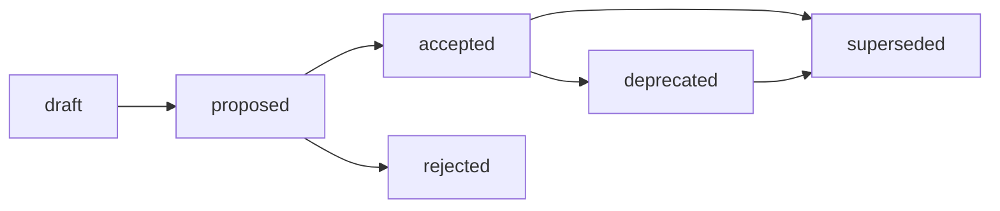

# ADR Structure Standard

## Назначение

Этот стандарт задаёт обязательную структуру ADR (Architecture Decision Record)
для Хаба и архетипов A/B/C/D. Источник решения:
[RFC: Стандарт структуры ADR](../governance/rfc/2026-06-27-rfc-adr-standard.md).

Стандарт — это IL-3 reusable rule о форме ADR, минимальных полях и review
criteria. Он не является Contract: операционные контракты могут ссылаться на
этот стандарт как на обязательное правило оформления, но не подменяют его
семантику. Proposal-контекст, alternatives и trade-offs остаются в RFC; этот
файл фиксирует только то, что нужно применять повторяемо.

Базовые frontmatter-правила наследуются из
[Frontmatter Docs Standard](frontmatter-docs-standard.md), а имена файлов - из
[File Naming](file-naming.md).

## Область применения

ADR используется, когда нужно зафиксировать принятое решение и rationale, а не
обсуждение всех вариантов.

| Архетип | ADR role |
| --- | --- |
| A. Governance & Knowledge Hub | Decision record для cross-repository methodology, lifecycle, standards и AI contracts. |
| B. Prompt & Pattern Library | Лёгкая фиксация устойчивых prompt/process/pattern decisions. |
| C. Product Spoke / Runtime | Engineering decision record для API, runtime architecture, data, compatibility и release-impact decisions. |
| D. Education / Learning Package | Decision record для durable learning outcomes, assessment и course architecture. |

Library/SDK относится к профилю архетипа C, а не к отдельному архетипу.

## Identification

| Элемент | Правило |
| --- | --- |
| Canonical path | `docs/adr/` для текущего Хаба и HTOM/spoke ADR. |
| Filename | `YYYY-MM-adr-NNN-short-title.md`. |
| Stable id | `ADR-NNN`, совпадает с номером в имени файла и заголовке. |
| Title | `# ADR-NNN: Short decision title`. |
| Date | В имени файла и в `updated`; дата принятия фиксируется в `Decision Metadata`. |
| Source link | Issue, RFC, research или PR, из которого выросло решение. |

## Frontmatter

ADR ДОЛЖЕН использовать necessary and sufficient frontmatter:

```yaml
---
status: proposed
version: 0.1
updated: YYYY-MM-DD
temperature: 0.1
owner: Human owner or owning group
decision-type: governance | methodology | product | curriculum | runtime
---
```

`status` ДОЛЖЕН использовать governance vocabulary из
[Frontmatter Docs Standard](frontmatter-docs-standard.md):
`draft`, `proposed`, `accepted`, `rejected`, `deprecated`, `superseded`.

Frontmatter `status` является единственным machine-readable canon. Body-level
status в `Decision Metadata` МОЖЕТ повторять его только как narrative summary.

`ai-generated` ЗАПРЕЩЁН во frontmatter. Provenance фиксируется в issue, PR,
changelog, audit или session record.

## Required Body Sections

ADR ДОЛЖЕН содержать секции в таком порядке:

1. `Decision Metadata`
2. `Context`
3. `Decision`
4. `Decision Drivers`
5. `Alternatives Considered`
6. `Consequences`
7. `Compliance and Validation`
8. `Lifecycle`
9. `Related Artifacts`

Минимальный шаблон:

```markdown
# ADR-NNN: Short decision title

## Decision Metadata

| Field | Value |
| --- | --- |
| ADR id | ADR-NNN |
| Decision type | governance / methodology / product / curriculum / runtime |
| Decision status | same as frontmatter status; narrative summary only |
| Decision date | YYYY-MM-DD |
| Owner | Human owner or owning group |
| Source | Issue/RFC/research/PR link |
| Impacted artifacts | Paths or "none" |
| Supersedes | ADR-NNN or "none" |
| Superseded by | ADR-NNN or "none" |

## Context

Problem, constraints, and why the decision is needed now.

## Decision

One accepted decision, stated directly.

## Decision Drivers

- Driver 1.
- Driver 2.

## Alternatives Considered

If a source RFC exists, link to its Alternatives section and name only the
decisive fork that the ADR closes. If there is no source RFC, list concise local
alternatives and rejection reasons.

## Consequences

Architectural consequences of the accepted decision. Link to the source RFC,
backlog, issue or implementation plan for downstream tasks; do not duplicate a
task list from the proposal.

## Compliance and Validation

How humans, validators, docs, tests or runtime checks verify the decision.

## Lifecycle

Transition state, review trigger, deprecation and supersession rules.

## Related Artifacts

Links to RFC, standard, template, validator, implementation PR or research.
```

## Section-Level Delegation

When an ADR has a source RFC, the required ADR sections remain present, but the
ADR MUST delegate proposal detail at section level instead of copying it.

| ADR section | ADR owns | Delegates to source RFC |
| --- | --- | --- |
| `Context` | Why a decision record is needed now, and which accepted proposal it records. | Full proposal-stage problem statement and research inventory. |
| `Decision` | The accepted decision stated directly, with links to RFC sections for the detailed model. | Full `Proposal`, option menus, and implementation detail. |
| `Decision Drivers` | The short set of drivers that justify acceptance. | Full motivation, benchmark tables, and stress tests. |
| `Alternatives Considered` | Pointer to RFC alternatives plus the decisive fork, if useful. | Complete alternatives table and rejection analysis. |
| `Consequences` | Architectural consequences of the accepted decision. | Downstream task lists, impacted-artifact matrices and implementation backlog. |

Negative constraints:

- `Decision` MUST NOT copy the full RFC `Proposal`; it states what was accepted
  and links to the RFC model.
- `Alternatives Considered` MUST NOT reproduce a source RFC alternatives table
  when a source RFC exists.
- `Consequences` MUST NOT duplicate the RFC impacted-artifact/backlog list; it
  links to the source RFC or backlog for follow-up work.
- If the ADR accepts or changes a standard/template/validator/practice, the ADR
  MUST NOT become a proposal wrapper for that artifact; it records the decision
  and delegates reusable rule text to the downstream artifact.

## Lifecycle

Allowed ADR transitions:



Rules:

- `accepted` requires explicit human review or merge decision.
- `superseded` requires a backlink to the replacing ADR/RFC.
- `deprecated` requires a migration or replacement note.
- Rejected ADRs remain linkable when the rejected alternative is likely to
  reappear in future work.

## Archetype Deltas

| Архетип | Required deltas | Keep light |
| --- | --- | --- |
| A | Require source RFC/research link, impacted artifacts, compliance/validation and supersession. | Do not create ADR for typo fixes, local cleanup or accepted RFCs that already serve as decision records. |
| B | Require evidence link, affected prompts/patterns and rollback/evaluation notes. | Do not create ADR for routine prompt wording, experiments or one-off tuning. |
| C | Require compatibility, migration, runtime validation and owner. | Do not duplicate product specs, issue acceptance criteria or small feature PRs. |
| D | Require learner impact, curriculum migration and review trigger. | Do not create ADR for individual lesson edits or short-lived course notes. |

## Boundary RFC/ADR

| Situation | Decision |
| --- | --- |
| Proposal needs broad review, alternatives and human choice before the decision. | Create RFC first; create ADR after acceptance only if a short accepted decision record is needed. |
| Accepted RFC already contains final status, rationale, alternatives, consequences and no separate downstream standard is produced. | Accepted RFC may itself be the decision record; do not duplicate it as ADR. |
| Decision is narrow, already accepted, or does not need proposal-stage discussion. | Create ADR directly. |
| Accepted decision creates or changes a standard, template, validator, practice or cross-repository rule. | Prefer RFC -> ADR -> standard/template/validator route. |
| Decision only explains implementation details of one PR. | Do not create ADR; PR description is enough. |

The invariant: RFC answers "should we accept this change and how?", ADR answers
"what decision was accepted and why?".

## ADR Acceptance Review Checklist

Before moving an ADR to `accepted`, reviewer checks:

- If a source RFC exists, does `Decision` state the accepted decision without
  retelling the RFC `Proposal`?
- Do `Alternatives Considered` and `Consequences` delegate source RFC detail
  instead of copying RFC alternatives, trade-offs or task lists?
- If the ADR creates or changes a standard/template/validator/practice, is the
  reusable rule text kept in the downstream artifact rather than embedded as an
  ADR proposal wrapper?
- Are status, decision date, impacted artifacts and source links aligned with
  the frontmatter canon and current repository state?

## Validation

Local checks:

```bash
./tools/validate-frontmatter.sh .
./tools/validate-file-naming.sh
./tools/validate-repository-structure.sh
```

Validator expansion beyond frontmatter, naming and registry checks is tracked as
tech debt in [governance/backlog.md](../governance/backlog.md).
