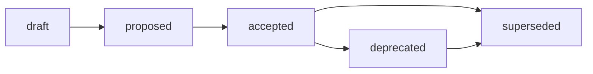

# Analysis Standard

## Назначение

Этот стандарт задаёт обязательную структуру Analysis-артефактов Хаба: базовый
каркас Analysis (назначение, frontmatter, naming, lifecycle, минимальное ядро
секций), опциональные лёгкие профили подтипов (`inventory`, `matrix`, `options`,
`recommendation`), routing `docs/analysis/` и границы Analysis ↔ Research ↔ Audit
↔ Report ↔ RFC ↔ ADR. Источник принятого решения:
[ADR-006](../docs/adr/2026-07-adr-006-analysis-structure.md); rationale,
альтернативы (A/B/C/D) и trade-offs:
[RFC B-025](../governance/rfc/2026-07-02-rfc-analysis-structure.md).

Стандарт — это IL-3 reusable rule о форме Analysis как **interpretation layer**:
интерпретации локального/внутреннего контекста, его размещении и
relation-метаданных. Он не является Contract: операционные контракты могут
ссылаться на этот стандарт как на обязательное правило оформления, но не
подменяют его семантику. Он фиксирует только то, что ОБЯЗАТЕЛЬНО применять
повторяемо. Proposal-контекст, рассмотренные альтернативы, отклонённые варианты
и trade-offs остаются в RFC B-025 и ЗАПРЕЩЕНО дублировать их здесь. Инвентаризация
186 кандидатов (19 фактических Analysis) остаётся в
[Analysis inventory (B-024)](../docs/analysis/2026-07-02-analysis-artifacts-inventory.md),
а decision rationale — в ADR-006; стандарт цитирует их, а не переписывает.

Базовые frontmatter-правила наследуются из
[Frontmatter Docs Standard](frontmatter-docs-standard.md), а имена файлов — из
[File Naming](file-naming.md). Каноническое определение Analysis
(«исследование локального или внутреннего контекста без генерации нового
внешнего знания») живёт в [glossary](glossary.md) (B-020) и не переписывается
здесь. Модель Analysis реализует **Вариант C** ADR-006: один базовый стандарт
Analysis + опциональные профили подтипов, «A сейчас, B потом» с явным триггером
выделения профиля (см. [Subtype Profiles](#subtype-profiles) и
[Anti-Inflation Trigger](#anti-inflation-trigger-триггер-b)).

## Область применения

Стандарт применяется к работе, которая **интерпретирует локальный или внутренний
контекст** — разбирает текущие артефакты, данные, backlog, PR-гипотезы, границы
или опции и объясняет, «что это значит / какие варианты следуют», без генерации
нового внешнего знания (это Research) и без проверки на норму с вердиктом (это
Audit). Analysis — это **стойка/функция** (interpretive/causal), а не имя
каталога: тип определяется доминирующей стойкой и содержательной ролью, а не
путём `docs/analysis/` и не именем файла (content-over-path, issue #288).

| Архетип | Analysis role |
| --- | --- |
| A. Governance & Knowledge Hub | Analysis-контур Хаба: `docs/analysis/`. Этот стандарт нормативен для архетипа A. |
| B. Prompt & Pattern Library | Использует базовый Analysis + профили для разбора prompt/pattern корпуса (inventory/matrix/options) с relation-метаданными к исходным экспериментам. |
| C. Product Spoke / Runtime | Применяет `analysis-subtype` и границу Analysis ↔ Audit к архитектурному / repo-state разбору продукта; ссылается на runtime evidence, а не поглощает его. |
| D. Education / Learning Package | Использует recommendation / options профили для разбора учебного корпуса и curriculum-опций. |

Routing-следствия для B/C/D закрепляются downstream (см. матрицу дельт RFC B-025)
и не расширяют этот стандарт: без project-level ADR/standard `docs/analysis/` не
навязывается spoke-репозиториям.

## Identification and Placement

Тип артефакта ОПРЕДЕЛЯЕТСЯ его содержательной ролью и доминирующей стойкой, а
**не именем каталога** (content-over-path, issue #288). Research, Audit, Report
или RFC, спрятанные в `docs/analysis/`, сохраняют фактический тип и
маршрутизируются по нему; фактический Analysis под `research/` остаётся Analysis.

| Элемент | Правило |
| --- | --- |
| Canonical path | `docs/analysis/YYYY-MM-DD-name.md` — канонический дом Analysis-артефактов. Routing уже нормативно задан в [`research-standard.md`](research-standard.md) §«Маршрутизация Research / Analysis / Audit»; этот стандарт его **подтверждает и переиспользует**, а не вводит заново (ADR-006). |
| Filename | `YYYY-MM-DD-name.md`, где `YYYY-MM-DD` — дата создания Analysis, `name` — короткий `kebab-case` слаг на латинице (см. [file-naming.md](file-naming.md)). |
| Evidence | Analysis ССЫЛАЕТСЯ и ЦИТИРУЕТ доказательную базу (evidence links: локальные факты, Research/Audit/Report outputs, данные репозитория, `exp/`), а не переписывает её (delegation, не duplication). |

**Legacy Analysis в `research/`.** B-024 §2.2 нашёл 6 фактических Analysis под
Hub `research/`. Это **modernization candidates** для B-028, а не немедленные
нарушения: «actual Analysis outside path» получает метаданные in place или
перенос после стандарта и плана миграции.

**Output surface vs самостоятельный Analysis.** Терминальная секция или
inline-render внутри Research/Audit/Report без своего lifecycle — это output
surface, не Analysis. Самостоятельный Analysis имеет собственный frontmatter,
имя и статус.

Этот стандарт **не создаёт директории и не мигрирует файлы**: физическая
модернизация метаданных, устранение дублей/замаскированных артефактов и миграция
legacy Analysis из-под `research/` — задача B-028 (координация с планом миграции
репо B-034).

## Frontmatter

Analysis ДОЛЖЕН использовать necessary and sufficient frontmatter класса
Research / report из [Frontmatter Docs Standard](frontmatter-docs-standard.md)
плюс relation-метаданные:

```yaml
---
status: draft            # knowledge: draft | reviewed | canonical | superseded
version: 0.1
updated: YYYY-MM-DD
temperature: 0.1
analysis-subtype: inventory   # inventory | matrix | options | recommendation (опц.)
source: <родительский issue/run или исходный контекст>
scope: <охват: repo | project | ecosystem | slice>
based_on: <артефакты/данные, на которых строится интерпретация или "—">
related_artifacts:
  - <ссылки на evidence, parent work, смежные Analysis/Research/Audit/Report>
---
```

Правила:

- Обязательное frontmatter-ядро (`status`, `version`, `updated`, `temperature`)
  наследуется из Research / report-профиля
  [`frontmatter-docs-standard.md`](frontmatter-docs-standard.md).
- `status` ДОЛЖЕН использовать **knowledge**-vocabulary:
  `draft`, `reviewed`, `canonical`, `superseded`. Governance-словарь
  (`proposed`, `accepted`) ЗАПРЕЩЁН для Analysis-артефактов.
- `source` и `scope` — relation-метаданные, ОБЯЗАТЕЛЬНЫ: они фиксируют привязку
  интерпретации к её входам и охват разбора (B-024 §6.2).
- `based_on` и `related_artifacts` — опциональны, но РЕКОМЕНДОВАНЫ, когда
  Analysis опирается на Research/Audit/Report outputs или смежные артефакты.
- `analysis-subtype` — из фиксированного словаря
  `inventory | matrix | options | recommendation`. **Опционален** в базе; его
  обязательность для конкретных форм не расширяется этим стандартом (ADR-006:
  subtype опционален в базе). Добавляется, когда явно объявляет форму профиля.
- `supersedes` НЕ входит в обязательное ядро; добавляется только при
  подтверждённой замене (B-024 §6) как backlink на заменяющий Analysis.
- `ai-generated` во frontmatter **ЗАПРЕЩЁН**. Provenance фиксируется в issue, PR,
  changelog или session record.

Relation-словарь **согласован** с Reports standard (B-043:
`based_on`/`source`/`scope`/`supersedes`/`related_artifacts`) и Audit standard
(B-032), чтобы cross-artifact метаданные читались единообразно.

> **Разграничение словарей (lifecycle vs frontmatter).** Правила этой секции
> нормируют frontmatter **Analysis-артефактов** (объект стандарта, путь
> `docs/analysis/`) — они принадлежат классу Knowledge и используют
> **knowledge-vocabulary**. Сам этот документ — governance-артефакт класса
> `standards/`, поэтому его собственный `status` использует
> **governance-vocabulary** (см. [Lifecycle](#lifecycle)). Это не противоречие:
> `standards/*.md` и `docs/analysis/*.md` — разные document classes с разными
> словарями статусов per
> [Frontmatter Docs Standard](frontmatter-docs-standard.md) (Status
> Vocabularies). Смешивать словари внутри одного класса ЗАПРЕЩЕНО.

## Minimum Body Sections

Каждый Analysis ДОЛЖЕН содержать минимальное ядро секций базового каркаса
(interpretive/causal стойка — «что это значит / какие опции следуют», а не
generative «новое внешнее знание», не normative «соответствует ли норме» и не
descriptive «что произошло»):

| Секция | Обязательность | Содержание |
| --- | --- | --- |
| Summary / BLUF | обязательна | Вывод интерпретации в одном абзаце первым абзацем. |
| Context / Scope | обязательна | Дата, автор, источники, охват (`scope`) и что именно интерпретируется. |
| Findings / Options | обязательна | Интерпретация локальных фактов, границ и вариантов (не execution log, не вердикт). |
| Recommendations | обязательна | Что следует из интерпретации (без принятия решения — это RFC/ADR). |
| Related Artifacts | обязательна | Ссылки на evidence, parent work и смежные артефакты. |

Профиль подтипа ДОБАВЛЯЕТ обязательное ядро поверх этой базы (см. ниже).
Генерация нового внешнего знания, source-backed research methodology и
обязательные внешние источники НЕ входят в Analysis — Analysis может опираться
на локальные факты, Research/Audit/Report outputs и данные репозитория (B-024
§7.3). Причинный разбор с вердиктом pass/fail и compliance target делегируются
Audit, а descriptive execution log — Report.

## Subtype Profiles

Подтипы входят как **лёгкие профили-секции** одного базового стандарта, а не как
четыре независимых стандарта (Вариант C). Профиль включается только когда форма
реально повторяется в корпусе (B-024 наблюдает
inventory/matrix/options/recommendation как доминирующие формы Analysis). Каждый
профиль добавляет обязательное ядро поверх базы:

| Профиль | Обязательное ядро (сверх базы) | Покрывает | Canonical path |
| --- | --- | --- | --- |
| `inventory` | предмет учёта, охват/снимок, критерии классификации, сводная таблица | сквозные инвентаризации артефактов/корпуса (B-024 сам — inventory Analysis) | `docs/analysis/` |
| `matrix` | оси сравнения, критерии, ссылка на воспроизводимый evidence (`exp/`) | сравнительные матрицы кандидатов/вариантов | `docs/analysis/` |
| `options` | набор вариантов, критерии сравнения, границы применимости | option analysis без decision gate (вход для RFC) | `docs/analysis/` |
| `recommendation` | интерпретация, рекомендация, обоснование, границы | repository-state / recommendation Analysis | `docs/analysis/` |

Ключевой принцип (B-024 §4): «**Analysis — interpretation layer**». Документ
может быть `inventory analysis` или `options analysis`, но остаётся Analysis по
доминирующей стойке, а не превращается в Research/Audit/Report из-за формы
вывода. Профиль описывает **форму выхода**, а не меняет тип артефакта.

## Lifecycle

Analysis-артефакты (объект стандарта) используют **knowledge-vocabulary**
статусов (ADR-006/ADR-002: Analysis — knowledge-артефакт IL-3, а не decision
record):


- `draft` — черновая интерпретация, ещё не прошла review.
- `reviewed` — Analysis проверен и принят как надёжная интерпретация.
- `canonical` — текущий опорный Analysis для своего scope (reusable basis для
  ссылок).
- `superseded` — Analysis заменён; `superseded` ТРЕБУЕТ backlink на заменяющий
  Analysis через `supersedes` в заменяющем документе.

Governance-словарь (`proposed`, `accepted`, `rejected`) ЗАПРЕЩЁН для Analysis:
Analysis — knowledge-артефакт (IL-3), а не decision record. Это отличается от
lifecycle самого RFC (`draft → proposed → accepted → ...`): RFC — decision
proposal, Analysis — knowledge-артефакт.

Сам этот документ как governance-артефакт класса `standards/` подчиняется
**governance-словарю** статусов
(`draft`, `proposed`, `accepted`, `rejected`, `deprecated`, `superseded`) — это
отдельный словарь от knowledge-vocabulary, который стандарт предписывает для
нормируемых им Analysis-артефактов. Пока идёт review, стандарт остаётся в
`draft`/`proposed`; `accepted` фиксирует human decision gate.



Изменение принятой модели Analysis (Вариант C, набор профилей, routing
`docs/analysis/`, relation-frontmatter) требует нового RFC/ADR, а не правки
этого стандарта.

## Boundaries

Границы **фиксируются ссылкой**, а не переписыванием: полные таблицы — в B-024
§4, B-029, B-041 и глоссарии. Тип артефакта определяется доминирующей стойкой
(совместимо с content-over-path, issue #288):

| Граница | Правило | Дом артефакта |
| --- | --- | --- |
| Analysis ↔ Research | Research генерирует новое внешнее/доменное знание (source-backed benchmark, гипотеза); Analysis интерпретирует локальный/внутренний контекст. Analysis может **цитировать** Research как вход, но **не наследует** research-evidence rules и не требует внешних источников. | `docs/analysis/` vs `research/<domain>/` |
| Analysis ↔ Audit | Audit проверяет соответствие норме/контракту с pass/fail и remediation; Analysis объясняет состояние и опции **без вердикта**. Analysis становится Audit при добавлении compliance target и вердиктов (B-029). | `docs/analysis/` vs `docs/audit/` |
| Analysis ↔ Report | Report фиксирует «что произошло» (descriptive: execution log, kickoff, retrospective); Analysis объясняет, что состояние **значит** и какие опции следуют. Analysis допускает evidence-ссылки на Reports, но не поглощает Report-профили (B-041 P5). | `docs/analysis/` vs `docs/report/` |
| Analysis ↔ RFC | RFC предлагает изменение до decision gate (alternatives + acceptance path); Analysis может готовить options и evidence как **вход** для RFC, но proposal с decision-альтернативами — это RFC. | `docs/analysis/` vs `governance/rfc/` |
| Analysis ↔ ADR | ADR фиксирует принятое решение; Analysis — upstream evidence для ADR (recommendation), но сам **не decision record**. | `docs/analysis/` vs `docs/adr/` |

Нормативный тай-брейкер для граничных кейсов — один вопрос исполнителю:

> Этот документ **интерпретирует локальный/внутренний контекст и объясняет
> опции без вердикта** (→ Analysis), генерирует **новое внешнее знание/варианты
> за границей** (→ Research), проверяет **соответствие явной норме и выносит
> вердикт** (→ Audit), фиксирует **устойчивый record of results со своим
> lifecycle** (→ Report), предлагает **изменение с альтернативами до decision
> gate** (→ RFC), или фиксирует **принятое решение** (→ ADR)?

Если документ делает несколько вещей сразу, он ДОЛЖЕН быть **разделён** либо
классифицирован по доминирующему deliverable. Один артефакт ЗАПРЕЩЕНО нормировать
как два типа сразу.

## Anti-Inflation Trigger (Триггер B)

Профили подтипов остаются **секциями** этого базового стандарта до явного порога
выделения. **Триггер B (Anti-Inflation,
[`governance/repo-model.md`](../governance/repo-model.md)).** Профиль выделяется
в отдельный стандарт (`analysis-inventory-standard.md` и т.п.) **только** когда:

- профиль накопил достаточно **собственных повторяющихся обязательных правил**
  (own recurring MUST-rules подтипа), которых нет у остальных профилей; либо
- **review pain** делает базовый Analysis standard неясным (критерий ADR-006).

До этого порога подтип остаётся секцией-профилем базового стандарта. Это даёт
минимальную поверхность сейчас (как A) и путь к разделению потом (как B) — по
тому же принципу, по которому Reports standard (B-043) и Audit standard (B-032)
откладывают выделение своих профилей. Выделение профиля в отдельный стандарт —
изменение принятой модели и требует нового RFC/ADR, а не правки этого стандарта.

## Validation

Local checks:

```bash
./tools/validate-frontmatter.sh .
./tools/validate-file-naming.sh
./tools/validate-repository-structure.sh
```

Нормативный enforcement принятой модели (`analysis-subtype`,
relation-метаданные, routing `docs/analysis/`, knowledge-lifecycle)
кодифицируется обновлением валидаторов в цепочке cleanup B-028, не в этом
стандарте. Расширение валидаторов за пределы frontmatter, naming и registry
checks отслеживается как tech debt в
[governance/backlog.md](../governance/backlog.md).

## Related Artifacts

- [ADR-006: Структура Analysis-артефактов и принятие Варианта C](../docs/adr/2026-07-adr-006-analysis-structure.md)
  (B-026) — источник принятого решения (Вариант C, routing `docs/analysis/`,
  relation-frontmatter, knowledge-lifecycle, границы).
- [RFC B-025: Структура Analysis-артефактов](../governance/rfc/2026-07-02-rfc-analysis-structure.md) —
  rationale, alternatives (A/B/C/D), trade-offs и rejected options.
- [Analysis inventory and boundaries (B-024)](../docs/analysis/2026-07-02-analysis-artifacts-inventory.md) —
  инвентарь 186 кандидатов (19 фактических Analysis), границы §4, requirements
  для B-025 §7.
- [Analysis inventory evidence](../research/hub/exp/analysis-inventory-342/) —
  воспроизводимая матрица кандидатов и scan-скрипт.
- [Audit artifacts deep analysis (B-029)](../docs/analysis/2026-07-02-audit-artifacts-deep-analysis.md) —
  граница Analysis ↔ Audit.
- [`standards/report-standard.md`](report-standard.md) (B-043) — sibling standard
  той же цепочки; прецедент Варианта C и граница Reports ↔ Analysis.
- [`standards/audit-standard.md`](audit-standard.md) (B-032) — sibling standard
  той же цепочки; граница Analysis ↔ Audit и согласованный relation-словарь.
- [`standards/research-standard.md`](research-standard.md) — маршрутизация
  Research / Analysis / Audit и routing `docs/analysis/` (B-018).
- [`standards/glossary.md`](glossary.md) — каноническое определение Analysis /
  Research / Audit (B-020).
- [ADR-002: Методология создания и управления артефактами](../docs/adr/2026-06-adr-002-artifact-document-methodology.md) —
  routing и knowledge-lifecycle артефактов (без изменений).
- [ADR-003: Структура research и маршрутизация Research / Analysis / Audit](../docs/adr/2026-07-adr-003-research-structure.md) —
  источник routing R/A/A и `docs/analysis/` (без изменений).
- [frontmatter-docs-standard.md](frontmatter-docs-standard.md) — контракт
  frontmatter по классам документов.
- [file-naming.md](file-naming.md) — дата-первое именование.
- [governance/backlog.md](../governance/backlog.md) — цепочка Analysis B-024,
  B-025, B-026, B-027 (этот стандарт), B-028 и координация с B-034.
- Issues
  [#366](https://github.com/G-Ivan-A/hybrid-Intelligence-lab/issues/366)
  (создание этого стандарта, B-027),
  [#296](https://github.com/G-Ivan-A/hybrid-Intelligence-lab/issues/296)
  (зонтичная задача стандартизации Research / Analysis / Audit),
  [#288](https://github.com/G-Ivan-A/hybrid-Intelligence-lab/issues/288)
  (размытие типов Research / Analysis / Audit).
</content>
