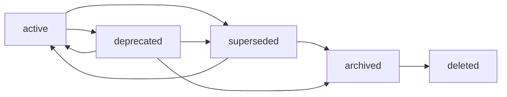

# Artifact Deprecation Standard

## Purpose

Этот стандарт задаёт **жизненный цикл артефакта во времени**: наблюдаемые
состояния артефакта, легитимные переходы между ними, механизмы сохранения
совместимости при переходе и условия, при которых физическое удаление файла
разрешено или запрещено. Он превращает пробел, зафиксированный в
[Analysis о неоднозначности контрактов при последовательных задачах](../docs/analysis/2026-08-11-sequential-task-contract-ambiguity-analysis.md),
в reusable rule: до этого стандарта нормы перечисляли ограничения вокруг
действия, но не описывали сам объект перехода и его состояние «до/после».

Эмпирическая база — конфликт
[PR #491](https://github.com/G-Ivan-A/hybrid-Intelligence-lab/pull/491) и
[PR #492](https://github.com/G-Ivan-A/hybrid-Intelligence-lab/pull/492), где
одна задача «консолидировать шаблоны» дала два внутренне согласованных, но
взаимоисключающих исхода для одного пути: compatibility redirect против
физического удаления с переписыванием ссылок в исторических документах. Оба
исполнителя были локально правы, потому что судьба прежнего пути не была
нормирована.

Стандарт фиксирует только форму lifecycle-перехода. Он **не** принимает новых
governance-решений, не меняет
[ADR-010](../docs/adr/2026-08-adr-010-agent-autonomy-principles.md),
[RFC #470](../docs/rfc/2026-08-06-rfc-task-statement-architecture.md),
[AI Governance](../ai-governance/ai-governance.md) и
[ADR-002](../docs/adr/2026-06-adr-002-artifact-document-methodology.md), не
переписывает исторические документы и не внедряет CI-валидаторы: реализация
проверок — отдельная задача (см. [Validation](#validation)).

## Scope

Правила обязательны для **любого изменения, которое прекращает, замещает или
удаляет уже существующий артефакт репозитория**: файл в `standards/`,
`docs/`, `ai-rules/`, `ai-governance/`, `ops/`, `templates/`,
`.github/ISSUE_TEMPLATE/`, `practices/`, `guides/`, `tools/` и `research/`, а
также каталог, целиком выполняющий роль артефакта.

| Ситуация | В scope | Почему |
| --- | --- | --- |
| Артефакт заменён новым и перестаёт быть активным | ✅ | Основной случай lifecycle-перехода. |
| Артефакт перемещён на новый путь | ✅ | Смена пути — переход identity, а не только правка. |
| Артефакт консолидирован с другим | ✅ | Прецедент PR #491/#492. |
| Файл физически удаляется | ✅ | Требует явных preconditions и мандата. |
| Правка содержимого активного артефакта без смены состояния | ❌ | Обычное изменение; регулируется amendment tiers. |
| Создание нового артефакта | ❌ | Регулируется ADR-002 и профильным стандартом. |
| Удаление временных или служебных файлов, никогда не бывших артефактом (build output, локальные логи вне `research/*/exp/`) | ❌ | Нет identity артефакта, нечему переходить. |

Стандарт нормирует **переход**, а не содержание артефакта и не право его
инициировать. Право принять решение остаётся за нормами human decision:
удаление или перезапись существующей человеческой работы — п.4 Принципа 2
[ADR-010](../docs/adr/2026-08-adr-010-agent-autonomy-principles.md), уровень
изменения — [Amendment policy](../ai-governance/ai-governance.md). Стандарт
отвечает на вопрос «как выглядит легитимный переход», а не «кому разрешено его
запустить».

## Identification and Placement

| Элемент | Правило |
| --- | --- |
| Canonical path | `standards/artifact-deprecation-standard.md`. |
| Artifact class | Governance standard, IL-3 explanatory Markdown в `standards/`. |
| Governed artifacts | Любой артефакт репозитория при переходе состояния, см. `Scope`. |
| Naming | kebab-case по [file-naming.md](file-naming.md); это живой контракт, а не датированное наблюдение, поэтому date-first правило не применяется. |
| Normative source | Analysis по issue [#495](https://github.com/G-Ivan-A/hybrid-Intelligence-lab/issues/495) как постановка вопросов; постановка задачи — issue [#500](https://github.com/G-Ivan-A/hybrid-Intelligence-lab/issues/500). |
| General artifact methodology | [ADR-002](../docs/adr/2026-06-adr-002-artifact-document-methodology.md) — owner artifact classes, routing и status vocabularies. |
| Structural source | [ADR-008](../docs/adr/2026-07-adr-008-standard-meta-structure.md) и [Standard Meta-Structure](standard-meta-structure.md) — F10 explicit. |

**Идентичность артефакта.** Для целей этого стандарта артефакт наблюдается
одновременно в шести представлениях, и переход считается выполненным, только
когда все применимые представления согласованы:

1. содержимое файла;
2. путь (ссылочный адрес);
3. `status` во frontmatter;
4. регистрация в навигации (`README`, `artifact-map`, реестры);
5. входящие ссылки из других артефактов;
6. запись в `CHANGELOG.md` и Git history.

Частичное обновление представлений — самостоятельный дефект: именно оно
породило состояние «файл удалён, а историческая идентичность сохранена только
текстовым маркером».

## Frontmatter

Стандарт использует necessary and sufficient frontmatter класса `Standard` из
[Frontmatter Docs Standard](frontmatter-docs-standard.md): `status`, `version`,
`updated`, `temperature`, `owner`; `executable`, `scope`, `related_standards` и
`related_issues` добавлены как поля, потребляемые реестром стандартов и
traceability-проверкой, по образцу
[Standard Meta-Structure](standard-meta-structure.md).

ADR-002 определяет ось `Lifecycle status`: степень зрелости или принятия решения
в vocabulary класса артефакта. Настоящий стандарт вводит отдельную ось
`Deprecation state`: доступность существующего артефакта и его пути для текущих
и исторических ссылок. `active` и `archived` являются downstream-расширением
многомерной модели ADR-002 на этой отдельной оси, а не новыми значениями
frontmatter `status`.

| Ось | Что описывает | Значения | Canonical source |
| --- | --- | --- | --- |
| `Lifecycle status` | Стадия зрелости или принятия решения. | Vocabulary класса: knowledge `draft`/`reviewed`/`canonical`/`superseded`; governance `draft`/`proposed`/`accepted`/`rejected`/`deprecated`/`superseded`. | [ADR-002](../docs/adr/2026-06-adr-002-artifact-document-methodology.md) и [Frontmatter Docs Standard](frontmatter-docs-standard.md). |
| `Deprecation state` | Доступность артефакта и его path identity для использования и ссылок. | `active`, `deprecated`, `superseded`, `archived`, `deleted`. | Настоящий стандарт. |

Оси ортогональны: lifecycle status не выводится из deprecation state и
наоборот. Например, knowledge-артефакт может быть `canonical + deprecated`, а
accepted governance record — `accepted + archived`. Комбинация допустима,
только если значение `status` остаётся в vocabulary класса, а состояние
Deprecation соблюдает наблюдаемые признаки и переходы настоящего стандарта.
Deprecation state `active` или `archived` не записывается в поле `status`: оно
выводится из совокупности frontmatter, блока перехода, режима содержимого,
навигации и наличия пути. Для состояний `deprecated` и `superseded` одноимённое
значение `status` одновременно выражает lifecycle-решение класса и
машиночитаемый сигнал Deprecation.

Нормативные требования к frontmatter **управляемого** артефакта при переходе:

| Состояние | `status` | Дополнительно |
| --- | --- | --- |
| active | вокабуляр класса (`accepted`/`canonical`/`draft`/…) | — |
| deprecated | `deprecated` | тело содержит указание на замену или rationale отсутствия замены. |
| superseded | `superseded` | обязательна ссылка на заменяющий артефакт; для ADR — поле `Superseded by` в `Decision Metadata` по [ADR Structure Standard](adr-structure-standard.md). |
| archived | `deprecated` или `superseded` | вокабуляр не расширяется; archived фиксируется в теле артефакта и в `artifact-map`, а не новым значением `status`. |
| deleted | — | файла нет; состояние фиксируется записью в `CHANGELOG.md`. |

Вокабуляр поля `status` **НЕ расширяется** этим стандартом: используются значения
governance (`draft`, `proposed`, `accepted`, `rejected`, `deprecated`,
`superseded`) и knowledge (`draft`, `reviewed`, `canonical`, `superseded`) из
Frontmatter Docs Standard. Смешивать вокабуляры в одном поле ЗАПРЕЩЕНО.
Поля `updated` и `version` ДОЛЖНЫ быть обновлены при каждом переходе: переход —
это существенное изменение артефакта.

## Minimum Body Sections

Этот стандарт применяет F10 explicit из
[Standard Meta-Structure](standard-meta-structure.md): десять инвариантных
H2-разделов ровно по одному экземпляру и в строгом порядке — `Purpose`,
`Scope`, `Identification and Placement`, `Frontmatter`, `Minimum Body Sections`,
`Type Model`, `Lifecycle`, `Boundaries`, `Validation`, `Related Artifacts`.
Specific tail разрешён только после `Related Artifacts`, и каждый его раздел в
первом абзаце содержит проверяемую cross-reference на `Purpose` или `Scope`.

Собственное нормативное требование стандарта к телу **управляемого** артефакта:
артефакт в состоянии `deprecated`, `superseded` или `archived` ДОЛЖЕН содержать
непосредственно после H1 блок перехода из четырёх обязательных элементов:

1. явная пометка состояния в человеческом тексте («Historical compatibility
   path. Do not use as an active artifact» либо эквивалент по-русски);
2. ссылка на замену или прямое утверждение, что замены нет;
3. причина перехода одной фразой;
4. ссылка на решение: issue, PR или ADR.

Блок перехода не заменяет `status` во frontmatter: машиночитаемый canon —
frontmatter, тело даёт человеку контекст.

## Type Model

`model`. Модель типа этого стандарта — **конечный автомат состояний оси
Deprecation**. Он ортогонален оси `Lifecycle status` из ADR-002, как определено
в разделе [Frontmatter](#frontmatter), и не заменяет её.
Она имеет одну форму и не разделяется на subtype profiles: разные классы
артефактов (standard, ADR, template, tool) проходят один и тот же набор
состояний, отличаясь только применимыми механизмами совместимости из раздела
[Compatibility Mechanisms](#compatibility-mechanisms).

Пять состояний:

| Состояние | Наблюдаемый признак | Гарантии потребителю |
| --- | --- | --- |
| `active` | Файл существует, `status` активен для класса, артефакт зарегистрирован в навигации. | Применим, ссылки разрешаются, изменения допустимы. |
| `deprecated` | Файл существует, `status: deprecated`, блок перехода присутствует, из активной навигации удалён либо помечен. | ЗАПРЕЩЕНО использовать как основание нового решения; путь и входящие ссылки продолжают разрешаться. |
| `superseded` | То же, что `deprecated`, плюс обязательная ссылка на конкретную замену; `status: superseded`. | Потребитель обязан читать замену; старый адрес остаётся разрешимым. |
| `archived` | Файл существует и доступен только как исторический снимок; содержание заморожено, правки — только metadata и обязательные ссылки. | Содержательные правки ЗАПРЕЩЕНЫ; артефакт читается как свидетельство состояния на момент принятия. |
| `deleted` | Файла по пути нет. | Гарантий нет; входящие ссылки перестают разрешаться, поэтому переход требует preconditions раздела [Deletion Rules](#deletion-rules). |

`superseded` — не отдельная ветка, а **уточнение** `deprecated`: замена известна
и названа. `archived` ортогонален причине перехода и означает режим
неизменяемости содержимого, а не степень устаревания.

Три состояния — `deprecated`, `superseded`, `archived` — сохраняют path
identity. Только `deleted` её разрушает; в этом и состоит вся его особая
опасность и весь смысл отдельных preconditions.

## Lifecycle



Легитимные переходы и их условия:

| Переход | Триггер | Preconditions | Кто решает |
| --- | --- | --- | --- |
| `active → deprecated` | Артефакт перестал быть применимым, замена ещё не названа. | Блок перехода, обновлённые `status`/`updated`/`version`, синхронизация навигации. | Автор изменения; уровень по Amendment policy. |
| `active → superseded` | Появился конкретный заменяющий артефакт. | Всё из предыдущей строки плюс двусторонняя связь: замена называет предшественника, предшественник — замену. | Автор изменения; для ADR — по ADR Structure Standard. |
| `deprecated → superseded` | Замена появилась позже перехода. | Добавлена ссылка на замену; `status` уточнён. | Автор изменения. |
| `deprecated → archived`, `superseded → archived` | Артефакт больше не обслуживается, но остаётся историческим свидетельством. | Явная пометка режима неизменяемости; правки после этого — только metadata и обязательные ссылки. | Human decision. |
| `archived → deleted` | Артефакт полностью потерял ценность как свидетельство. | Все условия раздела [Deletion Rules](#deletion-rules) выполнены. | Только человек: Tier 3 и п.4 Принципа 2 ADR-010. |
| `deprecated → active`, `superseded → active` | Решение о выводе отменено. | Запись причины реактивации; ссылка на решение. | Human decision. |

Запрещённые переходы:

| Запрещено | Причина |
| --- | --- |
| `active → deleted` напрямую | Потребитель не получает ни сигнала, ни времени; входящие ссылки ломаются без предупреждения. Артефакт ДОЛЖЕН пройти через `deprecated`/`superseded`. |
| `active → archived` напрямую | `archived` — режим для уже неактивного артефакта; иначе замораживается то, что ещё применяется. |
| `deleted → любое состояние` | Восстановление — это создание нового артефакта по правилам ADR-002 плюс git-история, а не переход. |
| Любой переход без обновления `status` и навигации | Частичное обновление представлений — дефект по разделу `Identification and Placement`. |
| Любой переход, выполненный молча | Отклонение и lifecycle-решение ДОЛЖНЫ быть записаны в теле PR (Принцип 1 ADR-010) и в `CHANGELOG.md`. |

Сам этот стандарт живёт в governance-вокабуляре: `draft → proposed → accepted`.
До acceptance фаундером его статус — `draft`; merge PR является acceptance gate.
Изменение состава состояний, набора легитимных переходов или правил удаления
требует нового либо superseding human decision record.

## Boundaries

Локальная delta этого стандарта — **семантика перехода существующего артефакта
во времени**: состояния, переходы, механизмы совместимости и preconditions
удаления. Всё остальное остаётся за действующими owner'ами и здесь не
дублируется и не переопределяется:

| Норма | Canonical owner | Что этот стандарт делает |
| --- | --- | --- |
| Artifact classes, routing, Lifecycle status vocabularies | [ADR-002](../docs/adr/2026-06-adr-002-artifact-document-methodology.md) | Использует vocabulary поля `status` как есть; добавляет ортогональную ось Deprecation как downstream-расширение модели, не вводя новых значений `status` или каталогов. |
| Граница автономии и hard limits | [ADR-010](../docs/adr/2026-08-adr-010-agent-autonomy-principles.md) | Операционализирует применимость п.4 Принципа 2 к lifecycle-переходу, не меняя формулировку. |
| Уровень изменения и human decision rights | [AI Governance](../ai-governance/ai-governance.md) | Даёт составному переходу один класс (см. [Composite Transition Classification](#composite-transition-classification)), не переписывая tiers. |
| Форма escalation и верификации | [RFC #470](../docs/rfc/2026-08-06-rfc-task-statement-architecture.md) §P.2, §P.3, §P.7 | Ссылается как на легальный выход при упоре в границу. |
| Форма стандартов | [ADR-008](../docs/adr/2026-07-adr-008-standard-meta-structure.md), [Standard Meta-Structure](standard-meta-structure.md) | Подчиняется F10 explicit. |
| Форма и supersession ADR | [ADR Structure Standard](adr-structure-standard.md) | Использует `Supersedes`/`Superseded by` как готовый механизм. |

Стандарт **не** решает: нужно ли конкретный артефакт выводить из обращения; кто
уполномочен это инициировать; какой tier получит конкретное изменение; как
устроены CI-валидаторы. Первые три вопроса принадлежат человеку и действующим
контрактам, четвёртый — отдельной задаче внедрения.

## Validation

Этот стандарт **не вводит новых CI-проверок**: внедрение валидаторов явно
исключено из scope задачи. Ниже — разделение свойств перехода на механически
наблюдаемые и human-only, чтобы будущая задача автоматизации имела готовую
спецификацию, а не изобретала её заново.

Механически наблюдаемо (кандидаты для будущего валидатора):

1. артефакт в состоянии `deprecated`/`superseded` имеет соответствующий
   `status` во frontmatter и блок перехода после H1;
2. `superseded` содержит разрешимую ссылку на замену;
3. удалённый путь не встречается как активная Markdown-ссылка в артефактах, не
   отнесённых к историческим;
4. переход отражён в `CHANGELOG.md` и в `ops/artifact-map.md`;
5. `updated` и `version` изменены в том же коммите, что и `status`.

Human-only:

1. является ли артефакт свидетельством, которое нельзя терять;
2. достаточен ли мандат на удаление;
3. корректна ли причина перехода;
4. является ли новый артефакт действительно заменой, а не смежной работой.

**Нормативное правило для валидаторов** (прямое следствие разбора PR #492):
при конфликте между проверкой ссылок и целостностью исторического документа
адаптируется **проверка**, а не исторический текст. Валидатор ДОЛЖЕН
поддерживать allowlist исторических артефактов и deprecated путей;
переписывание ссылок в accepted ADR/RFC ради прохождения проверки ЗАПРЕЩЕНО.
Соответствующее требование review зафиксировал maintainer в
[review PR #492](https://github.com/G-Ivan-A/hybrid-Intelligence-lab/pull/492#issuecomment-5255432841).

До появления специализированной проверки соответствие подтверждается общими
локальными командами из [CONTRIBUTING](../CONTRIBUTING.md):

```bash
bash tools/test-frontmatter-validator.sh
bash tools/test-smart-sync.sh
./tools/validate-file-naming.sh
./tools/validate-frontmatter.sh .
./tools/validate-repository-structure.sh
python3 tools/generate-manifest.py --check
```

## Related Artifacts

- [ADR-010: Три принципа автономии агента](../docs/adr/2026-08-adr-010-agent-autonomy-principles.md)
- [ADR-002: Методология создания и управления артефактами](../docs/adr/2026-06-adr-002-artifact-document-methodology.md)
- [ADR-008: Мета-структура стандартов](../docs/adr/2026-07-adr-008-standard-meta-structure.md)
- [RFC #470: архитектура постановки задач](../docs/rfc/2026-08-06-rfc-task-statement-architecture.md)
- [Analysis: неоднозначность контрактов при последовательных задачах](../docs/analysis/2026-08-11-sequential-task-contract-ambiguity-analysis.md)
- [Standard Meta-Structure](standard-meta-structure.md)
- [ADR Structure Standard](adr-structure-standard.md)
- [Frontmatter Docs Standard](frontmatter-docs-standard.md)
- [File naming](file-naming.md)
- [Glossary](glossary.md)
- [AI Governance](../ai-governance/ai-governance.md)
- [Agent Work Rules](../ai-rules/agent-work-rules.md)
- [Artifact Map](../ops/artifact-map.md)
- [PR #491](https://github.com/G-Ivan-A/hybrid-Intelligence-lab/pull/491) и [PR #492](https://github.com/G-Ivan-A/hybrid-Intelligence-lab/pull/492) — эмпирическая база
- [Issue #495: анализ пробелов контрактов](https://github.com/G-Ivan-A/hybrid-Intelligence-lab/issues/495)
- [Issue #500: постановка этого стандарта](https://github.com/G-Ivan-A/hybrid-Intelligence-lab/issues/500)

## Compatibility Mechanisms

Этот раздел реализует третью цель из [Purpose](#purpose) — механизмы сохранения
совместимости при переходе — и относится к переходам, перечисленным в разделе
[Lifecycle](#lifecycle).

Механизмы совместимости не взаимозаменяемы: каждый отвечает за своё
представление артефакта.

### Compatibility redirect

Сохраняет **путь** как разрешимый адрес, когда содержимое перестало быть
активным.

- **Когда применяется:** путь упоминается в исторических документах, во внешних
  ссылках, в постановках задач или в инструментах, и потеря адреса сломала бы
  их без пользы для читателя.
- **Как оформляется:** файл остаётся по прежнему пути; `status: deprecated`
  (или `superseded`); тело сокращается до блока перехода со ссылкой на активную
  замену; из активной навигации артефакт удаляется или помечается как
  historical.
- **Дополнительно для GitHub issue templates:** ключи `name` и `about`
  устанавливаются в пустую строку, чтобы шаблон исчез из UI выбора, сохранив
  путь. Это прецедент `.github/ISSUE_TEMPLATE/task-creative.md`, принятый в
  PR #491 и восстановленный в финальной версии PR #492.
- **Чего не делает:** не сохраняет содержание и не является архивом. Читатель
  redirect получает указатель, а не свидетельство.

### Superseding record

Сохраняет **связь решений**, когда новый артефакт замещает старый по существу.

- **Когда применяется:** есть конкретная замена, и потребителю нужно понимать,
  какое решение действует сейчас и какое действовало раньше.
- **Как оформляется:** двусторонняя связь. Замена называет предшественника
  (`Supersedes`), предшественник называет замену (`Superseded by`); для ADR
  поля берутся из `Decision Metadata` по
  [ADR Structure Standard](adr-structure-standard.md), для прочих артефактов —
  из блока перехода.
- **Чего не делает:** не отменяет необходимость redirect, если старый путь
  нужен как адрес, и не даёт права переписывать текст предшественника.

### Validator allowlist

Сохраняет **проверяемость репозитория**, не заставляя менять исторический
текст.

- **Когда применяется:** валидатор ссылок, структуры или реестра начинает
  считать дефектом легитимное deprecated/archived состояние.
- **Как оформляется:** deprecated путь или исторический артефакт вносится в
  allowlist проверки; изменение allowlist описывается в PR вместе с причиной.
- **Чего не делает:** не легализует удаление и не отменяет требование
  синхронизировать навигацию.

### Historical link policy

Определяет, что происходит со ссылками в исторических документах.

Ссылка в accepted ADR или RFC — часть **снимка момента принятия решения**, а не
обслуживаемый указатель на текущее дерево. Отсюда три правила:

1. Ссылка в историческом документе НЕ переписывается ради прохождения проверки
   и НЕ превращается в code span или plain text.
2. Если target выводится из обращения, сохраняется его адрес (compatibility
   redirect) либо проверка получает allowlist. Приоритет — у redirect: он
   полезен читателю, allowlist полезен только инструменту.
3. Допустимая maintenance-правка исторического документа ограничена
   metadata и восстановлением работоспособности ссылки на тот же смысловой
   объект. Изменение rationale, evidence, выводов или формулировок решения —
   ретроактивное переписывание и ЗАПРЕЩЕНО.

## Deletion Rules

Этот раздел реализует четвёртую цель из [Purpose](#purpose) — определить, когда
физическое удаление разрешено и когда запрещено — для артефактов, попадающих в
[Scope](#scope).

Физическое удаление разрешено, только когда выполнены **все** условия:

1. артефакт уже находится в состоянии `deprecated`, `superseded` или
   `archived`; прямое удаление из `active` запрещено разделом
   [Lifecycle](#lifecycle);
2. на путь артефакта нет ссылок из исторических документов (accepted/принятые
   ADR, RFC, merged PR-описания, changelog-записи);
3. на путь нет зависимости в коде, валидаторах, workflow, шаблонах или
   манифестах;
4. артефакт не является свидетельством, которое нельзя восстановить из замены:
   его содержание либо поглощено заменой, либо не имеет самостоятельной
   ценности;
5. есть явный мандат: постановка задачи прямо требует удаления, либо получено
   подтверждение через легальный выход
   [§P.2 RFC #470](../docs/rfc/2026-08-06-rfc-task-statement-architecture.md);
6. удаление зафиксировано в `CHANGELOG.md` (раздел `Removed`) и в
   `ops/artifact-map.md`.

Физическое удаление ЗАПРЕЩЕНО, если верно хотя бы одно:

1. на путь ссылается исторический документ, и адрес не заменён compatibility
   redirect;
2. существует зависимость в коде или проверках;
3. мандата нет: удаление или перезапись существующей человеческой работы без
   явного мандата — п.4 Принципа 2
   [ADR-010](../docs/adr/2026-08-adr-010-agent-autonomy-principles.md);
4. удаление выполняется ради прохождения валидатора: это подмена цели, при
   которой адаптироваться должна проверка (см. [Validation](#validation));
5. артефакт содержит уникальное свидетельство решения, не воспроизведённое
   заменой.

**Правило неопределённости.** Если хотя бы одно условие не может быть проверено
исполнителем, выбирается `deprecated` с compatibility redirect, а вопрос об
удалении выносится человеку блоком «Не выполнено и вопросы». Redirect обратим
одним коммитом, удаление с потерей адреса — нет; при равной аргументации
выбирается обратимый исход.

**Что делать с историческими документами, ссылающимися на удалённый артефакт.**
Их текст не переписывается. Если удаление всё же признано легитимным и адрес не
сохранён, ссылка остаётся как есть, а проверка получает allowlist с пояснением;
изменение исторического текста ради «зелёного» валидатора остаётся запрещённым
разделом [Compatibility Mechanisms](#compatibility-mechanisms).

## Composite Transition Classification

Этот раздел реализует границу из [Scope](#scope) — стандарт нормирует переход
целиком, а не его отдельные технические части — и снимает неоднозначность
классификации, зафиксированную в Analysis по issue #495.

Один lifecycle-переход обычно состоит из нескольких технических действий разного
веса: удаление файла, правка ссылок, изменение allowlist, обновление реестра.
Классификация по каждой части в отдельности позволяет обосновать почти любой
исход, поэтому:

> Составной переход классифицируется **целиком и по максимальному весу входящей
> части**. Если хотя бы одна часть относится к Tier 3 или к перечню Принципа 2
> ADR-010, весь переход считается требующим human decision.

Практические следствия:

| Наблюдаемое действие | Классификация перехода |
| --- | --- |
| Смена `status` + блок перехода + обновление навигации | Переход в `deprecated`; вес по Amendment policy, human decision не требуется по умолчанию. |
| То же плюс удаление файла | Переход в `deleted`; требует мандата целиком, даже если 90% диффа — механические правки. |
| Правка ссылок в accepted ADR/RFC | Не техническая часть, а изменение исторического снимка; запрещено разделом [Compatibility Mechanisms](#compatibility-mechanisms). |
| Изменение семантики валидатора ради перехода | Классифицируется по валидатору, а не по переходу; описывается в PR отдельно. |

**Преемственность задач.** Если тот же путь затронут PR, merged незадолго до
текущей задачи, результат того PR является обязательным входом: исполнитель
проверяет принятое решение по пути до выбора механизма. Расхождение с недавно
принятым решением — не свобода способа по Принципу 1 ADR-010, а нормативный
конфликт, требующий легального выхода §P.2 RFC #470. Именно отсутствие этой
проверки развело PR #491 и PR #492.

## Applied Precedent

Этот раздел иллюстрирует применение правил из [Purpose](#purpose) на реальном
случае, входящем в [Scope](#scope), и не вводит новых норм.

`.github/ISSUE_TEMPLATE/task-creative.md` — консолидация creative-шаблона в
единый `task.md` с полем `Operating Mode`.

| Шаг | Что применяется |
| --- | --- |
| Состояние до | `active`: шаблон зарегистрирован в UI, на путь ссылаются ADR-010 и RFC #470. |
| Триггер | Функция поглощена заменой (`task.md` + `Operating Mode: Creative`). |
| Выбранный переход | `active → superseded`: замена конкретна и названа. |
| Механизм | Compatibility redirect: путь сохранён, `name`/`about` пусты, тело сведено к указателю на `task.md`. |
| Почему не `deleted` | Условие 2 раздела [Deletion Rules](#deletion-rules) нарушено: на путь ссылаются accepted-документы. |
| Почему ссылки в ADR-010 и RFC #470 не переписаны | Historical link policy: ссылка — часть снимка момента принятия решения. |

Итоговое состояние репозитория совпадает с исходом PR #491, восстановленным в
финальной версии PR #492 после review maintainer. Стандарт не переоценивает
работу исполнителей: он делает этот исход выводимым из правил заранее, а не
устанавливаемым постфактум через review.
