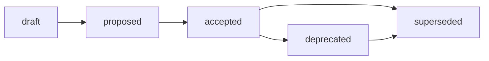

# Audit Standard

## Назначение

Этот стандарт задаёт обязательную структуру Audit-артефактов Хаба: базовый каркас
Audit (назначение, **4-компонентная модель**, frontmatter, naming, lifecycle,
минимальное ядро секций), routing `docs/audit/` и границы Audit ↔ Research ↔
Analysis ↔ Report. Источник принятого решения:
[ADR-005](../docs/adr/2026-07-adr-005-audit-structure.md); rationale, альтернативы
(A/B/C/D) и trade-offs:
[RFC B-030](../governance/rfc/2026-07-02-rfc-audit-structure.md).

Стандарт — это IL-3 reusable rule о **процессной семантике** Audit: против чего
проверяют, какое доказательство достаточно, как выносится вердикт и как
обрабатывается отклонение. Он не является Contract: операционные контракты
(checklist, release gate, norm) могут ссылаться на этот стандарт как на
обязательное правило оформления, но не подменяют его семантику. Он фиксирует
только то, что ОБЯЗАТЕЛЬНО применять повторяемо. Proposal-контекст, рассмотренные
альтернативы, отклонённые варианты и trade-offs остаются в RFC B-030 и ЗАПРЕЩЕНО
дублировать их здесь. Инвентаризация 29 Audit-кандидатов остаётся в
[B-029 Audit deep analysis](../docs/analysis/2026-07-02-audit-artifacts-deep-analysis.md),
а decision rationale — в ADR-005; стандарт цитирует их, а не переписывает.

Базовые frontmatter-правила наследуются из
[Frontmatter Docs Standard](frontmatter-docs-standard.md), а имена файлов — из
[File Naming](file-naming.md). Модель Audit реализует **Вариант C** ADR-005: один
базовый стандарт Audit + явная 4-компонентная модель процесса + разграничение
Audit-процесс vs audit-report output (см. [4-компонентная
модель](#4-компонентная-модель-ядро-audit) и [Audit-процесс vs audit-report
output](#audit-процесс-vs-audit-report-output)).

## Область применения

Стандарт применяется к работе, которая **проверяет текущее состояние на
соответствие явной норме** (стандарт, ADR, RFC, issue DoD, checklist, contract
или release gate) и производит **вердикт с findings и обработкой отклонений**.
Audit — это **стойка/процесс** (normative: «соответствует ли норме» + вердикт),
а не подтип descriptive Report («что») или causal Analysis («почему»). Тип
определяется 4-компонентной моделью, а не путём каталога и не именем файла
(content-over-path, issue #288): audit, спрятанный в `docs/analysis/`, остаётся
Audit.

| Архетип | Audit role |
| --- | --- |
| A. Governance & Knowledge Hub | Audit-контур Хаба: `docs/audit/`. Этот стандарт нормативен для архетипа A. |
| B. Prompt & Pattern Library | Использует базовый Audit для prompt/eval conformance review против явных критериев с evidence-linkage к прогонам. |
| C. Product Spoke / Runtime | Применяет 4-компонентную модель к release / verification / smoke-E2E gate checks; вердикт о готовности приходит из нормы Audit, не из формы отчёта. |
| D. Education / Learning Package | Использует Audit для проверки учебных материалов на соответствие curriculum-норме с findings и remediation. |

Routing-следствия для B/C/D закрепляются downstream (см. матрицу дельт RFC B-030)
и не расширяют этот стандарт: без project-level ADR/standard `docs/audit/` не
навязывается spoke-репозиториям.

## Identification and Placement

Тип артефакта ОПРЕДЕЛЯЕТСЯ его содержательной ролью и 4-компонентной моделью, а
**не именем каталога** (content-over-path, issue #288). Audit, спрятанный в
`docs/analysis/` или `research/`, остаётся Audit; общий descriptive Report,
спрятанный в `docs/audit/`, Audit-ом НЕ становится.

| Элемент | Правило |
| --- | --- |
| Canonical path | `docs/audit/YYYY-MM-DD-name.md` — единственный дом durable output Audit-процесса (подтверждён ADR-005, без ADR-002-дрейфа). |
| Filename | `YYYY-MM-DD-name.md`, где `YYYY-MM-DD` — дата создания Audit, `name` — короткий `kebab-case` слаг на латинице (см. [file-naming.md](file-naming.md)). |
| Audit process artifacts | Нормы проверки, чек-листы и критерии (compliance target как контракт, IL-1) размещаются в `standards/` или `kb/`, а НЕ в `docs/audit/`. `docs/audit/` содержит durable output, а не саму норму. |
| Evidence | Audit ССЫЛАЕТСЯ и ЦИТИРУЕТ доказательную базу (evidence links: validator output, scan, run, log, screenshot, matrix), а не переписывает её (delegation, не duplication). |

**Output surface vs самостоятельный Audit.** Терминальная секция или inline-render
внутри Analysis/Report без своего lifecycle — это output surface, не Audit.
Самостоятельный Audit имеет собственный frontmatter, имя и статус.

Этот стандарт **не создаёт директории и не мигрирует файлы**: физическая
модернизация метаданных, routing masked audits (под `docs/analysis/`/`research/`)
и governance-audits Mango — задача B-033.

## 4-компонентная модель (ядро Audit)

Audit ОПРЕДЕЛЯЕТСЯ связкой из четырёх компонентов, а не путём `docs/audit/` и не
именем файла. Это самое стабильное ядро из
[B-029 §8](../docs/analysis/2026-07-02-audit-artifacts-deep-analysis.md) и принятое
ядро [ADR-005](../docs/adr/2026-07-adr-005-audit-structure.md). Артефакт, у
которого отсутствует любой из компонентов 1–3, — **не Audit** (см.
[Boundaries](#boundaries)).

| # | Компонент | Что фиксирует | Обязательность |
| --- | --- | --- | --- |
| 1 | **Compliance target** | Явная норма проверки: стандарт, ADR, RFC, issue DoD, checklist, contract, release gate или утверждённый критерий. | обязателен |
| 2 | **Evidence model** | Как получено доказательство: validator/script output, reproducible run, manual/expert review, log, screenshot, scan или matrix. | обязателен |
| 3 | **Verdict / finding** | Результат проверки: pass/fail, blocker, risk, drift, gap, recommendation или readiness decision. | обязателен |
| 4 | **Deviation handling** | Как обрабатывается отклонение: severity, follow-up issue, remediation, exception, acceptance decision или explicit no-op. | обязателен (допустим explicit no-op) |

Правила ядра:

- Компоненты 1–3 (**target / evidence / verdict**) ОБЯЗАТЕЛЬНЫ всегда: без нормы,
  доказательства или вердикта работа классифицируется как Research или Analysis,
  а не Audit.
- Компонент 4 (**deviation handling**) ОБЯЗАТЕЛЕН, но допускает **explicit
  no-op** (например «нарушений нет, миграция не требуется»): молчание об
  отклонениях ЗАПРЕЩЕНО, отсутствие отклонений фиксируется явно.
- Если **compliance target недоступен или реконструируется**, Audit ОБЯЗАН явно
  это указать (weak/implicit norm) и назвать источник нормы; скрытая или
  подразумеваемая норма ЗАПРЕЩЕНА (B-029 §4, masked audits).
- 4-компонентная модель — нормативное ядро для routing (content-over-path) и для
  минимального ядра секций (см. [Minimum Body
  Sections](#minimum-body-sections)): каждая обязательная секция — проекция одного
  из четырёх компонентов.

## Frontmatter

Audit ДОЛЖЕН использовать necessary and sufficient frontmatter класса Research /
report из [Frontmatter Docs Standard](frontmatter-docs-standard.md) плюс
audit-specific метаданные (прямая проекция компонентов 1–3):

```yaml
---
status: draft            # knowledge: draft | reviewed | canonical | superseded
version: 0.1
updated: YYYY-MM-DD
temperature: 0.1
audit_target: <норма/стандарт/контракт/checklist/DoD>   # компонент 1 (обяз.)
evidence_model: <validator | run | manual-review | scan | matrix | ...>  # компонент 2 (обяз.)
verdict: <pass | fail | conditional | ready | not-ready | ...>  # компонент 3 (обяз.)
severity_scale: <напр. Critical/Major/Minor/Info или P0..P3>   # опц.
follow_up: <ссылка на follow-up issue/задачу или "—">          # опц.
related_norm: <связанный стандарт/контракт или "—">            # опц.
source: <родительская работа/issue/run>                        # relation (опц.)
scope: <repo | project | ecosystem | slice>                    # relation (опц.)
related_artifacts:
  - <evidence links, parent work, смежные Audit/Report>
---
```

Правила:

- Обязательное frontmatter-ядро (`status`, `version`, `updated`, `temperature`)
  наследуется из Research / report-профиля
  [`frontmatter-docs-standard.md`](frontmatter-docs-standard.md).
- `status` ДОЛЖЕН использовать **knowledge**-vocabulary:
  `draft`, `reviewed`, `canonical`, `superseded`. Governance-словарь
  (`proposed`, `accepted`) ЗАПРЕЩЁН для Audit-артефактов.
- `audit_target`, `evidence_model`, `verdict` — **ОБЯЗАТЕЛЬНЫ** (прямая проекция
  компонентов 1–3 ядра). Если compliance target недоступен, `audit_target`
  фиксирует реконструированную/implicit норму с пометкой, а не оставляется пустым.
- `severity_scale`, `follow_up`, `related_norm` — **опциональны**; добавляются
  только когда улучшают traceability или воспроизводят deviation model (компонент
  4). `source`, `scope`, `related_artifacts` — relation-метаданные, опциональны.
- `ai-generated` во frontmatter **ЗАПРЕЩЁН**. Provenance фиксируется в issue, PR,
  changelog, audit или session record.

> **Разграничение словарей (lifecycle vs frontmatter).** Правила этой секции
> нормируют frontmatter **Audit-артефактов** (объект стандарта, путь
> `docs/audit/`) — они принадлежат классу Knowledge и используют
> **knowledge-vocabulary**. Сам этот документ — governance-артефакт класса
> `standards/`, поэтому его собственный `status` использует
> **governance-vocabulary** (см. [Lifecycle](#lifecycle)). Это не противоречие:
> `standards/*.md` и `docs/audit/*.md` — разные document classes с разными
> словарями статусов per
> [Frontmatter Docs Standard](frontmatter-docs-standard.md) (Status
> Vocabularies). Смешивать словари внутри одного класса ЗАПРЕЩЕНО.

## Minimum Body Sections

Каждый Audit ДОЛЖЕН содержать минимальное ядро секций — проекцию 4-компонентной
модели (normative стойка: «соответствует ли норме» + вердикт, а не descriptive
«что» и не causal «почему»):

| Секция | Обязательность | Проекция компонента | Содержание |
| --- | --- | --- | --- |
| Summary / BLUF | обязательна | — | Краткий вердикт «соответствует / не соответствует / условно» первым абзацем. |
| Scope / Target | обязательна | 1 (compliance target) | Против какой нормы/контракта/checklist проверяли и границы охвата (`audit_target`, `scope`). |
| Method / Evidence | обязательна | 2 (evidence model) | Как получено доказательство; ссылки на evidence base (validator, run, scan, matrix, review). |
| Findings / Verdict | обязательна | 3 (verdict/finding) | Findings с severity (если применимо) и итоговый вердикт pass/fail/conditional. |
| Remediation / Deviation | обязательна | 4 (deviation handling) | Обработка отклонений: severity, follow-up, remediation, exception или explicit no-op. |
| Related Artifacts | обязательна | — | Связанные нормы, родительская работа, смежные Audit/Report, RFC/ADR. |

Причинный разбор «почему» (root-cause как самостоятельный deliverable),
генерация нового внешнего знания и descriptive-изложение без вердикта НЕ входят в
Audit — они делегируются Analysis / Research / Report.

## Audit-процесс vs audit-report output

Audit-цепочка и Reports-цепочка координируются, но НЕ подменяют друг друга
(ADR-005, ADR-004 v0.3):

| Аспект | Владелец | Дом артефакта |
| --- | --- | --- |
| **Audit-процесс** (норма, evidence, вердикт, remediation, 4-компонентная модель) | **Этот стандарт** (B-032) | процессная семантика — нормируется здесь |
| **Audit-report output** (форма выхода, layout, навигация, relation-frontmatter формы) | [`report-standard.md`](report-standard.md) (B-043), профиль `audit` | `docs/audit/YYYY-MM-DD-name.md` |

- **Норма Audit приходит ТОЛЬКО из Audit standard/contract**, а не из Reports.
  Профиль `audit` в Report standard описывает **только форму выхода** (output
  shape) и НЕ задаёт compliance target, evidence model или вердикт-семантику.
- Reports **не становится** родительским концептом Audit. Один документ часто и
  «проводит» аудит, и является его отчётом; процессную семантику фиксирует
  4-компонентная модель и машиночитаемый frontmatter независимо от того, где
  живёт durable output.
- **Evidence/statistics output** (сгенерированные матрицы, scan output, score
  tables) сам по себе Audit-ом НЕ является: он сохраняется как **evidence link**
  внутри Audit, а не форсируется в audit-report форму (B-029 §5.4). Полный Audit
  добавляет вокруг него target, method, finding, severity и follow-up.
- **Физический routing split** (ADR-004 v0.3): audit-reports физически лежат в
  `docs/audit/`, general/statistics reports — в `docs/report/`. Это физическое
  разделение, а не концептуальное; профиль `audit` остаётся секцией Report
  standard.

## Lifecycle

Audit-артефакты (объект стандарта) используют **knowledge-vocabulary** статусов
(ADR-005: Audit — knowledge-артефакт IL-3, а не decision record):


- `draft` — Audit проведён, но ещё не прошёл review.
- `reviewed` — Audit проверен и принят как надёжный вердикт.
- `canonical` — Audit принят как reusable basis для ссылок.
- `superseded` — Audit заменён; `superseded` ТРЕБУЕТ backlink на заменяющий Audit.

Governance-словарь (`proposed`, `accepted`, `rejected`) ЗАПРЕЩЁН для Audit:
Audit — knowledge-артефакт (IL-3), а не decision record.

Сам этот документ как governance-артефакт класса `standards/` подчиняется
**governance-словарю** статусов
(`draft`, `proposed`, `accepted`, `rejected`, `deprecated`, `superseded`) — это
отдельный словарь от knowledge-vocabulary, который стандарт предписывает для
нормируемых им Audit-артефактов. Пока идёт review, стандарт остаётся в
`draft`/`proposed`; `accepted` фиксирует human decision gate.



Изменение принятой модели Audit (Вариант C, 4-компонентная модель, routing
`docs/audit/`, граница процесс/output) требует нового RFC/ADR, а не правки этого
стандарта.

## Boundaries

Границы **фиксируются ссылкой**, а не переписыванием: полные таблицы — в Research
§10 (маршрутизация Research / Analysis / Audit), B-029 §5 и глоссарии. Тип
артефакта определяется доминирующей стойкой и 4-компонентной моделью:

| Граница | Правило | Дом артефакта |
| --- | --- | --- |
| Audit ↔ Analysis | Analysis рассуждает о локальном контексте «почему» (causal) без нормы; при наличии явной нормы и семантики pass/fail/finding/remediation артефакт — Audit, даже если лежит в `docs/analysis/`. | `docs/audit/` vs `docs/analysis/` |
| Audit ↔ Research | Research генерирует новое внешнее знание «что известно» (external); он становится Audit только когда эти практики применяются как норма/checklist к конкретному артефакту с findings. | `docs/audit/` vs `research/<domain>/` |
| Audit ↔ Report | Audit — процесс/стойка (норма + вердикт); audit-report — durable output этого процесса. Профиль `audit` описывает только форму выхода и не подменяет Audit standard (см. [Audit-процесс vs audit-report output](#audit-процесс-vs-audit-report-output)). | `docs/audit/` (output) vs Audit norm в `standards/`/`kb/` |
| Audit ↔ Evidence/statistics | Сгенерированные матрицы/scan output — evidence, а не Audit: им нужен окружающий Audit с target/method/finding/severity/follow-up. | evidence link vs самостоятельный Audit |
| Output surface ↔ самостоятельный Audit | Терминальная секция/render внутри Analysis/Report без своего lifecycle — output surface, не Audit. Самостоятельный Audit имеет свой frontmatter, имя и статус. | inline vs самостоятельный файл |

Нормативный тай-брейкер для граничных кейсов — один вопрос исполнителю:

> Этот документ **проверяет соответствие явной норме и выносит вердикт**
> (→ Audit), объясняет **причины/интерпретацию локального контекста**
> (→ Analysis), генерирует **новое внешнее знание/варианты за границей**
> (→ Research), или фиксирует **устойчивый record of results со своим lifecycle**
> (→ Report)?

Если документ делает несколько вещей сразу, он ДОЛЖЕН быть **разделён** либо
классифицирован по доминирующему deliverable. Один артефакт ЗАПРЕЩЕНО нормировать
как два типа сразу.

## Validation

Local checks:

```bash
./tools/validate-frontmatter.sh .
./tools/validate-file-naming.sh
./tools/validate-repository-structure.sh
```

Нормативный enforcement принятой модели (audit-specific frontmatter
`audit_target`/`evidence_model`/`verdict`, 4-компонентная модель, routing
`docs/audit/`, knowledge-lifecycle) кодифицируется обновлением валидаторов в
цепочке cleanup B-033, не в этом стандарте. Расширение валидаторов за пределы
frontmatter, naming и registry checks отслеживается как tech debt в
[governance/backlog.md](../governance/backlog.md).

## Related Artifacts

- [ADR-005: Структура Audit-артефактов и 4-компонентная модель](../docs/adr/2026-07-adr-005-audit-structure.md)
  (B-031) — источник принятого решения (Вариант C, 4-компонентная модель, routing
  `docs/audit/`, разграничение процесс/output).
- [RFC B-030: Структура Audit-артефактов](../governance/rfc/2026-07-02-rfc-audit-structure.md) —
  rationale, alternatives (A/B/C/D), trade-offs и rejected options.
- [B-029 Audit deep analysis](../docs/analysis/2026-07-02-audit-artifacts-deep-analysis.md) —
  инвентарь 29 Audit-кандидатов, 4-компонентная модель §2/§8, masked audits §4,
  границы стоек §5, B-033 modernization candidates §6.
- [`standards/report-standard.md`](report-standard.md) (B-043) — профиль
  `audit`-report (форма выхода), координируемый с процессной семантикой этого
  стандарта.
- [`standards/research-standard.md`](research-standard.md) — sibling standard той
  же цепочки; routing Research / Analysis / Audit и канонический путь `docs/audit/`.
- [ADR-004: Структура Reports](../docs/adr/2026-07-adr-004-reports-structure.md) —
  принятый physical routing split (`docs/audit/` для audit-reports) и граница
  Reports ↔ Audit.
- [ADR-002: Методология создания и управления артефактами](../docs/adr/2026-06-adr-002-artifact-document-methodology.md) —
  routing и knowledge-lifecycle артефактов, канонический `docs/audit/`.
- [`standards/glossary.md`](glossary.md) — каноническое определение Audit:
  проверка на соответствие норме с findings/verdict.
- [frontmatter-docs-standard.md](frontmatter-docs-standard.md) — контракт
  frontmatter по классам документов.
- [file-naming.md](file-naming.md) — дата-первое именование.
- [governance/backlog.md](../governance/backlog.md) — цепочка Audit B-029, B-030,
  B-031, B-032 (этот стандарт), B-033.
- Issues
  [#362](https://github.com/G-Ivan-A/hybrid-Intelligence-lab/issues/362)
  (создание этого стандарта, B-032),
  [#296](https://github.com/G-Ivan-A/hybrid-Intelligence-lab/issues/296)
  (зонтичная задача стандартизации Research / Analysis / Audit),
  [#288](https://github.com/G-Ivan-A/hybrid-Intelligence-lab/issues/288)
  (размытие типов Research / Analysis / Audit).
</content>
