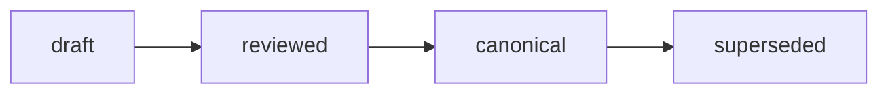
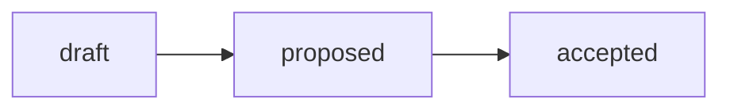

# Evals Contract Standard

Документ предложен на утверждение Пользователю. До утверждения — рекомендация,
не обязательное правило (AI_GOVERNANCE, правило 4).

Стандарт нормирует **форму** контракта `evals`: из чего состоит golden-set, как
устроена рубрика приёмки, какие офлайн-проверки выполняются до прогона и как
результат переводится в число. Стандарт **не назначает** пороги качества, не
меняет библиотеку промптов и не строит инфраструктуру — эти решения остаются за
человеком и за downstream-задачами B-068 и B-069.

Нормативные термины — по [RFC 2119 / BCP 14](https://www.rfc-editor.org/info/bcp14)
(ДОЛЖНО/MUST, СЛЕДУЕТ/SHOULD, МОЖНО/MAY).

> **Разграничение словарей (lifecycle vs frontmatter).** Собственный `status`
> этого стандарта использует governance-словарь (`draft → proposed → accepted`).
> Артефакты, которые он нормирует (golden-set, рубрика, отчёт прогона),
> используют knowledge-словарь (`draft → reviewed → canonical → superseded`).

## Purpose

Стандарт закрывает пробел **RO3** («форма evals не стандартизована»,
[Global analysis v0.4 §15.8.1](../research/hub/2026-07-04-hub-as-agent-system-global-analysis.md))
и делает операбельным разрыв **ПГ4.3** («измеримость не установлена»). Он даёт
экосистеме переиспользуемый ответ на один вопрос: **в какой форме качество
агента становится числом.**

Без общей формы evals run-статистика неинтерпретируема: нет «правильного
ответа», относительно которого прогон считается сдавшим
([§15.1.6](../research/hub/2026-07-04-hub-as-agent-system-global-analysis.md)).
Стандарт нормирует три несущих утверждения:

1. **Golden-set первичен.** Меряться можно только относительно зафиксированного
   эталона, созданного до прогона.
2. **Рубрика бинарна и наблюдаема.** Критерий приёмки формулируется так, чтобы
   два независимых оценщика получили один и тот же ответ «да/нет».
3. **Порог — решение человека.** Стандарт задаёт форму порога и требует его
   явной записи, но не выбирает значение (Rule 4).

## Scope

**Применяется к** артефактам evals любого спока экосистемы: golden-set, рубрика
приёмки, отчёт офлайн-прогона. Стандарт repo-wide: он описывает форму, которую
спок наследует, а не процесс конкретного спока.

**Не применяется к:**

| Вне scope | Где решается |
| --- | --- |
| Пороговые значения, минимальное N, правило изменения библиотеки промптов по run-статистике | B-068 (governance-правило) |
| Инфраструктура первого Агента, пайплайн запуска, CI-интеграция | B-069 (проектный план) |
| Формат записи прогона (`runs/`) и run-статистика | `runs-contract-standard.md` спока; B-070 (открытый вопрос наблюдаемости) |
| Физический каталог evals в споке (`evals/` vs раздел паттерна) | Открытый вопрос, см. `Identification and Placement` |
| Онлайн-метрики продакшена (латентность, стоимость) | Вне контракта офлайн-evals; §15.1.7 |

Стандарт **НЕ ДОЛЖЕН** принимать решения за человека: он нормирует форму, в
которой решение записывается и становится проверяемым.

## Identification and Placement

Стандарт нормирует **имена и состав**, но **НЕ назначает** физический каталог
evals в споке. Основание: [ADR-002](../docs/adr/2026-06-adr-002-artifact-document-methodology.md)
запрещает заводить новый корневой каталог «ради визуальной полноты», а
[§15.6.1 A3](../research/hub/2026-07-04-hub-as-agent-system-global-analysis.md)
явно оставляет выбор между `evals/` и разделом паттерна как **вход для решения**,
а не как решение.

| Артефакт | Форма имени | Размещение |
| --- | --- | --- |
| Golden-set | `golden-set-<process-slug>.md` (или `.yaml`) | Корень наименьшего контекста исполнения процесса (ADR-001) |
| Рубрика приёмки | `rubric-<process-slug>.md` | Рядом с golden-set того же процесса |
| Отчёт офлайн-прогона | По правилу `runs/` спока | `runs/`, не смешивается с golden-set |

Правила:

- Имена файлов **ДОЛЖНЫ** быть kebab-case по
  [file-naming.md](file-naming.md); golden-set и рубрика **не** являются
  date-first артефактами, потому что это живые контракты, а не датированные
  наблюдения.
- Golden-set и рубрика одного процесса **ДОЛЖНЫ** лежать в одном контейнере:
  рубрика без своего golden-set не интерпретируема.
- Эталон и факт **ЗАПРЕЩЕНО** смешивать: golden-set — это ожидание, запись
  прогона — это факт выполнения (граница `exp/` vs `runs/`, addendum B-019
  ADR-002).
- Выбор контейнера в конкретном споке **ДОЛЖЕН** быть зафиксирован решением
  спока со ссылкой на этот стандарт.

**Уровень исполнимости (ADR-002):** сам стандарт — IL-3 (explanatory Markdown в
`standards/`). Golden-set и рубрика — IL-1 (машинно-валидируемый контракт) в
корне контекста исполнения. Отчёт прогона — операционная запись в `runs/`.

## Frontmatter

Golden-set и рубрика — Markdown-артефакты с frontmatter, поэтому базовые поля
`status`, `version`, `updated`, `temperature` **ОБЯЗАТЕЛЬНЫ**
([frontmatter-standard.md](frontmatter-standard.md)). Контракт evals добавляет
требование к relation-метаданным:

| Поле | Обязательность | Значение |
| --- | --- | --- |
| `status` | ДОЛЖНО | Knowledge-словарь: `draft`/`reviewed`/`canonical`/`superseded` |
| `version` | ДОЛЖНО | SemVer `X.Y`; изменение состава кейсов — минимум minor |
| `updated` | ДОЛЖНО | `YYYY-MM-DD` |
| `temperature` | ДОЛЖНО | Число 0–2 |
| `owner` | ДОЛЖНО | Человек, отвечающий за эталон |
| `process` | ДОЛЖНО | Процесс, качество которого меряется |
| `rubric` | ДОЛЖНО для golden-set | Ссылка на рубрику, по которой оценивается набор |
| `source` | СЛЕДУЕТ | Происхождение кейсов (реальные входы, синтетика) |

Если спок применяет frontmatter-класс, отличный от knowledge, поля класса
**ДОЛЖНЫ** оставаться в границах
[frontmatter-docs-standard.md](frontmatter-docs-standard.md); контракт evals не
вводит новых frontmatter-классов для Хаба.

## Minimum Body Sections

### Golden-set

Минимальный состав — четыре обязательных блока. Набор **ДОЛЖЕН** содержать
**5–10 кейсов** для старта, покрывающих типовые дефекты процесса
([§15.1.6](../research/hub/2026-07-04-hub-as-agent-system-global-analysis.md)).

| Блок | Что содержит | Почему обязателен |
| --- | --- | --- |
| `Назначение` | Процесс, границы набора, что он НЕ покрывает | Без границ набор молча выдаёт себя за полный |
| `Кейсы` | Таблица/список кейсов (структура ниже) | Собственно эталон |
| `Покрытие` | Какие классы дефектов покрыты и какие сознательно нет | Делает слепые зоны наблюдаемыми |
| `Related Artifacts` | Рубрика, процесс, промпт/паттерн, upstream-решение | Traceability |

Каждый кейс **ДОЛЖЕН** содержать поля:

| Поле кейса | Обязательность | Содержание |
| --- | --- | --- |
| `case-id` | ДОЛЖНО | Стабильный идентификатор, не переиспользуется после удаления кейса |
| `Вход` | ДОЛЖНО | Реальный вход процесса дословно или ссылкой |
| `Эталонный вердикт` | ДОЛЖНО | Ожидаемый результат («правильный ответ») |
| `Класс дефекта` | ДОЛЖНО для дефектных кейсов | Категория заложенной проблемы |
| `Обоснование эталона` | ДОЛЖНО | Почему этот вердикт верен — со ссылкой на место во входе |
| `Контекст` | СЛЕДУЕТ | Данные, без которых вердикт неоднозначен |
| `Источник` | СЛЕДУЕТ | Откуда взят вход; пометка синтетики |

Набор **ДОЛЖЕН** включать **негативные кейсы** — валидные входы без дефектов.
Без них рубрика не может измерить ложные срабатывания, и агент, помечающий
дефект всегда, получает идеальный балл.

### Рубрика приёмки

Рубрика **ДОЛЖНА** быть таблицей бинарных критериев: для каждого кейса каждая
колонка даёт «да/нет». Небинарный критерий **ЗАПРЕЩЁН**: он возвращает оценку в
субъективное «на глаз», ради ухода от которого контракт и существует.

| Элемент рубрики | Обязательность | Содержание |
| --- | --- | --- |
| `Критерий` | ДОЛЖНО | Что проверяет колонка |
| `Наблюдаемый признак` | ДОЛЖНО | Что именно оценщик видит в выходе агента |
| `Провал =` | ДОЛЖНО | Явная формулировка провала |
| `Вес` | МОЖНО | Только если спок обосновал неравнозначность критериев |

Базовый набор критериев — эскиз
[§15.5.1](../research/hub/2026-07-04-hub-as-agent-system-global-analysis.md),
нормированный здесь как **минимум**, а не как закрытый список:

| Критерий | Что проверяет | Провал = |
| --- | --- | --- |
| Дефект найден | Агент выявил заложенную проблему | Пропуск дефекта (ложный «ок») |
| Тип верен | Классификация дефекта совпала с эталоном | Неверная категория |
| Обоснование корректно | Ссылка на конкретное место входа | «Галлюцинация» причины |
| Нет ложных срабатываний | Валидные входы не помечены | Шум/over-flagging |
| Формат вердикта | Выход соответствует контракту промпта | Невалидная форма |

Спок **МОЖЕТ** добавлять критерии под свой процесс; удаление критерия из
базового набора **ДОЛЖНО** сопровождаться записанным обоснованием.

### Отчёт офлайн-прогона

Отчёт **ДОЛЖЕН** позволять пересчитать число заново: версия golden-set, версия
рубрики, версия промпта/паттерна, отметки рубрики по каждому кейсу, агрегат.
Поля записи прогона нормирует `runs/`-контракт спока; контракт evals требует
только, чтобы **все три версии** были зафиксированы. Без них число не
воспроизводимо и сравнение версий бессмысленно.

## Type Model

`model`. Контракт evals имеет **три слоя оценки**
([§15.1.6](../research/hub/2026-07-04-hub-as-agent-system-global-analysis.md)).
Этот стандарт нормирует форму первого слоя и задаёт границы применения второго;
третий остаётся вне scope.

| Слой | Что делает | Статус в контракте |
| --- | --- | --- |
| **Offline (датасет)** | Прогон на фиксированном golden-set до релиза | **Нормируется этим стандартом** |
| **LLM-as-judge** | Модель-судья оценивает выход по рубрике | Допустим как **вход**, не как решение |
| **Online (прод-метрики)** | Качество/стоимость/латентность на живых прогонах | Вне scope; §15.1.7, B-070 |

Правило для слоя LLM-as-judge (митигация риска §15.1.6 и LLM06 Excessive
Agency):

- Судья **ДОЛЖЕН** оценивать по той же рубрике, что и человек.
- Судья **НЕ ДОЛЖЕН** быть последней инстанцией: его отметка — совещательный
  вход, вердикт подписывает человек (инвариант «Человек > Команда Q >
  Исполнитель», §2.2).
- Судья **ДОЛЖЕН** быть откалиброван на человеческих метках: доля расхождений
  судьи и человека фиксируется, иначе смещение модели невидимо.
- Судья **НЕ ДОЛЖЕН** оценивать выход модели того же семейства без записанного
  признания этого факта как риска.

**Anti-inflation trigger** относится к общей policy этого раздела: новый слой
оценки вводится только под доказанную боль. Отсутствие метрики само по себе не
является болью; болью является **невозможность обосновать решение** — например,
«нельзя обоснованно изменить промпт» (ПГ5.3).

## Lifecycle

Golden-set и рубрика проходят knowledge-lifecycle:



| Переход | Условие |
| --- | --- |
| `draft → reviewed` | Эталон прочитан человеком, не являющимся автором кейсов |
| `reviewed → canonical` | Человек подтвердил эталон; зафиксирован ≥1 прогон (§14.4 ПГ1.3) |
| `canonical → superseded` | Новая версия набора; старая сохраняет backlink |

Правила изменения:

- Golden-set **НЕ ДОЛЖЕН** изменяться на основании того, что агент не прошёл
  кейс. Подгонка эталона под выход агента уничтожает измерение. Изменение
  допустимо, если доказано, что **эталон неверен**, и обоснование записано.
- Изменение состава кейсов **ДОЛЖНО** повышать `version` минимум на minor:
  число, посчитанное на другой версии набора, несравнимо с прежним.
- Переход `draft → canonical` для промпта/паттерна **НЕ ДОЛЖЕН** происходить
  без зафиксированного прогона по golden-set.

Собственный lifecycle стандарта — governance-словарь:



Стандарт остаётся `draft` до решения Пользователя.

## Boundaries

Общая таблица routing и artifact boundary принадлежит
[ADR-002](../docs/adr/2026-06-adr-002-artifact-document-methodology.md) и здесь
**не дублируется**. Локальная delta контракта evals:

| Граница | Здесь | Не здесь |
| --- | --- | --- |
| Evals ↔ `runs/` | Эталон и рубрика: чего мы ждём | Факт выполнения: что произошло (`runs/`) |
| Evals ↔ `exp/` | Живой контракт качества процесса | Доказательство утверждения в research-отчёте |
| Evals ↔ governance-правило | Форма порога и требование его записать | Значение порога и правило изменения библиотеки (B-068) |
| Evals ↔ инфраструктура | Что измеряем и в какой форме | Чем и когда запускаем (B-069) |
| Evals ↔ промпт-стандарт | Критерий приёмки выхода | Версионная дисциплина самого промпта |

Нормативный тест принадлежности: *этот артефакт задаёт **ожидаемый** результат
процесса (→ evals) или фиксирует **состоявшийся** результат (→ `runs/`)?*

## Validation

Офлайн-проверки контракта **до** прогона агента. Проверки 1–5 выполняются
человеком или валидатором спока; они не требуют запуска агента и потому дёшевы.

| # | Проверка | Провал = |
| --- | --- | --- |
| 1 | Frontmatter golden-set и рубрики соответствует разделу `Frontmatter` | Артефакт не идентифицируем |
| 2 | Каждый `case-id` уникален и стабилен | Прогоны несравнимы между версиями |
| 3 | Каждый кейс имеет эталонный вердикт и обоснование | Эталон недоказуем |
| 4 | Набор содержит ≥1 негативный кейс | Ложные срабатывания неизмеримы |
| 5 | Каждый критерий рубрики бинарен и имеет формулировку провала | Оценка возвращается «на глаз» |
| 6 | Ссылка `rubric` из golden-set разрешается в существующий файл | Рубрика-сирота |
| 7 | Отчёт прогона фиксирует версии набора, рубрики и промпта | Число невоспроизводимо |

Метрики (форма, не значения):

| Метрика | Как считается |
| --- | --- |
| Успех по критерию | Доля кейсов, где колонка = «да» |
| Успех по кейсу | Кейс сдан, если сданы все критерии, кроме явно взвешенных |
| Общий % успеха | Доля сданных кейсов от размера набора |
| Профиль провалов | Распределение провалов по критериям — показывает, **где** падает |

Общий % успеха **НЕ ДОЛЖЕН** публиковаться без профиля провалов: одно число
скрывает, какая именно способность деградировала, и потому не может обосновать
изменение.

Порог приёмки **ДОЛЖЕН** быть записан в форме «критерий → минимальное значение
→ кто и когда его утвердил». Значение порога и минимальное N прогонов
**назначает человек** (Rule 4; калибровка — B-068). Стандарт фиксирует форму
записи, а не число.

Репозиторные проверки для этого документа:

```bash
./tools/validate-frontmatter.sh .
./tools/validate-file-naming.sh
./tools/validate-repository-structure.sh
```

## Related Artifacts

- [Global analysis v0.4](../research/hub/2026-07-04-hub-as-agent-system-global-analysis.md)
  (§15.1.6 три слоя evals; §15.5.1 эскиз формы; §15.8.1 RO3; §15.8.2 RFC-A;
  ПГ4.3; §11-D1/R6) — источник проблемы и требований
- [ADR-001: Методология инфраструктуры экосистемы](../docs/adr/2026-06-adr-001-ecosystem-infrastructure-methodology.md)
  — универсальное ядро, архетипы A–D, правило размещения по корню наименьшего
  контекста исполнения
- [ADR-002: Методология создания и управления артефактами](../docs/adr/2026-06-adr-002-artifact-document-methodology.md)
  — canonical owner routing/boundary, lifecycle-граф, уровни исполнимости,
  граница `exp/` vs `runs/`
- [ADR-008: Мета-структура стандартов](../docs/adr/2026-07-adr-008-standard-meta-structure.md)
  — F10-скелет, применённый этим документом
- [Frontmatter docs standard](frontmatter-docs-standard.md) — frontmatter по
  классам документов
- [File naming](file-naming.md) — правило именования
- [Glossary](glossary.md) — Evals, Rubric, Golden-set (§15.9)
- [Contract documentation standard](contract-documentation-standard.md) —
  нормативный словарь RFC 2119
- [RAGAS (Es et al.), `ext-153`](../research/external-knowledge/external-sources-registry.md)
  — индустриальный ориентир rubric/metric-based оценки
- [Backlog](../pr-ops/backlog.md) — B-067 (этот стандарт), B-068 (правило
  изменения библиотеки), B-069 (инфраструктура первого Агента), B-070
  (наблюдаемость)
- [Artifact map](../pr-ops/artifact-map.md) — навигация

## Open Questions

Раздел реализует границу, заявленную в `Scope`: вопросы ниже стандарт сознательно
**не решает**, потому что они требуют решения человека или downstream-задачи.

| # | Вопрос | Кому адресован |
| --- | --- | --- |
| Q1 | Физический контейнер evals в споке: `evals/` или раздел паттерна? | Решение спока / RFC-A; §15.6.1 A3 |
| Q2 | Значения порогов приёмки и минимальное N прогонов | Человек; B-068 |
| Q3 | Обязателен ли слой LLM-as-judge для первого Агента или достаточно человеческой разметки | B-069 |
| Q4 | Нужен ли машинный формат (YAML/JSON) golden-set вместо Markdown | Открыт до доказанной боли ручной проверки |
| Q5 | Применяется ли F10-скелет (ADR-008, статус `proposed`) к стандартам вне R/A/A/Report | B-052; см. примечание ниже |

> **Примечание к Q5.** [ADR-008](../docs/adr/2026-07-adr-008-standard-meta-structure.md)
> вводит F10-скелет для стандартов Research/Analysis/Audit/Report и находится в
> статусе `proposed`. Этот документ применяет F10 добровольно — как
> forward-compatible форму до появления мета-стандарта B-052. Если B-052 сузит
> область F10 или изменит скелет, документ приводится в соответствие вместе с
> остальными стандартами (B-053).
