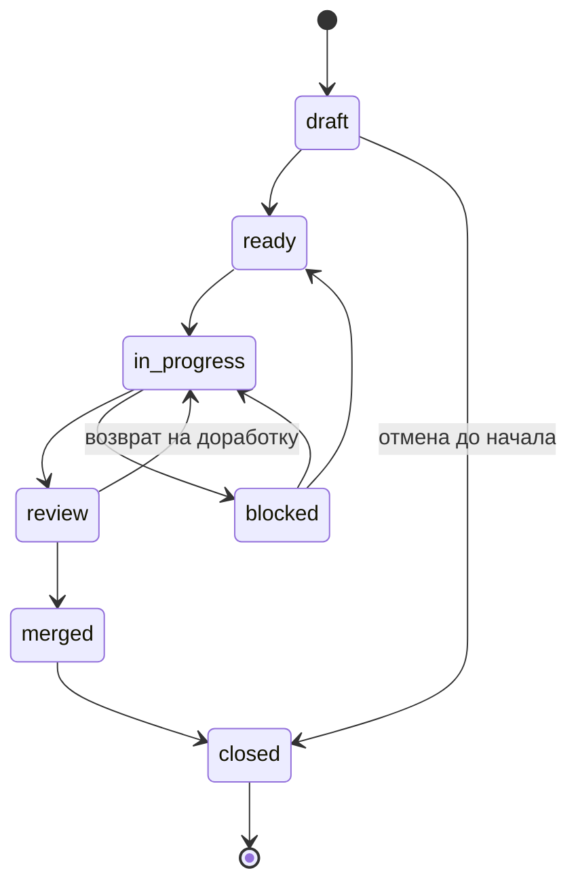

# Issue Workflow

## Назначение

`issue-workflow.md` фиксирует единый жизненный цикл задач (Issue) в
`hybrid-Intelligence-lab`: статусы, правила переходов, связи между артефактами и
точки автоматизации. Цель — сделать выполнение задач предсказуемым и
проверяемым как для человека, так и для AI-агента.

Документ описывает минимальный набор правил, который реально используется в
работе гибридных команд. Он не вводит enterprise-процесс ради полноты дерева
статусов: каждый статус и переход существует, потому что снижает конкретную
операционную боль (см. Anti-Inflation principle в
[governance/repo-model.md](../governance/repo-model.md)).

Терминология сверяется с [standards/glossary.md](glossary.md). Важно различать
несколько независимых понятий:

- **Статус задачи** (этот документ) — где задача находится в рабочем процессе:
  `draft`, `ready`, `in-progress`, `review`, `merged`, `closed`, `blocked`.
- **Maturity артефакта** (`Canonical` / `Draft` в [glossary.md](glossary.md) и
  поле `status` в frontmatter) — насколько сам документ является источником
  истины.
- **Operating Mode задачи** ([glossary.md](glossary.md)) — режим выполнения
  конкретной задачи, а не тип документа.
- **Исполнимость документа** (`executable: false` в этом frontmatter) — этот
  стандарт является справкой процесса, а не протоколом для немедленного
  исполнения.

Это разные оси: задача может быть `in-progress`, её Operating Mode может быть
`Structured`, а создаваемый ею артефакт — ещё `draft` в frontmatter.

## Статусы задач

| Статус | Значение | Когда применять | Кто меняет |
| --- | --- | --- | --- |
| `draft` | Черновик, не готов к работе | Задача создана, но контекст или DoD ещё требуют доработки | Автор |
| `ready` | Готова к исполнению | Контекст полон, DoD измерим, зависимости ясны, выбран Operating Mode | Автор + ревьюер |
| `in-progress` | В работе | Исполнитель (человек или AI-агент) начал работу | Исполнитель |
| `review` | На проверке | Работа завершена, открыт PR, ждёт ревью | Исполнитель |
| `merged` | Принята | Изменения влиты в `main` | Ревьюер |
| `closed` | Завершена | Задача закрыта, документация и навигация обновлены | Автор/Исполнитель |
| `blocked` | Заблокирована | Ждёт внешнюю зависимость или решение | Исполнитель |

Роль исполнителя может выполнять человек или AI-агент, но право на финальные
решения по vision, publication и merge остаётся за человеком согласно
[AI_GOVERNANCE.md](../AI_GOVERNANCE.md). Поэтому переходы в `ready` и `merged`
всегда подтверждаются человеком-ревьюером.

### Технические носители статуса

Минималистичный подход: статус хранится там, где его уже видно в GitHub, без
дублирования.

- **GitHub-метки** (`status:draft`, `status:ready`, `status:in-progress`,
  `status:blocked`) или **поле Status в GitHub Projects** — для открытых задач.
- **Состояние Issue/PR** (`open` / `merged` / `closed`) — для `review`,
  `merged`, `closed`, потому что эти статусы естественно совпадают с состоянием
  PR.

Команда выбирает один носитель для открытых статусов (метки **или** поле
Projects) и не ведёт оба, чтобы не рассинхронизировать данные.

## Правила переходов

Жизненный цикл — это направленный граф с одним основным маршрутом
(`draft → ready → in-progress → review → merged → closed`) и тремя контурами:
возврат на доработку, блокировка и ранняя отмена.



Авторитетная (текстовая) форма тех же правил:

| Из статуса | В статус | Условие перехода | Кто инициирует |
| --- | --- | --- | --- |
| — | `draft` | Создана задача (issue) | Автор |
| `draft` | `ready` | Контекст полон, DoD измерим, зависимости ясны, выбран Operating Mode | Автор + ревьюер |
| `draft` | `closed` | Задача отменена до начала работы | Автор |
| `ready` | `in-progress` | Исполнитель начал работу | Исполнитель |
| `in-progress` | `review` | Артефакты готовы, локальные проверки пройдены, открыт PR | Исполнитель |
| `in-progress` | `blocked` | Появилась внешняя блокирующая зависимость | Исполнитель |
| `blocked` | `in-progress` / `ready` | Блокирующая зависимость снята | Исполнитель |
| `review` | `merged` | Ревью пройдено, изменения влиты в `main` | Ревьюер |
| `review` | `in-progress` | Ревью вернуло задачу на доработку | Исполнитель |
| `merged` | `closed` | Документация, навигация и реестр обновлены | Автор/Исполнитель |

Инварианты:

1. В `in-progress` нельзя войти, минуя `ready`: без полного контекста и DoD
   работа не начинается.
2. В `merged` входят только из `review`: прямой merge без ревью запрещён.
3. `blocked` — это «пауза» на маршруте: задача возвращается туда, откуда была
   заблокирована, и не теряет накопленный контекст.
4. `closed` без `merged` допустим только для задач, отменённых на стадии
   `draft`.

## Связи между артефактами

Задача — это единица traceability. Один и тот же контекст должен прослеживаться
от issue до влитого артефакта.

### Связь с `User Story / ФТ`

Шаблон задачи [.github/ISSUE_TEMPLATE/task.yml](../.github/ISSUE_TEMPLATE/task.yml)
содержит поле `User Story / ФТ`. Задача ссылается на родительскую user story
или функциональное требование по его идентификатору/ссылке. Если связи нет,
поле остаётся `—` (AI-агент не генерирует значение для пустого поля). Это даёт
двустороннюю прослеживаемость: от требования к задачам и обратно.

### Связь с `CHANGELOG.md`

При переходе задачи в `merged` в [CHANGELOG.md](../CHANGELOG.md) добавляется
запись в раздел `## Unreleased` → `### Added` / `### Changed` / `### Removed`.
Запись делается **вручную** в рамках PR (это часть Definition of Done) и
проверяется ревьюером. Автоматизация записи — кандидат на будущее (см. ниже),
но ответственность за формулировку остаётся за исполнителем, потому что
changelog объясняет смысл изменения, а не только факт коммита.

### Связь с `governance/artifact-map.md`

Карта артефактов (`governance/artifact-map.md`) — **планируемый** governance-
артефакт; по Anti-Inflation principle он создаётся только при реальной
повторяющейся потребности связать артефакты в явный граф. Пока его роль
выполняют два активных документа:

- [governance/repo-model.md](../governance/repo-model.md) — где размещается
  артефакт и по какому правилу он создаётся;
- [standards/README.md](README.md) — реестр активных и планируемых стандартов.

Поэтому задача, создающая или меняющая active artifact, при `merged`:

1. размещает артефакт в каталоге по `repo-model.md`;
2. регистрирует его в реестре `standards/README.md` (для стандартов);
3. обновляет навигацию в `README.md`, если артефакт становится частью
   публичного контракта.

Когда `artifact-map.md` появится, эти три шага станут его обновлением; до тех
пор контракт сохраняется через `repo-model.md` + `standards/README.md`.

## Точки автоматизации

Принцип: автоматизируем проверки, которые иначе повторяются вручную и ломаются
от усталости. Решения о смысле (vision, changelog wording, merge) остаются за
человеком.

| Точка | Что проверяется/делается | Сейчас | Чем закрывается |
| --- | --- | --- | --- |
| Вход в `ready` | Заполнены обязательные поля контекста и DoD | Ручная проверка автора + ревьюера | Required fields в [task.yml](../.github/ISSUE_TEMPLATE/task.yml) |
| Вход в `review` | Frontmatter активных `.md` валиден | Скрипт | `./tools/validate-frontmatter.sh .` |
| Вход в `review` | Активные артефакты в нужных каталогах и зарегистрированы | Скрипт | `./tools/validate-repository-structure.sh` |
| Вход в `review` | PR связан с issue | Ручная проверка | PR checklist в [CONTRIBUTING.md](../CONTRIBUTING.md) |
| Вход в `merged` | `CHANGELOG.md` и навигация обновлены | Ручная проверка ревьюера | Definition of Done в [AI_GOVERNANCE.md](../AI_GOVERNANCE.md) |
| Поле `updated` | Проставление даты изменения в frontmatter | Вручную | Кандидат на скрипт-хук (pre-commit / CI) |

Локальные проверки, которые исполнитель запускает перед переходом в `review`:

```bash
./tools/validate-frontmatter.sh .
./tools/validate-repository-structure.sh
```

Кандидаты на будущую автоматизацию (создавать только при повторяющейся боли):

- проставление и обновление `updated` в frontmatter изменённых файлов;
- черновик записи `CHANGELOG.md` из заголовка PR (формулировку правит человек);
- синхронизация GitHub-метки статуса с состоянием связанного PR.

## Источники и адаптация

| Источник | Что адаптировано для репозитория |
| --- | --- |
| [GitHub Docs: planning and tracking with Projects](https://docs.github.com/en/issues/planning-and-tracking-with-projects) | Идея статуса как настраиваемого поля/метки, которое видно в GitHub без отдельного трекера; статус живёт там, где идёт работа. |
| [GitHub Docs: about issues](https://docs.github.com/en/issues/tracking-your-work-with-issues/about-issues) | Issue как единица работы и traceability; связь с PR через состояние `open`/`merged`/`closed`. |
| [Scrum Guide 2020](https://scrumguides.org/scrum-guide.html) | Definition of Done как условие готовности к `review`/`merged`; явное разделение «готова к работе» и «в работе». |
| [Atlassian: Kanban](https://www.atlassian.com/agile/kanban) | Поток статусов и явная стадия `blocked` как сигнал об остановленной работе, а не скрытое ожидание. |
| [NIST AI Risk Management Framework 1.0](https://www.nist.gov/itl/ai-risk-management-framework) | Documented context и human oversight: AI-агент исполняет задачу, человек подтверждает переходы `ready` и `merged`. |

## Связанные документы

- [standards/README.md](README.md)
- [standards/glossary.md](glossary.md)
- [governance/repo-model.md](../governance/repo-model.md)
- [AI_GOVERNANCE.md](../AI_GOVERNANCE.md)
- [CONTRIBUTING.md](../CONTRIBUTING.md)
- [CHANGELOG.md](../CHANGELOG.md)
- [.github/ISSUE_TEMPLATE/task.yml](../.github/ISSUE_TEMPLATE/task.yml)
