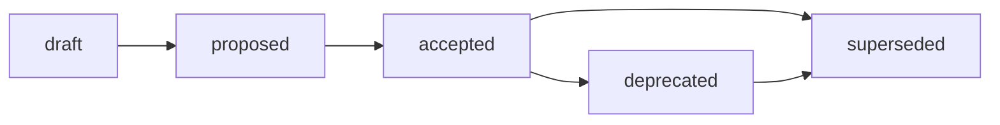

# Research Structure Standard

## Назначение

Этот стандарт задаёт обязательный контракт структуры research-артефактов Хаба:
размещение research-отчётов, контейнер воспроизводимой доказательной базы `exp/`,
запрет обязательной папки `outputs/` и маршрутизацию Research / Analysis / Audit.
Источник принятого решения:
[ADR-003](../docs/adr/2026-07-adr-003-research-structure.md); rationale,
альтернативы и trade-offs:
[RFC B-016](../governance/rfc/2026-06-30-rfc-research-structure.md).

Стандарт является нормативным контрактом (IL-3, документ для человека). Он
фиксирует только то, что ОБЯЗАТЕЛЬНО применять повторяемо. Proposal-контекст,
рассмотренные альтернативы, отклонённые варианты и trade-offs остаются в RFC
B-016 и ЗАПРЕЩЕНО дублировать их здесь.

Базовые frontmatter-правила наследуются из
[Frontmatter Docs Standard](frontmatter-docs-standard.md), а имена файлов — из
[File Naming](file-naming.md). Граница research evidence corpus (`exp/`) vs
operational run record (`runs/`) наследуется из
[ADR-002](../docs/adr/2026-06-adr-002-artifact-document-methodology.md).

## Область применения

Стандарт применяется к работе, которая производит **знание**, а не
production-код: сравнение стандартов и подходов, анализ корпуса данных,
литературный обзор, benchmark, prompt-эксперимент, генерация гипотез и
индустриальных норм за пределами текущих границ репозитория.

| Архетип | Research role |
| --- | --- |
| A. Governance & Knowledge Hub | Research-контур Хаба: `research/<domain>/` и контейнер `exp/`. Этот стандарт нормативен для архетипа A. |
| B. Prompt & Pattern Library | Использует `exp/` только для воспроизводимой evidence base по prompt experiments; локальные prompt runs остаются в operational records проекта. |
| C. Product Spoke / Runtime | Применяет distinction research evidence vs operational run; runtime/pipeline outputs остаются в `runs/` или локальном artifact storage. |
| D. Education / Learning Package | Использует Research / Analysis / Audit routing для curriculum research; evidence для course-wide claims МОЖЕТ ссылаться на `exp/`. |

Routing-следствия для B/C/D закрепляются downstream (см. матрицу дельт RFC
B-016) и не расширяют этот стандарт.

## Identification and Placement

| Элемент | Правило |
| --- | --- |
| Canonical path | `research/<domain>/` для research-отчётов Хаба. |
| Report filename | `YYYY-MM-DD-name.md`, где `YYYY-MM-DD` — дата создания или старта исследования, `name` — короткий `kebab-case` слаг на латинице (см. [file-naming.md](file-naming.md)). |
| Evidence container | `research/<domain>/exp/<issue-slug>/` — единый контейнер воспроизводимой evidence base. |
| Experiment slug | `<issue-slug>` ОБЯЗАН включать номер issue для traceability, например `exp/research-structure-302/`. |
| Direction navigation | `research/<domain>/README.md` — навигация и политики направления. |

Целевая структура направления:

```text
research/<domain>/
  README.md                      # навигация и политики направления
  YYYY-MM-DD-name.md             # research report — основной носитель знания
  YYYY-MM-DD-other.md
  exp/                           # контейнер воспроизводимой evidence base
    <issue-slug>/                # один эксперимент = один issue-slug
      README.md                  # гипотеза, метод, как запустить и воспроизвести
      <script>.py | run.sh       # точка входа эксперимента
      <evidence>.{json,md,csv}   # зафиксированные результаты прогона (плоско)
```

Правила размещения:

- `research/<domain>/YYYY-MM-DD-name.md` — единственный ОБЯЗАТЕЛЬНЫЙ носитель
  research-вывода. Каждое направление ДОЛЖНО иметь такой dated report как
  основной артефакт знания.
- `research/<domain>/exp/<issue-slug>/` — опциональный evidence corpus. Он
  создаётся ТОЛЬКО когда вывод нужно сделать воспроизводимым (scan, benchmark,
  сбор evidence). Каждый эксперимент ДОЛЖЕН ссылаться на родительский dated
  report.
- Россыпь sibling-папок `exp-<slug>/` на уровне отчётов ЗАПРЕЩЕНА для новой
  работы: все эксперименты собираются в единый контейнер `exp/` (переходный
  режим для legacy — см. ниже).

## Frontmatter

Research report ДОЛЖЕН использовать necessary and sufficient frontmatter класса
Research / report из [Frontmatter Docs Standard](frontmatter-docs-standard.md):

```yaml
---
status: draft
version: 0.1
updated: YYYY-MM-DD
temperature: 0.3
---
```

- `status` ДОЛЖЕН использовать **knowledge**-vocabulary:
  `draft`, `reviewed`, `canonical`, `superseded`. Governance-словарь
  (`proposed`, `accepted`) ЗАПРЕЩЁН для research-артефактов.
- Опциональные поля (`owner`, `source`, `scope`, `type`, `context`, `method`,
  `related_*`, `external_artifacts`, `stage`, `projects`, `source_id`,
  `based_on`) добавляются ТОЛЬКО когда улучшают traceability и потребляются
  индексом, валидатором или процессом.
- `README.md` контейнера `exp/<issue-slug>/` наследует базовые четыре поля
  (`status`, `version`, `updated`, `temperature`).
- `ai-generated` ЗАПРЕЩЁН во frontmatter. Provenance фиксируется в issue, PR,
  changelog, audit или session record.

> **Разграничение словарей (lifecycle vs frontmatter).** Правила этой секции
> нормируют frontmatter **research reports** (объект стандарта, путь
> `research/`) — они принадлежат классу Knowledge и используют
> **knowledge-vocabulary**. Сам этот документ — governance-артефакт класса
> `standards/`, поэтому его собственный `status` использует
> **governance-vocabulary** (см. [Lifecycle](#lifecycle)). Это не противоречие:
> `standards/*.md` и `research/*.md` — разные document classes с разными
> словарями статусов per
> [Frontmatter Docs Standard](frontmatter-docs-standard.md) (Status
> Vocabularies). Смешивать словари внутри одного класса ЗАПРЕЩЕНО.

Внешнее research-утверждение (external claim) ОБЯЗАНО в теле отчёта содержать
источник, автора или организацию, ссылку и границы применимости.

## Evidence Container `exp/`: плоская структура, запрет `outputs/`

Внутри `exp/<issue-slug>/` применяется **плоская структура**: `README.md`,
скрипт и зафиксированные результаты лежат рядом.

- Обязательная папка `outputs/` **ЗАПРЕЩЕНА**. Обязательная папка `inputs/`
  **ЗАПРЕЩЕНА**.
- `README.md` эксперимента ОБЯЗАН описывать гипотезу, метод, как запустить и как
  воспроизвести прогон, и ДОЛЖЕН ссылаться на parent dated report.
- Скрипт перезаписывает результаты на месте; git фиксирует дельту прогона.
  Снимок результата остаётся read-only evidence.
- При большом числе входных/выходных файлов РАЗРЕШАЕТСЯ опциональная группировка
  по роли данных (например, `data/`), но обязательная папка `outputs/`
  ЗАПРЕЩЕНА в любом случае. Дефолт — плоско; группировка появляется только при
  реальной операционной боли (Anti-Inflation principle,
  [governance/repo-model.md](../governance/repo-model.md)).

## Граница `exp/` vs `runs/`

`exp/` и `runs/` — разные контейнеры с разной семантикой. ЗАПРЕЩЕНО смешивать
их.

| Контейнер | Назначение | Привязка | Семантика |
| --- | --- | --- | --- |
| `research/<domain>/exp/<issue-slug>/` | Research evidence corpus: воспроизводимая доказательная база, обосновывающая утверждение в research-отчёте. | ВСЕГДА ссылается на parent dated report. | «Докажи знание»: артефакт существует ради knowledge claim. |
| `runs/` | Operational run record: факт выполнения операционной/бизнес-задачи или pipeline (ADR-002). | НЕ обязан быть привязан к research-отчёту. | «Зафиксируй выполнение»: артефакт существует ради записи прогона. |

Нормативный критерий разведения — один вопрос исполнителю:

> Этот артефакт существует, чтобы **доказать утверждение в research-отчёте**
> (→ `exp/`), или чтобы **зафиксировать факт выполнения операционной/бизнес-задачи
> или pipeline** (→ `runs/`)?

Если операционная задача произвела данные, а позже на них проводится
исследование, research-отчёт ДОЛЖЕН **цитировать `runs/` как источник данных** и
ЗАПРЕЩЕНО поглощать run-запись внутрь `exp/`.

## Маршрутизация Research / Analysis / Audit

Тип артефакта ОПРЕДЕЛЯЕТСЯ его содержательной ролью, а **не именем каталога**.
Аудит, спрятанный в `docs/analysis/`, остаётся Audit; research, спрятанный в
`docs/analysis/`, остаётся Research.

| Тип | Главный вопрос | Дом артефакта | Доказательная база |
| --- | --- | --- | --- |
| Research | Что известно и какие варианты существуют за нашей границей? | `research/<domain>/YYYY-MM-DD-name.md` | опц. `research/<domain>/exp/<issue-slug>/` |
| Analysis | Что происходит в нашем локальном/внутреннем контексте? | `docs/analysis/YYYY-MM-DD-name.md` | inline или ссылка на `runs/` |
| Audit | Соответствует ли текущее состояние норме/контракту? | `docs/audit/YYYY-MM-DD-name.md` | воспроизводимые проверки / вывод валидатора |
| Operational / Business run | Запись выполнения задачи/pipeline | `runs/` (ADR-002) | — |

Определения (нормативны для routing):

- **Research** — генерация нового знания, гипотез, индустриальных норм за
  пределами текущих границ.
- **Analysis** — исследование локального/внутреннего контекста без генерации
  нового внешнего знания.
- **Audit** — проверка соответствия существующему стандарту/контракту.

## Классификация на этапе создания задачи

Исполнитель (человек или агент) ОБЯЗАН классифицировать задачу до размещения
артефакта, применяя проверки в этом детерминированном порядке:

1. Проверяем текущее состояние против явной нормы/контракта/checklist →
   **Audit** (`docs/audit/`).
2. Иначе, генерируем или сравниваем НОВОЕ знание (внешние источники, индустрия,
   гипотезы, варианты за границей репо) → **Research**
   (`research/<domain>/` + опц. `exp/`).
3. Иначе, рассуждаем о ЛОКАЛЬНОМ контексте без внешнего знания и без проверки
   нормы → **Analysis** (`docs/analysis/`).
4. Иначе, главный результат — ФАКТ выполнения операционной/бизнес-задачи или
   данные прогона → **Operational run** (`runs/`).

Нормативные тай-брейкеры для граничных кейсов:

- **Research vs Analysis.** Наличие внешних источников, индустриального
  сравнения или проверки гипотезы относит документ к Research; чистое
  рассуждение о внутреннем состоянии — к Analysis. Если документ делает и то, и
  другое, он ДОЛЖЕН быть **разделён** либо классифицирован по доминирующему
  deliverable. Один артефакт ЗАПРЕЩЕНО нормировать как два типа сразу.
- **Analysis vs Audit.** При наличии нормы и семантики
  pass/fail/finding/remediation артефакт классифицируется как Audit, даже если
  файл лежит в `docs/analysis/`.
- **Research vs Operational run.** Артефакт ради knowledge claim → `exp/`;
  артефакт ради записи прогона → `runs/` (см. границу выше).

## Переходный режим для legacy `exp-*`

Этот стандарт не выполняет физическую миграцию (это B-022) и не удаляет
`standards/research-profile.md` (это B-021). До миграции:

- Существующие `research/<domain>/exp-<slug>/` с `outputs/` остаются валидными
  как legacy-compatible. Их формат **заморожен**: он читается однозначно как
  sibling evidence corpus прежнего образца.
- Для **новой** работы ОБЯЗАТЕЛЕН целевой формат — единый контейнер
  `exp/<issue-slug>/` с плоской структурой. Создавать новые sibling `exp-<slug>/`
  или новые обязательные `outputs/` ЗАПРЕЩЕНО.
- Изменение валидаторов под `exp/` и routing выполняется отдельной задачей
  (B-023); enforcement за пределами регистрации артефактов не входит в этот
  стандарт.

## Lifecycle

Этот стандарт как governance-артефакт класса `standards/` подчиняется
**governance-словарю** статусов
(`draft`, `proposed`, `accepted`, `rejected`, `deprecated`, `superseded`).
Это отдельный словарь от **knowledge-vocabulary**
(`draft`, `reviewed`, `canonical`, `superseded`), который стандарт предписывает
для нормируемых им research reports (см. [Frontmatter](#frontmatter)):
`standards/*.md` и `research/*.md` — разные document classes, и каждый использует
свой словарь статусов per
[Frontmatter Docs Standard](frontmatter-docs-standard.md). Пока идёт review, этот
стандарт остаётся в `draft`/`proposed`; `accepted` фиксирует human decision gate.
Он является technical replacement для [research-profile.md](research-profile.md)
как источника правил структуры research; физическое удаление профиля выполняется
в B-021.



Rules:

- Изменение принятой модели структуры research (`exp/`, запрет `outputs/`,
  routing) требует нового RFC/ADR, а не правки этого стандарта.
- `superseded` требует backlink на заменяющий стандарт.

## Validation

Local checks:

```bash
./tools/validate-frontmatter.sh .
./tools/validate-file-naming.sh
./tools/validate-repository-structure.sh
```

Нормативный enforcement принятой модели (`exp/`, запрет `outputs/`, routing)
делегирован обновлению валидаторов (B-023). Расширение валидаторов за пределы
frontmatter, naming и registry checks отслеживается как tech debt в
[governance/backlog.md](../governance/backlog.md).

## Related Artifacts

- [ADR-003: Структура research, контейнер `exp/` и маршрутизация](../docs/adr/2026-07-adr-003-research-structure.md) —
  источник принятого решения.
- [RFC B-016: Структура research, контейнер `exp/` и маршрутизация](../governance/rfc/2026-06-30-rfc-research-structure.md) —
  rationale, alternatives, trade-offs и rejected options.
- [ADR-002: Методология создания и управления артефактами](../docs/adr/2026-06-adr-002-artifact-document-methodology.md) —
  routing `runs/` и граница operational run record.
- [research-profile.md](research-profile.md) — legacy профиль; technical
  replacement задаёт этот стандарт, удаление выполняется в B-021.
- [frontmatter-docs-standard.md](frontmatter-docs-standard.md) — контракт
  frontmatter по классам документов.
- [file-naming.md](file-naming.md) — дата-первое именование.
- [governance/backlog.md](../governance/backlog.md) — цепочка B-016..B-023.
- Issues
  [#294](https://github.com/G-Ivan-A/hybrid-Intelligence-lab/issues/294) (зонтичная
  задача стандартизации research),
  [#290](https://github.com/G-Ivan-A/hybrid-Intelligence-lab/issues/290) (коллизия
  `outputs/` vs `runs/`),
  [#288](https://github.com/G-Ivan-A/hybrid-Intelligence-lab/issues/288) (размытие
  типов Research / Analysis / Audit),
  [#318](https://github.com/G-Ivan-A/hybrid-Intelligence-lab/issues/318)
  (создание этого стандарта, B-018).
</content>
</invoke>
