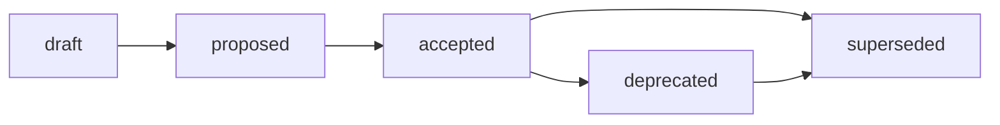
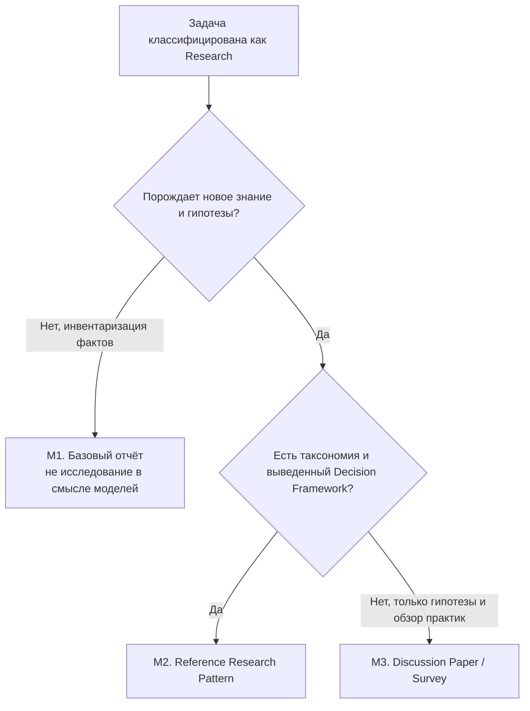

# Research Structure Standard

## Purpose

Этот стандарт задаёт обязательную структуру research-артефактов Хаба:
размещение research-отчётов, контейнер воспроизводимой доказательной базы `exp/`,
запрет обязательной папки `outputs/`, маршрутизацию Research / Analysis / Audit и
выбор модели research-артефакта (M1–M3) исполнителем.
Источник принятого решения о структуре:
[ADR-003](../docs/adr/2026-07-adr-003-research-structure.md); rationale,
альтернативы и trade-offs:
[RFC B-016](../docs/rfc/2026-06-30-rfc-research-structure.md). Источник принятого
решения о моделях формы и о статусе `Validated` паттерна RRP:
[ADR-011](../docs/adr/2026-08-adr-011-research-models.md).

Стандарт — это IL-3 reusable rule о форме research-артефактов, размещении
evidence и routing-критериях. Он не является Contract: операционные контракты
могут ссылаться на этот стандарт как на обязательное правило оформления, но не
подменяют его семантику. Он фиксирует только то, что ОБЯЗАТЕЛЬНО применять
повторяемо. Proposal-контекст, рассмотренные альтернативы, отклонённые варианты
и trade-offs остаются в RFC B-016 и ЗАПРЕЩЕНО дублировать их здесь.

Базовые frontmatter-правила наследуются из
[Frontmatter Docs Standard](frontmatter-docs-standard.md), а имена файлов — из
[File Naming](file-naming.md). Граница research evidence corpus (`exp/`) vs
operational run record (`runs/`) наследуется из
[ADR-002](../docs/adr/2026-06-adr-002-artifact-document-methodology.md).

## Scope

Стандарт применяется к работе, которая производит **знание**, а не
production-код: сравнение стандартов и подходов, анализ корпуса данных,
литературный обзор, benchmark, prompt-эксперимент, генерация гипотез и
индустриальных норм за пределами текущих границ репозитория.

| Архетип | Research role |
| --- | --- |
| A. Governance & Knowledge Hub | Research-контур Хаба: `research/<domain>/` и контейнер `exp/`. Этот стандарт нормативен для архетипа A. |
| B. Prompt & Pattern Library | Использует `exp/` только для воспроизводимой evidence base по prompt experiments; локальные prompt runs остаются в operational records проекта. |
| C. Product Spoke / Runtime | Применяет distinction research evidence vs operational run; runtime/pipeline outputs остаются в `runs/` или локальном artifact storage. |
| D. Education / Learning Package | Использует Research / Analysis / Audit routing для curriculum research; evidence для course-wide claims МОЖЕТ ссылаться на `exp/`. |

Routing-следствия для B/C/D закрепляются downstream (см. матрицу дельт RFC
B-016) и не расширяют этот стандарт.

## Identification and Placement

| Элемент | Правило |
| --- | --- |
| Canonical path | `research/<domain>/` для research-отчётов Хаба. |
| Report filename | `YYYY-MM-DD-name.md`, где `YYYY-MM-DD` — дата создания или старта исследования, `name` — короткий `kebab-case` слаг на латинице (см. [file-naming.md](file-naming.md)). |
| Evidence container | `research/<domain>/exp/<issue-slug>/` — единый контейнер воспроизводимой evidence base. |
| Experiment slug | `<issue-slug>` ОБЯЗАН включать номер issue для traceability, например `exp/research-structure-302/`. |
| Direction navigation | `research/<domain>/README.md` — навигация и политики направления. |

Целевая структура направления:

```text
research/<domain>/
  README.md                      # навигация и политики направления
  YYYY-MM-DD-name.md             # research report — основной носитель знания
  YYYY-MM-DD-other.md
  exp/                           # контейнер воспроизводимой evidence base
    <issue-slug>/                # один эксперимент = один issue-slug
      README.md                  # гипотеза, метод, как запустить и воспроизвести
      <script>.py | run.sh       # точка входа эксперимента
      <evidence>.{json,md,csv}   # зафиксированные результаты прогона (плоско)
```

Правила размещения:

- `research/<domain>/YYYY-MM-DD-name.md` — единственный ОБЯЗАТЕЛЬНЫЙ носитель
  research-вывода. Каждое направление ДОЛЖНО иметь такой dated report как
  основной артефакт знания.
- `research/<domain>/exp/<issue-slug>/` — опциональный evidence corpus. Он
  создаётся ТОЛЬКО когда вывод нужно сделать воспроизводимым (scan, benchmark,
  сбор evidence). Каждый эксперимент ДОЛЖЕН ссылаться на родительский dated
  report.
- Россыпь sibling-папок `exp-<slug>/` на уровне отчётов ЗАПРЕЩЕНА для новой
  работы: все эксперименты собираются в единый контейнер `exp/` (переходный
  режим для legacy — см. ниже).

## Frontmatter

Research report ДОЛЖЕН использовать necessary and sufficient frontmatter класса
Research / report из [Frontmatter Docs Standard](frontmatter-docs-standard.md):

```yaml
---
status: draft
version: 0.1
updated: YYYY-MM-DD
temperature: 0.3
---
```

- `status` ДОЛЖЕН использовать **knowledge**-vocabulary:
  `draft`, `reviewed`, `canonical`, `superseded`. Governance-словарь
  (`proposed`, `accepted`) ЗАПРЕЩЁН для research-артефактов.
- Опциональные поля (`owner`, `source`, `scope`, `type`, `context`, `method`,
  `related_*`, `external_artifacts`, `stage`, `projects`, `source_id`,
  `based_on`) добавляются ТОЛЬКО когда улучшают traceability и потребляются
  индексом, валидатором или процессом.
- `README.md` контейнера `exp/<issue-slug>/` наследует базовые четыре поля
  (`status`, `version`, `updated`, `temperature`).
- `ai-generated` ЗАПРЕЩЁН во frontmatter. Provenance фиксируется в issue, PR,
  changelog, audit или session record.

> **Разграничение словарей (lifecycle vs frontmatter).** Правила этой секции
> нормируют frontmatter **research reports** (объект стандарта, путь
> `research/`) — они принадлежат классу Knowledge и используют
> **knowledge-vocabulary**. Сам этот документ — governance-артефакт класса
> `standards/`, поэтому его собственный `status` использует
> **governance-vocabulary** (см. [Lifecycle](#lifecycle)). Это не противоречие:
> `standards/*.md` и `research/*.md` — разные document classes с разными
> словарями статусов per
> [Frontmatter Docs Standard](frontmatter-docs-standard.md) (Status
> Vocabularies). Смешивать словари внутри одного класса ЗАПРЕЩЕНО.

Внешнее research-утверждение (external claim) ОБЯЗАНО в теле отчёта содержать
источник, автора или организацию, ссылку и границы применимости.

## Minimum Body Sections

`N/A`. Этот стандарт нормирует размещение, evidence-контейнер и routing
research-артефактов, а не фиксированный H2-каркас внутри самого research-отчёта.
Обязательный минимум содержания research report (источник, автор, ссылка и
границы применимости внешнего claim) задан в разделе [Frontmatter](#frontmatter)
и в правилах размещения [Identification and Placement](#identification-and-placement),
а не отдельным списком инвариантных секций отчёта. Поэтому раздел неприменим в
смысле «минимальное ядро секций нормируемого артефакта».

## Type Model

Стандарт вводит **модель зрелости**, а не профили подтипов: research-артефакт
имеет три формы — M1 базовый датированный отчёт, M2 Reference Research Pattern
и M3 Discussion Paper / Survey. Источник модели —
[ADR-011](../docs/adr/2026-08-adr-011-research-models.md) (D1, D2); полные
критерии и обязательные элементы каждой формы вынесены в
[Три модели research-артефакта](#три-модели-research-артефакта), алгоритм выбора —
в [Gate выбора модели исследования](#gate-выбора-модели-исследования).

Форма — это **зрелость темы, а не глубина или качество** работы: M3 — легитимный
конечный результат, а не недоделанный M2. Различия
Research / Analysis / Audit в модель форм НЕ входят: это routing между разными
стандартами (см.
[Маршрутизация Research / Analysis / Audit](#маршрутизация-research--analysis--audit)),
а `Analysis` — отдельный тип артефакта со своим
[ADR-006](../docs/adr/2026-07-adr-006-analysis-structure.md) и
[analysis-standard.md](analysis-standard.md), а не ступень одного ряда.

## Lifecycle

Этот стандарт как governance-артефакт класса `standards/` подчиняется
**governance-словарю** статусов
(`draft`, `proposed`, `accepted`, `rejected`, `deprecated`, `superseded`).
Это отдельный словарь от **knowledge-vocabulary**
(`draft`, `reviewed`, `canonical`, `superseded`), который стандарт предписывает
для нормируемых им research reports (см. [Frontmatter](#frontmatter)):
`standards/*.md` и `research/*.md` — разные document classes, и каждый использует
свой словарь статусов per
[Frontmatter Docs Standard](frontmatter-docs-standard.md). Пока идёт review, этот
стандарт остаётся в `draft`/`proposed`; `accepted` фиксирует human decision gate.
Он является technical replacement для `research-profile.md`
как источника правил структуры research; физическое удаление профиля выполняется
в B-021.


```mermaid
flowchart LR
    Draft[draft] --> Proposed[proposed]
    Proposed --> Accepted[accepted]
    Accepted --> Deprecated[deprecated]
    Accepted --> Superseded[superseded]
    Deprecated --> Superseded
```

Rules:

- Изменение принятой модели структуры research (`exp/`, запрет `outputs/`,
  routing) требует нового RFC/ADR, а не правки этого стандарта.
- `superseded` требует backlink на заменяющий стандарт.

## Boundaries

[ADR-002](../docs/adr/2026-06-adr-002-artifact-document-methodology.md) остаётся
canonical owner общей таблицы artifact boundary и routing; этот стандарт её не
переопределяет и не дублирует. Локальная delta research-стандарта — две границы,
которые он владеет содержательно: research evidence corpus (`exp/`) vs
operational run record (`runs/`) и routing Research / Analysis / Audit по
содержательной роли артефакта. Их полные таблицы вынесены в specific tail (см.
[Граница `exp/` vs `runs/`](#граница-exp-vs-runs) и
[Маршрутизация Research / Analysis / Audit](#маршрутизация-research--analysis--audit))
и здесь не повторяются.

## Validation

Local checks:

```bash
./tools/validate-frontmatter.sh .
./tools/validate-file-naming.sh
./tools/validate-repository-structure.sh
```

Нормативный enforcement принятой модели (`exp/`, запрет `outputs/`, routing)
делегирован обновлению валидаторов (B-023). Расширение валидаторов за пределы
frontmatter, naming и registry checks отслеживается как tech debt в
[ops/backlog.md](../ops/backlog.md).

## Related Artifacts

- [Standard Meta-Structure Standard](standard-meta-structure.md) — F10-скелет,
  которому соответствует структура этого стандарта (B-052/B-053).
- [ADR-008: Мета-структура стандартов](../docs/adr/2026-07-adr-008-standard-meta-structure.md) —
  источник правила F10 и смягчённого правила specific-tail cross-reference.
- [ADR-003: Структура research, контейнер `exp/` и маршрутизация](../docs/adr/2026-07-adr-003-research-structure.md) —
  источник принятого решения о структуре research.
- [ADR-011: Модели research-артефакта](../docs/adr/2026-08-adr-011-research-models.md) —
  источник принятого решения о трёх формах research (M1–M3) и о статусе
  `Validated` паттерна RRP (D6).
- [RFC Reference Research Pattern](../docs/rfc/2026-07-17-rfc-reference-research-pattern.md) —
  SSOT структуры и статуса модели M2; этот стандарт её не переопределяет, а
  маршрутизирует.
- [standards/glossary.md](glossary.md) — термины `Reference Research Pattern (RRP)`,
  `Discussion Paper / Survey`, `Research Method`, `Domain Methodology`.
- [RFC B-016: Структура research, контейнер `exp/` и маршрутизация](../docs/rfc/2026-06-30-rfc-research-structure.md) —
  rationale, alternatives, trade-offs и rejected options.
- [ADR-002: Методология создания и управления артефактами](../docs/adr/2026-06-adr-002-artifact-document-methodology.md) —
  routing `runs/` и граница operational run record.
- `research-profile.md` — legacy профиль; technical
  replacement задаёт этот стандарт, удаление выполняется в B-021.
- [frontmatter-docs-standard.md](frontmatter-docs-standard.md) — контракт
  frontmatter по классам документов.
- [file-naming.md](file-naming.md) — дата-первое именование.
- [ops/backlog.md](../ops/backlog.md) — цепочка B-016..B-023.
- Issues
  [#294](https://github.com/G-Ivan-A/hybrid-Intelligence-lab/issues/294) (зонтичная
  задача стандартизации research),
  [#290](https://github.com/G-Ivan-A/hybrid-Intelligence-lab/issues/290) (коллизия
  `outputs/` vs `runs/`),
  [#288](https://github.com/G-Ivan-A/hybrid-Intelligence-lab/issues/288) (размытие
  типов Research / Analysis / Audit),
  [#318](https://github.com/G-Ivan-A/hybrid-Intelligence-lab/issues/318)
  (создание этого стандарта, B-018).

## Evidence Container `exp/`: плоская структура, запрет `outputs/`

Этот раздел реализует границу применимости из [Scope](#scope) и запрет из
[Purpose](#purpose): контейнер воспроизводимой evidence base, объявленный как
опциональный носитель доказательств, получает здесь свою обязательную форму.
Внутри `exp/<issue-slug>/` применяется **плоская структура**: `README.md`,
скрипт и зафиксированные результаты лежат рядом.

- Обязательная папка `outputs/` **ЗАПРЕЩЕНА**. Обязательная папка `inputs/`
  **ЗАПРЕЩЕНА**.
- `README.md` эксперимента ОБЯЗАН описывать гипотезу, метод, как запустить и как
  воспроизвести прогон, и ДОЛЖЕН ссылаться на parent dated report.
- Скрипт перезаписывает результаты на месте; git фиксирует дельту прогона.
  Снимок результата остаётся read-only evidence.
- При большом числе входных/выходных файлов РАЗРЕШАЕТСЯ опциональная группировка
  по роли данных (например, `data/`), но обязательная папка `outputs/`
  ЗАПРЕЩЕНА в любом случае. Дефолт — плоско; группировка появляется только при
  реальной операционной боли (Anti-Inflation principle,
  [ops/repo-model.md](../ops/repo-model.md)).

## Граница `exp/` vs `runs/`

Этот раздел раскрывает границу, объявленную в [Purpose](#purpose) как
наследуемую из ADR-002. `exp/` и `runs/` — разные контейнеры с разной
семантикой. ЗАПРЕЩЕНО смешивать их.

| Контейнер | Назначение | Привязка | Семантика |
| --- | --- | --- | --- |
| `research/<domain>/exp/<issue-slug>/` | Research evidence corpus: воспроизводимая доказательная база, обосновывающая утверждение в research-отчёте. | ВСЕГДА ссылается на parent dated report. | «Докажи знание»: артефакт существует ради knowledge claim. |
| `runs/` | Operational run record: факт выполнения операционной/бизнес-задачи или pipeline (ADR-002). | НЕ обязан быть привязан к research-отчёту. | «Зафиксируй выполнение»: артефакт существует ради записи прогона. |

Нормативный критерий разведения — один вопрос исполнителю:

> Этот артефакт существует, чтобы **доказать утверждение в research-отчёте**
> (→ `exp/`), или чтобы **зафиксировать факт выполнения операционной/бизнес-задачи
> или pipeline** (→ `runs/`)?

Если операционная задача произвела данные, а позже на них проводится
исследование, research-отчёт ДОЛЖЕН **цитировать `runs/` как источник данных** и
ЗАПРЕЩЕНО поглощать run-запись внутрь `exp/`.

## Маршрутизация Research / Analysis / Audit

Этот раздел реализует routing-критерии, заявленные в [Purpose](#purpose), и
границу «знание vs production-код» из [Scope](#scope). Тип артефакта
ОПРЕДЕЛЯЕТСЯ его содержательной ролью, а **не именем каталога**. Аудит, спрятанный
в `docs/analysis/`, остаётся Audit; research, спрятанный в `docs/analysis/`,
остаётся Research.

| Тип | Главный вопрос | Дом артефакта | Доказательная база |
| --- | --- | --- | --- |
| Research | Что известно и какие варианты существуют за нашей границей? | `research/<domain>/YYYY-MM-DD-name.md` | опц. `research/<domain>/exp/<issue-slug>/` |
| Analysis | Что происходит в нашем локальном/внутреннем контексте? | `docs/analysis/YYYY-MM-DD-name.md` | inline или ссылка на `runs/` |
| Audit | Соответствует ли текущее состояние норме/контракту? | `docs/audit/YYYY-MM-DD-name.md` | воспроизводимые проверки / вывод валидатора |
| Operational / Business run | Запись выполнения задачи/pipeline | `runs/` (ADR-002) | — |

Определения (нормативны для routing):

- **Research** — генерация нового знания, гипотез, индустриальных норм за
  пределами текущих границ.
- **Analysis** — исследование локального/внутреннего контекста без генерации
  нового внешнего знания.
- **Audit** — проверка соответствия существующему стандарту/контракту.

## Классификация на этапе создания задачи

Этот раздел операционализирует routing из [Scope](#scope): исполнитель (человек
или агент) ОБЯЗАН классифицировать задачу до размещения артефакта, применяя
проверки в этом детерминированном порядке:

1. Проверяем текущее состояние против явной нормы/контракта/checklist →
   **Audit** (`docs/audit/`).
2. Иначе, генерируем или сравниваем НОВОЕ знание (внешние источники, индустрия,
   гипотезы, варианты за границей репо) → **Research**
   (`research/<domain>/` + опц. `exp/`).
3. Иначе, рассуждаем о ЛОКАЛЬНОМ контексте без внешнего знания и без проверки
   нормы → **Analysis** (`docs/analysis/`).
4. Иначе, главный результат — ФАКТ выполнения операционной/бизнес-задачи или
   данные прогона → **Operational run** (`runs/`).

Нормативные тай-брейкеры для граничных кейсов:

- **Research vs Analysis.** Наличие внешних источников, индустриального
  сравнения или проверки гипотезы относит документ к Research; чистое
  рассуждение о внутреннем состоянии — к Analysis. Если документ делает и то, и
  другое, он ДОЛЖЕН быть **разделён** либо классифицирован по доминирующему
  deliverable. Один артефакт ЗАПРЕЩЕНО нормировать как два типа сразу.
- **Analysis vs Audit.** При наличии нормы и семантики
  pass/fail/finding/remediation артефакт классифицируется как Audit, даже если
  файл лежит в `docs/analysis/`.
- **Research vs Operational run.** Артефакт ради knowledge claim → `exp/`;
  артефакт ради записи прогона → `runs/` (см. границу выше).

## Три модели research-артефакта

Этот раздел раскрывает [Type Model](#type-model) и реализует решение
[ADR-011](../docs/adr/2026-08-adr-011-research-models.md) (D1, D2). Модель
выбирается **зрелостью темы**, а не объёмом текста и не точкой входа
исполнителя. Все три формы размещаются по правилам
[Identification and Placement](#identification-and-placement); новых каталогов и
правил именования модель форм не вводит.

| Модель | Что это | Обязательные элементы | Форма выхода | Статус |
| --- | --- | --- | --- | --- |
| **M1. Базовый research-отчёт** | Модель по умолчанию: изучение внешнего вопроса с собственной доказательной базой (сравнение, benchmark, prompt-эксперимент, разбор корпуса) | Датированный отчёт; у каждого внешнего claim — источник, автор/организация, ссылка и границы применимости; воспроизводимость выводов | `research/<domain>/YYYY-MM-DD-name.md` + опц. `exp/<issue-slug>/` | норма этого стандарта |
| **M2. Reference Research Pattern (RRP)** | Зрелое исследование домена, результат которого обязан быть воспроизводимой методологией | Theory, Taxonomy, **Decision Framework**, Practice, Open Questions — модуль из шести файлов; практика ссылается на своё основание (правило P2) | `research/<domain>/00-introduction.md` … `50-open-research.md` | `Validated` (ADR-011, D6; SSOT структуры — [RFC RRP](../docs/rfc/2026-07-17-rfc-reference-research-pattern.md)) |
| **M3. Discussion Paper / Survey** | Поисковое исследование ранней стадии: пространство решений в теме ещё не выделено, работа обозревает индустриальные практики и порождает гипотезы | (1) явная маркировка предварительного статуса — `status: draft` и строка в теле о том, что выводы предварительны и нормой не являются; (2) обзор индустриальных практик со ссылкой на конкретный внешний источник у каждого claim; (3) гипотезы, текстуально отделённые от установленных фактов | `research/<domain>/YYYY-MM-DD-name.md` | принята ADR-011 (D2) |

Правила модели форм:

- Для M3 НЕ требуются полная таксономия, Decision Framework, шестифайловая
  структура и собственный эксперимент в `exp/`. Достраивать их «ради формы»
  ЗАПРЕЩЕНО: неполный RRP хуже честного Discussion Paper.
- M2 ЗАПРЕЩЕНО применять к теме, в которой Decision Framework пришлось бы
  **выдумать**, а не вывести из материала.
- **Промоушен M3 → M2** (ADR-011, D3): когда в теме появились таксономия и рамка
  решений, исследование развёртывается в модуль RRP; исходный отчёт получает
  `status: superseded` и backlink на модуль. Обратного перехода нет.
- `Validated` у M2 означает, что на форму РАЗРЕШЕНО ссылаться как на
  нормативную модель зрелого исследования. Обязательной для любого research она
  не становится: модель по умолчанию — M1.
- Четвёртая модель не вводится (Anti-Inflation, ADR-011 D4). Тема, которая не
  ложится ни в одну из трёх форм без искажения смысла, эскалируется новым
  RFC/ADR, а не расширением этого раздела.

## Gate выбора модели исследования

Этот раздел операционализирует [Type Model](#type-model) и применяется **после**
того, как задача классифицирована как Research в разделе
[Классификация на этапе создания задачи](#классификация-на-этапе-создания-задачи).
Gate отвечает на второй вопрос — какую форму получит артефакт.

**Decision Tree** (проверки применяются в этом порядке, срабатывает первая
подходящая):

1. Работа **не порождает нового внешнего знания и новых гипотез**, а
   инвентаризирует существующие факты → это НЕ research: маршрут — базовый
   отчёт/`Analysis` по правилам раздела
   [Маршрутизация Research / Analysis / Audit](#маршрутизация-research--analysis--audit).
   Внутри research такая работа оформляется как **M1** (датированный отчёт) и
   ЗАПРЕЩЕНО раздувать её до модуля.
2. Иначе, тема **зрелая**: пространство решений выделено, у темы есть таксономия
   и Decision Framework, **выведенный из материала**, а результат обязан быть
   воспроизводимой методологией → **M2 (RRP)**, модуль из шести файлов.
3. Иначе, тема **поисковая**: есть только гипотезы и обзор индустриальных
   практик, таксономию и рамку решений пришлось бы выдумать → **M3 (Discussion
   Paper / Survey)** с обязательной маркировкой предварительного статуса.


```mermaid
flowchart TD
    Start[Задача классифицирована как Research] --> Q1{Порождает новое знание и гипотезы?}
    Q1 -- Нет, инвентаризация фактов --> M1[M1. Базовый отчёт<br/>не исследование в смысле моделей]
    Q1 -- Да --> Q2{Есть таксономия и выведенный Decision Framework?}
    Q2 -- Да --> M2[M2. Reference Research Pattern]
    Q2 -- Нет, только гипотезы и обзор практик --> M3[M3. Discussion Paper / Survey]
```

Решающий тай-брейкер между M2 и M3 — **выведен ли Decision Framework из
материала или его пришлось бы выдумать**, а не объём текста и не число файлов.

`Analysis` в это дерево не входит ни как ступень, ни как «неглубокий research»:
это отдельный тип артефакта со своим
[ADR-006](../docs/adr/2026-07-adr-006-analysis-structure.md), стандартом
[analysis-standard.md](analysis-standard.md) и домом `docs/analysis/`
(ADR-011, ограничение контекста 1). Граница проходит по типу, а не по глубине.

### Правило маршрутизации для исполнителя

Модель исследования задаётся параметром `research_model` в **Контракте задачи**.
Дом Контракта — каталог реализации: проект или направление исследования, к
которому относится задача (`research/<domain>/`, каталог проекта-спока и т. п.).
Если Контракта в доме реализации нет, действует шаблон задачи, по которому задача
поставлена.

Порядок применения ОБЯЗАТЕЛЕН:

1. `research_model` в Контракте дома реализации заполнен → исполнитель применяет
   указанную модель. Отклонение от неё требует явного согласования в issue или PR.
2. Контракта в доме реализации нет → `research_model` берётся из шаблона задачи.
3. `research_model` **не заполнен или не определён** ни там, ни там → исполнитель
   **сам выбирает модель** по Decision Tree этого раздела и **обязан явно
   обосновать выбор в описании PR**: какая ветка дерева сработала и на каком
   признаке (наличие выведенного Decision Framework, зрелость темы, отсутствие
   новых гипотез).

Обоснование выбора в описании PR — часть Definition of Done такой задачи.
Молчаливый выбор формы («сделал модуль, потому что так делали раньше») ЗАПРЕЩЁН:
именно он возвращает misrouting, ради устранения которого принят
[ADR-011](../docs/adr/2026-08-adr-011-research-models.md).

## Переходный режим для legacy `exp-*`

Этот раздел ограничивает применение формы `exp/` из [Scope](#scope) для
существующих артефактов. Стандарт не выполняет физическую миграцию (это B-022) и
не удаляет `standards/research-profile.md` (это B-021). До миграции:

- Существующие `research/<domain>/exp-<slug>/` с `outputs/` остаются валидными
  как legacy-compatible. Их формат **заморожен**: он читается однозначно как
  sibling evidence corpus прежнего образца.
- Для **новой** работы ОБЯЗАТЕЛЕН целевой формат — единый контейнер
  `exp/<issue-slug>/` с плоской структурой. Создавать новые sibling `exp-<slug>/`
  или новые обязательные `outputs/` ЗАПРЕЩЕНО.
- Изменение валидаторов под `exp/` и routing выполняется отдельной задачей
  (B-023); enforcement за пределами регистрации артефактов не входит в этот
  стандарт.
