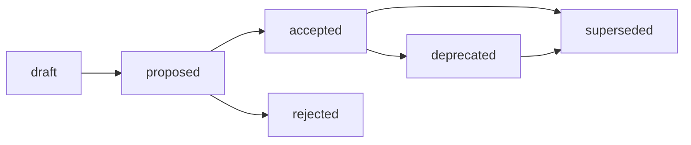

# RFC Structure Standard

## Назначение

Этот стандарт задаёт обязательный контракт RFC-like документов для Хаба и
архетипов A/B/C/D. Источник решения:
[RFC: Стандарт структуры RFC](../governance/rfc/2026-06-27-rfc-rfc-standard.md).

Стандарт является нормативным контрактом. Proposal-контекст, alternatives и
trade-offs остаются в RFC; этот файл фиксирует только то, что нужно применять
повторяемо.

Базовые frontmatter-правила наследуются из
[Frontmatter Docs Standard](frontmatter-docs-standard.md), а имена файлов - из
[File Naming](file-naming.md).

## Область применения

RFC используется, когда значимое изменение требует proposal-stage review,
альтернатив, trade-offs и явного decision path до внедрения.

| Архетип | RFC role |
| --- | --- |
| A. Governance & Knowledge Hub | Governance proposal для standards, lifecycle, artifact routing, AI contracts и cross-repository methodology. |
| B. Prompt & Pattern Library | Micro-RFC / Design Note для reusable prompt patterns, taxonomy, evaluation и workflow governance. |
| C. Product Spoke / Runtime | Product Design Proposal для public API, plugin contracts, migrations, compatibility и product architecture. |
| D. Education / Learning Package | Curriculum RFC для course-wide taxonomy, outcomes, assessment model и contribution policy. |

Library/SDK относится к профилю архетипа C, а не к отдельному архетипу.

## Identification and Placement

| Элемент | Правило |
| --- | --- |
| Current Hub path | `governance/rfc/`. |
| Future HTOM/spoke path | `docs/rfc/`, если repo follows ADR-002 target structure. |
| Hub filename | `YYYY-MM-DD-rfc-short-title.md` for new dated governance RFCs; legacy names stay unchanged. |
| Spoke filename | `YYYY-MM-name.md` or `YYYY-name.md` until local validator says otherwise. |
| Stable reference | Link path plus heading; future numeric RFC ids require index/tooling. |
| Canonical delegation | Standard/template/validator/practice/ADR after human decision, not automatic. |

## Frontmatter

RFC ДОЛЖЕН использовать necessary and sufficient frontmatter:

```yaml
---
status: draft
version: 0.1
updated: YYYY-MM-DD
temperature: 0.1
owner: Human owner or owning group
rfc-scope: A | B | C | D | multi
---
```

`status` ДОЛЖЕН использовать governance vocabulary из
[Frontmatter Docs Standard](frontmatter-docs-standard.md):
`draft`, `proposed`, `accepted`, `rejected`, `deprecated`, `superseded`.

Frontmatter `status` является единственным machine-readable canon. Body-level
`RFC status` МОЖЕТ повторять его только как narrative summary.

`owner` and `rfc-scope` are mandatory YAML because validator and governance
routing consume them. `impacted-artifacts`, decision links and implementation
links remain in body-level `RFC Metadata` unless a future index consumes them.

`ai-generated` ЗАПРЕЩЁН во frontmatter. Provenance фиксируется в issue, PR,
changelog, audit или session record.

## Required Body Sections

RFC ДОЛЖЕН содержать секции в таком порядке:

1. `RFC Metadata`
2. `Summary`
3. `Motivation`
4. `Goals and Non-goals`
5. `Proposal`
6. `Alternatives`
7. `Trade-offs`
8. `Impacted Artifacts`
9. `Implementation and Validation`
10. `Lifecycle and Decision Path`
11. `Open Questions`
12. `Related Artifacts`

Минимальный шаблон:

```markdown
# RFC: Short proposal title

## RFC Metadata

| Field | Value |
| --- | --- |
| Owner | Human owner or owning group |
| RFC status | same as frontmatter status; narrative summary only |
| Source issue | Issue link |
| Impacted artifacts | Paths or "none" |
| Decision record | ADR/RFC link or "not yet" |
| Implementation link | PR/tool/standard link or "not yet" |
| Archetype scope | A / B / C / D / multi |

## Summary

One-paragraph proposal.

## Motivation

Problem, current pain, and why issue/PR text is insufficient.

## Goals and Non-goals

What this RFC decides and explicitly does not decide.

## Proposal

The selected solution, stated as a decision draft rather than a menu.

## Alternatives

Rejected alternatives and the reason each one fails.

## Trade-offs

Costs, risks, compatibility and operational impact.

## Impacted Artifacts

Files, standards, templates, validators, docs, projects or "none".

## Implementation and Validation

How the proposal is applied and how local checks prove it.

## Lifecycle and Decision Path

Current state, required human gate, and post-acceptance delegation.

## Open Questions

Only questions that block acceptance or implementation.

## Related Artifacts

Research, ADRs, standards, PRs and issue links.
```

## Lifecycle

Allowed RFC transitions:



Rules:

- Move to `proposed` only when required sections are complete and local
  validation passes.
- Move to `accepted` only by human decision.
- Move to `accepted` only when `Open Questions` is empty or contains only
  explicitly non-blocking questions.
- Record implementation state in `Implementation and Validation` after impacted
  artifacts, validators or docs are updated.
- Move to `superseded` only with a replacement link.

## Archetype Deltas

| Архетип | Required deltas | Avoid |
| --- | --- | --- |
| A | Require owner, impacted artifacts, alternatives, trade-offs, decision path, validation and RFC/ADR boundary. | Do not require RFC for typo fixes, link-only cleanup or small local implementation changes. |
| B | Require failed case or experiment evidence, affected prompts/patterns, evaluation and rollout/backout. | Do not RFC every prompt wording change or temporary experiment. |
| C | Require release impact, backward compatibility, migration, testing and owner. | Do not duplicate feature specs or sprint tickets. |
| D | Require learner impact, curriculum migration, assessment impact and review cycle. | Do not RFC individual lesson edits or small content corrections. |

## Boundary RFC/ADR

| Case | Rule |
| --- | --- |
| Proposal has open alternatives, high governance impact or cross-repository consequences. | RFC first. |
| Accepted proposal needs a concise accepted decision record before becoming standard/template/tool/practice. | RFC -> ADR. |
| Accepted RFC already has final decision, rationale, alternatives and consequences, and no separate standard is produced. | Accepted RFC itself is the decision record. |
| Decision is narrow, already accepted or primarily records "why" after a choice. | ADR without RFC. |
| Change is implementation-local and reversible. | Issue/PR is enough; no RFC or ADR. |

The boundary is functional, not folder-based. A document in `governance/rfc/`
is still a proposal unless its status and human decision say otherwise.

## Validation

Local checks:

```bash
./tools/validate-frontmatter.sh .
./tools/validate-file-naming.sh
./tools/validate-repository-structure.sh
```

Validator expansion beyond frontmatter, naming and registry checks is tracked as
tech debt in [governance/backlog.md](../governance/backlog.md).
