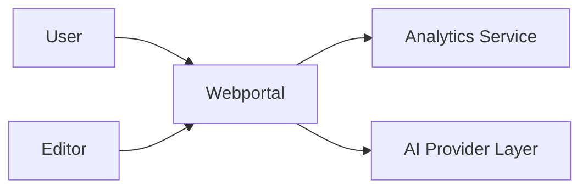
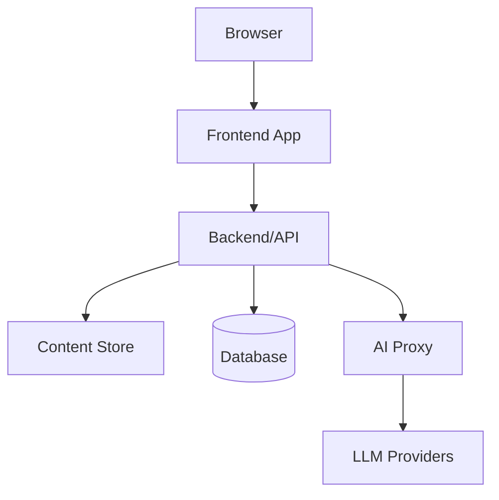
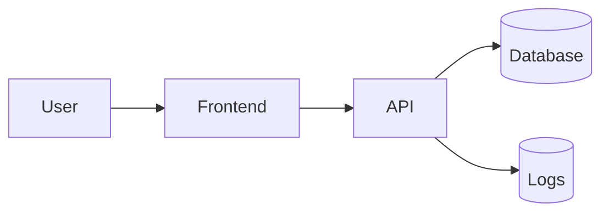
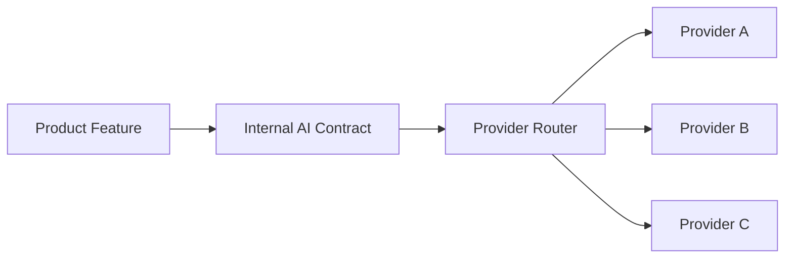

# Webportal Solution Concept Standard

## 1. Purpose

Этот стандарт задает структуру **Solution Concept (L3)** для веб-порталов.
Solution Concept отвечает на вопрос **как реализовать утвержденную Product
Concept (L2)**: какую систему строим, из каких частей она состоит, с чем
интегрируется, какие данные обрабатывает, как разворачивается и какие
нефункциональные требования должна выдержать.

Документ нужен для синхронизации Пользователя, архитектора, разработчиков,
аналитиков, DevOps/SRE и AI-агентов перед началом детального дизайна и ADR.

## 2. Scope

Стандарт применяется к архитектурным и техническим концепциям веб-порталов:
публичных контентных порталов, личных кабинетов, витрин, образовательных
пространств, сообществ и app-порталов.

Solution Concept (L3) фиксирует:

- системную архитектуру;
- C4 diagrams: Context, Container и при необходимости Component;
- technology stack;
- integration points;
- data model и data flow;
- non-functional requirements;
- deployment strategy;
- risks and mitigations.

Product decisions, personas, user stories, MVP scope, user flows and product
metrics belong to L2:
[webportal-product-concept-standard.md](webportal-product-concept-standard.md).

## 3. Mandatory Sections

### 3.1. System Architecture (C4 Model)

Раздел описывает систему через C4 model. Минимально нужны Context и Container
views. Component view добавляется, когда внутри контейнера есть несколько
существенных компонентов или командных зон ответственности.

#### Context Diagram

Context Diagram показывает систему как один объект и ее внешних акторов.

Минимальный пример Mermaid:



Context view должен фиксировать:

- внешних пользователей и роли;
- внешние системы;
- доверительные границы;
- основные потоки данных;
- scope системы.

#### Container Diagram

Container Diagram показывает крупные исполняемые части решения.

Минимальный пример:



Для каждого container нужно указать:

- назначение;
- владелец или зона ответственности;
- runtime;
- основные интерфейсы;
- данные, которые container читает или изменяет;
- критичные ограничения.

#### Component Diagram

Component Diagram optional. Он нужен, если один container содержит сложные
модули, например: routing, content ingestion, search, AI orchestration,
authorization, billing, notification delivery.

Компонентный уровень не должен заменять ADR. Если решение требует выбора между
вариантами, это фиксируется отдельным ADR на L4.

### 3.2. Technology Stack

Раздел фиксирует выбранный или рекомендуемый stack и альтернативы, если решение
еще не принято.

Обязательные строки stack matrix:

| Layer | Selected Option | Alternatives | Decision Status | Rationale | Owner |
| --- | --- | --- | --- | --- | --- |
| Frontend framework | TBD | TBD | proposed | Соответствие UX, скорости разработки и поддержке команды | TBD |
| Backend framework | TBD | TBD | proposed | API, auth, jobs, integrations | TBD |
| Database | TBD | TBD | proposed | Data model, scale, backup, migration | TBD |
| Hosting | TBD | TBD | proposed | Availability, cost, deployment flow | TBD |
| AI/ML providers | Provider-agnostic layer | Multiple providers | required | Смена LLM не должна ломать продукт | TBD |
| Analytics | TBD | TBD | proposed | Метрики продукта и технические сигналы | TBD |

Для каждого выбора нужно указать:

- почему option подходит текущей фазе;
- какие alternatives рассматривались;
- какой decision status: `proposed`, `accepted`, `deferred`, `rejected`;
- какие риски создает выбор;
- какой ADR нужен для L4.

### 3.3. Integration Points

Раздел описывает внешние системы и контракты взаимодействия.

Минимальный формат:

| Integration | Purpose | Direction | Data | Auth | Failure Mode | Owner |
| --- | --- | --- | --- | --- | --- | --- |
| AI provider layer | Text generation, summarization or classification | outbound | prompt, context, response | service credentials | timeout, quota, unsafe response | platform |
| Auth provider | User identity | inbound/outbound | user identity, session | OAuth/OIDC or equivalent | login unavailable | platform |
| Analytics | Usage and product events | outbound | event payload | write key | delayed or dropped events | product/engineering |

Integration point должен фиксировать:

- назначение;
- направление вызовов;
- данные и уровень чувствительности;
- auth model;
- retry / timeout policy;
- observability;
- degradation behavior.

AI integrations must be provider-agnostic. Product code should depend on an
internal AI boundary, not on a single vendor SDK.

### 3.4. Data Model

Раздел описывает ключевые сущности, связи и потоки данных.

Обязательные элементы:

- entity list;
- entity relationship diagram or equivalent table;
- data ownership;
- storage strategy;
- retention policy;
- migration strategy;
- PII and secrets boundaries;
- data flow for critical scenarios.

Минимальный пример entity table:

| Entity | Purpose | Owner | Stored In | Retention | Sensitivity |
| --- | --- | --- | --- | --- | --- |
| User | Identity and access state | product/platform | database | account lifetime | personal data |
| Content Item | Published portal content | editorial | content store | permanent while published | public/internal |
| AI Request | Request metadata for AI operations | platform | logs or database | limited | may contain sensitive context |

Минимальный data flow:



### 3.5. Non-Functional Requirements

Раздел фиксирует требования, которые должны быть проверяемыми.

Минимальные категории:

| Category | Requirement | Target | Measurement | Phase |
| --- | --- | --- | --- | --- |
| Performance | Largest Contentful Paint | <= 2.5s on target segment | Web vitals monitoring | MVP |
| Performance | Interaction latency | <= 200ms for common UI actions | browser and backend traces | MVP |
| Availability | Public portal availability | >= 99.5% monthly | uptime monitor | MVP |
| Security | Sensitive data protection | no secrets in client bundle, encryption in transit | review + automated checks | MVP |
| Privacy | PII minimization | only necessary fields collected | data review | MVP |
| Scalability | Growth path | documented scaling trigger | load test or capacity model | Pilot |
| Accessibility | Baseline accessibility | WCAG 2.2 AA target for core flows | audit | MVP |

Для каждого NFR нужно указать:

- target value;
- measurement method;
- phase where it becomes mandatory;
- owner;
- exception policy.

### 3.6. Deployment Strategy

Раздел описывает environments, release flow, rollback and operations.

Обязательные вопросы:

- какие environments существуют: local, dev, staging, production;
- как изменения проходят CI/CD;
- какие проверки блокируют release;
- как выполняется rollback;
- как управляются configuration and secrets;
- как собираются logs, metrics and alerts;
- кто принимает production release decision.

Минимальный формат:

| Area | Decision | Status | Notes |
| --- | --- | --- | --- |
| Environments | local, staging, production | proposed | Staging mirrors production-critical integrations |
| CI/CD | Pull request checks + deploy from main | proposed | Required checks listed in project contract |
| Rollback | Previous release artifact or revert deploy | proposed | Must be tested before production |
| Secrets | Managed outside source control | required | Rotation owner documented |
| Observability | Logs, metrics, uptime alerts | proposed | MVP includes public availability monitoring |

### 3.7. Risks & Mitigations

Раздел фиксирует technical and business risks that affect implementation.

Минимальный формат:

| Risk | Type | Probability | Impact | Mitigation | Trigger | Owner |
| --- | --- | --- | --- | --- | --- | --- |
| LLM vendor lock-in | technical | medium | high | Provider-agnostic AI boundary and contract tests | adding second provider becomes expensive | platform |
| Content model does not scale | technical/business | medium | medium | Model entities before MVP and add migration path | repeated manual content fixes | product/engineering |
| Performance drops after content growth | technical | medium | high | Web vitals budgets and monitoring | LCP target missed for 2 releases | frontend |

Risks must be actionable. A risk without mitigation, trigger or owner is an
open question, not a managed risk.

## 4. Characteristics

Solution Concept (L3) должен иметь следующие свойства:

- объем: 10-50 страниц;
- язык: технический, но понятный для product stakeholders;
- includes diagrams, tables and explicit decision statuses;
- horizon: 1-2 years;
- changes when major architectural decisions change;
- separates accepted decisions from proposed or deferred decisions;
- creates L4 ADR candidates for concrete technology choices.

## 5. Provider-Agnostic Architecture

AI-related parts of a webportal must be provider-agnostic unless a human
decision explicitly accepts vendor lock-in.

Required rules:

1. Product and UI code depend on an internal AI boundary, not on a vendor SDK.
2. Provider selection is configuration-driven.
3. Provider capabilities are expressed through a small internal contract:
   input, output, limits, safety controls, error model and observability.
4. Adding a second LLM provider must not require rewriting user flows or core
   business logic.
5. Provider-specific prompts, credentials, quotas and model names are isolated
   behind the AI boundary.
6. The first provider, for example Yandex GPT, may be used for validation, but
   it is not an architectural constraint.

Recommended AI boundary:



Minimum provider matrix:

| Provider | Use Case | Status | Limits | Data Boundary | Fallback |
| --- | --- | --- | --- | --- | --- |
| Provider A | MVP validation | proposed | TBD | no unmasked sensitive data | Provider B or disabled AI feature |
| Provider B | Alternative | deferred | TBD | same contract | Provider A |

## 6. Relation to Other Standards

| Уровень | Документ | Роль |
| --- | --- | --- |
| L1 | [product-profile.md](product-profile.md) | Product Vision: long-term product strategy and value. |
| L2 | [webportal-product-concept-standard.md](webportal-product-concept-standard.md) | Product Concept: users, value, MVP, flows and metrics. |
| L3 | Этот стандарт | Solution Concept: system shape, stack, integrations, data, NFRs and deployment. |
| L4 | ADR | Technical Design: concrete decisions with alternatives and consequences. |

L3 must trace to L2. If a technical decision has no product driver, it should be
marked as optional, deferred or removed.

## 7. Examples

### 7.1. Minimal Solution Concept Structure

```markdown
# Solution Concept: <project_name>

## 1. Summary
## 2. Product Inputs from L2
## 3. System Architecture (C4)
## 4. Technology Stack
## 5. Integration Points
## 6. Data Model
## 7. Non-Functional Requirements
## 8. Deployment Strategy
## 9. Provider-Agnostic AI Architecture
## 10. Risks & Mitigations
## 11. ADR Candidates
## 12. Open Technical Questions
```

### 7.2. Phase Boundary Example

| Phase | Technical Boundary | Exit Criteria |
| --- | --- | --- |
| Phase 0: Planning | L2 accepted, L3 proposed, ADR candidates listed | No critical unknowns block MVP |
| Phase 1: MVP | Minimal architecture, one deploy path, basic observability | Core flow works and NFR MVP targets are measurable |
| Phase 2: Pilot | Hardened auth, data retention, provider fallback | Real users can use the portal with managed risk |
| Phase 3: Production | Operational runbooks, tested rollback, mature monitoring | Production support is repeatable |

### 7.3. Definition of Done

Solution Concept соответствует стандарту, если:

- C4 Context and Container views exist;
- stack matrix has selected or explicitly deferred options;
- integrations list data, auth, failure modes and owners;
- data model includes sensitivity and retention;
- NFRs are measurable;
- deployment strategy includes environments, CI/CD, rollback and secrets;
- provider-agnostic AI boundary is explicit when AI is used;
- risks have mitigation, trigger and owner;
- ADR candidates are listed for L4 decisions.
