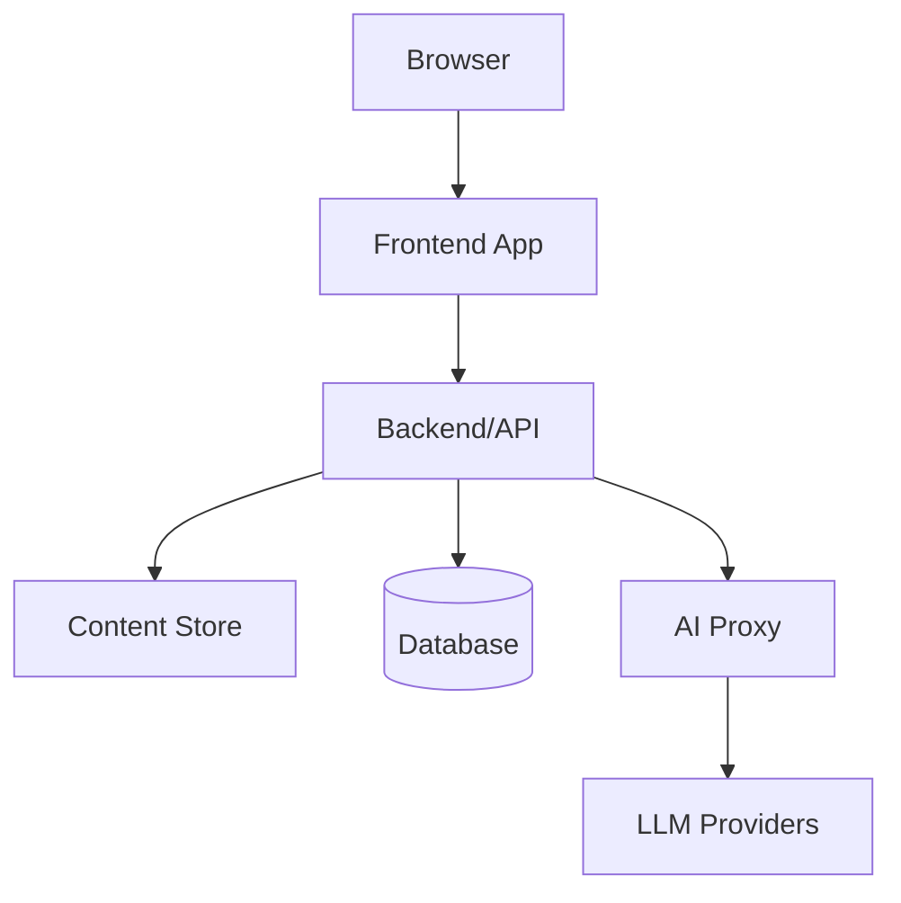
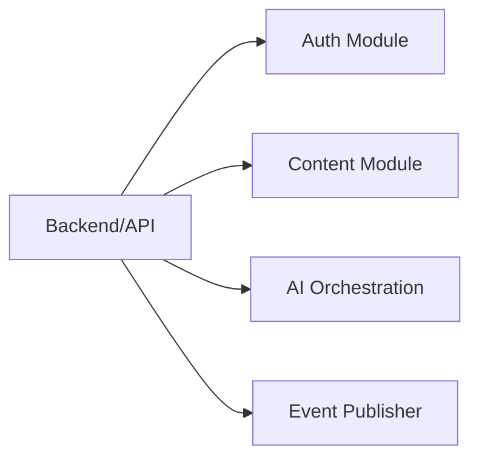
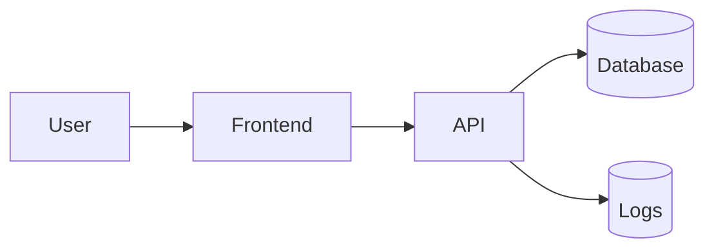
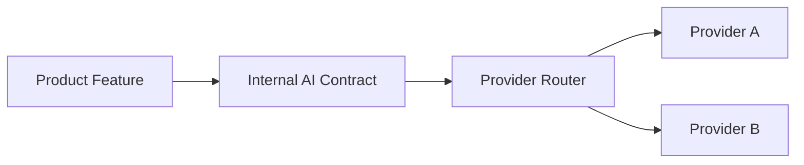

# Solution Concept: {{project_name}}

> Template aligned with
> [Webportal Solution Concept Standard]({{hub_url}}/standards/webportal-solution-concept-standard.md).
> Use it after the L2 Product Concept has enough product decisions to guide the
> system design.

## 1. Summary

State the implementation approach for {{project_name}} in 3-5 sentences:
system boundaries, main runtime parts, major integrations and the current
decision status.

Example:

> {{project_name}} is implemented as a web application with a frontend, an API
> layer, a content store, a database and a provider-agnostic AI boundary.
> MVP focuses on one core user flow, measurable performance targets and a
> reversible deployment path.

## 2. Product Inputs from L2

| L2 Input | Value | Link / Source |
| --- | --- | --- |
| Primary persona | TBD | Product Concept section 2 |
| MVP flow | TBD | Product Concept section 5 |
| North Star Metric | TBD | Product Concept section 6 |
| Product phases | TBD | Product Concept section 7 |

## 3. System Architecture (C4)

### 3.1. Context Diagram

```mermaid
flowchart LR
  user[User]
  editor[Editor]
  portal[{{project_name}}]
  analytics[Analytics]
  ai[AI Provider Layer]

  user --> portal
  editor --> portal
  portal --> analytics
  portal --> ai
```

Context notes:

- Users:
- External systems:
- Trust boundaries:
- Critical data flows:

### 3.2. Container Diagram



| Container | Responsibility | Runtime | Interfaces | Data |
| --- | --- | --- | --- | --- |
| Frontend App | User interface and client-side interactions | TBD | Browser, API | Public content, user state |
| Backend/API | Server-side operations and integration boundary | TBD | Frontend, database, AI proxy | Application data |
| Content Store | Editorial content | TBD | API, build or runtime read path | Content items |
| AI Proxy | Provider-agnostic AI access | TBD | API, LLM providers | Prompt metadata, responses |

### 3.3. Component Diagram (Optional)

Add this section only when one container needs internal component ownership.



## 4. Technology Stack

| Layer | Selected Option | Alternatives | Decision Status | Rationale | Owner |
| --- | --- | --- | --- | --- | --- |
| Frontend framework | TBD | TBD | proposed | TBD | TBD |
| Backend framework | TBD | TBD | proposed | TBD | TBD |
| Database | TBD | TBD | proposed | TBD | TBD |
| Hosting | TBD | TBD | proposed | TBD | TBD |
| AI/ML providers | Provider-agnostic layer | Multiple providers | required | Avoid vendor lock-in | TBD |
| Analytics | TBD | TBD | proposed | TBD | TBD |

ADR candidates:

- ADR-001:
- ADR-002:

## 5. Integration Points

| Integration | Purpose | Direction | Data | Auth | Failure Mode | Owner |
| --- | --- | --- | --- | --- | --- | --- |
| AI provider layer | Generation, summarization or classification | outbound | Prompt, context, response | Service credentials | Timeout, quota, unsafe response | Platform |
| Auth provider | User identity | inbound/outbound | User identity, session | TBD | Login unavailable | Platform |
| Analytics | Product and technical events | outbound | Event payload | Write key | Delayed or dropped events | Product / engineering |

Failure handling:

- Timeout policy:
- Retry policy:
- Fallback behavior:
- User-visible degradation:

## 6. Data Model

| Entity | Purpose | Owner | Stored In | Retention | Sensitivity |
| --- | --- | --- | --- | --- | --- |
| User | Identity and access state | Product/platform | Database | Account lifetime | Personal data |
| Content Item | Published portal content | Editorial | Content store | While published | Public/internal |
| AI Request | AI operation metadata | Platform | Logs or database | Limited | May contain sensitive context |



Data policies:

- PII boundary:
- Secrets boundary:
- Backup policy:
- Retention policy:
- Migration approach:

## 7. Non-Functional Requirements

| Category | Requirement | Target | Measurement | Phase |
| --- | --- | --- | --- | --- |
| Performance | Largest Contentful Paint | <= 2.5s on target segment | Web vitals monitoring | MVP |
| Performance | Interaction latency | <= 200ms for common UI actions | Browser and backend traces | MVP |
| Availability | Public portal availability | >= 99.5% monthly | Uptime monitor | MVP |
| Security | Sensitive data protection | No secrets in client bundle, encryption in transit | Review + automated checks | MVP |
| Privacy | PII minimization | Only necessary fields collected | Data review | MVP |
| Accessibility | Core flow accessibility | WCAG 2.2 AA target | Audit | MVP |

Exception policy:

- Who can approve an exception:
- How long exception can remain open:
- Where exception is tracked:

## 8. Deployment Strategy

| Area | Decision | Status | Notes |
| --- | --- | --- | --- |
| Environments | local, staging, production | proposed | Staging mirrors production-critical integrations |
| CI/CD | Pull request checks + deploy from main | proposed | Required checks listed in project contract |
| Rollback | Previous release artifact or revert deploy | proposed | Must be tested before production |
| Secrets | Managed outside source control | required | Rotation owner documented |
| Observability | Logs, metrics, uptime alerts | proposed | MVP includes public availability monitoring |

Release flow:

1. Pull request opened.
2. Required checks pass.
3. Human review approves.
4. Staging deploy is verified.
5. Production deploy is executed.
6. Monitoring is checked after release.

## 9. Provider-Agnostic AI Architecture



| Provider | Use Case | Status | Limits | Data Boundary | Fallback |
| --- | --- | --- | --- | --- | --- |
| Provider A | MVP validation | proposed | TBD | No unmasked sensitive data | Provider B or disabled AI feature |
| Provider B | Alternative | deferred | TBD | Same internal contract | Provider A |

Rules:

- Product code calls the internal AI contract.
- Provider selection is configuration-driven.
- Provider-specific credentials and model names stay behind the AI boundary.
- Adding a second provider must not rewrite core user flows.

## 10. Risks & Mitigations

| Risk | Type | Probability | Impact | Mitigation | Trigger | Owner |
| --- | --- | --- | --- | --- | --- | --- |
| LLM vendor lock-in | Technical | Medium | High | Provider-agnostic AI boundary and contract tests | Second provider becomes expensive | Platform |
| Content model does not scale | Technical/business | Medium | Medium | Model entities before MVP and add migration path | Repeated manual content fixes | Product/engineering |
| Performance drops after content growth | Technical | Medium | High | Web vitals budgets and monitoring | LCP target missed for 2 releases | Frontend |

## 11. ADR Candidates

| ADR | Decision Needed | Trigger | Owner |
| --- | --- | --- | --- |
| ADR-001 | Frontend framework | Before MVP implementation | TBD |
| ADR-002 | Hosting and deployment model | Before staging deploy | TBD |
| ADR-003 | AI provider boundary | Before first AI feature | TBD |

## 12. Open Technical Questions

- Which stack choices are accepted, proposed or deferred?
- What data must never be sent to external AI providers?
- Which NFR targets are mandatory for MVP?
- What is the rollback path for the first production deploy?
